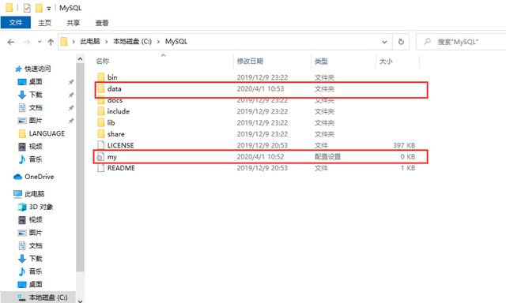
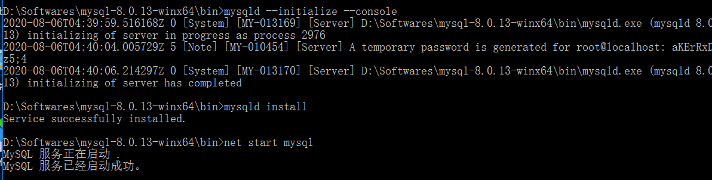

**解压安装包**

- 解压路径：D:\develop\software
- 解压后mysql根目录：D:\develop\software\mysql-8.0.13-winx64

原则： 安装目录不能有空格、不能有中文

 **配置系统环境变量**

去系统的环境变量的Path里添加一个mysql的配置 指向mysql的bin目录

- D:\develop\software\mysql-8.0.13-winx64\bin

**配置初始化的my.ini文件的文件**



```properties
[mysql]
# 设置mysql客户端默认字符集
default-character-set=utf8mb4
[mysqld]
# 设置3306端口
port=3306
# 设置mysql的安装目录
basedir=D:\\develop\\software\\mysql-8.0.13-winx64
# 设置 mysql数据库的数据的存放目录，MySQL 8+ 不需要以下配置，系统自己生成即可，否则有可能报错
# datadir=D:\\develop\\software\\mysql-8.0.13-winx64\\data
# 允许最大连接数
max_connections=20
# 服务端使用的字符集默认为8比特编码的latin1字符集
character-set-server=utf8mb4
# 创建新表时将使用的默认存储引擎
default-storage-engine=INNODB
# 默认使用“mysql_native_password”插件认证
default_authentication_plugin=mysql_native_password
```

注意：不需要设置data目录，自动生成，有的话，删除。否则报错！双斜杠！！！！！！

**初始化mysql**

注意：管理员权限运行cmd程序，否则可能报错

- 进入D:\develop\software\mysql-8.0.13-winx64\bin
- 执行 mysqld --initialize --console
- 这是一个关键的操作步骤。初始化过程中会产生一个临时的密码，需要记住该密码

**修改密码并且修改密码策略**

自动成临时密码：root@localhost: 3yMoxa?*nMrl；root@localhost: aKErRxDmz5;4
 注意：初始密码（不含首位空格）。在没有更改密码前，需要记住这个密码，后续登录需要用到。复制密码先保存起来!!!

> 注意：如果密码忘记，只要删除data文件夹即可重新设置

**注册mysql服务**

mysql安装为windows的服务：mysqld install

**启动mysql**

net start mysql；net stop mysql



**登录mysql**

mysql -uroot -p

注意：输入上面生成的临时密码 【3yMoxa?*nMrl】

**登录密码修改**

ALTER USER 'root'@'localhost' IDENTIFIED WITH mysql_native_password BY '新密码';（注意一定要有分号）即可进行密码更改。
如果要修改密码验证插件，同时修改密码（最有效的方式）