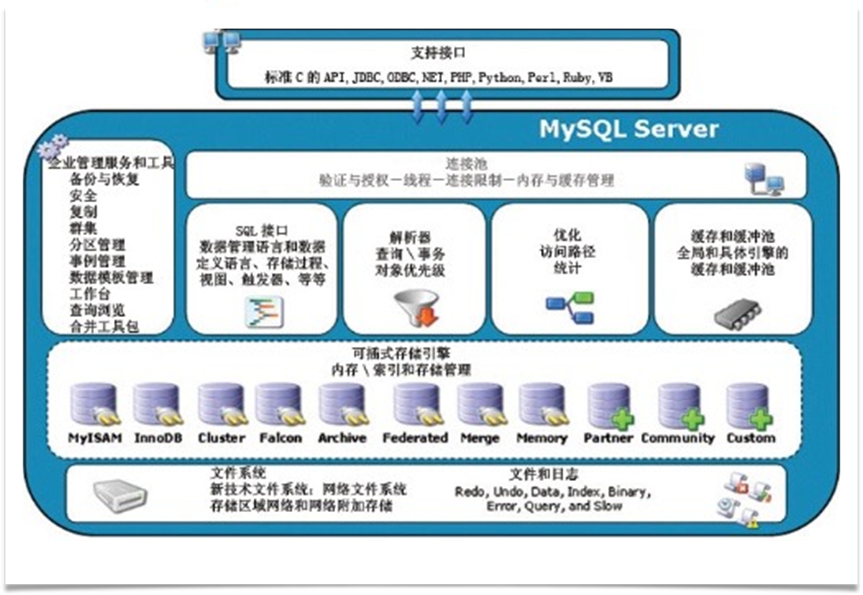
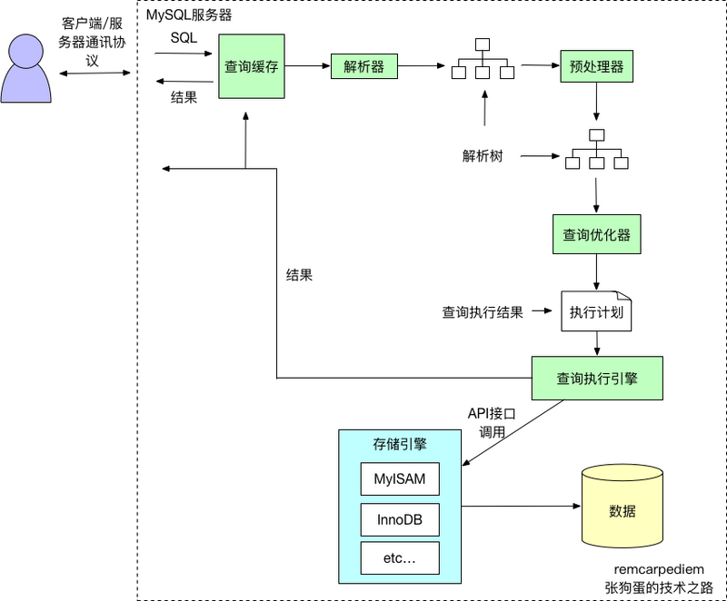
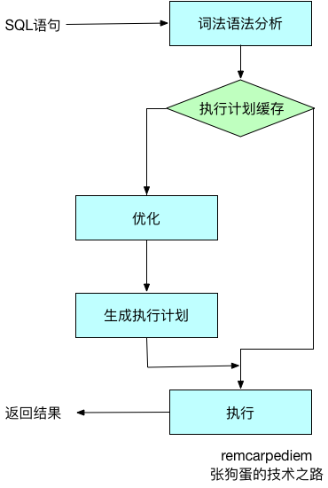
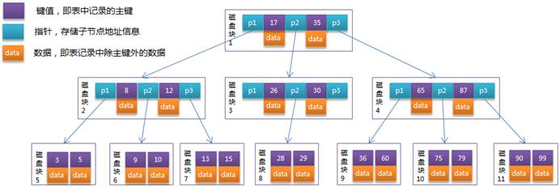
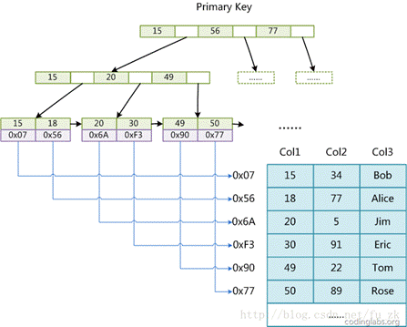
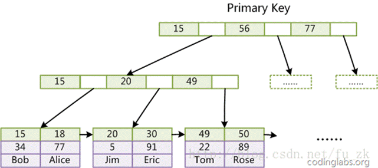
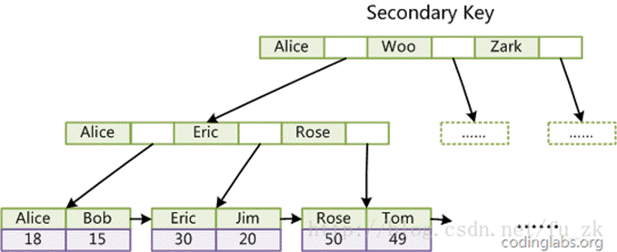
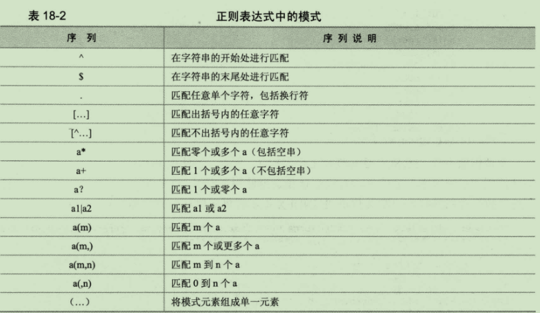

## 基本知识

- mysql下一张表两个文件

  .frm(创建，定义)和.idb(表，数据)）

- mysql单进程，多线程

**query cache module**

执行过后，缓存进cache内存，再次查询走缓存。

query cache在MySql8.0以后被删除

ACID：一致性undo保证的，持久性：日志系统

**mysql分两层**

| cpu（计算）+内存（快） | 核心层（mysqld） |
| ---------------------- | ---------------- |
| 硬盘（数据）           | 存储引擎层       |

## mysql架构

**一般互联网体系架构**

mysql（主从架构）、分布式文件服务器->分布式缓存数据库redis->应用服务器->负载均衡调度服务器->反向代理服务器->CDN服务器



**各个组件说明**

1. 支持接口

   与其他编程语言中sql语句交互

2. 管理服务工具

   系统管理和控制

3. 连接池

   管理缓冲用户连接

4. sql接口

   接受用户的sql命令，并且返回用户需要查询的结果

5. 解析器

   解析和验证sql命令。主要功能有两点：

   - 将sql语句分解成数据结构，并将这个数据结构传递到后续步骤

   - 如果在分解过程中发生错误，那么就说明这个sql语句是不合理的，语句将不会继续执行下去。

6. 优化（查询优化器）

   sql语句查询之前会使用查询优化器进行优化，并从中选出最优的方案取执行。

7. 缓存和缓冲池

   如果缓存中有查询结果，查询语句则直接取查询缓存中取结果。

8. 存储引擎

   **存储引擎是mysql中具体与文件交互的系统**。在mysql中存储引擎是**插件式**的，它根据一个公共的文件访问层**抽象接口**来定制一种文件访问机制。（这种访问机制就叫存储引擎，即多态）

## sql语句

**sql语句执行过程**

首先程序的请求会通过mysql的connectors与其进行交互，请求到达后，会暂时存放在连接池中并由处理器管理。当该请求从等待队列进入到处理队列，管理器会将该请求丢给sql接口。sql接口接收到请求后，它会将请求进行hash处理并与缓存中的结果进行对比，如果完全匹配则通过缓存直接返回处理结果；否则，按如下步骤进行执行：

1. sql接口将请求转发给**解释器进行处理（解析依靠cpu）**，解释器会判定sql语句是否正确，若正确则将其**转化为数据结构**

2. 解释器处理完，便来到后面的**优化器**，它会产生多重执行计划，最终数据库会选择最优化的方案取执行，尽快返回结果。

   **执行->耗的是硬盘。在引擎中取出来（除了执行，其他都是在服务层） **

   **获取：如果有排序，在用户内存中排序。**

3. 确定执行计划后，sql语句此时便可以交存储引擎处理，**存储引擎会从存储设备中取得相应的数据**，并原路返回给程序。





**sql语句执行步骤：解析->优化->执行->引擎层取数据**

1. 客户端发送一条查询给服务器

2. 服务器先检查查询缓存，如果命中了缓存，则立刻返回存储在缓存中的结果 否则进入下一阶段

3. 服务器端进行SQL解析、预处理，再由优化器生成对应的执行计划。

   **解析。解析的产物是执行计划。主要依靠cpu。**

   主要包括两部分：词法解析（对表和条件的判断）和语法解析（语句正确与否）

   优化的结果是生成执行计划。

4. MySQL根据优化器生成的执行计划，再调用存储引擎（**mysql5.0以后引擎默认为innodb**）的API来执行查询
5. 将结果返回给客户端


### 查询缓存 

MySQL查询缓存保存查询返回的完整结构。当查询命中该缓存时，MySQL会立刻返回结果，跳过了解析、优化和执行阶段。

查询缓存系统会跟踪查询中涉及的每个表，如果这些表发生了变化，那么和这个表相关的所有缓存数据都将失效。

MySQL将缓存存放在一个引用表中，通过一个哈希值引用，这个哈希值包括了以下因素，即查询本身、当前要查询的数据库、客户端协议的版本等一些其他可能影响返回结果的信息。

当判断缓存是否命中时，MySQL不会进行解析查询语句，而是直接使用SQL语句和客户端发送过来的其他原始信息。所以，任何字符上的不同，例如空格、注解等都会导致缓存的不命中。

### 解析和预处理

解析器通过关键字将SQL语句进行解析，并生成对应的解析树。 MySQL解析器将使用MySQL语法规则验证和解析查询。

预处理器则根据一些MySQL规则进行进一步检查解析书是否合法，例如检查数据表和数据列是否存在，还会解析名字和别名，看看它们是否有歧义。

session：idel session ；active  session 125个就很危险

**主要包括两部分：词法解析（对表和条件的判断）和语法解析（语句正确与否）**

### 查询优化器 

查询优化器会将解析树转化成执行计划。一条查询可以有多种执行方法，最后都是返回相同结果。优化器的作用就是找到这其中最好的执行计划。

生成执行计划的过程会消耗较多的时间，特别是存在许多可选的执行计划时，如果在一条SQL语句执行的过程中将该语句对应的最终执行计划进行缓存，当相似的语句再次被输入服务器，就可以直接使用已缓存的执行计划，从而跳过SQL语句生成执行计划的整个过程，进而可以提高语句的执行速度。




### 查询执行引擎

在解析和优化阶段，MySQL将生成查询对应的执行计划，MySQL的查询执行引擎根据这个执行计划来完成整个查询**。这里执行计划是一个数据结构**，而不是和其他的关系型数据库那样生成对应的字节码。


**依赖存储引擎不同会有以下不同**

- **存储方法** – 每张表中的数据按其自身的方法进行存储。
- **事务处理能力** – 某些存储引擎可以对事务进行处理，在执行多SQL语句时能确保数据库的完整性。
- **锁** – 是指每个引擎对于多线程执行场景中同一个资源的访问限制及同步机制处理。
- **备份恢复** – 基于不同的存储方法，表数据的备份和恢复也有区分。
- **优化** – 对于数据存储的优化和通过MySQL服务器的数据抽取，每个存储引擎都有其特定的优化点。
- **特定特性** – 某些引擎具有一些不同的特性包括全文搜索，参照完整性和处理空间数据的能力。

### 返回结果给客户端

如果查询可以被缓存，那么MySQL在这个阶段页会将结果存放到查询缓存中。

MySQL将结果集返回给客户端是一个增量、逐步返回的过程。在查询生成第一条结果时，MySQL就可以开始向客户端逐步返回结果集了。

## 如何从引擎层取数据(InnoDB)

**InnoDB，如果没有主键，会用第一个非空且唯一的列，如果没有，会建立隐藏列（6个字节）**

**myisam，不支持事务。InnoDB，支持行锁**

- ##### InnoDB buffer pool

  mysql中存在内存池（内存中申请）
  InnoDB buffer pool（整个系统的70%），以**LRU**链表存放数据，mysql数据库不是按行读取，而是按页读取，每页16k----一个page（页）。

  **innoDB buffer pool 存储索引和数据**

  

  **防止LRU污染，InnoDB对LRU进行优化**

  在LRU中设置了midpoint，默认情况下数据插入在LRU列表的5/8处，可以由参数innodb_old_blocks_pct（动态、global）控制，默认值为37。midpoint之前称之为new sublist（young）（热点数据），midpoint之后称之为old sublist（old）

  第一次读取放在midpoint之后，第二次读取才认为是热数据放在midpoint之前，规则

- 预热

  warm up目的是为了将空的内存填充部分常用数据，防止突然大量数据访问IO

- 内存竞争的解决方案

  （并发）多个相同请求竞争同一内存块？
  innodb_buffer_pool_instances，将innodb_buffer_pool分成几块；单cpu，情况下，内存竞争少，所以innodb_buffer_pool_instances参考cpu数量（cpu同一时间只能处理一个请求）。

- order by(排序)

  每个用户会有自己的内存：sort buffer 、join buffer、MRR等。

  一个用户建立连接后，会生成私有内存空间，sort buffer和join buffer

  如果sql语句有排序数据取出至innodb buffer之后，要在sort buffer中进行排序。

- 脏数据处理

  当我update数据时，从磁盘读数据到innodb buffer pool，在里面修改，但此时磁盘数据没有变，这个在innodb buffer pool的数据为脏数据。

  处理：mysql内的线程io_write_thread：写脏数据到磁盘，和cpu数量有关，一般是16/32，8个cpu=1个io_write_thread。每次commit都写io，那么访问太多。**所以写脏数据和commit无关，看当前io压力**。写脏数据和用户提交无关。

  mysql是自动提交的，可改变，set gloabal autocommit="OFF"，关掉自动提交。

- undo：解决一致性，事务处理

  存储引擎中有ibdata1（磁盘中的文件），其中的UNDO中放着没有commit修改之前的数据。

  | 内存中的数据包     |              |      |
  | ------------------ | ------------ | ---- |
  | 是否在事务中       | UNDO中的地址 | 数据 |
  | **ibdata数据格式** |              |      |
  | 是否在事务中       | UNDO中的地址 |      |

  undo中的值为数据前镜像

  undo作用有两个：1、数据回滚的值 2、维护数据一致性

  update或者delete语句没有where条件时，Undo以及ibdata（磁盘上）可能会被撑的很大，恢复不了，磁盘可能被UNDO都占用。

- Innodb_flush_log_trx_commit（undo数据刷到磁盘中，防止多次IO）

  =1，严格遵循commit，提交一次。绝对安全。

  **=0，一秒钟刷一次，可能丢失一秒钟的数据。**

  =2，将commit的数据放在操作系统的缓存中，一秒将操作系统内存中的数据刷入硬盘。

- log buffer：日志缓存

  日志先行-Write head log（WHL），日志是为了灾难恢复，一定要落盘（写在磁盘中）， **commit将日志永久性的保存在磁盘中。 **

  log buffer原则：达到1/2或1M或commit时，刷到磁盘中（log_thread）。

  **mysql启动时会做实例恢复，依据redo日志进行实例恢复**

  如果没有commit，但是写到了磁盘中，这时，数据库崩了，恢复后，数据库会自动把没有commit的事务rollback。

  

  ib_logfile0 和ib_logfile1，都叫redo log（重做的日志，log buffer中的所有日志），记录所有的脏数据。

  当redo日志满了，且不能进行覆盖时（原因：io_write_thread还没写脏数据），数据库会hung住，无法修改数据。
  解决方案：是redo日志变大或者redo日志文件增加

  ------

  show engine innodb status：看系统thread

  关系型数据库无法避免的问题：

  log buffer中的数据来不及写入磁盘而被充满，og_thread只有一个

  减小提交频率，分流

## 执行计划的阅读

> Explain查询最终执行计划，不执行任何语句

1. id

   SELECT简单识别符。这是SELECT的查询序列号

   我的理解是SQL执行的顺序的标识，SQL从大到小的执行

   1. id相同时，执行顺序由上至下

   2. 如果是子查询，id的序号会递增，id值越大优先级越高，越先被执行

   3. id如果相同，可以认为是一组，从上往下顺序执行；在所有组中，id值越大，优先级越高，越先执行

```sql
-- 查看在研发部并且名字以Jef开头的员工，经典查询
explain select e.no, e.name from emp e left join dept d on e.dept_no = d.no where e.name like 'Jef%' and d.name = '研发部';
```


 

2. select_type：查询中每个select子句的类型

   (1) SIMPLE(简单SELECT，不使用UNION或子查询等)

   (2) PRIMARY(子查询中最外层查询，查询中若包含任何复杂的子部分，最外层的select被标记为PRIMARY)

   (3) UNION(UNION中的第二个或后面的SELECT语句)

   (4) DEPENDENT UNION(UNION中的第二个或后面的SELECT语句，取决于外面的查询)

   (5) UNION RESULT(UNION的结果，union语句中第二个select开始后面所有select)

   (6) SUBQUERY(子查询中的第一个SELECT，结果不依赖于外部查询)

   (7) DEPENDENT SUBQUERY(子查询中的第一个SELECT，依赖于外部查询)

   (8) DERIVED(派生表的SELECT, FROM子句的子查询)

   (9) UNCACHEABLE SUBQUERY(一个子查询的结果不能被缓存，必须重新评估外链接的第一行)

 

3. table

   显示这一步所访问数据库中表名称（显示这一行的数据是关于哪张表的），有时不是真实的表名字，可能是简称，例如上面的e，d，也可能是第几步执行的结果的简称

 

4. type

   对表访问方式，表示MySQL在表中找到所需行的方式，又称“访问类型”。

   常用的类型有： **ALL、index、range、 ref、eq_ref、const、system、NULL（从左到右，性能从差到好） **

   ALL：Full Table Scan， MySQL将遍历全表以找到匹配的行

   index: Full Index Scan，index与ALL区别为index类型只遍历索引树

   range:只检索给定范围的行，使用一个索引来选择行

   ref: 表示上述表的连接匹配条件，即哪些列或常量被用于查找索引列上的值

   eq_ref: 类似ref，区别就在使用的索引是唯一索引，对于每个索引键值，表中只有一条记录匹配，简单来说，就是多表连接中使用primary key或者 unique key作为关联条件

   const、system: 当MySQL对查询某部分进行优化，并转换为一个常量时，使用这些类型访问。如将主键置于where列表中，MySQL就能将该查询转换为一个常量，system是const类型的特例，当查询的表只有一行的情况下，使用system

   NULL: MySQL在优化过程中分解语句，执行时甚至不用访问表或索引，例如从一个索引列里选取最小值可以通过单独索引查找完成。

 

5. possible_keys

   **指出MySQL能使用哪个索引在表中找到记录，查询涉及到的字段上若存在索引，则该索引将被列出，但不一定被查询使用（该查询可以利用的索引，如果没有任何索引显示 null）**

   该列完全独立于EXPLAIN输出所示的表的次序。这意味着在possible_keys中的某些键实际上不能按生成的表次序使用。
   如果该列是NULL，则没有相关的索引。在这种情况下，可以通过检查WHERE子句看是否它引用某些列或适合索引的列来提高你的查询性能。如果是这样，创造一个适当的索引并且再次用EXPLAIN检查查询

    

6. Key

   **key列显示MySQL实际决定使用的键（索引），必然包含在possible_keys中**

   如果没有选择索引，键是NULL。要想强制MySQL使用或忽视possible_keys列中的索引，在查询中使用FORCE INDEX、USE INDEX或者IGNORE INDEX。

   In(“sd”,”fg”)，分为两条执行判断。

 

7. key_len

   **表示索引中使用的字节数，可通过该列计算查询中使用的索引的长度（key_len显示的值为索引字段的最大可能长度，并非实际使用长度，即key_len是根据表定义计算而得，不是通过表内检索出的）**

   不损失精确性的情况下，长度越短越好 

   用了复合索引，但没用全，只显示用的部分长度。

 

8. ref

   列与索引的比较，表示上述表的连接匹配条件，即哪些列或常量被用于查找索引列上的值，const, 常数值；func, 函数表达式

   

9. rows

   估算出结果集行数，表示MySQL根据表**统计信息及索引选用情况**，估算的找到所需的记录所需要读取的行数，不是很准。

   

10. Filtered

    过滤率，过滤率越低，sql越有优化的空间。从统计信息得到的。

    

11. Extra

    该列包含MySQL解决查询的详细信息,有以下几种情况：

    Using where:不用读取表中所有信息，仅通过索引就可以获取所需数据，这发生在对表的全部的请求列都是同一个索引的部分的时候，表示mysql服务器将在存储引擎检索行后再进行过滤

    Using temporary：表示MySQL需要使用临时表来存储结果集，常见于排序和分组查询，常见 group by ; order by

    **using index ：表示使用了索引覆盖优化**

    Using filesort：当Query中包含 order by 操作，而且无法利用索引完成的排序操作称为“文件排序”

    ```
    -- 测试Extra的filesort
    explain select * from emp order by name;
    ```

    Using join buffer：改值强调了在获取连接条件时没有使用索引，并且需要连接缓冲区来存储中间结果。如果出现了这个值，那应该注意，根据查询的具体情况可能需要添加索引来改进能。

    Impossible where：这个值强调了where语句会导致没有符合条件的行（通过收集统计信息不可能存在结果）。

    Select tables optimized away：这个值意味着仅通过使用索引，优化器可能仅从聚合函数结果中返回一行

    No tables used：Query语句中使用from dual 或不含任何from子句


CTAS建表方法 create table cityex as select * from city;

## 数据库的索引

### 8.1 为什么需要索引?

当数据保存在**磁盘类存储介质上**时，它是作为**数据块存放**。这些数据块是被当作一个整体来访问的，这样可以保证操作的原子性。**硬盘数据块存储结构类似于链表，**都包含数据部分，以及一个指向下一个节点（或数据块）的**指针，**不需要连续存储。
记录集只能在某个关键字段上进行排序，所以如果需要在一个无序字段上进行搜索，就要执行一个线性搜索（Linear Search）的过程，**平均需要访问N/2的数据块，**N是表所占据的数据块数目。如果这个字段是一个非主键字段（也就是说，不包含唯一的访问入口），那么需要在N个数据块上搜索整个表格空间。


但是对于一个有序字段，可以运用二分查找（Binary Search），这样只要访问log2 (N)的数据块。这就是为什么性能能得到本质上的提高。

索引列表是B*类树的数据结构，查询的时间复杂度为O(log2\N)，定位到特定值得行就会非常快，所以其查询速度就会非常快。

 

**数据库查询只能用到一个索引**，和全表扫描/只使用一个索引的速度比起来，去分析两个索引二叉树更加耗费时间，所以绝大多数情况下数据库都是是用一个索引。

**数据库索引的存在，可能导致相关字段删除的效率降低；**

### 8.2 什么是索引?

> **索引是对记录集的多个字段进行排序的方法。**在一张表中为一个字段创建一个索引，将创建另外一个数据结构，**包含字段数值以及指向相关记录的指针，**然后对这个**索引结构**进行排序，允许在该数据上进行二分法排序。 

这就是为什么一个表只能有一个主键， 一个表只能有一个**「聚集索引」ID**，因为主键的作用就是把「表」的数据格式转换成「索引（平衡树）」的格式放置。


假如给user表的name字段加上索引 ， 那么索引就是**由name字段中的值构成**，在数据改变时， DBMS需要一直维护索引结构的正确性。如果给表中多个字段加上索引 ， 那么就会出现**多个独立的索引结构**，每个索引（非聚集索引）互相之间不存在关联。 

#### 二级索引（辅助索引）

> 首先，通过非聚集索引查找符合条件的所有记录的主键ID值；然后，通过得到的主键ID值执行**聚集索引**查找，找到主键ID值对就的真实数据（数据行）存储的位置。最好筛选取得最终的结果。
>

聚簇索引的叶子节点存储了一行完整的数据，而二级索引只存储了**主键值**，相比于聚簇索引，占用的空间要少。

**缺点**

- 创建索引和维护索引要耗费时间，这种时间随着数据量的增加而增加。
- 索引需要占物理空间，除了数据表占数据空间之外，每一个索引还要占一定的物理空间，如果要建立聚簇索引，那么需要的空间就会更大。
- 当对表中的数据进行增加、删除和修改的时候，索引也要**动态的维护**，这样就降低了数据的维护速度。
- **回表查询**，先定位主键值，再定位行记录，它的性能较扫一遍索引树更低。


**减少回表查询**

**索引覆盖**：只需要在一棵索引树上就能获取SQL所需的所有列数据，无需回表，速度更快。
**常见的方法是**：将被查询的字段，建立到联合索引里去。


**辅助索引范围扫描的一种优化方式**

**MRR：multi range read**

辅助索引范围查询数据先缓存，在从主键索引中查找

read_rnd_buffer_size MRR的大小，自动不开启

**显示优化器各种优化算法开关**

```sql
show variable 'optimizer_switch';  
```

**启动MRR**

```sql
set optimizer_switch = "mrr_cost_based= off";
```

****

MRR是对二级索引查找的优化，会分配一个mrr_read_rnd_buffer。

### 8.3 索引类型

#### 不同的索引

1. 普通索引：  normal

   ```sql
   CREATE INDEX 索引的名字 ON tablename (列名1，列名2,...);
   ```

2. 唯一索引：  UNIQUE 

   ```sql
   CREATE UNIQUE INDEX 索引的名字 ON tablename (列的列表);
   ```

   但有一个区别：索引列的所有值都只能出现一次，即必须唯一。**唯一索引可以建多个**。

   

   **唯一索引好，还是普通索引好？**

   **查询**：普通索引比唯一索引多做了一次内存搜索和判断(不知道后面值是否一致)，性能相差微乎其微！

   **更新**：**change buffer（innodb_buffer_pool中子集 **），将操作统一输入到磁盘的时候，会将每个表的操作集合，一起操作。唯一索引：修改时要判断唯一性；普通索引：修改时不需要读取记录。

   - change buffer不适用于写后读操作

     将数据从磁盘读入内存涉及随机 IO 的访问，是数据库里面成本最高的操作之一。change buffer 将修改操作聚集在一起后，一起操作，这样减少了随机磁盘访问，所以对更新性能的提升是会很明显的。

   唯一索引，change buffer失效，因为需要保持唯一性。Change buffer 好处减少io次数。

   **建普通索引优于建立唯一索引。**

   redo log 主要节省的是随机写磁盘的 IO 消耗（转成顺序写），而 change buffer 主要节省的则是随机读磁盘的 IO 消耗。

3. 主键索引（聚集索引）：  primary key 主键：一种唯一性索引

   主键是一种唯一性索引，但它必须指定为“PRIMARY KEY”。

   主键一般在创建表的时候指定，通过修改表的方式加入主键

4. 单列索引和多列索引 （联合索引）

   单列索引在查询时，执行计划可能不走索引。Mysql强制走索引，select * from test force index(idx_name) where name!=”jack”；5.7.27的版本中，！=和Is null、is not null可以走索引。

   总结：多列索引只有在where条件中**含有索引中的首列字段时才有效** 

   **Mysql鼓励使用联合索引，减少回表，回表造成的原因：辅助索引得到主键索引值，重新查找。**

5. 全文搜索的索引: full text 可以在char、varchar或text类型的列上创建。 （**解决海量数据模糊查询**）

   **全文索引**是一种特殊类型的**基于标记的功能性索引**，由全文引擎（MSFTESQL）服务创建和维护，首先在索引创建方面，全文索引不是针对表中某一特定行数据值来构造B树结构，而是基于要索引的文本中的各个标记来创建**倒排、堆积且压缩索引结构**。

6. 前缀索引

   MySQL 前缀索引能有效减小索引文件的大小，提高索引的速度。但是前缀索引也有它的坏处：MySQL 不能在 ORDER BY 或 GROUP BY 中使用前缀索引，也不能把它们用作覆盖索引(Covering Index)。

   ```
   ALTER TABLE table_name ADD KEY(column_name(prefix_length));
   ```


**总结**:
索引的类别由**建立索引的字段内容特性**来决定，通常normal最常见。


#### 聚集索引和非聚集索引

- 非聚集索引：表数据存储顺序与索引顺序无关。对于非聚集索引，**叶结点包含索引字段值及指向数据页数据行的逻辑指针**，其行数量与数据表行数据量一致。

- 聚集索引（也叫聚簇索引，主键索引）：cluster（**聚簇索引并不是一种单独的索引类型，而是一种数据存储方式**。）


聚集索引**确定表中数据的物理顺序**。聚集索引类似于电话簿，后者按姓氏排列数据。由于**聚集索引规定数据在表中的物理存储顺序**，因此**一个表只能包含一个聚集索引**。

**物理顺序和逻辑顺序一致**


聚簇索引的叶子节点就是**数据节点**，而**非聚簇索引的叶子节点仍然是索引节点**，只不过有指向对应数据块的指针。

 

**innodb**的次索引指向对主键的引用 (聚簇索引)

**myisam**的次索引和主索引都指向物理行 (非聚簇索引)

### 8.4 什么时候使用索引

- **最左前缀匹配原则**，**组合索引非常重要的原则**，mysql会一直向右匹配直到遇到范围查询(>、<、between、like)**就停止匹配，**比如a = 1 and b = 2 and c > 3 and d = 4 如果建立(a,b,c,d)顺序的索引，d是用不到索引的，如果建立(a,b,d,c)的索引则都可以用到，a,b,d的顺序可以任意调整。

  **使用两个单独索引不如建立一个复合索引。**

- **如果对三个字段建立联合索引，如果第二个字段没有使用索引，第三个字段也使用不到索引了**

- 两个字段（name,age）建立联合索引，如果where age=12这样的话，是没有利用到索引的，**没有第一个索引。**

  **原理：**B+树，每个节点含有多个关键字，排序时按照多个关键字的顺序进行排序。而这个顺序就是你创建索引时候的顺序~**首先按第一个索引排序，如果第一个索引相同，那就按第二个索引排序，以此类推**

- 在**经常需要搜索**的列上，可以加快搜索的速度；

- 在作为主键的列上，**强制该列的唯一性**和组织表中数据的排列结构；表的主键、外键必须有索引；

- 在经常需要**根据范围进行搜索的列上创建索引**，因为索引已经排序，其指定的范围是连续的；

- 在经常**需要排序的列上创建索引**，因为索引已经排序，这样查询可以利用索引的排序，加快排序查询时间；

- 经常用group by，建个索引，字段会自动排序，直接查询链表

- 在经常使用在**WHERE**子句中的列上面创建索引，加快条件的判断速度**。在经常用在**连接join的列上，这些列主要是一些外键，可以加快连接的速度；

- 使用**短索引（数据量少）**，如果对字符串列进行索引，应该指定一个前缀长度，可节省大量索引空间，提升查询速度。

- 数据量超过300的表应该有索引；

- 选择度与统计信息，选择度高的建索引；
  统计信息(oracle只有40%到60%正确率，mysql较高80%左右)存在.frm中。
  表索引信息存在.idb，有时候统计信息不及时，我们可以手动收集统计信息：Analyze table test1；手动收集test1的统计信息。
  查看统计信息：show index from test1；查看走索引的列；cardinaliy标记选择度。
  Eg：id:1000/1000 性别2/1000


**建立索引的基础：**

- 因为索引需要logn次IO找叶节点，然后再一次IO去真正找数据。 

- 而不用索引每次查找都要一次IO，所以数据行为N时，不使用索引要N次IO，使用索引，假设索引包括M行数据，则需要（logn + 1）* N/M次，当两者相等时效率相近，否则不同。


**不建立索引:**

- 当修改性能远远大于检索性能时，不应该创建索引。

- 对于那些只有很少数据值的列也不应该增加索引。

- 对于那些在查询中很少使用或者参考的列不应该创建索引。

- 对于那些定义为text, image和bit数据类型的列不应该增加索引。

- 如果MySQL预计使用全表扫描要比使用索引快，则不使用索引

- 索引不会包含有NULL值的列

- **强制走索引** 

  ```sql
  select * from test force index(idx_name) where name is null
  ```


### 8.5 索引失效的条件

1. **最左前缀匹配原则组合索引非常重要的原则**
2. **条件中用or**，即使其中有条件带索引，也不会使用索引查询（这就是查询尽量不要用or的原因，用in吧）
3. 对于多列索引，不是使用的第一部分（最左），则不会使用索引。
4. 如果列类型是字符串，字符数据，那一定要在条件中将数据使用引号引用起来，否则不会使用索引
5. **where中有函数，不要在列上进行运算**
6. like “%aaa%” 不会使用索引（全表扫描），而like “aaa%”可以使用索引。
7. 所有不等于（！= /<>/not in），不走索引。
8. Is null，is not null，不走索引。索引里面不存空值的。


### 8.6 B-树、B+树和哈希

> **考量索引性能，就要考虑索引树高。当找的数据少的时候，可以用索引。当读取大量数据时，索引就不好用了。**
>
> B树：有序数组+平衡多叉树； 查询性能不固定，小于走左结点，大于走右结点；
>
> B+树：有序数组链表+平衡多叉树；都是子节点


**有序数组**

- 支持范围查询
- 插入更新效率极差
- 有序数组索引只适用于静态存储引擎


**二叉搜索树**

- 根和分支不存数据
- 减少索引体积


**平衡二叉树不适合作为索引呢？**

- 二叉导致树高，效率极差
- 平衡二叉树结构，指的是逻辑结构上的平衡二叉树，**其物理实现是数组**。
- **数组在内存中占据连续的字节单元。逻辑结构不知道**
- 然后由于在**逻辑结构上相近的节点在物理结构上可能会差很远**。因此，每次读取的磁盘页的数据中有许多是用不上的。因此，查找过程中要进行许多次的磁盘读取操作。


**N叉搜索树**

- N的大小取决于数据块的大小，一次IO读取16K,所以节点数据量要小，读取更多索引
- 树高即读取IO次数

#### B-树



B-Tree中的每个节点可以包含**大量的关键字信息**和**分支。**

#### B+树

**每个索引在innoDB中都对应一棵B+树**

B+树的**关键字全部存放在叶子节点中（卫星数据，即行数据），**非叶子节点用**来做索引**，而叶子节点中**有一个指针指向下一个叶子节点**（**链表**）。做这个优化的目的是为了提高**区间访问的性能**。而正是这个特性决定了B+树更适合用来存储外部数据。


 **索引的维护**

- b+树为了维护索引有序性，在插入新值的时候需要做必要的维护。

- 数据页满，可能产生**页分裂**

- 某些开发规范，建表语句里一定要有自增主键。

  NOT NULL PRIMARY KEY AUTO_DCREMENT

  **好处：**

  不涉及挪动其他记录，也不会触发对于叶子节点的分裂。

  显然，主键长度越小，普通索引的叶子节点就越小，普通索引占用的空间也就越小。

  从性能和存储空间方面考量，自增主键往往是更合理的选择。

  覆盖索引是常用的一种优化手段，可以减少回表


**B+树优点**

- B+树的内部结点并没**有指向关键字具体信息的指针，相对B树更小**。B+树中间节点**没有卫星数据**，所以同样大小的磁盘页上可以容纳更多节点元素，相对来说IO读写次数也就降低了。
- B+树的查询必须最终找到叶子节点，查询效率相当。而B-树只需要找到匹配的元素即可**，**B-树只能依靠繁琐的中序遍历，而B+树只需要在链表上遍历即可。
- B+树只要遍历叶子节点就可以实现整棵树的遍历。而且在数据库中基于范围的查询是非常频繁的，而B-树不支持这样的操作（或者说效率太低）。
- 在执行范围查询时，采用的是每次都从根查起，用不了叶与叶之间的链表顺序连接。为的是满足其他不支持索引的存储引擎，满足通用性。


#### 哈希索引 

> **哈希索引就是采用一定的哈希算法**，把**键值**换算成新的哈希值，检索时不需要类似B+树那样从根节点到叶子节点逐级查找，**只需一次哈希算法**即可立刻定位到相应的位置，速度非常快。


**局限性**

- 散列冲突
- **Hash索引仅仅能满足"="和"<=>"等值查询。如果键值不是唯一的，就需要先找到该键所在位置，然后再根据链表往后扫描，直到找到相应的数据；**
- 如果是范围查询检索，这时候哈希索引就毫无用武之地了
- 哈希索引也没办法利用索引完成排序

 

### 8.7 索引实现

#### MyISAM索引实现

MyISAM引擎使用B+Tree作为索引结构，**叶结点的data域存放的是数据记录的地址**。下面是MyISAM索引的原理图：


 


这里设表一共有三列，假设我们以Col1为主键，则上图是一个MyISAM表的主索引（Primary key）示意图。可以看出**MyISAM的索引文件仅仅保存数据记录的地址**。在MyISAM中，**主索引和辅助索引（Secondary key）在结构上没有任何区别，只是主索引要求key是唯一的，而辅助索引的key可以重复**。如果我们在Col2上建立一个辅助索引。

同样也是一颗B+Tree，data域保存数据记录的地址。**因此，MyISAM中索引检索的算法为首先按照B+Tree**搜索算法搜索索引，如果指定的Key存在，则取出其data域的值，然后以data域的值为地址，读取相应数据记录。

MyISAM的索引方式也叫做“非聚集”的，之所以这么称呼是为了与InnoDB的聚集索引区分。

**注意：**

主索引和辅助索引都是B+树，叶子节点都存储的是数据记录的地址，索引文件和数据文件是分离的，主索引和辅助索引都不会影响数据文件。

#### InnoDB索引实现

虽然InnoDB也使用B+Tree作为索引结构**。**

第一个重大区别是InnoDB的数据文件本身就是索引文件。从上文知道，MyISAM索引文件和数据文件是分离的，索引文件仅保存数据记录的地址。而在InnoDB中，表数据文件本身就是按B+Tree组织的一个索引结构，这棵树的叶结点data域保存了完整的数据记录。这个索引的key是数据表的主键，因此InnoDB表数据文件本身就是主索引。



可以看到**叶结点包含了完整的数据记录。**这种索引叫做聚集索引。因为InnoDB的数据文件本身要按主键聚集，所以InnoDB要求表必须有主键（MyISAM可以没有）。如果没有主键，MySQL自动为InnoDB表生成一个隐含字段作为主键，这个字段长度为**6个字节，类型为长整形。**

 

第二个与MyISAM索引的不同是 InnoDB的辅助索引data域存储相应记录主键的值而不是地址。换句话说，InnoDB的所有辅助索引都引用主键作为data域。例如，下图为定义在Col3上的一个辅助索引：


 


这里以英文字符的ASCII码作为比较准则。**聚集索引这种实现方式使得按主键的搜索十分高效，但是辅助索引搜索需要检索两遍索引：首先检索辅助索引获得主键，然后用主键到主索引中检索获得记录。**

 

如知道了InnoDB的索引实现后，就很容易明白为什么不建议使用过长的字段作为主键，因为所有辅助索引都引用主索引，过长的主索引会令辅助索引变得过大。再例如，用非单调的字段作为主键在InnoDB中不是个好主意，因为InnoDB数据文件本身是一颗B+Tree，非单调的主键会造成在插入新记录时数据文件为了维持B+Tree的特性而频繁的分裂调整，十分低效，而使用自增字段作为主键则是一个很好的选择。

 

| **树**        | **区别**                                                     |
| ------------- | ------------------------------------------------------------ |
| 红黑树        | 增加，删除，红黑树会进行频繁的调整，来保证红黑树的性质，浪费时间 |
| B树也就是B-树 | B树，查询性能不稳定，查询结果高度不致，每个结点保存指向真实数据的指针，相比B+树每一层存储的元素更多，显得更高一点。 |

####  MyISAM和InnoDB的区别

1. MyISAM是非事务安全型的，而InnoDB是事务安全型的。
2. MyISAM锁的粒度是表级，而InnoDB支持行级锁定。
3. MyISAM支持全文索引，而Innodb不支持全文索引
4. MyISAM表是保存成文件形式的，在跨平台的数据转移中使用MyISAM存储会省去不少的麻烦。
5. InnoDB表比MyISAM表更安全，可以保证数据不丢失的情况下，切换非事务表到事务表


**应用场景**

1. MyISAM 管理非事务表，它提供高速存储和检索，以及全文搜索能力。如果应用中需要执行大量的SELECT查询，那么MyISAM是更好的选择。
2. nnoDB用于事务处理应用程序，具有众多特性，包括ACID事务支持。如果应用中需要执行大量的INSERT或UPDATE操作，则应该使用InnoDB,这样可以提高多用户并发操作的性能。 

****

## mysql通配符和正则表达式

通配符和正则表达式都将作为sql中where字句的内容

前者通过like和not like操作符。
后者通过使用regexp和not regexp或者rlike和not rlike操作符。**

### **通配符**

> **用来匹配值的一部分的特殊字符。必须使用LIKE操作符。**

mysql中匹配模式不区分大小写


**模式匹配**

1. % 通配符，表示任意字符可以出现任意次数

2. **_ **通配符**，**表示任意字符可以出现一次

3. escape，定义转义字符，mysql中转义字符默认为\

4. []表示范围

**注意：**

**%不能匹配NULL；有一些字段首尾可能会出现空格，为了避免影响匹配结果，可以是同LTrim和RTrim函数去掉首尾的空格。**


### **正则表达式**

> **使用regexp和not regexp操作符，或者rlike和not rlike，这两套操作符同义。**


正则表达式匹配的是目标字符串的字串，也就是说只要目标字符串中有一部分符合模式，就可以匹配成功。不同于sql标准的模式匹配。sql标准的模式匹配是匹配整个字符串，只有字符串完全匹配模式才算匹配成功。


**正则表达式符号**

1. ^表示模式匹配的开始，$表示模式匹配的结尾（定位符）

   正则表达式若想匹配整个字符串，就要用^表示开头，$表示字符串结尾

2. .代表一个字符。utf-8编码中3个.代表一个汉字。gbk编码，两个.代表一个汉字。（regexp '.A'）

3. []表示一个集合，表示此集合中的任意一个字符（regexp '[ABC]DD'，以A或B或C开头，且结尾为DD的数据）。|  表示OR的意思（regexp 'AAA|BBB'）。-  表示范围。如：[1-5]表示1到5。

4. 表示匹配0个或者多个在他之前的模式。.可以匹配所有长度的字符串

5. {n}表示前面的通配符出现n次；\*表示0个或多个匹配；+表示1个或多个匹配（等于{1,}）；?表示0个或1个匹配（等于{0,1}）

6. 在mysql中转义符为双斜杠；

   \\ \\作为特殊字符的前导。如\\\\- 表示查找-。


**正则表达式常用元字符**

****

## **mysql基本函数**

| **MySQL常用函数大全讲解**                                    |                                                              |
| ------------------------------------------------------------ | ------------------------------------------------------------ |
| **1、字符串函数**                                            |                                                              |
| ASCII(str)                                                   | 返回字符串str的最左面字符的ASCII代码值                       |
| CONCAT(str1,str2,...)                                        | 返回来自于参数连结的字符串。如果任何参数是NULL，返回NULL。可以有超过2个的参数。一个数字参数被变换为等价的字符串形式 |
| LOCATE(substr,str)                                           | 返回子串substr在字符串str第一个出现的位置，如果substr不是在str里面，返回0。select LOCATE('bar', 'foobarbar')；结果：4 |
| char_length()                                                | 按字符个数长度（中英文字符一致）；<br/>在UTF-8编码中：一个中文等于三个字节，中文标点占三个字节。一个英文字符等于一个字节，英文标点占一个字节。<br/>Unicode编码：一个英文等于两个字节，一个中文（含繁体）等于两个字节。中文标点，英文标点占两个字节。 |
| length()                                                     | 返回字符串str的长度，**多少个字节**。LENGTH("开心工作")；latin1=1个字节、unicode=2个字节、UTF8=3个字节；**char_set_client** |
| INSTR(str,substr)                                            | 返回子串substr在字符串str中的第一个出现的位置，从1开始数     |
| INSERT(str,pos,len,newstr)                                   | 返回字符串str，在位置pos起始的子串且len个字符长的子串由字符串newstr代替 |
| SUBSTRING(str,pos)                                           | 从字符串str的起始位置pos返回一个子串                         |
| strcmp(str,pos)                                              | 比较两个字符串的大小，返回值为0，-1，1（前面大）             |
| LEFT(str,len)                                                | 返回字符串str的最左面len个字符                               |
| concat_ws                                                    | 以第一个字符串作为分割符，将所有字符串拼接起来               |
| REPLACE(str,from_str,to_str)                                 | 返回字符串str，其字符串from_str的所有出现由字符串to_str代替  |
| LPAD('MySQL',9,'.')<br/>RPAD(str,len,'占位符')               | 从左选9个，超过以.补全<br/>从右选，超过以.补全               |
|                                                              |                                                              |
| **二、时间用date and Time 函数**                             |                                                              |
| now()<br/>curdate()                                          | 返回当前时间<br/>返回房前日期                                |
| DAYOFWEEK(date)<br/>DAYOFMONTH(date)                         | 返回日期date的星期索引(1=星期天，2=星期一, …7=星期六)，select DAYOFWEEK('1998-02-03')。<br/>返回date的月份中的日期，在1到31范围内。 |
| WEEKDAY(date)                                                | 返回date的星期索引(0=星期一，1=星期二, ……6= 星期天)。        |
| DATE_ADD(date,INTERVAL expr type) <br/>DATE_SUB(date,INTERVAL expr type) | 进行日期增加的操作，可以精确到秒；<br/>进行日期减少的操作，可以精确到秒 |
|                                                              |                                                              |
| **三、控制流程函数**                                         |                                                              |
| Strcmp(str1,str2)                                            | 如果str1>str2返回1,str1=str2反回0，str1<str2返回-1)          |
| IF(expr1,expr2,expr3)                                        | 如果 expr1 是TRUE (expr1 <> 0 and expr1 <> NULL)，则 IF()的返回值为expr2; 否则返回值则为 expr3。IF() 的返回值为数字值或字符串值，具体情况视其所在语境而定。 |
| CASE value WHEN [compare-value] THEN result [WHEN [compare-value] THEN result ...] [ELSE result] END CASE WHEN [condition] THEN result [WHEN [condition] THEN result ...] [ELSE result] END | 在第一个方案的返回结果中， value=compare-value。而第二个方案的返回结果是第一种情况的真实结果。如果没有匹配的结果值，则返回结果为ELSE后的结果，如果没有ELSE 部分，则返回值为 NULL。 |
|                                                              |                                                              |
| **四、数字函数**                                             |                                                              |
| ROUND(X)                                                     | 返回参数X的四舍五入的一个整数                                |
| TRUNCATE(X,D)                                                | 其中，X是数值，D是保留小数的位数。D为负值，则会变为          |
| CEILING(X)                                                   | 返回不小于X的最小整数值；select CEILING(1.23)为2;<br/>select CEILING(-1.23)为-1; |
| FLOOR(X)                                                     | 返回不大于X的最大整数值；select FLOOR(1.23)为1;<br/>select FLOOR(-1.23)为-2; |
| ABS(X)                                                       | 返回X的绝对值                                                |
| MOD(N,M)或%                                                  | 返回N被M除的余数                                             |
|                                                              |                                                              |
| group_concat(X)                                              | 将分组结果中的内容列出                                       |
|                                                              |                                                              |
| **五、系统信息函数**                                         |                                                              |
| VERSION()                                                    | 函数返回数据库的版本号                                       |
| CONNECTION_ID()                                              | 函数返回服务器的连接数，也就是到现在为止MySQL服务的连接次数  |
| DATABASE()和SCHEMA()                                         | 返回当前数据库名                                             |
| USER()、SYSTEM_USER()、SESSION_USER()                        | 返回真正的当前用户，用户放在mysql中                          |
| current_user()                                               | 对应**数据字典**中的用户；在root权限下的mysql的user表中，存储着用户 |
| CHARSET(str)                                                 | 函数返回字符串str的字符集，一般情况这个字符集就是系统的默认字符集 |
| COLLATION(str)                                               | 函数返回字符串str的字符排列方式。utf8_general_ci             |
| LAST_INSERT_ID()                                             | 函数返回最后生成的AUTO_INCREMENT值                           |
|                                                              |                                                              |
| **六、加密函数**                                             |                                                              |
| PASSWORD(str)<br/>MD5(str)                                   | 函数可以对字符串str进行加密                                  |
| ENCODE(str,pswd_str)<br/>DECODE(crypt_str,pswd_str)          | 函数可以使用字符串pswd_str来加密字符串str。加密的结果是一个二进制数，必须使用BLOB类型的字段来保存它<br/>使用字符串pswd_str来为crypt_str解密 |

## **表连接的优化问题**

1. 公司开发规范不让使用join操作，为什么？

2. 大小不同的两个表，哪个表做驱动表比较好？

****

**查看表连接的执行计划**

```sql
explain select * from t1 join t2 on(t1.a = t2.a);
```

**驱动表不走索引，mysql中趋向于让非驱动表走索引，非驱动表上没有索引可能会产生访问数据量过大问题，因为进行了全表扫描**

驱动表做全表扫描，拿驱动表上的每个数据去非驱动表查找索引值。

### **MySQL表连接算法**

#### Nested-Loop Join算法

> mysql的基本表连接算法是Nested-Loop Join，也就是我们常说的嵌套循环算法。一个简单的嵌套循环连接（NLJ）算法一次一个循环地从第一个表中读取行，将每一行传递给一个嵌套循环，该循环处理连接中的下一个表 。

对于一个t1,t2,t3，官方文档上给出一个伪代码如下

```java
for each row in t1 matching range {
  for each row in t2 matching reference key {
    for each row in t3 {
      if row satisfies join conditions, send to client
    }
  }
}
```

这里是假设有三张表t1,t2,t3.分别使用类型为range，ref，all来连接，从伪代码中可以看出t3表会被全表扫，然后依次去读取t1和t2上的数据，t3一般就被称为驱动表，MySQL 的优化器自称是可以智能选择结果集最小的表作为驱动表，根据算法来看，结果集较小的驱动表确实可以使循环次数减少，达到优化的目的。

- Simple Nested-Loop Join

  非驱动表没索引，即为Simple Nested-Loop Join。出现hung的情况。最差。

- Index Nested-Loop Join算法

  Mysql让非驱动表走索引。首选
  
  可以用到：BKA（batched key access），默认关：大量的辅助索引顺序和主键索引顺序不一致，用BKA，借鉴MRR，所以打开BKA要打开两个参数一个为BKA参数，一个为MRR参数
  
  using batched key access说明使用了bka，**使用的是join buffer**

#### Block Nested-Loop Join算法

> 除了嵌套循环之外，官方文档上还介绍了 一种块循环算法，将外层循环的数据存在join buffer中，内层循环中的表会和join buffer中的数据进行对比，从而减少循环次数。
>
> Block：当驱动表放入join buffer放不下，会分成块放入

官方文档给出一个表达式，来表述循环次数的关系

```
(S * C)/join_buffer_size + 1
```

以上面的t1,t2,t3三表连接为例，S表示t1，t2组合在缓存中的大小，C是这些组合，在buffer中扫描寻找的数量，**整个式子就是t3被扫描的次数**。

可以看出，join_buffer_size越大，扫描的次数越小，但是这个优化有上限，当join_buffer_size大到能够缓存所有之前的行组合，那么就是性能最好的时候，再增大这个值，也就没有优化效果了。

BNL优化，从扫描行数来讲，没有优化，用Join_buffer。高并发的程序，避免使用Join_buffer，因为如果使用join buffer，并发使用join buffer，很快就用完了。第二选

查询join_buffer大小 ：

```sql
show variables like 'join_buffer_size'
```

------

**BKA -> index NLJ > BNL > Simple NLJ**

## 分组和排序

### Group by

Union：并集去重 temperary buffer，从第一个表中取出一个放在buffer中有主键（并的列）的表，此buffer存不下，则往磁盘存放。
Union all：合并不去重。

show variable like 'temper%'：Temp_table_size（临时表空间）

Group by要用到temperary buffer，group by耗的是cpu（temperary buffer中比较顺序和数目）。
用Group by时，会帮着排序。用到了temperary buffer和排序的using filesort；加上排序后，性能就低。不加排序在后面加order by null。

经常用group by，建个索引，字段会自动排序；但更新表，索引也要改。

distinct：temperary buffer

### Order by

每个用户连接数据库，都会分配各自的buffer空间；
其中Sort buffer：256k，可能给64M，但是一个表可能10G，放不下。Extra：using filesort 只证明使用Sort buffer，不代表用到磁盘排序。

**排序原理（归并排序、大顶堆）**：
将表中的64M放在sort buffer中，排序后，放到磁盘中的临时表，然后再取各个临时表中最小的，放在sort buffer中排序，找出最小的。

**小改进**：
利用排序字段上加索引的方法；查询的列只能是排序的字段，要不然就要回表，会可能不走索引，直接全表扫描。
Select pop from cityex orader by pop desc；extra：using index，因为已有序
Select name,pop from cityex orader by pop desc ; extra：using filesort 
只要索引、主键中没有的列出现在select中，就用sort buffer，所以用联合索引。可以走using index了
**Where过滤条件**中有不是主键或索引的列，又要走sort buffer。可以用联合索引，countrycode放在最左侧。就可以走index。

排序也有最左原则，一张表最多4到5个索引


## 锁

| 全局锁                                              | 表锁                                                         | 行锁                                                         |
| --------------------------------------------------- | ------------------------------------------------------------ | ------------------------------------------------------------ |
| Flash tables with read lock(FTWRL)<BR/>场景：做备份 | 表级锁有两种：表锁和元数据<BR/>锁。读锁，写锁(排它锁)<br/>元数据锁：增删改查，加减索引的时候，任何sql语句都会加MDL锁（元数据锁）<br/>增删改查加的是MDL（读锁），对表结构做变更是MDL（写锁）。读锁互相兼容。写锁要独占。 | 使所有sql一起提交，在开始加一个begin；<br/>Mysql默认的是可重复读：特点，事务开始的时候，读的什么样，事务结束还是什么样。 |

**元数据锁**

> 任何操作都会在表上添加一个锁，即MDL锁（metadata lock，不需要显式使用，在访问一个表的时候会被自动加上）。
>
> 为了在并发环境下维护表元数据的数据一致性，在表上有活动事务（显式或隐式）的时候，不可以对元数据进行写入操作。因此从MySQL5.5版本开始引入了MDL锁（metadata lock），来保护表的元数据信息，**用于解决或者保证DDL操作与DML操作之间的一致性。**
>
> 元数据锁是server层的锁，表级锁，每执行一条DML、DDL语句时都会申请MDL锁，DML操作需要MDL读锁，DDL操作需要MDL写锁（MDL加锁过程是系统自动控制，无法直接干预，读读共享，读写互斥，写写互斥），申请MDL锁的操作会形成一个队列，队列中写锁获取优先级高于读锁。一旦出现写锁等待，不但当前操作会被阻塞，同时还会阻塞后续该表的所有操作。


**ACID**

- 原子性：commit，rollback；要不然都成功，要不然都失败。
- 一致性：UNDO
- 隔离型：锁
- 持久性：redo 日志


## 主从复制用途

**主从架构**：
一主多从。所有的写走主库。
一主三从：第一个从库：读写分离，第二个从库备份，第三个什么也不做，用于切换。
mysql5.7之前，mysql容易丢数据，不用于金融行业。尽量不要做主从切换。牺牲可用性，保持一致性。

REDO是inodb引擎，Binlog cache不管什么引擎，全记下来，只记修改。Commit后落盘，持久化。以commit顺序落盘，整块的（磁盘的binlog中）。落盘的一定是不能回滚的。Binlog是主库和从库之间备份的桥梁。 Relay log和binlog一样。**Innodb中的日志有两个redo和binlog**

主从复制流程原理：主库把自己的修改生成binlog，从库的IO thread 读取binlog，binlog写到从库的relay log中，再调用sql thread执行操作，和主库一样。
永久的延迟：binlog写到从库的relay log中，从库和主库一定会有延迟的，无法把控。


Sync_binlog=1，commit提交数据，安全（双1模式）。Sync_binlog=0，一秒钟刷一次磁盘，加速事务提交速度。
Sync_binlog=N，大于2的任意值，表示n此提交刷一次盘。

如果要求写入即读，只能采用单实例，延迟无法把握

数据库垮掉后，从库数据不全。5.6以后，推出了半同步复制，从库确认提交，主库才确认数据。

Commit：redo写了，binlog写了，从库写了。

主从复制用途：数据分布（异机或异地）、负载均衡、备份、高可用性和故障切换、升级测试

****


## 常用架构、分布式

MHA架构：主从架构，自动切换的功能。基于主从。主从状态记录，当主库挂了，选择日志和主库最接近的从库，推举为主库。

LVS+keepalived：Keppalived功能：检测心跳，切换vip，单点写

PXC：基于galera的库。三个mysql节点，都支持同时读写，多点写入。事务相互传送，节点都写完后才成功。基于数控据库的分布式。
分布式数据库为乐观锁                分布式数据库缺点：  1、乐观锁定  2、无法即时读写

MGR：Mysql自己的MGR。基于中间件的分布式。Mycat（一台服务器）中间件：基于中间件的分布式。		

分布式数据库：跨分片不能做，查询修改要锁定谋一分片。

事务不要在多个节点上执行	  																				

**DBLE  mycat  分布式数据：  查询和修改尽量在同一个分片中进行  维护事务原子性**

## **考试重点**

**体系结构**

1. 解析器：词法解析，语法解析 优化器的产物是执行计划。

2. mysql不缓存执行计划（硬解析），mysql没有软解析

3. mysql8.0以后query cache不用了

4. innoDB以聚簇索引方式存储聚簇表（cluster table）不要求非空且唯一

5. innoDB buffer pool以LRU链表方式存储数据。

6. innoDB buffer pool缓存数据和索引

7. mysql 中redo日志不可以归档（引擎复用），而是复写redo日志（只记2个小时）

8. 关于redo的commit，innodb_flush_log_at_try_commit 1，0，2

9. 每个用户都会有自己的sort（排序） ，join buffer（连接），multi rang（mrr）缓存--检索时用的

10. select concat，select concat_ws

11. Char_length（字符），length（字节）区别。

12. User()返回当前用户,current_user()走的mysql数据表中哪一行。

13. currdate()返回当前日期，date是数据类型

14. BKA-> Index NLJ->Block NLJ(BNL)->Simple NLJ 反过来，M*N Batched Key Access（BKA） 这中间使用join buffer的有BNL 和BKA

    ------

15. 统计信息(analyze table cityex)，手动收集统计信息。

16. 查看统计信息(show index from cityex)

17. Change buffer，MRR都是innodb特有的。Myisam没有。

18. Innodb索引的特点：(1) 最左原则 (2)二级索引要回表。(3)支持索引扫描（任何数据库都有）。

19. Innodb中的索引：聚簇索引（数据放在叶子上）、唯一索引、普通索引、**前缀索引**。

20. 唯一索引和普通索引的区别：只有普通索引能用change buffer；普通索引适合于频繁写入，但不常读取。

21. Select * from cityex where upper(name)=’HEIFEI’。不走索引。

22. 不符合最左原则时，！=，is null where id+1=6；

23. Explain：type=all/ref/rang，就能判断走没走索引

24. （city，name，age），最左原则，mysql没有索引跳跃扫描。

25. Possiable_key：可能走到的索引。

26. Key_len：

    Int-4；char(20)-20；varchar(20)-22：var变长占两位；datetime-8；data-3

    Id int not null(4)；id int；(5):null允许空值，要加空值位

27. 二级索引的范围查询-MRR（multi-rang-read）。

14. Batched Key Access（BKA）；BNL用到join buffer。

15. Order by；using filesort。只说明了用了sort buffer。不代表用到磁盘排序。

16. Order by后面跟索引，注意select后面值的对应。

17. Temporary buffer：group by、union和distinct。Temporary buffer不够大，借助磁盘io

18. Union和union all。

19. 哪几种锁有表锁：Lock table，MDL

20. Tx_isolation：提交读，可以设置mysql的隔离级别。

21. Sync_binlog，Innodb_flush_log_trx_commit 都设成1，双一模式（安全），都设成0，性能最高。

22. 如果要求，写入及读，只能采用单实例，主库读主库写。

23. 半同步可以防止主从复制的数据丢失。