# 数据库基础

## 数据库基础

数据库是一个以某种**有组织的方式存储的数据集合**。

数据库以特殊的机制管理数据文件，对数据有极高的读写速度，大大超过了操作系统对常规文件的读写速度。

数据库系统由三个层次组成：**DBS=DBMS+DB+DBA**

- 数据库（dataBase）存放数据的仓库，按照一定的格式（有组织的方式）进行储存


- 数据库管理系统（dataBase Manager System）建立、管理、维护数据库的系统软件（**定义数据库**）


- 数据库应用系统（dataBase Application System）使用到数据库技术的应用软件

**数据描述**就是将现实世界中的实物抽象出来，形成概念模型。把概念模型的形式转换成是DBMS支持的类型，然后存储到计算机中！


**数据库完整性 （Database Integrity）**是指数据库中数据在逻辑上的一致性、正确性、 有效性 和相容性。

- 实体完整性约束：实体完整性(Entity integrity)是指关系的主关键字不能重复也**不能取“空值"。**

- 域完整性约束：域完整性是保证数据库字段取值的合理性。

- 参照完整性约束：参照完整性(Referential Integrity)是定义建立关系之间联系的主关键字与外部关键字引用的约束条件。

- 用户完整性约束：实体完整性和参照完整性适用于任何关系型数据库系统，它主要是针对关系的主关键字和外部关键字取值必须有效而做出的约束。用户定义完整性(user defined integrity)则是根据应用环境的要求和实际的需要，对某一具体应用所涉及的数据提出约束性条件。这一约束机制一般不应由应用程序提供，而应有由关系模型提供定义并检验

  **用户定义完整性主要包括字段有效性约束和记录有效性**


**数据模型主要用来描述数据！**

上边已经说了，当我们想在计算机上存储现实事物的数据时，需要先抽象成概念模型。**将概念模型转换成DBMS支持的数据模型**，就可以把事物存储到计算机中！

**数据模型**一般由三个部分组成：

- 数据结构（对象与对象之间的关系）

- 数据操作（增删改查）

- 完整性约束（限定数据是有一定规则的，比如：年龄不能为负数）


**数据模型也经历了一个发展阶段：**

- 层次模型，是一种树型（层次）结构来组织数据的数据模型。
  优点：结构清晰，容易理解；节点之间联系可以通过指针来实现，查询效率高
  缺点：对于非层次结构的数据，表示起来非常麻烦，不直观！

- 网状模型， 是用有向图结构来组织数据的数据模型

- **关系模型，是一种用二维表格结构**表示数据及数据之间联系的数据模型。

  优点：数据结构简单、清晰。无论实体还是实体集，都用相对应的二维表来表示！有严格的数学理论根据。各种关系运算(后面会讲到)
  缺点：查询效率比非关系模型差，尤其是多表查询的时候！

  

**一个完整的数据库设计一般分为以下六个阶段。**

1. 需求分析：分析用户的需求，包括数据、功能和性能需求
2. 概念结构设计：主要采用E-R模型进行设计，包括**画E-R图**
3. 逻辑结构设计：通过将E-R图转换成表，实现**从E-R模型到关系模型的转换**
4. 数据库物理设计：主要是为所设计的数据库选择合适的**存储结构和存取路径**
5. 数据库的实施：包括编程、测试和试运行
6. 数据库运行与维护：系统的运行与数据库的日常维护


**设计数据库概念结构时，常用的数据抽象方法**

抽象是对实际人、事、物和概念中抽取所关心的共同特征，忽略非本质的细节，并把这些特征用各种概念精确地加以描述

分类：a member of——定义某一类概念作为现实世界中一组对象的类型
聚集：a part of——定义某一类型的组成成分
概括：a subset of——定义类型之间的一种自己联系；继承性

## E-R图转换成关系模式

> E-R方法是“实体-联系方法”（Entity-Relationship Approach）的简称。**属于信息模型。**
> 它是描述现实世界概念结构模型的有效方法。用矩形表示实体型，用椭圆表示实体的属性，用菱形表示实体型之间的联系。

**E-R图合并冲突**

1. 属性冲突：属性域（属性的取值范围不同），属性取值单位、类型冲突
2. 命名冲突：同名异义（在不同的E-R子图中相同的名字有不同的含义），同义异名（在不同的E-R子图中不同的名字有相同的含义）
3. 结构冲突：排列顺序不同，组织架构不同

> 关系的描述称为关系模式。它可以形式化地表示为R(U,D,DOM,F)，其中R为关系名，U为组成该关系的属性名集合，D为U中属性所来自的域，DOM为属性向域的映射集合，F为属性间数据的依赖关系集合。

E-R图向关系模型的转换要解决的问题是，如何将实体和实体间的联系转换为关系模式，如何确定这些关系的属性和码。

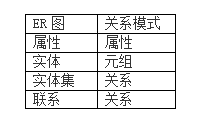

一般的转换原则为：一个实体型转换为一个关系模式，关系的属性就是实体的属性，关系的码就是实体的码。**该关系的码则有三种情况：**
若联系为1：1，则每个实体的码均是该关系的**后选码**。
若联系为1：n，则关系的码为**n端实体的码**。
若联系为m：n，则关系的码为**诸实体码的组合**。

**一对一**
对于一对一联系的转换有三种形式：通常我们熟知的两种是：将联系归并到关联的两个实体的任意一方，给待归并的一方实体属性集中增加另一方实体的码和该联系的属性，归并后的实体码不变。
另一种方式是将联系转换成单独的关系模式，关系模式的名称取自联系的名称，关系模式的属性包括该联系所关联的两个实体的码及联系的属性，**该关系模式的码取自任意一方的实体的码。**
**一对多**
而对于一对多的转换就有两种形式：一种是经常在用的：将联系的属性归并到关联的两个实体的多方，待归并的一方实体属性集中增加另一方实体的码和该联系的属性，归并后的实体码不变。
另一种方式是将联系转换成单独的关系模式，关系模式的名称取自联系的名称，关系模式的属性包括该联系所关联的两个实体的码及联系的属性，**该关系模式的码取自多方的实体的码。**
**多对多**
至于多对多的转换就只有一种形式了，即将联系转换成单独的关系模式，关系模式的名称取自联系的名称，关系模式的属性包括该联系所关联的两个实体的码及联系的属性，**该关系模式的码取自多方的实体的码构成的属性组。**

## 关系模型

关系模型就是处理Table的,它由三个部分组成:

- 描述DB各种数据的基本结构形式(Table/Relation)
- 描述Table与Table之间所有可能发生的各种操作(关系运算)；并、差、广义积、选择、投影、交、连接、除(其中并、差、广义积、选择、投影为**基本运算**,交、连接、除为**扩展运算**)
- 描述这些操作所应遵循的约束条件(完整性约束)；实体完整性（**关系的主码中的属性值不能为空值**）、参照完整性（如果关系R1的外码Fk与关系R2的主码Pk相对应,则R1中的每一个元组的Fk值或者等于R2中某个元组的Pk值或者为空值）、用户自定义的完整性（用户针对具体的应用环境定义的完整性约束条件）

**名词**：

- 域(Domain) : 是一组值的集合，这组值具有相同的数据类型，如整数的集合、字符串的集合、全体学生的集合，再比如,由8位数字组成的集合
- **域的基数(Cardinality)** : 集合中元素的个数称为域的基数

- 实体：客观存在并且可以相互区别的事物称为实体。实体可以 是具体的人、事、物，也可以是抽象的概念或联系，例如，一个职工、一个学生、学生的一次选课、部门的一次订单等。
- 属性：实体所具有的某一特性称为属性。
- 码：唯一标识实体的属性集称为码。主码：我们在建立数据库的时候，只需要为每张表指定一个主码，主码也叫主键。所谓主码就是在实体集中区分不同实体的候选码。一个实体集中只能有一个主码，但可以有多个候选码。
- **候选码(Candidate Key)**: 关系中的一个属性组,其值能唯一标识一个元组，若从该属性组中去掉任何一个属性，它就不具有这一性质了,这样的属性组称作候选码。
  (1)例如:学生(id,Sname,Sage,Sclass),id就是一个候选码.
  (2)有时,关系中有很多组候选码,例如:学生(id,Sname,Sage,Sclass,Saddress),其中属性组(Sname,Saddress)也是候选码(同名同地址的两个学生是不存在的)
- 主属性：包含在任一候选关键字中的属性称主属性。
- 非主属性：不包含在主码中的属性称为非主属性。 非主属性是相对与主属性来定义的。
- 关系：一个关系对应通常说的一张表。
- 关系模式：对关系的描述，一般表示为：关系名（属性1，属性2，…，属性n）。
- 若关系中的某一属性组的值能**唯一标识一个元组**，而其子集不能，则称该属性组为候选码。若一个关系中有多个后选码，则选定其中一个为主码。
- 设F是基本关系R的一个或一组属性，但不是关系R的码，KS是基本关系S的主码。如果F与KS相对应，则称F是R的外码，并称基本关系R为参照关系，基本关系S为被参照关系或目标关系。关系R和S不一定是不同的关系。
- 元组（tuple）是关系数据库中的基本概念，关系是一张表，表中的每行（即数据库中的每条记录）就是一个元组，每列就是一个属性。 在二维表里，元组也称为行。
- 外码(Foreign Key)/外键：关系R中的一个属性组,它不是R的候选码,但它与另一个关系S的候选码相对应,则称这个属性组为R的外码或外键.
  例如,"合同"关系中的客户号不是候选码,但却是外码.因它与客户关系中的候选码"客户号"相对应.
  两个关系通常是靠外码连接起来的
- 超键（super key）：在关系中能惟一标识元素属性的集称为关系模式的超键。

- 外键（Foreign Key）:如果模式R中的属性k是其他模式的主键，那么k在模式R中称为外键。


## 数据库体系内部结构

数据库的体系内部结构我们可以分为三层：

- 外模式
- 逻辑模式（模式）
- 内模式

三级模式的位置：

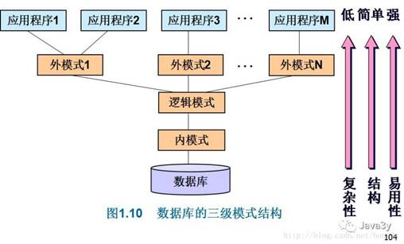

三级模式的作用：

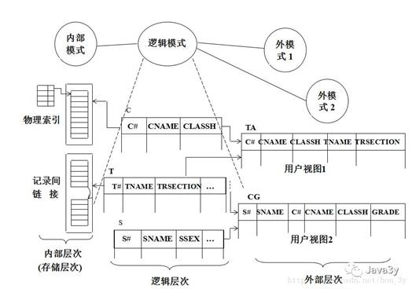

### 逻辑模式（模式）

逻辑模式是**对数据库全部数据的整体逻辑、结构的描述**。

例子：现在我有一个数据库，操作权限、角色、用户之间的关系

**于是有了以下的关系模式**

- 权限关系(权限编号，权限名称，权限描述)
- 角色关系(角色编号，角色名称，角色描述)
- 用户关系(用户编号，用户名称，用户密码)

在数据库中**所有关系模式的集合就组成了逻辑模式！**

### **外模式**（子模式）

外模式是对数据库用户能看见和使用的**局部数据逻辑结构的描述**，是**与某一应用有关的数据的逻辑表示**。

外模式是可以有多个的，外模式是用户和DBAS的接口，是对局部逻辑结构的描述！

当用户应用程序只需要显示用户名称和密码时：

- 用户关系(用户名称，用户密码)

在数据库中**操作局部逻辑结构就称作为外模式**！

### **内模式** 

内模式是对**数据库表物理存储结构的描述**。它定义了**数据的内部记录类型、记录寻址技术、索引和文件的组织方式及数据控制方面的内容**

### 两级映像

两级映像分别是：

- 外模式和逻辑模式的映像
- 逻辑模式和内模式的映像

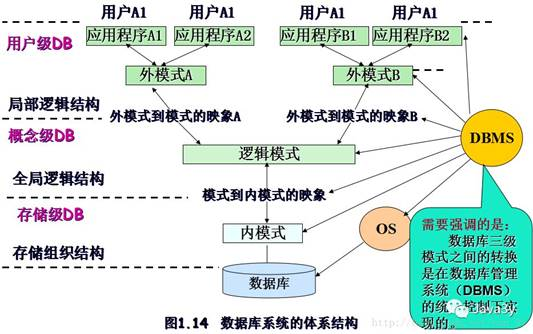

 

要保证数据库的逻辑数据独立性，需要修改的是**模式与外模式之间的映象。**


**提出两级映射的概念有什么用呢？为什么需要有这两级映像呢？？**

- 当数据库的逻辑模式结构因某种原因修改时，只要没有改变逻辑模式中与外模式定义有关的属性及与其关系模式名的隶属关系，就可使外模式保持不变，从而不需修改应用程序。
- 当数据库的内模式由于某种原因要修改时，可通过对逻辑模式与内模式之间的映象的修改，使逻辑模式尽可能地保持不变，实现内模式的改变尽可能地不修改应用程序。

也就说：**在改变内部结构的时候，只要不会触及外部的数据时，外部的数据并不需要做改变。两级映像概念的提出也就是程序中耦合的问题！**

## 关系运算

**并**

**注意：**使用UNION并操作，比使用关键字OR的性能要好！ 


**交**

查询10部门的信息

```sql
SELECT * FROM dept WHERE deptno = 10;
```

(全部部门和部门10只有部门10是相同的，所以最后返回的是部门10的结果)

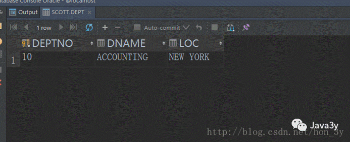


**差**


**投影**

> 取出一个查询结果中某某列，并消除重复的数据，这就是投影！
>

**投影是从列的角度进行的运算**

**投影的下标可是列序号，也可是列属性名**

**查询出所有部门的编号**

**SELECT deptno FROM dept;**

查询时的过程：先查询得出dept表的所有结果，再通过投影运算只提取"deptno"的列数据，如果 SELECT * 后边跟的是，那么就是投影全部数据


**选择**

**使用比较运算符、逻辑运算符，挑出满足条件的元组，运算出结果！**

查询出工资大于2000的员工的姓名

SELECT ename FROM emp WHERE sal > 2000;

 

**除**

关系R有ABCD，关系S有CD，首先投影出AB（因为S有CD），再用投影出来AB的结果和关系S做笛卡尔积运算。如果做的笛卡尔积运算记录在R关系中找到相对应的记录，那么投影的AB就是结果了！

**同时满足被除数的条件的结果集合；**

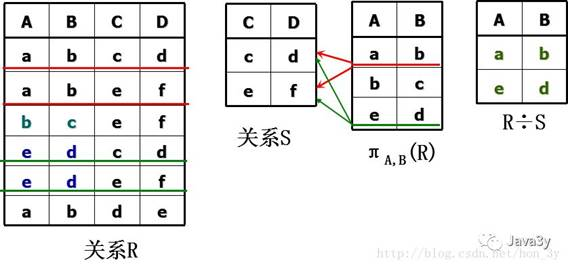


**笛卡尔积**

我们可以使用等值连接(emp.deptno=dept.deptno)来消除笛卡尔积，这样就达到我们的目的了！

消除笛卡尔积其实就是自然连接！

## Mysql主从复制

从库生成两个线程，**一个I/O线程，一个SQL线程；**

**i/o**线程去请求主库的**binlog**，并将得到的binlog日志写到relay log（中继日志） 文件中；

主库会生成一个 **log dump** **线程**，用来给从库 i/o线程传binlog；

SQL 线程，会读取relay log文件中的日志，并解析成具体操作，**来实现主从的操作一致，而最终数据一致；**

## 故障

(1)事务内部的故障：事务内部故障可分为预期的和非预期的，其中大部分的故障都是非预期的。预期的事务内部故障是指可以通过事务程序本身发现的事务内部故障；非预期的事务内部故障是不能由事务程序处理的，如**运算溢出故障、并发事务死锁故障、违反了某些完整性限制而导致的故障等。**

(2)系统故障：系统故障也称为软故障，是指数据库在运行过程中，由于硬件故障、数据库软件及操作系统的漏洞、突然停电灯情况，导致系统停止运转，所有正在运行的事务以非正常方式终止，需要**系统重新启动的一类故障。**这类事务不破坏数据库，但是影响正在运行的所有事务。

(3)介质故障：介质故障也称为硬故障，主要指数据库在运行过程中，由于**磁头碰撞、磁盘损坏、强磁干扰、天灾人祸**等情况，使得数据库中的数据部分或全部丢失的一类故障。

(4)计算机病毒故障：计算机病毒故障是一种恶意的计算机程序，它可以像病毒一样繁殖和传播，在对计算机系统造成破坏的同时也可能对数据库系统造成破坏(破坏方式以数据库文件为主)。

# 一、事务

## 1.1 特性

**事务指的是满足 ACID** **特性的一组操作，可以通过 Commit** **提交一个事务，也可以使用 Rollback** **进行回滚。**

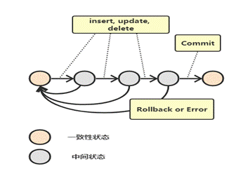

**ACID**

1. 原子性（Atomicity）：事务被视为不可分割的最小单元，事务的所有操作要么全部提交成功，要么全部失败回滚。回滚可以用回滚日志来实现，回滚日志记录着事务所执行的修改操作，在回滚时反向执行这些修改操作即可。

2. 一致性（Consistency）：数据库在事务执行前后都保持一致性状态。在一致性状态下，**所有事务对一个数据的读取结果都是相同的。**
3. 隔离性（Isolation）：一个事务所做的修改在最终提交以前，对其它事务是不可见的。
4. 持久性（Durability）：一旦事务提交，则其所做的修改将会永远保存到数据库中。即使系统发生崩溃，事务执行的结果也不能丢失。**使用重做日志来保证持久性。**

 

事务的 ACID 特性概念简单，但不是很好理解，主要是因为这几个特性不是一种平级关系：

- 只有满足一致性，事务的执行结果才是正确的。

- 在无并发的情况下，事务串行执行，隔离性一定能够满足。此时只要能满足原子性，就一定能满足一致性。

- 在并发的情况下，多个事务并行执行，事务不仅要满足原子性，还需要满足隔离性，才能满足一致性。

- 事务满足持久化是为了能应对数据库崩溃的情况。


**AUTOCOMMIT**

MySQL 默认采用自动提交模式。也就是说，如果不显式使用START TRANSACTION、BEGIN（开启事务）语句来开始一个事务，那么每个查询都会被当做一个事务自动提交。

### 何时使用事务？

对数据库的数据进行**批量或连表操作时**，为了保证**数据的一致性和正确性**，我们需要添加事务管理机制进行管理。当对数据库的数据进行操作失败时，事务管理可以很好保证所有的数据回滚到原来的数据，如果操作成功，则保证所有需要更新的**数据持久化。**

## 1.2 事务安全

1. 事务：一系列要发生的连续的操作。

2. 事务安全：一种保护连续操作同时满足（实现）的一种机制。

3. 事务安全的意义：保证数据操作的完整性。


### 事务操作

事务操作分为两种：自动事务（默认的），手动事务

1. 手动事务操作流程

   **开启时事务**：告诉系统以下所有的操作（写）不要直接写入到数据表，先存放到事务日志smart transaction。

   -- 开启事务

   start transaction;

2. **进行事务操作**：一系列操作(李四账户减少1000,张三账户增多1000

   ```SQL
   -- 事务操作1：李四的账户减少1000
   update my_account set money = money - 1000 where id = 2;
   -- 事务操作2：张三账户增加1000
   update my_account set money = money + 1000 where id = 1;
   ```

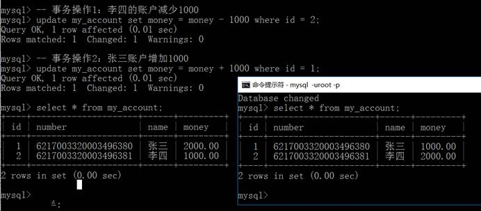

3. 关闭事务：选择性的将日志文件中操作的结果保存到数据表（同步）或者直接清除事务日志（原来操作全部清空）
4. **提交事务**：同步数据表（操作成功）：commit
5. **回滚事务**：直接清空日志表（操作失败）：rollback

### 事务操作原理

事务开启后，所有的操作都会**临时保存到事务日志，**事务日志只有得到commit命令才会同步到数据表，其他任何情况都会清空（rollback，断电和断开连接）。

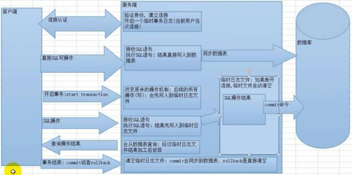

### 回滚点

- 定义：在某个成功的操作完成之后，后续的操作有可能成功有可能失败，但是不管成功还是失败，前面的操作都已经成功。可以再在当前成功的位置，设置一个点。可以供后续失败操作返回到该位置，而不是返回所有操作，这个点称之为回滚点。

- 设置回滚点语法：savepoint 回滚点名字;

- 回到回滚点语法：rollback to 回滚点名字;


### 自动事务处理

1. 在mysql中， **默认的都是自动事务处理**，用户操作完成后会立即同步到数据库。

2. 自动事务：系统通过autocommit变量控制

   Show variables like ‘autocommit’;
   
   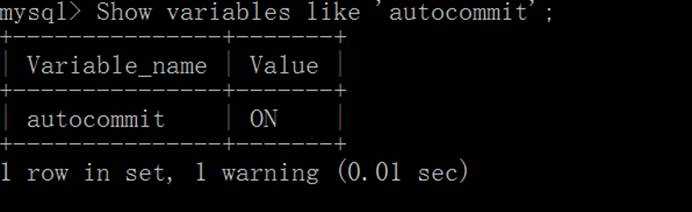

3. 关闭事务自动提交:Set autocommit = off/0;

4. 自动关闭后，需要手动来选择处理：commit/rollback

   注意：通常开启自动事务。

### 锁机制

- Innodb默认是行锁，但是如果在事务操作的过程中，**没有使用到索引**，那么系统会自动全表检索数据，自动升级为表锁。
- 行锁：只有当前行被锁住，别的用户不能操作

- 表锁：整张表被锁住


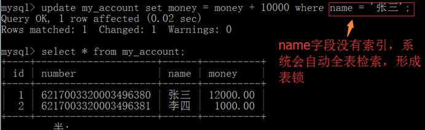

# 二、并发一致性问题

## 事务隔离级别

在并发环境下，事务的隔离性很难保证，因此会出现很多并发一致性问题。

**丢失修改**

T1，T2 事务对一个数据进行修改，T1 先修改，T2 随后修改，T2 的修改覆盖了 T1 的修改。

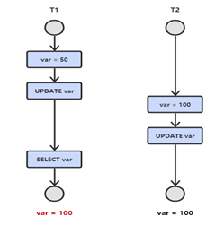

**读脏数据**

T1 修改一个数据，T2 随后读取数据。如果 T1 撤销了这次修改， T2 读取数据是脏数据。

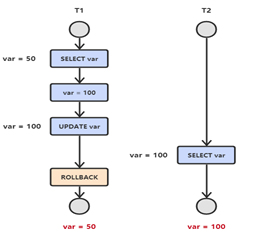

**不可重复读**

T2 读取一个数据，T1 对该数据做了修改。如果 T2 再次读取这个数据，此时读取的结果和第一次读取的结果不同。

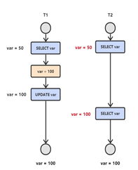

**幻影读（MVCC）**

T1 读取某个范围的数据，T2 在这个范围内插入新的数据，T1 （看来）再次读取这个范围的数据，此时读取的结果和和第一次读取的结果不同。

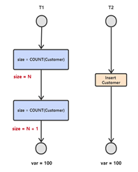

产生并发不一致性问题**主要原因是破坏了事务的隔离性，**解决方法是通过并发控制来保证隔离性。并发控制可以通过**封锁**来实现，但是封锁操作需要用户自己控制，相当复杂。数据库管理系统提供了**事务的隔离级别**，让用户以一种更轻松的方式处理并发一致性问题。

# 三、封锁

## 封锁粒度

MySQL 中提供了两种封锁粒度：**行级锁以及表级锁。**

**行级锁只在存储引擎层实现（索引项加锁，相同容易造成死锁）**，只有通过索引条件进行检索，才使用行级锁。

 

而MySQL服务器层没有实现，服务器层完全不了解存储引擎中的锁实现。

应该尽量只锁定需要修改的那部分数据，而不是所有的资源。锁定的数据量越少，发生锁争用的可能就越小，系统的并发程度就越高。

但是加锁需要消耗资源，锁的各种操作（包括获取锁、释放锁、以及检查锁状态）都会增加系统开销。因**此封锁粒度越小，系统开销就越大。**

在选择封锁粒度时，需要在锁开销和并发程度之间做一个权衡。

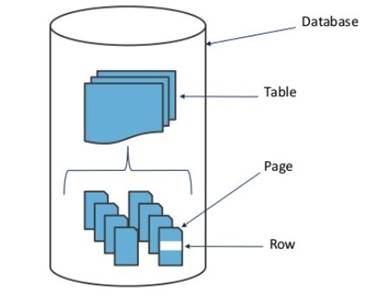

## 封锁类型

### 读写锁

排它锁（Exclusive），简写为 X 锁，又称写锁。

共享锁（Shared），简写为 S 锁，又称读锁。

有以下两个规定：

一个事务对数据对象 A 加了 X 锁，就可以对 A 进行读取和更新。加锁期间其它事务不能对 A 加任何锁。

一个事务对数据对象 A 加了 S 锁，可以对A进行读取操作，但是不能进行更新操作。加锁期间其它事务能对 A加 S 锁，但是不能加 X锁。

- - 排他**：**写一个数据之前加X锁， 事务提交之后释放该X锁。
  - 共享：读一个数据之前加S锁， 读完之后立刻释放该S锁。
  - 共享：读一个数据之前加S锁， 事务提交之后立刻释放该S锁。

### 意向锁

> 使用意向锁（Intention Locks）可以更容易地支持多粒度封锁。
>

在存在行级锁和表级锁的情况下，事务 T 想要对表 A 加 X 锁，就需要先检测是否有其它事务对表 A 或者表 A 中的任意一行加了锁，那么就需要对表 A 的每一行都检测一次，这是非常耗时的。

意向锁在原来的 X/S 锁之上**引入了** **IX/IS**，**IX/IS** **都是表锁**，用来表示一个事务想要在表中的某个数据行上加 X 锁或 S 锁。有以下两个规定：

- 一个事务在获得某个数据行对象的 S 锁之前，必须先获得表的 IS 锁或者更强的锁；

- 一个事务在获得某个数据行对象的 X 锁之前，必须先获得表的 IX 锁。


通过引入意向锁，事务 T 想要对表 A 加 X 锁，只需要先检测是否有其它事务对表 A 加了 X/IX/S/IS 锁，如果加了就表示有其它事务正在使用这个表或者表中某一行的锁，因此事务 T 加 X 锁失败。

解释如下：

- 任意 IS/IX 锁之间都是兼容的，因为它们**只是表示想要对表加锁，而不是真正加锁；**

- S 锁只与 S 锁和 IS 锁兼容，也就是说事务 T 想要对数据行加 S 锁，其它事务可以已经获得对表或者表中的行的 S 锁。


## 封锁协议

### **一级封锁协议**

事务 T 要修改数据 A 时必须加 X 锁，直到 事务T 结束才释放锁。

可以**解决丢失修改问题**，因为不能同时有两个事务对同一个数据进行修改，那么事务的修改就不会被覆盖。

### 二级封锁协议

在一级的基础上，要求读取数据 A 时必须加 S 锁，读取完马上释放 S 锁。

可以**解决读脏数据问题**，因为如果一个事务在对数据 A 进行修改，根据 1 级封锁协议，会加 X 锁，那么就不能再加 S 锁了，也就是不会读入数据。

### 三级封锁协议

在二级的基础上，要求**读取数据A时必须加 S锁，直到事务结束了才能释放 S锁。**

可以解决不可重复读的问题，因为读 A 时，**其它事务不能对** **A** **加 X** **锁，**从而避免了在读的期间数据发生改变。

T1      T2

lock-s(A)   

read A=20  

​       lock-x(A)

​       wait

read A=20 

commit 

unlock-s(A) 

​       obtain

​       read A=20

​       write A=19

​       commit

​       unlock-X(A)

### **两段锁协议**

> **是指所有事务必须分两个阶段对数据项加锁和解锁。**
>
> 两段锁协议是指每个事务的执行可以分为两个阶段：生长阶段（加锁阶段）和衰退阶段（解锁阶段）。
>
> 加锁阶段：在该阶段可以进行加锁操作。在对任何数据进行读操作之前要申请并获得S锁，在进行写操作之前要申请并获得X锁。加锁不成功，则事务进入等待状态，直到加锁成功才继续执行。
>
> 解锁阶段：**当事务释放了一个封锁以后，事务进入解锁阶段，在该阶段只能进行解锁操作不能再进行加锁操作。**

可串行化调度是指，通过并发控制，使得并发执行的事务结果与某个串行执行的事务结果相同。

事务遵循两段锁协议是保证可串行化调度的充分条件。例如以下操作满足两段锁协议，它是可串行化调度。

lock-x(A)...lock-s(B)...lock-s(C)...unlock(A)...unlock(C)...unlock(B)

但不是必要条件，例如以下操作不满足两段锁协议，但是它还是可串行化调度。

lock-x(A)...unlock(A)...lock-s(B)...unlock(B)...lock-s(C)...unlock(C)


**MySQL** **隐式与显示锁定**

**MySQL** **的 InnoDB** **存储引擎采用两段锁协议**，会根据隔离级别在需要的时候自动加锁，并且所有的锁都是在同一时刻被释放，这被称为**隐式锁定。**

InnoDB 也可以使用特定的语句进行显示锁定：

```SQL
SELECT ... LOCK In SHARE MODE;

SELECT ... FOR UPDATE;
```

# 四、隔离级别

**未提交读（READ UNCOMMITTED）**

> 事务中的修改，即使没有提交，对其它事务也是可见的。
>

**原理：写数据时加上X锁，直到事务结束，读的时候不加锁。**


**提交读（READ COMMITTED）**

> 一个事务只能读取已经提交的事务所做的修改。换句话说，一个事务所做的修改在提交之前对其它事务是不可见的。
>

**原理：Tx_isolation默认；写数据的时候加上X锁， 直到事务结束，读的时候加上S锁， 读完数据立刻释放。(共享锁规则1)**


**可重复读（REPEATABLE READ）**

> 保证在同一个事务中多次读取同样数据的结果是一样的。
>

**原理：写数据的时候加上X锁，直到事务结束，读数据的时候加S锁，也是直到事务结束。(共享锁规则2)**


**可串行化（SERIALIZABLE）**

> 强制事务串行执行。
>

**原理：严格有序执行，事务不能并发执行。** 

# 五、多版本并发控制（乐观锁 ）（事务的原理）

> 多版本并发控制（Multi-Version Concurrency Control, MVCC）是 **MySQL** **的 InnoDB** **存储引擎**实现隔离级别的一种具体方式，用于实现**提交读和可重复读这两种隔离级别。**而未提交读隔离级别总是读取最新的数据行，无需使用 MVCC。可串行化隔离级别需要对所有读取的行都加锁，单纯使用 MVCC 无法实现。

**可以认为MVCC是行级锁的一个变种**

- mysql如何实现避免幻读

  1. 在快照读读情况下，mysql通过mvcc来避免幻读。
  2. 在当前读读情况下，mysql通过next-key来避免幻。

## 介绍

**版本号**

- 系统版本号：是一个递增的数字，每开始一个新的事务，**系统版本号**就会自动递增。
- 事务版本号：事务开始时的系统版本号。


在InnoDB中，每一行都有2个隐藏列DATA_TRX_ID和DATA_ROLL_PTR(如果没有定义主键，则还有个隐藏主键列)：

- DATA_TRX_ID表示最近修改该行数据的事务ID
- DATA_ROLL_PTR则表示指向该行回滚段的指针，该行上所有旧的版本，在undo中都通过链表的形式组织，而该值，正式指向undo中该行的历史记录链表

在 MySQL 的 information_schema 库的 innodb_trx 表中，你可以查到当前执行中的事务。

**Undo** **日志**

MVCC 使用到的快照**存储在** **Undo** **日志**中，该日志通过回滚指针把一个数据行（Record）的所有快照连接起来。

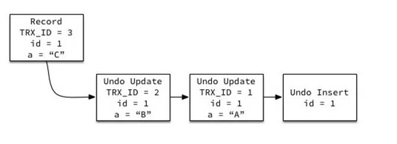

**版本号机制**

> 一般是在数据表中加上**一个数据版本号version**字段，**表示数据被修改的次数**，当数据被修改时，version值会加一。当线程A要更新数据值时，在读取数据的同时也会读取version值，在提交更新时，若刚才读取到的version值为当前数据库中的version值相等时才更新，否则重试更新操作，直到更新成功。


**举一个简单的例子：**

假设数据库中帐户信息表中有一个 version 字段，当前值为 1 ；而当前帐户余额字段（ balance ）为 $100 。

 

操作员 A 此时将其读出（ version=1 ），并从其帐户余额中扣除 $50（ $100-$50 ）。

在操作员 A 操作的过程中，操作员B 也读入此用户信息（ version=1 ），并从其帐户余额中扣除 $20 （ $100-$20 ）。

操作员 A 完成了修改工作，将数据版本号加一（ version=2 ），连同帐户扣除后余额（ balance=$50 ），提交至数据库更新，此时由于提交数据版本大于数据库记录当前版本，数据被更新，数据库记录 version 更新为 2 。

操作员 B 完成了操作，也将版本号加一（ version=2 ）试图向数据库提交数据（ balance=$80 ），但此时比对数据库记录版本时发现，操作员 B 提交的数据版本号为 2 ，数据库记录当前版本也为 2 ，不满足 “ 当前最后更新的version与操作员第一次的版本号相等 “ 的乐观锁策略，因此，操作员 B 的提交被驳回。

这样，就避免了操作员 B 用基于 version=1 的旧数据修改的结果覆盖操作员A 的操作结果的可能。

 

**隐藏的列**

MVCC 在每行记录后面都保存着**两个隐藏的列**，用来存储两个版本号：

- 创建版本号：指示创建一个数据行的快照时的系统版本号；
- 删除版本号：如果该快照的删除版本号大于当前事务版本号表示该快照有效，否则表示该快照已经被删除了。


## 实现过程

以下实现过程针对可重复读隔离级别。

当开始新一个事务时，该事务的版本号肯定会大于当前所有数据行快照的创建版本号，理解这一点很关键。

**1. SELECT**

多个事务必须读取到同一个数据行的快照，并且这个快照是距离现在最近的一个有效快照。但是也有例外，如果有一个事务正在修改该数据行，那么它可以读取事务本身所做的修改，而不用和其它事务的读取结果一致。

把没有对一个数据行做修改的事务称为 T，T 所要读取的数据行快照的创建版本号必须小于 T 的版本号，因为如果大于或者等于 T 的版本号，那么表示该数据行快照是其它事务的最新修改，因此不能去读取它。除此之外，T 所要读取的数据行快照的删除版本号必须大于 T 的版本号，因为如果小于等于 T 的版本号，那么表示该数据行快照是已经被删除的，不应该去读取它。

**2. INSERT**

将当前系统版本号作为数据行快照的创建版本号。

**3. DELETE**

将当前系统版本号作为数据行快照的删除版本号。

**4. UPDATE**

将当前系统版本号作为更新前的数据行快照的删除版本号，并将当前系统版本号作为更新后的数据行快照的创建版本号。可以理解为先执行 DELETE 后执行 INSERT。

## 快照读与当前读

**1.** **快照读**

使用 MVCC 读取的是快照中的数据，这样可以**减少加锁所带来的开销。**

```sql
select * from table ...;
```

**2.** **当前读**

**读取的是最新的数据，需要加锁。**以下第一个语句需要加 S 锁，其它都需要加 X 锁。

```sql
select * from table where  ? lock in share mode;

select * from table where  ? for update;

insert;

update;

delete;
```


# 六、Next-Key Locks

> Next-Key Locks 是 **MySQL** **的 InnoDB** **存储引擎**的一种锁实现。
>
> **MVCC** **不能解决幻读的问题，Next-Key Locks** **就是为了解决这个问题而存在的。**在可重复读（REPEATABLE READ）隔离级别下，**使用** **MVCC + Next-Key Locks** **可以解决幻读问题。**

**Record Locks**

锁定一个记录上的索引，而不是记录本身。

如果表没有设置索引，InnoDB 会自动在主键上创建隐藏的聚簇索引，因此 Record Locks 依然可以使用。

**Gap Locks**

锁定索引之间的间隙，但是不包含索引本身。例如当一个事务执行以下语句，其它事务**就不能在t.c中插入 15**。

```sql
SELECT c FROM t WHERE c BETWEEN 10 and 20 FOR UPDATE;
```

**Next-Key Locks**

它是 Record Locks 和 Gap Locks 的结合，**不仅锁定一个记录上的索引**，**也锁定索引之间的间隙。**例如一个索引包含以下值：10, 11, 13, and 20，那么就需要锁定以下区间：

(negative infinity, 10]
(10, 11]
(11, 13]
(13, 20]
(20, positive infinity)

# 七、关系数据库设计理论

## 函数依赖

记 A->B 表示 A 函数决定 B，也可以说 B 函数依赖于 A。

如果 {A1，A2，... ，An} 是关系的一个或多个属性的集合，该集合函数决定了关系的其它所有属性并且是最小的，那么该集合就称为键码。

对于 A->B，如果能找到 A 的真子集 A'，使得 A'-> B，那么 A->B 就是部分函数依赖，否则就是完全函数依赖。

对于 A->B，B->C，则 A->C 是一个**传递函数依赖。**

**案例：**

学号—>姓名，学号—>系名，系名—>系主任，（学号，课名）->分数 
**则码：（学号、课名）**

## 异常

以下的学生课程关系的函数依赖为 Sno, Cname -> Sname, Sdept, Mname, Grade，键码为 {Sno, Cname}。也就是说，确定学生和课程之后，就能确定其它信息。

Sno Sname  Sdept   Mname Cname  Grade

1   学生-1  学院-1  院长-1  课程-1  90

2   学生-2  学院-2  院长-2  课程-2  80

2   学生-2  学院-2  院长-2  课程-1  100

3   学生-3  学院-2  院长-2  课程-2  95

**不符合范式的关系，会产生很多异常，主要有以下四种异常：**

- 冗余数据：例如 学生-2 出现了两次。

- 修改异常：修改了一个记录中的信息，但是另一个记录中相同的信息却没有被修改。

- 删除异常：删除一个信息，那么也会丢失其它信息。删除了不该删的数据。

- 插入异常：例如想要插入一个学生的信息，如果这个学生还没选课，那么就无法插入。插入无法正常插入。


## 范式

> 范式是一种离散化的数学知识，是为了解决一种数据存储与优化的问题。保存数据的存储之后，**凡是能够通过关系寻找出来的数据，坚决不再重复存储。**终极目标是减少数据冗余。

六层范式：1NF,2NF,3NF.....4NF。1NF是最低层，要求最低。6NF是最高层，最严格。

但是数据库不但是解决空间问题，还要保持效率问题。范式值解决空间问题，所有数据库的设计不能完全按照范式要求实现。一般情况下，只有前三种范式需要满足。

范式在数据库的设计中有指导意义，但是不是强制规范。

### INF

> 第一范式：在设计储存数据的时候，如果存储的表中在取出来使用前还需要额外的处理（字段拆分），则该表的设计不满足第一范式。**第一范式要求字段的数据具有原子性（不可再分）**。


如果需求是将数据查出来后，要求显示一个老师从什么时候开始上课，到什么结课。需要将代课时间进行拆分，故不符合1NF，数据不具有原子性，可以再拆分。

**解决方案：**将代课时间拆分成两个字段就可解决问题。

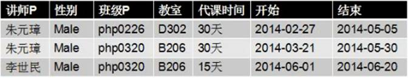

### 2NF

> 第二范式：在数据表设计过程中，如果有**复合主键（多字段主键），**且表中有字段并不是由整个主键来确定，**而是依赖主键中的某个字段（主键部分）。**存在字段依赖主键的部分问题。
>
> **（复合主键联合保证唯一索引）**

第二范式（2NF）要求数据库表中的每个实例或行必须可以被惟一地区分。

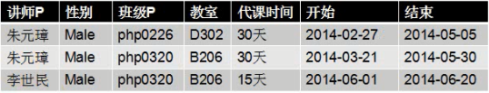

以上表中：因为讲师没有办法作为主键，需要结合班级才可以作为主键（复合主键）。代课时间，开始和结束都依赖主键（讲师和班级）；**性别不依赖班级，只依赖讲师；**教室只依赖班级，不依赖讲师。故不符合第二范式。

**解决方案1：**可以将性别和讲师单独成表，班级与教师单独成表。

**解决方案2**：取消复合主键，使用逻辑主键。

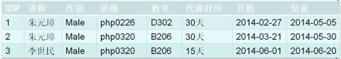

ID  =  讲师 + 班级

### 3NF

第三范式：理论上讲，**一张表中的所有字段都应该直接依赖主键（逻辑主键除外）。**人员工艺表设计中存在一个字段，并不直接依赖主键，**而是通过某个非主键字段依赖，**从而实现依赖主键。这种依赖非主键字段的依赖关系称之为传递依赖，第三范式就是要解决传递依赖。

讲师代课表


以上设计方案中，**性别依赖讲师存在，讲师依赖主键。教师依赖班级，班级依赖主键。性别和班级都存在传递依赖。**


**解决方案：**将存在传递依赖的字段，以及依赖字段本身单独取出来形成一个单独的表。

**讲师代课表**

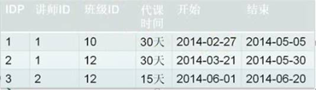

**讲师表**

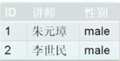

**班级表**

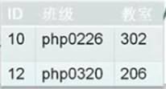

讲师表：ID等价于讲师   班级表：ID等价于班级

讲师表和班级表的真正意义上的主键分别是讲师和班级，id只是逻辑主键，为的是解决教师和班级可能出现同名的问题，故不存在传递依赖。

 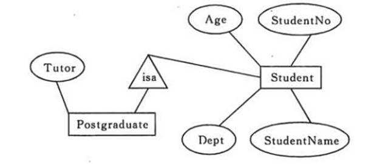

**BCNF**

- 所有非主属性对每一个候选键都是完全函数依赖；
- 所有的主属性对每一个不包含它的候选键，也是完全函数依赖；
- 没有任何属性完全函数依赖于非候选键的任何一组属性。

# 八、优化

### Sql和数据库优化

**开启慢查询：**show VARIABLES LIKE 'long%'；long_query_time指定了慢查询的阈值，即如果执行语句的时间超过该阈值则为慢查询语句，默认值为10秒。

**慢查询日志开启情况：**SHOW VARIABLES LIKE 'slow%'；返回：slow_query_log的值为ON为开启慢查询日志，OFF则为关闭慢查询日志。

**Sql优化**

- where代替having,**having** **检索完所有记录，才进行过滤**

- 不要使用 **select **

- 尽量规避大事务的 SQL，大事务的 SQL 会影响数据库的并发性能及主从同步；

- 慎用 Oder by rand()

- **or条件优化**，多个or条件可以用union all对结果进行合并（union all结果可能重复）

- **当只要一行数据时使用 LIMIT 1，避免SELECT ，永远为每张表设置一个ID**

- SQL语句中IN包含的值不应过多，能用between就不要用in了

- 使用 ENUM 而不是 VARCHAR

- **Prepared Statements，固定长度的表会更快**

- 如果限制条件中其他字段没有索引，尽量少用or

- **不使用NOT IN操作, 将进行全表扫描。NOT IN可以NOT EXISTS代替**

- 不建议使用%前缀模糊查询，导致索引失效而进行全表扫描

- 对多个字段进行等值查询时，**联合索引**

- 涉及**连表的查询**，是否能进行分表查询，单表查询之后的结果进行字段整合

  如果以上两种都不能操作，非要链表查询，那么考虑对相对应的查询条件做索引。加快查询速度

- **explain分析sql语句**，查看执行计划，分析索引是否用上，分析扫描行数等等，你的数据表是如何被搜索和排序的……等等

  查看mysql执行日志，看看是否有其他方面的问题

 

**数据库优化**

- 选取最适用的字段属性（表结构）

- 合理使用外键（表结构）

- 合理建立索引（表结构）

- SQL的优化

- **减少数据访问**（减少磁盘访问）
- 返回更少数据（减少网络传输或磁盘访问）

- 系统配置和硬件的优化

- **针对数量大的表进行历史表分离（如交易流水表）**
- **数据库主从分离，读写分离**，降低读写针对同一表同时的压力，至于主从同步，mysql有自带的binlog实现 主从同步
- 查看sql是否涉及多表的联表或者子查询，如果有，看是否能进行业务拆分，相关字段冗余或者合并成临时表（业务和算法的优化）
- **水平垂直分表，水平要连接，垂直单个数据库，记录更大。**

### 分库分表

**1、垂直（纵向）切分**

垂直切分常见有**垂直分库和垂直分表**两种。

**垂直分库：不同业务切分**

**垂直分表**是基于数据库中的"列"进行 ，某个表字段较多，可以新建一张扩展表，将不经常用或字段长度较大的字段拆分出去到扩展表中。

**垂直切分的优点：**

· 解决业务系统层面的耦合，业务清晰

· 与微服务的治理类似，也能对不同业务的数据进行分级管理、维护、监控、扩展等

· 高并发场景下，垂直切分一定程度的提升IO、数据库连接数、单机硬件资源的瓶颈

 

**2、水平（横向）切分**

水平切分分为**库内分表和分库分表**，是根据表内数据内在的逻辑关系，将同一个表按不同的条件分散到多个数据库或多个表中，每个表中只包含一部分数据，从而使得单个表的数据量变小，达到分布式的效果。

库内分表只解决了单一表数据量过大的问题。

l **根据数值范围**

按照时间区间或ID区间来切分。**"冷热数据分离"**

l **根据数值取模**

一般采用hash取模mod的切分方式

### sql注入原理

> 将恶意的 Sql 查询或添加语句插入到应用的**输入参数**中，再在后台 Sql 服务器上解析执行进行的攻击。

'or'='or'后台绕过漏洞，利用的就是AND和OR的运算规则，从而造成后台脚本逻辑性错误。

需要结合用户的输入数据**动态构造Sql语句**，如果用户输入的数据被构造成恶意 Sql 代码，Web 应用又未对动态构造的 Sql 语句使用的**参数进行审查**，则会带来意想不到的危险。

```sql
select * from users where username='123' or 1=1' ;
```


**防范：**

1. 永远不要信任用户的输入，要对用户的输入进行校验，可以通过**正则表达式**，或限制长度，对单引号和双"-"进行转换等。
2. **永远不要使用动态拼装SQL，可以使用参数化的SQL或者直接使用存储过程进行数据查询存取**。
3. 永远不要使用管理员权限的数据库连接，为每个应用使用**单独的权限**有限的数据库连接。
4. 不要把机密信息明文存放，请加密或者hash掉密码和敏感的信息。
5. 应用的异常信息应该给出尽可能少的提示，最好**使用自定义的错误信息**对原始错误信息进行包装，把异常信息存放在独立的表中。
6. PreparedStatement（简单又有效的方法）


**延迟注入：**

```sql
sleep(5)
benchmark(100000000,md5(1)
```

