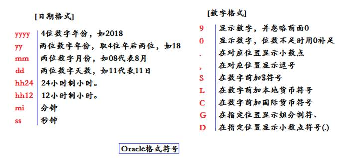
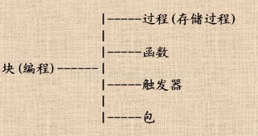
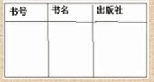

# ORACLE

## 一、 基本

### 0、基础

> DDL create alter drop truncate 
> DML select update insert delete 
> DCL grant revoke 
> DDL 和DML语言的区别为DDL语言会默认自动提交，DML语句需要手动进行提交 

逻辑存储结构：数据块BLOCK，区EXTENT，段SEGMENT，表空间TABLESPACE

物理存储空间：表空间，数据文件，控制文件，日志文件，数据字典

软件体系结构：SGA,后台进程。

系统全局区（SGA）包括：共享池、重做日志缓存区、数据高速缓存区，大池，JAVA池。

Oracle数据库表存放在数据文件上。

**ORACLE****数据库在启动的时候：数据库实例没有启动，数据库监听没有启动** 

 

**不同点：**

1）库函数不同。 2）Oracle是用表空间来管理的，Mysql不是。 3）显示当前所有的表、用户、改变连接用户、显示当前连 接用户、执行外部脚本的语句的不同。 4）分页查询时候时候，[mysql](https://m.2cto.com/database/MySQL/)用limit oracle用rownum

### 1、事务

Oracle默认支持的隔离级别是：read commited

Mysql默认支持的隔离级别是：reapatable read

set transaction isolation level serializable;

 

事务具有以下的作用： 

 \* 一致性：同时进行的查询和更新彼此不会发生冲突，其他用户不会看到发生了变化但尚未提交的数据。

 \* 可恢复性：一旦系统故障，数据库会自动地完全恢复未完成的事务。

### 2、访问其他用户的对象

**Oracle****将表/****用户都看成是对象**…那么我们怎么在scott用户下访问hr用户下的表呢？？？

 

其实，我们只要在访问表的时候，指定具体的用户.数据库表就行了，但是呢，还要看看该用户有没有权限查询别的用户的数据表，于是就需要赋予权限了…

 

声明：scott或hr叫用户名/方案名/空间名

   scott--tiger

   hr-----lion

 

查询当前用户是谁

show user;

 

查询scott自己表空间下的所有对象时，可加，或不加用户名select * from emp;

select * from emp;

或

select * from scott.emp;

 

以sysdba身份解锁hr普通帐户

alter user hr account unlock;

 

以sysdba身份设置hr普通帐户的密码

alter user hr identified by lion;

 

当scott查询hr表空间下的所有表时，必须得加用户名

select * from hr.jobs;

 

在默认情况下，每个用户只能查询自已空间下的对象的权限，不能查询其它用户空间下的对象

 

以sysdba身份角色，授予scott用户查询所有用户空间下的对象权限

grant select any table to scott;

 

以sysdba身份，撤销scott用户查询所有用户空间下的对象权限

revoke select any table from scott;

 

scott自已查看自己所拥有的权限

select * from user_sys_privs;

 

从scott用户空间导航到sysdba用户空间

conn / as sysdba;

 

从sysdba用户空间导航到scott用户空间

conn scott/tiger;

 

从scott用户空间导航到hr用户空间

conn hr/lion;

 

查询hr用户空间中的所有对象

select * from tab;

 

从hr用户空间导航到scott用户空间

conn scott/tiger;

 

在scott用户空间下，查询hr用户空间下的jobs表，必须加上hr用户空间名

select * from hr.jobs;

 

### 3、序列

Mysql的自动增长可以直接在创建表的时候，在字段后面跟上auto increament关键字就行了。那Oracle 有没有自动增长策略呢？？？

**Oracle****使用的是序列这么一个对象**….

· （1）类似于MySQL中的auto_increment自动增长机制，但Oracle中无auto_increment机制

· **（2****）是oracle****提供的一个产生唯一数值型值的机制**

· （3）通常用于表的主健值

· （4）序列只能保证唯一，不能保证连续

§ 声明：**oracle****中，只有rownum****永远保持从1****开始，且继续**

· （5）序列值，**可放于内存，取之较快**

 

那oralce中的序列和Mysql中的自动增长有啥区别？？？

· **Mysql****每张表都会维护一个自动增长的程序…**

· **Oralce****会把序列存放在内存中，可以供几张表使用…**

 

有的同学可能会疑问，我们在分页的时候用到了rownum这么一个伪列，为啥不用它来做自动增长的呢？？？

rownum的值虽然是唯一和连续的，但是**不能一直唯一标识该记录**…也就是说，**一旦该记录删除了，那么****rownum****的值是会变的**。

 

为什么要用序列

· （1）**以前我们为主健设置值，需要人工设置值，容易出错**

· （2）**以前每张表的主健值，是独立的，不能共享**

 

为emp表的empno字段，创建序列emp_empno_seq，create sequence 序列名
 **create sequence emp_empno_seq;**

 删除序列emp_empno_seq，drop sequence 序列名
 **drop sequence emp_empno_seq;**

 查询emp_empno_seq序列的当前值currval和下一个值nextval，第一次使用序列时，必须选用：序列名.nextval
 select emp_empno_seq.nextval from dual;
 select emp_empno_seq.currval from dual;

 使用序列，向emp表插入记录，empno字段使用序列值
 insert into emp(empno) values(emp_empno_seq.nextval);
 insert into emp(empno) values(emp_empno_seq.nextval);
 insert into emp(empno) values(emp_empno_seq.nextval);

 修改emp_empno_seq序列的increment by属性为20，默认start with是1，alter sequence 序列名
 alter sequence emp_empno_seq increment by 20;

 修改emp_empno_seq序列的start with属性，行吗
 alter sequence emp_empno_seq start with 100;

 有了序列后，还能为主健手工设置值吗？
 insert into emp(empno) values(9999);
 insert into emp(empno) values(7900);

 删除表，会影响序列吗？
 你无法做insert操作,表真正亡，序列亡

 删除序列，会影响表吗？
 不会

 

### 4、索引

是一种**快速查询表中内容的机制**，类似于新华字典的目录

create index 索引名称 on 表名(字段名)；

**在定义primary key****或unique****约束后系统自动在相应的列上创建索引**

 

**索引的原理：**根据建立索引的字段建立索引表，**存放字段值以及对应记录的物理地址**，从而在搜索的时候根据字段值搜索索引表的到物理地址直接访问记录。

引入索引虽然提高了查询速度,但本身占用一定的系统存储容量和系统处理时间,需要根据实际情况进行具体的分析。

 

**为什么要用索引**

· （1）**通过指针加速****Oracle****服务器的查询速度**

· （2）**通过****rowid****快速定位数据的方法，减少磁盘I/O**

 

**rowid****的特点**

· （1）位于每个表中，但表面上看不见，例如：desc emp是看不见的

· （2）只有在select中，显示写出rowid，方可看见

· （3）它与每个表绑定在一起，表亡，该表的rowid亡，二张表rownum可以相同，但rowid必须是唯一的

· （4）rowid是18位大小写加数字混杂体，唯一代表该条记录在DBF文件中的位置，物理存储位置

· （5）rowid可以参与=/like比较时，用''单引号将rowid的值包起来，且区分大小写

· （6）rowid是联系表与DBF文件的桥梁

## 二、SQLPlus常用命令

　　**1、连接到数据库**

　　语法：conn username/password [@server][as sysdba|sysoper];说明：相当于用户登录

　　**2、断开连接**  　

　　语法：disc[onnect];说明：disc是disconnect的缩写，该命令断开和oracle的连接但是不退出sqlplus窗口。

　　**3、修改密码**

　　语法：passw[ord]; 说明：passw是password的缩写，该命令用于修改当前用户的密码。ps:如果需要修改其他用户的密码，需要使用sys/system账户登录。

​    **4、显示当前用户名**

​    语法：show user;

　　**5、关闭窗口**

​    语法：exit;说明：exit命令断开和oracle的连接同时退出sqlplus窗口。

　　**操作截图：**

## 三、文件操作命令

**1、运行文件**   

　　语法：start 文件位置；说明：例如start d:\a.sql;就能运行d盘下的a.sql文件。这里start可以用@代替。

**2、编辑文件**

​         语法：edit 文件位置；说明：例如edit d:\a.sql;就能使用记事本打开a.sql文件。

**3、输出文件**

​        语法：spool 文件位置; spool off; 说明：将sqlplus屏幕中spool 文件放在位置; 保存SQL语句到硬盘，并创建sql文件； 

## 四、用户管理

### 1、创建用户(dba)

语法：create user *** identified by ***;
 　说明：这里dba是指需要数据管理员身份才能进行权限操作，如system等管理员用户才能创建新用户。***处分别填写要创建的用户和密码。ps:新创建的用户没有任何权限。

　　

### 2、删除用户(dba)

语法：drop user *** [cascade];说明：权限操作，如果该用户下有表格，删除用户是需要带上cascade关键字。

### 3、权限管理

**1****）相关概念**
 　权限：Oracle中用户的很多操作都是需要权限的，Oracle中的权限可以分为系统权限（用户对数据库相关操作的权限）和对象权限（用户对其他用户的数据对象如表格、视图、触发器等进行操作的权限）。
 　角色：我们一般不直接将权限赋予给用户，而是将角色赋予给用户，不同的角色携带不同的权限，由此用户就得到了角色拥有的权限。而角色又分为预定义角色和自定义角色。
 　   

**2****）赋予/****撤销权限grant to /revoke from**
 　**通过角色赋予权限**
 　语法：grant 角色名 to 用户名;
 　  

**用户赋予表格操作权限**
 　语法：grant 权限 on 表格 to 用户名;
 　说明：比如用户tom是没有访问用户scott的emp表权限的，所以我们需要登录scott用户，并执行“grant select on emp to tom;”语句，这时用户tom就有了访问scott.emp的权限。ps:其他权限如delete、update、insert、all等。

**撤销用户赋予的表格操作权限**
 　语法：revoke 权限 on 表格 from 用户名;
 　说明：和grant to类似改为revoke from就是权限撤销。

**权限传递**
 　我们希望赋予的权限能够“传递”，比如scott执行了语句“grant select on emp to tom;”就是赋予tom访问emp表的权限，我们希望通过tom也能赋予其他用户这个权限，那么scott需要执行语句“grant select on emp to tom **with grant option;**”。（相当于scott有一把小刀，并且scoot给了tom使用小刀的权利，并且，scott赋予了tom把这把刀给其他人用的权利）。
 　语法：赋予系统权限的语句 + admin option;
         赋予对象权限的语句 + grant option;
 　说明：需要注意的是，比如scott赋予了tom操作emp表并且能传递这个权限的权利，tom将操作scott.emp这个权限赋予给了用户lucy，当scott撤销tom操作emp表权利时，lucy也不再具有该权限。相当于“级联撤销”。

### 4、用户口令管理profile

profile是口令限制，使用profile关键字可以管理用户口令。

**1****）账户锁定**

语法：create profile *** limit failed_login_attemps m password_lock_time n;
 alert user 用户名 profile ***;
 　说明：第一句是创建一个名为***的口令限制profile，第二句是设置用户的口令限  制为***：即当用户错误输入口令m次后该账户将会锁定n天。

 

**2****）账户解锁(dba)**

语法：alert user 用户名 account unlock;
 　说明：当某用户被锁定时可以使用dba用户进行解锁。

 

**3****）终止口令**

语法：create profile *** limit password_life_time m password_grace_time n;
    alert user 用户名 profile ***;
 　说明：创建一个终止口令profile并修改为某用户的profile，即设置该用户的口令生命周期为m天，即需要每m天修改一次口令，宽限n天。

 

**4****）历史口令**

语法：create profile *** limit password_life_time m password_grace_time n password_reuse_time z;
    alert user 用户名 profile ***;
 　说明：在终止口令语句后加password_reuse_time z就可以让用户不使用z天内的历史口令，即z天后历史口令又可以继续使用。

 

**5****）删除profile**

语法：drop profile *** [cascade];
 　说明：当不需要某个profile时可以将其删除，**cascade****是进行级联删除。**

 

　　 

 

 

## 五、表管理

### 1、表命名规范

·  必须以字母开头；

·  长度不能超过30个字符；

·  不能使用Oracle保留字；

·  只能使用如下字符 A-Z，a-z，0-9，$,#。

### 2、Oracle中的数据类型

**字符型**

· char：定长，最大长度2000字节。如：char(10)，表示存储10字节长度的字符串，不足10字节的以空格后补。特点：浪费存储空间，但查询速度快。

· nchar：同char一样，只是nchar是Unicode编码的，支持多国语言。

· varchar2：变长，最大长度4000字节。如char(20)，表示可存储最大长度为20字节的字符串。特点：节约存储空间，但查询速度慢。

· nvarchar2：同varchar2一样，只是nvarchar2是Unicode编码的，支持多国语言。

· clob（character large object）：字符型大对象 ，最大长度4G。特点：够大。

**数字类型**

· number：可表示整数和小数，范围在[-10^38,10^38]。

· number(m)：表示一个m个有效位数的整数。

· number(m,n)：表示一个m个有效位数的小数，其中包含n个小数位。 

**日期类型**

· date：精确到秒。默认格式是“dd-mon-yy”，即“日-月-年”，而我们中国的习惯是“年-月-日”，所以可以使用sql> alter session set nls_date_format = 'yyyy-mm-dd';来修改日期的格式。

· timestamp： 是date的数据类型的扩展，可以精确到小数秒（fractional_seconds_precision）。 

**二进制大对象类型**

· blob(Binary Large Object)： 二进制数据， 可以存放图片、声音、视频等，最大长度 4G。ps：一般情况下我们只需要存储大文件路径即可。

**Oracle中的null值**

函数NVL( string1, replace_with)。它的功能是如果string1为NULL，则NVL函数返回replace_with的值，否则返回string1的值，如果两个参数都为NULL ，则返回NULL。

**如果我们使用null****值的数据与其他数据进行运算…那么最终得出的结果都是null****值。**

### 子查询

子查询：
 当一步不能求解时，可以使用子查询。
 分为：
 单行子查询
 多行子查询
 
 可以在主查询的select, from, where, having 都可以放子查询
 不可以在主查询的group by 放子查询
 单行操作符对应单行子查询，多行操作符对应多行子查询

 在select中放子查询时，要求只能是单行子查询。

IN：

ANY：
 小于某集合中的任意一个值，就是小于集合中的最大值。
 大于某集合中的任意一个值，就是大于最小值。

ALL：
 小于某集合中的所有值，就是小于最小值。
 大于某集合中的所有值，就是大于最大值。

 

练习题一：
 题目：找到薪水大于本部门平均薪水的员工。
 答案：
 select *
 from emp e1
 where sal > ( select avg(sal) from emp e2 where e2.deptno=e1.deptno )

练习题二：
 题目：找到员工表中工资最高的前三名的员工信息
 答案：
 select rownum, empno, ename, sal
 from (select empno, ename, sal from emp order by sal desc)
 where rownum<=3
 

rownum是一个伪列，表示记录在结果集中的行号。
 1，rownum一旦生成，就不会变化（会先按没有排序时的默认顺序生成rownum，然后再执行排序）。
 2，对于rownum，只能使用<与<=，不能使用>与>=与=。

## 六、Oracle函数

### 1、字符函数

· **lower(char)**    ：将字符串转化为小写

· **upper(char)**    ：将字符串转化为大写

· **length(char)**    ：获得字符串的长度

· **substr(char,m,n)**：截取字符串（从1标号）角标为[m,n]的子串。

· 1 --将员工姓名首字母大写，其余小写

· **replace(char,search_str,replace_str)**：字符串替换。

· concat(str,str)连接两个字符串

· --假设员工名中的字母S需要用*和谐后才显示

select replace(ename,'S','*') from emp;

· **instr(char1,char2,[,n[,m]])**：返回字符串char2在char1中首次出现的的位置。

· --返回S在员工名字中首次出现的位置

select instr(ename,'S') from emp;

 

 

### 2、数学函数

　　数学函数的参数和返回值都是数字类型，数学函数包括：cos、cosh、exp、In、log、sin、sinh、sqrt、tan、tanh、acos、atan、asin、round等，我们掌握常用的即可：

· **round(n [,m])****：**四舍五入数字n：如果省略m，那么四舍五入为整数；如果m是整数，则四舍五入到小数点后m位（相当于保留m位小数）；如果m是负数，则四舍五入到小数点前-m位。

· **trunc(n [,m])****：** 截取数字n：如果省略m，那么就截取整数部分，即保留整数部分；如果m是整数，则截取到小数点后m位（相当于保留m位小数）；如果m是负数，则截取到小数点前-m位。

· **mod(m,n)**  **：**取模。（取模运算和取余运算的数值是相同的，区别在于符号不同：取模运算结果的符号和除数的符号一致，而取余运算的符号和被除数的符号一致,比如：10 模 -3 = -1；10 余 -3 = 1;）。

· **floor(n)**    **：**floor是地板的意思， 所以返回 ≤ n的最大整数（向下取整）。

· **ceil(n)**     **：**ceil是天花板的意思，所以返回 ≥ n的最小整数（向上取整）。

· **abs(n)**     **：**返回绝对值。

 

### 3、日期函数

　　默认的date格式为：yy-mon-dd即18-1月-23的形式。

· **sysdate**：返回系统时间

· **select sysdate from dual**

· **add_months(d,n)**：返回当前时间增加n个月后的时间。

· 1 --查找入职满3年的员工姓名

· 2 select ename from emp where sysdate>=add_months(hiredate,**12*****3**);

· 3 --返回员工加入公司的天数（保留整数）

4 select ename,ceil(sysdate-hiredate) "入职天数" from emp;

· **last_day(d)**：返回指定日期所在月份的最后一天。

· --查询入职月刚好最后一天入职的员工姓名和入职时间

· select ename,hiredate from emp where hiredate = last_day(hiredate);

· --查询入职月倒数前5天的员工姓名

select ename,hiredate from emp where hiredate >= last_day(hiredate)-**4**;

 

### 4、转换函数

　　转换函数是Oracle用来进行数据类型转换的函数，比如number = 9527，就能转换为char类型。注意这个现象：比如我们往emp表中插入数据时，ename即员工姓名是vachar2类型，但是如果我们插入时输入的值是数字，那么这个语句不会报错，因为Oracle在插入数据时会尝试将不匹配的数据类型进行转换，如果成功就继续插入，这就是Oracle隐含转换的一个例子。

　 有的转换函数需要指定转换后的格式，Oracle格式符号规定如下：

　　

· **to_char(data [,str_form])**：将数据转换为char类型，第二个可选参数为格式。注意：对于数字格式如果输入错误会返回若干#，代表转换失败。

· --查询1980年入职的员工

select ename,hiredate from emp where to_char(hiredate,'yyyy')='1980';

· **to_date(str,form)**：将字符串为对应格式的日期。

· **to_number(date)**：将数据转换为number类型。

 

### 5、用户环境函数

　　userenv()即用户环境函数，是UserEnvironment的缩写，用法：userenv('参数名')：返回用户所属环境的指定参数的参数值。

　　比如select userenv('language') from emp;就会返回emp表的环境语言。但userenv是一个遗留功能，这些功能是保留向后兼容性。甲骨文建议您使用SYS_CONTEXT函数使用内建的USERENV命名空间的当前功能。所以，我们尽量**使用****sys_context('usernev','****参数名')****来代替userenv****函数**。

　　**参数名**是固定可选的，常用的有以下几种参数名：

· terminal      ：当前会话客户所对应的终端标识符。比如我的就是：LenovoPC。

· language     ：语言。

· db_name     ：数据库名。

· nls_date_format：当前会话客户对应的日期格式。

· session_user  ：当前会话客户对应的数据用户名。

· current_schema：当前会话客户对应的默认方案名。（其实就是用户名，注意，一个用户对应一个方案，方案存储了很多数据对象）

· host   　　   ：返回数据库所在主机的名称。

 

## 七、Oracle的两个管理员用户：sys&system

　　Oracle中的数据库管理员用户主要是：sys和system。但这两个用户是有**区别**的：

　　**1****、最重要的区别，存储的数据的重要性不同**

　　**sys**：**是****oracle****权限最高的用户**：所有的oracle的数据字典的基表和视图都存放在sys用户中，这些基表和视图对于oracle的运行是至关重要的，由数据库自己维护，任何用户都不能手动更改。 **sys****用户拥有sysdba****（系统数据库管理员）、sysoper****（系统操作员）、dba****（数据库管理员）三个角色或权限。**

**system**：用户用于存放**次一级**的内部数据，如oracle的一些特性或工具的管理信息。system用户拥有sysoper权限、dba角色权限或系统权限，比sys。

 

**SYSDBA** **不是ORACLE****缺省安装后就存在的用户。**

 

　　**2****、其次的区别：权限的不同**

　　**sys**：用户具有“SYSDBA”或者“SYSOPER”系统权限，所以**必须**用"as sysdba"或“as sysoper”登录，不能用normal。

　　**注意：**可能你使用普通用户 as sysdba也能登录成功，比如SQL> conn scott/tiger as sysdba 也能登录成功，但这不代表scott具有sysdba的权限。甚至有时候你随便输入一个不存在的账号密码然后输入 as sysdba也能登录成功，这是因为Oracle登录除了口令认证外还能使用操作系统认证，这就是**外部认证方式**，验证时oracle会对数据库配置文件sqlnet.ora进行读取，这文件就是oracle登录需要验证读取的文件。该文件的位置为：\oracle\product\10.2.0\db_1\network\ADMIN\sqlnet.ora，该文件中的SQLNET.AUTHENTICATION_SERVICES= (NTS)，参数值：NTS就是指定使用操作系统认证方式。不输入用户名密码登录成功还有重要一点：安装oracle时，oracle会自动创建一个操作系统数据库管理员组“ora_dba”，将当前操作系统用户添加至ora_dba组中，才可登录成功。所以如果你访问的是本地Oracle，那么你的电脑本身就已经相当于是sys用户了，就好比在自己家，当个皇帝肿么了的感觉。

　　**system**：拥有sysoper和dba角色权限。正常登录即可。

　　

　　**3****、sysdba****、sysoper****和dba****三个角色的区别**

　　首先权限大小不同，sysdba权限最大，sysoper次之，dba最小。

　　sysdba和sysoper的权限对比图如下：

　　

而dba的权限相对就更小一些了：上面两种特权用户sys和sysoper都能启动和关闭数据库，而dba用户只有在启动数据库后才能执行各种操作。

 

## 八、表空间和数据文件

　　**表空间是数据库的逻辑组成部分。**从物理上讲，**数据是存放在数据文件中的**，而从逻辑上讲，数据是存放在表空间中的，**一个表空间有若干个数据文件**组成。把oracle数据库看作一个实在房间，表空间可以看作这个房间的空间，是可以自由分配，在这空间里面可以堆放多个箱子（箱子可以看作数据库文件），箱子里面再装物件（物件看作表）。用户指定表空间也就是你希望把属于这个用户的表放在那个房间（表空间）里面。

　　**1****、数据库的逻辑结构**

　　Oracle中的逻辑结构包括：**表空间、段、区、块。**

数据库是由表空间构成，而表空间由段构成，段又由区构成，最后区又由Oracle块构成。这样分级是为了提高数据库的效率。数据库就好比一个国家，为了方便管理，我们将国家分为省，省又分为市，依次类推。Oracle也是如此，表空间的设计大大提高了数据库的效率。

**表空间能：**1）控制数据库占用的磁盘空间大小；2）dba可以**将不同的数据类型部署到不同的位置**，这样有利于提高I/O性能，同时利于备份和恢复等操作。

　　

**2****、表空间的操作**

- **创建表空间：**使用create tablespace来创建（操作用户需要具有dba权限或create tablespace的系统权限）。在创建数据库后为了方便管理表，我们通常要建立自己的表空间。

--创建一个名为sp01，数据文件大小为20m，段大小为128k的表空间，存储位置为：d:\test\sp01.dbf

create tablespace sp01 datafile 'd:\test\sp01.dbf' size 20m uniform size 128k;

- **使用表空间**
- --将新表存放到表中间sp01中

create table myemp(empno number(**4**),ename vachar2(**10**),sal number) tablespace sp01;

- **改变表空间的状态**
       当建立表空间的时，表空间处于联机状态（online）。联机状态下允许进行访问和读写等操作，但在某些时候如系统维护或数据维护时需要改变表空间的状态（需要特权用户进行操作）：
       1）脱机状态offline

alter tablespace 表空间名 offline

2）联机状态

alter tablespace 表空间名 online

3）只读状态

alter tablespace 表空间名 read only

- 删除表空间

drop tablespace 表空间名 including contents and datafiles;

contents和datafiles分别表示删除表时将所有数据库对象和数据库文件也删除。

- 扩展表空间
       表空间是由数据文件组成的，表空间的实际大小就是数据文件占用的大小，那么如果文件大小超过了表空间大小初始值那么继续插入数据就会报错，所以需要进行表空间扩展，一般有三种方法：
       1）增加数据文件

alter tablespace 表空间名 add datafile 'd:\test\sp02.dbf' size 20m;

2）增加文件的大小（单个文件一般不要超过500m）

alter tablespace 表空间名 datafile 'd:\test\sp01.dbf' resize 50m;

3）设置文件的自动增长

--空间不足时自动增加10m，最大空间500m

alter tablespace 空间名 datafile 'd:\test\sp01.dbf' autoextend on next 10m maxsize 500m;

- 移动数据文件
       有时磁盘的损坏导致数据文件无法再继续使用，为了能够继续使用需要将这些数据文件副本进行转移到其他磁盘，然后进行数据恢复。
       下面以移动数据文件sp01.dbf进行说明：
       1）确定数据文件所在的表空间

select tablespace_name from dba_data_files where filename='d:\test\sp01.dbf'

2）使表空间脱机：为了保证数据一致性。

alter tablespace sp01 offline;

3）使数据文件移动到指定的目录

host move 'd:\test\sp01.dbf' 'c:\test\sp01.dbf'

4）执行alter tablespace 命令
 在物理迁移后，为了使用户能访问到该数据文件，需要对数据文件进行逻辑上的修改：

alter tablespace sp01 rename 'd:\test\sp01.dbf' to 'c:\test\sp01.dbf'

5）如果需要访问该表空间，需要将表空间联机

alter tablespace sp01 online

 

## 九、PL/SQL介绍

### 1、概念

　　PL/SQL也是一种程序语言，叫做过程化SQL语言（Procedural Language/SQL）。PL/SQL是Oracle数据库对SQL语句的**扩展**。在普通SQL语句的使用上**增加了编程语言的特点**，**所以****PL/SQL****可以用来编写存储过程、存储函数、触发器等等。** PL/SQL是结构化SQL，就是在标准SQL中加入了IF...ELSE... For....等控制过程的SQL。

　　**2、学习必要性**

- **提高程序的运行性能**
       传统的使用程序操作数据库的方式需要获得connection，然后程序传到数据库后还需要进行编译才能执行，而且执行结果还需要回调，这些过程都需要花费时间。而PL/SQL编程可以直接进行过程编程，这就节省了数据连接、语句传送和编译的时间，同时编程结果可以被外部程序调用。
- **模块化的设计思想**
       很多复杂的过程都需要传送和执行大量的sql语句，比如分页的过程、实现订单的过程、转账的过程等等，这些过程就可以通过PL/SQL进行模块化整理进而方便管理。
- **减少网络传输量**
- **提高安全性**

PL/SQL的缺点在于移植性不好，如果项目不再使用Oracle来管理数据，那么需要重新编写语句。

 

### 2、开发工具

　　**1****、Oracle****自带的命令行工具sql\*plus**

　　下面举一个运用PL/SQL语句的案列：编写一个存储过程，并执行。

　　简单说一下，**存储过程**（Stored Procedure）的概念：在大型数据库系统中，一组为了完成特定功能的SQL语句集，存储在数据库中，经过一次编译后不需要再进行二次编译，用户直接通过指定该过程的名字，如果有参数并给出参数来执行它。类似编程里的函数的功能。

-  
- --1、创建一个表
- create     table test(name varchar2(**10**),password varchar2(**20**));

 

- --2、创建一个存储过程
- create     procedure proc1 is
-   begin--开始
-   insert into test     values('tom','tom123');--执行过程
-   end;--结束
-    **/--****创建标志**
- (注意：存储过程的命名需要唯一，如果重复需要更换一个名字或使用replace命令来替代已存在的存储过程)

 

- --3、调用过程
- exec 过程名(参数1,参数2...);（execute执行的缩写）

call 过程名(参数1,参数2...);

 

这只是存储过程使用的一个最基本案列，先简单体验一下。

　　**2****、非官方工具：PL/SQL Developer**

　　我们首先要安装PL/SQL Developer工具，安装成功并配置相关文件后就可以使用了。使用同上面一样的案例（这里只是简单演示，后面会重点使用）

　　

 

### 3、块（Block）

 　块是PL/SQL的基本程序单元，编写PL/SQL其实就是编写PL/SQL块。一个块可以实现一个简单的功能，而复杂的功能可能需要在一个块中嵌套其他若干块。（感觉很像一个函数段）

　　**1****、块的组成**

　　pl/sql 块由一般由三个部分**构成**：定义部分，执行部分，例外处理部分。

-  
- declare
- /*[可选]定义部分——定义常量、变量、游标、例外、复杂数据类型*/
- begin
- /*[必须]执行部分——要执行的pl/sql语句和sql语句*/
- **exception**
- /*[可选]例外处理部分——处理运行的各种错误*/

end;

 

　　**注：定义部分是从****declare****开始的，该部分是可选的；** **执行部分是从begin****开始的，该部分是必须的；** **例外处理部分是从exception****开始的，该部分是可选的。** 

　　

**2****、PL/SQL****的编写内容**

　　

　　

PL/SQL可以**编写的主要内容**有（注：Oracle中的数据对象包括：索引、表、视图、函数、包、过程、同义词、序列、触发器）：

- 过程（存储过程）
- 函数
- 包
- 触发器

 

　　**3****、编写规范**

--变量命名规范：以v_作为前缀

v_variable

--常量命名规范：以c_作为前缀

c_constant

--游标命名规范：以_cursor作为后缀

emp_cursor

--例外命名规范：以e_作为前缀

e_error

 

**4****、pl/sql****块示例**

- 设置显示PLSQL程序的执行结果，默认情况下，不显示PLSQL程序的执行结果，语法：set serveroutput on/off;
- set     serveroutput on --打开输出选项   
- begin   
-   dbms_output.put_line('hello');   
- end;

--说明： dbms_output是oracle提供的包，类似Java的包，包中有若干过程，如put_line就是该包的过程，可以输出指定参数。

 

 

- declare  
-   v_ename varchar2(**5**); --定义字符串变量   
- begin  
-   select ename into v_ename from emp     where empno=&**empno**; 
-   dbms_output.put_line('雇员名：'||v_ename);
- end;

--说明：into表示将查询的结果赋给变量v_ename;**&****表示需要从控制台输入变量**；**||****表示字符串拼接，也可以使用concat****函数来拼接。**

 

 

- declare 
-   --定义变量 
-   v_ename varchar2(5); 
-   v_sal      number(7,2); 
- begin 
-   --执行部分 
-   select ename,sal into v_ename,v_sal     from emp where empno=&empno; 
-   --在控制台显示用户名 
- dbms_output.put_line('用户名是：'||v_ename||' 工资：'||v_sal); 
-   --异常处理 
- exception 
- when     no_data_found then 
-   dbms_output.put_line('你的编号输入不符合规则！');
- end; 
- /

 

### 4、存储过程（Procedure）

　　**1****、概念**

**存储过程**（Stored Procedure）的概念：在大型数据库系统中，一组为了**完成特定功能的****SQL****语句集**，存储在数据库中，经过一次编译后不需要再进行二次编译，用户直接通过指定该过程的名字，如果有参数并给出参数来执行它。类似编程里的函数的功能，但是有区别，因为Oracle本身也具有函数。过程可以指定输入参数（in）将执行环境需要的数据传入，也可以指定输出数据（out）将执行环境中的数据导出到应用环境中。类似函数的参数和返回值。

**存储过程是预编译过的，执行时勿须编译，执行速度更快；存储过程封装了一批SQL****语句，便于维护数据的完整性与一致性；可以实现代码的复用。**

 

　　**2****、示例**

- --创建一个过程：为指定员工增加指定工资
- create or replace procedure pro_AddSal(v_ename     varchar2,v_addsal number) **is**
- begin
- update emp     set sal=sal+v_addsal where ename=v_ename;
- end;
- /
- --调用过程：为SCOTT增加1000元工资

exec pro_AddSal('SCOTT',**1000);**

 

我们可以也使用外部程序例如Java程序来执行：

**创建存储过程的调用对象：CallableStatement**

 

### 5、函数（Function）

　　**1****、概念**

函数用于返回特定的数据。当建立函数时，在函数头部必须包含**return**子句，而在函数体内必须包含return语句返回的数据。使用**create function**来建立函数。

**在函数内可以修改表数据，递归调用。**

　　**2****、示例**

- --函数示例：输入雇员的姓名，返回该雇员的年薪 
- --函数头：定义
- create     function fun_showYearSal(v_ename varchar2)
- return     number
- is yearSal     number(**7,2);**
- **begin** 
- **--****函数体：执行**
- **select     sal\*12+nvl(comm,0)\*12 into yearSal from emp where ename=v_ename;** 
- **return     yearSal;** 

**end;**

 

- --调用函数
- var yearSal     number;--定义一个变量用来接收返回值 
- call     fun_showYearSal('SCOTT') into:yearSal;--调用函数
- print     yearSal;--显示返回值

 

### 6、包（Package）

　　**1****、概念**

　　用于在逻辑上**组合过程和函数**。由包规范和包体两部分组成。使用**create package**命令来创建包。

　　**2****、示例**

- --创建包Create Package
- --包规范：起到声明作用
- create     package myPackage is
-   procedure update_sal(name     varchar2,newsal number);--过程
-   function annual_income(name varchar2)     return number;--函数
- end; 

/

 

- --实现包体：create package body
- create or     replace package body myPackage is 
-   --实现过程
-   procedure update_sal(name     varchar2,newsal number) is 
-   begin      
- ​    update emp set sal=newSal where     ename=name; 
-   end;
-   --实现函数
-   function annual_income(name     varchar2) 
-   return number
-   is annual_salary number(**7**,**2**); 
-   begin      
- ​    select sal***12**+nvl(comm,**0**)     into annual_salary from emp where     ename=name; 
-   return annual_salary; 
-   end;
- end;

/

 

- --调用包下的一个过程：call或exec
- call     myPackage.update_sal('SCOTT',**1500**);

 

### 7、触发器（Trigger）

　　触发器是在**事件发生时隐式地自动运行的**PL/SQL程序块，不能接收参数，不能被调用。**当定义触发器时，必须指定触发的事件和触发的操作。**

　　常用的触发事件包括：**insert****，update****，delete**语句。**触发操作实际就是一个****pl/sql****块。可以使用create trigger****来建立触发器。**说明：触发器可以维护数据库的安全和一致性。

触发器是很有用的数据对象，这里先简单了解。

 

触发器： 是**存储在数据库中的过程**，当表被修改（增、删、改）时它隐式地被激发。

 

### 8、游标

游标：是对查询出来的结果集作为一个单元来有效的处理。游标可以定在该单元中的特定行，从结果集的当前行检索一行或多行。可以对结果集当前行做修改。一般不使用游标，但是需要逐条处理数据的时候，游标显得十分重要。

 

**写一个存储过程，使employee(name,age,emp_no,salary)****表中的salary****值在0-1000****之间的员工的工资上涨20%****，（提示：要求用到游标）**

Cteate or replace procedure emp_sal

V_name employee.name%type;

V_emp_no employee.emp_no%type;

V_salary employee.salary%type;

Cursor cursor_sal is

   Select name,emp_no,salary from employee where salary between 0 and 1000;

Begin

   Open cursor_sal;

   Loop

​      Fetch cursor_sal into v_name,v_emp_no,v_salary;

​      Exit when cursor_sal%notfound; **游标是否到了末尾？**

​      Update employee set salary=salary*1.2 where name=v_name and emp_no=v_emp_no;

   End loop;

   Close cursor_sal;

   Commit;

End;

### 9、变量

　　**1****、类型**

- 标量类型（scalar）
- 复合类型（composite）
- 参照类型（reference）
- lob（large object）

 

　　**2****、标量类型（scalar****）**

标量的定义：亦称“无向量”。有些物理量，只具有数值大小，而没有方向，部分有正负之分。物理学中，标量（或作纯量）指在坐标变换下保持不变的物理量。用通俗的说法，标量是只有大小，没有方向的量。

 

　　1）语法

- **identifier****：**名称
- **constant****：**常量。需要制定初始值，而且不能够改变。
- **datatype****：**数据类型
- **not null****：**指定变量非空
- **: =**   给变量或是常量指定初始值
- **default****：**指定初始值
- **expr****：**指定初始值的pl/sql表达式，可是文本值、其他变量、函数

 

 

　　3）使用

- --输入员工号，显示雇员姓名、工资、个人所得税（税率为0.03）
- declare 
- c_tax_rate     number(**3**,**2**):=**0.03**;--税率
- v_ename     varchar2(**5**);--用户名 
- v_sal     number(**7**,**2**);--工资
- v_tax_sal     number(**7**,**2**);--所得税
- begin 
- --执行部分 
- select     ename,sal into v_ename,v_sal from emp where empno=&no; 
- --计算所得税 
- v_tax_sal:=v_sal*c_tax_rate; 
- --输出 
- dbms_output.put_line('姓名：'||v_ename||'，工资：'||v_sal||'，个人所得税为：'||v_tax_sal); 
- end; 

/  

 

 　4）使用%type类型

　　对于上面的pl/sql块：如果员工的姓名超过了5字符的话，就会有错误。为了降低pl/sql程序的维护工作量，可以使用%type属性定义变量。这样，可以**按照数据库列来确定定义的变量的类型和长度。**

- --语法
- 标识符名 表名.列名%type;
- --如
       v_ename varchar2(**5);** --用户名（上面的写法）
- v_ename     emp.ename%type; --用户名（改进的写法）

 

　　**3****、复合变量（composite****）**

　　复合变量是用于存放多个值的变量。

　　1）类型

- pl/sql记录
- pl/sql表
- 嵌套表
- varray（动态表）

　　

 2）pl/sql记录

　　**相当于高级语言中的结构体、类**。

　　注意：当引用pl/sql记录成员时，必须要加记录变量作为前缀（记录变量.记录成员）。

- --pl/sql记录实例 
- declare 
- --定义一个pl/sql记录类型emp_record_type，类型包含三个数据name,salary,title 
- type     emp_record_type is record( 
- name     emp.ename%type,
- salary     emp.sal%type,
- title emp.job%type);
- --定义了一个变量 sp_record ，类型是emp_record_type
- sp_record     emp_record_type;
- begin
- select     ename,sal,job into sp_record from emp where empno=**7788**;
- dbms_output.put_line('员工名：'||sp_record.name||'，工资是：'||sp_record.salary||'，工作是：'||sp_record.title);
- end;

/

 

　　3）pl/sql表

　　**相当于高级语言中的数组**。注意：在高级语言中数组的下标不能为负数，而pl/sql的下标是可以为负数的，并且表元素的下标没有限制。

- --pl/sql表实例
- declare
- --定义了一个pl/sql表类型sp_table_type，该类型是用于存放emp.ename%type
- --index by     binary_integer表示下标为整数
- type     sp_table_type is table of emp.ename%type index by binary_integer;
- --定义了变量sp_table，类型是sp_table_type
- sp_table     sp_table_type;
- begin
- select     ename into sp_table(**0**) from emp where empno=**7788**;
- dbms_output.put_line('员工名'||sp_table(**0**));
- end;

/

 

 　注：sp_table_type是pl/sql表类型；emp.ename%type制定了表的元素的类型和长度；sp_table为pl/sql表变量；sp_table(0)表示下表为0的元素。如果去掉where条件：

 

- --pl/sql表实例
- declare
- --定义了一个pl/sql表类型sp_table_type，该类型是用于存放emp.ename%type
- --index by     binary_integer表示下标为整数
- type     sp_table_type is table of emp.ename%type index by binary_integer;
- --定义了变量sp_table，类型是sp_table_type
- sp_table     sp_table_type;
- begin
- select     ename into sp_table(**0**) from emp;
- dbms_output.put_line('员工名'||sp_table(**0**));
- end;

/

 

　　**4****、参照变量**

　　1）概念

　　参照变量是用于**存放数值指针**的变量。是应用程序共享相同对象，从而降低占用的空间。分为：游标变量（ref cursor）和对象类型变量（ref obj_type）。

　　2）游标变量（ref cursor）

　　定义游标时，不需要指定相应的select语句。使用游标（open）时，需要制定select语句。

　　实例：使用pl/sql编写一个块，可以输入部门号，并显示该部门所有员工姓名和工资。

- --使用pl/sql编写一个块，可以输入部门号，并显示该部门所有员工姓名和工资。
- declare
- --定义游标类型
- type     sp_emp_cursor is ref cursor;
- --定义一个游标变量
- test_cursor     sp_emp_cursor;
- --定义变量
- v_ename     emp.ename%type;
- v_sal     emp.sal%type;
- begin
- --执行
- --把test_cursor和一个select结合
- open     test_cursor for select ename,sal from emp where deptno=&no;
- --循环取出
- loop
- fetch     test_cursor into v_ename,v_sal;
- --判断是否test_cursor为空
- exit when     test_cursor%notfound;
- dbms_output.put_line('姓名：'||v_ename||'，薪水：'||v_sal);
- end loop;
- end;

/

 

在上面的基础上，如果某个员工的工资低于200元，则增加100元。

- --使用pl/sql编写一个块，可以输入部门号，并显示该部门所有员工姓名和工资。
- declare
- --定义游标类型
-  type sp_emp_cursor is ref cursor;
- --定义一个游标变量
-  test_cursor sp_emp_cursor;
- --定义变量
-  v_ename emp.ename%type;
-  v_sal emp.sal%type;
-  begin
- --执行
- --把test_cursor和一个select结合
-  open test_cursor for select ename,sal     from emp where deptno=&no;
- --循环取出
-  loop
-   fetch test_cursor into v_ename,v_sal;
-   --判断工资高低，决定是否更新
-   if v_sal<**200** then
-   update emp set sal=sal+**100**     where ename=v_ename;
-   end if;
-   fetch test_cursor into v_ename,v_sal;
-   --判断是否test_cursor为空
-   exit when test_cursor%notfound;
-   dbms_output.put_line('姓名：'||v_ename||'，薪水：'||v_sal);
-  end loop;
- end;

/

 

## 十、PL/SQL进阶

一、控制结构

　　控制结构包括：判断语句（条件分支语句）、循环语句、顺序控制语句三种。

### 1、条件分支语句

- **if--then****：**简单条件判断

--编写一个过程，可以输入一个雇员名，如果该雇员名的工资低于2000，就给该雇员工资增加10%

create or replace procedure pro_addSal(v_ename varchar2) is

--定义变量

 v_sal emp.sal**%**type;

 begin

  select sal into v_sal from emp where ename=v_ename;

 --判断

 if v_sal<**2000** then

  update emp set sal=sal+sal***0.1** where ename=v_ename;

 end if;

 end;

/

   

**何时使用%type****，何时使用%rowtype****？**

- 当定义变量时，**该变量的类型与表中某字段的类型相同时，可以使用****%type**
- 当定义变量时，该变量与整个表结构完全相同时，可以使用%rowtype，此时通过变量名.字段名，可以取值变量中对应的值
- 项目中，常用%type

 

- **if--then--else****：**二重条件分支

--编写一个过程，可以输入一个雇员名，如果该雇员名的工资低于2000，就给该雇员工资增加10%，否则减少10%

create or replace procedure pro_addSal(v_ename varchar2) is

--定义变量

 v_sal emp.sal%type;

 begin

  select sal into v_sal from emp where ename=v_ename;

 --判断

 if v_sal<**2000** then

  update emp set sal=sal+sal***0.1** where ename=v_ename;

 else

  update emp set sal=sal-sal***0.1** where ename=v_ename;

 end if;

 end;

/

 

- **if--then--elsif--else****：**多重条件分支

create or replace procedure pro_addSal(eNo number) is 

 v_job emp.job%type; 

begin 

  select job into v_job from emp where empno=eNo;

 if v_job='PRESIDENT' then

   update emp set sal=sal+**1000** where empno=eNo;

 elsif v_job='MANAGER' then

  update emp set sal=sal+**500** where empno=eNo;

 else

  update emp set sal=sal+**200** where empno=eNo;

 end if;

end;

/

 

### 2、循环语句

- **loop****循环：**pl/sql中最简单的循环语句，以loop开头，以exit()作为结束判断语句，以end loop结尾。（至少循环一次）

 

--编写一个过程，输入用户名，并循环添加10个用户到users表中

create table users(userId number(**5**),userName varchar(**20**));--为了后面操作先创建一个users表

create or replace procedure pro_addUser(eName varchar2) is

--定义变量

 v_num number:=**1**;

begin

 loop

  insert into users values(v_num,eName);

  exit when v_num=**10**;--判断退出条件

  v_num:=v_num+**1**;--自增

 end loop;

end;

/

 

- **while****循环：**其实就是使用while语句来代替loop循环的exit语句。

 

--编写一个过程，删除users表中的编号1—10的个用户

--用户编号从1开始增加。

create or replace procedure pro_delUser is

--定义变量

 v_num number:=**1**;

begin

 while v_num<=**10** loop

   delete from users where userId=v_num;

   v_num:=v_num+**1**;--自增

  end loop;

end;

/

 

- **for****循环：**自带变量和循环退出条件

create or replace procedure pro_addUser is

begin 

 for i in **1**..**10** loop 

  insert into users values(i,'lucy');

 end loop; 

end;

/

 

### 3、顺序控制语句

- **goto****语句：**用于跳转到特定标号去执行语句。注：由于使用gogo语句会增加程序的复杂性，并使得应用程序可读性变差，因此建议不要使用goto语句。
       语法：goto lable，其中lable是已经定义好的标号名，如<<标记名>>，<<>>是标记符号，常用来跳出循环。

 

--循环输出i=1..10，最后跳出循环后打印“循环结束”

declare

 i int:=**1**;

begin

 loop

 dbms_output.put_line('i='||i);

 if i=**10** then

  goto end_loop;

 end if;

  i:=i+**1**;

 end loop;

 <<end_loop>>

 dbms_output.put_line('循环结束');

end;

/

 

- **null****语句：**null语句不会执行任何操作，并且会直接将控制传递到下一条语句。（类似Java中的continue的用法）

 

declare

 v_sal emp.sal%type;

 v_ename emp.ename%type;

begin

 select ename,sal into v_ename,v_sal from emp where empno=&no;

 if v_sal<**3000** then

  update emp set comm=sal***0.1** where ename=v_ename;

 else

  null;

 end if;

end;

/

 

### 4、使用Java程序调用存储过程

　　**1****、无返回值的存储过程**

　　创建一个表book，表结构如下：

　　　

- create table     book(bId number(**4**) primary key,bName varchar(**30**) not     null,publisher varchar(**30**));

　　编写一个过程，向book表添加书籍信息，要求可以通过java程序调用该过程：

- 使用命令行创建：

 

create or replace procedure pro_addBook(bookId number,bookName varchar2,pub varchar2) is

begin

 insert into book values(bookId,bookName,pub);

end;

/

 

- 使用Java调用无返回值的过程：

  call Pro_addBook

　　

**2****、有返回值的存储过程（返回若干值）**

　　编写一个过程，要求输入book表的书号就返回书籍信息：书名和出版社

- 使用命令行创建过程：

 

create or replace procedure pro_showBook

 (bookId in number,bookName out varchar2,pub out varchar2) is

begin

 select bName,publisher into bookName,pub from book where bId=bookId;

end;

/

 

- 使用Java调用返回值是若干数据的过程

  call Pro_showBook

　　

**3****、有返回值的存储过程（返回一个列表）**

　　为了方便说明，我们再往book表中添加几条数据：

　　

　　现在的需求是：创建一个过程，要求返回指定出版社如“知乎周刊”出版的书籍信息。

　  如表所示，返回结果是三本书，而这种查询结果集我们一般放在一个list即列表中，而在oracle在接受返回值时需要使用包package，并用**游标**来进行参数输出：

- **--****建立包，在该包中，定义一个游标类型test_cursor**
- create or     replace package testpackage as
-  type test_cursor is ref cursor;
-  end;
- /
- 使用命令行创建过程：

 

create or replace procedure pro_showPubBook

 (pub in varchar2,my_cursor out testpackage.test_cursor) is

begin

 open my_cursor for select * from book where publisher=pub;

end;

/

 

- 使用Java调用返回值是列表的过程：

  callPro_showPubBook

 

### 5、分页编程

　　案例：编写一个存储过程，要求可以输入表名、每页显示记录数、当前页，返回总记录数、总页数和返回的结果集。

　　**1****、使用rownum****分页查询**

- select *     from emp;
- select     t1.*,rownum rn from (select * from emp) t1;
- select     t1.*,rownum rn from (select * from emp) t1 where rownum<=**10**;
- select *     from (select t1.*,rownum rn from (select * from emp) t1 where rownum<=**10**)     where rownum>=**6**;

　　**2****、编写分页的存储过程**

- ;)
- --编写分页的存储过程
- create or     replace procedure fenye
-  (tableName in varchar2,--in表名
-  myPageSize in number,--in记录数
-  pageNow in number,--in当前页
-  myRows out number,--out总记录数
-  myPageCount out number,--out总页数
-  p_cursor out     testpackage.test_cursor--out结果集
-  )is
-  
-  v_sql varchar2(**500**);--定义sql语句
-  v_begin number:=(pageNow-**1**)*myPageSize+**1**;--定义起始页
-  v_end number:=pageNow*myPageSize;--定义尾页
-  
- begin
-  --执行分页查询语句
-  v_sql:='select * from (select     t1.*,rownum rn from (select * from '||tableName||
       　') t1 where     rownum<='||v_end||') where rn>='||v_begin;
-  --把游标和sql语句关联
-  open p_cursor for v_sql;
-  --计算myRows
-  v_sql:='select count(*) from     '||tableName;
-  execute immediate v_sql into myRows;
-  --计算myPageCount
-  if mod(myRows,myPageSize)=**0** then
-   myPageCount:=myRows/myPageSize;
-  else
-   myPageCount:=myRows/myPageSize+**1**;
-  end if;end;

/

 

　　**3****、使用Java****调用分页过程**

 1 import java.sql.CallableStatement;

 2 import java.sql.Connection;

 3 import java.sql.DriverManager;

 4 import java.sql.ResultSet;

 5

 6 public class Test {

 7    public static void main(String[] args) {

 8       // TODO Auto-generated method stub

 9       Connection ct = null;

10       CallableStatement cs = null;

11       try {

12          Class. forName("oracle.jdbc.driver.OracleDriver");

13          ct = DriverManager.getConnection("jdbc:oracle:thin:@127.0.0.1:1521:orcl", "scott", "***" );

14 

15          cs = ct.prepareCall( "{call fenye(?,?,?,?,?,?)}");

16 

17          // 赋值

18          cs.setString(1, "emp");

19          cs.setInt(2, 5);

20          cs.setInt(3, 1);

21 

22          // 注册总记录数

23          cs.registerOutParameter(4, oracle.jdbc.OracleTypes.INTEGER );

24          // 注册总页数

25          cs.registerOutParameter(5, oracle.jdbc.OracleTypes.INTEGER );

26          // 注册返回的结果集

27          cs.registerOutParameter(6, oracle.jdbc.OracleTypes.CURSOR );

28 

29          cs.execute();

30          // 取出总记录数

31          int rowNum = cs.getInt(4);

32          // 取出总页数

33          int pageCount = cs.getInt(5);

34          ResultSet rs = (ResultSet) cs.getObject(6);

35 

36          // 显示

37          System. out.println( "rowNum=" + rowNum);

38          System. out.println( "pageCount=" + pageCount);

39 

40          while ( rs.next()) {

41             System. out.println( "编号：" + rs .getInt(1) + ",姓名：" + rs .getString(2));

42          }

43       } catch (Exception e) {

44           // TODO Auto-generated catch block

45          e.printStackTrace();

46       } finally {

47          try {

48             // 关闭资源

49             cs.close();

50             ct.close();

51          } catch (Exception e1) {

52             // TODO Auto-generated catch block

53             e1.printStackTrace();

54          }

55       }

56   }

57 }

 

　　****

 

### 6、知识点

**你在项目现场，用户要求你向正在运行的表中添加一个字段，你该怎么做？**

第一种方法：关闭数据库，然后使用受限模式打开，由sys/sysdba来进行

第二种方法：不关闭数据库，将数据库置于静默状态在SYS/SYSDBA模式下用ALTER SYSTEM QUISCE RESTRICTED，**这种状态下只有****SYS/SYSDBA****才可以对数据库进行操作**，修改完毕之后再退出静默状态ALTER SYSTEM UNQUISCE.

 

了数据库的两种特殊状态：静默状态(QUISCE)和挂起状态

**静默状态**就是只有特殊权限的SYS/SYSDBA才可以对数据库进行操作，使用ALTER SYSTEM QUISCE RESTRICTED以后系统将等候活动着的会话主动结束，同时阻止建立新的会话，系统挂起所有的SQL语句，等恢复以后再重新激活会话执行挂起的SQL。

**挂起状态**就是系统将数据库所有对物理文件（数据文件，控制文件，日志文件）的I/O操作都暂停，但是并不禁止非DBA用户对数据库进行操作。这种状态主要用于进行数据库备份。