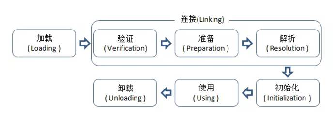

## JVM篇

### 一、JVM JDK 和 JRE 

**JAVA是解释型语言，先编译成.Class，再对其进行一行行解释地执行的**

**一次编译，到处执行；垃圾收集，提升健壮性**

JDK：开发包；JRE：运行环境；JDK包含JRE

 

#### JVM、JVM组成部分

> Java虚拟机（JVM）是运行 Java 字节码的虚拟机，是一个软件，不同的平台有不同的版本。JVM有针对不同系统的特定实现（Windows，Linux，macOS），目的是使用相同的字节码，它们都会给出相同的结果。
>
> Java虚拟机（JVM）是运行 Java字节码的虚拟机。字节码和不同系统的 JVM实现是 Java语言“一次编译，随处可以运行''的关键所在。

**字节码相同，由JVM翻译成的机器码却不一样**

**JVM组成部分**

JVM 的结构基本上由 4 部分组成：

- 类加载器，在 JVM 启动时或者类运行时将需要的 class 加载到 JVM 中
- **执行引擎，**执行引擎的任务是**负责执行** **class** **文件中包含的字节码指令**，相当于**实际机器上的CPU**
- 内存区，将内存划分成若干个区以模拟实际机器上的存储、记录和调度功能模块，如实际机器上的各种功能的寄存器或者 PC 指针的记录器等
- 本地方法库调用，调用 C 或 C++ 实现的本地方法的代码返回结果

- 程序计数器：保存着当前线程执行的**虚拟机字节码指令的内存地址**，程序计数器为"线程私有"的内存区域。没有规定任何OutOfMemory场景的区域。
- 虚拟机栈：，每创建一个线程时就会对应创建一个Java栈，所以Java栈也是"线程私有"的内存区域，这个栈中又会对应**包含多个栈帧**，每调用一个方法时就会往栈中创建并压入一个栈帧，**栈帧是用来存储方法数据和部分过程结果的数据结构**，每一个方法从调用到最终返回结果的过程，就对应一个栈帧从入栈到出栈的过程。
  - 一些**基本类型的变量**和**对象的引用变量**都是在函数的**栈内存**中分配。
- 本地方法栈：本地方法栈是为**Native方法**服务的。
- 堆区（线程共享）：堆（heap）是存储java实例或者对象的地方，**分配方式类似于链表。是GC的主要区域**，同样是线程共享的内存区域。
- 方法区（线程共享）：方法区（Method Area）是用于存储**类结构信息**的地方，**包括常量池、静态变量、构造函数（类的构造器实际上也是静态方法）等类型信息**，类型信息是由类加载器在类加载时从类文件中提取出来的。
  - 方法区是线程共享的
  - 方法区中还存在着常量池，常量池包含着**一些常量和符号引用**（加载类的连接阶段中的解析过程会将符号引用转换为直接引用）
  - 在JDK1.7及以后，JVM 已经将运行时常量池从方法区中移了出来，在 JVM 堆开辟了一块区域存放常量池。 

**结束生命周期**

在如下几种情况下，Java虚拟机将结束生命周期

- 执行了 System.exit()方法
- 程序正常执行结束
- 程序在执行过程中遇到了异常或错误而异常终止
- 由于操作系统出现错误而导致Java虚拟机进程终止 

#### 字节码

在 Java 中，**JVM可以理解的代码就叫做字节码**（即扩展名为 .class 的文件），它不面向任何特定的处理器，**只面向虚拟机**。Java 语言通过字节码的方式，在一定程度上解决了传统解释型语言执行效率低的问题，同时又保留了**解释型语言可移植**的特点。

#### 源代码到运行 

我们需要格外注意的是 .class->机器码这一步。在这一步 jvm 类加载器首先加载字节码文件，然后通过**解释器逐行解释**执行，这种方式的执行速度会相对比较慢。而且，有些方法和代码块是经常需要被调用的，也就是所谓的热点代码，所以后面引进了 **JIT** **编译器**，JIT 属于运行时编译。当 JIT 编译器完成第一次编译后，其会**将字节码对应的机器码保存下来**，下次可以直接使用。而我们知道，**机器码的运行效率肯定是高于Java解释器的**。这也解释了我们为什么经常会说 **Java是编译与解释共存的语言**

### 二、JVM参数

| 参数         | 意义                             | 占用                 | 介绍                                                         |
| ------------ | -------------------------------- | -------------------- | ------------------------------------------------------------ |
| -Xms         | 初始堆大小                       | 物理内存的1/64(<1GB) | 默认(MinHeapFreeRatio参数可以调整)空余堆内存小于40%时，JVM就会增大堆直到-Xmx的最大限制. 此值可以设置与-Xmx相同，以避免每次垃圾回收完成后JVM重新分配内存。 |
| -Xmx         | 最大堆大小                       | 物理内存的1/4(<1GB)  | 默认(MaxHeapFreeRatio参数可以调整)空余堆内存大于70%时，JVM会减少堆直到 -Xms的最小限制 |
| -Xmn         | 年轻代大小(1.4or lator)          |                      | 整个堆大小=年轻代大小 + 年老代大小 + 持久代大小. 增大年轻代后,将会减小年老代大小.此值对系统性能影响较大,Sun官方推荐配置为整个堆的3/8 |
| -Xss         | 每个线程的堆栈大小               |                      | JDK5.0以后每个线程堆栈大小为1M，以前每个线程堆栈大小为256K。 |
| -XX:NewRatio | 年轻代与年老代的比值(除去持久代) |                      | -XX:NewRatio=4表示年轻代与年老代所占比值为1:4,年轻代占整个堆栈的1/5 |
| -XX:PermSize | 设置持久代(perm gen)初始值       | 物理内存的1/64       |                                                              |

 

**一个性能较好的web****服务器jvm****参数配置**

-server//服务器模式

**-Xmx2g //JVM****最大允许分配的堆内存，按需分配**

-Xms2g //JVM初始分配的堆内存，一般和Xmx配置成一样以避免每次gc后JVM重新分配内存。

**-Xmn256m //****年轻代内存大小，整个JVM****内存=****年轻代 +** **年老代 +** **持久代**

-XX:PermSize=128m //持久代内存大小

**-Xss256k //****设置每个线程的堆栈大小**

-XX:+DisableExplicitGC //忽略手动调用GC, System.gc()的调用就会变成一个空调用，完全不触发GC

-XX:+UseConcMarkSweepGC //并发标记清除（CMS）收集器

-XX:+CMSParallelRemarkEnabled //降低标记停顿

-XX:+UseCMSCompactAtFullCollection //在FULL GC的时候对年老代的压缩

-XX:LargePageSizeInBytes=128m //内存页的大小

-XX:+UseFastAccessorMethods //原始类型的快速优化

-XX:+UseCMSInitiatingOccupancyOnly //使用手动定义初始化定义开始CMS收集

-XX:CMSInitiatingOccupancyFraction=70 //使用cms作为垃圾回收使用70％后开始CMS收集

 

-Xmx和-Xmn之比大概是1:9，如果把新生代内存设置得太大会导致young gc时间较长

一个好的Web系统应该是每次http请求申请内存都能在young gc回收掉，full gc永不发生，当然这是最理想的情况

xmn的值应该是保证够用（够http并发请求之用）的前提下设置得尽量小

 

**调优总结**

1. **年轻代大小选择**
1. 1. **响应时间优先的应用**：**尽可能设大，直到接近系统的最低响应时间限制**（根据实际情况选择）。在此种情况下，年轻代收集发生的频率也是最小的。同时，减少到达年老代的对象。
   2. **吞吐量优先的应用**：尽可能的设置大，可能到达Gbit的程度。因为对响应时间没有要求，垃圾收集可以并行进行，一般适合8CPU以上的应用。
1. **年老代大小选择**
   1. **响应时间优先的应用**：年老代使用并发收集器，所以其大小需要小心设置，一般要考虑**并发会话率**和**会话持续时间**等一些参数。如果堆设置小了，可以会造成内存碎片、高回收频率以及应用暂停而使用传统的标记清除方式；如果堆大了，则需要较长的收集时间。最优化的方案，一般需要参考以下数据获得：
1. 1. - 并发垃圾收集信息
      - 持久代并发收集次数
      - 传统GC信息
      - 花在年轻代和年老代回收上的时间比例

减少年轻代和年老代花费的时间，一般会提高应用的效率

1. 1. 吞吐量优先的应用：一般吞吐量优先的应用都有一个很大的年轻代和一个较小的年老代。原因是，这样可以尽可能回收掉大部分短期对象，减少中期的对象，而年老代尽存放长期存活对象。

   2. 较小堆引起的碎片问题
      
      因为年老代的并发收集器使用标记、清除算法，所以不会对堆进行压缩。当收集器回收时，他会把相邻的空间进行合并，这样可以分配给较大的对象。但是，当堆空间较小时，运行一段时间以后，就会出现“碎片”，如果并发收集器找不到足够的空间，那么并发收集器将会停止，然后使用传统的标记、清除方式进行回收。如果出现“碎片”，可能需要进行如下配置：

   3. - **-XX:+UseCMSCompactAtFullCollection**：使用并发收集器时，开启对年老代的压缩。
      - **-XX:CMSFullGCsBeforeCompaction=0**：上面配置开启的情况下，这里设置多少次Full GC后，对年老代进行压缩

### 三、类加载器

> **类加载器负责读取 Java字节代码，并转换成 java.lang.Class类的一个实例**。每个这样的实例用来表示一个 Java 类。通过**此实例的newInstance()方法**就可以创建出该类的一个对象。实际的情况可能更加复杂，比如 Java 字节代码可能是通过工具动态生成的，也可能是通过网络下载的。

Java虚拟机是如何判定两个 Java类是相同的？

答：Java 虚拟机不仅要看类的全名是否相同，还要看加载此类的类加载器是否一样。只有两者都相同的情况，才认为两个类是相同的。即便是同样的字节代码，被不同的类加载器加载之后所得到的类，也是不同的。比如一个 Java 类 com.example.Sample，编译之后生成了字节代码文件 Sample.class。两个不同的类加载器 ClassLoaderA和 ClassLoaderB分别读取了这个 Sample.class文件，并定义出两个 java.lang.Class类的实例来表示这个类。这两个实例是不相同的。对于 Java 虚拟机来说，它们是不同的类。试图对这两个类的对象进行相互赋值，会抛出运行时异常 ClassCastException。

#### 介绍

##### 加载类相关的方法

| 方法                                                   | 说明                                                         |
| :----------------------------------------------------- | :----------------------------------------------------------- |
| `getParent()`                                          | 返回该类加载器的父类加载器。                                 |
| `loadClass(String name)`                               | 加载名称为 `name` 的类，返回的结果是 `java.lang.Class` 类的实例。 |
| `findClass(String name)`                               | 查找名称为 `name` 的类，返回的结果是 `java.lang.Class` 类的实例。 |
| `findLoadedClass(String name)`                         | 查找名称为 `name` 的已经被加载过的类，返回的结果是 `java.lang.Class` 类的实例。 |
| `defineClass(String name, byte[] b, int off, int len)` | 把字节数组 `b` 中的内容转换成 Java 类，返回的结果是 `java.lang.Class` 类的实例。这个方法被声明为 `final` 的。 |
| `resolveClass(Class<?> c)`                             | 链接指定的 Java 类。                                         |

##### 类加载器的树状组织结构

Java 中的类加载器大致可以分成两类，一类是系统提供的，另外一类则是由 Java 应用开发人员编写的。系统提供的类加载器主要有下面三个：

- 引导类加载器（bootstrap classloader）：它用来加载 Java 的核心库，是用原生代码来实现的，并不继承自 `java.lang.ClassLoader` 。由C++语言实现(针对HotSpot VM)，负责将存放在<JAVA_HOME>lib目录或-Xbootclasspath参数指定的路径中的类库加载到JVM内存中，像java.lang、java.util、java.io.*等等。可以通过vm参数 `-XX:+TraceClassLoading` 来获取类加载信息。我们无法直接使用该类加载器
- 扩展类加载器（extensions classloader）：它用来加载 Java 的扩展库。Java 虚拟机的实现会提供一个扩展库目录。该类加载器在此目录里面查找并加载 Java 类。负责jie/lib/ext目录下的jar包加入，或java.ext.dirs系统变量指定的路径中的所有类库
- 系统类加载器（system/application classloader）：它根据 Java 应用的类路径（**CLASSPATH**）来加载 Java 类。一般来说，Java 应用的类都是由它来完成加载的。可以通过 `ClassLoader.getSystemClassLoader()` 来获取它。
- 除了系统提供的类加载器以外，开发人员可以通过继承 `java.lang.ClassLoader` 类的方式实现自己的类加载器，以满足一些特殊的需求，主要重写findClass方法。

除了引导类加载器之外，所有的类加载器都有一个父类加载器。

##### 双亲委派模型

**类的加载过程采用双亲委派机制**，这种机制能更好的保证 Java 平台的安全性

1. 提高安全性方面: 假设我们使用一个第三方Jar包，该Jar包中自定义了一个String类，它的功能和系统String类的功能相同，但是加入了恶意代码 那么，JVM会加载这个自定义的String类，从而在我们所有用到String类的地方都会执行该恶意代码。如果有双亲委派模型，自定义的String类是不会被加载的,因为最顶层的类加载器会首先加载系统的java.lang.String类，而不会加载自定义的String类,防止了恶意代码的注入 
2. 防止程序混乱：假设用户编写了一个java.lang.String的同名类,如果每个类加载器都自己加载的话，那么会出现多个String类，导致混乱 如果本加载器加载了，父加载器则不加载,那么以哪个加载的为准又不能确定了，也增加了复杂度

该模型要求除了顶层的 Bootstrap class loader 启动类加载器外，其余的类加载器都应当有自己的父类加载器。子类加载器和父类加载器**不是以继承**（Inheritance）的关系来实现，**而是通过组合（Composition）关系来复用父加载器的代码**。每个类加载器都有自己的命名空间（由该加载器及所有父类加载器所加载的类组成，在同一个**命名空间**中，不会出现类的完整名字（包括类的包名）相同的两个类；在不同的命名空间中，有可能会出现类的完整名字（包括类的包名）相同的两个类）

 

**面试官：双亲委派模型的工作过程？**

1. **当前 ClassLoader** 首先从自己已经加载的类中查询是否此类已经加载，如果已经加载则直接返回原来已经加载的类。

   每个类加载器都有自己的**加载缓存**，当一个类被加载了以后就会放入缓存，等下次加载的时候就可以直接返回了。

2. 当前 ClassLoader 的缓存中没有找到被加载的类的时候，委托父类加载器去加载，父类加载器采用同样的策略，首先查看自己的缓存，然后委托父类的父类去加载，一直到 **bootstrap ClassLoader.**

   当所有的父类加载器都没有加载的时候，再由**当前的类加载器**加载，并将其放入它自己的缓存中，以便下次有加载请求的时候直接返回。

 

除了启动类加载器，**其它加载器都继承了ClassLoader抽象类**，其中有loadClass()方法。该方法会先**检测该类有没有被加载过，没有则调用父类加载器进行加载；如果没有父类加载器，调用启动类加载器进行加载。**如果都没有加载成功，调用自己的findClass()**方法进行加载。

**面试官：为什么这样设计呢？**

解析：这是对于使用这种模型来**组织累加器的好处**

答：主要是为了安全性，**避免用户自己编写的类动态替换** **Java** **的一些核心类**，比如 String，同时也避免了重复加载，因为 JVM 中区分不同类，不仅仅是根据类名，相同的 class 文件被不同的 ClassLoader 加载就是不同的两个类，如果相互转型的话会抛java.lang.ClassCaseException

 

**打破双亲委派机制则**不仅要继承ClassLoader类，还要重写loadClass和findClass方法。

**findClass（）用于写类加载逻辑**、loadClass（）方法的逻辑里如果父类加载器加载失败则会调用自己的findClass（）方法完成加载，保证了双亲委派规则。

      

Java 的内存模型（JMM）

**JMM主要围绕在并发过程中如何处·理并发原子性、可见性和有序性这三个特征来建立的，通过解决这三个问题，就可以解决缓存不一致的问题**

Java 虚拟机规范中试图定义一种 Java 内存模型（Java Memory Model, JMM）来屏蔽掉**各层硬件和操作系统的内存访问差异**，以实现让 Java 程序在各种平台下都能达到一致的内存访问效果。

Java 内存模型规定了**所有的变量都存储在主内存**（Main Memory）中。每条线程还有自己的**工作内存**（Working Memory），线程的工作内存中保存了被该线程使用到的变量的主内存副本拷贝，线程对变量的所有操作（读取、赋值等）都必须在主内存中进行，而不能直接读写主内存中的变量。不同的线程之间也无法直接访问对方工作内存中的变量，**线程间的变量值的传递均需要通过主内存来完成**，线程、主内存、工作内存三者的关系如上图。

 

从硬件层面可以将存储体系划分为外存、**主存、高速缓存和寄存器**，后三者又称为内存，对CPU而言，寄存器就是CPU的工作内存，主存和高速缓存作为外存数据的缓冲。

**主内存就是硬件的内存**，而为了获取更好的运行速度，虚拟机及硬件系统可能会让工作内存**优先存储于**寄存器和高速缓存。

#### 加载 class 文件过程

 **ClassLoader 加载一个 class 文件到 JVM 时需要经过的步骤**

1. 第一个阶段是找到 .class 文件并把这个文件包含的字节码加载到内存中
2. 第二阶段又可以分为三个步骤，分别是字节码验证、Class 类数据结构分析及相应的内存分配和最后的符号表的链接，将类的二进制数据合并到`JRE`中
3. 第三个阶段是**类中静态属性和初始化赋值，以及静态块的执行等**

**具体流程**：

1. 加载

   查找并加载类的二进制数据加载时类加载过程的第一个阶段，在加载阶段，虚拟机需要完成以下三件事情：

   - 通过一个**类的全限定名**来获取其定义的**二进制字节流**
   - 这个字节流所代表的**静态存储结构**转化为**方法区的运行时数据结构**
   - 在**Java堆**中生成一个代表这个类的 **java.lang.Class对象**，作为对方法区中这些数据的访问入口

   相对于类加载的其他阶段而言，加载阶段（准确地说，是加载阶段获取类的二进制字节流的动作）是可控性最强的阶段，因为开发人员既可以使用系统提供的类加载器来完成加载，也可以自定义自己的类加载器来完成加载。

   加载阶段完成后，虚拟机外部的二进制字节流就按照虚拟机所需的格式存储在方法区之中，而且在Java堆中也创建一个 java.lang.Class类的对象，这样便可以通过该对象访问方法区中的这些数据。

   

2. **验证：确保被加载的类的正确性**

   验证是连接阶段的第一步，这一阶段的目的是为了确保Class文件的字节流中包含的信息符合当前虚拟机的要求，并且不会危害虚拟机自身的安全。验证阶段大致会完成4个阶段的检验动作：

   **文件格式验证：**验证字节流是否符合Class文件格式的规范；例如：是否以 0xCAFEBABE开头、主次版本号是否在当前虚拟机的处理范围之内、常量池中的常量是否有不被支持的类型。

   **元数据验证：**对字节码描述的信息进行语义分析（注意：对比javac编译阶段的语义分析），以保证其描述的信息符合Java语言规范的要求；例如：这个类是否有父类，除了 java.lang.Object之外。

   **字节码验证：**通过数据流和控制流分析，确定程序语义是合法的、符合逻辑的。

   **符号引用验证：确保解析动作能正确执行**。

   验证阶段是非常重要的，但不是必须的，它对程序运行期没有影响，如果所引用的类经过反复验证，那么可以考虑采用 -Xverifynone 参数来关闭大部分的类验证措施，以缩短虚拟机类加载的时间。

   

3. **准备：为类的静态变量分配内存，并将其初始化为默认值**

   准备阶段是正式为类变量分配内存并设置类变量初始值的阶段，这些内存都将在**方法区中分配**。对于该阶段有以下几点需要注意：

   ① 这时候进行内存分配的仅包括**类变量（static）**，而不包括实例变量，实例变量会在对象实例化时随着对象一块分配在Java堆中。

   ② 这里所设置的初始值通常情况下是数据类型默认的零值（如0、0L、null、false等），而不是被在Java代码中被显式地赋予的值。

   假设一个类变量的定义为： public static int value = 3;

   那么变量value在准备阶段过后的初始值为 0，而不是 3，因为这时候尚未开始执行任何 Java 方法，而把 value 赋值为 3 的public static指令是在程序编译后，存放于类构造器 `<clinit>（）`方法之中的，所以把value赋值为3的动作将在初始化阶段才会执行。

   这里还需要注意如下几点：

   对基本数据类型来说，对于**类变量（static）和全局变量**，如果不显式地对其赋值而直接使用，则系统会为其赋予默认的零值，而对于局部变量来说，在使用前必须显式地为其赋值，否则编译时不通过。

   对于同时被static和final修饰的常量，必须在声明的时候就为其显式地赋值，否则编译时不通过；而只被final修饰的常量则既可以在声明时显式地为其赋值，也可以在类初始化时显式地为其赋值，总之，在使用前必须为其显式地赋值，系统不会为其赋予默认零值。

   对于引用数据类型reference来说，如数组引用、对象引用等，如果没有对其进行显式地赋值而直接使用，系统都会为其赋予默认的零值，即null。

   如果在数组初始化时没有对数组中的各元素赋值，那么其中的元素将根据对应的数据类型而被赋予默认的零值。

   ③ 如果类字段的字段属性表中存在 ConstantValue 属性，即同时被 final 和 static 修饰，那么在准备阶段变量 value 就会被初始化为 ConstValue 属性所指定的值。

   假设上面的类变量 value 被定义为： public static final int value = 3;

   编译时 Javac 将会为 value 生成 ConstantValue 属性，在准备阶段虚拟机就会根据 ConstantValue 的设置将 value 赋值为 3。我们可以理解为 static final 常量在编译期就将其结果放入了调用它的类的常量池中

4. **解析：把类中的符号引用（常量名）转换为直接引用（地址）**

   解析阶段是虚拟机将**常量池内的符号引用替换为直接引用的过程**，解析动作主要针对`类或接口、字段、类方法、接口方法、方法类型、方法句柄和调用点限定符`7类符号引用进行。

   直接引用就是直接**指向目标的指针**、相对偏移量或一个间接定位到目标的句柄。

   符号引用通常是设计成**字符串--用文本形式来表示引用关系**，而直接引用则是jvm所能直接使用的形式，它既可以表现为直接指针，也可能是其他形式，关键点不在于形式是否为"直接指针"，而是在于jvm能否**"直接使用"**这种形式的数据。

   

5. 初始化（执行类构造器 `<clinit>（）`方法的过程）

   初始化，为类的**静态变量赋予正确的初始值**，JVM负责对类进行初始化，主要**对类变量进行初始化。**

   初始化过程中，如果发现父类还没初始化，先触发父类的初始化

   在Java中对类变量进行初始值设定有两种方式：
   
   ① 声明类变量是指定初始值
   
   ② 使用**静态代码块**为类变量指定初始值

 

#### 类初始化时机

只有当对类的主动使用的时候才会导致类的初始化

**类的主动使用包括以下六种： **

- 创建类的实例，也就是new的方式
- 访问某个类或接口的静态变量，或者对该静态变量赋值
- 调用类的静态方法
- 反射（如 Class.forName(“com.shengsiyuan.Test”)）
- 初始化某个类的子类，则其父类也会被初始化
- Java虚拟机启动时被标明为启动类的类（ main），直接使用 java.exe命令来运行某个主类

 **类的被动使用包括以下三种： **

- 通过数组定义类的引用，不会触发此类的初始化
- 引用常量不会触发此类的初始化（常量在链接阶段就存入调用类的常量池了）
- 子类调用父类的静态变量，不会导致子类的初始化

### 四、直接内存（堆外内存）

Java中的内存分为两个部分，一部分是不需要jvm管理的直接内存，也被称为堆外内存。堆外内存就是把内存对象分配在JVM堆意外的内存区域，**这部分内存不是虚拟机管理，而是由操作系统来管理**，这样可以减少垃圾回收对应用程序的影响。

 

使用

通过**NIO中的allocateDirect**这样的API可以Java堆外分配内存空间。然后通过Java虚拟机里面的DirectByteBuffer可以**引用和操作**这些堆外内存空间。

 

好处

使用堆外内存的好处是，可以提升性能。比如常规情况下，把java堆内部的数据进行远程发送，需要先把堆内部的数据拷贝到直接内存里面，也就是拷贝到堆外内存，然后在发送。**如果把对象分配到直接内存里面，发送的时候就可以省掉复制的哪一步操作**

 

缺点

缺点就是没有jvm帮助管理内存，需要我们自己来管理堆外内存，防止内存溢出。为了避免一直没有FULL GC，最终导致物理内存被耗完。我们会**指定直接内存的最大值**，通过-XX：MaxDirectMemerySize来指定，当达到阈值的时候，调用system.gc来进行一次full gc，把那些没有被使用的直接内存回收掉。

 

### 五、内存泄漏和内存溢出

> 内存溢出指的是内存不够用了。
>
> 内存泄漏是指对象可达，但是没用了。即本该被GC回收的对象或变量并没有被回收

 

内存泄露是导致内存溢出的原因之一；内存泄露积累起来将导致内存溢出。

 

**内存溢出的原因**

**内存溢出是由于没被引用的对象（垃圾）过多造成JVM**没有及时回收，造成的内存溢出。

1. 引用变量过多使用。在类中的属性中使用 **static**修饰的最好只用基本类型或字符串。

2. 大量的递归或无限递归，大量循环或死循环

3. 内存中加载的数据量过大，或者是单次从数据库中所取数据太多。

4. 检查是否有数组，List，Map中**存放的是对象的引用而不是对象**，因为这些引用会让对应的对象不能被释放。**会大量存储在内存中。**

5. 检查是否使用了“非字面量字符串进行+”的操作。

 

**内存泄漏的原因分析**

1. 长生命周期的对象引用短生命周期的对象；尽管短生命周期对象已经不再需要，但是因为长生命周期对象持有它的引用而导致不能被回收，缓存系统

2. 没有将无用对象置为null

3. 当一个对象被存储进HashSet集合中以后，就不能修改这个对象中的那些**参与计算哈希值的字段了**，否则，对象修改后的哈希值与最初存储进HashSet集合中时的哈希值就不同了，在这种情况下，即使在contains方法使用该对象的当前引用作为的参数去HashSet集合中检索对象，也将返回找不到对象的结果，这也会导致无法从HashSet集合中单独删除当前对象，造成内存泄露。

4. 如果是**全局性变量**，没有删除机制，就会造成内存只增不减，**单例的静态特性**

5. 内存溢出就是你要的内存空间超过了系统实际分配给你的空间，此时系统相当于没法满足你的需求，就会报内存溢出的错误。

 

**内存溢出的解决方案**

- 第一步，修改JVM启动参数，直接增加内存。(-Xms，-Xmx参数一定不要忘记加。
- 第二步，检查错误日志，查看“OutOfMemory”错误前是否有其它异常或错误。
- 第三步，对代码进行走查和分析，找出可能发生内存溢出的位置。

 

## JVM的垃圾回收机制

https://www.cnblogs.com/alsf/p/9017447.html

### 哪些内存需要回收？

JVM的内存结构包括五大区域：程序计数器、虚拟机栈、本地方法栈、堆区、方法区。

程序计数器、虚拟机栈、本地方法栈3个区域随线程而生、随线程而灭，因此这几个区域的内存分配和回收都具备确定性，就不需要过多考虑回收的问题，因为方法结束或者线程结束时，内存自然就跟随着回收了。

而**Java****堆区和方法区**则不一样、不一样!这部分内存的分配和回收是动态的，正是垃圾收集器所需关注的部分。

 

**GC触发条件：**

> Eden区满了触发Minor GC，这时会把Eden区存活的对象复制到Survivor区，当对象在Survivor区熬过一定次数的Minor GC之后，就会晋升到老年代（当然并不是所有的对象都是这样晋升的到老年代的），当老年代满了，就会报OutofMemory异常。作为一个Java开发者不能强制JVM执行GC

### GC是什么时候触发的

由于对象进行了分代处理，因此垃圾回收区域、时间也不一样。GC有两种类型：Minor GC和Full GC。

 

Young GC（新生代）

   一般情况下，当新对象生成，并且在Eden申请空间失败时，就会触发Minor GC，对Eden区域进行GC，清除非存活对象，并且把尚且存活的对象移动到Survivor区。然后整理Survivor的两个区。这种方式的GC是对年轻代的Eden区进行，不会影响到年老代。因为大部分对象都是从Eden区开始的，同时Eden区不会分配的很大，所以Eden区的GC会频繁进行。因而，一般在这里需要使用速度快、效率高的算法，使Eden去能尽快空闲出来。

 

GC新生代对象晋升到老年代情况

l Eden区满时，进行Minor GC，当Eden和一个Survivor区中依然存活的对象无法放入到Survivor中，则通过分配担保机制提前转移到老年代中。

l 若对象体积太大, 新生代无法容纳这个对象，-XX:PretenureSizeThreshold即对象的大小大于此值, 就会绕过新生代, 直接在老年代分配, 此参数只对Serial及ParNew两款收集器有效。

l 虚拟机给每个对象定义了一个对象年龄（Age）计数器。如果对象在Eden出生并经过第一次Minor GC后仍然存活，并且能被Survivor容纳的话，将被移动到Survivor区，并将对象年龄设为 1。对象在Survivor区中每熬过一次Minor GC，年龄就增加1，当它的年龄增加到一定程度（默认为15）时，就会被晋升到老年代中。对象晋升老年代的年龄阈值，可以通过参数 -XX:MaxTenuringThreshold 来设置。

l 如果在Survivor区中相同年龄（设年龄为age）的对象的所有大小之和超过Survivor空间的一半，年龄大于或等于该年龄（age）的对象就可以直接进入老年代，无需等到MaxTenuringThreshold中要求的年龄。

 

Full GC（老年代）

对整个堆进行整理，包括Young、Tenured和Perm。Full GC因为需要对整个堆进行回收，所以比Scavenge GC要慢，因此应该尽可能减少Full GC的次数。在对JVM调优的过程中，很大一部分工作就是对于Full GC的调节。

有如下原因可能导致Full GC：

a) 年老代（Tenured）被写满；

b) 持久代（Perm）(方法区)被写满；

c) System.gc()被显示调用；

d) 上一次GC之后Heap的各域分配策略动态变化；

e)  堆中分配很大的对象

 

永久代（Perm）：Perm不属于堆内存，有虚拟机直接分配。永久代就是HotSpot虚拟机对虚拟机规范中方法区的一种实现方式。

永久代存放Class、Method元信息，其大小跟项目的规模、类、方法的量有关，一般设置为128M就足够，设置原则是预留30%的空间。

 

如果老年代使用CMS垃圾回收器，需要添加"XX:+UseConcMarkSweepGC"。

 

适用：GC过程短暂停，适合对时延要求较高的服务，用户线程不允许长时间的停顿。

 

调优：

1、将转移到老年代的对象数量降低到最小；

2、减少full GC的执行时间；

 

### 如何判断一个对象是否已经死去？

**1.****引用计数：**在对象头处维护一个**counter**，每增加一次对该对象的引用计数器自加，如果对该对象的引用失联，则计数器自减。当counter为0时，表明该对象已经被废弃，不处于存活状态。**这种方式一方面无法区分软、虛、弱、强引用类别。**另一方面，会造成死锁，假设两个对象相互引用始终无法释放counter，永远不能GC。

**2.****可达性分析（Reachability Analysis****）**：从**GC Roots**开始向下搜索，搜索所走过的路径称为引用链。当一个对象到GC Roots没有任何引用链相连时，则证明此对象是不可用的。不可达对象。

**GC****停顿。**为了确保一致性(即所有对象之间的关系是确定下来的)而导致GC进行时必须进行停顿。

 

**GC Roots****对象包括**：虚拟机栈中**引用**的对象、方法区中类静态属性引用的对象、方法区中常量引用的对象、本地方法栈中JNI（Native方法）引用的对象；

**3.****对象死亡过程（最后一次挣扎）**

要真正宣告一个对象死亡，至少要经历两次标记过程；

1）如果对象在**进行可达性分析后**发现没有与GC Roots相连接的引用链，那它将会被第一次标记并且进行一次筛选，**筛选的条件是此对象是否有必要执行****finalize()****方法**，当对象没有覆盖finalize()方法，或者finalize()方法已经被虚拟机调用过，虚拟机将这两种情况都视为“没有必要执行”；

2）如果这个对象**被判定为有必要执行****finalize()****方法**，那么这个对象将会放置在一个叫做**F-Queue****的队列之中**，GC将对F-Queue中的对象进行第二次小规模的标记，如果对象在finalize()方法中成功拯救自己（重新与引用链上的任何一个对象建立关联），那在第二次标记时它将被移除出“即将回收”的集合，如果对象没有拯救自己，那就被**回收**了；

任何一个对象的finalize()方法都只会被系统自动调用一次，**不建议使用该方法，**因为它的运行代价高昂，不确定性大，无法保证各个对象的调用顺序，“关闭外部资源”之类的工作可以使用try-finally来替代；

 

 

### 方法区如何判断是否需要回收

方法区存储内容是否需要回收的判断可就不一样咯。方法区主要回收的内容有：**废弃常量和无用的类**。对于废弃常量也可通过**引用的可达性**来判断，但是对于无用的类则需要同时满足下面3个条件：

l 该类所有的实例都已经被回收，也就是Java堆中不存在该类的任何实例；

l 加载该类的ClassLoader已经被回收；

l 该类对应的java.lang.Class对象没有在任何地方被引用，无法在任何地方通过反射访问该类的方法。

 

### 垃圾回收算法有哪些？

答：**GC****的对象是****Java****堆和方法区**（**即永久区**）

 

\1.  引用计数： 
 原理是此对象有一个引用，即增加一个计数，删除一个引用则减少一个计数。垃圾回收时，只用收集计数为0的对象。**它很难解决对象之间相互循环引用的问题**。

**2.**  **现代虚拟机中的垃圾搜集算法：**

l 复制算法**(****新生代算法)**：当进行垃圾回收时，将Eden和Survivor中还存活的对象一次性复制到**另一块****Survivor****空间**上，最后清理掉Eden和刚才用过的Survivor空间。同时复制过去以后还能进行相应的内存整理，不会出现“碎片”问题。当然，此算法的缺点也是很明显的，**就是需要两倍内存空间**。

l 标记-清除：此算法执行分**两阶段**。第一阶段从引用根节点开始标记所有被引用的对象，第二阶段遍历整个堆，把未标记的对象清除。**此算法需要暂停整个应用，**同时，会产生内存碎片。

l 标记-整理：此算法结合了 “标记-清除” 和 “复制” 两个算法的优点。也是分两阶段，第一阶段从根节点开始标记所有被引用对象，第二阶段遍历整个堆，把清除未标记对象并且把存活对象“压缩”到堆的其中一块，**按顺序排放**。此算法避免了 “标记-清除” 的碎片问题，同时也避免了 “复制” 算法的空间问题。

l 分代收集算法： 分代收集算法并没有提出新的思想**，只是根据对象存活周期的不同将内存划为几块。**一般Java堆分为新生代和老年代，这样就可以根据各个年代的特点采用适当的收集算法。

**在垃圾收集过程中，可能会将对象移动到不同区域。** 

 

在新生袋中每次垃圾收集时都会由大批对象死去，只有少量存活，**那就用复制算法，**只需要付出少量存活对象的复制成本就可以。老年代中对象存活率高、没有额外担保，**所以必须使用****“****标记-****清理”****或者“****标记-****整理算法”。**

 

### 垃圾回收器

目前的收集器主要有三种：**串行收集器、并行收集器、并发收集器**。

 

1. 串行回收器

   **在新生代：使用复制算法进行垃圾回收；在老年代：使用标记-****整理算法进行垃圾回收。

   **在垃圾回收时，开启单个线程进行垃圾回收**，并且暂停所有的用户线程（Stop The World），这是JVMClient模式下的默认GC回收器。可以使用**-XX:+UseSerialGC**打开。

   

2.  并行收集器

   **并行清理**，听上去和ParNew垃圾回收器没有任何区别，但是此回收器相对于ParNew来说，他**关注吞吐量。**

   所谓的吞吐量，就是用户线程**执行的时间占比**，当使用Parallel Scavenge垃圾回收器的时候，可以通过设置参数，-XX:MaxGCPauseMillis控制最大垃圾收集停顿时间和-XX:GCTimeRatio设置吞吐量大小。
   
   

3. 并发收集器。CMS垃圾回收器（Concurrent Mark Sweep）

   这是垃圾回收器中**唯一一个使用标记****-****清理算法**的垃圾回收器。

   由于并发的原因，他的垃圾回收停顿时间会比较小，但是相应的牺牲了吞吐量，**停顿时间短的好处是能提高用户体验，**所以，他被广泛地用于B/S架构中。

 

​	虽然说CMS垃圾回收器能够减少回收垃圾停顿时间，但是他的缺点也比较明显：

​	由于频繁的进行垃圾回收，所以，吞吐量会下降；

​	**标记-清理带来的缺点：存在内存碎片**

 

4. G1垃圾回收器（Garbage First）

   G1垃圾回收器在CMS垃圾回收器的基础上有所改进，比较明显的有两点：

 

 **一是使用了标记-****整理算法，解决了垃圾碎片问题；**

 第二，G1垃圾回收器将回收内存分为了多个区域，会观察多个区域中垃圾的情况，并优先收集垃圾较多的区域，这也是他名字**Garbage First****的**由来.

 第三，G1垃圾回收器不需要其他垃圾回收器的配合就可以管理两个分代。

 

**总结:**

垃圾回收器，其实粗分有四种垃圾回收器，**串行，并行，并发，****G1****。**

o  串行处理器：

 --适用情况：数据量比较小（100M左右）；单处理器下并且对响应时间无要求的应用。

 --缺点：只能用于小型应用

o  并行处理器：

 --适用情况：“对吞吐量有高要求”，多CPU、对应用响应时间无要求的中、大型应用。举例：后台处理、科学计算。

 --缺点：应用响应时间可能较长

o  并发处理器：

 --适用情况：“对响应时间有高要求”，多CPU、对应用响应时间有较高要求的中、大型应用。举例：Web服务器/应用服务器、电信交换、集成开发环境。