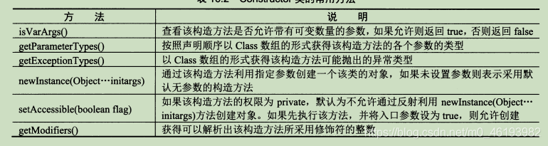

# 反射机制

## 定义

> JAVA反射机制是运行状态中，动态获取信息以及动态调用对象方法的功能。反射就是把java类中的各种成分（成员变量、方法、构造方法、包等等信息）映射成一个个的Java对象。
>
> 使用反射机制，就必须要先获取到该类的**字节码文件对象(.class)，该文件内容保存着 Class 对象**，就能通过该类中的方法获取到我们想要的所有信息(方法，属性，类名，父类名，实现的所有接口等等)，**每一个类对应着一个字节码文件也就对应着一个Class类型的对象，也就是字节码文件对象**

 

**类加载相当于 Class 对象的加载**，类在第一次使用时才动态加载到 JVM 中。

反射可以提供**运行时**的类信息，并且这个类可以**在运行时才加载进来**，甚至在**编译时期**该类的 .class 不存在也可以加载进来。


## 反射处理流程

1. 我们创建了一个类，通过编译（javac.exe）生成字节码文件.class文件，之后我们使用（java.exe）加载（JVM的加载器完成的）
2. 此.class文件加载到内存中以后，就是一个运行时类，存在缓存区，方法区，那么这个运行类本身就是Class实例。
3. 每个运行时类只加载一次
4. 有了Class的实例之后，我们可以做如下操作：
   - 创建运行时类的对象
   - 获取对应的运行时类的属性、方法、构造方法、父类、所在的包、异常、接口等
   - 调用对应的运行时类的属性、方法、构造方法等

 

## 反射的优缺点

**优点：**

- 可扩展性 ：应用程序可以利用全限定名创建可扩展对象的实例，来使用来自外部的用户自定义类。

- 类浏览器和可视化开发环境 ：一个类浏览器需要可以枚举类的成员。可视化开发环境（如 IDE）可以从利用反射中可用的类型信息中受益，以帮助程序员编写正确的代码。

- 调试器和测试工具 ： 调试器需要能够检查一个类里的私有成员。测试工具可以利用反射来自动地调用类里定义的可被发现的 API 定义，以确保一组测试中有较高的代码覆盖率。


**缺点：**

- 尽管反射非常强大，但也不能滥用。如果一个功能可以不用反射完成，那么最好就不用。在我们使用反射技术时，下面几条内容应该牢记于心。

- 性能开销 ：反射涉及了动态类型的解析，所以 **JVM 无法对这些代码进行优化。**因此，反射操作的效率要比那些非反射操作低得多。我们应该避免在经常被执行的代码或对性能要求很高的程序中使用反射。

- 安全限制 ：使用反射技术要求程序必须在一个没有安全限制的环境中运行。如果一个程序必须在有安全限制的环境中运行，如 Applet，那么这就是个问题了。

- 内部暴露 ：由于反射允许代码执行一些在正常情况下不被允许的操作（比如访问私有的属性和方法），所以使用反射可能会导致意料之外的副作用，这可能导致代码功能失调并破坏可移植性。反射代码破坏了抽象性，因此当平台发生改变的时候，代码的行为就有可能也随着变化。


## 解剖类

### 字节码文件

1. ```java
   //通过Class类中的静态方法forName，直接获取到一个类的字节码文件对象，此时该类还是源文件阶段，并没有变为字节码文件。
   Class clazz1 = Class.forName("全限定完整类名")　
   ```

2. ```java
   //当类被加载成.class文件时，此时Person类变成了.class，在获取该字节码文件对象，也就是获取自己，该类处于字节码阶段。
   Class clazz2 = Person.class;　
   ```

3. ```java
   //通过类的实例获取该类的字节码文件对象，该类处于创建对象阶段　
   Class clazz3 = new Person().getClass();
   ```

4. ```Java
   //加载器获取
   ClassLoader classLoader = this.getClass().getClassLoader();
   classLoader.loadClass(name);
   ```

### 类结构获取

> Field、Method 、Constructor 、Superclass、Interface、Annotation、Package

只要元素类型与维度是一样的，就是同一个class

Class 和 java.lang.reflect 一起对反射提供了支持，java.lang.reflect 类库主要包含了以下三个类，还有接口、父类、注解、泛型：

- Field （成员变量）：可以使用 get() 和 set() 方法读取和修改 Field 对象关联的字段；
- Method （方法）：可以使用 invoke() 方法调用与 Method 对象关联的方法；
- Constructor （构造函数）：可以用 Constructor 创建新的对象


**Class类提供了四个public方法，用于获取某个类的构造方法。**

- Constructor getConstructor(Class[] params)   根据构造函数的参数，返回一个具体的具有public属性的构造函数

- Constructor getConstructors()   返回所有具有public属性的构造函数数组

- Constructor getDeclaredConstructor(Class[] params)   根据构造函数的参数，返回一个具体的构造函数（不分public和非public属性）

- Constructor getDeclaredConstructors()  返回该类中所有的构造函数数组（不分public和非public属性）

- ```java
  //给予确定的参数,通过反射调用构造方法,这里的参数列表是一个不定参数列表
  Object newInstance(Object... initargs);
  ```


**四种获取成员方法的方法**

- Method getMethod(String name, Class[] params)  根据方法名和参数，返回一个具体的具有public属性的方法

- Method[] getMethods()  返回所有具有public属性的方法数组

- Method getDeclaredMethod(String name, Class[] params)  根据方法名和参数，返回一个具体的方法（不分public和非public属性）

- Method[] getDeclaredMethods()  返回该类中的所有的方法数组（不分public和非public属性）

- ```java
  //执行成员方法的函数,第一个参数是执行该方法的类对象,第二个是执行该方法需要的参数列表
  invoke(Object obj,Object... args);
  ```


**四种获取成员属性的方法**

- Field getField(String name)  根据变量名，返回一个具体的具有public属性的成员变量

- Field[] getFields()  返回具有public属性的成员变量的数组

- Field getDeclaredField(String name)  根据变量名，返回一个成员变量（不分public和非public属性）

- Field[] getDelcaredField()  返回所有成员变量组成的数组（不分public和非public属性）

- ```java
  //设置成员变量的数值,第一个参数是调用该成员变量的对象,第二个参数是赋予数值
  set(Object obj,Object value)
  ```


#### Constructor 



```java
Class<?>c=Class.forName(“com.mysql.jdbc.Drive”);
Constructor<?> con[]=c.getConstructor(String.class,int.class);//带数据类型，因为有相同名字的参数，但类型不同
User user=（User）con[0]. newInstance(“李”,1);//返回对象
 
//获取构造方法
Class clazz = Class.forName("fanshe.Student");
Constructor[] conArray = clazz.getConstructors();//公有
Constructor[] conArray = clazz.getDeclaredConstructors();//全部
     for(Constructor c : conArray){
        System.out.println(c);
        }
```

 

#### Method


```java
public class MethodDemo {
  public static void main(String[] args) throws Exception {
    /*
     * 要获取print（int ，int）方法
     */
    //1. 要获取一个方法就是获取类的信息，获取类的信息首先要获取类的类类型
    A a1 = new A();
    Class c = a1.getClass();
    
    /*
     * 2. 获取方法 名称和参数列表来决定
     * getMethod获取的是public的方法
     * getDelcaredMethod自己声明的方法
     */
    //Method m =c.getMethod("print", new Class[]{int.class, int.class});
      Method m = c.getMethod("print", int.class, int.class);
 
    //3. 方法的反射操作
    //方法的反射操作是用m对象来进行方法调用和a1.print调用效果完全相同
    //方法如果没有返回值返回null，有返回值返回具体的返回值
    //Object o = m.invoke(a1,new Object[]{10,20});
    Object o = m.invoke(a1,10,20); }}

class A{
  public void print(int a, int b){
    System.out.println(a+b);
  }
  public void print(String a, String b){
    System.out.println(a.toUpperCase()+ "," +b.toLowerCase());
  }
}
```

 

#### Field


```java
public class ClassUtil {

  /**
   * 打印类的信息，包括类的成员函数、成员变量
   * @param object 该对象所属类的信息
   */
  public static void printClassMessage(Object object){
    //要获取类的信息 首先要获取类的类类型
    Class c = object.getClass();//传递的是哪个子类的对象 c就是该子类的类类型
    //获取类的名称
    System.out.println("类的名称是："+c.getName());
    /*
     *Method类，方法对象
     * 一个成员方法就是一个Method对象
     * getMethods()方法获取的是所有的public的函数，包括父类继承而来的
     * getDeclaredMethods()获取的是所有该类自己声明的方法，不论访问权限
     */
    Method[] ms = c.getMethods();//c.getDeclaredMethods();
    for (int i=0; i<ms.length; i++){
      //得到方法的返回值类型的类类型
      Class returnType = ms[i].getReturnType();
      System.out.print(returnType.getName()+" ");
      //得到方法的名称
      System.out.print(ms[i].getName()+"(");
      //获取参数类型--->得到的是参数列表的类型的类类型
      Class[] paramTypes = ms[i].getParameterTypes();
      for(Class class1:paramTypes){
        System.out.print(class1.getName()); }
      System.out.println(")");
       \* 成员变量也是对象
       \* java.lang.reflect.Field
       \* Field类封装了关于成员变量的操作
       \* getFields()方法获取的是所有的public的成员变量的信息
       \* getD
       */
      //Field[] fs = c.getFields();
       Field[] fs = c.getDeclaredFields();*//**获取属性对象，返回数组*
      for (Field field:fs){
        //得到成员变量的类型的类类型
        Class fieldType = field.getType();
        String typeName = fieldType.getName();
        //得到成员变量的名称
        String fieldName = field.getName();
        System.out.println(typeName+ " "+fieldName); }

    int mod=f[i].getModifiers();//获取修饰符所对应的整数
    String modifier=Modifier.toString(mod);//获取修饰符
```

 

## 动态加载类

编译时刻加载类称为静态加载，运行时刻加载类称为动态加载，使用new方法新建实例即为静态加载类，在编译时候就要加载全部类。一旦缺少一个类，这整个程序是不是就不能用了。

动态代理其实就是通过反射来生成一个代理，　在Java中java.lang.reflect包下提供了一个Proxy类和一个InvocationHandler接口，通过使用这个类和接口就可以生成动态代理对象。JDK提供的代理只能针对接口做代理。我们有更强大的代理cglib，Proxy类中的方法创建动态代理类对象分三步，1、new出代理对象，通过实现InvacationHandler接口，然后new出代理对象来。2、通过Proxy类中的静态方法newProxyInstance，来将代理对象假装成那个被代理的对象，也就是如果叫人帮我们代买火车票一样，那个代理就假装成我们自己本人3、执行方法，代理成功。


**反射机制的应用实例**

集合中的泛型只在编译器有效，而到了运行期，泛型则会失效。

## 通过类名获取类中方法和方法的参数

```java
//静态方法，可以用类名.静态方法直接调用
  public static void getProperty() throws ClassNotFoundException {
      //获取对象类型  包名.类名  ?代表任意类型对象
      Class<?> classType=Class.forName("com.company.Customer");
      //获取对象中的所有方法
    Method[] methods = classType.getDeclaredMethods();
    for (int i=0;i<methods.length;i++){
    //获取方法名字
      String methodName=methods[i].getName();
//获取本方法所有参数类型，存入数组
      Class<?>[] parameterTypes = methods[i].getParameterTypes();
      for(int j=0;j<parameterTypes.length;j++){
          String parameterName = parameterTypes[j].getName();
          System.out.println("方法"+methodName+"的参数类型是"+parameterName);
      }
    }
}
```

 

# 内省

## 内省

内省（Introspector）是Java语言对Bean类属性、事件的一种**缺省处理方法**。

 

Java提供一套API用来访问某个属性的getter/setter方法，API存放于**包java.beans中**。

 

一般的做法是通过**类Introspector来获取某个对象的BeanInfo信息**，然后通过**BeanInfo来获取属性的描述器（PropertyDescriptor）**，通过这个**属性描述器就可以获取某个属性对应的getter/setter方法**，然后我们**就可以通过反射机制**来调用这些方法。

## 内省和反射区别：      

对一个 Bean 类来讲，**我可以没有属性，但是只要有 getter/setter 方法中的其中一个，那么 Java 的内省机制就会认为存在一个属性，**比如类中有方法 setMobile ，那么就认为存在一个 mobile 的属性。

## 内省代码演示

\1.        直接通过**属性的描述器**java.beans.PropertyDescriptor类，来访问属性的getter/setter 方法。.

 

\2.        通过类 Introspector 来获取某个对象的 BeanInfo 信息，然后通过 BeanInfo 来获取属性的描述器（ PropertyDescriptors ），通过这个属性描述器就可以获取某个属性对应的 getter/setter 方法，然后我们就可以通过反射机制来调用这些方法。

 

\3.        开源的**工具类Beanutils,**需要额外下载的**，commons-beanutils.jar，要使用它还必须导入commons-logging.jar包**，不然会出异常；

BeanUtils支持javabean属性的级联操作；有这个方法的get或者set都可以写，例如：所有类都继承Object类，实现了getclass（）；**所以会得到class属性。**

 

\4.        Beanutils与 PropertyUtils工具。这两个工具设置属性的时候一个主要区别是PropertyUtils.getPropety方法获得的属性值的类型为该 属性本来的类型，而BeanUtils.getProperty则是将该属性的值转换成字符串后才返回