# 一、多线程

## 初识多线程

### 进程

**定义：**进程是系统进行**资源分配和调度的独立单位**。每一个进程都有它自己的内存空间（堆空间和栈空间）和系统资源。

**进程控制块 (Process Control Block， PCB)** 描述进程的基本信息和运行状态，所谓的创建进程和撤销进程，都是指对 PCB 的操作。

 

**进程实现多处理机环境下的进程调度，分派，切换时，都需要花费较大的时间和空间开销。涉及到当前进程的 CPU 环境的保存和新被调度运行进程的 CPU 环境的设置**

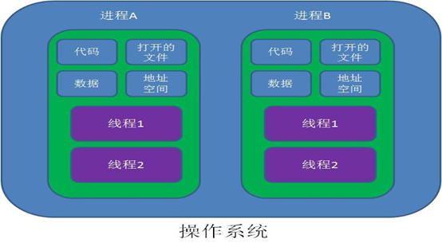

### 进程间通信

 **管道，消息队列，共享内存，信号量，socket，信号，文件锁**

 

高级进程通信是指**用户可直接利用操作系统所提供的一组通信命令，高效地传送大量数据的一种通信方式。（往往我们都是使用高级进程通信的）**

 

**进程通信是一种手段，而进程同步是一种目的。**也可以说，为了能够达到进程同步的目的，需要让进程进行通信，传输一些进程同步所需要的信息。

 

**1. 管道**

管道是通过调用 pipe 函数创建的，fd[0] 用于读，fd[1] 用于写。

当一个进程创建一个管道，并调用fork创建自己的一个子进程后，父进程关闭读管道端，子进程关闭写管道端，这样 提供了两个进程之间数据流动的一种方式。

\#include <unistd.h>

int pipe(int fd[2]);

它具有以下限制：

只支持半双工通信（单向交替传输）；

**只能在父子进程中使用。**

但是它不是普通的文件，并不属于其他任何文件系统，**并且只存在于内存中。**

 

**2. FIFO**

也称为命名管道，去除了管道只能在父子进程（IO类）中使用的限制。

\#include <sys/stat.h>

int mkfifo(const char *path， mode_t mode);

int mkfifoat(int fd， const char *path， mode_t mode);

FIFO 常用于客户-服务器应用程序中，FIFO 用作汇聚点，在客户进程和服务器进程之间传递数据。

 

**3. 消息队列：消息的链接表，存放在内核中。**

相比于 FIFO，消息队列具有以下优点：

**消息具有类型（system V）或优先级（posix）**

避免了 FIFO 的同步阻塞问题，不需要进程自己提供同步方法；

读进程可以根据**消息类型**有选择地接收消息，而不像 FIFO 那样只能默认地接收。

 

**4. 信号量**

它是一个计数器，**用于为多个进程提供对共享数据对象的访问。**

 

**5. 共享存储**

**允许多个进程共享一个给定的存储区。**因为数据不需要在进程之间复制，所以这是最快的一种 IPC。

 

**需要使用信号量用来同步对共享存储的访问。**

 

多个进程可以将同一个文件映射到它们的地址空间从而实现共享内存。另外 XSI 共享内存不是使用文件，而是使用使用内存的匿名段。

 

**6. 套接字(Socket)**

与其它通信机制不同的是，它可用于**不同机器间的进程通信。**

 

### 多线程

指的是这个程序（一个进程（静态，运行为MAIN，资源分配最小单位））运行时产生了不止一个线程（**CPU最小单位**）。**堆空间是共享的，栈空间是独立的**

在同一个时间点上，一个CPU只能支持一个线程在执行。因为CPU运行的速度很快，因此我们看起来的感觉就像是多线程一样。

 

**引入线程是作为调度和分派的基本单位**（取代进程的部分基本功能**【调度】**）。

 

**引入线程主要是为了提高系统的执行效率，减少处理机的空转时间和调度切换的时间，以及便于系统管理。**使OS具有更好的并发性。1、避免阻塞（异步调用） 2、避免CPU空转 3、提升性能 

 

**线程的属性：**

- 轻型实体

- **独立调度和分派的基本单位**
- 可并发执行

- 共享进程资源，进程之前不能共享内存
  - 这是因为**线程有创建和上下文切换的开销**，比单线程慢。但对于用户减少相应时间
  - **线程切换，仅需要保存和设置少量的寄存器内容，不涉及存储管理方面的操作**

 

**线程有两个基本类型：**

- **用户级线程**：管理过程全部由用户程序完成，**操作系统内核心只对进程进行管理**
- 系统级线程**(核心级线程)：**由操作系统内核进行管理。操作系统内核给应用程序提供相应的系统调用和应用程序接口API，以使用户程序可以创建、执行以及撤消线程

 

**值得注意的是：**多线程的存在，**不是提高程序的执行速度**。其实**是为了提高应用程序的使用率**，程序的执行其实都是在**抢CPU的资源**，CPU的执行权。  

 

### 线程间通信

- 方式一：使用volatile关键字

  基于 `volatile` 关键字来实现线程间相互通信是**使用共享内存的思想**，大致意思就是多个线程同时监听一个变量，当这个变量发生变化的时候 ，线程能够感知并执行相应的业务。

-  方式二：使用Object类的wait() 和 notify() 方法

  Object 类提供了线程间通信的方法：wait()、notify()、notify-all()，它们是多线程通信的基础，而这种实现方式的思想自然是线程间通信。

-  方式三：使用 JUC 工具类 CountDownLatch、CyclicBarrier 

  JDK 1.5之后在java.util.concurrent包下提供了很多并发编程相关的工具类，简化了我们的并发编程代码的书写，CountDownLatch基于 AQS 框架，相当于也是维护了一个线程间共享变量state，使用 ReentrantLock 结合 Condition

 

- 阻塞队列`BlockingQueue`就是为线程之间共享数据而设计的

 

### 线程同步（5种同步方式）

1. 同步方法 （synchronized关键字修饰的方法）

   注：synchronized关键字也可以修饰静态方法，此时如果调用该静态方法，将会锁住整个类

   把synchronized当作函数修饰符时，它锁定的是调用这个同步方法对象。this指的就是调用这个方法的对象。

   

2. 同步代码块 

   即由synchronized关键字修饰的语句块

   同步块：锁就是锁定的对象，谁拿到这个锁谁就可以运行它所控制的那段代码。

   

3. 使用特殊域变量(volatile)实现线程同步

   volatile关键字为域变量的访问提供了一种免锁机制， 使用volatile修饰域相当于告诉虚拟机该域可能会被其他线程更新， 因此每次使用该域就要重新计算，而不是使用寄存器中的值 。volatile不会提供任何原子操作，它也不能用来修饰final类型的变量 

   注：多线程中的非同步问题主要出现在对域的读写上，如果让域自身避免这个问题，则就不需要修改操作该域的方法。 用final域，有锁保护的域和volatile域可以避免非同步的问题

 

4. 使用重入锁实现线程同步

   新增了一个java.util.concurrent包来支持同步。 ReentrantLock类是可重入、互斥、实现了Lock接口的锁， 它与使用synchronized方法和块具有相同的基本行为和语义，并且扩展了其能力。

 

5. 使用局部变量实现线程同步 

   如果使用ThreadLocal管理变量，则每一个使用该变量的线程都获得该变量的副本， 副本之间相互独立，这样每一个线程都可以随意修改自己的变量副本，而不会对其他线程产生影响。

 

### 协程

> 协程，英文Coroutines，是一种比线程更加轻量级的存在。最重要的是，协程不是被操作系统内核所管理，而完全是由程序所控制（也就是在用户态执行）。
>
> 协程的暂停完全由程序控制，线程的阻塞状态是由操作系统内核来进行切换。
>

 

 

### 并发

并行是针对进程的，并发是针对线程的。

通过CPU调度算法，让用户看上去同时执行，实际上从CPU操作层面不是真正的同时。我们会用TPS或者QPS来反应这个系统的处理能力。（TPS：事务数/秒。它是软件测试结果的测量单位。QPS：每秒查询率，是一台服务器每秒能够相应的查询次数，是对一个特定的查询服务器在规定时间内所处理流量多少的衡量标准）


## Java实现多线程

### 源码

 Java实现多线程是使用Thread这个类的，我们来看看Thread类的顶部注释

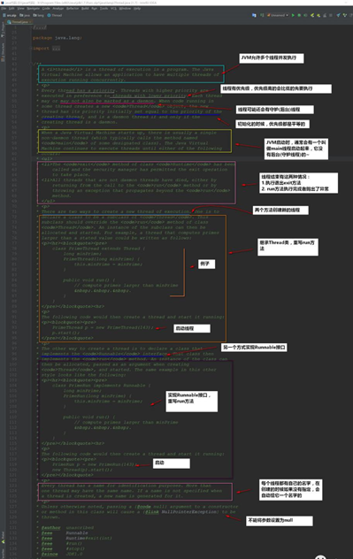

 

### 继承Thread

一个类继承Thread类（单继承局限），覆写run（）方法。启动线程用start（）（实际上调用了run（）），重复调用start（）产生异常。设置变量都是私有。

```java
public void run() { 
    for (int i = 0; i < 5; i++) { 
      System.out.println(name + "运行 : " + i); 
	    try { 
        sleep((int) Math.random() * 10); 
      } catch (InterruptedException e) { 
        e.printStackTrace(); 
      } 
```


### 实现Runnable接口

定义可看出：Thread类中的run()调用的runnable()的run()。启动线程还是用start()。Thread类是接口runnable()的子类。


**run()和start()方法区别：**

- run()：仅仅是封装被线程执行的代码，直接调用是普通方法，子线程结束了，main才执行
- start()：首先启动了线程，然后再由 JVM 去调用该线程的run()方法


 **一般我们使用实现Runnable接口**

- 可以避免 Java 中的单继承的限制
- 应该将并发运行任务和运行机制解耦，因此我们选择实现Runnable接口这种方式！


### Callable和Future

> 当我们的任务需要返回值的时，我们就可以使用Callable！
>
> Future一般我们认为是Callable的返回值，但他其实代表的是任务的生命周期(当然了，它是能获取得到Callable的返回值的)
>

**案例**

```java
public class CallableDemo {
   public static void main(String[] args) throws InterruptedException， ExecutionException {
     // 创建线程池对象
     ExecutorService pool = Executors.newFixedThreadPool(2);
     // 可以执行Runnable对象或者Callable对象代表的线程
     Future<Integer> f1 = pool.submit(new MyCallable(100));
     Future<Integer> f2 = pool.submit(new MyCallable(200));
     // V get()
     Integer i1 = f1.get();
     Integer i2 = f2.get();
     System.out.println(i1);
     System.out.println(i2);
     // 结束
     pool.shutdown();
   }
 }

//Callable任务：
public class MyCallable implements Callable<Integer> {
   private int number
   public MyCallable(int number) {
     this.number = number;
   }
   @Override
   public Integer call() throws Exception {
     int sum = 0;
     for (int x = 1; x <= number; x++) {
       sum += x;
     }
     return sum;
   }
 }
```


### 线程状态转换


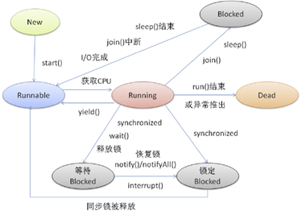

**超时等待**


#### 阻塞(Blocked)

1. 调用 join() 和 sleep() 方法，sleep() 时间结束或被打断、join()中断、IO完成，都会回到Runnable状态，等待JVM的调度。

2. 调用wait()，使该线程处于等待池(wait blocked pool)，直到notify()/notifyAll()，线程被唤醒被放到锁定池(lock blocked pool )，释放同步锁使线程回到可运行状态（Runnable）

3. 对Running状态的线程加同步锁(Synchronized)使其进入(lock blocked pool )，同步锁被释放进入可运行状态(Runnable)。

   此外，在runnable状态的线程是处于被调度的线程，此时的调度顺序是不一定的。Thread类中的yield方法可以让一个running状态的线程转入runnable。


#### 相关方法

**sleep(long millis)、yield()**

sleep(long millis) 是 Thread 类的静态方法，当前线程将睡眠 n 毫秒，线程进入阻塞状态。当睡眠时间到了，会解除阻塞，进行可运行状态，等待 CPU 的到来。睡眠不释放锁（如果有的话）

yield()（“退让”）应该做的是让当前运行线程回到可运行状态，以允许具有相同优先级的其他线程获得运行机会。因此，使用yield()的目的是让相同优先级的线程之间能适当的轮转执行。

sleep()和yield()的区别：sleep()使当前线程进入停滞状态，所以执行sleep()的线程在指定的时间内肯定不会被执行；yield()只是使当前线程重新回到可执行状态，所以执行yield()的线程有可能在进入到可执行状态后马上又被执行。


**wait ()**

wait 方法：是 Object 的方法，必须与 synchronized 关键字一起使用，线程进入阻塞状态进入对象的等待池（wait pool），当 notify 或者 notifyAll 被调用后，会解除阻塞，线程进入等锁池（lock pool）。但是，释放互斥锁之后才会进入可运行状态。睡眠时，释放互斥锁。 wait()只能在方法或者语句块中使用。

因wait()而导致阻塞的线程是放在阻塞队列中的，因竞争失败导致的阻塞是放在同步队列中的，notify()/notifyAll()实质上是把阻塞队列中的线程放到同步队列中去。


**join()** 

join()的作用是：“等待该线程终止”，这里需要理解的就是该线程是指的主线程等待子线程的终止。（主线程生成并起动了子线程，如果主线程往往将于子线程之前结束，但是如果主线程处理完其他的事务后，需要用到子线程的处理结果，也就是主线程需要等待子线程执行完成之后再结束，这个时候就要用到join()方法了）。会抛出异常，try catch中。


## Thread源码剖析

### 设置线程名

想要查看线程名是很简单的，调用Thread.currentThread().getName()即可。

如果没有做什么的设置，我们会发现线程的名字是这样子的：主线程叫做main，其他线程是Thread-x

为线程起个名字，那也是很简单的。**Thread给我们提供了构造方法**！

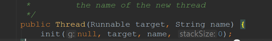

当然了，我们还可以通过setName(String name)的方法来改掉线程的名字的。

 

### 守护线程

- 守护线程是为其他线程服务的

- 垃圾回收线程就是守护线程~

- 守护线程有一个特点：
  - 当别的用户线程执行完了，虚拟机就会退出，守护线程也就会被停止掉了。
  - 也就是说：守护线程作为一个服务线程，没有服务对象就没有必要继续运行了

 

**使用线程的时候要注意的地方**

- **在线程启动前**设置为守护线程，方法是setDaemon(boolean)
- 使用守护线程**不要访问共享资源**(数据库、文件等)，因为它可能会在任何时候就挂掉了。

- 守护线程中产生的新线程也是守护线程


原理：这也就为什么我们要在**启动之前**设置守护线程了。

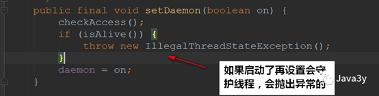

### 优先级线程

线程优先级高仅仅表示线程获取的CPU时间片的几率高，但这不是一个确定的因素！

Java提供的优先级默认是5，最低是1，最高是10；setPriority() 是一个本地(navite)的方法。


**实现：**

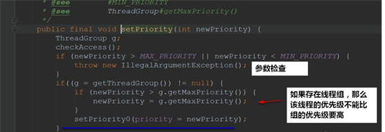

### interrupt方法

**stop方法**
可以让一个线程A终止掉另一个线程B

- 被终止的线程B会立即释放锁，这可能会让**对象处于不一致的状态**。void { x = 3; y = 4;}　当修改到3，停止了。

- 线程A也不知道线程B什么时候能够被终止掉，万一线程B还处理运行计算阶段，线程A调用stop方法将线程B终止，那就很无辜了~

总而言之，Stop方法太暴力了，不安全，所以被设置过时了。

 

**suspend()方法**
容易发生死锁。调用suspend()的时候，目标线程会停下来，**但却仍然持有在这之前获得的锁**。此时，其他任何线程都不能访问锁定的资源，除非被"挂起"的线程恢复运行。


**interrupt方法**

我们一般使用的是interrupt来请求终止线程~

- 注意的是：interrupt**不会真正停止**一个线程，它仅仅是给这个线程发了一个信号告诉它，它应该要结束了(明白这一点非常重要！)

- 也就是说：Java设计者实际上是**想线程自己来终止**，通过上面的信号，就可以判断处理什么业务了。

- 具体到底中断还是继续运行，应该**由被通知的线程自己处理**
- 所以说：**interrupt方法压根是不会对线程的状态造成影响的，它仅仅设置一个标志位罢了**

 

```java
Thread t1 = new Thread( new Runnable(){
   public void run(){
     // 若未发生中断，就正常执行任务
     while(!Thread.currentThread.isInterrupted()){
       // 正常任务代码……
     }
     // 中断的处理代码……
     doSomething();
   }
 } ).start();
```

 


interrupt线程中断还有另外**两个方法(检查该线程是否被中断)**：

- 静态方法interrupted()-->**会清除中断标志位**

- 实例方法isInterrupted()-->**不会清除中断标志位**


上面还提到了，**如果阻塞线程调用了interrupt()方法**，那么会**抛出异常，设置标志位为false，同时该线程会退出阻塞**

 

**而isInterrupted()方法竟然返回了false，为什么呢？**

结论：interrupt方法是用于中断线程的，调用该方法的线程的状态将被置为"中断"状态。注意：线程中断仅仅是设置线程的中断状态位，不会停止线程。所以当一个线程处于中断状态时，如果再由wait、sleep以及jion三个方法引起的阻塞，那么JVM会将线程的中断标志重新设置为false，并抛出一个InterruptedException异常，然后开发人员可以中断状态位“的本质作用-----就是程序员根据try-catch功能块捕捉jvm抛出的InterruptedException异常来做各种处理，比如如何退出线程。总之interrupt的作用就是需要用户自己去监视线程的状态位并做处理。”

 

**同时可以做这样的理解：**

interrupt（）是用来设置中断状态的。返回true说明中断状态被设置了而不是被清除了。我们调用sleep、wait等此类可中断（throw InterruptedException）方法时，一旦方法抛出InterruptedException，当前调用该方法的线程的中断状态就会被jvm自动清除了，就是说我们调用该线程的isInterrupted 方法时是返回false。如果你想保持中断状态，可以再次调用interrupt方法设置中断状态。这样做的原因是，java的中断并不是真正的中断线程，而只设置标志位（中断位）来通知用户。如果你捕获到中断异常，说明当前线程已经被中断，不需要继续保持中断位。

interrupted是静态方法，返回的是当前线程的中断状态。例如，如果当前线程被中断（没有抛出中断异常，否则中断状态就会被清除），你调用interrupted方法，第一次会返回true。然后，当前线程的中断状态被方法内部清除了。第二次调用时就会返回false。如果你刚开始一直调用isInterrupted，则会一直返回true，除非中间线程的中断状态被其他操作清除了。

 

# 二、多线程基础

### 线程安全

因为在多线程的环境下，线程是**交替执行**的，一般他们会使用多个线程**执行相同的代码**。如果在此相同的代码里边有着**共享的变量**，或者一些**组合操作**，我们想要的**正确**结果就很容易出现了问题。

**归根结底是因为没有任何操作来限制线程来获取相同的资源并对他们进行操作，这就造成了线程安全性问题**

 

有个原则：**能使用JDK提供的线程安全机制，就使用JDK的**

### 性能

使用多线程我们的目的就是为了提高应用程序的使用率，但是如果多线程的代码**没有好好设计**的话，那未必会提高效率。**反而降低了效率，甚至会造成死锁**！

 

最简单的方式：如果我们在service方法上加上 JDK 为我们提供的**内置锁synchronized**，那么我们就可以实现线程安全了。

 

虽然实现了线程安全了，但是这会带来**很严重的性能问题**：

- 每个请求都得**等待**上一个请求的service方法处理了以后才可以完成对应的操作


这就导致了：我们完成一个小小的功能，使用了多线程的目的是想要提高效率，但现在**没有把握得当，却带来严重的性能问题**！

 

在使用多线程的时候：更严重的时候还有**死锁**(程序就卡住不动了)。

 

### 对象的发布与逸出

> 发布(publish) 使对象能够在当前作用域之外的代码中使用
>
> 逸出(escape) 当某个不应该发布的对象被发布了。导致我们的数据泄露出去了，这就造成了一个安全隐患！
>

常见**逸出**的有下面几种方式：

- **静态域逸出**
- **public修饰的get方法**
- **方法参数传递**
- **隐式的this**

​     

 **静态域逸出：**

 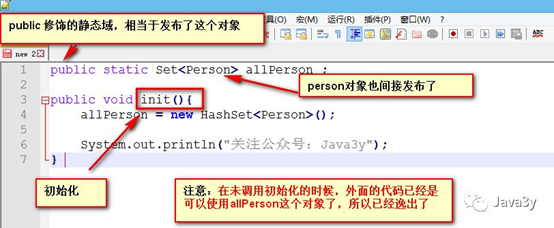


**public修饰get方法：**

 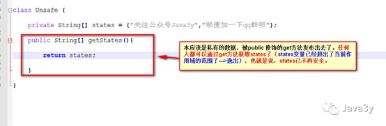


**方法参数传递我就不再演示了**，因为把对象传递过去给另外的方法，已经是逸出了~


下面来看看该书给出**this逸出的例子**：

 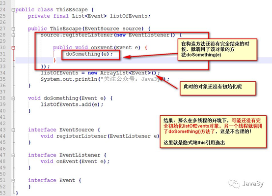


### 安全发布对象

上面谈到了好几种逸出的情况，我们接下来来谈谈**如何安全发布对象**。

安全发布对象有几种常见的方式：

- **在静态域中直接初始化** ： `public static Person = new Person();`。静态初始化由JVM在类的初始化阶段就执行了，JVM内部存在着同步机制，致使这种方式我们可以安全发布对象
- 对应的引用保存到**volatile或者AtomicReferance引用中**：保证了该对象的引用的**可见性和原子性**
- **由final修饰**：该对象是不可变的，那么线程就一定是安全的，所以是安全发布~
- **由锁来保护**：发布和使用的时候都需要加锁，这样才保证能够该对象不会逸出

 

## 解决多线程问题

### 简述解决线程安全性的办法

使用多线程就一定要**保证我们的线程是安全的**，这是最重要的地方！

在Java中，我们一般会有下面这么几种办法来实现线程安全问题：

- 无状态(**没有共享变量**)

- 使用final使该引用变量不可变(如果该对象引用也引用了其他的对象，那么无论是发布或者使用时都需要加锁)

- **加锁(内置锁，显示Lock锁)**
- 使用JDK为我们提供的类来实现线程安全(此部分的类就很多了)
- 原子性（就比如上面的count++操作，可以使用AtomicLong来实现原子性，那么在增加的时候就不会出差错了！)
- 容器(ConcurrentHashMap等等…)
- ……等等

 

### 原子性和可见性volatile

#### 原子性

**原子性操作就是指这些操作是不可中断的，要做一定做完，要么就没有执行。**如果操作的数据是原子性的，那么就可以很大程度上避免了线程安全问题了！

count++，先读取，后自增，再赋值。

**原子性**就是执行某一个操作是不可分割的
   \- 比如上面所说的count++操作，它就**不是一个原子性的操作**，它是分成了三个步骤的来实现这个操作的
   \- JDK中有atomic包提供给我们实现原子性操作

 


 也有人将其做成了表格来分类，我们来看看：


使用这些类相关的操作也可以进他的博客去看看：

https://blog.csdn.net/eson_15/article/details/51553338

 

#### 可见性

> 当一个变量被volatile修改时，它的变化会立即被刷新到主存，当其他线程需要读取该变量时，本地内存变量失效，它会读取内存中的新值。
>
> **volatile是一种轻量级的同步机制**；volatile仅仅用来保证该变量对所有线程的可见性，但不保证原子性


我们将其拆开来解释一下：

- 保证**该变量对所有线程的可见性**

  在多线程的环境下：当这个变量修改时，**所有的线程都会知道该变量被修改了**，也就是所谓的“可见性”

- 不保证原子性

  修改变量(赋值)实质上是在 JVM 中分了好几步，而在这几步内(从装载变量到修改)，它是不安全的。 

 

使用了volatile修饰的变量**保证了三点**：

- **一旦你完成写入，任何访问这个字段的线程将会得到最新的值**
- 在你写入前，**会保证所有之前发生的事已经发生**，并且任何更新过的数据值也是可见的，因为内存屏障会把之前的写入值都刷新到缓存
- **volatile可以防止重排序**(重排序指的就是：程序执行的时候，CPU、编译器可能会**对执行顺序做一些调整**，导致执行的顺序并不是从上往下的。从而出现了一些意想不到的效果)。而如果声明了volatile，那么CPU、编译器就会知道**这个变量是共享的**，不会被缓存在寄存器或者其他不可见的地方。

 

一般来说，**volatile大多用于标志位上(判断操作)**，满足下面的条件才应该使用volatile修饰变量：

- **修改变量时不依赖变量的当前值**(因为volatile是不保证原子性的)
- **该变量不会纳入到不变性条件中**(该变量是可变的)
- **在访问变量的时候不需要加锁**(加锁就没必要使用volatile这种轻量级同步机制了)

 

#### 有序性

JMM允许编译器和处理器重新排序指令，但是指定了as-if-串行语义，也就是说，无论重新排序，程序的执行结果都不能更改。就是读值不一样

 

### 不变性

**不可变对象**一定线程安全的。

上面我们共享的变量都是可变的，正由于是可变的才会出现线程安全问题。如果**该状态是不可变的**，那么**随便多个线程访问都是没有问题的**！

Java提供了final修饰符给我们使用，final的身影我们可能就见得比较多了，但值得说明的是：**final仅仅是不能修改该变量的引用，但是引用里边的数据是可以改的!**


就好像下面这个HashMap，用final修饰了。但是它仅仅保证了该**对象引用**hashMap变量所指向是不可变的，但是hashMap内部的数据是可变的，也就是说：可以add，remove等等操作到集合中。因此，仅仅只能够说明**hashMap是一个不可变的对象引用**


要想将对象设计成不可变对象，那么要满足下面三个条件：

- **对象创建后状态就不能修改**
- **对象所有的域都是final修饰的**
- **对象是正确创建的**(没有this引用逸出)

String在我们学习的过程中我们就知道它是一个**不可变对象**，但是它没有遵循第二点(对象所有的域都是final修饰的)，因为JVM在内部做了优化的。但是我们如果是要自己设计不可变对象，是需要满足三个条件的。

 

### 线程封闭

在多线程的环境下，只要我们**不使用成员变量(不共享数据)**，那么就不会出现线程安全的问题了。

就用我们熟悉的Servlet来举例子，写了那么多的Servlet，你见过我们说要加锁吗？？我们所有的数据都是在方法(栈封闭)上操作的，**每个线程都拥有自己的变量，互不干扰**！

在线程封闭上还有另一种方法，就是我之前写过的：[**ThreadLocal**](https://mp.weixin.qq.com/s?__biz=MzI4Njg5MDA5NA==&mid=2247484118&idx=1&sn=da3e4c4cfd0642687c5d7bcef543fe5b&chksm=ebd743d7dca0cac19a82c7b29b5b22c4b902e9e53bd785d066b625b4272af2a6598a0cc0f38e&scene=21#wechat_redirect) 

 

### 线程安全性委托

很多时候我们要实现线程安全未必就需要自己加锁，自己来设计。

我们可以使用JDK给我们提供的对象来完成线程安全的设计

非常多的"工具类"供我们使用，这些在往后的学习中都会有所介绍的~~这里就不介绍了

 

# 三、Java锁机制

## synchronized锁

### synchronized锁是什么？

synchronized是Java的一个关键字，它能够将代码块(方法)锁起来

· 它使用起来是非常简单的，只要在代码块(方法)添加关键字synchronized，即可以**实现同步**的功能~

public synchronized void test() { 
     // doSomething
   }

修饰代码块:

synchronized(this|object) {}，**获取对象锁**

**synchronized(类.class) {}，获取类锁**

一个锁的是类对象，一个锁的是实例对象。若类对象被lock，则类对象的所有同步方法全被lock；若实例对象被lock，则该实例对象的所有同步方法全被lock。

 

**synchronized是一种互斥锁，** **可见性**

· **一次只能允许一个线程进入被锁住的代码块**

synchronized是一种**内置锁/监视器锁，非公平锁**

· Java中**每个对象**都有一个**内置锁(监视器，也可以理解成锁标记)**，而synchronized就是使用**对象的内置锁(监视器)**来将代码块(方法)锁定的！

· synchronized保证了线程的**原子性**。(被保护的代码块是一次被执行的，没有任何线程会同时访问)

· synchronized还保证了**可见性**。(当执行完synchronized之后，修改后的变量对其他的线程是可见的)

 

Java中的synchronized，**通过使用内置锁**，来实现**对变量的同步操作**，进而实现了**对变量操作的原子性和其他线程对变量的可见性**，从而确保了并发情况下的线程安全。

 

 是不能的**，其他线程只能访问该对象的非同步方法，同步方法则不能进入;**

 

### synchronized的原理

**同步代码块：**
**monitorenter和monitorexit指令实现的**

 

同步方法（在这看不出来需要看JVM底层实现），同步方法默认使用this或者当前类做为锁。

 

每个对象有一个监视器锁（monitor）。当monitor被占用时就会处于锁定状态，线程执行monitorenter指令时尝试获取monitor的所有权，过程如下：

1. 如果monitor的进入数为0，则该线程进入monitor，然后将进入数设置为1，该线程即为monitor的所有者。

2. 如果线程已经占有该monitor，只是重新进入，则进入monitor的进入数加1.

3. 如果其他线程已经占用了monitor，则该线程进入阻塞状态，直到monitor的进入数为0，再重新尝试获取monitor的所有权。

 

执行monitorexit的线程必须是objectref所对应的monitor的所有者。指令执行时，monitor的进入数减1，如果减1后进入数为0，那线程退出monitor，不再是这个monitor的所有者。其他被这个monitor阻塞的线程可以尝试去获取这个 monitor 的所有权。 

 

synchronized底层是是通过monitor对象，对象有自己的对象头，存储了很多信息，其中一个信息标示是被哪个线程持有。

 

Synchronized的语义底层是通过一个monitor的对象来完成，其实wait/notify等方法也依赖于monitor对象，这就是为什么只有在同步的块或者方法中才能调用wait/notify等方法，否则会抛出java.lang.IllegalMonitorStateException的异常的原因。

 

**方法修饰符上的ACC_SYNCHRONIZED实现**

方法的同步并没有通过指令monitorenter和monitorexit来完成（理论上其实也可以通过这两条指令来实现），不过相对于普通方法，其常量池中多了ACC_SYNCHRONIZED标示符。JVM就是根据该标示符来实现方法的同步的：当方法调用时，调用指令将会检查方法的 ACC_SYNCHRONIZED 访问标志是否被设置，如果设置了，执行线程将先获取monitor，获取成功之后才能执行方法体，方法执行完后再释放monitor。在方法执行期间，其他任何线程都无法再获得同一个monitor对象。 其实本质上没有区别，只是方法的同步是一种隐式的方式来实现，无需通过字节码来完成。

 

### synchronized如何使用

· **修饰普通方法**

· **修饰代码块**

· **修饰静态方法，静态方法属于类，所以是类锁**

 

当然了，**我们使用synchronized修饰代码块时未必使用this**，还可以使用其他的对象(随便一个对象都有一个内置锁)重入锁

 

**synchronized修饰静态方法获取的是类锁(类的字节码文件对象)，synchronized修饰普通方法或代码块获取的是对象锁。**

· **它俩是不冲突的，也就是说：获取了类锁的线程和获取了对象锁的线程是不冲突的！**

 

### 重入锁

public class Widget {
   // 锁住了
   public synchronized void doSomething() {
     ..
   }
 }
 public class LoggingWidget extends Widget {
   // 锁住了
   public synchronized void doSomething() {
     System.out.println(toString() + ": calling doSomething");
     super.doSomething();
   }
 }

\1.      当线程A进入到LoggingWidget的doSomething()方法时，**此时拿到了LoggingWidget实例对象的锁**。

\2.      随后在方法上又调用了父类Widget的doSomething()方法，它**又是被synchronized修饰**。

\3.      那现在我们LoggingWidget实例对象的锁还没有释放，进入父类Widget的doSomething()方法**还需要一把锁吗？**

**不需要的！**

因为**锁的持有者是“线程”，而不是“调用”**。线程A已经是有了LoggingWidget实例对象的锁了，当再需要的时候可以继续**“开锁”**进去的！

这就是内置锁的**可重入性**。

 

**原理：**

对象监视器。会在**对象头部有个区域**，专门记录**锁信息**。包括持有锁的线程，锁的计数器，锁的状态这些。 线程在尝试获取对象锁时，先看看**锁计数器**是不是为0，为零就说明锁还在，于是获取锁，计数器变成1，**并记录下持有锁的线程**，当有线程再来请求同步方法时，先看看是不是当前持有锁的线程，是的，那就直接访问，锁计数器+1，如果不是，对不起，你阻塞吧。当退出同步块时，计数器-1，变成0时，释放锁。

 

### 释放锁的时机

1. 当方法(代码块)执行完毕后会**自动释放锁**，不需要做任何的操作

2. **当一个线程执行的代码出现异常时，其所持有的锁会自动释放**

3. **不会由于异常导致出现死锁现象**

 

### 锁优化

 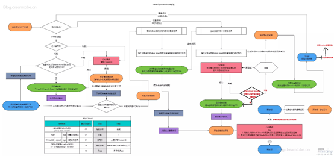

**重量级锁：监视器锁**本质又是依赖于底层的操作系统的**Mutex Lock（互斥信号量）**来实现的。当锁为轻量级锁的时候，另一个线程虽然是自旋，但自旋不会一直持续下去，当自旋一定次数的时候，**还没有获取到锁，就会进入阻塞，**该锁膨胀为重量级锁。**Synchronized效率低的原因。**

**轻量级锁:** 当锁是**偏向锁**的时候，被另一个线程所访问，偏向锁就会升级为轻量级锁，其他线程会**通过自旋**的形式尝试获取锁，不会阻塞，提高性能。虚拟机将使用**CAS操作尝试将对象的Mark Word更新为指向Lock Record的指针**。更新失败， **Mark Word中储存就是指向monitor对象的指针。**

偏向锁：大多数情况下，锁不仅不存在多线程竞争，而且总是由**同一线程多次获得**，为了让线程获得锁的代价更低而引入了偏向锁。

当一个线程访问同步块并获取锁时，会在**对象头和栈帧中的锁记录**里存储锁偏向的线程ID，以后该线程在进入和退出同步块时**不需要进行CAS操作来加锁和解锁**，只需简单地测试一下**对象头的Mark Word**里是否存储着指向当前线程的偏向锁ID。

**锁粗化:**就是将多次连接在一起的加锁、解锁操作合并为一次，将多个连续的锁扩展成一个范围更大的锁。

在使用锁的时候，需要让同步块的作用范围尽可能小，这样做的目的是**为了使需要同步的操作数量尽可能小，如果存在锁竞争，那么等待锁的线程也能尽快拿到锁**。

**适应性自旋：**相当于等待一会，看有没有锁。

 

**悲观锁(Pessimistic Lock)**：每次取数据时都认为其他线程会修改，所以都会加锁（读锁、写锁、行锁等），当其他线程想要访问数据时，都需要阻塞挂起。

**乐观锁(Optimistic Lock)**：每次去拿数据的时候都认为别人不会修改，所以不会上锁，但是在更新的时候**会判断一下在此期间别人有没有去更新这个数据**，可以使用**版本号或CAS**操作实现机制。乐观锁适用于多读的应用类型，这样可以提高吞吐量。

## [AQS详解](https://www.cnblogs.com/waterystone/p/4920797.html)

**谈到并发而谈到ReentrantLock，不得不谈AbstractQueuedSynchronizer（AQS）！可以说Lock的子类实现都是基于AQS的。**

类如其名，**抽象的队列式的同步器，**AQS定义了一套**多线程访问共享资源的同步器框架，**许多同步类实现都依赖于它，如常用的ReentrantLock/ReadWriteLock/Semaphore/Cou

ntDownLatch...。

 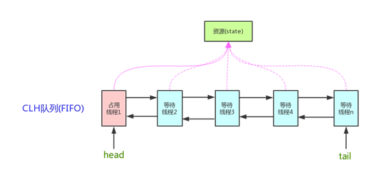

它维护了一个**volatile int state（代表共享资源）和一个FIFO线程等待队列（多线程争用资源被阻塞时会进入此队列）**。state的访问方式有三种:

· getState()

· setState()

· compareAndSetState()

AQS定义两种资源共享方式：**Exclusive（独占，只有一个线程能执行，如ReentrantLock）和Share（共享，多个线程可同时执行，如Semaphore/CountDownLatch）。**

 

不同的自定义同步器争用共享资源的方式也不同。**自定义同步器在实现时只需要实现共享资源state的获取与释放方式即可**，CAS算法实现。至于具体线程等待队列的维护（如获取资源失败入队/唤醒出队等），AQS已经在顶层实现好了。自定义同步器实现时主要实现以下几种方法：

· isHeldExclusively()：该线程是否正在独占资源。只有用到**condition**才需要去实现它。

· tryAcquire(int)：独占方式。尝试获取资源，成功则返回true，失败则返回false。

· tryRelease(int)：独占方式。尝试释放资源，成功则返回true，失败则返回false。

· tryAcquireShared(int)：共享方式。尝试获取资源。负数表示失败；0表示成功，但没有剩余可用资源；正数表示成功，且有剩余资源。

· tryReleaseShared(int)：共享方式。尝试释放资源，如果释放后允许唤醒后续等待结点返回true，否则返回false。

 

**同步状态：**

**修改state状态值时使用CAS算法来实现**

以ReentrantLock为例，state初始化为0，表示未锁定状态。A线程lock()时，会调用tryAcquire()独占该锁并将state+1。此后，其他线程再tryAcquire()时就会失败，直到A线程unlock()到state=0（即释放锁）为止，其它线程才有机会获取该锁。当然，释放锁之前，A线程自己是可以重复获取此锁的（state会累加），**这就是可重入的概念**。但要注意，获取多少次就要释放多么次，这样才能保证state是能回到零态的。

 

**执行完compareAndSetState**第一次获取锁之后，执行setExclusiveOwnerThread，在AbstractOwnableSynchronizer类中设置成员变量Thread exclusiveOwnerThread为当前线程，表示**这个线程独占了这个锁。**

 

再以CountDownLatch以例，任务分为N个子线程去执行**，state也初始化为N（注意N要与线程个数一致）。**这N个子线程是并行执行的，每个子线程执行完后countDown()一次，state会CAS减1。等到所有子线程都执行完后(即state=0)，**会unpark()主调用线程**，然后主调用线程就会从**await()函数**返回，继续后余动作。

 

一般来说，自定义同步器要么是独占方法，要么是共享方式，他们也只需实现tryAcquire-tryRelease、tryAcquireShared-tryReleaseShared中的一种即可。但AQS也支持自定义同步器**同时实现独占和共享两种方式，如ReentrantReadWriteLock。**

 

### CAS

在计算机科学中，**比较和交换**（Conmpare And Swap）是用于实现多线程同步的**原子指令。** 它将**内存位置的内容与给定值进行比较**，只有在相同的情况下，将该内存位置的内容修改为新的给定值。 这是作为单个原子操作完成的。 原子性保证新值基于最新信息计算; 如果该值在同一时间被另一个线程更新，则写入将失败。 

底层C++

 

**原子类(atomic)的实现**

 

### volatile关键字

volatile作为java中的关键词之一，用以声明变量的值可能随时会别的线程修改，使用volatile修饰的变量会**强制将修改的值立即写入主存**，主存中值的更新会使缓存中的值失效(非volatile变量不具备这样的特性，非volatile变量的值会被缓存，线程A更新了这个值，线程B读取这个变量的值时可能读到的并不是是线程A更新后的值)。volatile会禁止指令重排。

volatile具有可见性、有序性，不具备原子性。

**注意，volatile不具备原子性，这是volatile与java中的synchronized、java.util.concurrent.locks.Lock最大的功能差异，这一点在面试中也是非常容易问到的点。**

 

**volatile的integer自增（i++），其实要分成3步：1）读取volatile变量值到local； 2）增加变量的值；3）把local的值写回，让其它的线程可见。**

**内存屏障（**[**memory barrier**](http://en.wikipedia.org/wiki/Memory_barrier)**）是一个CPU指令。 a) 确保一些特定操作执行的顺序； b) 影响一些数据的可见性(可能是某些指令执行后的结果)。编译器和CPU可以在保证输出结果一样的情况下对指令重排序，使性能得到优化。**

**a、lfence：即读屏障(Load Barrier)，在读指令前插入读屏障，可以让本地缓存中的数据失效，重新从主内存加载数据，以保证读取的是最新的数据。**

**b、sfence：即写屏障(Store Barrier)，在写指令之后插入写屏障，能让写入缓存的最新数据写回到主内存，以保证写入的数据立刻对其他线程可见。**

 

**内存屏障（**[**memory barrier**](http://en.wikipedia.org/wiki/Memory_barrier)**）和volatile什么关系？上面的虚拟机指令里面有提到，如果你的字段是volatile，Java内存模型将在写操作后插入一个写屏障指令，在读操作前插入一个读屏障指令。这意味着如果你对一个volatile字段进行写操作，你必须知道：1、一旦你完成写入，任何访问这个字段的线程将会得到最新的值。2、在你写入前，会保证所有之前发生的事已经发生，并且任何更新过的数据值也是可见的，因为内存屏障会把之前的写入值都刷新到缓存。**

 

原子性：如果你了解事务，那这个概念应该好理解。原子性通常指多个操作不存在只执行一部分的情况，如果全部执行完成那没毛病，如果只执行了一部分，那对不起，你得撤销(即事务中的回滚)已经执行的部分**。sychronized可以做到**

可见性：当多个线程访问同一个变量x时，线程1修改了变量x的值，线程1、线程2...线程n能够立即读取到线程1修改后的值。**sychronized，final，valitile可以做到。**

有序性：**即程序执行时按照代码书写的先后顺序执行。**在Java内存模型中，允许编译器和处理器对指令进行重排序，但是重排序过程不会影响到单线程程序的执行，却会影响到多线程并发执行的正确性。**volatile，sychronized可以做到。**

 

**volatile适用场景**

**适用于对变量的写操作不依赖于当前值，**

对变量的读取操作不依赖于非volatile变量。

适用于**读多写少**的场景。可用作状态标志。

JDK中volatie应用：**JDK中ConcurrentHashMap的Entry的value和next被声明为volatile，AtomicLong中的value被声明为volatile。**

 

**volatile VS synchronized**

volatile synchronized修饰对象修饰变量修饰方法或代码段可见性11有序性11原子性01线程阻塞01对比这个表格，你会不会觉得synchronized完胜volatile，答案是否定的，**volatile不会让线程阻塞**，响应速度比synchronized高，这是它的优点。

 

### 原子类

通过申明一个**volatile** （内存锁定，同一时刻只有一个线程可以修改内存值）类型的变量，再加上**unsafe.compareAndSwapInt的方法**，来保证实现线程同步的。

 

但**CAS是通过硬件命令保证了原子性**，而i++没有，且硬件级别的原子性比i++这样高级语言的软件级别的运行速度要快地多。虽然CAS也包含了多个操作，但其的运算是固定的(**就是个比较**)，这样的锁**定性能开销很小**。

 

### happens-before 规则？

**前一个操作的结果可以被后续的操作获取。**

**因为jvm会对代码进行编译优化，指令会出现重排序的情况，为了避免编译优化对并发编程安全性的影响，需要happens-before规则定义一些禁止编译优化的场景，保证并发编程的正确性。**

 

## Lock显式锁

### Lock显式锁简单介绍

**AQS是**ReentrantReadWriteLock和ReentrantLock的**基础**，因为默认的实现都是在内部类Syn中，而Syn是继承AQS的~

 

**tryLock()方法是有返回值的**，返回值是Boolean类型。它表示的是用来尝试获取锁：成功获取则返回true；获取失败则返回false，这个方法无论如何都会立即返回。**在拿不到锁时不会一直在那等待。**

 

Lock显式锁是**一个接口**    

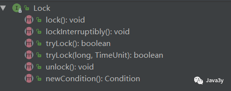 

**可以简单概括一下：**

· **Lock方式来获取锁支持中断、超时不获取、是非阻塞的**

· **提高了语义化，哪里加锁，哪里解锁都得写出来**

· **Lock显式锁可以给我们带来很好的灵活性，但同时我们必须手动释放锁**

· **支持Condition条件对象**

· **允许多个读线程同时访问共享资源**

 

**所以，到现在Lock锁和Synchronized锁的性能其实差别不是很大！而Synchronized锁用起来又特别简单。Lock锁还得顾忌到它的特性，要手动释放锁才行(如果忘了释放，这就是一个隐患)**

 

**公平锁理解起来非常简单：**

- **线程将按照它们发出请求的顺序来获取锁**

**非公平锁就是：**

- **线程发出请求的时可以“插队”获取锁**

**Lock和synchronize都是默认使用非公平锁的。如果不是必要的情况下，不要使用公平锁**

- **公平锁会来带一些性能的消耗的**

 

### ReentrantLock锁

**实现Lock接口，AQS**

**来总结一下要点吧：**

- **比synchronized更有伸缩性(灵活)**
- **支持公平锁(是相对公平的)**

·    **都用了volatile 关键字修饰**

- **使用时最标准用法是在try之前调用lock方法****，在finally代码块释放锁**
- **ReetrantLock     是独占锁、可重入锁，并且同时支持公平锁和非公平锁。**
- **如果Thread1不释放，Thread2等待了很长时间以后，可以中断等待，转而去做别的事情。等待可中断**
- **ReentrantLock可以同时绑定多个Condition对象，只需多次调用newCondition方法即可。synchronized中可以实现一个隐含的条件。**

 

**底层原理：ReenTrantLock的实现是一种自旋锁，通过循环调用CAS操作来实现加锁。它的性能比较好也是因为避免了使线程进入内核态的阻塞状态。**

 

**构造函数：**

**public ReentrantLock() {**

  **sync = new NonfairSync();//默认非公平锁**

**}**

 

**public ReentrantLock(boolean fair) {**

  **sync = fair ? new FairSync() : new NonfairSync();**

**}**

 

**NonfairSync 和 FairSync 都继承于 抽象父类Sync，而 Sync 继承 AQS。**

 

**案例：**

**public class SynDemo{**

​    **public static void main(String[] arg){**

​       **Runnable t1=new MyThread();**

​       **new Thread(t1，"t1").start();**

​       **new Thread(t1，"t2").start();**

​    **}**

 

**}**

**class MyThread implements Runnable {**

 

​    **private Lock lock=new ReentrantLock();**

​    **public void run() {**

​           **lock.lock();**

​           **try{**

​              **for(int i=0;i<5;i++)**

​                  **System.out.println(Thread.currentThread().getName()+":"+i);**

​           **}finally{**

​              **lock.unlock();**

​           **}**

​    **}**

 

**}**

 

**非公平锁:**

**可以简单的概括为下面三个步骤：**

**1. 进入 lock() 方法首先 cas 尝试获取锁。**

**2. 不成功则进入 acquire()，进入tryAcquire()。在tryAcquire() 中再cas一下，获取到返回true，获取不到就进入下一 步；接着判断当前线程是不是重入的，重入的则 state 加1，并返回 true；如果都没成功，则返回 false。**

**3. 如果tryAcquire()返回 false则进入 acquireQueued() 自旋等待获取资源。**

 

**公平锁的不同：**

**1. 公平锁在进入 lock() 方法时不会先cas，直接进入 acqure()。**

**2. 进入acqure()进而调用公平锁的tryAcquire，在tryAcquire中并不会像非公平锁一样再进行cas，而是先判断一下前面有其他正等待的Node节点，没有才进行cas。若有，那么就那么就通过addWaiter将当前线程封装成node结点加入到Sync队列中。**

 

### ReentrantReadWriteLock

**我们知道synchronized内置锁和ReentrantLock都是互斥锁(一次只能有一个线程进入到临界区(被锁定的区域))**

 

**而ReentrantReadWriteLock是一个读写锁：**

- **在读取数据的时候，可以多个线程同时进入到到临界区(被锁定的区域)**
- **在写数据的时候，无论是读线程还是写线程都是互斥的**

**一般来说：我们大多数都是读取数据得多，修改数据得少。所以这个读写锁在这种场景下就很有用了！**

**读写锁有一个接口ReadWriteLock，定义的方法就两个：readLock在读的时候可以共享，writeLock在写的时候是互斥的。**

 

**于是我们可以总结出读写锁的一些要点了：**

l **读锁不支持条件对象，写锁支持条件对象**

l **读锁不能升级为写锁，写锁可以降级为读锁**

l **读写锁也有公平和非公平模式**

l **读锁支持多个读线程进入临界区，写锁是互斥的**

 

**1.Lock能完成几乎所有synchronized的功能，并有一些后者不具备的功能，如锁投票、定时锁等候、可中断锁等候等**

   **2.synchronized 是Java 语言层面的，是内置的关键字；Lock 则是JDK 5中出现的一个包，在使用时，synchronized 同步的代码块可以由JVM自动释放；Lock 需要程序员在finally块中手工释放，如果不释放，可能会引起难以预料的后果（在多线程环境中）。**

  **3.** **Lock有多个锁获取的方式，具体下面会说道，大致就是可以尝试获得锁，线程可以不用一直等待，非阻塞方式去拿锁。**

 

### Java util.concurrent包

**BlockingQueue提供了线程安全的队列访问方式**：当阻塞队列进行插入数据时，如果队列已满，线程将会阻塞等待直到队列非满；从阻塞队列取数据时，如果队列已空，线程将会阻塞等待直到队列非空。并发包下很多高级同步类的实现都是基于BlockingQueue实现的。

 

**阻塞队列原理：**

其实阻塞队列实现阻塞同步的方式很简单，使用的就是是[lock锁的多条件（condition）阻塞控制](http://blog.csdn.net/chenchaofuck1/article/details/51592429)。使用BlockingQueue封装了根据条件阻塞线程的过程，而我们就不用关心繁琐的await/signal操作了。

 

**BlockingQueue 的操作方法**

BlockingQueue 具有 4 组不同的方法用于插入、移除以及对队列中的元素进行检查。如果请求的操作不能得到立即执行的话，每个方法的表现也不同。这些方法如下：

 

四组不同的行为方式解释：

- 抛异常：如果试图的操作无法立即执行，抛一个异常。

- 特定值：如果试图的操作无法立即执行，返回一个特定的值(常常是 true / false)。

- 阻塞：如果试图的操作无法立即执行，该方法调用将会发生阻塞，直到能够执行。

- 超时：如果试图的操作无法立即执行，该方法调用将会发生阻塞，直到能够执行，但等待时间不会超过给定值。返回一个特定值以告知该操作是否成功(典型的是true / false)。


**无法向一个 BlockingQueue 中插入 null。如果你试图插入 null，BlockingQueue 将会抛出一个 NullPointerException。**

 

可以访问到 BlockingQueue 中的所有元素，而不仅仅是开始和结束的元素。比如说，你将一个对象放入队列之中以等待处理，但你的应用想要将其取消掉。那么你可以调用诸如 **remove(o) 方法来将队列之中的特定对象进行移除。**但是这么干效率并不高(译者注：基于队列的数据结构，获取除开始或结束位置的其他对象的效率不会太高)，因此你尽量不要用这一类的方法，除非你确实不得不那么做。

 

**BlockingQueue 的实现类**

BlockingQueue 是个接口，你需要使用它的实现之一来使用BlockingQueue，java.util.concurrent包下具有以下 BlockingQueue 接口的实现类：

- ArrayBlockingQueue：ArrayBlockingQueue 是一个**有界的阻塞队列**，其内部实现是将对象放到一个数组里。有界也就意味着，它不能够存储无限多数量的元素。它有一个同一时间能够存储元素数量的上限。你可以在对其初始化的时候设定这个上限，但之后就无法对这个上限进行修改了(译者注：因为它是基于数组实现的，也就具有数组的特性：一旦初始化，大小就无法修改)。

- LinkedBlockingQueue：LinkedBlockingQueue 内部以一个链式结构(链接节点)对其元素进行存储。**如果需要的话，这一链式结构可以选择一个上限。如果没有定义上限，将使用 Integer.MAX_VALUE 作为上限。**

- PriorityBlockingQueue：PriorityBlockingQueue 是一个**无界的并发队列。**它使用了和类 java.util.PriorityQueue 一样的排序规则。你无法向这个队列中插入 null 值。所有插入到 PriorityBlockingQueue 的元素必须实现 java.lang.Comparable 接口。因此该队列中元素的排序就**取决于你自己的 Comparable 实现**。

- DelayQueue：DelayQueue 对元素进行持有直到一个特定的延迟到期。注入其中的元素必须实现 java.util.concurrent.Delayed 接口。

- SynchronousQueue：SynchronousQueue 是一个特殊的队列，它的内部同时只能够容纳单个元素。如果该队列已有一元素的话，试图向队列中插入一个新元素的线程将会阻塞，直到另一个线程将该元素从队列中抽走。同样，如果该队列为空，试图向队列中抽取一个元素的线程将会阻塞，直到另一个线程向队列中插入了一条新的元素。据此，把这个类称作一个队列显然是夸大其词了。**它更多像是一个汇合点**


# 四、Java多线程打辅助的三个小伙子

Java为我们提供了三个同步工具类**：**

- **CountDownLatch(闭锁)**
- **CyclicBarrier(栅栏)**
- **Semaphore(信号量)**

这几个工具类其实说白了就是为了能够更好控制线程之间的通讯问题~

 

## CountDownLatch

**简单来说：CountDownLatch是一个同步的辅助类，允许一个或多个线程一直等待，直到其它线程完成它们的操作。**

**它常用的API其实就两个:await()和countDown()**

 

### 例子

**例子：3y现在去做实习生了，其他的员工还没下班，3y不好意思先走，等其他的员工都走光了，3y再走。**

**import java.util.concurrent.CountDownLatch;

 public class Test {
   public static void main(String[] args) {
     final CountDownLatch countDownLatch = new CountDownLatch(5);
     System.out.println("现在6点下班了.....");
     // 3y线程启动
     new Thread(new Runnable() {
       @Override
       public void run() {
         try {
           // 这里调用的是await()不是wait()，等待
              countDownLatch.await();
         } catch (InterruptedException e) {
           e.printStackTrace();
         }
         System.out.println("...其他的5个员工走光了，3y终于可以走了");
       }
     }).start();
     // 其他员工线程启动
     for (int i = 0; i < 5; i++) {
       new Thread(new Runnable() {
         @Override
         public void run() {
           System.out.println("员工xxxx下班了");
           countDownLatch.countDown();
         }
       }).start();**

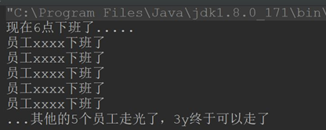     

### 再写个例子

**3y现在负责仓库模块功能，但是能力太差了，写得很慢，别的员工都需要等3y写好了才能继续往下写。**

**import java.util.concurrent.CountDownLatch;
 public class Test {
   public static void main(String[] args) {
     final CountDownLatch countDownLatch = new CountDownLatch(1);
     // 3y线程启动
     new Thread(new Runnable() {
       @Override
       public void run() {
         try {
           Thread.sleep(5);
         } catch (InterruptedException e) {
           e.printStackTrace();
         }
         System.out.println("3y终于写完了");
         countDownLatch.countDown();
       }
     }).start();
     // 其他员工线程启动
     for (int i = 0; i < 5; i++) {//多个线程
       new Thread(new Runnable() {
         @Override
         public void run() {
           System.out.println("其他员工需要等待3y");
           try {
             countDownLatch.await();
           } catch (InterruptedException e) {
             e.printStackTrace();
           }
           System.out.println("3y终于写完了，其他员工可以开始了！");
         }
       }).start();
     }**


 **输出结果：**

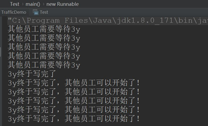

## CyclicBarrier

**简单来说：CyclicBarrier允许一组线程互相等待，直到到达某个公共屏障点。叫做cyclic是因为当所有等待线程都被释放以后，CyclicBarrier可以被重用(对比于CountDownLatch是不能重用的)**

**使用说明：**

· **CountDownLatch注重的是等待其他线程完成，CyclicBarrier注重的是：当线程到达某个状态后，暂停下来等待其他线程，所有线程均到达以后，继续执行。**

 

### 例子

**public class Test {
   public static void main(String[] args) {
     final CyclicBarrier CyclicBarrier = new CyclicBarrier(2);
     for (int i = 0; i < 2; i++) {
       new Thread(() -> {
         String name = Thread.currentThread().getName();
         if (name.equals("Thread-0")) {
           name = "3y";
         } else {
           name = "女朋友";
         }
         System.out.println(name + "到了体育西");
         try {
           // 两个人都要到体育西才能发朋友圈
               CyclicBarrier.await();
               // 他俩到达了体育西，看见了对方发了一条朋友圈：
               System.out.println("跟" + name + "去夜上海吃东西~");
           // 回家
               CyclicBarrier.await();
           System.out.println(name + "洗澡");
           // 洗澡完之后一起聊天
               CyclicBarrier.await();
           System.out.println("一起聊天");
         } catch (InterruptedException e) {
           e.printStackTrace();
         } catch (BrokenBarrierException e) {
           e.printStackTrace();
         }
       }).start();
     }
   }
 }**

**测试结果：**

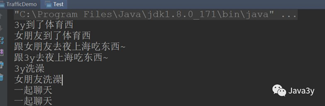     

 

## Semaphore

**Semaphore(信号量)实际上就是可以控制同时访问的线程个数，它维护了一组"许可证"。**

· **当调用acquire()方法时，会消费一个许可证。如果没有许可证了，会阻塞起来**

· **当调用release()方法时，会添加一个许可证。**

· **这些"许可证"的个数其实就是一个count变量罢了~**

 

### Semaphore例子

**3y女朋友开了一间卖酸奶的小店，小店一次只能容纳5个顾客挑选购买，超过5个就需要排队啦~~~**

**import java.util.concurrent.Semaphore;
 public class Test {
   public static void main(String[] args) {
     // 假设有50个同时来到酸奶店门口
     int nums = 50;
     // 酸奶店只能容纳10个人同时挑选酸奶
     Semaphore semaphore = new Semaphore(10);
     for (int i = 0; i < nums; i++) {
       int finalI = i;
       new Thread(() -> {
         try {
           // 有"号"的才能进酸奶店挑选购买
           semaphore.acquire();
           System.out.println("顾客" + finalI + "在挑选商品，购买...");
           // 假设挑选了xx长时间，购买了
           Thread.sleep(1000);
           // 归还一个许可，后边的就可以进来购买了
           System.out.println("顾客" + finalI + "购买完毕了...");
           semaphore.release();
         } catch (InterruptedException e) {
           e.printStackTrace();
         }
       }).start();
     }

   }
 }**

**输出结果：**     

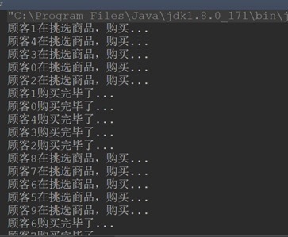

## 总结

**Java为我们提供了三个同步工具类：**

· **CountDownLatch(闭锁)**

§ **某个线程等待其他线程执行完毕后，它才执行(其他线程等待某个线程执行完毕后，它才执行)**

· **CyclicBarrier(栅栏)**

§ **一组线程互相等待至某个状态，这组线程再同时执行。**

· **Semaphore(信号量)**

§ **控制一组线程同时执行。**

 

# 五、ThreadLocal

## 什么是ThreadLocal 

**结合我的总结可以这样理解：ThreadLocal提供了线程的局部变量，每个线程都可以通过set()和get()来对这个局部变量进行操作，但不会和其他线程的局部变量进行冲突，实现了线程的数据隔离～。**

**简要言之：往ThreadLocal中填充的变量属于当前线程，该变量对其他线程而言是隔离的。**

 

**SimpleDateFormat定义为静态变量，那么多线程下SimpleDateFormat的实例就会被多个线程共享，B线程会读取到A线程的时间，就会出现时间差异和其它各种问题。SimpleDateFormat和它继承的DateFormat类也不是线程安全的。**

 

```
private static ThreadLocal<DateFormat> threadLocal = new ThreadLocal<DateFormat>() {

  @Override

  protected DateFormat initialValue() {

​    return new SimpleDateFormat("yyyy-MM-dd HH:mm:ss");

  }

};

 

public static Date parse(String dateStr) throws ParseException {

  return threadLocal.get().parse(dateStr);

}

 

public static String format(Date date) {

  return threadLocal.get().format(date);

}
```

**ThreadLocal可以确保每个线程都可以得到单独的一个SimpleDateFormat的对象，那么自然也就不存在竞争问题了。**

 

## 为什么要学习ThreadLocal？

**从上面可以得出：ThreadLocal可以让我们拥有当前线程的变量，那这个作用有什么用呢？？？**

 

### 管理Connection

**最典型的是管理数据库的Connection：当时在学JDBC的时候，为了方便操作写了一个简单数据库连接池，需要数据库连接池的理由也很简单，频繁创建和关闭Connection是一件非常耗费资源的操作，因此需要创建数据库连接池～**

**那么，数据库连接池的连接怎么管理呢？？我们交由ThreadLocal来进行管理。为什么交给它来管理呢？？**

**ThreadLocal能够实现当前线程的操作都是用同一个Connection，保证了事务！**

 

**当时候写的代码：**

**public class DBUtil { 
   //数据库连接池
   private static BasicDataSource source;
   //为不同的线程管理连接
   private static ThreadLocal<Connection> local;
   static {
     try {
       //加载配置文件
       Properties properties = new Properties();
       //获取读取流
       InputStream stream = DBUtil.class.getClassLoader().getResourceAsStream("连接池/config.properties");
       //从配置文件中读取数据
       properties.load(stream);**

**。。。**

**//初始化线程本地
       local = new ThreadLocal<>();
     } catch (IOException e) {
       e.printStackTrace();
     }
   }
   public static Connection getConnection() throws SQLException {
     //获取Connection对象
     Connection connection = source.getConnection();
     //把Connection放进ThreadLocal里面
     local.set(connection);
     //返回Connection对象
     return connection;
   }
   //关闭数据库连接
   public static void closeConnection() {
     //从线程中拿到Connection对象
     Connection connection = local.get();
     try {
       if (connection != null) {
         //恢复连接为自动提交
         connection.setAutoCommit(true);
         //这里不是真的把连接关了，只是将该连接归还给连接池
         connection.close();
         //既然连接已经归还给连接池了，ThreadLocal保存的Connction对象也已经没用了
         local.remove();
       }
     } catch (SQLException e) {
       e.printStackTrace();
     }
   }
 }**

**同样的，Hibernate对Connection的管理也是采用了相同的手法(使用ThreadLocal，当然了Hibernate的实现是更强大的)～**

 

### 避免一些参数传递

**避免一些参数的传递的理解可以参考一下Cookie和Session：**

· **每当我访问一个页面的时候，浏览器都会帮我们从硬盘中找到对应的Cookie发送过去。**

· **浏览器是十分聪明的，不会发送别的网站的Cookie过去，只带当前网站发布过来的Cookie过去**

**浏览器就相当于我们的ThreadLocal，它仅仅会发送我们当前浏览器存在的Cookie(ThreadLocal的局部变量)，不同的浏览器对Cookie是隔离的(Chrome，Opera，IE的Cookie是隔离的【在Chrome登陆了，在IE你也得重新登陆】)，同样地：线程之间ThreadLocal变量也是隔离的….**

 

**那上面避免了参数的传递了吗？？其实是避免了。Cookie并不是我们手动传递过去的，并不需要写<input name= cookie/>来进行传递参数…**

**在编写程序中也是一样的：日常中我们要去办理业务可能会有很多地方用到身份证，各类证件，每次我们都要掏出来很麻烦**

   **// 咨询时要用身份证，学生证，房产证等等....
   public void consult(IdCard idCard，StudentCard studentCard，HourseCard hourseCard){
   }
   // 办理时还要用身份证，学生证，房产证等等....
   public void manage(IdCard idCard，StudentCard studentCard，HourseCard hourseCard) {
   }
   //......**

**而如果用了ThreadLocal的话，ThreadLocal就相当于一个机构，ThreadLocal机构做了记录你有那么多张证件。用到的时候就不用自己掏了，问机构拿就可以了。**

**在咨询时的时候就告诉机构：来，把我的身份证、房产证、学生证通通给他。在办理时又告诉机构：来，把我的身份证、房产证、学生证通通给他。…**

   **// 咨询时要用身份证，学生证，房产证等等....
   public void consult(){
     threadLocal.get();
   }
   // 办理时还要用身份证，学生证，房产证等等....
   public void takePlane() {
     threadLocal.get();
   }**

**这样是不是比自己掏方便多了。**

**当然了，ThreadLocal可能还会有其他更好的作用～～～**

 

## ThreadLocal实现的原理

**想要更好地去理解ThreadLocal，那就得翻翻它是怎么实现的了～～～**

**首先，我们来看一下ThreadLocal的set()方法，因为我们一般使用都是new完对象，就往里边set对象了**

   **public void set(T value) {
     // 得到当前线程对象
     Thread t = Thread.currentThread();
     // 这里获取ThreadLocalMap
     ThreadLocalMap map = getMap(t);
     // 如果map存在，则将当前线程对象t作为key，要存储的对象作为value存到map里面去
     if (map != null)
       map.set(this， value);
     else
       createMap(t， value);
   }**

**上面有个ThreadLocalMap，我们去看看这是什么？**

**static class ThreadLocalMap {
     static class Entry extends WeakReference<ThreadLocal<?>> {
       /\** The value associated with this ThreadLocal. \*/
       Object value;
       Entry(ThreadLocal<?> k， Object v) {
         super(k);
         value = v;
       }
     }
     //....很长
 }**

**通过上面我们可以发现的是ThreadLocalMap是ThreadLocal的一个内部类。用Entry类来进行存储。**

 

**我们的值都是存储到这个Map上的，key是当前ThreadLocal对象！**

**如果该Map不存在，则初始化一个：**

   **void createMap(Thread t， T firstValue) {
     t.threadLocals = new ThreadLocalMap(this， firstValue);
   }**

**如果该Map存在，则从Thread中获取！
   ThreadLocalMap getMap(Thread t) {
     return t.threadLocals;
   }**

**Thread维护了ThreadLocalMap变量**

   **/\* ThreadLocal values pertaining to this thread. This map is maintained
   \* by the ThreadLocal class. \*/
   ThreadLocal.ThreadLocalMap threadLocals = null**

**从上面又可以看出，ThreadLocalMap是在ThreadLocal中使用内部类来编写的，但对象的引用是在Thread中！**

**于是我们可以总结出：Thread为每个线程维护了ThreadLocalMap这么一个Map，而ThreadLocalMap的key是LocalThread对象本身，value则是要存储的对象**

**有了上面的基础，我们看get()方法就一点都不难理解了：**

   **public T get() {
     Thread t = Thread.currentThread();
     ThreadLocalMap map = getMap(t);
     if (map != null) {
       ThreadLocalMap.Entry e = map.getEntry(this);
       if (e != null) {
         @SuppressWarnings("unchecked")
         T result = (T)e.value;
         return result;
       }
     }
     return setInitialValue();
   }**

## ThreadLocal原理总结

**1.**      **每个Thread维护着一个ThreadLocalMap的引用**

**2.**      **ThreadLocalMap是ThreadLocal的内部类，用Entry来进行存储**

**3.**      **调用ThreadLocal的set()方法时，实际上就是往ThreadLocalMap设置值，key是ThreadLocal对象，值是传递进来的对象**

**4.**      **调用ThreadLocal的get()方法时，实际上就是往ThreadLocalMap获取值，key是ThreadLocal对象**

**5.**      **ThreadLocal本身并不存储值，它只是作为一个key来让线程从ThreadLocalMap获取value。**

**正因为这个原理，所以ThreadLocal能够实现“数据隔离”，获取当前线程的局部变量值，不受其他线程影响～**

 

**避免内存泄露**


 **我们来看一下ThreadLocal的对象关系引用图：**

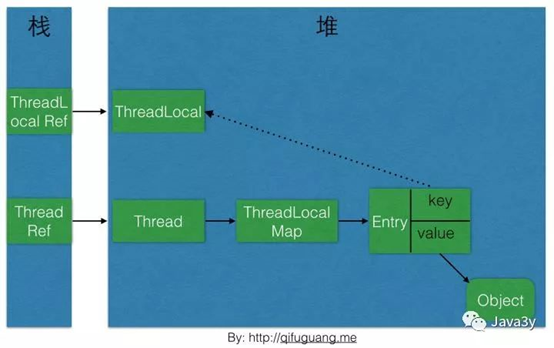

**ThreadLocal内存泄漏的根源是：由于ThreadLocalMap的生命周期跟Thread一样长，如果没有手动删除对应key就会导致内存泄漏，而不是因为弱引用。**

**想要避免内存泄露就要手动remove()掉！**

 

**最后要记住的是:ThreadLocal设计的目的就是为了能够在当前线程中有属于自己的变量，并不是为了解决并发或者共享变量的问题**

 

# 六、线程池

### 线程池简介

为了避免重复的创建线程，线程池的出现可以让线程进行复用。通俗点讲，当有工作来，就会向线程池拿一个线程，当工作完成后，并不是直接关闭线程，而是将这个线程归还给线程池供其他任务使用。

 

java.util.concurrent.Executosr是线程池的静态工厂，我们通常使用它方便地生产各种类型的线程池，主要的方法有三种：Executors.newCachedThreadPool();


**线程池类型：**

- newSingleThreadExecutor：单个线程的线程池，即线程池中每次只有一个线程工作，单线程串行执行任务

- newFixedThreadExecutor(n)：固定数量的线程池，提交一个任务就是一个线程，直到达到线程池的最大数量，然后后面进入等待队列直到前面的任务完成才继续执行

- newCacheThreadExecutor（推荐使用）：可缓存线程池，当线程池大小超过了处理任务所需的线程，那么就会回收部分空闲（一般是60秒无执行）的线程，当有任务来时，又智能的添加新线程来执行。

- newScheduleThreadExecutor：大小无限制的线程池，支持定时和周期性的执行线程


### 线程池API

JDK给我们提供了Excutor框架来使用线程池，它是线程池的基础。

- Executor提供了一种将“任务提交”与“任务执行”分离开来的机制(解耦)

  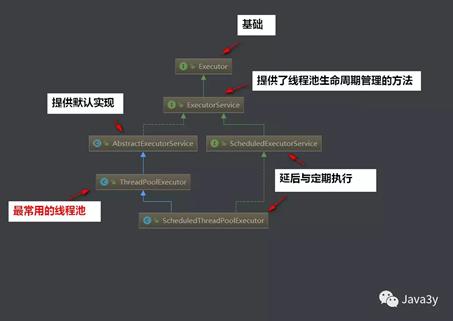

 

### ThreadPoolExecutor详解

```java
new ThreadPoolExecutor(int corePoolSize，

​              int maximumPoolSize，

​              long keepAliveTime，

​              TimeUnit unit，

​              BlockingQueue<Runnable> workQueue，

​              ThreadFactory threadFactory，

​              RejectedExecutionHandler handler);
```

- **corePoolSize :**线程池的核心池大小，在创建线程池之后，线程池默认没有任何线程。

  当有任务过来的时候才会去创建线程执行任务。换个说法，线程池创建之后，线程池中的线程数为0，当任务过来就会创建一个线程去执行，即使其他空闲的核心线程能够执行新任务也会创建新的核心线程。**直到线程数达到corePoolSize 之后，就会被到达的任务放在队列中**。

  threadcount = tasks/(1/taskcost) =tasks*taskcout（每个线程每秒处理能力）

 

- maximumPoolSize :线程池允许的最大线程数，他表示最大能创建多少个线程，**只有队列满了的时候，这个参数才有意义。**

  （最大任务数-队列容量）/每个线程每秒处理能力 = 最大线程数

 

- keepAliveTime :表示线程没有任务时最多保持多久然后停止。默认情况下，只有线程池中线程数大于corePoolSize 时，keepAliveTime 才会起作用。

  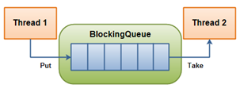

 

- workQueue**：**用来存放等待执行的任务。线程池创建线程需要获取mainlock这个全局锁，影响并发效率，阻塞队列可以很好的缓冲（）

  类型为`BlockingQueue<Runnable>`，通常可以取下面三种类型：

　　1. ArrayBlockingQueue：基于数组的先进先出队列，此队列创建时**必须指定大小；有界队列。**

　　2. LinkedBlockingQueue：基于链表的先进先出队列，如果创建时没有指定此队列大小，则默认为Integer.MAX_VALUE；**无界队列。**

　　3. synchronousQueue：这个队列比较特殊，它不会保存提交的任务，而是将直接新建一个线程来执行新来的任务。**直接提交。**

 

- threadFactory：线程工厂，主要用来创建线程；


 

- handler：表示当拒绝处理任务时的策略。**拒绝策略**有以下四种取值：
  - ThreadPoolExecutor.AbortPolicy:丢弃任务并抛出RejectedExecutionException异常。 
  - ThreadPoolExecutor.DiscardPolicy：也是丢弃任务，但是不抛出异常。
  - ThreadPoolExecutor.DiscardOldestPolicy：丢弃队列最前面的任务，然后重新尝试执行任务（重复此过程）
  - ThreadPoolExecutor.CallerRunsPolicy：由调用线程处理该任务。只要线程池未关闭，该策略直接在调用者线程中运行当前被丢弃的任务。显然这样不会真的丢弃任务，但是，调用者线程性能可能急剧下降。

 

 

**线程池的任务处理策略：**

> 如果当前线程池中的线程数目小于corePoolSize，则**每来一个任务，就会创建一个线程去执行这个任务**
>
> 如果当前线程池中的线程数目>=corePoolSize，则每来一个任务，会尝试将其添加到**任务缓存队列**当中，若添加成功，则该任务会等待空闲线程将其取出去执行；**若添加失败（一般来说是任务缓存队列已满），则会尝试创建新的线程去执行这个任务**；如果当前线程池中的线程数目达到maximumPoolSize，**则会采取任务拒绝策略进行处理**
>
> 如果线程池中的线程数量大于corePoolSize时，如果某线程空闲时间超过keepAliveTime，线程将被终止，**直至线程池中的线程数目不大于corePoolSize**；如果允许为核心池中的线程设置存活时间，那么核心池中的线程空闲时间超过keepAliveTime，线程也会被终止。

 

### 线程池实现原理

 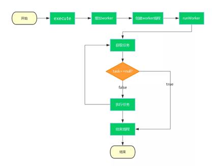

1. 线程池状态

   在ThreadPoolExecutor中定义了一个volatile变量，另外定义了几个static final变量表**示线程池的各个状态**：

   ```java
   volatile int runState;
   static final int RUNNING  = 0;
   static final int SHUTDOWN  = 1;
   static final int STOP    = 2;
   static final int TERMINATED = 3;
   ```

​	runState表示当前线程池的状态，它是一个volatile变量用来保证线程之间的可见性；

​	当创建线程池后，初始时，线程池处于RUNNING状态；

　　如果调用了shutdown()方法，则线程池处于SHUTDOWN状态，此时线程池不能够接受新的任务，它会等待所有任务执行完毕；

　　如果调用了shutdownNow()方法，则线程池处于STOP状态，此时线程池不能接受新的任务，并且会去尝试终止正在执行的任务；

　　当线程池处于SHUTDOWN或STOP状态，并且所有工作线程已经销毁，任务缓存队列已经清空或执行结束后，线程池被设置为TERMINATED状态。

2. 任务的执行（execute方法）

   其中，线程池会把每个线程封装成一个Worker对象，由addWorker(Runnable firstTask， boolean core)方法控制，firstTask代表线程池首要执行的任务，core代表是否使用corePoolSize参数作为线程池最大标记。

   Worker类本身既实现了Runnable，又继承了AbstractQueuedSynchronizer（以下简称AQS），所以其既是一个可执行的任务，又可以达到锁的效果。

3. 线程池中的线程初始化

　　默认情况下，创建线程池之后，线程池中是没有线程的，需要提交任务之后才会创建线程。

　　在实际中如果需要线程池创建之后立即创建线程，可以通过以下两个方法办到：prestartCoreThread()：初始化一个核心线程；prestartAllCoreThreads()：初始化所有核心线程

4. 任务缓存队列及排队策略

　　在前面我们多次提到了任务缓存队列，即workQueue，它用来存放等待执行的任务。

　　workQueue的类型为BlockingQueue<Runnable>，通常可以取下面三种类型：

　　1）ArrayBlockingQueue：基于数组的先进先出队列，此队列创建时必须指定大小；

　　2）LinkedBlockingQueue：基于链表的先进先出队列，如果创建时没有指定此队列大小，则默认为Integer.MAX_VALUE；

　　3）synchronousQueue：这个队列比较特殊，它不会保存提交的任务，而是将直接新建一个线程来执行新来的任务。 

5. 任务拒绝策略

   ThreadPoolExecutor.AbortPolicy:丢弃任务并抛出RejectedExecutionException异常。

   ThreadPoolExecutor.DiscardPolicy：也是丢弃任务，但是不抛出异常。

   ThreadPoolExecutor.DiscardOldestPolicy：丢弃队列最前面的任务，然后重新尝试执行任务（重复此过程）

   ThreadPoolExecutor.CallerRunsPolicy：由调用线程处理该任务

6. 线程池的关闭

　　ThreadPoolExecutor提供了两个方法，用于线程池的关闭，分别是shutdown()和shutdownNow()，其中：

​		shutdown()：不会立即终止线程池，而是要等所有任务缓存队列中的任务都执行完后才终止，但再也不会接受新的任务

​		shutdownNow()：立即终止线程池，并尝试打断正在执行的任务，并且清空任务缓存队列，返回尚未执行的任务

7. 线程池容量的动态调整

   ThreadPoolExecutor提供了动态调整线程池容量大小的方法：setCorePoolSize()和setMaximumPoolSize()，

   setCorePoolSize：设置核心池大小

   setMaximumPoolSize：设置线程池最大能创建的线程数目大小

 

# 七、Fork/Join 框架

 

# 死锁讲解

### 死锁的条件、原因？

**死锁的条件**

1. 互斥条件：一个资源每次只能被一个线程使用；

2. 请求与保持条件：一个线程因请求资源而阻塞时，对已获得的资源保持不放；

3. 不剥夺条件：进程已经获得的资源，在未使用完之前，不能强行剥夺；

4. 循环等待条件：若干线程之间形成一种头尾相接的循环等待资源关系。

**造成死锁的原因**可以**概括**成三句话：

- 当前线程**拥有其他线程需要的**资源

- 当前线程**等待其他线程已拥有**的资源

- **都不放弃**自己拥有的资源

 

 

### 死锁例子

```java
/** 

\* 一个简单的死锁类

\* 当DeadLock类的对象flag==1时（td1），**先锁定o1，睡眠500毫秒** 

\* 而td1在睡眠的时候另一个flag==0的对象（td2）线程启动，**先锁定o2，睡眠500毫秒**

\* td1睡眠结束后需要锁定o2才能继续执行，而此时o2已被td2锁定；

\* td2睡眠结束后需要锁定o1才能继续执行，而此时o1已被td1锁定；

\* td1、td2相互等待，都需要得到对方锁定的资源才能继续执行，从而死锁。 

*/ 

public class DeadLock implements Runnable { 
  public int flag = 1;
  //静态对象是类的所有对象共享的 
  private static Object o1 = new Object()， o2 = new Object(); 
  @Override 
  public void run() { 
​    System.out.println("flag=" + flag); 
​    if (flag == 1) { 
​      synchronized (o1) { 
​        try { 
​          Thread.sleep(500); 
​        } catch (Exception e) { 

​          e.printStackTrace(); 

​        } 
​        synchronized (o2) { 
​          System.out.println("1"); 
​        } 
​      } 
​    } 
​    if (flag == 0) { 
​      synchronized (o2) { 
​        try { 
​          Thread.sleep(500);
​        } catch (Exception e) { 
​          e.printStackTrace(); 
​        } 
​        synchronized (o1) { 
​          System.out.println("0"); 
​        } 
​      } 
​    } 
  } 

  public static void main(String[] args) { 
​    DeadLock td1 = new DeadLock(); 
​    DeadLock td2 = new DeadLock(); 
​    td1.flag = 1; 
​    td2.flag = 0; 
​    //td1，td2都处于可执行状态，但JVM线程调度先执行哪个线程是不确定的。 
​    //td2的run()可能在td1的run()之前运行 
​    new Thread(td1).start(); 
​    new Thread(td2).start(); 
  } 
}
```


我们利用jdk提供的工具定位死锁问题：

1. **jps**显示所有当前Java虚拟机进程名及pid.

2. **jstack**打印进程堆栈信息。（jstack 11170）

 

#### 死锁检测

**虽然造成死锁的原因是因为我们设计得不够好，但是可能写代码的时候不知道哪里发生了死锁。**

**JDK提供了两种方式来给我们检测：**

· **JconsoleJDK自带的图形化界面工具，使用JDK给我们的的工具JConsole**

· **Jstack是JDK自带的命令行工具，主要用于线程Dump分析。**

 

#### 如何避免死锁？

**死锁预防**

**1. 破坏互斥条件**

（互斥）尽量少用互斥锁，能加读锁，不加写锁。当然这条无法避免。

**2. 破坏占有和等待条件**

一种实现方式是规定所有进程在开始执行前请求**所需要的全部资源。**

**3. 破坏不可抢占条件**

**4. 破坏环路等待**

**给资源统一编号**，**进程只能按编号顺序来请求资源。**

 

1.指定获取锁的顺序， 死锁发生在多个线程需要相同的锁，但是获得不同的顺序。

假如一个线程需要锁，那么他必须按照一定得顺序获得锁。 
 例如加锁顺序是A->B->C，现在想要线程C想要获取锁，那么他必须等到线程A和线程B获取锁之后才能轮到他获取。（排队执行，获取锁）

2.在获取锁的时候尝试加一个**获取锁的时限，**超过时限不需要再获取锁，放弃操作（对锁的请求。）

\3. **多个资源的银行家算法**

 

### 锁顺序死锁

首先我们来看一下最简单的死锁(锁顺序死锁)是怎么样发生的：

public class LeftRightDeadlock {
   **private final** Object left = new Object();
   private final Object right = new Object();
   public void leftRight() {
     // 得到left锁
     synchronized (left) {
       // 得到right锁
       synchronized (right) {
         doSomething();
       }
     }
   }
   public void rightLeft() {
     // 得到right锁
     synchronized (right) {
       // 得到left锁
       synchronized (left) {
         doSomethingElse();
       }
     }
   }
 }

我们的线程是**交错执行**的，那么就很有可能出现以下的情况：

· 线程A调用leftRight()方法，得到left锁

· **同时**线程B调用rightLeft()方法，得到right锁

· 线程A和线程B都继续执行，此时线程A需要right锁**才能继续往下**执行。此时线程B需要left锁**才能继续往下**执行。

· 但是：**线程A的left锁并没有释放，线程B的right锁也没有释放**。

· 所以他们都只能等待，而这种等待是无期限的-->永久等待-->死锁

 

### 动态锁顺序死锁

我们看一下下面的例子，你认为会发生死锁吗？

  

```java
 // 转账
public static void transferMoney(Account fromAccount，
                                 Account toAccount，
                                 DollarAmount amount)
    throws InsufficientFundsException {
    // 锁定汇账账户
    synchronized (fromAccount) {
        // 锁定来账账户
        synchronized (toAccount) {
            // 判余额是否大于0
            if (fromAccount.getBalance().compareTo(amount) < 0) {
                throw new InsufficientFundsException();
            } else {
                // 汇账账户减钱
                fromAccount.debit(amount);
                // 来账账户增钱
                toAccount.credit(amount);
            }
        }
    }
}
```

上面的代码看起来是没有问题的：锁定两个账户来判断余额是否充足才进行转账！

但是，同样有可能会发生死锁：

- 如果两个线程同时调用transferMoney()

- 线程A从X账户向Y账户转账

- 线程B从账户Y向账户X转账

- 那么就会发生死锁。


A:transferMoney(myAccount，yourAccount，10);
B:transferMoney(yourAccount，myAccount，20);

 

### 协作对象之间发生死锁

**我们来看一下下面的例子：**

**public class CooperatingDeadlock {
   // Warning: deadlock-prone!
   class Taxi {
     @GuardedBy("this") private Point location， destination;
     private final Dispatcher dispatcher;

     public Taxi(Dispatcher dispatcher) {
       this.dispatcher = dispatcher;
     }
     
     public synchronized Point getLocation() {
       return location;
     }
     
     // setLocation 需要Taxi内置锁
     public synchronized void setLocation(Point location) {
       this.location = location;
       if (location.equals(destination))
         // 调用notifyAvailable()需要Dispatcher内置锁
         dispatcher.notifyAvailable(this);
     }
     
     public synchronized Point getDestination() {
       return destination;
     }
     
     public synchronized void setDestination(Point destination) {
       this.destination = destination;
     }
   }

   class Dispatcher {
     @GuardedBy("this") private final Set<Taxi> taxis;
     @GuardedBy("this") private final Set<Taxi> availableTaxis;

     public Dispatcher() {
       taxis = new HashSet<Taxi>();
       availableTaxis = new HashSet<Taxi>();
     }
     
     public synchronized void notifyAvailable(Taxi taxi) {
       availableTaxis.add(taxi);
     }
     
     // 调用getImage()需要Dispatcher内置锁
     public synchronized Image getImage() {
       Image image = new Image();
       for (Taxi t : taxis)
         // 调用getLocation()需要Taxi内置锁
         image.drawMarker(t.getLocation());
       return image;
     }
   }

   class Image {
     public void drawMarker(Point p) {
     }
   }
 }**

**上面的getImage()和setLocation(Point location)都需要获取两个锁的**

· **并且在操作途中是没有释放锁的**

**这就是隐式获取两个锁(对象之间协作)..**

**这种方式也很容易就造成死锁…..**

 

### 避免死锁的方法

**避免死锁可以概括成三种方法：**

· **固定加锁的顺序(针对锁顺序死锁)**

· **开放调用(针对对象之间协作造成的死锁)**

· **使用定时锁-->tryLock()**

§ **如果等待获取锁时间超时，则抛出异常而不是一直等待！**

#### 固定锁顺序避免死锁

**上面transferMoney()发生死锁的原因是因为加锁顺序不一致而出现的~**

· **正如书上所说的：如果所有线程以固定的顺序来获得锁，那么程序中就不会出现锁顺序死锁问题！**

**那么上面的例子我们就可以改造成这样子：**

**public class InduceLockOrder {

   // 额外的锁、避免两个对象hash值相等的情况(即使很少)
   private static final Object tieLock = new Object();

   public void transferMoney(final Account fromAcct，
                final Account toAcct，
                final DollarAmount amount)
       throws InsufficientFundsException {
     class Helper {
       public void transfer() throws InsufficientFundsException {
         if (fromAcct.getBalance().compareTo(amount) < 0)
           throw new InsufficientFundsException();
         else {
           fromAcct.debit(amount);
           toAcct.credit(amount);
         }
       }
     }
     // 得到锁的hash值
     int fromHash = System.identityHashCode(fromAcct);
     int toHash = System.identityHashCode(toAcct);

     // 根据hash值来上锁
     if (fromHash < toHash) {
       synchronized (fromAcct) {
         synchronized (toAcct) {
           new Helper().transfer();
         }
       }
     
     } else if (fromHash > toHash) {// 根据hash值来上锁
       synchronized (toAcct) {
         synchronized (fromAcct) {
           new Helper().transfer();
         }
       }
     } else {// 额外的锁、避免两个对象hash值相等的情况(即使很少)
       synchronized (tieLock) {
         synchronized (fromAcct) {
           synchronized (toAcct) {
             new Helper().transfer();
           }
         }
       }
     }
   }
 }**

**得到对应的hash值来固定加锁的顺序，这样我们就不会发生死锁的问题了！**

#### 开放调用避免死锁

**在协作对象之间发生死锁的例子中，主要是因为在调用某个方法时就需要持有锁，并且在方法内部也调用了其他带锁的方法！**

· **如果在调用某个方法时不需要持有锁，那么这种调用被称为开放调用！**

**我们可以这样来改造：**

· **同步代码块最好仅被用于保护那些涉及共享状态的操作！**

**class CooperatingNoDeadlock {
   @ThreadSafe
   class Taxi {
     @GuardedBy("this") private Point location， destination;
     private final Dispatcher dispatcher;

     public Taxi(Dispatcher dispatcher) {
       this.dispatcher = dispatcher;
     }
     
     public synchronized Point getLocation() {
       return location;
     }
     
     public synchronized void setLocation(Point location) {
       boolean reachedDestination;
     
       // 加Taxi内置锁
       synchronized (this) {
         this.location = location;
         reachedDestination = location.equals(destination);
       }
       // 执行同步代码块后完毕，释放锁

 


       if (reachedDestination)
         // 加Dispatcher内置锁
         dispatcher.notifyAvailable(this);
     }
     
     public synchronized Point getDestination() {
       return destination;
     }
     
     public synchronized void setDestination(Point destination) {
       this.destination = destination;
     }
   }

   @ThreadSafe
   class Dispatcher {
     @GuardedBy("this") private final Set<Taxi> taxis;
     @GuardedBy("this") private final Set<Taxi> availableTaxis;

     public Dispatcher() {
       taxis = new HashSet<Taxi>();
       availableTaxis = new HashSet<Taxi>();
     }
     
     public synchronized void notifyAvailable(Taxi taxi) {
       availableTaxis.add(taxi);
     }
     
     public Image getImage() {
       Set<Taxi> copy;
     
       // Dispatcher内置锁
       synchronized (this) {
         copy = new HashSet<Taxi>(taxis);
       }
       // 执行同步代码块后完毕，释放锁
     
       Image image = new Image();
       for (Taxi t : copy)
         // 加Taix内置锁
         image.drawMarker(t.getLocation());
       return image;
     }
   }

   class Image {
     public void drawMarker(Point p) {
     }
   }

 }

**使用开放调用是非常好的一种方式，应该尽量使用它~**

#### 使用定时锁

**使用显式Lock锁，在获取锁时使用tryLock()方法。当等待超过时限的时候，tryLock()不会一直等待，而是返回错误信息。**

**使用tryLock()能够有效避免死锁问题~~**

 