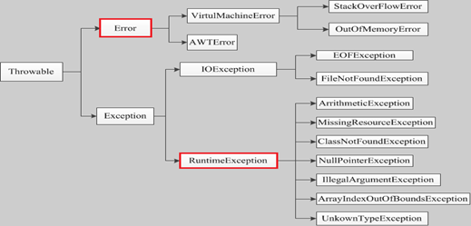
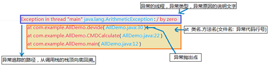

# Java中的异常

> 异常是发生在**程序执行过程**中阻碍程序正常执行的错误事件。只要在Java语句执行中产生了异常，**一个异常对象就会被创建，JRE就会试图寻找异常处理程序来处理异常**
>
> Java异常处理框架**只能处理运行时错误**
>
> **子类不能抛比父类更多的异常。（子类更好，处理异常，而不是抛出来）**


**编译错误（标点，大小写，括号未使用的变量等）、逻辑错误不在其考虑范围之内。**

**异常分类和结构图**



​                               

## Throwable类常用方法

- public string getMessage():返回异常发生时的详细信息
- public string  toString():返回异常发生时的简要描述
- public string  getLocalizedMessage():返回异常对象的本地化信息。使用Throwable的子类覆盖这个方法，可以声称本地化信息。如果子类没有覆盖该方法，则该方法返回的信息与getMessage（）返回的结果相同
- public void printStackTrace():在控制台上打印Throwable对象封装的异常信息

 

## 异常分类

**注意：异常和错误的区别：异常能被程序本身可以处理，错误是无法处理**。

- **error一般是指与虚拟机相关的错误**，系统崩溃，虚拟机错误，内存空间不足，栈溢出等，这类错误仅靠程序本身无法恢复和预防，一般建议程序停止。

- **Exception:**

  - **非检查异常（unchecked exception）**

    Error 和 RuntimeException （一定是程序员的错误）以及他们的子类。javac在编译时，不会提示和发现这样的异常，不要求在程序处理这些异常。并不会在编译期强制要求，我们可以处理，也可以不处理。**RuntimeException异常由Java虚拟机抛出**。

  - **检查异常（应用环境中出现的外部错误）**

    javac强制要求程序员为这样的**异常做预备处理工作**（使用try…catch…finally或者throws）。在方法中要么用try-catch语句捕获它并处理，要么用throws子句声明抛出它，否则编译不会通过。



## 编译与运行时异常

- **常见的编译时异常**
  - FileNotFoundException
  - java.lang.ClassNotFoundException 指定的类找不到；出现原因：类的名称和路径加载错误；通常都是程序 试图通过字符串来加载某个类时可能引发异常。
  - SQLException
  - NoSuchFieldException
  - NoSuchMethodException
  - ParseException

- **常见的运行时RuntimeException以及子类**

  （java默认RuntimeException中的所有方法都定义在throws中，不补获向上抛出）

  如果某异常继承RuntimeException，可以不被声明。即使不处理，java自己捕获，并且编译通过
  
  - java.lang.NullPointerException 空指针异常；出现原因：调用了未经初始化的对象或者是不存在的对象。 int[]=null;a[0]=1;
  - java.lang.NumberFormatException 字符串转换为数字异常；出现原因：字符型数据中包含非数字型字符。
  - java.lang.IndexOutOfBoundsException 数组角标越界异常，常见于操作数组对象时发生。
- java.lang.IllegalArgumentException 方法传递参数错误。
  - java.lang.ClassCastException 数据类型转换异常。
  
  

## 异常处理关键字

- *throw*:有时我们需要显式地**创建并抛出异常对象**来终止程序的正常执行。throw关键字用来抛出并处理运行时异常。执行throw 语句的地方就是一个异常抛出点，它和由 JRE 自动形成的异常抛出点没有任何差别。
- *throws*:当我们抛出任何“被检查的异常(checked exception)”并不处理时，需要在**方法签名中使用关键字throws**来告知**调用程序**者此方法**可能会抛出的异常**。调用方法可能会处理这些异常，或者同样**用throws来将异常传给上一级调用方法。**throws关键字后可接多个潜在异常，throws 表示出现异常的一种可能性，并不一定会发生这种异常。
- *try-catch*:我们在代码中**用try-catch块处理异常**。当然，一个try块之后可以有多个catch子句，try-catch块也能嵌套。**每个catch块必须接受一个（且仅有一个）代表异常类型的参数**。
- 当在try块或catch块中遇到return语句时，finally语句块将在方法返回之前被执行。

- *finally*： finally 块是可选的，并且只能配合try-catch一起使用。虽然异常终止了程序的执行，但是还有一些打开的资源没有被关闭，因此，我们能使用finally进行关闭。**不管异常有没有出现，finally块总会被执行。** 

finally中最好不要包含return，否则程序会提前退出，返回会覆盖try或catch中保存的返回值。

 

**异常处理是具体怎样执行**

1. 一旦产生异常，则首先虚拟机会产生一个异常类的实例化对象。

2. 在try语句中对此异常对象进行捕捉。 

3. 产生的异常对象与catch语句中的各个异常类型进行匹配，如果匹配成功则执行catch语句中的代码

 

## 创建自定义异常对象

> 所谓的自定义异常就是java提供的异常体系无法满足你的需求，说白了就是有些异常系统无法预见，需要人为干预。所以才有自定义异常的方式，要自己定义一个异常必须从已有的异常类进行继承。
>
> **自定义异常可以在我们项目中某些特殊的业务逻辑时抛出异常**，比如"中性".equals(sex)，性别等于中性时我们要抛出异常，而Java是不会有这种异常的。系统中有些错误是符合Java语法的，但不符合我们项目的业务逻辑。

在 Java 中你可以自定义异常。编写自己的异常类时需要记住下面的几点。

- 所有异常都必须是 Throwable 的子类。

- 如果希望写一个检查性异常类，则需要继承 Exception 类。

- 如果你想写一个运行时异常类，那么需要继承 RuntimeException 类。
- 需要提供UID
- 通过throw抛出异常
- 通常编写几个重载的构造器


### java中的异常链

异常需要封装，但是仅仅封装还是不够的**，还需要传递异常。**

异常链是一种面向对象编程技术，指将捕获的异常包装进一个新的异常中并重新抛出的异常处理方式。**原异常被保存为新异常的一个属性（比如cause）。**这样做的意义是一个方法应该抛出定义在相同的抽象层次上的异常，但不会丢弃更低层次的信息。

我可以这样理解异常链：把捕获的异常包装成新的异常，在新异常里添加原始的异常，并将新异常抛出，它们就像是链式反应一样，一个导致（cause）另一个。这样在**最后的顶层抛出的异常信息就包括了最底层的异常信息。**


**建议**

- 正确的做法是**先封装，然后传递**。
- 异常需要封装和传递，我们在进行系统开发的时候，不要“吞噬”异常，也不要“赤裸裸”的抛出异常，封装后再抛出，或者通过异常链传递，可以达到系统更健壮、友好的目的。


# 代理

## 代理的概念

**动态代理技术就是用来产生一个对象的代理对象的**。在开发中为什么需要为一个对象产生代理对象呢？

**可以做到在不修改目标对象的功能前提下，对目标对象功能扩展。**

 

所以在这里明确代理对象的两个概念：

1. **代理对象存在的价值主要用于拦截对真实业务对象的访问**。
2. 代理对象应该具有和目标对象(真实业务对象)相同的方法。

**经纪人就是代理，实际上台唱歌、表演的还是我。**

 

## 静态代理

**静态代理案例**

直接使用例子来说明吧…现在我有一个**IUserDao的接口**，拥有save方法()

```java
// 接口
public interface IUserDao {
  void save();
}

//UserDao实现该接口，重写save()方法
public class UserDao implements IUserDao{
  @Override
  public void save() {
    System.out.println("-----已经保存数据！！！------");
  }
```

现在，我想要在save()方法保存数据前开启事务、保存数据之后关闭事务…(当然啦，直接再上面写不就行了吗…业务方法少的时候，确实没毛病…)

但是呢，现在如果我有好多好多个业务方法都需要开启事务、关闭事务呢？

```java
public void save() {
    System.out.println("开启事务");
    System.out.println("-----已经保存数据！！！------");
    System.out.println("关闭事务");
  }
public void delete() {
    System.out.println("开启事务");
    System.out.println("-----已经保存数据！！！------");
    System.out.println("关闭事务");
  }
public void update() {
    System.out.println("开启事务");
    System.out.println("-----已经保存数据！！！------");
    System.out.println("关闭事务");
  }
public void login() {
    System.out.println("开启事务");
    System.out.println("-----已经保存数据！！！------");
    System.out.println("关闭事务");
  }
```

…..我们发现就有了很多很多的重复代码了…我们要做的就是：**当用户调用UserDao方法的时候，找的是代理对象、而代理帮我在解决这么繁琐的代码**，于是呢，我们就请了一个代理了

**这个代理要和userDao有相同的方法…**没有相同的方法的话，用户怎么调用啊？？

代理只是对userDao进行增强，真正做事的还是userDao。因此，我们的代理就要实现IUserDao接口，这样的话，代理就跟userDao有相同的方法了。

```java
public class UserDaoProxy implements IUserDao{
  // 接收保存目标对象【真正做事的还是UserDao】，因此需要维护userDao的引用
  private IUserDao target;
  public UserDaoProxy() {
    super();
	this.target = new UserDao();
}
  @Override
  public void save() {
    System.out.println("开始事务...");
    target.save();     // 执行目标对象的方法
    System.out.println("提交事务...");
  }
}

//外界并不是直接去找UserDao,而是要通过代理才能找到userDao
  public static void main(String[] args) {
    // 目标对象    
    IUserDao target = new UserDao();
    // 代理
    IUserDao proxy = new UserDaoProxy();
    proxy.save(); // 执行的是，代理的方法
  }
```

这样一来，我们在UserDao中就不用写那么傻逼的代码了…傻逼的事情都交给代理去干了…

**静态代理的不足**

- 如果接口改了，代理的也要跟着改！

- 因为**代理对象，需要与目标对象实现一样的接口，一个代理类一个接口**。所以会有很多代理类，类太多。最好一个代理类完成全部的代理功能。


**动态代理比静态代理好**

- 代理对象，不需要实现接口【就不会有太多的代理类了】

- 代理对象的生成，是利用`JDK API`， 动态地在内存中构建代理对象(需要我们指定创建代理对象/目标对象实现的接口的类型)；


## JDK 动态代理

### java.lang.reflect.Proxy

**现在要生成某一个对象的代理对象，这个代理对象通常也要编写一个类来生成**，所以首先要编写用于生成代理对象的类。在Java中如何用程序去生成一个对象的代理对象呢，Java在 JDK 1.5 之后提供了一个"**java.lang.reflect.Proxy**"类，通过"**Proxy**"类提供的一个**newProxyInstance**方法用来创建一个对象的代理对象，如下所示：

static Object **newProxyInstance**(ClassLoader loader, Class<?>[] interfaces, InvocationHandler h)  

newProxyInstance方法用来返回一个代理对象，这个方法总共有3个参数，ClassLoader loader用来指明生成代理对象使用哪个类装载器，Class<?>[] interfaces用来指明生成哪个对象的代理对象，通过接口指定，InvocationHandler h用来指明产生的这个代理对象要做什么事情。所以我们只需要调用newProxyInstance方法就可以得到某一个对象的代理对象了。

 

**JDK** **动态代理如何实现？（加分点）**

答：JDK 动态代理，只能对实现了接口的类生成代理，而不是针对类，该目标类型实现的接口都将被代理。原理是通过在运行期间创建一个接口的实现类来完成对目标对象的代理。

1. 定义一个实现接口 InvocationHandler 的类；

2. 通过构造函数，注入被代理类；

3. 实现 invoke（ Object proxy, Method method, Object[] args）方法；

4. 在主函数中获**得被代理类的类加载器**；

5. 使用 Proxy.newProxyInstance( ) 产生一个代理对象；

6. 通过代理对象调用各种方法。

 

### 案例

**在Java中规定，要想产生一个对象的代理对象，那么这个对象必须要有一个接口**，所以我们第一步就是设计这个对象的接口，在接口中定义这个对象所具有的行为(方法)

1. 定义对象的行为接口

   ```java
   package cn.gacl.proxy; 
   public interface Person {
   	String sing(String name);
   	String dance(String name);
   }
   ```

   

2. 定义目标业务对象类

   ```java
   package cn.gacl.proxy;
   public class LiuDeHua implements Person {
     public String sing(String name){
       System.out.println("刘德华唱"+name+"歌！！");
       return "歌唱完了，谢谢大家！";
     }
     public String dance(String name){
       System.out.println("刘德华跳"+name+"舞！！");
       return "舞跳完了，多谢各位观众！";
     }
   }
   ```

3. 创建生成代理对象的代理类

   ```java
   package cn.gacl.proxy;
   import java.lang.reflect.InvocationHandler;
   import java.lang.reflect.Method;
   import java.lang.reflect.Proxy;
   public class LiuDeHuaProxy {
     //设计一个类变量记住代理类要代理的目标对象
     private Person ldh = new LiuDeHua();
     public Person getProxy() {
       return (Person) Proxy.newProxyInstance(LiuDeHuaProxy.class
           .getClassLoader(), ldh.getClass().getInterfaces(),
           new InvocationHandler() {
             /**
              * InvocationHandler接口只定义了一个invoke方法，因此对于这样的接口，我们不用单独去定义一个类来实现该接口，而是**直接使用一个匿名内部类来实现该接口**，new InvocationHandler() {}就是针对InvocationHandler接口的匿名实现类
              * 在invoke方法编码指定返回的代理对象干的工作
              * proxy : 把代理对象自己传递进来 
              * method：把代理对象当前调用的方法传递进来 
              * args:把方法参数传递进来
              * 当调用代理对象的person.sing("冰雨");或者 person.dance("江南style");方法时，
              * 实际上执行的都是invoke方法里面的代码，
              * 因此我们可以在invoke方法中使用method.getName()就可以知道当前调用的是代理对象的哪个方法
              **/
             @Override
             public Object invoke(Object proxy, Method method,
                 Object[] args) throws Throwable {
                //如果调用的是代理对象的sing方法
               if (method.getName().equals("sing")) {
                 System.out.println("我是他的经纪人，要找他唱歌得先给十万块钱！！");
                 //已经给钱了，经纪人自己不会唱歌，就只能找刘德华去唱歌！
                  return method.invoke(ldh, args); //代理对象调用真实目标对象的sing方法去处理用户请求
               }
               //如果调用的是代理对象的dance方法
               if (method.getName().equals("dance")) {
                 System.out.println("我是他的经纪人，要找他跳舞得先给二十万块钱！！");
                 //已经给钱了，经纪人自己不会唱歌，就只能找刘德华去跳舞！
                 return method.invoke(ldh, args);//代理对象调用真实目标对象的dance方法去处理用户请求
               }
                return null;
             }
           }
         }
     }
   }
   ```

4. 测试代码

   ```java
   package cn.gacl.proxy;
   public class ProxyTest {
     public static void main(String[] args) {
       LiuDeHuaProxy proxy = new LiuDeHuaProxy();
       //获得代理对象
       Person p = proxy.getProxy();
       //调用代理对象的sing方法
       String retValue = p.sing("冰雨");
       System.out.println(retValue);
       //调用代理对象的dance方法
       String value = p.dance("江南style");
       System.out.println(value);
     }
   }
   ```

Proxy类负责创建代理对象时，**如果指定了handler（处理器）**，那么不管用户调用代理对象的什么方法，该方法都是**调用处理器的invoke方法**

**由于invoke方法被调用需要三个参数：**代理对象、方法、方法的参数，因此不管代理对象哪个方法调用处理器的invoke方法，都必须把自己所在的对象、自己（调用invoke方法的方法）、方法的参数传递进来。

 

**JDK动态代理也有个约束**：

- 目标对象一定是要有接口的，没有接口就不能实现动态代理---->因此出现了cglib代理
- 使用cglib就是为了弥补动态代理的不足【动态代理的目标对象一定要实现接口】
- cglib代理**也叫子类代理**，从内存中构建出一个子类来扩展目标对象的功能！


**CGLIB**是一个强大的高性能的代码生成包，它可以在运行期扩展Java类与实现Java接口。它广泛的被许多AOP的框架使用，例如Spring AOP和dynaop，为他们提供方法的interception（拦截）

 

# 设计模式

> 设计模式（Design pattern）是一套被反复使用、多数人知晓的、经过分类编目的、代码设计经验的总结。使用设计模式是为了可重用代码、让代码更容易被他人理解、保证代码可靠性。 毫无疑问，设计模式于己于他人于系统都是多赢的，设计模式使代码编制真正工程化，设计模式是软件工程的基石，如同大厦的一块块砖石一样。项目中合理的运用设计模式可以完美的解决很多问题，每种模式在现在中都有相应的原理来与之对应，每一个模式描述了一个在我们周围不断重复发生的问题，以及该问题的核心解决方案，这也是它能被广泛应用的原因。

## 一、设计模式的分类

### 设计模式

总体来说设计模式分为三大类：

- 创建型模式，共五种：工厂方法模式、抽象工厂模式、单例模式、建造者模式、原型模式。
- 结构型模式，共七种：适配器模式、装饰器模式、代理模式、外观模式、桥接模式、组合模式、享元模式。
- 行为型模式，共十一种：策略模式、模板模式、观察者模式、迭代子模式、责任链模式、命令模式、备忘录模式、状态模式、访问者模式、中介者模式、解释器模式。

其实还有两类：并发型模式和线程池模式。


### 设计模式的六大原则

> 1、开放封闭原则（Open Close Principle）
>
> 开闭原则就是说**对扩展开放，对修改关闭**。在程序需要进行拓展的时候，不能去修改原有的代码，实现一个热插拔的效果。所以一句话概括就是：为了使程序的扩展性好，易于维护和升级。想要达到这样的效果，我们需要使用接口和抽象类，后面的具体设计中我们会提到这点。
>
> 2、里氏代换原则（Liskov Substitution Principle）
>
> 里氏代换原则(Liskov Substitution Principle LSP)面向对象设计的基本原则之一。 里氏代换原则中说，**任何基类可以出现的地方，子类一定可以出现**。 LSP是继承复用的基石，只有当衍生类可以替换掉基类，软件单位的功能不受到影响时，基类才能真正被复用，而衍生类也能够在基类的基础上增加新的行为。里氏代换原则是对“开-闭”原则的补充。实现“开-闭”原则的关键步骤就是抽象化。而基类与子类的继承关系就是抽象化的具体实现，所以里氏代换原则是对实现抽象化的具体步骤的规范。
>
> 3、依赖倒置原则（Dependence Inversion Principle）
>
> 这个是开闭原则的基础，具体内容：针对接口编程，依赖于抽象而不依赖于具体。实现细节依赖于抽象
>
> 4、接口隔离原则（Interface Segregation Principle）
>
> 这个原则的意思是：使用多个隔离的接口，比使用单个接口要好。还是一个降低类之间的耦合度的意思，从这儿我们看出，其实设计模式就是一个软件的设计思想，从大型软件架构出发，为了升级和维护方便。所以上文中多次出现：降低依赖，降低耦合。
>
> 5、单一职责原则（SRP）
>
> 一个类应该有且只有一个去改变它的理由，这意味着一个类应该只有一项工作。
>
> 6、迪米特法则（Law-Of-Demeter）
>
> 核心：一个软件实体应当尽可能少地与其他实体发生作用（无熟人难办事）。也叫最少知识原则。如果两个类不彼此通信，那么这两个类就不应当直接地发生相互作用。如果其中一个类需要另一个类的某一个方法的话，可以通过第三者转发这个调用。

 

[所有的模式]: https://www.cnblogs.com/cnblog-long/p/6916273.html

 

### 创建型模式

#### 单例模式（Singleton）

单例对象（Singleton）是一种常用的设计模式。在Java应用中，单例对象能保证在一个JVM中，**该对象只有一个实例存在**。这样的模式有几个好处：

1. 某些类创建比较频繁，对于一些大型的对象，这是一笔很大的系统开销。
2. **省去了new操作符，降低了系统内存的使用频率**，减轻GC压力。
3. 有些类如交易所的核心交易引擎，控制着交易流程，如果该类可以创建多个的话，系统完全乱了。


**使用场景**：线程池就是单例模式的实现；在操作系统中，打印池(Print Spooler)是一个用于管理打印任务的应用程序；网站计数器；日志；数据库资源；Bean单例模式；Servlet等

常见的单例模式实现方法：`饿汉、懒汉、双重检测锁式、静态内部类、枚举单例`

##### 2.1静态工程方法（饿汉）

```java
public class Singleton { 
  // 持有私有静态实例，防止被引用，此处赋值为null，目的是实现延迟加载,静态方法只能访问静态，所以属性设成static
  private static Singleton instance = new Singleton(); 

  /* 私有构造方法，防止被实例化 */ 
  private Singleton() { 
  } 

  /* 静态工程方法，创建实例 */ 
  public static Singleton getInstance() { 
    return instance; 
  } 
} 
```

如果加载了，如果不调用，会造成资源浪费

##### 2.2静态工程方法（懒汉）

**线程安全，调用效率不高，延迟加载**

```java
public class Singleton { 
  // 持有私有静态实例，防止被引用，此处赋值为null，目的是实现延迟加载,静态方法只能访问静态，所以属性设成static
  private static Singleton instance = null; 
  
  /* 私有构造方法，防止被实例化 */ 
  private Singleton() { 
  } 
 
  /* 静态工程方法，创建实例 */ 
  public static synchronized Singleton getInstance() { 
    if (instance == null) { 
      instance = new Singleton(); 
    } 
    return instance; 
  } 
} 
```

- 不加synchronized，毫无线程安全保护的类
- 加synchronized，每次都要同步，并发效率低


##### 2.3双重检查锁定

主要在`getSingleton()`方法中，进行两次null检查。这样可以极大提升并发度，进而提升性能。

假设有两个线程同时访问这个方法，同时判断到第一个instance == null,然后其中一个线程会先拿到锁，我们假设没有第二个判断，那么这个时候创建完对象之后，返回对象，而第二个线程又会创建一个实例 但此时instance已经不是null了，所以我们要进行第二次的判断。 

毕竟在单例中new的情况非常少，绝大多数都是可以并行的读操作，因此在**加锁前多进行一次null**检查就可以减少绝大多数的加锁操作，也就提高了执行效率。

**线程不安全，重排序的问题，只要禁止重排序**

```java
public class SingleTon {
  // 静态实例变量加上volatile
  private static volatile SingleTon instance = null;;
  
  // 私有化构造函数
  private SingleTon() {}
  
  // 双重检查锁
  public static SingleTon getInstance() {
    if (instance == null) {
      synchronized(SingleTon.class){
        if(instance == null){
          instance = new SingleTon();
        }
      }
    }
    return instance;
  }
```

 

##### 2.4静态内部类实现

Singleton实例放到一个静态内部类中，这样可以避免了静态实例在Singleton类的加载阶段就创建对象，毕竟静态变量初始化是在SingletonInner类初始化时触发的，并且由于静态内部类**只会被加载一次**，所以这种写法也是线程安全的

```java
public class SingleTon {
  // 私有化构造函数
  private SingleTon() {}

  // 利用静态内部类特性实现外部类的单例，final保证内存只被赋值一次
   private static class SingleTonBuilder {
    private static final SingleTon singleTon = new SingleTon();
  }  

  public static SingleTon getInstance() {
    return SingleTonBuilder.singleTon;
  }
}
```

Java中静态内部类可以访问其外部类的静态成员属性，同时，静态内部类只有当被调用的时候才开始首次被加载，**利用了classloader的机制来保证初始化instance时只有一个线程，所以也是线程安全的**，同时没有性能损耗(加**synchronized**同步锁)，这种实现更推荐。


当SingleTon第一次被加载时，并不需要去加载SingleTonHoler，只有当getInstance()方法第一次被调用时，才会去初始化INSTANCE,第一次调用getInstance()方法会导致虚拟机加载SingleTonHoler类，这种方法不仅能确保线程安全，也能保证单例的唯一性，同时也延迟了单例的实例化。

##### 2.5枚举单例

枚举本身就是单例；在effective java（这本书真的很棒）中说道，最佳的单例实现模式就是枚举模式。利用枚举的特性，让JVM来帮我们保证线程安全和单一实例的问题。

```java
public enum Singleton { 
	INSTANCE;
	public void doSomething() {
		System.out.println("doSomething");
		}
    }
```


## 结构型模式

## 行为型模式

### 观察者（Observer）模式

> 指多个对象间存在一对多的依赖关系，当一个对象的状态发生改变时，所有依赖于它的对象都得到通知并被自动更新。这种模式有时又称作发布-订阅模式、模型-视图模式，它是对象行为型模式。


观察者模式是一种对象行为型模式，其主要优点如下:

1. 降低了目标与观察者之间的耦合关系，两者之间是抽象耦合关系。
2. 目标与观察者之间建立了一套触发机制。


它的主要缺点如下:

1. 目标与观察者之间的依赖关系并没有完全解除，而且有可能出现循环引用。
2. 当观察者对象很多时，通知的发布会花费很多时间，影响程序的效率。

#### 模式的结构与实现

实现观察者模式时要注意具体目标对象和具体观察者对象之间不能直接调用，否则将使两者之间紧密耦合起来，这违反了面向对象的设计原则。

##### 模式的结构

观察者模式的主要角色如下。

1. 抽象主题（Subject）角色：也叫抽象目标类，它提供了一个用于保存观察者对象的聚集类和增加、删除观察者对象的方法，以及通知所有观察者的抽象方法。
2. 具体主题（Concrete  Subject）角色：也叫具体目标类，它实现抽象目标中的通知方法，当具体主题的内部状态发生改变时，通知所有注册过的观察者对象。
3. 抽象观察者（Observer）角色：它是一个抽象类或接口，它包含了一个更新自己的抽象方法，当接到具体主题的更改通知时被调用。
4. 具体观察者（Concrete Observer）角色：实现抽象观察者中定义的抽象方法，以便在得到目标的更改通知时更新自身的状态。


观察者模式的结构图如图 1 所示。


### 模板模式（Template Method）

> 定义一个操作中算法的骨架，而将一些步骤延迟到子类中，模板方法使得子类可以不改变算法的结构即可重定义该算法的某些特定步骤。一个抽象类中，有一个主方法，再定义1...n个方法，可以是抽象的，也可以是实际的方法，定义一个类，继承该抽象类，重写抽象方法，通过调用抽象类，实现对子类的调用。
>
> 通俗点的理解就是 ：完成一件事情，有固定的数个步骤，但是每个步骤根据对象的不同，而实现细节不同；就可以在父类中定义一个完成该事情的总方法，按照完成事件需要的步骤去调用其每个步骤的实现方法。每个步骤的具体实现，由子类完成。

使用场景：redistemplate,jdbctemplte

```java
//抽象父类
public abstract class DodishTemplate {    
    /**
     * 具体的整个过程
     */
    protected void dodish(){
        this.preparation();
        this.doing();
        this.carriedDishes();
    }
    public abstract void preparation();
    public abstract void doing();
    public abstract void carriedDishes ();
}

//实现类
/**
 * 西红柿炒蛋
 */
public class EggsWithTomato extends DodishTemplate{
    @Override
    public void preparation() {
        System.out.println("洗并切西红柿，打鸡蛋。");
    }
    @Override
    public void doing() {
        System.out.println("鸡蛋倒入锅里，然后倒入西红柿一起炒。");
    }
    @Override
    public void carriedDishes() {
        System.out.println("将炒好的西红寺鸡蛋装入碟子里，端给客人吃。");
    }
}

//测试
public class App {
    public static void main(String[] args) {
        DodishTemplate eggsWithTomato = new EggsWithTomato();
        eggsWithTomato.dodish();
    }
}
```

### 策略模式（strategy）

> 策略模式定义了一系列算法，并将每个算法封装起来，使他们可以相互替换，且算法的变化不会影响到使用算法的客户。需要设计**一个接口**，为一系列实现类提供统一的方法，多个实现类实现该接口，设计一个抽象类（可有可无，属于辅助类），提供辅助函数。
>

使用场景：QQ会员充值 根据不同等级的客户 打折不同8**折,9折

 

```java
//首先统一接口：
public interface ICalculator { 
      public int calculate(String exp); } 

/辅助类：
public abstract class AbstractCalculator { 
  public int[] split(String exp,String opt){ 
    String array[] = exp.split(opt); 
    int arrayInt[] = new int[2]; 
    arrayInt[0] = Integer.parseInt(array[0]); 
    arrayInt[1] = Integer.parseInt(array[1]); 
    return arrayInt; 
    } 
} 

//三个实现类：
public class Plus extends AbstractCalculator implements Icalculator
public class Minus extends AbstractCalculator implements ICalculator 
public class Multiply extends AbstractCalculator implements ICalculator 
```

策略模式的决定权在用户，系统本身提供不同算法的实现，新增或者删除算法，对各种算法做封装。因此，**策略模式多用在算法决策系统中**，外部用户只需要决定用哪个算法即可。

策略在于结果一致，路径不同；而模板是在于，步骤一致，结果不一致。

## 五、装饰器模式（Decorator）

> 装饰模式：如果需要在不影响其他对象的情况下，以动态，透明的方式给对象添加职责
>
> 顾名思义，装饰模式就是给一个对象增加一些新的功能，而且是动态的，要求装饰对象和被装饰对象实现同一个接口，装饰对象持有被装饰对象的实例。 
>

使用场景：FileInputStream  和BufferedInputStream 都实现Inputstream接口但是 BufferedInputStream 是在FileInputStream  基础上进行增强。

 

**Source类是被装饰类，Decorator类是一个装饰类**，可以为Source类动态的添加一些功能，代码如下：

```JAVA
public interface Sourceable { 
  public void method(); 
} 

public class Source implements Sourceable { 
  @Override 
  public void method() { 
    System.out.println("the original method!"); 
  } 
} 

public class Decorator implements Sourceable { 
  private Sourceable source; 
  public Decorator(Sourceable source){ 
    super(); 
    this.source = source; 
  } 
  @Override 
  public void method() { 
    System.out.println("before decorator!"); 增加的功能
    source.method(); 
    System.out.println("after decorator!"); 
  } 
} 

//测试类：
public class DecoratorTest { 
  public static void main(String[] args) { 
    Sourceable source = new Source(); 
    Sourceable obj = new Decorator(source); 
    obj.method(); 
  } 
} 

//输出：
before decorator!
the original method!
after decorator!
```

装饰器模式的应用场景：

1. 需要扩展一个类的功能。

2. 动态的为一个对象增加功能，而且还能动态撤销。（继承不能做到这一点，继承的功能是静态的，不能动态增删。）

**缺点：产生过多相似的对象，不易排错！**

 

**总的来说就是如下三句话：**

1. 适配器模式是将一个类(a)通过某种方式转换成另一个类(b).
2. 装饰模式是在一个原有类(a)的基础之上增加了某些新的功能变成另一个类(b).
3. 代理模式是将一个类(a)转换成具体的操作类(b).

 

使用代理模式，代理和真实对象之间的的关系通常在编译时就已经确定了（代理模式使用的是代理对象在自己的构造方法里面new的一个被代理的对象，不是调用者传入的。），而装饰者能够在运行时递归地被构造。  

 

## 六、适配器模式

> 适配器模式将某个类的接口转换成客户端期望的另一个接口表示，目的是消除由于接口不匹配所造成的类的兼容性问题。主要分为三类：类的适配器模式、对象的适配器模式、接口的适配器模式。
>

使用场景：字节流向字符流的转换  inputstream 适配reader 成inputstreamreader 

 

核心思想就是：有一个Source类，拥有一个方法，待适配，目标接口时Targetable，通过Adapter类，将Source的功能扩展到Targetable里

```JAVA
public class Source { 
  public void method1() { 
    System.out.println("this is original method!"); 
  } 
} 


public interface Targetable { 
  /* 与原类中的方法相同 */ 
  public void method1(); 
  /* 新类的方法 */ 
  public void method2(); 
} 

 
public class Adapter extends Source implements Targetable { 
  @Override 
  public void method2() { 
    System.out.println("this is the targetable method!"); 
  } 
} 

 

//Adapter类继承Source类，实现Targetable接口，下面是测试类：
public class AdapterTest { 
  public static void main(String[] args) { 
    Targetable target = new Adapter(); 
    target.method1(); 
    target.method2(); 
  } 
} 
```


## 七、工厂模式

> 建立一个工厂类，对实现了同一接口的一些类进行实例的创建。
>
> **意图**：定义一个创建对象的接口，让其子类自己决定实例化哪一个工厂类，工厂模式使其创建过程**延迟到子类进行。**实现了创建者与调用者的分离。
>
> **缺点**：每次增加一个产品时，**都需要增加一个具体类和对象实现工厂**，使得系统中类的个数成倍增加，在一定程度上增加了系统的复杂度，同时也增加了系统具体类的依赖。这并不是什么好事。

**接口**

```java
public interface Sender { 
  public void Send(); 
} 
```

**实现类**

```java
public class MailSender implements Sender { 
  @Override 
  public void Send() { 
    System.out.println("this is mailsender!"); 
  } 
} 
```

```java
public class SmsSender implements Sender { 
  @Override 
  public void Send() { 
    System.out.println("this is sms sender!"); 
  } 
} 
```

**建工厂类**

```java
public class SendFactory { 
  public Sender produce(String type) { 
    if ("mail".equals(type)) { 
      return new MailSender();
    } else if ("sms".equals(type)) { 
      return new SmsSender(); 
    } else { 
      System.out.println("请输入正确的类型!"); 
      return null; 
    } 
  } 
} 
```


 