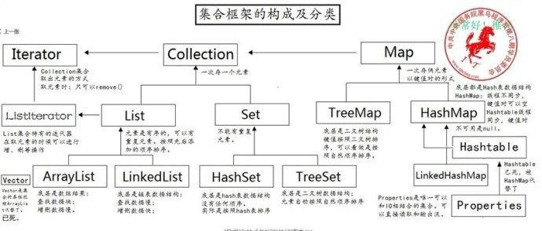
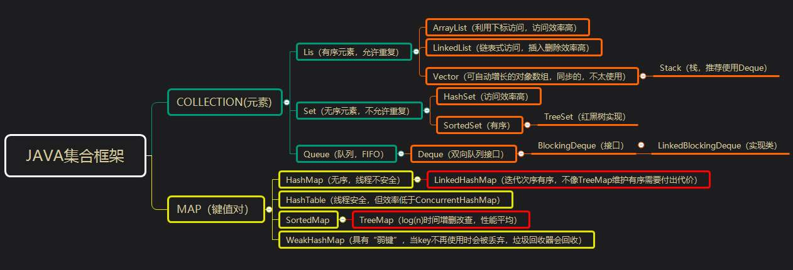
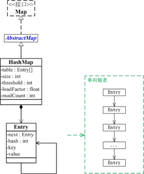
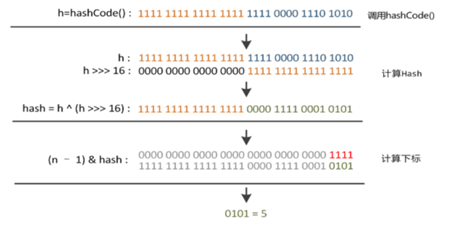
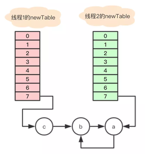
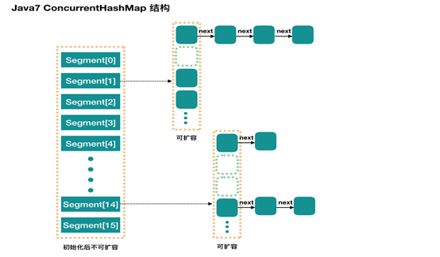
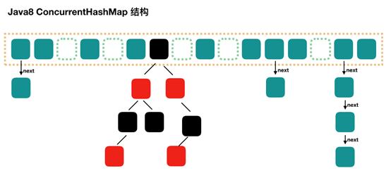

# 一、数组

## 定义

- 和C++不同，JAVA中的数组是一种引用数据类型，类似C/C++中的数组指针，内存分配在堆区。栈内存：存储局部变量（对一堆内存的引用地址）；new开辟堆内存，供数组使用。

- 数组长度不要求一定是常量，但是一旦创建了数组，就不能再改变它的大小。
- 方法区 ：本地方法区 (和系统相关)  寄存器 (给CPU使用) 

- JAVA中，数组可用for each循环：for(变量:数组名)执行语句（JAVA 5支持）。

- 其中collection必须是一个数组或者是一个实现了Iterable接口的类对象。

- JAVA中，允许长度为0的数组，和null不同。

- JAVA中，支持不规则二维数组，对每行的元素进行单独分配。

- 数组的引用传递：如果反复对数组本身做了修改，修改结果也保存下来。

- 数组排序：JAVA.util.Arrarys.sort(数组)

 

**如何实现数组和 List 之间的转换？**

- List转换成为数组：调用ArrayList的toArray方法
- 数组转换成为List：调用Arrays的asList方法，返回的是一个固定长度的List集合，不是ArrayList，也不是Vector


# 二、JAVA集合类

> **JAVA集合类存放于 JAVA.util 包中，是一个用来存放对象的容器**
>
> **注意：**
>
> ①集合只能存放对象。比如你存一个 int 型数据1放入集合中，其实它是自动转换成 Integer 类后存入的，JAVA中每一种基本类型都有对应的引用类型。
>
> ②集合存放的是多个对象的引用，对象本身还是放在堆内存中。
>
> ③集合可以存放不同类型，不限数量的数据类型。






**为什么集合类没有实现`Cloneable`和`Serializable`接口?**

- `Cloneable`接口是用于浅克隆，而`Serializable`接口是用于深克隆，标识性接口，之所以用到克隆，有时需要把对象信息保存到本地磁盘，防止在传输时出现乱序，而容器没有这个必要，只是用来存储数据

- 克隆（cloning）或者序列化（serialization）的语义和含义是跟具体的实现相关的。因此应该由集合类的具体实现类来决定如何被克隆或者序列化


**对象排序接口：Comparable接口和Comparator接口有什么区别？**

- 前者简单，但是如果需要重新定义比较类型时，需要修改源代码
- 后者不需要修改源代码，自定义一个比较器，实现自定义的比较方法。

 

## Collection集合

### 顶层接口

- 自动装箱：自动装箱就可以简单的理解为将基本数据类型封装为对象类型，来符合JAVA的面向对象。 自动将基本数据类型转化为对应的封装类型。

- 为了加大对简单数字的重利用，JAVA定义：在自动装箱时对于值从–128到127之间的值，它们被装箱为Integer对象后，会存在内存中被重用，**始终只存在一个对象**。而如果超过了从–128到127之间的值，被装箱后的Integer对象并不会被重用，即相当于每次装箱时都新建一个 Integer对象；明白了吧。

- 集合迭代： 发现Collection的源码中继承了Iterable，有iterator()这个方法，Collection接口继承了Iterator接口。（每个集合都不一样，让他们自己实现，这既是玩什么是接口）

  - 在ArrayList下找到了iterator实现的身影：它是在ArrayList以内部类的方式实现的。

  - Iterator 接口：除了 map 系列的集合，即左边集合都实现了 Iterator 接口，这是一个用于遍历集合中元素的接口，主要hashNext()，next()，remove()三种方法. 也就是说如果实现 Iterator 接口，那么在遍历集合中元素的时候，只能往后遍历，被遍历后的元素不会再被遍历到

  - Listlerator（双向输出）

    Iterator 的子接口 ListIterator 在它的基础上又添加了三种方法，分别是add(),previous(),hasPrevious()


### Collections

> Collections 是一个包装类。它包含有各种有关集合操作的静态多态方法。此类不能实例化，就像一个工具类，服务于JAVA的Collection框架。

1. sort方法的使用（对集合进行排序,默认按照升序排序，实现Comparable接口）: Collections.sort(list)

2. reverse方法的使用（对集合中元素进行反转）: Collections.reverse(list)

3. shuffle方法的使用（对集合中元素进行随机排序）:

4. swap(List list,int i,int j)方法的使用（交换集合中指定元素索引未知的元素）: List<String> list = Arrays.asList("a b c d e f".split(" "));

5. binarySearch(Collection,Object)方法的使用（查找指定集合中的元素，返回所查找元素位置的索引）


### List、Set和Map的初始容量和加载因子

1. List

- `ArrayList`的初始容量是10；加载因子为0.5； 扩容增量：原容量的 0.5倍+1；一次扩容后长度为15。直接确定容量，不进行扩容。（`JDK 1.7饿汉模式，初始化10；1.8中懒汉模式，初始为0，当有一个元素时初始为10`）
- Vector初始容量为10，加载因子是1。扩容增量：原容量的 1倍，如 Vector的容量为10，一次扩容后是容量为20。

2. Set

   `HashSet`，初始容量为16，加载因子为0.75； 扩容增量：原容量的 1 倍； 如`HashSet`的容量为16，一次扩容后容量为32

3. Map

   `HashMap`，初始容量16，加载因子为 0.75； 扩容增量：原容量的 1 倍； 如`HashMap`的容量为16，一次扩容后容量为32

 

## List集合

Collection接口

  子类：

  |--List接口：有序

​    子类：

​	|--`ArrayList`：数组结构，非线程安全，查询较快，增删较慢。

​    |--`LinkedList`：双向链表结构，非线程安全，增删较快，查询较慢（按序号索引数据需要进行向前或向后遍历）。

​    |--`Vector`：数组结构，线程安全，效率较低，被`ArrayList`替代。`Vector`是扩展1倍。

​		子类：

​        |--`Stack`：栈


**注意**

1. List是接口，`ArrayList`是实现类。

2. List集合的特点就是：有序(存储顺序和取出顺序一致),可重复

3. 一般使用多态的方式创建集合，如：`List<E> list = new ArrayList<E>();`这样使得集合具有更高的适用性。

4. List中又有它自己对应的实现-->`ListIterator`接口：`ListIterator`可以往前遍历，添加元素，设置元素

 

### vector机制

初始默认长度都为10。

Vector中的public方法多数添加了synchronized关键字、以确保方法同步

vector中数据的随机存取效率很高，O(1)的时间的复杂度，但是在vector 中随机插入元素，需要移动的元素数量较多，效率比较低。

 

### ArrayList集合

> **ArrayList底层其实就是一个数组**，ArrayList可以存储异构对象，而Array只能存储相同数据类型的数据。Array不能随意添加、删除；而ArrayList可以在任意位置插入和删除。

 

**add方法：**

1. 直接后插入
2. 如果想在数组的**任意位置插入元素**，我们需要建立一个新的数组，将插入位置前面的元素拷贝到新数组中，将插入位置后面的元素的下标都后移一位，将插入位置腾出

**ArrayList并发add()可能出现数组下标越界异常，size++，自增是个非原子操作**


**同步：**
如果想要ArrayList实现同步，可以使用Collections的方法：`List list = Collections.synchronizedList(new ArrayList(...));`，就可以实现同步了


**注意：** 

- ArrayList是基于动态数组实现的，在增删时候，需要数组的拷贝复制。

- 删除元素时不会减少容量，若希望减少容量则调trimToSize()

- 它不是线程安全的。它能存放null值。
- **remove(index)：返回删除的值**

 

### LinkedList集合

既可以用List，又可以用Queue接口

**特点**

- 是List接口的实现类，**双向链表结构**，所以增删效率较高，可以用以实现队列或栈的数据结构。
- LinkedList动作特点均可以围绕头和尾展开。
- LinkedList变量就这么几个，因为我们操作单向链表的时候也发现了：有了头结点，其他的数据我们都可以获取得到了。(双向链表也同理)
- set方法和get方法其实差不多，根据下标来判断是从头遍历还是从尾遍历
- List Iterator 实现了 Iterator 接口，并包含其他的功能

 

**Queue：**

> 在队列这种数据结构中，最先插入的元素将是最先被删除的元素；反之最后插入的元素将是最后被删除的元素，因此队列又称为“先进先出”（FIFO—first in first out）的线性表。

 

### CopyOnWriteArrayList（写加锁）

> 与 Vector一样，CopyOnWriteArrayList也可以认为是ArrayList的线程安全版，不同之处在于 CopyOnWriteArrayList在写操作时会先复制出一个副本，在新副本上执行写操作，然后再修改引用。这种机制让 CopyOnWriteArrayList可以对读操作不加锁，这就使CopyOnWriteArrayList的读效率远高于Vector。 

CopyOnWriteArrayList的理念比较类似读写分离，适合读多写少的多线程场景。但要注意，CopyOnWriteArrayList只能保证数据的最终一致性，并不能保证数据的实时一致性，如果一个写操作正在进行中且并未完成，此时的读操作无法保证能读到这个写操作的结果。

 

### ArrayList,Vector, LinkedList的存储性能和特性

ArrayList和Vector都是使用**数组方式**存储数据，此数组元素数大于实际存储的数据以便增加和插入元素，它们都允许直接按序号索引元素，但是插入元素要涉及数组元素移动等内存操作，所以索引数据快而插入数据慢，**Vector由于使用synchronized方法（线程安全）**，通常性能上较ArrayList差。

而LinkedList使用**双向链表**实现存储，按序号索引数据需要进行前向或后向遍历，但是插入数据时只需要记录本项的前后项即可，所以**插入速度较快**，因为 ArrayList 要移动数据。**LinkedList 同时要移动指针**

 

## Set集合

> Set集合的方法和Collection集合的方法几乎一致。只是更严格了。元素不可重复
>

 

**特点**

- Set集合中的元素是唯一的，不可重复（取决于hash Code和equals方法），也就是说具有唯一性。
- Set集合中元素不保证存取顺序，并不存在索引。

  

**继承关系**

Collection
	子类：
   |--Set：元素唯一，不保证存取顺序，只可以用迭代器获取元素。
		子类：
		|--HashSet：哈希表结构，非线程安全，查询速度较快。元素唯一性取决于hashCode和equals方法。
				子类：
					|--LinkedHashSet：带有双向链表的哈希表结构，非线程安全，保持存取顺序，保持了查询速度较快特点。
        |--Tree Set：平衡排序二叉树（红黑树）结构，非线程安全，按自然排序或比较器存入元素以保证元素有序。元素唯一性取决于ComparaTo方法或Comparator比较器。


### HashSet集合

> 原理：HashSet底层由HashMap实现，只不过我们HashSet是实现了Set接口并且把数据作为K值，而V值一直使用一个相同的虚值来保存。
>
> 并且在HashMap中如果K/V相同时，会用新的V覆盖掉旧的V，然后返回旧的V，那么在HashSet中执行这一句话始终会返回一个false，导致插入失败，这样就保证了数据的不可重复性；


**特点**

- 元素具有唯一性，取决于hashCode和equals方法。
- 元素不保证存取顺序。输入输出不一定一样
- 由于采用哈希表数据结构，所以查询较快。
- JAVA默认的散列单元大小全部都是2的幂，初始值为16（2的4次幂）。
- 假如16条链表中的75%链接有数据的时候，则认为加载因子达到默认的0.75。
- 与List一样，建议使用多态的方式，创建HashSet集合并使用Set接口方法。

 

1. 为啥要用HashSet?

   假如我们现在想要在一大堆数据中查找X数据。LinkedList的数据结构就不说了，查找效率低的可怕。ArrayList哪，如果我们不知道X的位置序号，还是一样要全部遍历一次直到查到结果，效率一样可怕。HashSet天生就是为了提高查找效率的。

2. hashCode 散列码

   散列码是由对象导出的一个整数值。**在Object中有一个hashCode方法来得到散列码。**基本上，每一个对象都有一个默认的散列码，**其值就是对象的内存地址**。但也有一些对象的散列码不同，比如**String对象，它的散列码是对内容的计算结果。**

3. 关于hashCode和equals方法

   在以哈希表为数据结构的容器中，其存放地址取决于hashCode方法计算的值，如果hashCode的值相同，则用equals方法判断是否相同，如果都相同则判定为相同元素。

   在以哈希表为数据结构的容器使用过程中，已经加入的元素不可以变更hashCode方法所依赖的域的值，否则会导致元素hashCode值已变化，但是其在容器中的位置却没有变化，后果是接下来的remove等操作将因为无法找到该元素而移除失败，进一步导致内存泄露

4. HashSet不能重复存储equals相同的数据 。原因就是equals相同，数据的散列码也就相同（hashCode必须和equals兼容）

 

**HashSet如何add机制，与查找效率**

- 假如我们有一个数据(散列码76268)，而此时的HashSet有128个散列单元，那么这个数据将有可能插入到数组的第108个链表中(76268%128=108)

- 知道了HashSet的add机制后，查找的道理一样。直接根据数据的散列码和散列表的数组大小计算除余后，就得到了所在数组的位置，然后再查找链表中是否有这个数据即可


### TreeSet集合

TreeSet集合是SortedSet接口（继承自Set）的实现类，确保有序

底层使用红黑树结构存储数据

**特点**

- 元素具有唯一性，自然排序，取决于`Comparable.comparaTo`方法或比较器Comparator。（自定义类）
- 元素不保证存取顺序。输入无序，输出有序（String）。
- 由于采用平衡排序二叉树，所以保存的元素均有序。
- 与List一样，建议使用多态的方式，创建TreeSet集合并使用Set接口方法。
- 创建TreeSet集合时，必须保证元素(对象的类)已经实现Comparable接口或者传入比较器Comparator。

 

## Map集合

> Map<K, V>集合是一个接口，和Collection集合不同的是，它是双列集合，也就是说它所存储的是键值对。
>

 

**继承关系**

Map
  |--Hashtable：哈希表结构，不保证存取顺序，不允许null键或者null值，线程安全，效率较低，已被HashMap替代
      |--Properties：键值对均是String类型的Map集合，包括直接对流操作的方法，专为配置文件而生。
  |--HashMap：哈希表结构，不保证存取顺序，允许null键和null值，非线程安全，效率较高。
      |--LinkedHashMap：带双向链表的哈希表结构，保持存取顺序，允许null键和null值，非线程安全，效率较高。
  |--TreeMap：平衡排序二叉树（红黑树）结构，按自然排序或比较器存入元素以保证元素有序，非线程安全。 元素唯一性取决于ComparaTo方法或Comparator比较器。


**特点**

- Map集合存储的是键值对，其中键要求唯一
- Map集合的键对应一个值，HashSet存放，值不要求唯一，但是一个键不能对应对个值。
- Map集合没有Iterator迭代器，如果需要迭代需要转化为单列集合间接迭代。

- 获取entrySet（包含所有键值对的Map对象的Set集合）

```java
Set<Map.Entry<String, String>> entrySet = map.entrySet();
  for (Entry<String, String> entry : entrySet) {
   String entryKey = entry.getKey();
   String entryValue = entry.getValue(); 
   }
Iterator<Map.Entry<String, String >> iter= entrySet. Iterator();
```

 

### Hashtable

- 底层数组+链表实现，**无论key还是value都不能为null，线程安全**，实现线程安全的方式是在修改数据时锁住整个Hashtable，效率低，ConcurrentHashMap做了相关优化
- **初始size为11**，扩容：newsize = oldsize*2+1

 

Hashtable是用**synchronized来修饰方法达到线程安全**。

 

ConcurrentHashMap分离锁思想

**Hashtable直接使用对象的hashCode**

 

Hashtable继承自Dictionary类，而HashMap继承自AbstractMap类。

 

### HashMap

> HashMap 是一个散列表，它存储的内容是键值对(key-value)映射。
>
> 1.7： Entry数组+链表；1.8： Node数组（Hash+key+value+Next）+链表+红黑树



**特点**

- **HashMap 继承于AbstractMap**，实现了Map、Cloneable、java.io.Serializable接口

- key、value都**可以为null**，它不是线程安全的。

- HashMap的基础就是一个线性数组，这个数组就是Entry[]，首先HashMap里面实现一个**静态内部类Entry**，其重要的属性有 *key , value, next*。

  - Entry 包含四个属性：key, value, hash 值和用于单向链表的 next。

    而Entry实际上就是**一个单向链表**。哈希表的key-value键值对都是存储在Entry数组中的。

    如果**链表长度超过阀值( TREEIFY THRESHOLD==8)，就把链表转成红黑树**，链表长度**低于6**，就把红黑树转回链表。**泊松分布**，到8的概率极小。O（n/2）；O（log（n）。6的时候红黑树也比链表快，因为要转换时间。8和6不一样，是避免来回的切换。

- **hashCode()用来定位要存放的位置，equals()用来判断是否相等。** 如果不重写，两个不同的键可能会有相同的hash值，因此可能会被集合认为是相等的。 

  当我们认为判定equals的相等应该是逻辑上的相等**而不是只**判断是不是内存中的同一个东西的时候，我们就应该重写equals()。
  
  

**原理**

当数组长度为2的n次幂的时候，HashMap源码中有一个indexFor方法，返回的是key的hashcode跟初始容量-1做与运算。通过 h&(length-1)的时候，相当于对length取模，这样便保证了散列的均匀，同时也提升了效率；length-1，最后一位为1，计算位置可能为奇数偶数。

只要h对应的最左边的那一个差异位为0，就能保证得到的新的数组索引和老数组索引一致(大大减少了之前已经散列良好的老数组的数据位置重新调换

 

**添加元素（put）**

- 如果添加元素的key不为null。则先获取该对象的hashCode，然后对这个对象做hash操作。 接着通过将得到的hash值与HashMap的entry数组长度-1做与操作。得到应当存放数组的位置。（通过hashCode()计算出的哈希值**可能不在数组大小范围内**，进而无法匹配存储位置；）

- 但是这也可能会出现key不同，但是存放的数组位置相同（**bucket）**，这被称为hash碰撞。因此HashMap采取的办法是拿到插入位置的对象，进行比较key值是否相同**（会调用keys.equals()方法去找到链表中正确的节点，最终找到要找的值对象）**。若是不同则向后遍历，直到找到相同的为止。找到后进行元素的替换，若是找不到就新生成一个Entry，entry对象的next指向上面获取的位置。 


**怎样线程安全？**

Collections类的**synchronizedMap方法**包装一下。使用ConcurrentHashMap，它使用分段锁来保证线程安全

 

**扩容**

- 最后一步为判断扩容，当数组容量超过最大容量时就会扩容一倍（即二进制的进位）
- 如果桶满了(容量16*加载因子0.75)，就需要 resize（**扩容2倍后重排）**。原数组中的数据必须重新计算其在新数组中的位置，并放进去，这就是resize。

- 使用随机哈希码,节点出现的频率在hash桶中**遵循泊松分布**，同时给出了桶中元素个数和概率的对照表。**当桶中元素到达8个的时候，概率已经变得非常小，**也就是说用**0.75作为加载因子**，每个碰撞位置的**链表长度超过８个是几乎不可能的。**


**红黑树**

之所以选择**红黑树是为了解决二叉查找树的缺陷**，二叉查找树在特殊情况下会变成一条**线性结构**。而红黑树在插入新数据后可能需要通过左旋，右旋、变色这些操作来保持平衡，引入红黑树就是为了查找数据快，解决链表查询深度的问题。

 

#### HashMap的死循环

> 归根结底，原因就是1.7链表新节点采用的是**头插法**，这样在线程一扩容迁移元素时，会将元素顺序改变，导致两个线程中**出现元素的相互指向**而形成循环链表，1.8采用了**尾插法**，从根源上杜绝了这种情况的发生。
>

多线程同时使用，**头插法abc变成cba；**



在调整大小时，存储在链表中的元素的次序会反过来，因为在放入新的位置时，HashMap会将Entry对象不断的插入链表的头部。

插入头部也主要是为了防止尾部遍历，否则这对key的HashCode相同的Entry每次添加还要定位到尾节点。如果条件竞争发送了，可能会出现环形链表，之后当我们get(key)操作时，就有可能发生死循环。

 

### TreeMap集合

**特点**

- HashMap的键保持唯一性，取决于hashCode以及equals方法
- TreeMap的键保持唯一性，取决于比较方法和比较器

 

TreeMap实现了SotredMap接口(源于Map接口)，它是有序的集合。而且是一个红黑树结构，每个key-value都作为一个红黑树的节点。如果在调用TreeMap的构造函数时没有指定比较器，则根据key执行自然排序。NavigableMap

 

### Properties集合

**特点**

- Properties集合表示了一个持久的属性集。
- Properties集合键值对均是String类型。
- Properties集合可以直接从一个流中读取数据，也可以直接保存到一个流中。
- 强烈建议Properties集合只存储String类型的数据，尽管可以利用其父类方法存储其他类型数据。

 

### ConcurrentHashMap（chm）

> ConcurrentHashMap 是一个 Segment 数组，Segment 通过继承 ReentrantLock 来进行加锁，所以每次需要加锁的操作锁住的是一个 segment，这样只要保证每个 Segment 是线程安全的，也就实现了全局的线程安全
>
> ConcurrentHashMap所使用的锁分段技术，首先将数据分成一段一段的存储，然后给每一段数据配一把锁，当一个线程占用锁访问其中一个段数据的时候，其他段的数据也能被其他线程访问。



1. 该类包含两个静态内部类 HashEntry 和 Segment ；前者用来封装映射表的键值对，后者用来充当锁的角色；
2. Segment 是一种可重入的锁 Reentrant Lock，每个 Segment 守护一个HashEntry 数组里得元素，当对 HashEntry 数组的数据进行修改时，必须首先获得对应的 Segment 锁。
3. ConcurrentHashMap 有 16 个 Segments，所以理论上，这个时候，最多可以同时支持 16 个线程并发写，只要它们的操作分别分布在不同的 Segment 上。
4. 其实每个 Segment 很像之前介绍的 HashMap，不过它要保证线程安全，所以处理起来要麻烦些
5. 都用了volatile 关键字修饰

 

**应用：多线程查询数据，put可能覆盖，或者hashmap的扩容可能产生死链**

 

**ConcurrentHashMap的Size方法是一个嵌套循环，大体逻辑如下：**

遍历所有的Segment。把Segment的元素数量累加起来。把Segment的修改次数累加起来。判断所有Segment的总修改次数是否大于上一次的总修改次数。如果大于，说明统计过程中有修改，重新统计，尝试次数+1；如果不是，说明没有修改，统计结束。如果尝试次数超过阈值，则对每一个Segment加锁，再重新统计。再次判断所有Segment的总修改次数是否大于上一次的总修改次数。由于已经加锁，次数一定和上次相等。释放锁，统计结束。

**为了尽量不锁住所有Segment，首先乐观地假设Size过程中不会有修改。当尝试一定次数，才无奈转为悲观锁，锁住所有Segment保证强一致性。**

**获取size属性的时候是估计值而不是准确值，但是操作就是线程安全的。**


 

**取而代之的是采用Node + CAS + Synchronized来保证并发安全进行实现**

## 原理

### 红黑树

散列表中已经提过了：如果桶数满的时候，JDK 8是将链表转成红黑树的~。并且，我们的**TreeSet、TreeMap**底层都是红黑树来实现的。

 

红黑树用的是也是两种方式来替代2-3树不断的节点交换操作：

- **旋转**：顺时针旋转和逆时针旋转
- **反色**：交换红黑的颜色
- 这个两个实现比2-3树交换的节点(合并，分解)要方便一些


红黑树为了保持平衡，还有制定一些约束，遵守这些约束的才能叫做红黑树：

1. 红黑树是二叉搜索树。

2. 根节点是黑色

3. 每个叶子节点都是黑色的空节点（NIL节点）

4. 每个红色节点的两个子节点都是黑色。(从每个叶子到根的所有路径上不能有两个连续的红色节点)

5. 从任一节点到其每个叶子的所有路径都包含相同数目的黑色节点(每一条树链上的黑色节点数量（称之为“黑高”）必须相等)。

 

### 散列表工作原理

无论是Set还是Map，我们会发现都会有对应的-->HashSet,HashMap

散列表**为每个对象计算出一个整数，称为散列码**。根据这些计算出来的整数(散列码)保存在对应的位置上！

在JAVA中，散列表用的是链表数组实现的，每个列表称之为桶。

一个桶上可能会遇到被占用的情况(**hashCode散列码相同**，就存储在同一个位置上)，这种情况是无法避免的，这种现象称之为：**散列冲突**

 

**哈希函数（Hash Function）压缩序列。就是公式。全数组空间太大，不合适存储**。

**在公式上表达就是key1≠key2，但f(key1)=f(key2)。**

- 此时需要用**该对象与桶上的对象进行比较**，看看该对象是否存在桶子上了~如果存在，就不添加了，如果不存在则添加到桶子上
- 当然了，如果hashcode函数设计得足够好，桶的数目也足够，这种比较是很少的~
- 在JDK 1.8中，桶满时会从链表变成平衡二叉树

如果散列表太满，是需要对散列表再散列，创建一个桶数更多的散列表，并将原有的元素插入到新表中，丢弃原来的表

- **装填因子(load factor)决定了何时对散列表再散列**
- 装填因子默认为0.75，如果**表中超过了75%的位置已经填入了元素，那么这个表就会用双倍的桶数自动进行再散列**

 

**解决冲突：**

**开放寻址法（threadlocalmap ）**的最简单的一种实现就是**线性探查（Linear Probing）**，步骤如下：

1. 当插入新的元素时，使用哈希函数在哈希表中定位元素位置；
2. 检查哈希表中该位置是否已经存在元素。如果该位置内容为空，则插入并返回，否则转向步骤 3。
3. 如果该位置为 i，则检查 i+1 是否为空，如果已被占用，则检查 i+2，依此类推，直到找到一个内容为空的位置。


**链接技术（hashmap）**是一种冲突解决策略（Collision Resolution Strategy）。在链接法中，把哈希到同一个槽中的所有元素都放到一个链表中。**（将所有哈希地址冲突的记录存储在同一个线性链表中）**

如果一个新的元素要被添加至哈希表中，将会被添加至其 Key 的哈希所对应的桶中。如果在相同位置已经有一个元素存在了，则将会将新元素添加到列表的前面。

 

**再HASH法。插入新的数据项的时间，随装填因子线性增长。**

 

###  “fail-fast，fail—safe”

**fail-fast**

它是 JAVA 集合的一种错误检测机制，当多个线程对集合进行结构上的改变的操作时，有可能会产生 fail-fast 机制。

例如 ：假设存在两个线程（线程 1、线程 2），线程 1 通过 Iterator 在遍历集合 A 中的元素，在某个时候线程 2 修改了集合 A 的结构（是结构上面的修改，而不是简单的修改集合元素的内容），那么这个时候程序就会抛出 Concurrent Modification Exception 异常，从而产生 fail-fast 机制。

原因： 迭代器在遍历时直接访问集合中的内容，并且在遍历过程中使用一个 modCount 变量。集合在被遍历期间如果内容发生变化，就会改变 modCount 的值。

每当迭代器使用 hashNext()/next() 遍历下一个元素之前，都会检测 modCount 变量是否为 expectedmodCount 值，是的话就返回遍历；否则抛出异常，终止遍历。

解决办法：

1. 在遍历过程中，所有涉及到改变 modCount 值得地方全部加上synchronized（多线程）
2. 使用 CopyOnWriteArrayList 来替换 ArrayList

 

**安全失败（fail—safe）**

采用安全失败机制的集合容器，在遍历时不是直接在集合内容上访问的，而是先复制原有集合内容，在拷贝的集合上进行遍历。

原理：由于迭代时是对原集合的拷贝进行遍历，所以在遍历过程中对原集合所作的修改并不能被迭代器检测到，所以不会触发Concurrent Modification Exception。

 

# JAVA泛型

> 泛型的本质是为了**参数化类型**（在不创建新的类型的情况下，通过泛型指定的不同类型来控制形参具体限制的类型）。也就是说在泛型使用过程中，操作的数据类型被指定为一个参数。
>
> 明确表明你要向集合中装入哪种类型的数据，无法加入指定类型以外的数据，以做到**数据类型安全**
>
> 将运行时期出现的问题**ClassCastException**，转移到了编译时期，方便于程序员能够更快发现问题，减少程序运行出错的概率。
>


**泛型是提供给JAVA编译阶段使用的技术。而在生成字节码文件时会进行类型擦除**

由于编译生成的字节码会去掉泛型的类型安全限制，只要能跳过编译器，就可以往某个泛型集合中加入其它类型的数据，**如用反射得到集合，再调用add方法即可**

 

## 了解泛型

ArrayList<E>类定义和ArrayList<Integer>类引用中涉及如下术语：

- 整个称为ArrayList<E>泛型类型

- ArrayList<E>中的E称为类型变量或类型参数

- 整个ArrayList<Integer>称为参数化类型

- ArrayList<Integer>中的Integer称为类型参数的实例或实际类型参数

- ArrayList<Integer>中的<>是“type of”

- ArrayList称为原始类型


**参数化类型与原始类型的兼容性：**

- 参数化类型引用一个原始类型的对象，编译时编译器通过，例如：`Collection<String> c = new Vector();`
- 原始类型引用一个参数化类型的对象，编译时编译器通过，例如：`Collection c = new Vector<String>();`


参数化类型**不考虑类型参数的继承关系**：

```java
Vector<String> v = new Vector<Object>();//错误，语法上不通过，从v中取出的对象当作String用，而v实际指向的集合中可以加入任意类型的对象
Vector<Object> v = new Vector<String>();//错误，语法上不通过，v中加入任意类型的对象，而v实际指向的集合中只能装String类型的对象
```


思考：下面的代码会报错吗？（**不会报错**）

```java
Vector v1 = new Vector<String>();//参数化类型的对象可以给原始类型的引用
Vector<Object> v=v1; 
```

**不能向上转型，子类的继承限制。一件商品不等于全部商品。**


```java
array.getClass().getMethod("add", Object.class).invoke(array, "asd");

XXX.getClass().getMethod(methodName,new Class[0]). invoke(Object receiver, Object... args);
```

如果使用泛型方法将整个类泛型化，那么就应该使用泛型方法。另外对于一个static的方法而已，无法访问泛型类型的参数。所以如果static方法要使用泛型能力，就必须使其成为泛型方法。

 

## 泛型类(为了参数化类型 )

> 通过泛型可以完成对一组类的操作对外开放相同的接口。在使用该类的时候创建对象时候确定的。
>

```java
public class Generic<T>{ //key这个成员变量的类型为T,T的类型由外部指定 
  private T key;
  public Generic(T key) { //泛型构造方法形参key的类型也为T，T的类型由外部指定
    this.key = key; 
    }
  public T getKey(){ //泛型方法getKey的返回值类型为T，T的类型由外部指定
    return key; 
    }
}

//传入的实参类型需与泛型的类型参数类型相同，即为Integer
Generic<Integer> genericInteger = new Generic<Integer>(123456);
Generic<String> genericString = new Generic<String>("key_vlaue");
```

**定义的泛型类，就一定要传入泛型类型实参么？**
并不是这样，在使用泛型的时候如果传入泛型实参，则会根据传入的泛型实参做相应的限制，此时泛型才会起到本应起到的限制作用。如果不传入泛型类型实参的话，在泛型类中使用泛型的方法或成员变量定义的类型可以为任何的类型。

```java
Generic generic2 = new Generic(55.55);
//泛型测试: key is 55.55;
Generic generic3 = new Generic(false); //泛型测试: key is false
```

 

## 方法泛型

> 修饰符 <声明自定义的泛型>返回值类型 函数名(使用自定义泛型 …){ }
>
> 声明一个泛型方法很简单，只要在**返回类型前面加上一个类似<K, V>**的形式就行了

**说明：**

- public 与 返回值中间<T>非常重要，可以理解为声明此方法为泛型方法。

- 只有声明了<T>的方法才是泛型方法，泛型类中的使用了泛型的成员方法并不是泛型方法。


```java
public class Util {
	public static <K, V> boolean compare(Pair<K,  V> p1, Pair<K, V> p2) {
		return  p1.getKey().equals(p2.getKey()) && p1.getValue().equals(p2.getValue());
		}  
	}  

public class Pair<K, V>{//类
	private K key;
	private V value;
	public  Pair(K key, V value){
	this.key  = key;
	this.value  = value; 
	} 
	public void setKey(K key) { 
	this.key = key; 
	} 
	public void setValue(V value) {
	this.value = value; 
	} 
	public  K getKey()  { 
	return key; 
	} 
	public  V getValue() {
	return value; 
	}
}
```


我们可以像下面这样去调用泛型方法：

```java
Pair<Integer, String> p1  = new Pair<>(1, "apple");
Pair<Integer, String> p2  = new Pair<>(2, "pear");
boolean same =  Util.<Integer, String>compare(p1, p2);
```


或者在JAVA 1.7/1.8利用type inference，让JAVA自动推导出相应的类型参数：

```java
Pair<Integer, String> p1  = new Pair<>(1, "apple");
Pair<Integer, String> p2  = new Pair<>(2, "pear");
boolean same = Util.compare(p1,  p2);
```

 

## 泛型接口

> **泛型接口与泛型类的定义及使用基本相同**。泛型接口常被用在各种类的生产器中。

```java
public interface Generator<T> {
	public T next();
	}

public class FruitGenerator implements Generator<String> {
  private String[] fruits = new String[]{"Apple", "Banana", "Pear"};
  @Override
  public String next() {
    Random rand = new Random();
    return fruits[rand.nextInt(3)]; 
  }
}
```


## 泛型通配符

> 同一种泛型可以对应多个版本（因为参数类型是不确定的），不同版本的泛型类实例是不兼容
>
> 类型通配符一般是使用？代替具体的类型实参，注意了，此处 ？是类型实参，而不是类型形参 。可以把？看成所有类型的父类。是一种真实的类型。
>


在了解通配符之前，我们首先必须要澄清一个概念，还是借用我们上面定义的Box类，假设我们添加一个这样的方法：

```java
public void boxTest(Box<Number> n){ 
/* ... */ 
}
```

 

那么现在Box<Number> n允许接受什么类型的参数？我们是否能够传入Box<Integer>或者Box<Double>呢？答案**是否定的**，虽然Integer和Double是Number的子类，但是在泛型中Box<Integer>或者Box<Double>与Box<Number>之间并没有任何的关系。这一点非常重要，接下来我们通过一个完整的例子来加深一下理解。

首先我们先定义几个简单的类，下面我们将用到它：

```
class Fruit {}  class Apple extends Fruit {}  class Orange extends Fruit {}
```

下面这个例子中，我们创建了一个泛型类Reader，然后在f1()中当我们尝试Fruit f = fruitReader.readExact(apples);编译器会报错，**因为List<Fruit>与List<Apple>之间并没有任何的关系。**

```java
public class GenericReading {
	static  List<Apple> apples = Arrays.asList(new Apple());
	static  List<Fruit> fruit = Arrays.asList(new Fruit());
	static  class Reader<T> { 
	T  readExact(List<T> list) {
	return  list.get(0); 
    } 
   }
   static  void f1() { 
   Reader<Fruit>  fruitReader = new Reader<Fruit>(); //  Errors: List<Fruit> cannot be applied to List<Apple>. 
   //  Fruit f = fruitReader.readExact(apples);
   }
   public  static void main(String[] args) {
   f1();
   }
}
```

但是按照我们通常的思维习惯，Apple和Fruit之间肯定是存在联系，然而编译器却无法识别，那怎么在泛型代码中解决这个问题呢？我们可以通过使用通配符来解决这个问题：

```
static class CovariantReader<T>  {
	T  readCovariant(List<? extends T> list) {
	return  list.get(0);
    }
} 
    static void f2() {
    CovariantReader<Fruit>  fruitReader = new CovariantReader<Fruit>();
    Fruit f  = fruitReader.readCovariant(fruit);
    Fruit a  = fruitReader.readCovariant(apples);
    }
    public static void  main(String[] args) {
    f2();
    }
```

这样就相当与告诉编译器， fruitReader的readCovariant方法接受的参数**只要是满足Fruit的子类就行**(包括Fruit自身)，这样子类和父类之间的关系也就关联上了。

 

## 泛型数组

**不能创建一个确切的泛型类型的数组**

```java
List<String>[] lsa = new List<String>[10]; // Not really allowed.

List<?>[] ls = new ArrayList<?>[10]; 
List<String>[] ls = new ArrayList[10]; // allowed.
```

为什么编译器不支持上面这样的做法呢？继续使用逆向思维，我们站在编译器的角度来考虑这个问题。

我们先来看一下下面这个例子：

```java
Object[] strings = new String[2];
strings[0] =  "hi";  // OK
strings[1] =  100;  // An ArrayStoreException is thrown.
```

对于上面这段代码还是很好理解，字符串数组不能存放整型元素，而且这样的错误往往要等到代码运行的时候才能发现，编译器是无法识别的。接下来我们再来看一下假设JAVA支持泛型数组的创建会出现什么后果：

```java
Object[] stringLists = new  List<String>[]; // compiler error, but pretend it's allowed
stringLists[0] = new  ArrayList<String>();  // OK  
stringLists[1] = new  ArrayList<Integer>(); // An ArrayStoreException  should be thrown, but the runtime can't detect it. 
```

假设我们支持泛型数组的创建，由于运行时期类型信息已经被擦除，JVM实际上根本就不知道`new ArrayList<String>()`和`new ArrayList<Integer>()`的区别。类似这样的错误假如出现才实际的应用场景中，将非常难以察觉。

 

如果你对上面这一点还抱有怀疑的话，可以尝试运行下面这段代码：

```java
public class  ErasedTypeEquivalence {    
	public  static void main(String[] args) {
	Class  c1 = new ArrayList<String>().getClass();
	Class  c2 = new ArrayList<Integer>().getClass();
	System.out.println(c1 == c2); // true
	} 
}
```

 

## 泛型上下边界

```java
public void showKeyValue1(
	Generic<? extends Number> obj){
	Log.d("泛型测试","key value is " + obj.getKey());
	}
}
```

- 以对于实现了<? extends T>的集合类，只能将它视为Producer向外提供(get)元素，而不能作为Consumer来对外获取(add)元素。

- 实现了<? super T>的集合类，只能将它视为Consumer向外提供(add)元素，而不能作为Producer来对外获取(get)元素。


**PECS原则**

”Producer Extends, Consumer Super”

1. “Producer Extends” – 需要一个只读List，用它来produce T，那么使用? extends T。

2. “Consumer Super” – 需要一个只写List，用它来consume T，那么使用? super T。

3. **如果需要同时读取以及写入，那么我们就不能使用通配符了**

 

 

## 泛型方法练习题

/**

   \* 1.编写一个泛型方法，自动将Object类型对象转换为其他类型

   \* @param <T>

   \* @param obj

   \* @return

   */

  private static <T> T autoConvert(Object obj){

​    return (T)obj;

  }

  /**

   \* 2.定义一个泛型方法，可以将任意类型的数组中的所有元素填充为相应类型的某个对象

   \* @param <T>

   \* @param array

   \* @param obj

   */

  private static <T> void fillArray(T[] array,T obj){

​    for(int i=0;i<array.length;i++){

​      array[i]=obj;

​    }

​    printArray(array);

  }

  /**

   \* 3.采用自定泛型方法的方式打印出任意参数化类型的集合中的所有内容

   \* @param <T>

   \* @param collection

   */

  private static <T> void printCollection(Collection<T> collection){

​    System.out.println(collection.size());

​    for(Object obj:collection){

​      System.out.println(obj);

​    }

  }

  /**

   \* 4.定义一个泛型方法，把任意参数类型的集合中的数据安全地复制到相应类型的数组中

   \* @param <T>

   \* @param srcCollection

   \* @param descArray

   */

  private static <T> void CollectionCopyToarray(Collection<T> srcCollection,T[] descArray){

​    Iterator<T> it = srcCollection.iterator();

​    int recordElementPostion=0;

​    while(it.hasNext()){

​      descArray[recordElementPostion]=it.next();

​      recordElementPostion++;

​    }

​    printArray(descArray);

  }

  /**

   \* 5.定义一个泛型方法，把任意参数类型的一个数组中的数据安全地复制到相应类型的另一个数组中去

   \* @param <T>

   \* @param srcArray

   \* @param descArray

   */

  private static <T> void srcArrayToDescArray(T[] srcArray,T[] descArray){

​    for(int i=0;i<srcArray.length;i++){

​      descArray[i]=srcArray[i];

​    }

​    printArray(descArray);

  }

  private static <T> void printArray(T[] array) {

​    for (T t : array) {

​      System.out.print(t + "\t");

​    }

}

 

package cn.itcast.day2;

import JAVA.lang.reflect.Method;

**通过反射获得泛型的实际类型参数**

/**

 \* 此类是用来演示如何通过反射获得泛型的实际类型参数

 \* Hibernate中的源代码就有这样的写法

 \* @author 孤傲苍狼

 \* 

 */

public class UseReflectGetGenericParameter {

  public static void main(String[] args) throws Exception {

​    /**

​     \* 通过这种方式得到的字节码中是没有办法得到泛型类的实际类型参数的，

​     \* 因为在编译这个泛型类时就已经把这个泛型类的实际参数给去掉了

​     \* Vector<Date> v = new Vector<Date>();

​     \* v.getClass();

​     */

​    Method applyMethod = UseReflectGetGenericParameter.class.getMethod(

​        "applyVector", Vector.class);

​    //得到泛型类型的参数化类型数组，Type类是Class类的父类

​    Type[] types = applyMethod.getGenericParameterTypes();

​    /**

​     \* ParameterizedType这个类是一个参数化类型类，types数组中存储的都是参数化类型的参数，

​     \* 这里取出第一个数组元素，并强制转换成ParameterizedType类型

​     */

​    ParameterizedType pType = (ParameterizedType) types[0];

​    System.out.println(pType.getRawType()/*得到原始类型，输出的结果为：class JAVA.util.Vector*/);

​    System.out.println(pType.getActualTypeArguments()[0]/*获得泛型的实际类型参数，输出的结果为：class JAVA.util.Date*/);

  }

  /**

   \* 利用反射可以得到这个方法的参数列表的类型

   \* 通过这个变量v是没有办法知道定义它的那个类型的

   \* 但是当把这个变量交给一个方法作为参数或者返回值去使用，

   \* Method类中提供了一系列方法可以获得方法的参数列表

   \* 并且是以泛型的那种形式来获得参数列表

   \* @param v

   */

  public static void applyVector(Vector<Date> v) {

  }

}

***泛型在静态方法和静态类中的问题\***
 public class Test2<T> {  

  public static T one;  //编译错误  

  public static T show(T one){ //编译错误  

  return null; }}

泛型类中的泛型参数的实例化是在定义***泛型类型对象（例如\******ArrayList<Integer>\******）\***的时候指定的，而静态变量和静态方法不需要使用对象来调用。对象都没有创建，如何确定这个泛型参数是何种类型，所以**当然是错误的**。

 

## 泛型相关面试题

***1. JAVA\******中的泛型是什么\*** ***?\*** ***使用泛型的好处是什么\******?\***
 泛型是一种**参数化类型的机制。**它可以使得代码适用于各种类型，从而编写更加通用的代码，例如集合框架。

泛型是一种编译时类型确认机制。它提供了编译期的**类型安全**，确保在泛型类型（通常为泛型集合）上只能使用正确类型的对象，避免了在运行时出现ClassCastException。

***2\******、\******JAVA\******的泛型是如何工作的\*** ***?\*** ***什么是类型擦除\*** ***?\***
 泛型的正常工作是依赖编译器在编译源码的时候，**先进行类型检查，然后进行类型擦除**并且在类型参数出现的地方插入**强制转换**的相关指令实现的。

编译器在编译时擦除了所有类型相关的信息，所以在运行时不存在任何类型相关的信息。例如List<String>在运行时仅用一个List类型来表示。为什么要进行擦除呢？这是为了避免**类型膨胀**。

 

***3.\*** ***什么是泛型中的限定通配符和非限定通配符\*** ***?\***
 限定通配符对类型进行了限制。有两种限定通配符，一种是<? extends T>它通过确保类型必须是T的子类来设定类型的上界，另一种是<? super T>它通过确保类型必须是T的父类来设定类型的下界。泛型类型必须用限定内的类型来进行初始化，否则会导致编译错误。另一方面<?>表示了非限定通配符，因为<?>可以用任意类型来替代。


***4. List<? extends T>\******和\******List <? super T>\******之间有什么区别\*** ***?\***
 这和上一个面试题有联系，有时面试官会用这个问题来评估你对泛型的理解，而不是直接问你什么是限定通配符和非限定通配符。这两个List的声明都是限定通配符的例子，List<? extends T>**可以接受任何继承自****T****的类型**的List，而List<? super T>**可以接受任何****T****的父类**构成的List。例如List<? extends Number>可以接受List<Integer>或List<Float>。在本段出现的连接中可以找到更多信息。


***5.\*** ***如何编写一个泛型方法，让它能接受泛型参数并返回泛型类型\******?\***
 编写泛型方法并不困难，你需要用泛型类型来替代原始类型，比如使用T, E or K,V等被广泛认可的类型占位符。泛型方法的例子请参阅JAVA集合类框架。最简单的情况下，一个泛型方法可能会像这样:


\1.      public V put(K key, V value) {

\2.        return cache.put(key, value);

\3.      }

 

***6. JAVA\******中如何使用泛型编写带有参数的类\******?\***
 这是上一道面试题的延伸。面试官可能会要求你用泛型编写一个类型安全的类，而不是编写一个泛型方法。关键仍然是使用泛型类型来代替原始类型，而且要使用JDK中采用的标准占位符。


 ***7.\*** ***编写一段泛型程序来实现\******LRU\******缓存\******?\***
 对于喜欢JAVA编程的人来说这相当于是一次练习。给你个提示，LinkedHashMap可以用来实现固定大小的LRU缓存，当LRU缓存已经满了的时候，它会把最老的键值对移出缓存。LinkedHashMap提供了一个称为removeEldestEntry()的方法，该方法会被put()和putAll()调用来删除最老的键值对。
 ***8.\*** ***你可以把\******List<String>\******传递给一个接受\******List<Object>\******参数的方法吗？\***
 对任何一个不太熟悉泛型的人来说，这个JAVA泛型题目看起来令人疑惑，因为乍看起来String是一种Object，所以List<String>应当可以用在需要List<Object>的地方，但是事实并非如此。真这样做的话会导致编译错误。如果你再深一步考虑，你会发现JAVA这样做是有意义的，因为List<Object>可以存储任何类型的对象包括String, Integer等等，而List<String>却只能用来存储Strings。


\1.      List<Object> objectList;

\2.      List<String> stringList;

\3.         

\4.      objectList = stringList; *//compilation error incompatible types*

***9. Array\******中可以用泛型吗\******?\***
 这可能是JAVA泛型面试题中最简单的一个了，当然前提是你要知道Array事实上并不支持泛型，这也是为什么Joshua Bloch在Effective JAVA一书中建议使用List来代替Array，因为**List****可以提供编译期的类型安全保证，而****Array****却不能。**
 ***10.\*** ***如何阻止\******JAVA\******中的类型未检查的警告\******?\***
 如果你把泛型和原始类型混合起来使用，例如下列代码，JAVA 5的JAVAc编译器会产生类型未检查的警告
 ，例如List<String> rawList = new ArrayList()
 注意: Hello.JAVA使用了未检查或称为不安全的操作;
 这种警告可以使用@SuppressWarnings("unchecked")注解来屏蔽。

***11\******、\******JAVA\******中\******List<Object>\******和原始类型\******List\******之间的区别\******?\***
 原始类型和带参数类型<Object>之间的主要区别是，***在编译时编译器不会对原始类型进行类型安全检查\***，却会对带参数的类型进行检查，通过使用Object作为类型，可以告知编译器该方法可以接受任何类型的对象，比如String或Integer。这道题的考察点在于对泛型中原始类型的正确理解。它们之间的第二点区别是，你可以把任何带参数的泛型类型传递给接受原始类型List的方法，**但却不能把****List<String>****传递给接受****List<Object>****的方法**，因为会产生编译错误。

***12\******、\******JAVA\******中\******List<?>\******和\******List<Object>\******之间的区别是什么\******?\***
 这道题跟上一道题看起来很像，实质上却完全不同。List<?> 是一个未知类型的List，而List<Object>其实是任意类型的List。你可以把List<String>, List<Integer>赋值给List<?>，**却不能把****List<String>****赋值给****List<Object>****。**  

1. List<?> listOfAnyType;

2. List<Object> listOfObject = new ArrayList<Object>();

3. List<String> listOfString = new ArrayList<String>();

4. List<Integer> listOfInteger = new ArrayList<Integer>();

5. 

6. listOfAnyType = listOfString; *//legal*

7. listOfAnyType = listOfInteger; *//legal*

8. listOfObjectType = (List<Object>) listOfString; *//compiler error - in-convertible types*

13、List<String>和原始类型List之间的区别
 该题类似于“原****始类型和带参数****类型之间有什么区别”。带参数类型是类型安全的，而且其类型安全是由编译器保证的，但原始类型List却不是类型安全的。你不能把String之外的任何其它类型的Object存入String类型的List中，而你可以把任何类型的对象存入原始List中。使用泛型的带参数类型你不需要进行类型转换，但是对于原始类型，你则需要进行显式的类型转换。

1. List listOfRawTypes = new ArrayList();

2. listOfRawTypes.add("abc");

3. listOfRawTypes.add(123); *//**编译器允许这样* *-* *运行时却会出现异常*

4. **String item = (String) listOfRawTypes.get(0); \*//\******需要显式的类型转换\***

5. item = (String) listOfRawTypes.get(1); *//**抛**ClassCastException**，因为**Integer**不能被转换为**String*

7. List<String> listOfString = new ArrayList();

8. listOfString.add("abcd");

9. listOfString.add(1234); *//**编译错误，比在运行时抛异常要好*

10. item = listOfString.get(0); *//**不需要显式的类型转换* *-* *编译器自动转换*

 

 

 

 