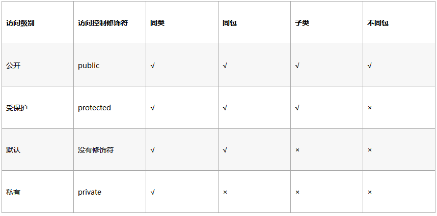
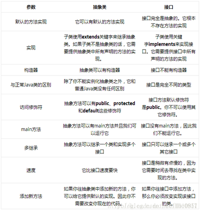
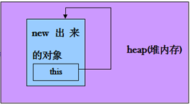
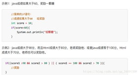
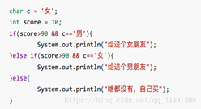

## Java 1.8

1. default关键字：在接口里面定义具体的方法实

2. **Lambda** **表达式**：函数式编程

3. 函数式接口：仅**只包含一个抽象方法的接口**，每一个该类型的**lambda**表达式都会被匹配到这个抽象方法

4. 方法与构造函数引用：方法的名称放在后面，即ClassName :: methodName 。Lambda表达式

5. 局部变量限制：Lambda表达式也允许使用自由变量（不是参数，而是在外层作用域中**定义的变量**），就像匿名类一样。 它们被称作捕获Lambda。 Lambda可以没有限制地捕获（也就是在其主体中引用）实例变量和静态变量。但局部变量必须显式声明为final，或事实上是final

6. Date Api更新

7. 流：Stream 就如同一个迭代器（Iterator），单向，不可往复，数据只能遍历一次

   Stream 是对**集合（Collection）对象功能的增强**，对集合对象进行各种非常便利、高效的聚合操作（aggregate operation），或者大批量数据操作 (bulk data operation)。 

## 序列化

> 简单说就是为了保存在内存中的各种对象的状态，并且可以把保存的对象状态再读出来。
>
> **序列化**就是一种用来处理对象流的机制，**所谓对象流也就是将对象的内容进行流化。**可以对流化后的对象**进行读写操作**，也可将流化后的对象传输于网络之间。序列化是为了解决在对对象流进行读写操作时所引发的问题。


**序 列 化 的 实 现 **

将 需 要 被 序 列 化 的 类 **实 现 Serializable 接 口** ， 该 接 口 没 有 需 要 实 现 的 方 法 ， implements Serializable 只是为了标注该对象是可被序列化的，然后使用一个输出流(如：FileOutputStream)来构造 一个**ObjectOutputStream(对象流)**对象，接着，使用 ObjectOutputStream 对象的 writeObject(Object obj)方法就以将参数为 obj 的对象写出(即保存其状态)，要恢复的话则用输入流。


**不能序列化情况：**

- 被static、transient（表示临时数据）修饰的成员不能被序列化。
- 至于RPC框架，无非就是序列化与反序列化+网络通信

**作用：**

1. 一旦变量被transient修饰，变量将不再是对象持久化的一部分，该变量内容在序列化后无法获得访问。 
2. transient关键字只能修饰变量，而不能修饰方法和类。注意，本地变量是不能被transient关键字修饰的。变量如果是用户自定义类变量，则该类需要实现Serializable接口。 
3. 一个静态变量不管是否被transient修饰，均不能被序列化。 

**被static修饰的变量应该也是不会被序列化的，因为只有堆内存会被序列化。所以静态变量天生不会被序列化。**


**serialVersionUID作用**   

>
> 序列化时为了**保持版本的兼容性**，即在版本升级时反序列化仍保持对象的唯一性。 

## 修饰符

1. **类修饰符**
    访问修饰符：公共类修饰符public
    非访问控制符：抽象类修饰符 abstract 、最终类修饰符 final
  - 公共类修饰符 public ： Java 语言中类的访问控制符只有 public 即公共的。每个 Java 程序的有且只有一个类是 public，它被称为主类 ，其他外部类无访问控制修饰符，具有包访问性。注意：一个类的内部类可以被其他访问控制修饰符protected、default、private修饰，相当于类的成员。
  - 抽象类修饰符 abstract ：用 abstract 修饰符修饰的类，被称为抽象类。
  - 最终类修饰符 final ：当一个类不能被继承时可用修饰符 final修饰为最终类。被定义为 final 的类通常是一些有固定作用、用来完成某种标准功能的类。
  - **类缺省访问控制符**：
    如果一个类没有访问控制符，说明它具有缺省的访问控制符特性。此时，**这个类只能被同一个包中的类访问或引用。**这一访问特性又称为包访问性。

  

2. **方法修饰符**
   访问控制修饰符：共访问控制符public、保护访问控制符protected、缺省默认default、私有访问控制符private
   非访问控制符：抽象方法控制符abstract 、静态方法控制符static 、最终方法控制符final 、本地方法控制符native 、同步方法控制符synchronized
- 抽象方法控制符 abstract ：用修饰符 abstract 修饰的方法称为抽象方法。抽象方法仅有方法头，没有方法体和操作实现。
   - 静态方法控制符 static ：用修饰符 static 修饰的方法称为静态方法。**静态方法是属于整个类的类方法**；而不使用static 修饰、限定的方法是属于某个具体类对象的方法。 由于 static方法是属于整个类的，所以它不能操纵和处理属于某个对象的成员变量，而只能处理属于整个类的成员变量，即 static 方法只能处理 static的域。
   - 最终方法控制符 final ：用修饰符 final修饰的方法称为最终方法。最终方法是功能和内部语句不能更改的方法，即最终方法不能重写覆盖。final固定了方法所具有的功能和操作，防止当前类的子类对父类关键方法的错误定义，保证了程序的安全性和正确性。所有被 private 修饰符限定为私有的方法，以及所有包含在 final 类 ( 最终类) 中的方法，都被认为是最终方法。
   - 本地方法控制符 native ：用修饰符 native 修饰的方法称为本地方法。为了提高程序的运行速度，需要用其它的高级语言书写程序的方法体，那么该方法可定义为本地方法用修饰符 native 来修饰。
   - 同步方法控制符 synchronized ：该修饰符主要用于多线程程序中的协调和同步。
   - 变量修饰符


3. **变量修饰符**

   访问控制符：公共访问控制符public 、保护访问控制符protected 、缺省默认访问控制符default、私有访问控制符private 
   非访问控制符：静态域修饰符static 、最终域修饰符 final 、易失 ( 共享 ) 域修饰符volatile 、暂时性域修饰符transient

   - 公共访问控制符 public ：用 public 修饰的域称为公共域。由于 public 修饰符会降低运行的安全性和数据的封装性，所以一般应减少 public 域的使用。
   - 私有访问控制符 private ： 用 private 修饰的成员变量 ( 域 ) **只能被该类自身所访问**，而不能被任何其它类 ( 包括子类 ) 所引用。
   - 保护访问控制符 protected ：用 protected 修饰的成员变量可以被三种类所引用：①该类自身；②同一个包中的其它类；③其它包中的子类。使用修饰符 protected 的主要作用是允许其它包中的子类来访问父类的特定属性。
   - 缺省默认修饰符 ：没有访问控制修饰符或用修饰符 default修饰的成员变量可以被该类本身或同一包中的其他类访问。
   - 静态域修饰符 static ：用 static修饰的成员变量仅属于类的变量，而不属于任何一个具体的对象，静态成员变量的值是保存在类的内存区域的公共存储单元，而不是保存在某一个对象的内存区间。该类的任一对象访问它时取到的都是相同的数据；该类的任一对象修改它时 , 也都是对同一个内存单元进行操作。
   - 最终域修饰符 final ：最终域修饰符 final 是用来定义常量的。一个类的域 ( 成员变量 ) 如果被修饰符 final 说明，则它的取值在程序的整个执行过程中都是不变的。
   - 易失 ( 共享 ) 域修饰符 volatile ：易失 ( 共享 ) 域修饰符 volatile是用来说明这个成员变量可能被几个线程所控制和修改。也就是说在程序运行过程中，这个成员变量有可能被其它的程序影响或改变它的取值。通常 volatile 用来修饰接受外部输入的域。
   - 暂时性域修饰符 transient ：暂时性域修饰符 transient 用来定义一个暂时性变量。其特点是：用修饰符transient 限定的暂时性变量，将指定 Java虚拟机认定该暂时性变量不属于永久状态，以实现不同对象的存档功能。否则，类中所有变量都是对象的永久状态的一部分，存储对象时必须同时保存这些变量。


4. java中访问修饰符public,private,protected,以及**默认default**时的区别： 

   default：存在与switch和default关键字在接口中修饰方法时，方法可以有方法体

   
   

## 数据类型

Java是一种**强类型**的语言。这意味着必须为每一个变量都声明一种类型。

> **基本类型有八种：**
> 整型 （4种）字符型 （1种）浮点型 （2种）布尔型（1种）
>
> **引用型数据类型：**
> 类（class）、接口（interface）、数组；

 **String是类类型，不是基本类型。**


**设计原因：**

然而，在Java8中的**8种基本数据类型不是对象**，之所以这样设计，是因为相对于对象来说，基本数据在使用上更加方便，并且在效率上也高于对象类型。**这个变量直接存储“值”并置于常量区中。**

 

**容量大小：**

**（byte，short，char<int<long<float<double:强制转换）：精度越大**

byte，short，char计算时，先转换为INT

 

byte最大值是127在计算机中表示为01111111**加1**后变为10000000此时是补码。


**丢失精度：** 

字面量属于 double 类型，不能直接将 1.1 直接赋值给 float 变量，因为这是向下转型。

```java
float f = 1.1;
```

 

**隐式类型转换：**

因为字面量 1 是 int 类型，它比 short 类型精度要高，因此不能隐式地将 int 类型下转型为 short 类型。

```java
short s1 = 1;
// s1 = s1 + 1;
//但是使用 += 或者 ++ 运算符可以执行隐式类型转换。
s1 += 1;
// s1++;
//上面的语句相当于将 s1 + 1 的计算结果进行了向下转型：
s1 = (short) (s1 + 1); 
```


### 整型

- byte   1字节

- short  2字节

- int   4字节（默认）

- long   8字节（32位系统为4）


1. **Java中，整型的范围与运行Java代码的机器无关，也就是说，不管在哪个机器上，int类型都是32位数据。**

2. 前后缀：

   后缀L  长整型数值

   前缀0x  十六进制数

   前缀0  八进制数（不推荐使用）

   前缀0b  二进制数（Java7支持）

3. Java中没有任何的无符号类型

 

### 浮点类型

- float  4字节

- double 8字节（默认）


1. 前后缀：

   后缀F单精度浮点数

2. 特殊值：正无穷大，负无穷大，NaN（不是一个数）。比如一个正整数除以0得到正无穷大，0除以0得到NaN。

3. 浮点数不适用于禁止出现舍入误差的计算中，如果需要，**应该使用BigDecimal类。**


**浮点值间隙：** 

**二进制所能表示的两个相邻的浮点值之间存在一定的空隙。**

浮点值越大，这个间隙也会越大。当浮点值大道一定程度的时，如果对浮点值的改变很小（例如上面的30000000+1），就不足以使浮点值发生改变。就好比蒸发掉大海中的一滴水，大海还是大海，几乎不存在变化。**如果想要准确的存储，就去使用BigDecimal**

 

**4.0-3.6=0.40000001这种现象？**

二进制的小数无法精确的表达10进制小数，计算机在计算10进制小数的过程中要先转换为2进制进行计算，这个过程中出现了误差。就像十进制无法精确表达1/3一样，二进制也无法精确表达1/10。

> 十进制转二进制的方法：整数部分采用“除基取余法”；小数部分采用“乘基取整法”。
> 在小数部分的转换过程中，有可能出现乘积小数部分始终不为0的情况，也就是转换过程可能无限进行下去，这时就根据精度要求来决定所取位数，这时得到的二进制就是原十进制的近似值。
> 一个二进制可以准确转换成十进制，但一个带小数的十进制不一定能够准确地用二进制来表示。

就应该使用**BigDecimal类。**

 

### Char类型（-128~+127）

**使用Unicode编码，也就是说每个字符2字节。**

Char ch1=’a’; Char ch2=97;都为a。

**char 类型‘A’对应值为65，char ’a‘对应值为97 。**

 

不推荐使用该类型，如需要，应该使用字符串类String。


**字符型常量和字符串常量的区别**

1. 形式上: 字符常量是单引号引起的一个字符，字符串常量是双引号引起的若干个字符

2. 含义上: 字符常量相当于一个整形值( ASCII 值，可以参加表达式运算，字符串常量代表一个地址值(该字符串在内存中存放位置)

3. 占内存大小：字符常量只占2个字节，字符串常量占若干个字节(至少一个字符结束标志) (**注意： char在Java中占两个字节**)

 

### boolean类型

1. 只有两个值：true和false，用来判定逻辑条件。

2. 和C++不同，数值不可以代替boolean值，也就是说，逻辑判断必须严格是boolean类型值才可以。

3. **不要在boolean类型和任何数值类型之间进行强制类型转换。**必要时，应该使用条件表达式：“?”

 

**数值类型之间的转换**

10/3=3，都为int，结果小数点省略。[（float）10/3]=3.3333333

Int i=1，int j=2；（“1+2：”+i+j=12）;等于字符串链接。

强制类型转换，再赋值。

### 运算符

1. n++：先执行再自增。n自增，表达式值为自增前n的值。++n：n自增，表达式值为自增后n的值。

2. &&和||按照“短路”方式求值，也就是说，如果第一个操作数已经能够确定表达式的值，那么第二个操作数就不必计算了。

   **长路与&**：两侧，都会被运算

   **短路与&&**：只要第一个是false，第二个就不进行运算了

3. 位运算符：&（按位与），|（按位或），^（按位异或），~（按位非），如果&和|用于逻辑布尔值运算，和&&以及||的唯一区别就是不按“短路”方式计算。

4. <<左移，>>带符号右移，>>>不带符号右移（即高位用0填充）。

   **2 << 3（左移3位相当于乘以2的3次方，右移3位相当于除以2的3次方）**

5. !:NOT,%:

   **取模10%3=1。**

6. 案例：

   12\*5=61

   (1\*x^1+2\*x^0)\*5=6\*x^1+1\*x^0; x=9

## 对象

> **面向对象的七大设计原则：**
> SOLID原则（单一职责原则、开放关闭原则、里氏替换原则、接口隔离原则和依赖倒置原则）
> ；迪米特法则；组合优于继承原则（合成复用原则）。


**类**：（引用数据类型（引用数据类型需要内存的分配和使用）**引用类型占2块内存（堆、栈）**）：是一组相关的属性和行为的集合 ，主函数使用要对象化。

> 类是静态的概念，是位于代码区里面。对象是new出来的，和数组一起，位于堆内存，为什么对象、数组要位于堆内存？因为堆内存是**用来动态分配内存**的，只有在运行当中才会new一个对象放堆内存里面。**以后一提到引用，脑子里马上浮现引用那就是一小块内存指向一大块内存**。栈：用于存储局部变量（对象引用），方法执行完，自动释放。

**对象**：是该类事物的具体体现，类是对象的模板，对象是类的实例。

- 匿名对象（一个堆内存）：对象调用方法仅仅一次的时候（new Student().age = 23;），作为实际参数传递 System.out.println("一共有"+new Student().num + "个学生");。

- 对象引用传递：赋值前，per1=new person（）；per2=per1（地址传递），两个栈内存指向同一堆内存；都new（），赋值后，per2=per1，两个栈内存指向1的堆内存；


**内存分析**

- **堆内存**：保存对象的属性内容。堆内存需要用new关键字来分配空间；
- **栈内存**：保存的是堆内存的地址、引用（变量，即**对象的名字**），通过这个值我们可以找到new出来的对象。
- **当方法调用完成之后，栈里面为它分配的空间全部都要消失，即把这个方法调用时分配给它的内存空间释放出来**。而new出来的对象则永远留在了堆内存里面。


**成员变量和局部变量有一个重要区别**：成员变量在类里面声明时如果不进行初始化，那么JAVA会默认给它初始化，而局部变量JAVA不会默认给它初始化，所以在方法里面声明一个局部变量如果不给它初始化时就会出错。

### **面向对象特征** 

- 封装(encapsulation)

  继承(inheritance)

  多态(polymorphism)

（应要多算一个那就是**抽象**）

- 封装是指将对象的实现细节隐藏起来，然后通过公共的方法来向外暴露出该对象的功能。使用封装不仅仅安全，更可以简化操作。

- 继承是面向对象实现软件复用的重要手段，当子类继承父类后，子类是一种特殊的父类，能直接或间接获得父类里的成员。
   **继承的缺点**：
   
   1）**继承是一种强耦合关系**，父类变子类也必须变；2）继承破坏了封装，对于父类而言，它的实现细节对子类来说都是透明的。
   
- 多态允许父类的指针或引用指向子类的对象，而在**具体访问时实现方法的动态绑定**

#### 封装与继承

**封装**

> 设计良好的模块会隐藏所有的实现细节，把它的 API 与它的实现清晰地隔离开来。**模块之间只通过它们的 API 进行通信，一个模块不需要知道其他模块的内部工作情况，这个概念被称为信息隐藏或封装**。因此访问权限应当尽可能地使每个类或者成员不被外界访问。

**Private**

- 可以修饰成员(成员变量和成员方法)，被private修饰的成员只在本类中才能访问。

- 提供对应的getXxx()/setXxx()方法，默认。


 **字段决不能是公有的**，因为这么做的话就失去了对这个字段修改行为的控制，客户端可以对其随意修改。


在具体调用时，只需创建最子类的对象。子类访问本类中的变量，前面加this；子类要访问父类的变量，前面加super；（覆盖（重写,overide））

必须保证**子类权限大于父类**（这是为了确保可以使用父类实例的地方都可以使用子类实例，也就是**确保满足里氏替换原则** ）

##### 重写

- 存在于**继承体系中**，指子类实现了一个与父类在方法声明上完全相同的一个方法。override 晚绑定，即运行时确定

- 两个方法需要一模一样(包括返回值，参数类型)，构造函数：绝对不能重写！

- 子类的所有构造函数之前都有一句隐世的super()。子类对象生成前，先调用父类无参构造函数，再调用自己的无参构造函数。**this()或者super()：都只能写在第一行，只能存在一个**


##### 重载

- 在同一个类中，允许存在一个以上的同名方法（构造函数、方法），只要它们的参数个数、顺序或者参数类型不同即可

- 是否重载与返回值类型无关，只看参数列表（**个数、顺序与类型**）在调用时，虚拟机通过参数列表的不同来区分同名方法（反射）
- 重载的方法可以抛出新的异常，与是否重载无关

- 重载可以发生在同一个类中或者子类中

- **发生在编译时**


#### 多态

**多态的条件**：
继承、重写、向上转型

1. **要有继承（两个类之间存在继承关系，子类继承父类）**
2. **要有重写（在子类里面重写从父类继承下来的方法）**
3. **父类引用指向子类对象**


**多态的好处**：
当把不同的子类对象都当作**父类类型**来看，**可以屏蔽不同子类对象之间的实现差异** 。多态中需要将**子类的引用赋给父类对象**，只有这样该引用才能够具备技能调用父类的方法和子类的方法。


**编译时多态和运行时多态：**

- 编译时多态：**方法的重载**
- 运行时多态：指程序中定义的对象引用所指向的具体类型在运行期间才确定。


**多态的弊端：**

就是：不能使用子类特有的成员属性和子类特有的成员方法。只能调用父类中声明的方法。`父类.方法()`执行的是子类实现


**[多态](https://www.zhihu.com/question/30082151)的例子**

这就是多态的魅力吧，虽然它有缺点，但是它确实十分灵活，减少多余对象的创建，不用说为了使用子类的某个方法又去重新再堆内存中开辟一个新的子类对象。


**总结动态绑定（多态）：**

动态绑定是指在“执行期间”（而非编译期间）判断所引用的实际对象类型，根据其实际的类型调用其相应的方法。所以实际当中找要调用的方法时是动态的去找的，new的是谁就找谁的方法，这就叫动态绑定。动态绑定帮助我们的程序的可扩展性达到了极致。


### 实现不可变对象

- 不提供setter方法（包括修改字段、字段引用到的对象等方法）
- 将所有字段设置为**final、private**

- **将类修饰为final**，不允许子类继承、重写方法，可以将**构造函数设为private**，通过工厂的方法创建
- 如果类的字段是对可变对象的引用，**不允许修改被引用对象**


## 四种引用类型（程序中参与GC）

- 强引用存在，垃圾回收器将永远不会回收被引用的对象，哪怕内存不足时，`JVM`也会直接抛出`OutOfMemoryError`，不会去回收。如果想中断强引用与对象之间的联系，可以显示的将强引用赋值为null，这样一来，`JVM`就可以适时的回收对象了。
- 软引用是用来描述一些非必需但仍有用的对象。在内存足够的时候，软引用对象不会被回收，只有在内存不足时，系统则会回收软引用对象，如果回收了软引用对象之后仍然没有足够的内存，才会抛出内存溢出异常。用`java.lang.ref.SoftReference`类来表示软引用。
- 弱引用的引用强度比软引用要更弱一些，无论内存是否足够，只要 `JVM` 开始进行垃圾回收，那些被弱引用关联的对象都会被回收。在 `JDK1.2` 之后，用 `java.lang.ref.WeakReference` 来表示弱引用。**可用于内存敏感的缓存threadlocalmap**

- 虚引用是最弱的一种引用关系，如果一个对象仅持有虚引用，那么它就和没有任何引用一样，它随时可能会被回收，在 `JDK1.2` 之后，用 `PhantomReference` 类来表示


## == 与 equals(重要)

**==** : 它的作用是判断两个对象的地址是不是相等。即，判断两个对象是不是同一个对象。

- **基本数据类型==比较的是值，**
- **引用数据类型==比较的是内存地址**

 

**equals()** : 它的作用也是判断两个对象是否相等。但它一般有两种使用情况：

- 情况1：类没有覆盖 equals() 方法。则通过 equals() 比较该类的两个对象时，**等价于通过“==”比较这两个对象**
- 情况2：类覆盖了 equals() 方法。一般，我们都覆盖 equals() 方法来两个对象的内容相等；若它们的内容相等，则返回 true (即，认为这两个对象相等)。
- **String中的 equals 方法是被重写过的**，因为 object 的 equals 方法是比较的对象的内存地址，而 String 的 equals 方法比较的是对象的值。


**String内存分析**

- 当创建 String 类型的对象时，虚拟机会在常量池中查找有没有已经存在的值和要创建的值相同的对象，如果有就把它赋给当前引用。如果没有就在常量池中重新创建一个 String 对象。
- **在 Java 7 之前，String Pool 被放在运行时常量池中，它属于永久代。而在 Java 7，String Pool 被移到堆中。这是因为永久代的空间有限，在大量使用字符串的场景下会导致 `OutOfMemoryError` 错误**


**举个例子：**

```java
public class test1 {
public static void main(String[] args) {
String a = new String("ab"); // a 为一个引用
String b = new String("ab"); // b为另一个引用,对象的内容一样
String aa = "ab"; // 放在常量池中
String bb = "ab"; // 从常量池中查找
if (aa == bb) // true
System.out.println("aa==bb");
if (a == b) // false，非同一对象
System.out.println("a==b");
if (a.equals(b)) // true，值
System.out.println(a.equals(b));
if (42 == 42.0) { // true}}}
```

**String如何比较相等**

如果是同一个对象，直接true；如果传递进来的参数是String类的实例，如果长度相等就进行比较，每一位置逐一比较。


## hashCode 与 equals（重要）

### **hashCode()** 

> 获取哈希码，也称为散列码；它实际上是返回一个int整数。这个哈希码的作用是确定**该对象在哈希表中的索引位置**。`hashCode()` 定义在`JDK`的`Object.java`中，这就意味着Java中的任何类都包含有`hashCode()` 函数。

- 等价的两个对象散列值一定相同，但是散列值相同的两个对象不一定等价
- 在覆盖 equals() 方法时应当总是覆盖 hashCode() 方法，保证等价的两个对象散列值也相等。


**String 的Hascode（）重写**

> result = 31\**result+c。
>
> 选择31的原因：**31是奇素数**。若乘数为偶数且乘法溢出，则信息丢失（只能是偶数），因为**与2相乘等价于移位运算**。使用素数的好处不明显，但习惯上都用素数计算散列值。31的特性是用**移位和减法代替乘法**，即 31 n =( n << 5 ) – n。
>
> - 根据字符内容采用加权求和的方法得到hashcode。
>
> - 31可以被 JVM 优化，31 * i = (i << 5) - i。
> - **降低哈希算法得冲突率**

 

**为什么要有 hashCode？**

我们以“HashSet 如何检查重复”为例子来说明为什么要有 hashCode：

当你把对象加入 HashSet 时，HashSet 会先计算对象的 hashcode 值来判断对象加入的位置，同时也会与其他已经加入的对象的 hashcode 值作比较，如果没有相符的hashcode，HashSet会假设对象没有重复出现。但是如果发现有相同 hashcode 值的对象，这时会调用 **equals（）方法来检查 hashcode 相等的对象是否真的相同**。如果两者相同，HashSet 就不会让其加入操作成功。如果不同的话，就会重新散列到其他位置。这样我们就**大大减少了 equals 的次数**，相应就大大提高了执行速度。

 

**hashCode（）与equals（）的相关规定**

- 同一个对象多次调用hashCode()方法应该返回相同的值
- 当两个对象通过equals()方法比较返回true时，这两个对象的hashCode()应该返回相等的（int）值
- 将equals中涉及到的属性用来计算


## 为什么Java中只有值传递

[为什么Java中只有值传递？](https://github.com/Snailclimb/Java-Guide/blob/master/面试必备/最最最常见的Java面试题总结/第一周（2018-8-7）.md)

对象是一个指针，存储的是对象的地址。在将一个参数传入一个方法时，本质上是将对象的地址以值的方式传递到形参中。

因此在方法中使指针引用其它对象，那么这两个指针此时指向的是完全不同的对象，在一方改变其所指向对象的内容时对另一方没有影响。


**总结**

Java程序设计语言对对象采用的不是引用调用，实际上，**对象引用是按值传递的**

下面再总结一下Java中方法参数的使用情况：

- 一个方法不能修改一个基本数据类型的参数（即数值型或布尔型）
- 一个方法可以改变一个对象参数的状态。
- 一个方法不能让对象参数引用一个新的对象。

**Java程序设计语言总是采用按值调用。也就是说，方法得到的是所有参数值的一个拷贝，也就是说，方法不能修改传递给它的任何参数变量的内容。**

 

## 构造方法

**（自带无参构造方法，自己有了，默认的消失）（创建了对象就是new了，就调用了构造方法），**参数需先定义数据类型

- 方法名与类名相同，不能用return

- 没有返回值类型，连void都没有

- 构造函数不能被继承，因此不能被覆盖

- 子类可以通过super关键字来显式地调用父类的构造函数

- 构造方法私有化。控制实例化对象产生。

  ```java
  Private static class S{
  S s=new S();
  private S(){};
      Public static S getlnstance(){}{
        return s;
      }
  }
  ```

- 执行子类的构造方法之前，如果没有用 super() 来调用父类特定的构造方法，**则会调用父类中“没有参数的构造方法”**

- 调用父类的构造方法，就是为父类中的属性初始化。先有父类才有子类

- 


## 代码块

- 局部代码块

在方法中出现；限定变量生命周期，及早释放，提高内存利用率

- 构造代码块

在类中方法外出现；多个构造方法方法中相同的代码存放到一起，每次调用构造都执行，并且在构造方法前执行 
 作用：可以把多个构造方法中的共同代码放到一起，对对象进行初始化

- 静态代码块

在类中方法外出现，并加上static修饰；**用于给类进行初始化**，在加载的时候就执行，并且只执行一次。

作用：一般是对类进行初始化


## String类

> String类不可变的字符序列
>
> 共享机制：同名字符串为同一个地址

```java
String s2 = new String(s1.getBytes("GB2312"), "ISO-8859-1");
charAt(int index) 返回指定索引处的 char 值 
contains(CharSequence s） 当且仅当此字符串包含指定的 char 值序列时，返回 true 
lastIndexOf(int ch, int fromIndex) 
matches(String regex) 字符串是否匹配给定的正则表达式 
split(String regex) 根据给定正则表达式的匹配拆分此字符串 
toCharArray() 将此字符串转换为一个新的字符数组 
substring(int beginIndex) 
valueof()变为String
```

**String a=new String("abc")创建了几个对象。两个**

字符串字面值”abc”也可以看成是一个字符串对象；**字符串就是一个String类的匿名对象。**


### 不可变

字符串一旦声明，不能改变，**只改变地址的指向。**改变只能是类的属性。**如果内容改变则会创建一个新的String对象，返回到原地址中。**

**原理：**

> String 类中使用 **final 关键字字符数组**保存字符串，private　final　char　value[]，所以 String 对象是不可变的。 
> String 被声明为 final，因此它不可被继承。
> 内部使用 char 数组存储数据

**可能改变的情况**

private　final　char　value[]；没错，用反射， 可以**反射出String对象中的value属性**， 进而改变，通过获得的value引用改变数组的结构


### 不可变的好处

1. 可以缓存 hash 值

   **因为 String 的 hash 值经常被使用**，例如 String 用做 HashMap 的 key。不可变的特性可以使得 hash 值也不可变，因此**只需要进行一次计算**

2. String Pool 的需要

   如果一个 String 对象已经被创建过了，那么就会从 **String Pool** 中取得引用。只有 String 是不可变的，才可能使用 String Pool。

3. 安全性

   String 经常作为参数，**String 不可变性可以保证参数不可变。**例如在作为网络连接参数的情况下如果 String 是可变的，那么在网络连接过程中，String 被改变，改变 String 对象的那一方以为现在连接的是其它主机，而实际情况却不一定是。

4. 线程安全

   String 不可变性天生具备线程安全，可以在多个线程中安全地使用。

### StringBuilder、StringBuffer

和 String 类不同的是，`StringBuffer` 和 `StringBuilder` 类的对象能够被多次的修改，并且**不产生新的未使用对象。在后面添加**

 **原理：**

而StringBuilder与StringBuffer 都继承自 **AbstractStringBuilder** 类，在 AbstractStringBuilder 中也是使用字符数组保存字符串`char[] value` 但是**没有用 final 关键字修饰**，所以这两种对象都是可变的。

 

**StringBuffer大多方法有synchronized修饰**，导致每次操作前需要进行判断，效率相对StringBuilder较低，但是线程安全。


```java
//如果只有一句 String str = "a" + s（变量）; 等价于
String str = new StringBuilder().append("a").append(s).toString();
```


### String Pool

> 字符串常量池（String Pool）保存着所有字符串字面量（literal strings），**这些字面量在编译时期就确定**。不仅如此，还可以使用 String 的 `intern() 方法`在运行过程中将字符串添加到 String Pool 中。当一个字符串调用 `intern()` 方法时，如果 String Pool 中已经存在一个字符串和该字符串值相等（**使用 equals() 方法进行确定**），那么就会返回 String Pool 中字符串的引用；否则，就会在 String Pool 中添加一个新的字符串，并返回这个新字符串的引用。
>
> **String s="a"+"b"；只有ab ，优化了**。通过变量/调用方法去连接字符串，都只能在运行时期才能确定变量的值和方法的返回值，不存在编译优化操作

 

**缓存池**

new Integer(123) 与 Integer.valueOf(123) 的区别在于：

- **new Integer(123) 每次都会新建一个对象**
- Integer.valueOf(123) 会使用缓存池中的对象，多次调用会取得同一个对象的引用。


valueOf() 方法的实现比较简单，就是先判断值是否在缓存池中，如果在的话就直接返回缓存池的内容；编译器会在自动装箱过程调用 valueOf() 方法，因此多个 Integer 实例使用自动装箱来创建并且值相同，那么就会引用相同的对象。

```java
Integer m = 123;
Integer n = 123;
System.out.println(m == n); // true
```


**使用==的情况：**

- 如果比较Integer变量，默认比较的是地址值。
- 特例：如果比较的某一边有操作表达式(例如a+b)，那么比较的是具体数值

 

#### 基本类型对应的缓冲池

- boolean values true and false

- all byte values

- short values between -128 and 127

- int values between -128 and 127

- char in the range \u0000 to \u007F


在使用这些基本类型对应的包装类型时，就可以直接使用缓冲池中的对象


## 接口与抽象类

### 不同



1. 接口中的实例变量默认是 final 类型的，而抽象类中则不一定
2. 一个类实现接口的话要实现接口的所有方法，而抽象类不一定

### Interface关键字

> 接口的本质——接口是一种特殊的抽象类，这种抽象类里面只包含常量和方法的定义，而没有变量和方法的实现。


**特点：**

- 所以变量都是public static final，只能是常量。在接口里面默认的属性声明都是`public static final`

- 因为接口是不可能有直接实例的，那样的话也就是不可能修改(final)，也不可能通过实例访问的(static)。

   - `static`：`static`变量是类变量；接口是无法被实例化的，所以接口里边的属性与对象无关，接口中的数据对所有实现类只有一份，因此属性是静态的
   - `final`：`final`修饰就是保证接口定义的常量不能被实现类去修改，如果没有final的话，由子类随意去修改的话，接口建立这个常量就没有意义了

   

- 所有方法都是public abstract，在接口里面声明的抽象方法可以不写abstract关键字来标识，因为接口里面所有的方法都是抽象的，因此这个“abstract”关键字默认都是省略掉的，现在的可以有静态方法、default

   子类必须要覆写所有的抽象方法

- 作为接口来说，一个类可以从接口继承（或者叫实现接口），这也是多继承，接口里面的成员变量不专属于某个对象，都是静态的成员变量，是属于整个类的，因此一个类去实现多个接口也是无所谓的，不会存在对象之间互相冲突的问题。实现多个接口，也就实现了多重继承，而且又避免了多重继承容易出现问题的地方，这就是用接口实现多重继承的好处

- 接口总结：**接口和接口之间可以相互继承，类和类之间可以相互继承，类和接口之间，只能是类来实现接口**


### abstract 关键字

> 抽象类和抽象方法都使用 abstract 关键字进行声明。抽象类一般会包含抽象方法，抽象方法一定位于抽象类中
>

 

抽象类和普通类最大的区别是，**抽象类不能被实例化**，需要继承抽象类才能实例化其子类。Java语言规定，当一个类里面有抽象方法的时候，这个类必须被声明为抽象类，**子类必须要覆写所有的抽象方法**

这个父类里面的抽象方法，子类如果觉得实现不了，那么把就子类也声明成一个抽象类

 

### 使用选择

使用接口：

- 需要让不相关的类都实现一个方法，例如不相关的类都可以实现 Compareable 接口中的 compareTo() 方法；

- 需要使用多重继承。


使用抽象类：

- 需要在几个相关的类中共享代码。

- 需要能控制继承来的成员的访问权限，而不是都为 public。

- 需要继承非静态和非常量字段。


在很多情况下，接口优先于抽象类。因为**接口没有抽象类严格的类层次结构要求**，可以灵活地为一个类添加行为。并且从 Java 8 开始，接口也可以有默认的方法实现，使得修改接口的成本也变的很低。

 

## 关键字

### This、super 

> this关键字：代表所在类的对象引用。简单的说，它就代表当前类的一个对象（方法被哪个对象调用，在该方法内部的this就代表那个对象）。当变量前面加了this，该变量可以认为是成员变量（this.name（成员变量） = name(局部变量)）
>



super关键字：super可以理解为是指向自己超（父）类对象的一个指针，而这个超类指的是离自己最近的一个父类。

**super与this异同** 

1. 作为引用，this表示当前对象，可在形参与对象属性重名时以示区分，super表示父类对象的引用 

2. 构造函数super()，this()表示调用构造方法。this()调用本类其他构造方法，super()调用父类构造方法，其都要放在构造方法内第一行，所以两者不可能同时出现。 

3. **如未说明，会默认在子类构造方法第一行加super()，如果子类无显示的调用父类或本类的构造器，但是如果父类没有无参构造方法，则必须显式声明**

4. 本质上讲，this是对本对象的引用，super是一个java关键字


### final

final 关键字声明类可以把类定义为不能继承的，即最终类；或者用于修饰方法，该方法不能被子类重写。饰一个变量时：**是引用不能变（final引用恒定不变），引用的对象内容还是可以变的**

 

声明数据为常量，可以是**编译时常量**（值确认），也可以是在运行时被初始化后不能被改变的常量。

- **对于基本类型，final 使数值不变；π**
- 对于引用类型，final 使引用不变，也就**不能引用其它对象**，但是被引用的对象本身是可以修改的

final类中的成员变量**可以根据需要**设为final，但是要注意final类中的所有成员方法都会被隐式地指定为final方法。final类中的所有成员方法可以被重载的，但是你如果重写的话是不允许的，只要不是被修改，就符合Java编程中final的规范。、”


### static（全局数据区）

- 可以修饰成员变量和成员方法，**表示共性数据，被所有对象共享，只占一块内存**。静态变量存放在数据区

- 计数

  ```java
  Private static int count=0;
  public Demo(){
      count++;
      println
  } 
  new Demo();
  new Demo();
  ```


**static关键字特点** 

- 实例变量随着对象的建立存在于堆内存中，类变量随着类的加载存在于方法区中
- 优先于对象存在  
- 被类的所有对象共享 

 

**在静态方法中不能访问类的非静态成员变量和非静态成员方法，因为非静态成员方法/变量都是必须依赖具体的对象才能够被调用**

 

**注意事项** 

- 静态方法在类加载的时候就存在了，它不依赖于任何实例。所以**静态方法**必须有实现，也就是说它**不能是抽象方法**
- Java中**static方法不能被覆盖**，因为方法覆盖是基于**运行时动态绑定**的，而static方法是**编译时静态绑定**的。**static方法跟类的任何实例都不相关**，所以概念上不适用

- 在静态方法中是**没有this，super关键字的（指向了对象）**
- 静态方法只能访问**静态的成员变量和静态的成员方法** （1.静态是随着类的加载而加载，this是随着对象的创建而存在。 2.静态比对象先存在。3.在静态方法： 成员变量：只能访问静态变量 ；成员方法：只能访问静态成员方法） 

### 初始化顺序

静态变量和静态语句块优先于实例变量和普通语句块，静态变量和静态语句块的初始化顺序取决于它们在代码中的顺序。

```java
public static String staticField = "静态变量";
static {
  System.out.println("静态语句块");
}
public String field = "实例变量";
{
  System.out.println("普通语句块");
}
//最后才是构造函数的初始化。
public InitialOrderTest() {
  System.out.println("构造函数");
}
```

存在继承的情况下，初始化顺序为：

- 父类（静态变量、静态语句块）
- 子类（静态变量、静态语句块）
- 父类（实例变量、普通语句块）
- 父类（构造函数）
- 子类（实例变量、普通语句块）
- 子类（构造函数）

 

## Object类

> 是一个特殊的类，是所有类的父类，如果一个类没有用extends明确指出继承于某个类，那么它默认继承Object类。
>

### toString()

> 该方法在打印对象时被调用，将对象信息变为字符串返回，**默认输出对象地址**。那么就要通过重写Object类的`toString()`方法来输出对象属性信息。
>

作用是**当一个引用对象和字符串作连接的时候**，或者是直接打印这个引用对象的时侯，这个引用对象都会自动调用`toString()`方法，通过这个方法返回一个表示引用对象自己正常信息的字符串。

 

### equals()方法

**比较的是两个对象的地址**，所以必须重写方法才能到达目的。**它等价于==运算符**

如果你要判断两个对象的内容是否相等需要重写equals方法。String类的equals方法就重写

 

### hashCode()

> `hashCode()` 返回散列值，而 equals() 是用来判断两个对象是否等价。等价的两个对象散列值一定相同，但是散列值相同的两个对象不一定等价

在覆盖 equals() 方法时应当总是覆盖 `hashCode()` 方法，**保证等价的两个对象散列值也相等**


### finalize方法

> 该方法的作用是实例被垃圾回收器回收的时候触发的操作，就好比 “死前的最后一波挣扎”。 
>

**finalize()方法什么时候被调用？析构函数(finalization)的目的是什么？**

1. 在释放对象占用的内存之前，垃圾收集器会调用对象的finalize()方法。

2. 可以要在`finaliztion`里去调用C释放函数。**析构finalization用于调用本地方法时**，在finalization中释放对象占有的资源


### clone方法（难点）

**克隆有两种方式：**

- 实现`Cloneable`接口并重写Object类中的clone()方法；
- 实现`Serializable`接口，通过对象的序列化和反序列化实现克隆，可以实现真正的深度克隆


创建并返回当前对象的一份拷贝。Object本身没有实现`Cloneable`接口，所以不重写clone方法并且进行调用的话会发生`CloneNotSupportedException`异常。

使用 clone() 方法来拷贝一个对象即复杂又有风险，它会抛出异常，并且还需要类型转换。Effective Java 书上讲到，最好不要去使用 clone()，可以使用拷贝构造函数或者拷贝工厂来拷贝一个对象。


## 包装类

- 实现 int 和 Integer 的相互转换可以通过 Integer 类的构造方法将 int 装箱，通过 Integer 类的 `int Value` 方法将 Integer 拆箱。

  ```java
  int m = 500;
  Integer iobj = new Integer(m);
  int n = iobj.intValue;
  ```

- 将字符串转换为整数Integer类有一个静态的 `paseInt()` 方法，可以将字符串转换为整数

  ```java
  int = Integer.parseInt(Str);
  ```

- 将基本类型转换为字符串Integer 类有一个静态的 `toString()` 方法，可以将整数转换为字符串。

  ```java
  String i = Integer.toString(h);//使用包装类中的toString()方法
  
  String i = String.valueOf(h);//使用String类的valueOf()方法
  
  String i = h + "";//加入空字符
  ```


**Object和Object[]之间有什么区别？**

1. 方法中的形参是Object类型时，任何类型的参数都可以传进去执行。

2. 方法中形参是Object[]类型时，只有**对象数组**可以传入执行。

 

## 内部类

使用内部类最吸引人的原因是：每个内部类都能独立地**继承一个（接口的）实现**，所以无论外围类是否已经继承了某个（接口的）实现，对于内部类都没有影响。

 

使用内部类才能实现多重继承了。

https://www.cnblogs.com/dolphin0520/p/3811445.html

 

**内部类可以引用外部类的成员吗？有没有什么限制？**

- 可以使用

- 如果是非静态内部类，可是使用外部类的所有成员

- 如果是静态内部类，只能使用外部类的静态成员


## 选择语句

###                          if语句





### switch语句

从 Java 7 开始，可以在 switch 条件判断语句中使用 String 对象

**byte、short、char、int**

switch 不支持 long，是因为 switch 的设计初衷是对那些只有少数的几个值进行等值判断，如果值过于复杂，那么还是用 if 比较合适。

```java
public static void main(String[] args) {
  int weekday=1;
  switch (weekday){
    case 1:System.out.println("今天是周一"); break;
    case 2:System.out.println("今天是周二"); break;
    、、、、
    default: System.out.println("数据错误"); break;} }
```

 

**三目运算符**：

变量=条件判断？表达式1：表达式2；

### 循环语句

流程控制语句有三种基本结构：顺序结构，选择结构和循环结构

循环就是再某个条件下重复的执行某段代码。

在JAVA中的循环语句有三个：while 循环。do...while循环。for循环。

```java
while（布尔（true/false）表达式）{
//循环内容 
}
//只要布尔表达式为 true 循环体就会一直执行下去。
```

```java
do{
 //代码语句
 }while（布尔值表达式）；
```

对于while语句而言，如果不满足条件，则不能进入循环。但有时候我们需要即使不满足条件，也至少执行一次。 
 do…while循环和while循环相同，不同的是， do…while循环至少会执行一次。

```java
for ( 1初始化; 2布尔表达式; 4更新){
      //代码语句
}
```

**关于for循环有以下几点说明**

1. 最先执行初始化步骤。可以声明一种类型，但可初始化一个或多个循环控制变量，也可以是空语句。

2. 然后，检测布尔表达式的值。如果是true，循环体被执行，如果是false，循环体终止，开始执行循环后面的语句。

3. 执行一次循环后，更新循环控制变量。

 

## 枚举(enum)类

命名时，建议带上`Enum`后缀，**枚举成员需要全大写，构造方法被默认为私有的，可以有多个构造方法。**

 

枚举类型对象之间的值比较，是可以使用==，直接来比较值，是否相等的，不是必须使用equals方法的哟。

 

**这个枚举，他是个对象。**


**常量**

我们定义常量都是： public static final int 变量= .... 。现在好了，有了枚举：

```java
enum Color { RED, GREEN, BLANK, YELLOW； }
 //直接引用
 Color color = Color. GREEN;
```

### 枚举实现原理

通过关键字enum创建枚举类型在编译后事实上也是一个类类型而且**该类继承自java.lang.Enum类**

```java
enum Day {
  MONDAY, TUESDAY, WEDNESDAY,
  THURSDAY, FRIDAY, SATURDAY, SUNDAY
}
```

发现反编译，其中`extends Enum`；添加的静态的`values()`方法；添加的静态的`valueOf(String s)`方法，注意间接调用了`Enum`类的`valueOf()`方法；私有构造函数；定义的7种枚举实例；实例化枚举实例。

- values()方法的作用就是获取枚举类中的所有变量，并作为数组返回
- valueOf方法的作用类似根据名称获取枚举变量

 

**在Enum类中并没出现values()方法**，但**valueOf()方法还是有出现的**，只不过编译器生成的valueOf()方法需传递一个name参数，**而Enum自带的静态方法valueOf()则需要传递两个方法**，从前面反编译后的代码可以看出，编译器生成的valueOf方法最终还是调用了Enum类的valueOf方法。


### 枚举的进阶

**向枚举中添加新方法（构造方法）**

```java
 public enum Color { 
  RED("红色", 1), GREEN("绿色", 2), BLANK("白色", 3), YELLO("黄色", 4); 
  // 成员变量 
  private String name; private int index; 
 // 构造方法 
  private Color(String name, int index) { 
    this.name = name; 
    this.index = index;   } 
 // 普通方法 
  public static String getName(int index) { 
     for (Color c : Color.values()) { 
     if (c.getIndex() == index) { 
        return c.name;  }return null; } 
```

**枚举与switch**

```java
public class EnumDemo4 {
  public static void printName(Color color){
    switch (color){
      case BLUE: //无需使用Color进行引用
        System.out.println("蓝色");
        break;
      case RED:
        System.out.println("红色");
        break;
      case GREEN:
        System.out.println("绿色");
        break;
    }
  }
```

**使用接口组织枚举**

```java
public interface Food { 
 enum Coffee implements Food{ BLACK_COFFEE,DECAF_COFFEE,LATTE,CAPPUCCINO  } 
 enum Dessert implements Food{ FRUIT, CAKE, GELATO}｝ 
private static void testImplementsInterface() {//私有
    for (Food.DessertEnum dessertEnum : Food.DessertEnum.values()) {      System.out.print(dessertEnum + " ");
    }
    System.out.println();
    //我这地方这么写，是因为我在自己测试的时候，把这个coffee单独到一个文件去实现那个food接口，而不是在那个接口的内部。
    for (CoffeeEnum coffee : CoffeeEnum.values()) {
      System.out.print(coffee + " ");
}
```