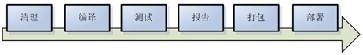
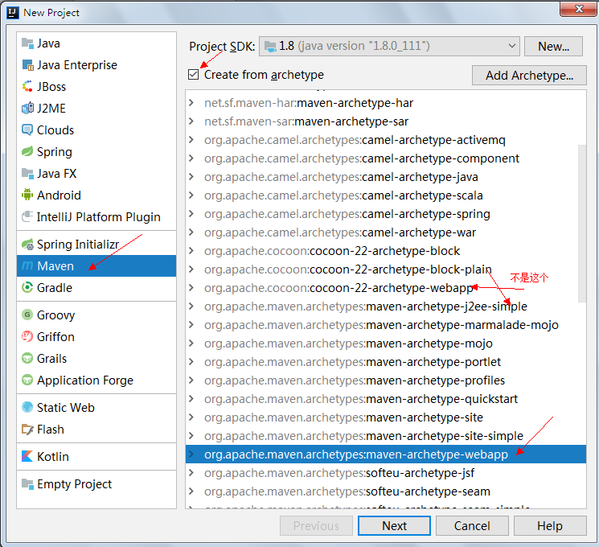
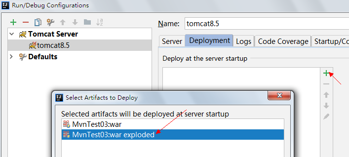
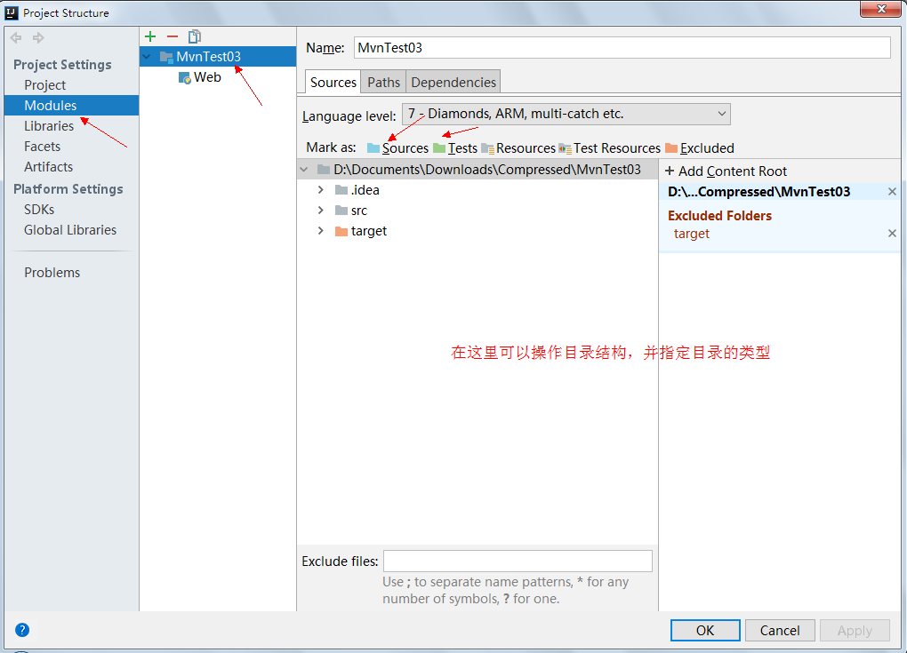

## Maven的基本概念

**Maven**纯Java编写的**是跨平台的项目管理工具，**所有的项目配置信息都被定义在一个叫做POM.xml的文件中。主要服务于基于Java平台的项目构建，依赖管理和项目信息管理。

而Maven是面向项目，把我们的项目看**做成是一个对象**来进行管理

### 项目构建

　　项目构建过程包括【清理项目】→【编译项目】→【测试项目】→【生成测试报告】→【打包项目（jar\war）】→【部署项目】这几个步骤，这六个步骤就是一个项目的完整构建过程。



理想的项目构建是高度自动化，跨平台，可重用的组件，标准化的，使用maven就可以帮我们完成上述所说的项目构建过程。

 maven可以**通过一个命令实现自动构建软件项目**。Maven拥有“**约定优于配置**“这么一个理念

### 依赖管理

在这个开源的年代里，几乎任何Java应用都会借用一些第三方的开源类库，这些类库都可通过依赖的方式引入到项目中来。随着依赖的增多，版本不一致、版本冲突、依赖臃肿等问题都会接踵而来。手工解决这些问题是十分枯燥的，幸运的是Maven提供了一个优秀的解决方案，它通过一个坐标系统准确地定位每一个构件（artifact），也就是通过一组坐标Maven能够找到任何一个Java类库，如jar文件。

### 使用Maven的好处

Maven中使用约定，约定java源代码代码必须放在哪个目录下，编译好的java代码又必须放到哪个目录下，这些目录都有明确的约定。

Maven的每一个动作都拥有一个生命周期，例如执行 mvn install 就可以自动执行编译，测试，打包等构建过程

只需要定义一个**pom.xml**,然后把源码放到默认的目录，Maven帮我们处理其他事情。使用Maven可以进行项目高度自动化构建，依赖管理(这是使用Maven最大的好处)，仓库管理。

## Maven常用命令

mvn的命令有很多，在项目开发中，理解了下面的几个常用命令后，运用maven就没有问题了。

**(1)** 常用的mvn命令

**mvn archetype:create** 互动模式创建 Maven 项目 

**使用非互动模式（指定参数创建项目）**：

普通项目骨架：

```
mvn archetype:generate -DgroupId=com.mycompany.app -DartifactId=myapp -DarchetypeArtifactId=maven-archetype-quickstart -DinteractiveMode=false
```

Web项目骨架：

```
mvn archetype:generate -DgroupId=com.zhangguo  -DartifactId=webappdemo  -Dpackage=com.zhangguo.webappdemo  -DarchetypeArtifactId=maven-archetype-webapp   -Dversion=1.0 -DinteractiveMode=No
```

**mvn compile** 编译主程序源代码，不会编译test目录的源代码。第一次运行时，会下载相关的依赖包，可能会比较费时
**mvn test-compile** 编译测试代码，compile之后会生成target文件夹，主程序编译在classes下面，测试程序放在test-classes下
**mvn test** 运行应用程序中的单元测试 
**mvn site** 生成项目相关信息的网站  **mvn clean** 清除目标目录中的生成结果 
**mvn package** 依据项目生成 jar 文件，打包之前会进行编译，测试
**mvn install** 在本地 Repository中安装 jar**。
mvn eclipse:eclipse**生成 Eclipse 项目文件及包引用定义
**mvn deploy** 在整合或者发布环境下执行，将最终版本的包拷贝到远程 的repository，使得其他的开发者或者工程可以共享。

**(2)** **一些高级功能命令**

 跳过测试类 ： -Dmaven.test.skip=true

下载jar包源码： -DdownloadSource=true

下载javadocs： -DdownloadJavadocs=true

**例如：**

mvn package -Dmaven.test.skip=true ：表示打包时忽略掉test目录，不编译。 
 mvn install -DdownloadSource=true ：本地安装jar包时，下载jar的源文件包。

让我们从开发一个十分简单的例子开始探究Maven的核心概念。通过学习，你将会对构建生命周期 (buildlifecycle)，Maven仓库 (repositories)，依赖管理 (dependency management)和项目对象模型 (Project Object Model)有一个基本的理解。

## Maven下载安装

1. 下载地址：http://maven.apache.org/download.cgi，下载最新的xxx-bin.zip文件，在win上解压到： F:\Tools\DevelopTool\maven
2. **进行解压缩**。进行解压缩，例如解压到如下目录(**解压目录最好不要有中文**)
3. **Maven环境变量**：系统变量：MAVEN_HOME = F:\Tools\DevelopTool\maven
4. **环境变量Path**，将%MAVEN_HOME%\bin加入Path中，一定要注意要用分号；与其他值隔开，如下图所示：用户变量：path = %MAVEN_HOME%\bin;
5. 验证Maven安装是否成功?打开cmd窗，**输入"mvn –v"命令** 查看Maven的相关信息。能够出现信息就说明Maven的安装已经成功了。
6. 设置MAVEN_OPTS环境变量(可选配置)。由于Maven命令实际上是执行了Java命令，所以可以通过JAVA命令参数的方式来设置**MAVEN运行参数**。MAVEN_OPTS环境变量正是用于此用途
   MAVEN_OPTS=-Xms128m -Xmx512m，分别设置JVM的最小和最大内存。　　 

### 修改Maven仓库存储位置

　　从Maven中心仓库下载到本地的jar包的默认存在”${user.home}/.m2/repository”中，${user.home}表示当前登录系统的用户目录。Jar包存放在这个位置不太好，我们希望能够自己定义下载下来的jar包的存放位置，因此我们可以**自己设置下载到本地时的jar包的存放目录。**

- 　　在自己选的目录下创建一个“repository”文件夹

- 　　找到F:\Tools\DevelopTool\maven \conf\settings.xml文件，编辑setting.xml文件，加上下面的代码

  　

```xml
<localRepository>F:\Tools\DevelopTool\maven \repository</localRepository>
<!-配置阿里云镜像（因为要访问国外服务器，会很慢）->
<mirror>
 <id>alimaven</id>
 <name>aliyun maven</name>
 <url>http://maven.aliyun.com/nexus/content/groups/public/</url>
 <mirrorOf>central</mirrorOf>
</mirror>
```

把jar包下载到本地的好处就是，当编译时，会优先从本地的jar包去找，如果本地存在，就直接拿来用，如果不存在，就从Maven的中心仓库去下载。

此外，我们在maven项目中运行mvn install，项目将会自动打包并安装到本地仓库中。


## Maven的简单使用

### **坐标**

groupId , artifactId , version 三个元素是项目的坐标，唯一的标识这个项目。

groupId 项目所在组，一般是组织或公司

artifactId 是当前项目在组中的唯一ID；

version 表示版本，SNAPSHOT表示快照，表示此项目还在开发中，不稳定。

groupId 和实际项目不一定是一一对应的，maven 有模块的概念，例如 spring-core, spring-context...；groupId 也不应该只对应公司或组织名，建议具体到项目名，因为公司或者组织下有多个项目，而artifactId只能代表模块名。

### Maven项目的目录约定

MavenProjectRoot(项目根目录)
  |----src
  |   |---- main
  |   |     |----java ——存放项目的.java文件
  |   |     |----resources ——存放项目资源文件，如spring, hibernate配置文件
  |   |----test
  |   |     |----java ——存放所有测试.java文件，如JUnit测试类
  |   |     |----resources ——存放项目资源文件，如spring, hibernate配置文件
  |----target ——项目输出位置
  |---**-pom.xml ----****用于标识该项目是一个****Maven****项目**

### idea 使用maven

步骤一：首先先创建一个project,上次我说过了创建一个project就是一个工作空间，在这里就是创建一个maven的工作空间。

步骤二：选择maven项目，指定骨架，这里选择的是一个webapp，当然webapp骨架有非常多，这里选择apache提供的。



步骤三：填写项目的座标，公司编号（一般倒置域名），项目名称，版本

步骤四：因为IDEA内置了Maven，可以选择默认内置的Maven；当然最好是选择自己安装并配置好的环境，让所有的IDE统一：

步骤五：选择项目名称，位置，一般默认。点击Finish项目就创建完成了

**每次新建Maven项目，或者pom.xml有改动，都会有这个提示，这次点击Enable Auto-Import，自动导入，省掉麻烦。**

### 配置Tomcat

点击右上角下拉框，选择Edit Configurations，编辑配置


**添加tomcat的配置：tomact server ->local**

配置tocat服务器，命名，选择tomcat版本，等想配置的信息；最关键的是需要将项目部署出去，可以直接击fix


选择war explored，是选择war还是war exploded 这里首先看一下他们两个的区别：
（1）war模式这种可以称之为是发布模式，看名字也知道，这是先打成war包，再发布；（2）war exploded模式是直接把文件夹、jsp页面 、classes等等移到Tomcat 部署文件夹里面，进行加载部署。因此这种方式支持热部署，一般在开发的时候也是用这种方式。

当然也可以手动选择要部署出去的项目，特别是有多个项目的情况



**配置项目结构，特别是要注意依赖的包需要部署到WEB-INF的lib目录下。**

添加相应的目录，选择打开项目结构：

蓝色：源代码

绿色：测试

资源文件（配置信息）

测试资源文件

被排除的(打包里被忽视)



**目标位置右键添加目录**

当然可以直接使用插件让项目部署到jetty中通过maven运行，不需tomcat。

### 不能添加Servlet的解决方法

在新建Servlet步骤里，右键java源代码目录，无法看到Servlet选型，是因为.iml文件有问题。

1. 在IDEA中打开.iml文件

2. 添加如图所示的代码，或者复制此处代码覆盖j2ee.iml文件

3. 菜单-File->Close Project

4. 重新打开项目，就能够看到新建Servlet步骤截图里的Servlet选项了

```xml
<sourceRoots>
    <root url="file://$MODULE_DIR$/src/main/java" />
</sourceRoots>
```