## IntelliJ IDEA

IntelliJ IDEA 介绍

> 高级传送门：[IntelliJ IDEA 官网下载 - Ultimate 终极版](https://links.jianshu.com/go?to=https%3A%2F%2Fwww.jetbrains.com%2Fidea%2Fdownload%2F%23section%3Dwindows)

教程主要面向中文用户，如果你英文良好，建议直接阅读官网帮助文档

- 官网帮助中心：http://www.jetbrains.com/idea/webhelp/getting-help.html

> - 语言支持上：

| 安装插件后支持 | SQL类      | 基本JVM |
| -------------- | ---------- | ------- |
| PHP            | PostgreSQL | Java    |
| Python         | MySQL      | Groovy  |
| Ruby           | Oracle     |         |
| Scala          | SQL Server |         |
| Kotlin         |            |         |
| Clojure        |            |         |

> - 其他支持：

| 支持的框架   | 额外支持的语言代码提示 | 支持的容器 |
| ------------ | ---------------------- | ---------- |
| Spring MVC   | HTML5                  | Tomcat     |
| GWT          | CSS3                   | TomEE      |
| Vaadin       | SASS                   | WebLogic   |
| Play         | LESS                   | JBoss      |
| Grails       | JavaScript             | Jetty      |
| Web Services | CoffeeScript           | WebSphere  |
| JSF          | Node.js                |            |
| Struts       | ActionScript           |            |
| Hibernate    |                        |            |
| Flex         |                        |            |

上面特性只是 IntelliJ IDEA 的冰山一角，而且这个还不是 IntelliJ IDEA 最重要的地方，IntelliJ IDEA 最重要的特性就是人性化、智能，后面学习你会慢慢接触到。


**在IDEA当中，Project和 Module是作为两个不同的概念，对项目结构是具有重大意义。**

> **简单来说，IDEA不需要设置工作空间，因为每一个Project都具备一个工作空间！！**对于每一个IDEA的项目工程（Project）而言，它的每一个子模块（Module）都可以使用独立的JDK和MAVEN配置。这对于传统项目迈向新项目的重构添加了极大的便利性，这种多元化的灵活性正是Eclipse所缺失的，因为开始Eclipse在初次使用时已经绑死了工作空间。

**有了当前项目配置，还需要默认配置呢？**

> IDEA没有工作空间的概念，所以每个新项目（Project）都需要设置自己的JDK和MAVEN等相关配置，这样虽然提高了灵活性，但是却要为每个新项目都要重新配置，这显然不符合我们的预期。在这个背景下，默认配置给予当前项目配置提供了Default选项，问题自然就迎刃而解了。
>
>   **最新补充**：IDEA为了明确这个新项目配置的概念，在2018.2之后的正式版本已正式将“Default Settings”名字修改“ Default Settings /ProjectStructs”，即“默认配置”就是指“新项目配置”。


### 缓存和索引介绍

IntelliJ IDEA 首次加载项目的时候，都会创建索引，而创建索引的时间跟项目的文件多少成正比，我也简单强调了 IntelliJ IDEA 索引的重要性。这里我们再对此进行详细说明索引、缓存对 IntelliJ IDEA 的重要性。

在 IntelliJ IDEA 创建索引过程中，所有的 Java类都是这个图标，如果你项目大的话很容易观察到的，几个文件的小项目倒是不一定会看到。所以在 IntelliJ IDEA 创建索引过程即使你编辑了代码也是编译不了、运行不起来的，所以还是安安静静等 IntelliJ IDEA 创建索引完成。

IntelliJ IDEA 的缓存和索引主要是用来加快文件查询，从而加快各种查找、代码提示等操作的速度，所以 IntelliJ IDEA 的索引的重要性我再唠叨一万遍都不为过。


> - IntelliJ IDEA 已经自带提供清除缓存、索引的路口，如上图标注 1 所示。


> - 一般建议点击 `Invalidate and Restart`，这样会比较干净。
> - 但是有一个需要提醒的是，如上图红圈标注的地方：清除索引和缓存会使得 IntelliJ IDEA 的 `Local History` 丢失，**所以如果你项目没有加入到版本控制，**而你又需要你项目文件的历史更改记录，那你最好备份下你的 `LocalHistory` 目录。目录地址在：`C:\Users\当前登录的系统用户名\.IntelliJIdea14\system\LocalHistory`建议使用硬盘的全文搜索，这样效率更高。

通过上面方式清除缓存、索引本质也就是去删除 C 盘下的 `system` 目录下的对应的文件而已，所以如果你不用上述方法也可以删除整个 `system`。当 IntelliJ IDEA 再次启动项目的时候会重新创建新的 `system` 目录以及对应项目缓存和索引。

如果你遇到了因为索引、缓存坏了以至于项目打不开，那也建议你可以直接删除 `system` 目录，一般这样都可以很好地解决你的问题。

### IDEA 必备小技能

### 主题

IntelliJ IDEA 修改主题的地方，可以通过打开左上角的File -> Setting。在 Windows 系统上 IntelliJ IDEA 默认提供的主题有四套：`Darcula`、`IntelliJ`、`Windows`、`Alloy. IDEA Theme`。除了 `Darcula` 是黑色主题，其他三套都是以白色为背景的。

#### 文件编码修改

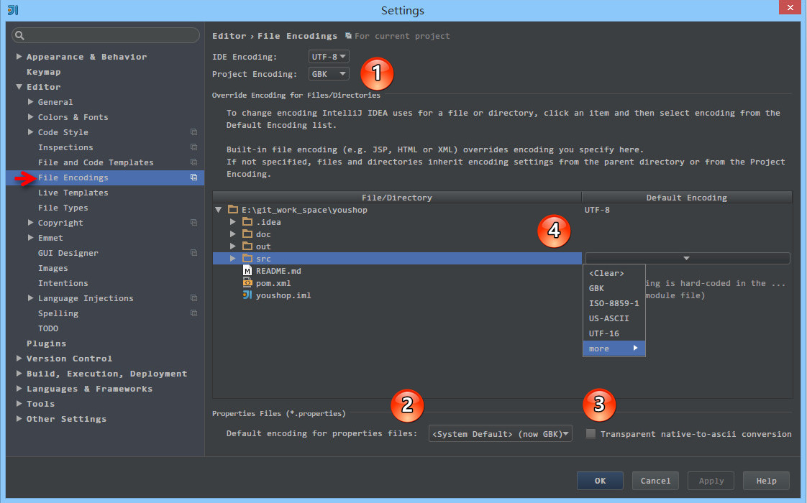

> - 上图标注 1 所示，IDE 的编码默认是 `UTF-8`，`Project Encoding` 虽然默认是 `GBK`，但是一般我都建议修改为 `UTF-8`。
> - 上图标注 2 所示，IntelliJ IDEA 可以对 `Properties` 文件进行专门的编码设置，一般也建议改为 `UTF-8`，其中有一个重点就是属性 `Transparent native-to-ascii conversion`，
> - 上图标注 3 所示，对于 `Properties` 文件，重要属性 `Transparent native-to-ascii conversion` 主要用于转换 `ascii`，一般都要勾选，不然 `Properties` 文件中的注释显示的都不会是中文。
> - 上图标注 4 所示，IntelliJ IDEA 除了支持对整个 Project 设置编码之外，还支持对目录、文件进行编码设置。如果你要对目录进行编码设置的话，可能会出现需要 `Convert` 编码的弹出操作选择，**强烈建议** 在转换之前做好文件备份，不然可能出现转换过程变成乱码，无法还原。

#### **隐藏开发工具的配置目录 **

**例如 \*.idea;\*.iml** 

File | Settings | File Types | 在末尾加上 *.idea;*.iml

#### 取消大小写敏感

具体步骤：

File | Settings | Editor | General | Code Completion Case | Sensitive Completion = None

取消大小敏感，在编写代码的时候，代码的自动提示将更加全面和丰富。

#### 自动导包


如上图标注 1 和 2 所示，默认 IntelliJ IDEA 是没有开启自动 import 包的功能。

- 勾选标注 1 选项，IntelliJ IDEA 将在我们书写代码的时候自动帮我们优化导入的包，比如自动去掉一些没有用到的包。
- 勾选标注 2 选项，IntelliJ IDEA 将在我们书写代码的时候自动帮我们导入需要用到的包。但是对于那些同名的包，还是需要手动 `Alt + Enter` 进行导入的，IntelliJ IDEA 目前还无法智能到替我们做判断。

#### 注释风格


- 如上图 Gif 所示，默认 IntelliJ IDEA 对于 Java 代码的单行注释是把注释的斜杠放在行数的最开头，我个人觉得这样的单行注释非常丑，整个代码风格很难看，所以一般会设置为单行注释的两个斜杠跟随在代码的头部。

### 生成 serialVersionUID


- 默认 IntelliJ IDEA 是没有开启自动帮你生成 serialVersionUID 的，需要我们自行设置。
- 如上图第一张，需要先勾选：`Serializable class without serialVersionUID`
- 如上图第二张，在已经继承了 Serializable 接口的类名上，把光标放在类名上（必须这样做），按 `Alt + Enter`，即可提示帮你生成 serialVersionUID 功能。

#### Rest Client

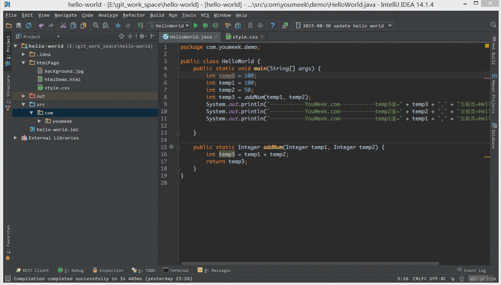

- 如上图 Gif 所示，IntelliJ IDEA 自带模拟请求工具 Rest Client，在开发时用来模拟请求是非常好用的。

#### 配置 Database 组件的数据库连接


> - 表面上很多人认为配置 Database 就是为了有一个 GUI 管理数据库功能，但是这并不是 IntelliJ IDEA 的 Database 最重要特性。数据库的 GUI 工具有很多，IntelliJ IDEA 的 Database 也没有太明显的优势。IntelliJ IDEA 的 Database 最大特性就是对于 Java Web 项目来讲，常使用的 ORM 框架，如 Hibernate、Mybatis 有很好的支持，比如配置好了 Database 之后，IntelliJ IDEA 会自动识别 domain 对象与数据表的关系，也可以通过 Database 的数据表直接生成 domain 对象等等。

> - 如上图 Gif 所示，这是一个完成的配置 Database 过程，对于数据库需要的依赖包，IntelliJ IDEA 可以自动帮我们下载，所以我们只要配置对应的连接参数即可。

#### 自动编译（Runtime）

具体步骤： 敲击 Ctrl + Shift + Alt + / 然后双击Shift搜索进入Registry ，找到compiler.automake.allow.when.app.running ，然后勾选上。


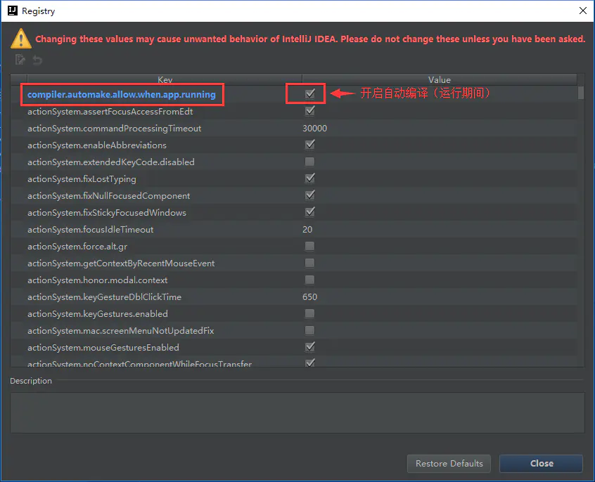

## **必备的快捷键**

### Ctrl

| 快捷键           | 介绍                                                         |
| ---------------- | ------------------------------------------------------------ |
| Ctrl + F         | 在当前文件进行文本查找 `（必备）`                            |
| Ctrl + R         | 在当前文件进行文本替换 `（必备）`                            |
| Ctrl + Z         | 撤销 `（必备）`                                              |
| Ctrl + Y         | 删除光标所在行 或 删除选中的行 `（必备）`                    |
| Ctrl + X         | 剪切光标所在行 或 剪切选择内容                               |
| Ctrl + C         | 复制光标所在行 或 复制选择内容                               |
| Ctrl + D         | 复制光标所在行 或 复制选择内容，并把复制内容插入光标位置下面 `（必备）` |
| Ctrl + W         | 递进式选择代码块。可选中光标所在的单词或段落，连续按会在原有选中的基础上再扩展选中范围 `（必备）` |
| Ctrl + E         | 显示最近打开的文件记录列表 `（必备）`                        |
| Ctrl + N         | 根据输入的 **类名** 查找类文件 `（必备）`                    |
| Ctrl + G         | 在当前文件跳转到指定行处                                     |
| Ctrl + J         | 插入自定义动态代码模板 `（必备）`                            |
| Ctrl + P         | 方法参数提示显示 `（必备）`                                  |
| Ctrl + Q         | 光标所在的变量 / 类名 / 方法名等上面（也可以在提示补充的时候按），显示文档内容 |
| Ctrl + U         | 前往当前光标所在的方法的父类的方法 / 接口定义 `（必备）`     |
| Ctrl + B         | 进入光标所在的方法/变量的接口或是定义处，等效于 `Ctrl + 左键单击` `（必备）` |
| Ctrl + K         | 版本控制提交项目，需要此项目有加入到版本控制才可用           |
| Ctrl + T         | 版本控制更新项目，需要此项目有加入到版本控制才可用           |
| Ctrl + H         | 显示当前类的层次结构                                         |
| Ctrl + O         | 选择可重写的方法                                             |
| Ctrl + I         | 选择可继承的方法                                             |
| Ctrl + +         | 展开代码                                                     |
| Ctrl + -         | 折叠代码                                                     |
| Ctrl + /         | 注释光标所在行代码，会根据当前不同文件类型使用不同的注释符号 `（必备）` |
| Ctrl + [         | 移动光标到当前所在代码的花括号开始位置                       |
| Ctrl + ]         | 移动光标到当前所在代码的花括号结束位置                       |
| Ctrl + F1        | 在光标所在的错误代码处显示错误信息 `（必备）`                |
| Ctrl + F3        | 调转到所选中的词的下一个引用位置 `（必备）`                  |
| Ctrl + F4        | 关闭当前编辑文件                                             |
| Ctrl + F8        | 在 Debug 模式下，设置光标当前行为断点，如果当前已经是断点则去掉断点 |
| Ctrl + F9        | 执行 Make Project 操作                                       |
| Ctrl + F11       | 选中文件 / 文件夹，使用助记符设定 / 取消书签 `（必备）`      |
| Ctrl + F12       | 弹出当前文件结构层，可以在弹出的层上直接输入，进行筛选       |
| Ctrl + Tab       | 编辑窗口切换，如果在切换的过程又加按上delete，则是关闭对应选中的窗口 |
| Ctrl + End       | 跳到文件尾                                                   |
| Ctrl + Home      | 跳到文件头                                                   |
| Ctrl + Space     | 基础代码补全，默认在 Windows 系统上被输入法占用，需要进行修改，建议修改为 `Ctrl + 逗号` `（必备）` |
| Ctrl + Delete    | 删除光标后面的单词或是中文句 `（必备）`                      |
| Ctrl + BackSpace | 删除光标前面的单词或是中文句 `（必备）`                      |
| Ctrl + 1,2,3...9 | 定位到对应数值的书签位置 `（必备）`                          |
| Ctrl + 左键单击  | 在打开的文件标题上，弹出该文件路径 `（必备）`                |
| Ctrl + 光标定位  | 按 Ctrl 不要松开，会显示光标所在的类信息摘要                 |
| Ctrl + 左方向键  | 光标跳转到当前单词 / 中文句的左侧开头位置 `（必备）`         |
| Ctrl + 右方向键  | 光标跳转到当前单词 / 中文句的右侧开头位置 `（必备）`         |
| Ctrl + 前方向键  | 等效于鼠标滚轮向前效果 `（必备）`                            |
| Ctrl + 后方向键  | 等效于鼠标滚轮向后效果 `（必备）`                            |

### Alt

| 快捷键          | 介绍                                                         |
| --------------- | ------------------------------------------------------------ |
| Alt + `         | 显示版本控制常用操作菜单弹出层 `（必备）`                    |
| Alt + Q         | 弹出一个提示，显示当前类的声明 / 上下文信息                  |
| Alt + F1        | 显示当前文件选择目标弹出层，弹出层中有很多目标可以进行选择 `（必备）` |
| Alt + F2        | 对于前面页面，显示各类浏览器打开目标选择弹出层               |
| Alt + F3        | 选中文本，逐个往下查找相同文本，并高亮显示                   |
| Alt + F7        | 查找光标所在的方法 / 变量 / 类被调用的地方                   |
| Alt + F8        | 在 Debug 的状态下，选中对象，弹出可输入计算表达式调试框，查看该输入内容的调试结果 |
| Alt + Home      | 定位 / 显示到当前文件的 `Navigation Bar`                     |
| Alt + Enter     | IntelliJ IDEA 根据光标所在问题，提供快速修复选择，光标放在的位置不同提示的结果也不同 `（必备）` |
| Alt + Insert    | 代码自动生成，如生成对象的 set / get 方法，构造函数，toString() 等 `（必备）` |
| Alt + 左方向键  | 切换当前已打开的窗口中的子视图，比如Debug窗口中有Output、Debugger等子视图，用此快捷键就可以在子视图中切换 `（必备）` |
| Alt + 右方向键  | 按切换当前已打开的窗口中的子视图，比如Debug窗口中有Output、Debugger等子视图，用此快捷键就可以在子视图中切换 `（必备）` |
| Alt + 前方向键  | 当前光标跳转到当前文件的前一个方法名位置 `（必备）`          |
| Alt + 后方向键  | 当前光标跳转到当前文件的后一个方法名位置 `（必备）`          |
| Alt + 1,2,3...9 | 显示对应数值的选项卡，其中 1 是 Project 用得最多 `（必备）`  |

### Shift

| 快捷键               | 介绍                                                         |
| -------------------- | ------------------------------------------------------------ |
| Shift + F1           | 如果有外部文档可以连接外部文档                               |
| Shift + F2           | 跳转到上一个高亮错误 或 警告位置                             |
| Shift + F3           | 在查找模式下，查找匹配上一个                                 |
| Shift + F4           | 对当前打开的文件，使用新Windows窗口打开，旧窗口保留          |
| Shift + F6           | 对文件 / 文件夹 重命名                                       |
| Shift + F7           | 在 Debug 模式下，智能步入。断点所在行上有多个方法调用，会弹出进入哪个方法 |
| Shift + F8           | 在 Debug 模式下，跳出，表现出来的效果跟 `F9` 一样            |
| Shift + F9           | 等效于点击工具栏的 `Debug` 按钮                              |
| Shift + F10          | 等效于点击工具栏的 `Run` 按钮                                |
| Shift + F11          | 弹出书签显示层 `（必备）`                                    |
| Shift + Tab          | 取消缩进 `（必备）`                                          |
| Shift + ESC          | 隐藏当前 或 最后一个激活的工具窗口                           |
| Shift + End          | 选中光标到当前行尾位置                                       |
| Shift + Home         | 选中光标到当前行头位置                                       |
| Shift + Enter        | 开始新一行。光标所在行下空出一行，光标定位到新行位置 `（必备）` |
| Shift + 左键单击     | 在打开的文件名上按此快捷键，可以关闭当前打开文件 `（必备）`  |
| Shift + 滚轮前后滚动 | 当前文件的横向滚动轴滚动 `（必备）`                          |

### Ctrl + Alt

| 快捷键                   | 介绍                                                         |
| ------------------------ | ------------------------------------------------------------ |
| Ctrl + Alt + L           | 格式化代码，可以对当前文件和整个包目录使用 `（必备）`        |
| Ctrl + Alt + O           | 优化导入的类，可以对当前文件和整个包目录使用 `（必备）`      |
| Ctrl + Alt + I           | 光标所在行 或 选中部分进行自动代码缩进，有点类似格式化       |
| Ctrl + Alt + T           | 对选中的代码弹出环绕选项弹出层 `（必备）`                    |
| Ctrl + Alt + J           | 弹出模板选择窗口，将选定的代码加入动态模板中                 |
| Ctrl + Alt + H           | 调用层次                                                     |
| Ctrl + Alt + B           | 在某个调用的方法名上使用会跳到具体的实现处，可以跳过接口     |
| Ctrl + Alt + C           | 重构-快速提取常量                                            |
| Ctrl + Alt + F           | 重构-快速提取成员变量                                        |
| Ctrl + Alt + V           | 重构-快速提取变量                                            |
| Ctrl + Alt + Y           | 同步、刷新                                                   |
| Ctrl + Alt + S           | 打开 IntelliJ IDEA 系统设置 `（必备）`                       |
| Ctrl + Alt + F7          | 显示使用的地方。寻找被该类或是变量被调用的地方，用弹出框的方式找出来 |
| Ctrl + Alt + F11         | 切换全屏模式                                                 |
| Ctrl + Alt + Enter       | 光标所在行上空出一行，光标定位到新行 `（必备）`              |
| Ctrl + Alt + Home        | 弹出跟当前文件有关联的文件弹出层                             |
| Ctrl + Alt + Space       | 类名自动完成                                                 |
| Ctrl + Alt + 左方向键    | 退回到上一个操作的地方 `（必备）`                            |
| Ctrl + Alt + 右方向键    | 前进到上一个操作的地方 `（必备）`                            |
| Ctrl + Alt + 前方向键    | 在查找模式下，跳到上个查找的文件                             |
| Ctrl + Alt + 后方向键    | 在查找模式下，跳到下个查找的文件                             |
| Ctrl + Alt + 右括号（]） | 在打开多个项目的情况下，切换下一个项目窗口                   |
| Ctrl + Alt + 左括号（[） | 在打开多个项目的情况下，切换上一个项目窗口                   |

### Ctrl + Shift

| 快捷键                   | 介绍                                                         |
| ------------------------ | ------------------------------------------------------------ |
| Ctrl + Shift + F         | 根据输入内容查找整个项目 或 指定目录内文件 `（必备）`        |
| Ctrl + Shift + R         | 根据输入内容替换对应内容，范围为整个项目 或 指定目录内文件 `（必备）` |
| Ctrl + Shift + J         | 自动将下一行合并到当前行末尾 `（必备）`                      |
| Ctrl + Shift + Z         | 取消撤销 `（必备）`                                          |
| Ctrl + Shift + W         | 递进式取消选择代码块。可选中光标所在的单词或段落，连续按会在原有选中的基础上再扩展取消选中范围 `（必备）` |
| Ctrl + Shift + N         | 通过文件名定位 / 打开文件 / 目录，打开目录需要在输入的内容后面多加一个正斜杠 `（必备）` |
| Ctrl + Shift + U         | 对选中的代码进行大 / 小写轮流转换 `（必备）`                 |
| Ctrl + Shift + T         | 对当前类生成单元测试类，如果已经存在的单元测试类则可以进行选择 `（必备）` |
| Ctrl + Shift + C         | 复制当前文件磁盘路径到剪贴板 `（必备）`                      |
| Ctrl + Shift + V         | 弹出缓存的最近拷贝的内容管理器弹出层                         |
| Ctrl + Shift + E         | 显示最近修改的文件列表的弹出层                               |
| Ctrl + Shift + H         | 显示方法层次结构                                             |
| Ctrl + Shift + B         | 跳转到类型声明处 `（必备）`                                  |
| Ctrl + Shift + I         | 快速查看光标所在的方法 或 类的定义                           |
| Ctrl + Shift + A         | 查找动作 / 设置                                              |
| Ctrl + Shift + /         | 代码块注释 `（必备）`                                        |
| Ctrl + Shift + [         | 选中从光标所在位置到它的顶部中括号位置 `（必备）`            |
| Ctrl + Shift + ]         | 选中从光标所在位置到它的底部中括号位置 `（必备）`            |
| Ctrl + Shift + +         | 展开所有代码 `（必备）`                                      |
| Ctrl + Shift + -         | 折叠所有代码 `（必备）`                                      |
| Ctrl + Shift + F7        | 高亮显示所有该选中文本，按Esc高亮消失 `（必备）`             |
| Ctrl + Shift + F8        | 在 Debug 模式下，指定断点进入条件                            |
| Ctrl + Shift + F9        | 编译选中的文件 / 包 / Module                                 |
| Ctrl + Shift + F12       | 编辑器最大化 `（必备）`                                      |
| Ctrl + Shift + Space     | 智能代码提示                                                 |
| Ctrl + Shift + Enter     | 自动结束代码，行末自动添加分号 `（必备）`                    |
| Ctrl + Shift + Backspace | 退回到上次修改的地方 `（必备）`                              |
| Ctrl + Shift + 1,2,3...9 | 快速添加指定数值的书签 `（必备）`                            |
| Ctrl + Shift + 左键单击  | 把光标放在某个类变量上，按此快捷键可以直接定位到该类中 `（必备）` |
| Ctrl + Shift + 左方向键  | 在代码文件上，光标跳转到当前单词 / 中文句的左侧开头位置，同时选中该单词 / 中文句 `（必备）` |
| Ctrl + Shift + 右方向键  | 在代码文件上，光标跳转到当前单词 / 中文句的右侧开头位置，同时选中该单词 / 中文句 `（必备）` |
| Ctrl + Shift + 前方向键  | 光标放在方法名上，将方法移动到上一个方法前面，调整方法排序 `（必备）` |
| Ctrl + Shift + 后方向键  | 光标放在方法名上，将方法移动到下一个方法前面，调整方法排序 `（必备）` |

### Alt + Shift

| 快捷键                 | 介绍                                                         |
| ---------------------- | ------------------------------------------------------------ |
| Alt + Shift + N        | 选择 / 添加 task `（必备）`                                  |
| Alt + Shift + F        | 显示添加到收藏夹弹出层 / 添加到收藏夹                        |
| Alt + Shift + C        | 查看最近操作项目的变化情况列表                               |
| Alt + Shift + I        | 查看项目当前文件                                             |
| Alt + Shift + F7       | 在 Debug 模式下，下一步，进入当前方法体内，如果方法体还有方法，则会进入该内嵌的方法中，依此循环进入 |
| Alt + Shift + F9       | 弹出 `Debug` 的可选择菜单                                    |
| Alt + Shift + F10      | 弹出 `Run` 的可选择菜单                                      |
| Alt + Shift + 左键双击 | 选择被双击的单词 / 中文句，按住不放，可以同时选择其他单词 / 中文句 `（必备）` |
| Alt + Shift + 前方向键 | 移动光标所在行向上移动 `（必备）`                            |
| Alt + Shift + 后方向键 | 移动光标所在行向下移动 `（必备）`                            |

### Ctrl + Shift + Alt

| 快捷键                 | 介绍                        |
| ---------------------- | --------------------------- |
| Ctrl + Shift + Alt + V | 无格式黏贴 `（必备）`       |
| Ctrl + Shift + Alt + N | 前往指定的变量 / 方法       |
| Ctrl + Shift + Alt + S | 打开当前项目设置 `（必备）` |
| Ctrl + Shift + Alt + C | 复制参考信息                |

### 其他

| 快捷键        | 介绍                                                         |
| ------------- | ------------------------------------------------------------ |
| F2            | 跳转到下一个高亮错误 或 警告位置 `（必备）`                  |
| F3            | 在查找模式下，定位到下一个匹配处                             |
| F4            | 编辑源 `（必备）`                                            |
| F7            | 在 Debug 模式下，进入下一步，如果当前行断点是一个方法，则进入当前方法体内，如果该方法体还有方法，则不会进入该内嵌的方法中 |
| F8            | 在 Debug 模式下，进入下一步，如果当前行断点是一个方法，则不进入当前方法体内 |
| F9            | 在 Debug 模式下，恢复程序运行，但是如果该断点下面代码还有断点则停在下一个断点上 |
| F11           | 添加书签 `（必备）`                                          |
| F12           | 回到前一个工具窗口 `（必备）`                                |
| Tab           | 缩进 `（必备）`                                              |
| ESC           | 从工具窗口进入代码文件窗口 `（必备）`                        |
| 连按两次Shift | 弹出 `Search Everywhere` 弹出层                              |


### 最特殊的快捷键 Alt + Enter 

- 这是一个非常特殊的快捷键，有必要拿出来单独讲。
- **强烈注意**：此快捷键跟光标所在位置有着很严重关联关系，光标放的位置不同，使用此快捷键出来的菜单选项完全不一样。

#### 智能辅助


> - 在 **接口类** 中，如果光标当前所在的方法，已经在 **接口实现类** 中生成了，则此快捷键的效果是跳转。
> - 在 **接口类** 中添加一个方法后，让该 **接口实现类** 也跟着生成

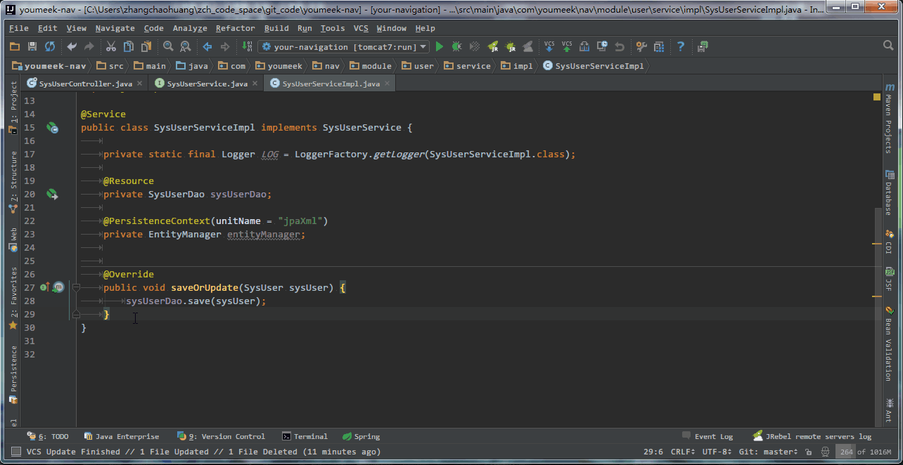

> - 在 **接口实现类** 中添加一个方法后，让该 **接口类** 也跟着生成

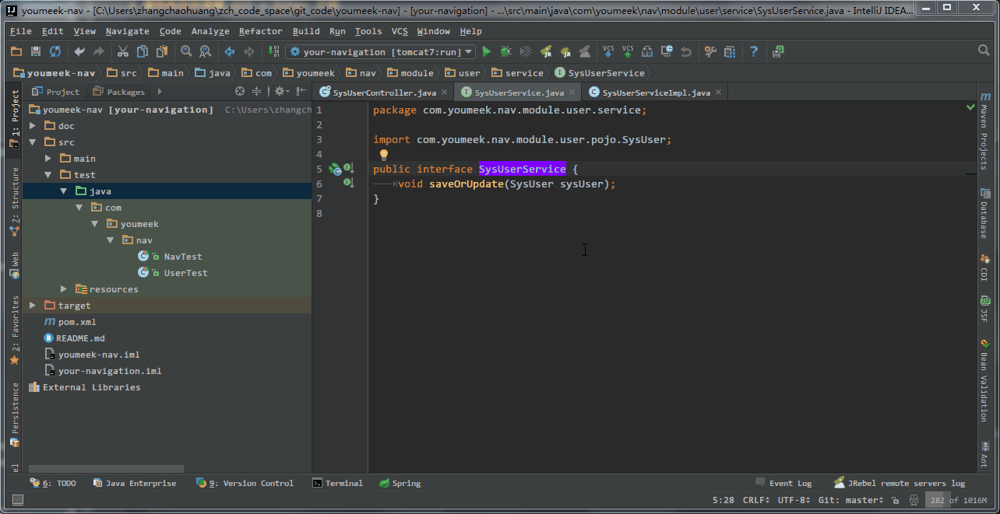

> - 对当前光标所在类，生成单元测试类

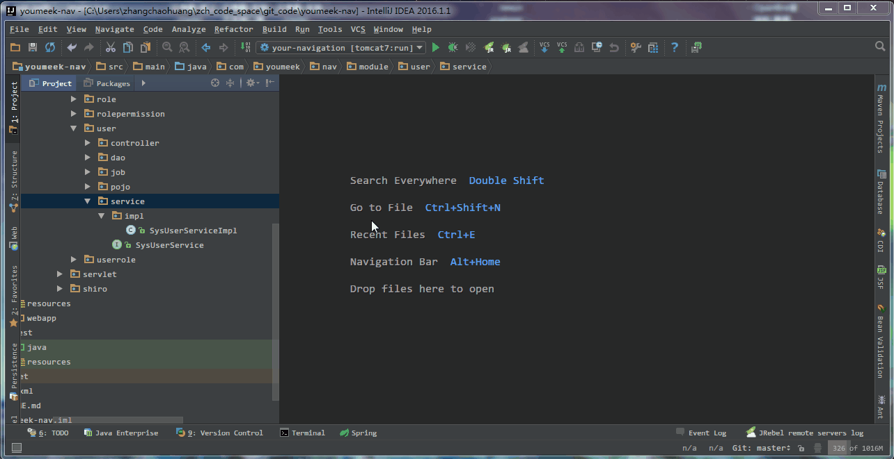

> - 对当前光标所在类，创建子类，常用在对接口生成接口实现类


> - 移除未使用的变量、对象等元素

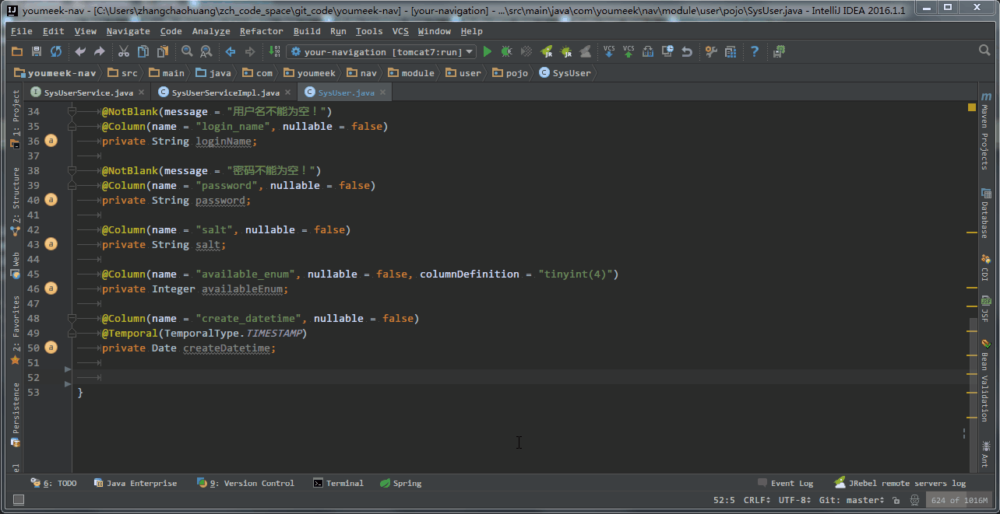

> - 对属性创建 set、get 方法

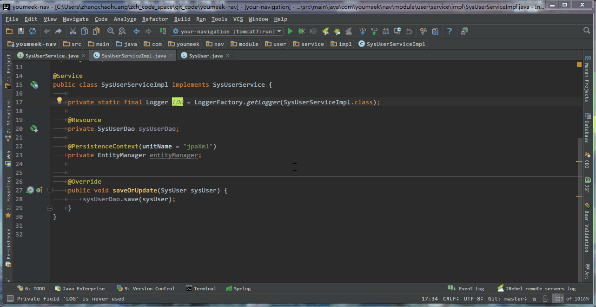

> - 添加 doc，只能把光标放在方法名或是变量名等这类元素上才会有


> - 把自己造的单词加入词库中，让拼写单词检查错误的波浪线效果消失。


> - 自己造的词库在上图所示位置。


> - 快速移除当前类所继承的接口，并且同时清空已经写好的该接口所有的 Override 方法。
> - 光标只能方式 **接口实现类** 上的 **接口对象单词** 上才可以实现。


> - 修改光标当前元素的作用域


> - 给调用的方法生成返回值
> - 根据返回值自动强转


> - 对光标所在的对象进行包导入


> - 切换成静态导入

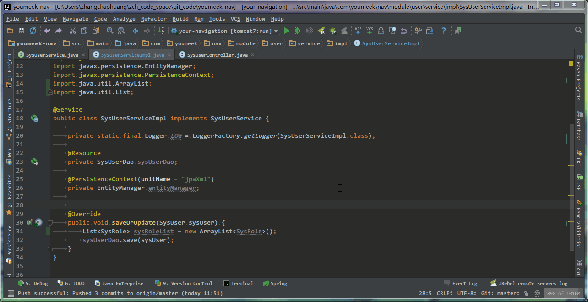

> - 根据 Language Level 级别不同，JDK 特性不同，给不同意见。Language Level 的含义在其他章节有讲过。


> - 给 Hibernate 的 Entity 对象分配数据源，从而产生一系列智能功能


## 提高编码效率

### Maven 项目

#### Maven 常用设置介绍


> - 如上图标注 1 所示，我们可以指定我们本地 **Maven 的安装目录所在**，因为我已经配置了 `MAVEN_HOME` 系统参数，所以直接这样配置 IntelliJ IDEA 是可以找到的。但是假如你没有配置的话，这里可以选择你的 Maven 安装目录。
> - 如上图标注 2 所示，我们还可以指定 Maven 的 `settings.xml` 位置和本地仓库位置。

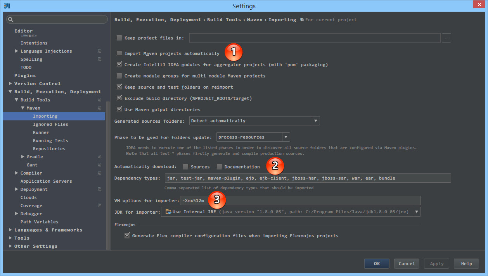

> - 如上图标注 1 所示，`Import Maven projects automatically` 表示 IntelliJ IDEA 会实时监控项目的 `pom.xml` 文件，进行项目变动设置。
> - 如上图标注 2 所示，在 Maven 导入依赖包的时候是否自动下载源码和文档。默认是没有勾选的，也不建议勾选，原因是这样可以加快项目从外网导入依赖包的速度，如果我们需要源码和文档的时候我们到时候再针对某个依赖包进行联网下载即可。IntelliJ IDEA 支持直接从公网下载源码和文档的。
> - 如上图标注 3 所示，可以设置导入的 VM 参数。一般这个都不需要主动改，除非项目真的导入太慢了我们再增大此参数。

#### Maven 骨架创建 Java Web 项目

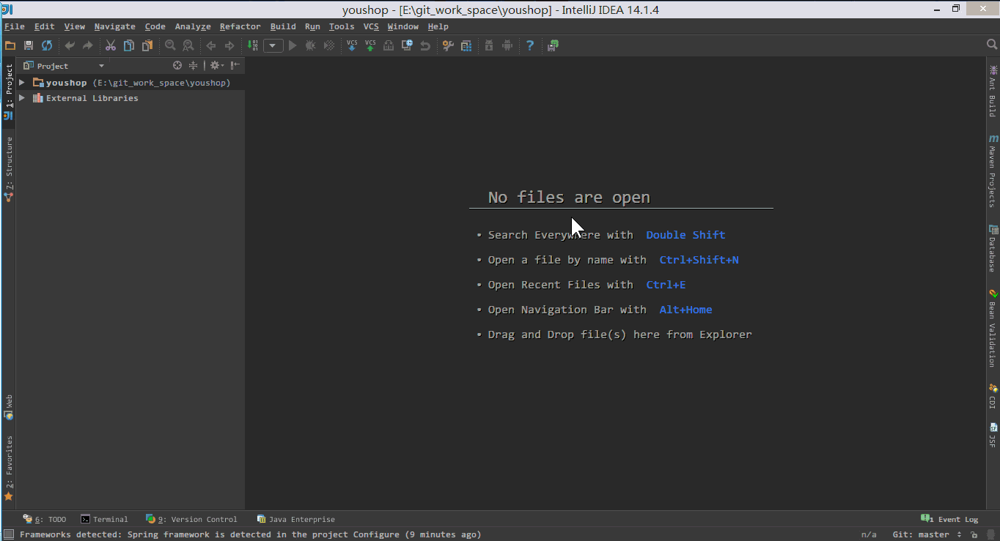

> - 如上图 Gif 演示，根据已有的 Maven 骨架进行 Java Web 项目创建。其中需要特别注意的是，在创建项目过程中 Maven 会去外网中央仓库中下载对应的依赖或是组件，这个过程根据自身网络环境决定其快慢。如果出现无法下载的情况请自备 VPN 或者通过修改 Maven 配置文件 `settings.xml` 切换国内的中央仓库。

#### 启动 Java Web 项目


> - 如上图 Gif 演示，配置好项目之后，启动 Tomcat 容器可以良好运行。

#### Maven 组件来管理项目

我们已经了解了如何通过 Maven 骨架生成一个最简单的 Java Web 项目，可是我们还是使用了 IntelliJ IDEA 的项目管理功能进行 Maven 项目的管理和构建。一般 Maven 的项目我们都可以脱离 IntelliJ IDEA 的项目配置功能进行独立的管理和构建的，接下来我们就讲如何通过 IntelliJ IDEA 提供的 Maven 管理工具进行项目的管理和构建。

#### Maven 组件界面介绍


> - 如上图标注 1 所示，为常用的 Maven 工具栏，其中最常用的有：
>
> > - 第一个按钮：`Reimport All Maven Projects` 表示根据 `pom.xml` 重新载入项目。一般当我们在 `pom.xml` 添加了依赖包或是插件的时候，发现标注 4 的依赖区中没有看到最新写的依赖的话，可以尝试点击此按钮进行项目的重新载入。
> > - 第六个按钮：`Execute Maven Goal` 弹出可执行的 Maven 命令的输入框。有些情况下我们需要通过书写某些执行命令来构建项目，就可以通过此按钮。
> > - 第九个按钮：`Show Dependencies` 显示项目依赖的结构图，可以方便我们直观项目的依赖包情况。这个功能有些具体的操作下面会专门进行讲解。

> - 如上图标注 2 所示，常用的 Maven 生命周期的命令，通过双击对应的命令来执行项目编译、打包、部署等操作。

> - 如上图标注 3 所示，为我们在 `pom.xml` 中配置的插件列表，方便调用插件。

> - 如上图标注 4 所示，为我们在 `pom.xml` 中配置的依赖包列表。

> - 如上图标注 5 所示，为常见的 Java Web 在 Maven 下的一个项目结构。

#### Maven 的 Tomcat 插件运行项目


> - 如上图 Gif 演示，通过 Maven 生命周期的命令进行编译和打包，及用 Maven 的 Tomcat 插件运行项目。
> - 虽然我们可以通过 Maven 组件进行项目的管理，但是这并不等同于我们可以完全抛弃 IntelliJ IDEA 的项目设置，比如我们在 `pom.xml` 文件中设置了 JDK 编译版本是 1.7，但是在项目的 `Ctrl + Shift + Alt + S` 配置中，我们配置的 JDK 是 1.8，那即使我们用 Maven 的编译工具或命令进行编译也是会调用 1.8的。还有即使我们在 `Ctrl + Shift + Alt + S` 配置中没有配置 Artifacts，在我们运行 Maven 的 Tomcat 插件的时候也会自动帮我们生成的。

#### Maven 快速排查依赖包冲突


> - 如上图箭头所示，点击此按钮会出现左边的项目依赖结构图，通过此图我们可以很好的观察项目的依赖依赖情况。
> - 如上图标注 1 所示，我们可以直接在依赖结构图上编辑依赖，常用的就是此排除功能。

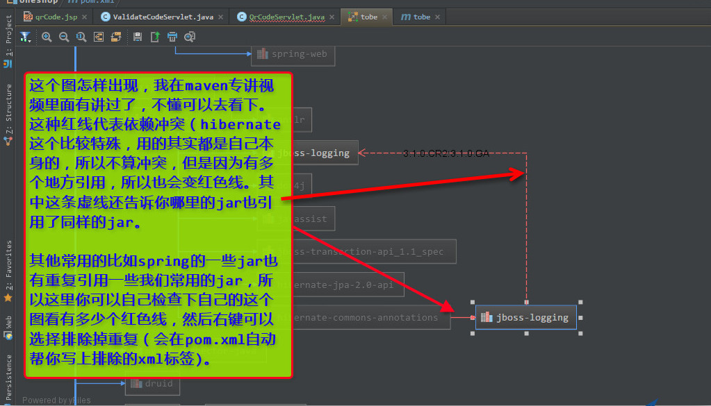

> - 如上图描述，一般我们在出现红色线的时候是都要进行排除的，防止出现因为版本不同的依赖包造成代码无法编译。

### 版本控制Git/Svn （默认配置）

具体步骤：顶部工具栏 File ->Settings -> Version Control -> Git（快捷键 Ctrl + Alt + S 打开设置）

使用说明：Git是在Version Control选项里
`Path to Git executable`就是我们的本地Git安装路径中bin目录下的git.exe，选择好路径后点击Test按钮，如果正确安装且路径正确，那么会弹出如下对话框，表示配置成功


> PS: IDEA内置的Git插件灰常好用，尤其是解决冲突性的代码。另外Git客户端推荐SourceTree。

### Tomcat Server（当前项目配置）

配置Tomcat方法： File -> Settings -> Deployment -> Application Servers -> Tomcat Server 


#### 准备工作

- 明确远程服务器的 IP 地址，比如我是：192.168.92.128
- 关掉服务器防火墙：`service iptables stop`

#### 本地 Remote Server 配置

- 添加 Remote Server，如下图

  
- 复制 Remote Server 自动生成的 JVM 参数，等下有用，如下图，比如我的是：`-agentlib:jdwp=transport=dt_socket,server=y,suspend=n,address=5005`
- 如下图，在 Host 添加服务器的 IP 地址：192.168.92.128。
  
  - 
- 把刚刚复制参数加个前缀，变成：
  - Linux（有单引号）：`export JAVA_OPTS='-agentlib:jdwp=transport=dt_socket,server=y,suspend=n,address=5005'`
  - Windows（没有单引号）：`set JAVA_OPTS=-agentlib:jdwp=transport=dt_socket,server=y,suspend=n,address=5005`

#### 服务器 Tomcat 配置

- 以 Linux 环境为例

- Tomcat 安装在 /usr/program/tomcat7

- Tomcat 的执行程序：/usr/program/tomcat7/bin/catalina.sh

- 编辑 Tomcat 执行程序：

  ```
  vim /usr/program/tomcat7/bin/catalina.sh
  ```

  （Windows 是编辑：catalina.bat）

  - 在该文件的最上面，添加我们刚刚复制的那句话：`export JAVA_OPTS='-agentlib:jdwp=transport=dt_socket,server=y,suspend=n,address=5005'`。
  - 如果你的项目有特殊 JVM 参数，那你就把你的那部分参数和这部分参数合并在一起。
  - 如下图所示：
  - 

#### 服务器 Jetty 配置

- 同样是 Linux 环境

- jetty 不像Tomcat那样需要安装，只要有jetty的jar包就可以启动我们想要启动的应用。

- 在启动应用的时候加入之前上边我们copy的

  ```
  -agentlib:jdwp=transport=dt_socket,server=y,suspend=n,address=5005
  ```

  就可以了。

  - 就像这样：`java -agentlib:jdwp=transport=dt_socket,server=y,suspend=n,address=5005 -jar {your jetty path} {your port} --path {your war} 1>/dev/null 2>&1 &`

#### 开始调试

- 启动服务器 Tomcat
- 启动本地 Remote Server
- 如果可以看到如下图效果，表示已经连接成功了，接下里就是跟往常一样，在本地代码上设置断点，然后你访问远程的地址，触发到该代码自动就会在本地停住。
  - 
- 如下图，可以看到调试效果
  - 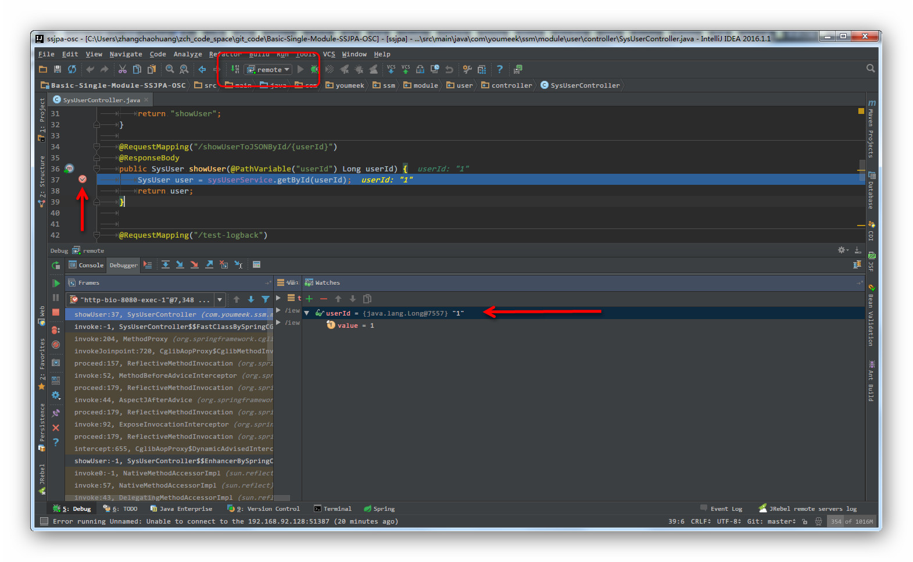

##  Debug 介绍

> - 设置 Debug 连接方式，默认是 `Socket`。位置：Setting-Build…-Deebugger-Java-Transport-Socket
> - `Shared memory` 是 Windows 特有的一个属性，一般在 Windows 系统下建议使用此设置，相对于 `Socket` 会快点。

### Debug 常用快捷键

| Win 快捷键        | Mac 快捷键           | 介绍                                                         |
| ----------------- | -------------------- | ------------------------------------------------------------ |
| F7                | F7                   | 进入下一步，如果当前行断点是一个方法，则进入当前方法体内，如果该方法体还有方法，则不会进入该内嵌的方法中 `必备` |
| F8                | F8                   | 进入下一步，如果当前行断点是一个方法，则不进入当前方法体内 `必备` |
| F9                | Command + Option + R | 恢复程序运行，但是如果该断点下面代码还有断点则停在下一个断点上 `必备` |
| Alt + F8          | Option + F8          | 选中对象，弹出可输入计算表达式调试框，查看该输入内容的调试结果 `必备` |
| Ctrl + F8         | Command + F8         | 设置光标当前行为断点，如果当前已经是断点则去掉断点           |
| Shift + F7        | Shift + F7           | 智能步入。断点所在行上有多个方法调用，会弹出进入哪个方法     |
| Shift + F8        | Shift + F8           | 跳出，表现出来的效果跟 `F9` 一样                             |
| Ctrl + Shift + F8 | Command + Shift + F8 | 指定断点进入条件                                             |
| Alt + Shift + F7  | Option + Shift + F7  | 进入下一步，如果当前行断点是一个方法，则进入当前方法体内，如果方法体还有方法，则会进入该内嵌的方法中，依此循环进入 |
| Alt + Shift + F8  | Option + Shift + F8  | 返回上一步                                                   |
| Drop Frame        | Drop Frame           | 这个不是一个快捷键，而是一个 Debug 面板上的按钮。该按钮可以用来退回到当前停住的断点的上一层方法上，可以让过掉的断点重新来过 |

- 有时候我们可以这样粗鲁地认为 Debug 的使用就是等同于这几个快捷键的使用，所以上面的 `必备` 快捷键是我们必须牢记的，这些也是开发很常用的。

### Debug 特殊技能使用


> - 如上图 Gif 所示，查看所选对象的方法常用有三种方式：
>
> > - 选中对象后，使用快捷键 `Alt + F8`。
> > - 选中对象后，拖动对象到 `Watches`。
> > - 选中对象后，鼠标悬停在对象上 2 秒左右。


> - 如上图 Gif 所示，在弹出表达式输入框中 IntelliJ IDEA 也是能帮我们智能提示。


> - 如上图 Gif 所示，当我们需要过掉后面的所有断点的时候，我们不需要去掉这些断点，只需要点击左下角那个小圆点，点击小圆点之后，所有断点变成灰色，然后我们再在按快捷键 `F9` 即可过掉当前和后面所有的断点。


> - 我们可以给断点设置进入的条件。如上图 Gif 所示，因为变量 temp3 不等于 200 所以该断点没有被进入直接跳过。


> - 如上图，我们可以给断点设置更复杂的步入条件
> - 红框中的 Pass count 表示跳过多少次后开始步入，比如 for 循环中，我们要查看一个变量循环 3 次后的结果就可以使用该方式。


> - 如上图，对于某些不重要的断点，只要步入一次就够了，就可以勾选此选项，让它步入之后自动删除。


> - 如上图，对于某些场景的断点，需要其他断点先触发之后再进行触发，可以选择此项。默认选择的是： None

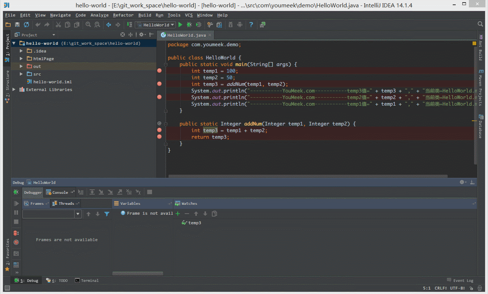

> - 有时候当我们步入方法体之后，还想回退到方法体外。如 Gif 演示，断点进入 `addNum` 方法后，点击 `Drop Frame` 按钮之后，断点重新回到方法体之外。


> - 上图 IntelliJ IDEA 版本：2017.1.3
> - 如上图左侧红框内容，可以看到当前断点线程执行的堆栈情况，最上面的为当前断点位置，下面的是断点前面执行的方法，如果需要看断点前面走过的路，可以查看该区域。并且可以用图上箭头按钮进行限制显示框架类代码的执行过程，而不是包括依赖 jar 里面的执行过程。
> - 如上图右侧红框内容，可以用来展示单点断点位置的内存情况，对于判断内存溢出相关问题很有帮助。

## 插件

| 插件名称                       | 插件介绍                                                     | 官网地址                                                     |
| ------------------------------ | ------------------------------------------------------------ | ------------------------------------------------------------ |
| .ignore                        | 各类版本控制忽略文件生成工具                                 | https://plugins.jetbrains.com/plugin/7495--ignore            |
| Alibaba Java Coding Guidelines | 阿里巴巴出的代码规范检查插件                                 | https://plugins.jetbrains.com/plugin/10046-alibaba-java-coding-guidelines |
| Alibaba Cloud Toolkit          | 阿里云辅助开发工具                                           | https://plugins.jetbrains.com/plugin/11386-alibaba-cloud-toolkit |
| BashSupport                    | Bash 支持                                                    | https://plugins.jetbrains.com/plugin/4230-bashsupport        |
| CheckStyle-IDEA                | 代码规范检查                                                 | https://plugins.jetbrains.com/plugin/1065?pr=idea            |
| CodeGlance                     | 在编辑代码最右侧，显示一块代码小地图                         | https://plugins.jetbrains.com/plugin/7275?pr=idea            |
| Eclipse Code Formatter         | 使用 Eclipse 的代码格式化风格，在一个团队中如果公司有规定格式化风格，这个可以使用。 | https://plugins.jetbrains.com/plugin/6546?pr=idea            |
| FindBugs-IDEA                  | 潜在 Bug 检查                                                | https://plugins.jetbrains.com/plugin/3847?pr=idea            |
| Gitee                          | 开源中国的码云插件                                           | https://plugins.jetbrains.com/plugin/8383-gitee              |
| Grep Console                   | 自定义设置控制台输出颜色                                     | https://plugins.jetbrains.com/idea/plugin/7125-grep-console  |
| Git Flow Integration           | Git Flow 的图形界面操作                                      | https://plugins.jetbrains.com/plugin/7315-git-flow-integration |
| GsonFormat                     | 把 JSON 字符串直接实例化成类                                 | https://plugins.jetbrains.com/plugin/7654?pr=idea            |
| GenerateAllSetter              | new POJO类的快速生成 set 方法                                | https://plugins.jetbrains.com/plugin/9360-generateallsetter  |
| IDE Features Trainer           | IntelliJ IDEA 官方出的学习辅助插件                           | https://plugins.jetbrains.com/plugin/8554?pr=idea            |
| JRebel Plugin                  | 热部署                                                       | https://plugins.jetbrains.com/plugin/?id=4441                |
| Json2Pojo                      | 根据 JSON 生成 POJO，根据 POJO 生成 JSON                     | https://plugins.jetbrains.com/plugin/8533-json2pojo          |
| Jindent-Source Code Formatter  | 自定义类、方法、doc、变量注释模板                            | http://plugins.jetbrains.com/plugin/2170?pr=idea             |
| Key promoter                   | 快捷键提示                                                   | https://plugins.jetbrains.com/plugin/4455?pr=idea            |
| kubernetes                     | kubernetes 辅助工具                                          | https://plugins.jetbrains.com/plugin/10485-kubernetes        |
| Lombok Plugin                  | Lombok 功能辅助插件                                          | https://plugins.jetbrains.com/plugin/6317-lombok-plugin      |
| MetricsReloaded                | 代码复杂度检查                                               | https://plugins.jetbrains.com/plugin/93?pr=idea              |
| Maven Helper                   | Maven 辅助插件                                               | https://plugins.jetbrains.com/plugin/7179-maven-helper       |
| Markdown Navigator             | 书写 Markdown 文章                                           | https://plugins.jetbrains.com/plugin/7896?pr=idea            |
| MybatisX                       | mybatis 框架辅助（免费）                                     | https://plugins.jetbrains.com/plugin/10119-mybatisx          |
| MyBatis Log Plugin             | Mybatis SQL 提取                                             | https://plugins.jetbrains.com/plugin/10065-mybatis-log-plugin |
| MapStruct Support              | 对 MapStruct 属性转换支持                                    | https://plugins.jetbrains.com/plugin/10036-mapstruct-support |
| OnlineSearch                   | 选择文本后支持不同搜索引擎进行搜索                           | https://plugins.jetbrains.com/plugin/8298-onlinesearch/      |
| Properties to YAML Converter   | 把 Properties 的配置格式改为 YAML 格式                       | https://plugins.jetbrains.com/plugin/8000-properties-to-yaml-converter |
| RestfulToolkit                 | 方便查找 Spring MVC 的 RequestMapping                        | https://plugins.jetbrains.com/plugin/10292-restfultoolkit    |
| Rainbow Brackets               | 对各个对称括号进行着色，方便查看                             | https://github.com/izhangzhihao/intellij-rainbow-brackets    |
| String Manipulation            | 驼峰式命名和下划线命名交替变化                               | https://plugins.jetbrains.com/plugin/2162?pr=idea            |
| Statistic                      | 代码统计                                                     | https://plugins.jetbrains.com/plugin/4509?pr=idea            |
| Scala                          | 对 Scala 支持                                                | https://plugins.jetbrains.com/plugin/1347-scala              |
| Translation                    | 翻译插件                                                     | https://github.com/YiiGuxing/TranslationPlugin               |
| VisualVM Launcher              | 项目启动的时候也启动 VisualVM                                | https://plugins.jetbrains.com/plugin/7115-visualvm-launcher  |
| Codota                         | 支持智能代码自动提示，该功能可以增强 IDEA 的代码提示功能。 支持 JDK 和知名第三方库的函数的使用方法搜索，可以看到其他知名开源项目对该函数的用法。 |                                                              |
|                                |                                                              |                                                              |

### lombok 插件的使用

- lombok 插件官网：https://plugins.jetbrains.com/plugin/6317-lombok-plugin
- 推荐 IntelliJ IDEA 插件库搜索安装：
  - File > Settings > Plugins > Browse repositories... > Search for "lombok" > Install Plugin
- IntelliJ IDEA 配置方法，官网有说明（该配置是 Project 级别，不是 IDE 全局的）：https://github.com/mplushnikov/lombok-intellij-plugin#required-intellij-configuration

### 热部署插件 JRebel 安装及使用

在 Java Web 开发中， 一般更新了 Java 文件后要手动重启 Tomcat 服务器， 才能生效， 浪费不少生命啊， 自从有了 JRebel 这神器的出现， 不论是更新 class 类还是更新 Spring 配置文件都能做到立马生效，大大提高开发效率。

JRebel 的安装方法有两种， 一种是直接在 Tomcat 启动参数上面加上 JRebel 的参数， 另外一种是以插件的形式装到 IntelliJ IDEA 上， 比较推荐后者。

#### 第二种安装方法：使用 IntelliJ IDEA 插

接下来介绍使用 IntelliJ IDEA 插件的方式启动 JRebel

首先是安装 JRebel 的插件， 安装方法和其他插件安装方法一样， 不过这里不采用在线安装， 直接选择本地安装， 直接选择插件安装即可


安装好后在设置里面会多出一项 JRebel 的配置

查看一下插件是否有效


绿色的 `VALID` 表示是有效的

在原来运行项目的按钮边上会多出两个绿色的按钮， 如图， 前面那个是 `Run`， 后面那个是 `Debug`


#### 自定义容器启动

配置 Tomcat 的方法和直接上面说的直接调用配置方法一样， 同样需要注意的是 `On 'Update' action` 和 `On frame deactivation` 这两项目一定要选择 `Update classes and resources`， 唯一不同的是 VM options 这项不需要填， 放空就好 接下来直接启动项目， 一般选择后面那个 Debug 按钮

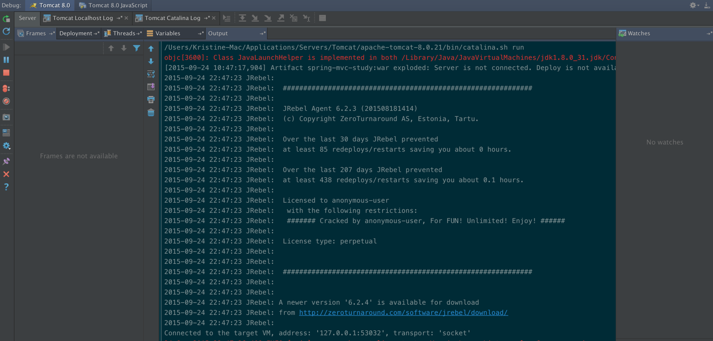

看到 Log 有 JRebel 输出的版本信息， 没有报错就是表示成功执行了， 随便改一个类试试吧

#### Maven 或 Gradle 启动

打开 JRebel Panel 窗口，然后勾选项目或模块即可，这时插件会在 src/main/resources 目录下生成 rebel.xml 文件，这里面指定了插件检测热部署文件夹的路径

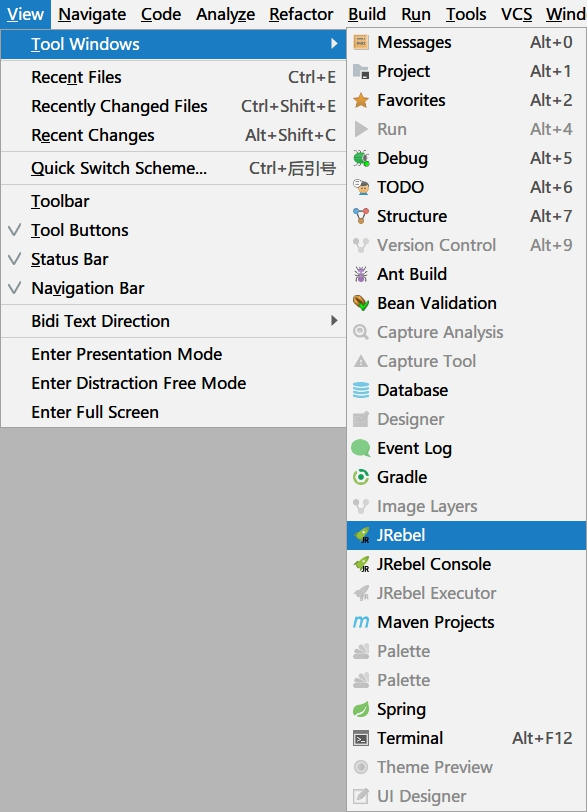


然后在 Maven projects 或 Gradle projects 窗口，右键 Task 使用 JRebel 启动


启动之后更新资源重新编译（Ctrl + Shift + F9）即可

JRebel 官网有免费激活服务，到官网注册领取，请支持正版：

- 官网注册，注册完就会显示一串密钥了：https://zeroturnaround.com/software/jrebel/trial/


**提高编码效率功能介绍**