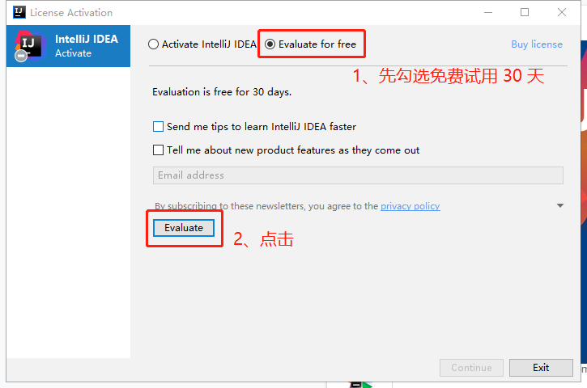
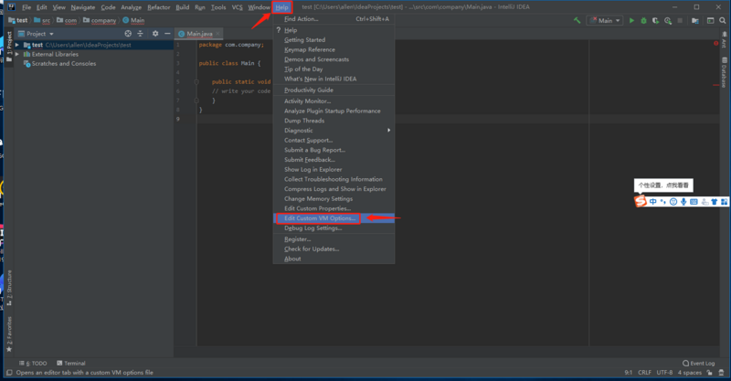
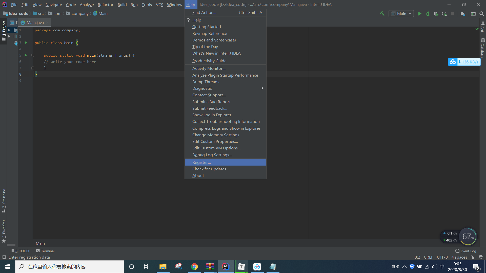
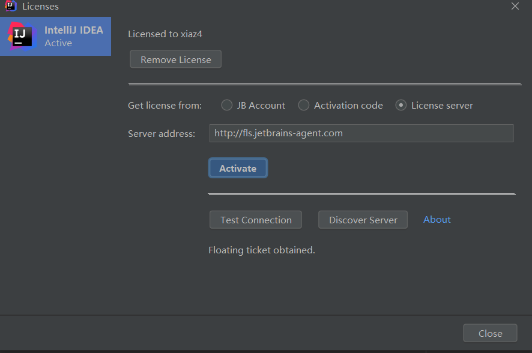
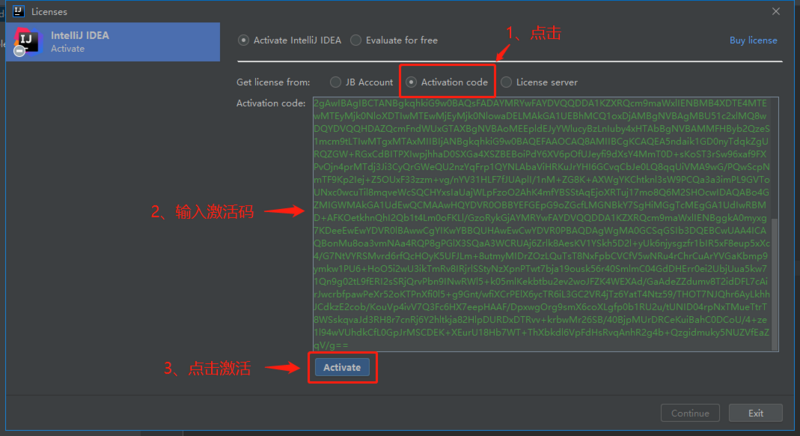

# 安装与破解

## 开始激活

安装后，如下图所示，我们先选择免费试用 30 天，先进去再说:



## 配置破解补丁

进去过后，我们随便建个项目，点击菜单栏 Help -> Edit Custom VM Options:

> 注意：

> 1、切记一定要通过 IDEA 来修改 .vmoptions 文件，不要手动直接去修改，现在 IDEA 针对反破解已经越来越严格了~

> 2、此时会出现一个提示框，点击“create”



> 注意：

> 1、补丁全路径中不要包含中文，否则，可能导致破解失败！
>
> 2、破解文件不要放在了 bin 文件夹中，亲测这样会导致 idea关闭后无法启动，建议放在其他无中文文件夹内
>
> 在 .vmoptions 文件中配置我们补丁放置的全路径位置。
>
> ```
> -javaagent:D:\Softwares\IntelliJ IDEA 2019.3.5\jetbrains-agent.jar
> ```
>
> > 注意，你的位置可能和我不一样，请自行修改。

## 重启 IDEA

切记，一定要重启 IDEA.

## 填入激活码，激活

重启完成后，开始填入激活码，点击菜单栏 Help -> Register:



选择最后一种License server激活方式，地址填入：`http://jetbrains-license-server` （应该会自动填上），或者点击按钮：”Discover Server”来自动填充地址，完成激活。

注意：服务器激活需要联网！



如果服务器激活方式无法激活，还可以选择Activation code方式激活，复制下面激活码即可（激活码来源于`[https://zhile.io](https://links.jianshu.com/go?to=https%3A%2F%2Fzhile.io`)）！

激活码激活不需要联网！



> 注意：激活码需搭配上面的破解补丁一起使用才有效！！！