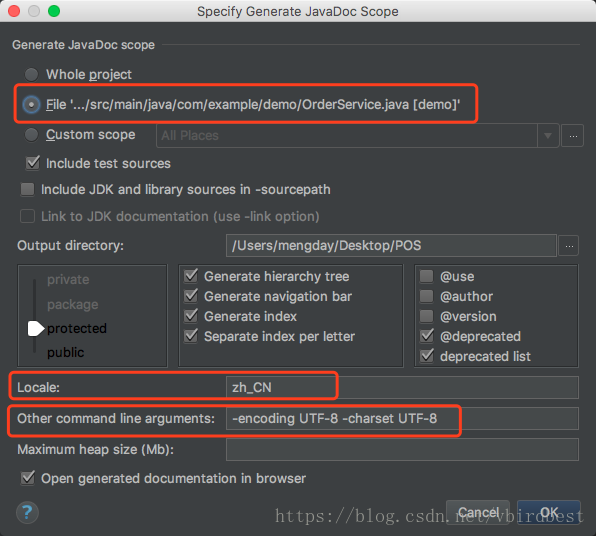
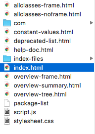
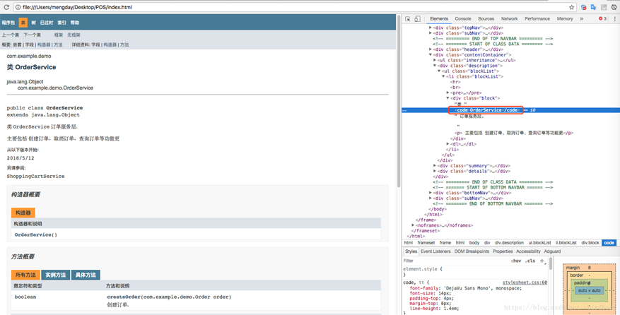
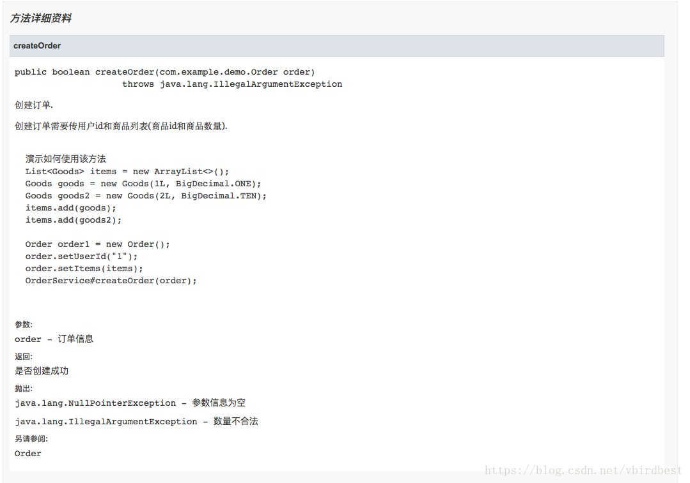

# Javadoc 具体使用详解

 更新时间：2020年08月10日 09:46:24  转载 作者：vbirdbest  

这篇文章主要介绍了Javadoc 具体使用详解，文中通过示例代码介绍的非常详细，对大家的学习或者工作具有一定的参考学习价值，需要的朋友们下面随着小编来一起学习学习吧

很多程序对Javadoc都不重视，认识不到Javadoc的作用，很多人都是这样认为的：“我只要写好功能就够了，写Javadoc太浪费时间，也没啥作用，还不如用写Javadoc的时间再多些个功能呢！”，我们知道注释是为了解释代码的作用的，是为了将来给自己或者别人快速了解代码的，在方法内一般用行注释//的比较多，是针对一小块代码做出解释的，而Javadoc的作用是针对整个方法或者整个类做一个简要的概述的，使得别人不通过看具体方法代码就能知道某个方法或者某个类的作用和功能。写了Javadoc的在别人使用到类时，将鼠标悬停到类上或者方法上，javadoc会以提示信息显示出来，这样开发者在跳进源代码中就能知道类或者方法的作用。说到这里可能还是有很多人不能认同这种观点，还是认识不到Javadoc的作用。我们看一下Spring框架，随便打开一个文件可以看到一般注释内容都要比代码量多，有的时候注释量占整个文件内容的2/3。有人还是认为Spring是大框架，每个Java项目都在用他们写的好事应该的，我们公司自己的项目就我们公司几个人看，没必要花时间去写多余的Javadoc，那你是不是该这么认为了Spring大厂中的顶尖大牛都这么做，我们小菜鸟是不是对自己要求更严格一些，向大牛去学习呢？！假如在公司A程序员写了Javadoc，B程序员只写功能不写Javadoc不写注释，那么一般会认为A程序员会比B程序员做的好。认识不到Javadoc的作用就像认识不到设计模式的作用一样，很多人都认识不到设计模式的作用，认为将简单问题复杂化，你看一下每个大框架都会用到多种设计模式，如果只知道写增删改查，再工作几年仍然不会有提高。

**一：简介**

Javadoc用于描述类或者方法的作用。Javadoc可以写在类上面和方法上面。

https://docs.oracle.com/javase/7/docs/technotes/tools/windows/javadoc.html

**二：写在类上面的Javadoc**

写在类上的文档标注一般分为三段：

- 第一段：概要描述，通常用一句或者一段话简要描述该类的作用，以英文句号作为结束
- 第二段：详细描述，通常用一段或者多段话来详细描述该类的作用，一般每段话都以英文句号作为结束
- 第三段：文档标注，用于标注作者、创建时间、参阅类等信息

**第一段：概要描述**

单行示例：

```
package` `org.springframework.util;``/**`` ``* Miscellaneous {@link String} utility methods.`` ``* `` ``*/``public` `abstract` `class` `StringUtils {
```

多行示例：

```
package` `java.lang;` `/**`` ``* Class {@code Object} is the root of the class hierarchy.`` ``* Every class has {@code Object} as a superclass. All objects,`` ``* including arrays, implement the methods of this class.`` ``*/``public` `class` `Object {}
```

在注释中出现以@开头东东被称之为Javadoc文档标记，是JDK定义好的，如@author、@version、@since、@see、@link、@code、@param、@return、@exception、@throws等。

\1. @link：{@link 包名.类名#方法名(参数类型)} 用于快速链接到相关代码

@link的使用语法`{@link 包名.类名#方法名(参数类型)}`，其中当包名在当前类中已经导入了包名可以省略，可以只是一个类名，也可以是仅仅是一个方法名，也可以是类名.方法名，使用此文档标记的类或者方法，可用通过按住Ctrl键+单击 可以快速跳到相应的类或者方法上，解析成html其实就是使用< code> 包名.类名#方法名(参数类型)< /code>

@link示例

```
// 完全限定的类名``{``@link` `java.lang.Character}` `// 省略包名``{``@link` `String}` `// 省略类名，表示指向当前的某个方法``{``@link` `#length()}` `// 包名.类名.方法名(参数类型)``{``@link` `java.lang.String#charAt(``int``)}
```

\2. @code： {@code text} 将文本标记为code

{@code text} 会被解析成`<code> text </code>`
将文本标记为代码样式的文本，在code内部可以使用 < 、> 等不会被解释成html标签, code标签有自己的样式

一般在Javadoc中只要涉及到类名或者方法名，都需要使用@code进行标记。

**第二段：详细描述**

详细描述一般用一段或者几个锻炼来详细描述类的作用，详细描述中可以使用html标签，如`<p>、<pre>、<a>、<ul>、<i>`等标签， 通常详细描述都以段落p标签开始。
详细描述和概要描述中间通常有一个空行来分割

```
package` `org.springframework.util;` `/**`` ``* Miscellaneous {@link String} utility methods.`` ``*`` ``* <p>Mainly for internal use within the framework; consider`` ``* <a href="http://commons.apache.org/proper/commons-lang/" rel="external nofollow" rel="external nofollow" >Apache's Commons Lang</a>`` ``* for a more comprehensive suite of {@code String} utilities.`` ``*`` ``* <p>This class delivers some simple functionality that should really be`` ``* provided by the core Java {@link String} and {@link StringBuilder}`` ``* classes. It also provides easy-to-use methods to convert between`` ``* delimited strings, such as CSV strings, and collections and arrays.`` ``*`` ``*/``public` `abstract` `class` `StringUtils {
```

一般段落都用p标签来标记，凡涉及到类名和方法名都用@code标记，凡涉及到组织的，一般用a标签提供出来链接地址。

\3. @param

一般类中支持泛型时会通过@param来解释泛型的类型

```
/**``* @param <E> the type of elements in this list``*/``public` `interface` `List<E> ``extends` `Collection<E> {}
```

\4. @author

详细描述后面一般使用@author来标记作者，如果一个文件有多个作者来维护就标记多个@author，@author 后面可以跟作者姓名(也可以附带邮箱地址)、组织名称(也可以附带组织官网地址)

```
// 纯文本作者``@author` `Rod Johnson` `// 纯文本作者，邮件``@author` `Igor Hersht, igorh``@ca``.ibm.com` `// 超链接邮件 纯文本作者``@author` `<a href=``"mailto:ovidiu@cup.hp.com"` `rel=``"external nofollow"` `>Ovidiu Predescu</a>` `// 纯文本邮件``@author` `shane_curcuru``@us``.ibm.com` `// 纯文本 组织``@author` `Apache Software Foundation` `// 超链接组织地址 纯文本组织``@author` `<a href=``"https://jakarta.apache.org/turbine"` `rel=``"external nofollow"` `> Apache Jakarta Turbine</a>
```

\5. @see 另请参阅

@see 一般用于标记该类相关联的类,@see即可以用在类上，也可以用在方法上。

```
/**`` ``* ``@see` `IntStream`` ``* ``@see` `LongStream`` ``* ``@see` `DoubleStream`` ``* ``@see` `<a href=``"package-summary.html"` `rel=``"external nofollow"` `>java.util.stream</a>`` ``* /``public` `interface` `Stream<T> ``extends` `BaseStream<T, Stream<T>> {}
```

\6. @since 从以下版本开始

@since 一般用于标记文件创建时项目当时对应的版本，一般后面跟版本号，也可以跟是一个时间，表示文件当前创建的时间

```
package` `java.util.stream;` `/**``* @since 1.8``*/``public` `interface` `Stream<T> ``extends` `BaseStream<T, Stream<T>> {}
package` `org.springframework.util;` `/**``* @since 16 April 2001``*/``public` `abstract` `class` `StringUtils {}
```

\7. @version 版本

@version 用于标记当前版本，默认为1.0

```
package` `com.sun.org.apache.xml.internal.resolver;`` ``/**`` ``* @version 1.0`` ``*/``public` `class` `Resolver ``extends` `Catalog {}
```

**三：写在方法上的Javadoc**

写在方法上的文档标注一般分为三段：

- 第一段：概要描述，通常用一句或者一段话简要描述该方法的作用，以英文句号作为结束
- 第二段：详细描述，通常用一段或者多段话来详细描述该方法的作用，一般每段话都以英文句号作为结束
- 第三段：文档标注，用于标注参数、返回值、异常、参阅等

方法详细描述上经常使用html标签来，通常都以p标签开始，而且p标签通常都是单标签，不使用结束标签，其中使用最多的就是p标签和pre标签,ul标签, i标签。

pre元素可定义预格式化的文本。被包围在pre元素中的文本通常会保留空格和换行符。而文本也会呈现为等宽字体，pre标签的一个常见应用就是用来表示计算机的源代码。

一般p经常结合pre使用，或者pre结合@code共同使用(推荐@code方式)
一般经常使用pre来举例如何使用方法

注意：pre>标签中如果有小于号、大于号、例如泛型 在生产javadoc时会报错

```
/**`` ``* Check whether the given {@code CharSequence} contains actual <em>text</em>.`` ``* <p>More specifically, this method returns {@code true} if the`` ``* {@code CharSequence} is not {@code null}, its length is greater than`` ``* 0, and it contains at least one non-whitespace character.`` ``* <p><pre class="code">`` ``* StringUtils.hasText(null) = false`` ``* StringUtils.hasText("") = false`` ``* StringUtils.hasText(" ") = false`` ``* StringUtils.hasText("12345") = true`` ``* StringUtils.hasText(" 12345 ") = true`` ``* </pre>`` ``* @param str the {@code CharSequence} to check (may be {@code null})`` ``* @return {@code true} if the {@code CharSequence} is not {@code null},`` ``* its length is greater than 0, and it does not contain whitespace only`` ``* @see Character#isWhitespace`` ``*/``public` `static` `boolean` `hasText(``@Nullable` `CharSequence str) {``  ``return` `(str != ``null` `&& str.length() > ``0` `&& containsText(str));``}
{``@code``  ``Person[] men = people.stream()``      ``.filter(p -> p.getGender() == MALE)``      ``.toArray(Person[]::``new``);``}
```

\8. @param

@param 后面跟参数名，再跟参数描述

```
/**``* @param str the {@code CharSequence} to check (may be {@code null})``*/``public` `static` `boolean` `containsWhitespace(``@Nullable` `CharSequence str) {}
```

\9. @return

@return 跟返回值的描述

```
/**``* @return {@code true} if the {@code String} is not {@code null}, its``*/``public` `static` `boolean` `hasText(``@Nullable` `String str){}
```

\10. @throws

@throws 跟异常类型 异常描述 , 用于描述方法内部可能抛出的异常

```
/**``* @throws IllegalArgumentException when the given source contains invalid encoded sequences``*/``public` `static` `String uriDecode(String source, Charset charset){}
```

\11. @exception

用于描述方法签名throws对应的异常

```
/**``* @exception IllegalArgumentException if <code>key</code> is null.``*/``public` `static` `Object get(String key) ``throws` `IllegalArgumentException {}
```

\12. @see

@see既可以用来类上也可以用在方法上，表示可以参考的类或者方法

```
/**``* @exception IllegalArgumentException if <code>key</code> is null.``*/``public` `static` `Object get(String key) ``throws` `IllegalArgumentException {}
```

\13. @value

用于标注在常量上，{@value} 用于表示常量的值

```
/** 默认数量 {@value} */``private` `static` `final` `Integer QUANTITY = ``1``;
```

\14. @inheritDoc

@inheritDoc用于注解在重写方法或者子类上，用于继承父类中的Javadoc

- 基类的文档注释被继承到了子类
- 子类可以再加入自己的注释（特殊化扩展）
- @return @param @throws 也会被继承

**四：示例**

spring-core中的StringUtils 示例

```
package` `org.springframework.util;` `/**`` ``* Miscellaneous {@link String} utility methods.`` ``*`` ``* <p>Mainly for internal use within the framework; consider`` ``* <a href="http://commons.apache.org/proper/commons-lang/" rel="external nofollow" rel="external nofollow" >Apache's Commons Lang</a>`` ``* for a more comprehensive suite of {@code String} utilities.`` ``*`` ``* <p>This class delivers some simple functionality that should really be`` ``* provided by the core Java {@link String} and {@link StringBuilder}`` ``* classes. It also provides easy-to-use methods to convert between`` ``* delimited strings, such as CSV strings, and collections and arrays.`` ``*`` ``* @author Rod Johnson`` ``* @author Juergen Hoeller`` ``* @author Keith Donald`` ``* @author Rob Harrop`` ``* @author Rick Evans`` ``* @author Arjen Poutsma`` ``* @author Sam Brannen`` ``* @author Brian Clozel`` ``* @since 16 April 2001`` ``*/``public` `abstract` `class` `StringUtils {` `  ``/**``   ``* Decode the given encoded URI component value. Based on the following rules:``   ``* <ul>``   ``* <li>Alphanumeric characters {@code "a"} through {@code "z"}, {@code "A"} through {@code "Z"},``   ``* and {@code "0"} through {@code "9"} stay the same.</li>``   ``* <li>Special characters {@code "-"}, {@code "_"}, {@code "."}, and {@code "*"} stay the same.</li>``   ``* <li>A sequence "{@code %<i>xy</i>}" is interpreted as a hexadecimal representation of the character.</li>``   ``* </ul>``   ``* ``   ``* @param source the encoded String``   ``* @param charset the character set``   ``* @return the decoded value``   ``* @throws IllegalArgumentException when the given source contains invalid encoded sequences``   ``* @since 5.0``   ``* @see java.net.URLDecoder#decode(String, String)``   ``*/``  ``public` `static` `String uriDecode(String source, Charset charset) {}
package` `com.example.demo;` `/**`` ``* 类 {@code OrderService} 订单服务层.`` ``*`` ``* <p> 主要包括 创建订单、取消订单、查询订单等功能更`` ``*`` ``* @see Order`` ``* @author <a href="mailto:mengday.zhang@gmail.com" rel="external nofollow" >Mengday Zhang</a>`` ``* @since 2018/5/12`` ``*/``public` `class` `OrderService {` `  ``/** 默认数量 {@value} */`` ``private` `static` `final` `Integer QUANTITY = ``1``;` ` ``/**``  ``* 创建订单.``  ``*``  ``* <p> 创建订单需要传用户id和商品列表(商品id和商品数量).``  ``*``  ``* <p><pre>{@code``  ``* 演示如何使用该方法``  ``* List<Goods> items = new ArrayList<>();``  ``* Goods goods = new Goods(1L, BigDecimal.ONE);``  ``* Goods goods2 = new Goods(2L, BigDecimal.TEN);``  ``* items.add(goods);``  ``* items.add(goods2);``  ``*``  ``* Order order1 = new Order();``  ``* order.setUserId("1");``  ``* order.setItems(items);``  ``* OrderService#createOrder(order);``  ``* }``  ``* </pre>``  ``*``  ``* @param order 订单信息``  ``* @throws NullPointerException 参数信息为空``  ``* @exception IllegalArgumentException 数量不合法``  ``* @return 是否创建成功``  ``* @version 1.0``  ``* @see {@link Order}``  ``*/`` ``public` `boolean` `createOrder(Order order) ``throws` `IllegalArgumentException{``  ``Objects.requireNonNull(order);` `  ``List<Goods> items = order.getItems();``  ``items.forEach(goods -> {``   ``BigDecimal quantity = goods.getQuantity();``   ``if` `(quantity == ``null` `|| BigDecimal.ZERO.compareTo(quantity) == ``0``) {``    ``throw` `new` `IllegalArgumentException();``   ``}``  ``});` `  ``System.out.println(``"create order..."``);` `  ``return` `true``;`` ``}``}
```

**五：生成Javadoc**

idea生成javadoc https://www.jb51.net/article/192943.htm

通过IDEA生成Javadoc： Tools --> Generate JavaDoc -->
注意要配置编码，如果不配送为生成乱码，还需要配置Output directory









到此这篇关于Javadoc 具体使用详解的文章就介绍到这了,更多相关Javadoc 使用内容请搜索脚本之家以前的文章或继续浏览下面的相关文章希望大家以后多多支持脚本之家！