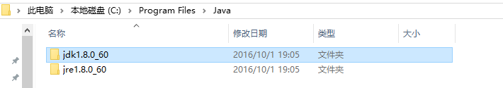
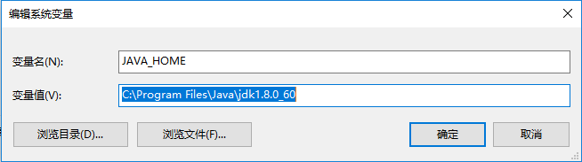

# JDK环境变量配置

JDK默认安装后jdk和jre都在C:\Program Files\Java目录下。

1. 配置环境变量：右击“我的电脑”-->"属性"-->"高级系统设置"-->"高级"-->"环境变量"   

    1）在系统变量里新建"JAVA_HOME"变量，变量值为： `C:\Program Files\Java\jdk1.8.0_60` （根据自己的jdk的安装路径填写）

   

   2）在系统变量里新建"classpath"变量，变量值为：  `.;%JAVA_HOME%\lib;%JAVA_HOME%\lib\tools.jar`  (注意最前面有一点)  

   3）找到path变量（已存在不用新建）添加变量值：`%JAVA_HOME%\bin;%JAVA_HOME%\jre\bin`  （注意变量值之间用";"隔开。注意原来Path的变量值末尾有没有;号，如果没有，先输入;号再输入。）如果你的系统是Windows10，就相对方便多了，不用担心这个";"。

2. “Windows+R”-->输入“cmd”-->Enter，输入`java -version`(记得中间有个空格)，如果显示jdk版本信息就说明环境变量配置成功了。

    