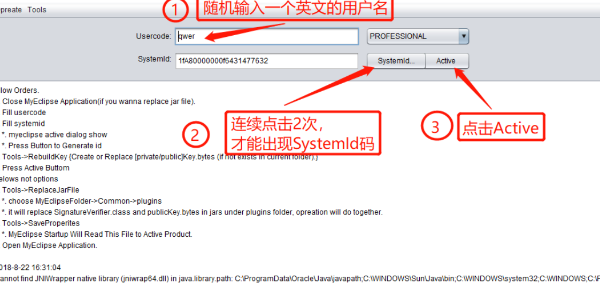

## 一、安装步骤

- 运行下载的.exe文件。点击“Next”。稍等片刻接受条款，点击“Next”
- 可以自行更改安装目录，最好新建一个文件夹，因为它会有很多文件在一起安装进去，选择适合自己的系统，笔者系统为64位；稍等片刻，即可安装完成
- 安装完成，**不要需要运行一遍软件**，点击“Finish”即可。软件打开之后，主界面显示了未激活状态
- 至此，MyEclipse2017已经安装完成（未激活），接下来将对该软件进行激活。

## **二、破解步骤**

- 打开破解文件夹，双击“crack.bat”文件，可以打开“crack2017.jat”文件， 如果打不开，请先安装jdk
  在弹出的界面中按照图片中的顺序依次操作

  

  点击Tools——>SaveProperities，窗口中出现相应的提示即

- 打开软件的安装目录
  **将破解文件中的patch文件夹中的文件复制到安装路径下plugins文件夹中**，并选择“替换目标中的文件”
- 重新打开MyEclipse2017，依次点击Help——>Subscription Information
- 出现ID和Code即表明激活成功
  至此，MyEclipse2017安装完成并激活成功！！！

## 三、Tomcat服务器配置

MyEclipse自带了tomcat，但是我们可以自己下载和配置

1. 下载tomcat：`http://tomcat.apache.org/`，选择自己想要的版本下载，然后安装或者解压好。

2. 打开MyEclipse，window-->preferences-->Java-->Installed JREs；点击Add-->Standard VM，下一步。
   点击JRE home右边的Directory，选择jdk安装目录，Finish。
   勾选咱们刚才选择的jdk,Apply-->OK。

3. 接着window-->preferences-->servers-->Runtime Environment-->Add-->Tomcat，这里选择你对应的tomcat版本，记得勾选Create a new local server。点下一步
4. 点击Browser，选择Tomcat安装或解压目录。JRE选择咱们自己的jdk。Finish-->OK，到这里我们配置完成，就可以进行Java EE开发了。

## 四、运行测试

1. File-->new-->Web Project，输入项目名,其他默认，Finish。
   在index.jsp文件的body里输入HelloWorld！
   点击项目名右键Run As-->MyEclipse Server Application。选择刚才配置好的Tomcat，我的是Tomcat 9.0，Finish。