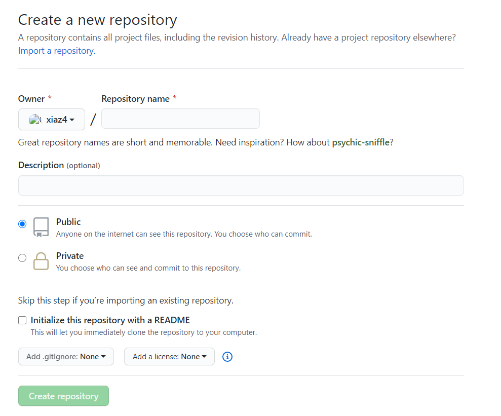
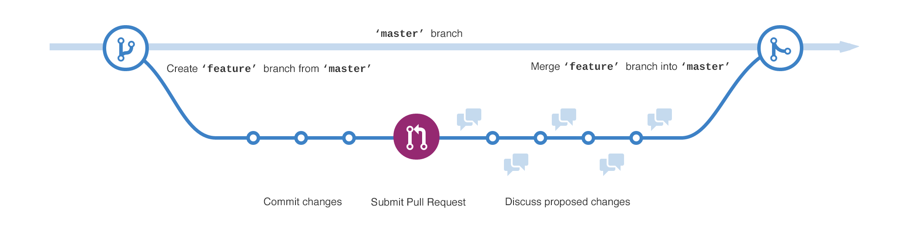
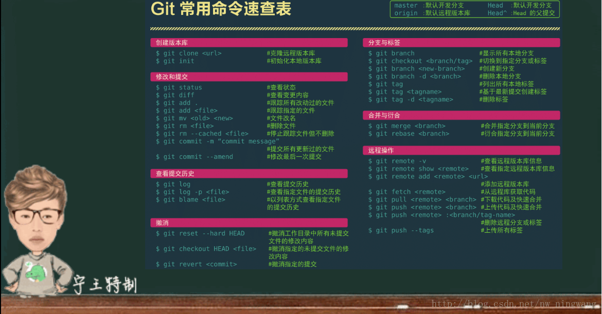

# Git与Github使用

## GitHub

> GitHub是用于**版本控制和协作的代码托管平台**，它可以让您和其他人在任何地方协同工作。GitHub 可以托管各种Git版本库，并提供一个web界面，但与其它像 SourceForge或Google Code这样的服务不同，GitHub的独特卖点在于从另外一个项目进行分支的简易性。
>

为一个项目贡献代码非常简单：首先点击项目站点的“fork”的按钮，然后将代码检出并将修改加入到刚才分出的代码库中，最后通过内建的“pull request”机制向项目负责人申请代码合并。已经有人将GitHub称为代码玩家的MySpace。

###  一：创建新的Git仓库

##### 1：创建存储库

　　一个库通常用于举办单个项目，存储库可以包含文件夹和文件，图像，视频，电子表格和数据集等等，你的项目需要的任何内容，我们认为包括README或者包含项目信息的文件。GitHub可以在创建新存储库的同时轻松添加一个。

　　如下图所示：我们可以添加一个新的仓库，并且添加描述，最后**单击Create repository**。

#### 2：创建一个分支（Create a Branch）

　　分支是一次处理不同版本的存储库的方法。

　　**默认情况下，我们的存储库有一个名为master的分支branch，该分支被认为是权威分支**。我们在使用分支进行试验并在提交之前进行编辑master。

　　当你在分支机构上创建master 分支时，我们正在制作该master时间点的副本或者快照，如果其他人master在我们的分支机构上工作时对branch做了更改，则可以提取这些更新。

　　在GitHub，我们的开发人员，编写人员和设计人员使用分支来保持错误修复和功能工作与我们的master分支分开，当更改准备就绪时候，他们讲其分支合并到master。

#### 3：创建一个新分支

1. 转到新的仓库，也就是我们的仓库hello-world
2. 单击文件列表顶部的下拉列表：master
3. 在新分支文本框中输入分支名称xxxxx
4. 选择蓝色的创建分支框或者按键盘的Enter

### 4：制作并提交更改

　　现在我们在readme-edits分支的代码视图中，这是一个master的副本，让我们做一些修改吧。

1. 单击该README.md文件
2. 点击要编辑的文件上糊涂右上角的铅笔图标
3. 在编译器中，写一点东西
4. 编写描述更改的提交消息
5. 单击提交按钮

### 5：打开Pull请求

　　Pull Requests是GitHub上合作的核心，当我们打开拉取请求时候，你提出了更改并请求某人审核并提取我们的贡献，并将其合并到他们的分支中，拉请求显示来自于两个分支的内容的差异。

- 点击Pull Requests
- 在Example Comparisons中比对代码
- 在比较页面查看差异，确保其是我们要提交的内容
- 如果是，点击Create pull request
- 为我们的拉取请求提供标题，并写下更改的简要说明
- 合并我们的Pull Requests，将我们的readme-edits分支合并到master分支上。
- Delete branch
- 恢复的话点击Restore branch

## GIT 

> Git 是一个开源的分布式版本控制系统，可以有效、高速的处理从很小到非常大的项目 版本管理。Git 是 Linus Torvalds 为了帮助管理 Linux 内核开发而开发的一个开放源码的版 本控制软件
>
> 分布式相比于集中式的最大区别在于开发者可以提交到本地，每个开发者通过克隆（git clone），在本地机器上拷贝一个完整的 Git 仓库。 从一般开发者的角度来看，git 有以下功能： 从服务器上克隆完整的 Git 仓库（包括代码和版本信息）到单机上、在自己的机器上根 据不同的开发目的，创建分支，修改代码、在单机上自己创建的分支上提交代码、在单机上 合并分支、把服务器上最新版的代码 fetch 下来，然后跟自己的主分支合并等。 

**优点：**

适合分布式开发，强调个体。公共服务器压力和数据量都不会太大。速度快、灵活。任 意两个开发者之间可以很容易的解决冲突。离线工作。 缺点： 资料少（起码中文资料很少）。学习周期相对而言比较长。不符合常规思维。代码保密性差，一旦开发者把整个库克隆下来就可以完全公开所有代码和版本信息。 

因其资料的公开性，导致大型商业化工程几乎不会使用 GIT 来托管工程版本信息（除非搭建企业私服）。

### Git常用命令速查表

### Git工作流程

### 分支和合并

git 分支

- 主分支
  - master分支：存放随时可供生产环境中的部署的代码
  - develop分支：存放当前最新开发成果的分支，当代码足够稳定时可以合并到master分支上去。
- 辅助分支
  - feature分支：开发新功能使用，最终合并到develop分支或抛弃掉
  - release分支：做小的缺陷修正、准备发布版本所需的各项说明信息
  - hotfix分支：代码的紧急修复工作

**查看现存分支**:
 `git branch`

**创建分支** : 
`git branch 分之名称`
当前使用的分支会显示成为绿色, 前面带有 " * "， 如果不是当前使用的分支, 显示的是白色, 并且没有 " * " 前缀

**切换分支** :
`git checkout 分支名称`
在分支进行操作，文件的改变不会体现在master主分支中，主分支改变， 会体现在其它分支中

**提交分支命令** :
`git push origin 分支名称` 
将本地的分支提交到 GitHub中

**合并分支命令**: 
`git merge 分支名称`
合并分支之后，分支中有的文件在主分支中也会显示，相当于将branch1 分支中的文件拷贝了一份到master分支中

**删除分支命令** : 
`git branch -d 分支名称`
强制删除分支命令 : 如果分支还没有被合并的话， Git是不允许删除这个分支的，此时要想删除该分支，就只能使用下面的命令强制删除该分支：`git branch -D 分支名称`

### 标签使用(Tag)

> **标签作用**: 在开发的一些关键时期，使用标签来记录这些关键时刻， 例如发布版本, 有重大修改, 升级的时候, 会使用标签记录这些时刻, 来永久标记项目中的关键历史时刻

**标签分类**: Git中的标签分为 轻量级标签(lightweight) 和 带注释的标签(annotated), 一般情况下推荐使用带注释的标签, 如果标签是临时的可以采用轻量级标签

- 轻量级标签 : 轻量级标签中的信息含量很少，这种标签只代表某时刻代码的提交，相当于指向这个提交的指针
- 带注释标签 : 这种标签是一种校验和, 包含标签名，邮箱，日期，标签信息， GPG签名和验证，它相当于一个对象，封装了这些信息

**查看标签**: 
`git tag` 
列出的标签安装ASCII字母顺序确定, 排序没有很明确的意义
使用限定列出限定后的标签 : 
`git tag -l v1.*` 

**创建标签** :
`git tag v2.0` 
`git tag -a v2.1 -m 'first version'` 
-m后跟的是注释信息，当使用git show v2.1的时候，会显示这个注释信息
`git tag -s v2.1 -m 'GPG version'` 
创建GPG私钥的注释标签

**删除标签**: 
`git tag -d 标签名`

**共享标签**: 
`git push origin --tags` 
即将标签提交到GitHub中

### .gitignore文件

**屏蔽文件** : 
.gitignore文件是告诉Git哪些目录或者文件需要忽略，这些文件将不被提交;

**常用场景** : 
写完代码后会执行变异调试等操作，使用 .gitignore 文件将这些编译后的文件屏蔽，这些文件不需要Git工具进行管理

**.gitignore位置** : 
项目根目录下

**过滤模式** : 
Git中的 .gitignore 中有两种模式，开放模式和保守模式，保守模式的优先级要高于开放模式

- 开放模式 : 
  设置哪些文件和目录被过滤，凡是在文件中列出的文件或者目录都要被过滤掉
  - 过滤目录 : /bin/ 就是将bin目录过滤，该文件下的所有目录和文件都不被提交
  - 过滤某个类型文件 : *.zip *.class 就是过滤zip 和 class 后缀的文件，这些文件不被提交
  - 过滤指定文件 : /gen/R.java，过滤该文件，该文件不被提交

- 保守模式 : 
  设置哪些文件不被过滤, 凡是列在其中的文件都要完整的提交上去
  - 跟踪目录 : !/src，该目录下的所有文件都要被提交
  - 跟踪某类文件 : !*.java，凡是java文件都要保留
  - 跟踪指定文件 : !/AndroidManifest.xml，该文件需要保留，提交上去

**配置原则** : 
一般情况下采用开放模式与保守模式共同使用

**eg** : 一个目录下有很多目录和文件，当我们只需要保留其中的一个文件的时候，先用开放模式不保留这些文件，然后用保守模式将这个文件留下来，保守模式的优先级要高于开放模式

## Git在IntelliJ IDEA下的使用