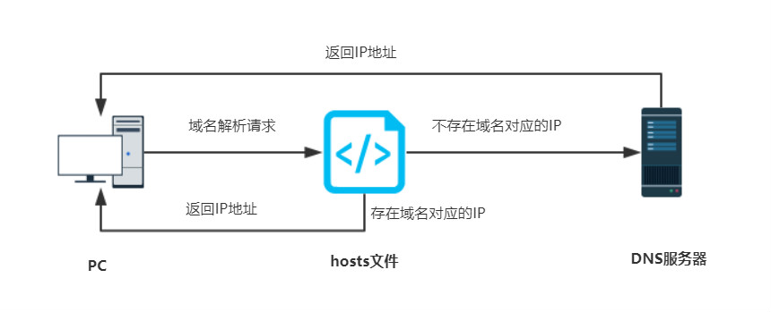
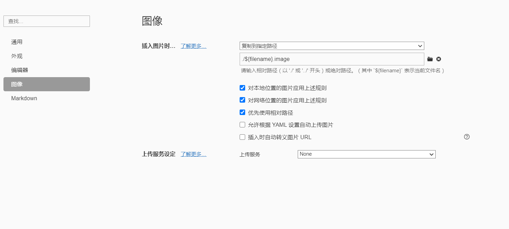
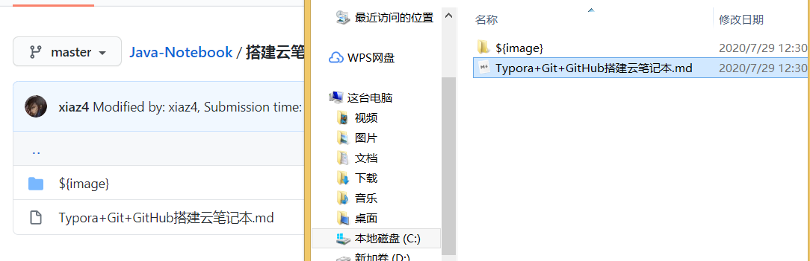
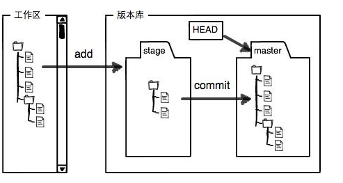
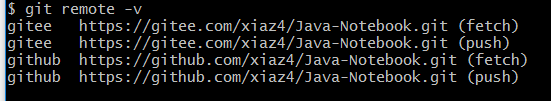
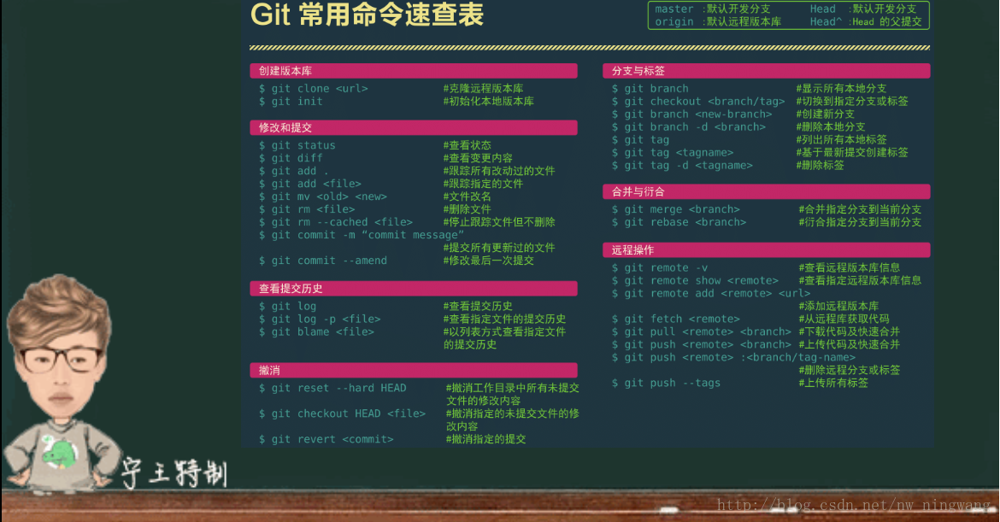

## 一、Typora+Git+GitHub搭建云笔记本

### 安装与设置

> 1. Typora
>
>    https://www.typora.io/windows/typora-setup-x64.exe
>
> 2. Git
>
>    https://git-scm.com/download/win

### 配置GitHub

1. 注册，登录

2. 进入Github首页，点击New repository新建一个项目

3. 填写相应信息后点击create即可 

   > Repository name: 仓库名称
   >
   > Description(可选): 仓库描述介绍
   >
   > Public, Private : 仓库权限（公开共享，私有或指定合作者）
   >
   > Initialize this repository with a README: 添加一个README.md
   >
   > gitignore: 不需要进行版本管理的仓库类型，对应生成文件.gitignore
   >
   > license: 证书类型，对应生成文件LICENSE

4. 点击Clone or dowload会出现一个地址`https://github.com/xiaz4/Java-Notebook.git`copy这个地址备用。

**注意：Github图片不显示**

- 修改C:\Windows\System32\drivers\etc下的hosts文件

- 在文件末尾添加：

  ```bash
  # GitHub Start 
  140.82.112.4      github.com
  140.82.114.20     gist.github.com
  
  199.232.68.133    raw.githubusercontent.com
  # GitHub End
  ```
  
  IP地址经常变动，如果改动hosts还是不显示，可以利用`https://www.ipaddress.com/` 。查询对应的IP地址。例如：raw.githubusercontent.com，查询出199.232.68.133。
  



#### 配置SSH

1. 进入 `https://github.com/settings/keys`
2. 如果页面里已经有一些 key，就点「delete」按钮把这些 key 全删掉。如果没有，就往下看
3. 点击 **New SSH key**，你需要输入 Title 和 Key，但是你现在没有 key，往下看
4. 打开 Git Bash
5. 复制并运行 `rm -rf ~/.ssh/*` 把现有的 ssh key 都删掉，这句命令行如果你多打一个空格，可能就要重装系统了，建议复制运行。
6. 运行 `ssh-keygen -t rsa -b 4096 -C "你的邮箱"`，注意填写你的邮箱！
7. 按回车三次
8. 运行 `cat ~/.ssh/id_rsa.pub`，得到一串东西，完整的复制这串东西
9. 回到上面第 3 步的页面，在 Title 输入名称，如「我的第一个 key」
10. 在 Key 里粘贴8中你复制的那串东西
11. 点击 Add SSH key
12. 回到 Git Bash
13. 运行 `ssh -T git@github.com`，你可能会看到这样的提示：


输入 yes 回车！

1. 然后如果你看到 `Permission denied (publickey).` 就说明你失败了，请回到第 1 步重来，是的，回到第 1 步重来；如果你看到 `Hi xxx! You've successfully authenticated, but GitHub does not provide shell access.` 就说明你成功了！

好了，终于添加了一个SSH key，了解原理就看这篇 [文章](http://www.ruanyifeng.com/blog/2011/12/ssh_remote_login.html)

**注意：**

- 一台电脑只需要一个 SSH key
- 一个 SSH key 可以访问你的所有仓库，即使你有 1000000 个仓库，都没问题
- 如果你新买了电脑，就在新电脑上重新生成一个 SSH key，把这个 key 也上传到 GitHub，它可以和之前的 key 共存在 GitHub 上
- 如果你把 key 从电脑上删除了，重新生成一个 key 即可，替换之前的 key

### 配置Typora

1. 本地新建存放笔记的文件夹，设置打开Typora时自动打开此文件夹。

   文件->偏好设置->通用->启动选项->打开指定文件夹（本地新建存放笔记的文件夹）

2. 设置图片的存放模式，这样图片就会被自动分类，从图床中解脱出来

   文件->偏好设置->通用->图像->

   
   
   

3. 打开开启调试模式，可以在编辑器界面右键，看到审查元素，进行自定义的样式编辑

   

**注意：图片地址不能出现中文，要不然/会变成%。（不过也不是影响显示）**

### 配置Git

#### git全局设置

```bash
#不需要跟GitHub账号保持一致，最好你的GitHub名字与邮箱
git config --global user.name 'xiaz4'
git config --global user.email '1178383106@qq.com'
#默认push
git config --global push.default matching
#解决 Windows Git Bash、Linux 下的中文转码问题
git config --global core.quotepath false
#设置大小写敏感
git config --global core.ignorecase false
#vim
git config --global core.editor "vim"
```


#### 创建本地 git 仓库，并与Git仓库关联

自己自定义一个文件夹，例如Note；

```bash
#进入Note文件夹，右键bash here
git init
#此命令初始化一个新本地仓库
mkdir Java-Notebook
#进入仓库
cd Java-Notebook
#它在工作目录下生成一个名为.git的隐藏文件夹。
git init
```

**.git文件夹里config变成**

```bash
[core]
	repositoryformatversion = 0
	filemode = false
	bare = false
	logallrefupdates = true
	symlinks = false
	ignorecase = true
```

#### 如果把github上面的仓库克隆到本地

```bash
#克隆
git clone https://github.com/xiaz4/Java-Notebook.git
#使用cnpmjs,一个代理服务器，加速
git clone https://github.com.cnpmjs.org/xiaz4/Java-Notebook.git
```

- 本地项目文件夹下面就会多出**一个文件夹**，该文件夹名即为你**github上面的项目名（Java-Notebook）**，把需要上传的文件拷贝到刚下载的新文件夹内

- 接着继续输入命令 cd Java-Notebook，进入Java-Notebook文件夹

- 输入以下代码即可完成其他剩余操作：

   ```bash
   #（注：别忘记后面的.，.前有空。此操作是把Java-Notebook文件夹下面的文件都添加进来）
   git add .  
   
   #（注：“提交信息”里面换成你需要，如“first commit”；　这里的文件描述必须要有，否则无法提交）
   git commit  -m  "提交信息"  
   
   #（注：此操作目的是把本地仓库push到github上面，此步骤需要你输入GitHub帐号和密码）
   git push -u origin master  
   ```

   **补充：**
   
   可能你对**git**提交文件感到疑惑，为什么要提交3次，我们先来看张图
   
   
   
   > git add 把文件从工作区提交到stage（暂存区）
   >
   > git commit 把文件从stage（暂存区）提交到master（当前分支）
   >
   > git push 把文件从master（当前分支）提交到github

#### 配置GitHub或码云的方式同步

```bash
#关联GitHub或码云的远程库，查看.git下的config可看到关联
git remote add github https://github.com/xiaz4/Java-Notebook.git
#git remote add gitee https://gitee.com/xiaz4/Java-Notebook.git
```

```ruby
#.git文件夹里config文件内容改变
[core]
	repositoryformatversion = 0
	filemode = false
	bare = false
	logallrefupdates = true
	symlinks = false
	ignorecase = true
[remote "origin"]
    url = https://github.com/xiaz4/Java-Notebook.git
    fetch = +refs/heads/*:refs/remotes/github/*
[branch "master"]
    remote = origin
    merge = refs/heads/master
```

修改.git文件夹内的config文件：将上述文件内容[remote "origin"]内容复制，修改origin名称，内容如下：

```ruby
[core]
	repositoryformatversion = 0
	filemode = false
	bare = false
	logallrefupdates = true
	symlinks = false
	ignorecase = true
[remote "github"]
    url = https://github.com/xiaz4/Java-Notebook.git
    fetch = +refs/heads/*:refs/remotes/github/*
[remote "gitee"]
    url = https://gitee.com/xiaz4/Java-Notebook.git
    fetch = +refs/heads/*:refs/remotes/gitee/*
[branch "master"]
    remote = origin
    merge = refs/heads/master
```

**git remote -v查看远程库信息**



### 通过脚本推送拉取文件

> 在文件夹中新建两个sh文件，右键选取Git for Window作为默认打开应用

#### GitAutoPull脚本

```bash
#!/bin/bash
#上面中的 #! 是一种约定标记, 它可以告诉系统这个脚本需要什么样的解释器来执行;
#git pull origin master

# 从github拉取更新
git pull github
# 从gitee拉取更新
git pull gitee
```

#### GitAutoPush脚本

```bash
#!/bin/bash
#上面中的 #! 是一种约定标记, 它可以告诉系统这个脚本需要什么样的解释器来执行;

echo "GitAutoPush Starting..."
time=$(date "+%Y-%m-%d %H:%M:%S")
git add .

read -t 30 -p "Reason for modification:" msg

if  [ ! "$msg" ] ;then
    echo "[commit message] Modified by: xiaz4, Submission time: ${time}"
	git commit -m "Modified by: xiaz4, Submission time: ${time}"
else
    echo "[commit message] $msg, Modified by: xiaz4, Submission time: ${time}"
	git commit -m "$msg, Modified by: xiaz4, Submission time: ${time}"
fi

#git push origin master
#提交到github
git push github master
#提交到码云
git push gitee master

echo "GitAutoPush Ending..."
```

## 二、Git的一些用法

### Git常用命令速查表



### Git工作流程

### 分支和合并

**查看现存分支**:
 `git branch`

**创建分支** : 
`git branch 分之名称`
当前使用的分支会显示成为绿色, 前面带有 " * "， 如果不是当前使用的分支, 显示的是白色, 并且没有 " * " 前缀

**切换分支** :
`git checkout 分支名称`
在分支进行操作，文件的改变不会体现在master主分支中，主分支改变， 会体现在其它分支中

**提交分支命令** :
`git push origin 分支名称` 
将本地的分支提交到 GitHub中

**合并分支命令**: 
`git merge 分支名称`
合并分支之后，分支中有的文件在主分支中也会显示，相当于将branch1 分支中的文件拷贝了一份到master分支中

**删除分支命令** : 
`git branch -d 分支名称`
强制删除分支命令 : 如果分支还没有被合并的话， Git是不允许删除这个分支的，此时要想删除该分支，就只能使用下面的命令强制删除该分支：`git branch -D 分支名称`


### 标签使用(Tag)

> **标签作用**: 在开发的一些关键时期，使用标签来记录这些关键时刻， 例如发布版本, 有重大修改, 升级的时候, 会使用标签记录这些时刻, 来永久标记项目中的关键历史时刻

**标签分类**: Git中的标签分为 轻量级标签(lightweight) 和 带注释的标签(annotated), 一般情况下推荐使用带注释的标签, 如果标签是临时的可以采用轻量级标签

- 轻量级标签 : 轻量级标签中的信息含量很少，这种标签只代表某时刻代码的提交，相当于指向这个提交的指针
- 带注释标签 : 这种标签是一种校验和, 包含标签名，邮箱，日期，标签信息， GPG签名和验证，它相当于一个对象，封装了这些信息

**查看标签**: 
`git tag` 
列出的标签安装ASCII字母顺序确定, 排序没有很明确的意义
使用限定列出限定后的标签 : 
`git tag -l v1.*` 

**创建标签** :
`git tag v2.0` 
`git tag -a v2.1 -m 'first version'` 
-m后跟的是注释信息，当使用git show v2.1的时候，会显示这个注释信息
`git tag -s v2.1 -m 'GPG version'` 
创建GPG私钥的注释标签

**删除标签**: 
`git tag -d 标签名`

**共享标签**: 
`git push origin --tags` 
即将标签提交到GitHub中

### .gitignore文件

**屏蔽文件** : 
.gitignore文件是告诉Git哪些目录或者文件需要忽略，这些文件将不被提交;

**常用场景** : 
写完代码后会执行变异调试等操作，使用 .gitignore 文件将这些编译后的文件屏蔽，这些文件不需要Git工具进行管理

**.gitignore位置** : 
项目根目录下


**过滤模式** : 
Git中的 .gitignore 中有两种模式，开放模式和保守模式，保守模式的优先级要高于开放模式

- 开放模式 : 
  设置哪些文件和目录被过滤，凡是在文件中列出的文件或者目录都要被过滤掉
  - 过滤目录 : /bin/ 就是将bin目录过滤，该文件下的所有目录和文件都不被提交
  - 过滤某个类型文件 : *.zip *.class 就是过滤zip 和 class 后缀的文件，这些文件不被提交
  - 过滤指定文件 : /gen/R.java，过滤该文件，该文件不被提交

- 保守模式 : 
  设置哪些文件不被过滤, 凡是列在其中的文件都要完整的提交上去
  - 跟踪目录 : !/src，该目录下的所有文件都要被提交
  - 跟踪某类文件 : !*.java，凡是java文件都要保留
  - 跟踪指定文件 : !/AndroidManifest.xml，该文件需要保留，提交上去

**配置原则** : 
一般情况下采用开放模式与保守模式共同使用

**eg** : 一个目录下有很多目录和文件，当我们只需要保留其中的一个文件的时候，先用开放模式不保留这些文件，然后用保守模式将这个文件留下来，保守模式的优先级要高于开放模式

## 三、报错处理

#### fatal: HttpRequestException encountered解决方法

之前在windows下一段时间git push都没什么问题，最近一旦提交就会弹出。

无论是push前先将远程仓库pull到本地仓库，还是强制push都会弹出这个问题。

网上查了一下发现是Github 禁用了TLS v1.0 and v1.1，必须更新Windows的git凭证管理器，才行。
`https://github.com/Microsoft/Git-Credential-Manager-for-Windows/releases/tag/v1.14.0`

#### Updates were rejected because the remote contains work that you do

**错误原因：**

在github上修改了文件，没有更新到本地就上传

**解决方法：**

本地和远程的文件应该合并后才能上传本地的新文件

**具体方法：**

**一般方法**

1. 先拉下来，会自动合并的（不用操心）

   ```bash
   git pull origin master
   ```

   git 在pull或者合并分支的时候有时会遇到编辑界面。可以不管(直接下面3,4步)，如果要输入解释的话就需要：

   1. 按键盘字母 i 进入insert模式

   2. 修改最上面那行黄色合并信息,可以不修改

   3. **按键盘左上角"Esc"**

   4. **输入":wq",注意是冒号+wq,按回车键即可**

2. 再上传

   ```bash
   git push -u origin master
   ```

   **也可以通过ide拉取、提交**

**暴力方法**

1. git提供了一种强制上传的方式：`git push -f origin master`根据自定义的分支名，自主修改origin。它会忽略版本不一致等问题，强制将本地库上传的远程库，但是一定要谨慎使用，因为-f会用本地库覆盖掉远程库

#### nothing to commit, working tree clean

**重新删除分支，再连接**

```bash
git branch -b test
git branch -D master
git fetch origin master
git chekcout master
git add .
git push origin master
```

#### fatal:refusing to merge unrelated histories (拒绝合并无关的历史) 错误

首先将远程仓库和本地仓库关联起来。

```bash
git branch --set-upstream-to=origin/remote_branch  your_branch
```

其中，origin/remote_branch是你本地分支对应的远程分支，your_branch是你当前的本地分支。

然后使用git pull整合远程仓库和本地仓库。

```bash
#忽略版本不同造成的影响
git pull --allow-unrelated-histories
```

重新更新、提交即可。

#### 关于从Git上传仓库至GitHub/Gitee时出现remote: error: GH007: Your push would publish a private email address.（push）

点开你的远程仓库gitee/github，我用的是gitee，在多邮箱管理下，点掉不公开我的邮箱地址，再在命令行输入pull命令