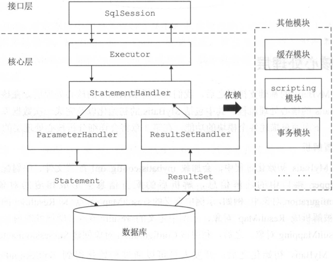
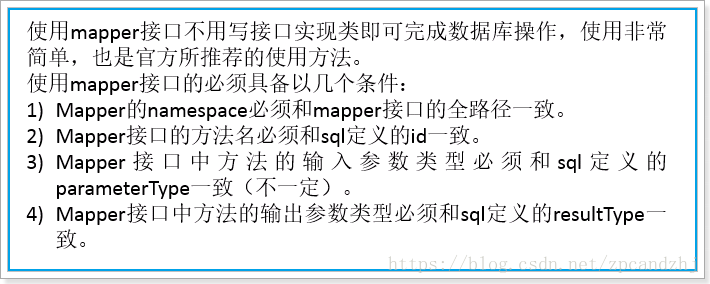

## 一、MyBatis

### 1.1 Mybatis介绍

（1）Mybatis是一个**半ORM（对象关系映射）框架**，它内部**封装了JDBC**，开发时只需要关注**SQL语句本身**，不需要花费精力去处理加载驱动、创建连接、创建statement等繁杂的过程。程序员直接编写原生态sql，可以**严格控制sql执行性能，灵活度高。**
（2）MyBatis 可以使用 **XML** **或注解来配置和映射原生信息**，将 POJO映射成数据库中的记录，避免了几乎所有的 **JDBC** **代码和手动设置参数以及获取结果集**
（3）通过xml 文件或注解的方式将要执行的各种 statement 配置起来，并通过**java对象和 statement中sql的动态参数**进行映射生成最终执行的sql语句，最后由mybatis框架执行sql并将结果映射为**java对象**并返回（从执行sql到返回result的过程）。**SQL写在XML**，解除sql与程序代码的耦合，便于统一管理；提供XML标签，支持编写动态SQL语句，并可重用。

 官方文档：`https://mybatis.org/mybatis-3/zh/java-api.html#directoryStructure`

### 1.2 JDBC缺点分析

```java
import java.sql.Connection;
import java.sql.DriverManager;
import java.sql.PreparedStatement;
import java.sql.ResultSet;

/**
 * @author XZ
 */
public class JDBCTest {
    public static void main(String[] args) throws Exception {
        Connection connection = null;
        PreparedStatement prepareStatement = null;
        ResultSet rs = null;

        try {
            // 每次加载驱动，硬编码
            Class.forName("com.cj.mysql.jdbc.Driver");
            // 获取连接，重复获取，硬编码
            String url = "jdbc:mysql://127.0.0.1:3306/demo";
            String user = "root";
            String password = "111111";
            connection = DriverManager.getConnection(url, user, password);
            // 获取statement，preparedStatement，java和sql耦合
            String sql = "select * from tb_user where id=?";
            prepareStatement = connection.prepareStatement(sql);
            // 设置参数手动设置，并判断下标
            prepareStatement.setLong(1, 1l);
            // 执行查询
            rs = prepareStatement.executeQuery();
            // 处理结果集，手动设置并判断
            while (rs.next()) {
            System.out.println(rs.getString("userName"));
                System.out.println(rs.getString("name"));
                System.out.println(rs.getInt("age"));
                System.out.println(rs.getDate("birthday"));
            }
        } finally {
            // 关闭连接，释放资源；每次重复开关
            if (rs != null) {
                rs.close();
            }
            if (prepareStatement != null) {
                prepareStatement.close();
            }
            if (connection != null) {
                connection.close();
            }
        }
    }
}
```

### 1.3 Mybaits整体架构



 

### 1.4 动态代理Mapper实现类

**一般的实现**

> 1、接口->实现类->mapper.xml
> 2、实现类中，使用mybatis的方式非常类似
> 3、xml中的sql statement 硬编码到java代码中。

思考：能否只写接口，不写实现类。只编写接口和Mapper.xml即可？

因为在dao（mapper）的实现类中对sqlsession的使用方式很类似。因此mybatis提供了接口的动态代理。

Mapper接口里的方法，是不能重载的，因为是使用 全限名+方法名 的保存和寻找策略。
Mapper接口的工作原理是 **JDK动态代理** ，Mybatis运行时会使用JDK动态代理为Mapper接口生成代理对象proxy，代理对象会拦截接口方法，转而执行MapperStatement所代表的sql，然后将sql执行结果返回。 




### 1.5 Mybatis工作流程

- 通过Reader对象读取Mybatis配置文件
- 通过SqlSessionFactoryBuilder对象创建SqlSessionFactory对象

- 获取当前线程的SQLSession

- 事务默认开启

- 通过SQLSession读取映射文件中的操作编号，从而读取SQL语句

- 提交事务

- 关闭资源


```java
String resource = "mybatis-config.xml";
// 读取配置文件
InputStream inputStream = Resources.getResourceAsStream(resource);
// 构建sqlSessionFactory
SqlSessionFactory sqlSessionFactory = new SqlSessionFactoryBuilder().build(inputStream);
// 获取sqlSession
SqlSession sqlSession = sqlSessionFactory.openSession();
// UserMapper userMapper = sqlSession.getMapper(UserMapper.class);获取接口，才能生成代理
// userMapper.selectOne(1);
   try {
     // 操作CRUD，第一个参数：指定statement，规则：命名空间+“.”+statementId
     // 第二个参数：指定传入sql的参数：这里是用户id
     User user = sqlSession.selectOne("MyMapper.selectUser", 1);
     System.out.println(user);
    } finally {
     sqlSession.close();
   }
}
```


#### SqlSession

使用 MyBatis 的主要 Java 接口就是 SqlSession。你可以通过这个接口来执行命令，获取映射器示例和管理事务。在介绍 SqlSession 接口之前，我们先来了解如何获取一个 SqlSession 实例。SqlSessions 是由 SqlSessionFactory 实例创建的。SqlSessionFactory 对象包含创建 SqlSession 实例的各种方法。而 SqlSessionFactory 本身是由 SqlSessionFactoryBuilder 创建的，它可以从 XML、注解或 Java 配置代码来创建 SqlSessionFactory。

> **提示** 当 Mybatis 与一些依赖注入框架（如 Spring 或者 Guice）搭配使用时，SqlSession 将被依赖注入框架创建并注入，所以你不需要使用 SqlSessionFactoryBuilder 或者 SqlSessionFactory，可以直接阅读 SqlSession 这一节。请参考 Mybatis-Spring 或者 Mybatis-Guice 手册以了解更多信息。

##### SqlSessionFactoryBuilder

SqlSessionFactoryBuilder 有五个 build() 方法，每一种都允许你从不同的资源中创建一个 SqlSessionFactory 实例。

```java
SqlSessionFactory build(InputStream inputStream)
SqlSessionFactory build(InputStream inputStream, String environment)
SqlSessionFactory build(InputStream inputStream, Properties properties)
SqlSessionFactory build(InputStream inputStream, String env, Properties props)
SqlSessionFactory build(Configuration config)
```

第一种方法是最常用的，它接受一个指向 XML 文件（也就是之前讨论的 mybatis-config.xml 文件）**的 InputStream 实例**。可选的参数是 environment 和 properties。environment 决定加载哪种环境，包括数据源和事务管理器。比如：

```xml
<environments default="development">
  <environment id="development">
    <transactionManager type="JDBC">
        ...
    <dataSource type="POOLED">
        ...
  </environment>
  <environment id="production">
    <transactionManager type="MANAGED">
        ...
    <dataSource type="JNDI">
        ...
  </environment>
</environments>
```

**如果你调用了带 environment 参数的 build 方法，那么 MyBatis 将使用该环境对应的配置。**当然，如果你指定了一个无效的环境，会收到错误。如果你调用了不带 environment 参数的 build 方法，那么就会使用默认的环境配置（在上面的示例中，通过 default="development" 指定了默认环境）。

如果你调用了接受 properties 实例的方法，那么 MyBatis 就会加载这些属性，并在配置中提供使用。绝大多数场合下，可以用 `${propName}` 形式引用这些配置值。

回想一下，在 mybatis-config.xml 中，可以引用属性值，也可以直接指定属性值。**因此，理解属性的优先级是很重要的。**在之前的文档中，我们已经介绍过了相关内容，但为了方便查阅，这里再重新介绍一下：

------

如果一个属性存在于下面的多个位置，那么 MyBatis 将按照以下顺序来加载它们：

- 首先，读取在 properties 元素体中指定的属性；
- 其次，读取在 properties 元素的类路径 resource 或 url 指定的属性，且会覆盖已经指定了的重复属性；
- 最后，读取作为方法参数传递的属性，且会覆盖已经从 properties 元素体和 resource 或 url 属性中加载了的重复属性。

因此，通过方法参数传递的属性的优先级最高，resource 或 url 指定的属性优先级中等，在 properties 元素体中指定的属性优先级最低。

------

总结一下，前四个方法很大程度上是相同的，但提供了不同的覆盖选项，允许你可选地指定 environment 和/或 properties。以下给出一个从 mybatis-config.xml 文件创建 SqlSessionFactory 的示例：

```java
String resource = "mybatis-config.xml";
InputStream inputStream = Resources.getResourceAsStream(resource);
SqlSessionFactoryBuilder builder = new SqlSessionFactoryBuilder();
SqlSessionFactory factory = builder.build(inputStream);
```

注意，这里我们使用了 Resources 工具类，这个类在 org.apache.ibatis.io 包中。Resources 类正如其名，会帮助你从类路径下、文件系统或一个 web URL 中加载资源文件。在略读该类的源代码或用 IDE 查看该类信息后，你会发现一整套相当实用的方法。这里给出一个简表：

```java
URL getResourceURL(String resource)
URL getResourceURL(ClassLoader loader, String resource)
InputStream getResourceAsStream(String resource)
InputStream getResourceAsStream(ClassLoader loader, String resource)
Properties getResourceAsProperties(String resource)
Properties getResourceAsProperties(ClassLoader loader, String resource)
Reader getResourceAsReader(String resource)
Reader getResourceAsReader(ClassLoader loader, String resource)
File getResourceAsFile(String resource)
File getResourceAsFile(ClassLoader loader, String resource)
InputStream getUrlAsStream(String urlString)
Reader getUrlAsReader(String urlString)
Properties getUrlAsProperties(String urlString)
Class classForName(String className)
```

最后一个 build 方法接受**一个 Configuration 实例**。Configuration 类包含了对一个 SqlSessionFactory 实例你可能关心的所有内容。在检查配置时，Configuration 类很有用，它允许你查找和操纵 SQL 映射（但当应用开始接收请求时不推荐使用）。你之前学习过的所有配置开关都存在于 Configuration 类，只不过它们是以 Java API 形式暴露的。以下是一个简单的示例，演示如何手动配置 Configuration 实例，然后将它传递给 build() 方法来创建 SqlSessionFactory。

```java
DataSource dataSource = BaseDataTest.createBlogDataSource();
TransactionFactory transactionFactory = new JdbcTransactionFactory();

Environment environment = new Environment("development", transactionFactory, dataSource);

Configuration configuration = new Configuration(environment);
configuration.setLazyLoadingEnabled(true);
configuration.setEnhancementEnabled(true);
configuration.getTypeAliasRegistry().registerAlias(Blog.class);
configuration.getTypeAliasRegistry().registerAlias(Post.class);
configuration.getTypeAliasRegistry().registerAlias(Author.class);
configuration.addMapper(BoundBlogMapper.class);
configuration.addMapper(BoundAuthorMapper.class);

SqlSessionFactoryBuilder builder = new SqlSessionFactoryBuilder();
SqlSessionFactory factory = builder.build(configuration);
```

现在你就获得一个可以用来创建 SqlSession 实例的 SqlSessionFactory 了。

##### SqlSessionFactory

SqlSessionFactory 有六个方法创建 SqlSession 实例。通常来说，当你选择其中一个方法时，你需要考虑以下几点：

- **事务处理**：你希望在 session 作用域中使用事务作用域，还是使用自动提交（auto-commit）？（对很多数据库和/或 JDBC 驱动来说，等同于关闭事务支持）
- **数据库连接**：你希望 MyBatis 帮你从已配置的数据源获取连接，还是使用自己提供的连接？
- **语句执行**：你希望 MyBatis 复用 PreparedStatement 和/或批量更新语句（包括插入语句和删除语句）吗？

基于以上需求，有下列已重载的多个 openSession() 方法供使用。

```java
SqlSession openSession()
SqlSession openSession(boolean autoCommit)
SqlSession openSession(Connection connection)
SqlSession openSession(TransactionIsolationLevel level)
SqlSession openSession(ExecutorType execType, TransactionIsolationLevel level)
SqlSession openSession(ExecutorType execType)
SqlSession openSession(ExecutorType execType, boolean autoCommit)
SqlSession openSession(ExecutorType execType, Connection connection)
Configuration getConfiguration();
```

默认的 openSession() 方法没有参数，它会创建具备如下特性的 SqlSession：

- 事务作用域将会开启（也就是不自动提交）。
- 将由当前环境配置的 DataSource 实例中获取 Connection 对象。
- 事务隔离级别将会使用驱动或数据源的默认设置。
- 预处理语句不会被复用，也不会批量处理更新。

相信你已经能从方法签名中知道这些方法的区别。向 `autoCommit` 可选参数传递 `true` 值即可开启自动提交功能。若要使用自己的 `Connection` 实例，传递一个 `Connection` 实例给 `connection` 参数即可。注意，我们没有提供同时设置 `Connection` 和 `autoCommit` 的方法，这是因为 MyBatis 会依据传入的 Connection 来决定是否启用 autoCommit。对于事务隔离级别，MyBatis 使用了一个 Java 枚举包装器来表示，称为 `TransactionIsolationLevel`，事务隔离级别支持 JDBC 的五个隔离级别（`NONE`、`READ_UNCOMMITTED`、`READ_COMMITTED`、`REPEATABLE_READ` 和 `SERIALIZABLE`），并且与预期的行为一致。

你可能对 `ExecutorType` 参数感到陌生。这个枚举类型定义了三个值:

- `ExecutorType.SIMPLE`：该类型的执行器没有特别的行为。它为每个语句的执行创建一个新的预处理语句。
- `ExecutorType.REUSE`：该类型的执行器会复用预处理语句。
- `ExecutorType.BATCH`：该类型的执行器会批量执行所有更新语句，如果 SELECT 在多个更新中间执行，将在必要时将多条更新语句分隔开来，以方便理解。

> **提示** 在 SqlSessionFactory 中还有一个方法我们没有提及，就是 getConfiguration()。这个方法会返回一个 Configuration 实例，你可以在运行时使用它来检查 MyBatis 的配置。

> **提示** 如果你使用过 MyBatis 的旧版本，可能还记得 session、事务和批量操作是相互独立的。在新版本中则不是这样。上述三者都包含在 session 作用域内。你不必分别处理事务或批量操作就能得到想要的全部效果。


##### SqlSession

正如之前所提到的，SqlSession 在 MyBatis 中是非常强大的一个类。它包含了所有执行语句、提交或回滚事务以及获取映射器实例的方法。

SqlSession 类的方法超过了 20 个，为了方便理解，我们将它们分成几种组别。

###### 语句执行方法

这些方法被用来执行定义在 SQL 映射 XML 文件中的 SELECT、INSERT、UPDATE 和 DELETE 语句。你可以通过名字快速了解它们的作用，每一方法都接受语句的 ID 以及参数对象，参数可以是原始类型（支持自动装箱或包装类）、JavaBean、POJO 或 Map。

```java
<T> T selectOne(String statement, Object parameter)
<E> List<E> selectList(String statement, Object parameter)
<T> Cursor<T> selectCursor(String statement, Object parameter)
<K,V> Map<K,V> selectMap(String statement, Object parameter, String mapKey)
int insert(String statement, Object parameter)
int update(String statement, Object parameter)
int delete(String statement, Object parameter)
```

selectOne 和 selectList 的不同仅仅是 selectOne 必须返回一个对象或 null 值。如果返回值多于一个，就会抛出异常。如果你不知道返回对象会有多少，请使用 selectList。如果需要查看某个对象是否存在，最好的办法是查询一个 count 值（0 或 1）。selectMap 稍微特殊一点，它会将返回对象的其中一个属性作为 key 值，将对象作为 value 值，从而将多个结果集转为 Map 类型值。由于并不是所有语句都需要参数，所以这些方法都具有一个不需要参数的重载形式。

游标（Cursor）与列表（List）返回的结果相同，不同的是，游标借助迭代器实现了数据的惰性加载。

```
try (Cursor<MyEntity> entities = session.selectCursor(statement, param)) {
   for (MyEntity entity:entities) {
      // 处理单个实体
   }
}
```

insert、update 以及 delete 方法返回的值表示受该语句影响的行数。

```
<T> T selectOne(String statement)
<E> List<E> selectList(String statement)
<T> Cursor<T> selectCursor(String statement)
<K,V> Map<K,V> selectMap(String statement, String mapKey)
int insert(String statement)
int update(String statement)
int delete(String statement)
```

最后，还有 select 方法的三个高级版本，它们允许你限制返回行数的范围，或是提供自定义结果处理逻辑，通常在数据集非常庞大的情形下使用。

```
<E> List<E> selectList (String statement, Object parameter, RowBounds rowBounds)
<T> Cursor<T> selectCursor(String statement, Object parameter, RowBounds rowBounds)
<K,V> Map<K,V> selectMap(String statement, Object parameter, String mapKey, RowBounds rowbounds)
void select (String statement, Object parameter, ResultHandler<T> handler)
void select (String statement, Object parameter, RowBounds rowBounds, ResultHandler<T> handler)
```

RowBounds 参数会告诉 MyBatis 略过指定数量的记录，并限制返回结果的数量。RowBounds 类的 offset 和 limit 值只有在构造函数时才能传入，其它时候是不能修改的。

```
int offset = 100;
int limit = 25;
RowBounds rowBounds = new RowBounds(offset, limit);
```

数据库驱动决定了略过记录时的查询效率。为了获得最佳的性能，建议将 ResultSet 类型设置为 SCROLL_SENSITIVE 或 SCROLL_INSENSITIVE（换句话说：不要使用 FORWARD_ONLY）。

ResultHandler 参数允许自定义每行结果的处理过程。你可以将它添加到 List 中、创建 Map 和 Set，甚至丢弃每个返回值，只保留计算后的统计结果。你可以使用 ResultHandler 做很多事，这其实就是 MyBatis 构建 结果列表的内部实现办法。

从版本 3.4.6 开始，`ResultHandler` 会在存储过程的 REFCURSOR 输出参数中传递使用的 `CALLABLE` 语句。

它的接口很简单：

```
package org.apache.ibatis.session;
public interface ResultHandler<T> {
  void handleResult(ResultContext<? extends T> context);
}
```

ResultContext 参数允许你访问结果对象和当前已被创建的对象数目，另外还提供了一个返回值为 Boolean 的 stop 方法，你可以使用此 stop 方法来停止 MyBatis 加载更多的结果。

使用 ResultHandler 的时候需要注意以下两个限制：

- 使用带 ResultHandler 参数的方法时，收到的数据不会被缓存。
- 当使用高级的结果映射集（resultMap）时，MyBatis 很可能需要数行结果来构造一个对象。如果你使用了 ResultHandler，你可能会接收到关联（association）或者集合（collection）中尚未被完整填充的对象。

###### 立即批量更新方法

当你将 `ExecutorType` 设置为 `ExecutorType.BATCH` 时，可以使用这个方法清除（执行）缓存在 JDBC 驱动类中的批量更新语句。

```java
List<BatchResult> flushStatements()
```

###### 事务控制方法

有四个方法用来控制事务作用域。当然，如果你已经设置了自动提交或你使用了外部事务管理器，这些方法就没什么作用了。然而，如果你正在使用由 Connection 实例控制的 JDBC 事务管理器，那么这四个方法就会派上用场：

```java
void commit()
void commit(boolean force)
void rollback()
void rollback(boolean force)
```

默认情况下 MyBatis 不会自动提交事务，除非它侦测到调用了插入、更新或删除方法改变了数据库。如果你没有使用这些方法提交修改，那么你可以在 commit 和 rollback 方法参数中传入 true 值，来保证事务被正常提交（注意，在自动提交模式或者使用了外部事务管理器的情况下，设置 force 值对 session 无效）。大部分情况下你无需调用 rollback()，因为 MyBatis 会在你没有调用 commit 时替你完成回滚操作。不过，当你要在一个可能多次提交或回滚的 session 中详细控制事务，回滚操作就派上用场了。

**提示** MyBatis-Spring 和 MyBatis-Guice 提供了声明式事务处理，所以如果你在使用 Mybatis 的同时使用了 Spring 或者 Guice，请参考它们的手册以获取更多的内容。

###### 本地缓存

Mybatis 使用到了两种缓存：本地缓存（local cache）和二级缓存（second level cache）。

每当一个新 session 被创建，MyBatis 就会创建一个与之相关联的本地缓存。任何在 session 执行过的查询结果都会被保存在本地缓存中，所以，当再次执行参数相同的相同查询时，就不需要实际查询数据库了。本地缓存将会在做出修改、事务提交或回滚，以及关闭 session 时清空。

默认情况下，本地缓存数据的生命周期等同于整个 session 的周期。由于缓存会被用来解决循环引用问题和加快重复嵌套查询的速度，所以无法将其完全禁用。但是你可以通过设置 localCacheScope=STATEMENT 来只在语句执行时使用缓存。

注意，如果 localCacheScope 被设置为 SESSION，对于某个对象，MyBatis 将返回在本地缓存中唯一对象的引用。对返回的对象（例如 list）做出的任何修改将会影响本地缓存的内容，进而将会影响到在本次 session 中从缓存返回的值。因此，不要对 MyBatis 所返回的对象作出更改，以防后患。

你可以随时调用以下方法来清空本地缓存：

```
void clearCache()
```

###### 确保 SqlSession 被关闭

```
void close()
```

对于你打开的任何 session，你都要保证它们被妥善关闭，这很重要。保证妥善关闭的最佳代码模式是这样的：

```java
SqlSession session = sqlSessionFactory.openSession();
try (SqlSession session = sqlSessionFactory.openSession()) {
    // 假设下面三行代码是你的业务逻辑
    session.insert(...);
    session.update(...);
    session.delete(...);
    session.commit();
}
```

**提示** 和 SqlSessionFactory 一样，你可以调用当前使用的 SqlSession 的 getConfiguration 方法来获得 Configuration 实例。

```
Configuration getConfiguration()
```

###### 使用映射器

```
<T> T getMapper(Class<T> type)
```

上述的各个 insert、update、delete 和 select 方法都很强大，但也有些繁琐，它们并不符合类型安全，对你的 IDE 和单元测试也不是那么友好。因此，使用映射器类来执行映射语句是更常见的做法。

我们已经在之前的入门章节中见到过一个使用映射器的示例。一个映射器类就是一个仅需声明与 SqlSession 方法相匹配方法的接口。下面的示例展示了一些方法签名以及它们是如何映射到 SqlSession 上的。

```
public interface AuthorMapper {
  // (Author) selectOne("selectAuthor",5);
  Author selectAuthor(int id);
  // (List<Author>) selectList(“selectAuthors”)
  List<Author> selectAuthors();
  // (Map<Integer,Author>) selectMap("selectAuthors", "id")
  @MapKey("id")
  Map<Integer, Author> selectAuthors();
  // insert("insertAuthor", author)
  int insertAuthor(Author author);
  // updateAuthor("updateAuthor", author)
  int updateAuthor(Author author);
  // delete("deleteAuthor",5)
  int deleteAuthor(int id);
}
```

总之，每个映射器方法签名应该匹配相关联的 SqlSession 方法，字符串参数 ID 无需匹配。而是由方法名匹配映射语句的 ID。

此外，返回类型必须匹配期望的结果类型，返回单个值时，返回类型应该是返回值的类，返回多个值时，则为数组或集合类，另外也可以是游标（Cursor）。所有常用的类型都是支持的，包括：原始类型、Map、POJO 和 JavaBean。

**提示** 映射器接口不需要去实现任何接口或继承自任何类。只要方法签名可以被用来唯一识别对应的映射语句就可以了。

**提示** 映射器接口可以继承自其他接口。在使用 XML 来绑定映射器接口时，保证语句处于合适的命名空间中即可。唯一的限制是，不能在两个具有继承关系的接口中拥有相同的方法签名（这是潜在的危险做法，不可取）。

你可以传递多个参数给一个映射器方法。在多个参数的情况下，默认它们将会以 param 加上它们在参数列表中的位置来命名，比如：#{param1}、#{param2}等。如果你想（在有多个参数时）自定义参数的名称，那么你可以在参数上使用 @Param("paramName") 注解。

你也可以给方法传递一个 RowBounds 实例来限制查询结果。

###### 映射器注解

设计初期的 MyBatis 是一个 XML 驱动的框架。配置信息是基于 XML 的，映射语句也是定义在 XML 中的。而在 MyBatis 3 中，我们提供了其它的配置方式。MyBatis 3 构建在全面且强大的基于 Java 语言的配置 API 之上。它是 XML 和注解配置的基础。注解提供了一种简单且低成本的方式来实现简单的映射语句。

**提示** 不幸的是，Java 注解的表达能力和灵活性十分有限。尽管我们花了很多时间在调查、设计和试验上，但最强大的 MyBatis 映射并不能用注解来构建——我们真没开玩笑。而 C# 属性就没有这些限制，因此 MyBatis.NET 的配置会比 XML 有更大的选择余地。虽说如此，基于 Java 注解的配置还是有它的好处的。

**注解如下表所示：**

| 注解                                                         | 使用对象 | XML 等价形式                                            | 描述                                                         |
| :----------------------------------------------------------- | :------- | :------------------------------------------------------ | :----------------------------------------------------------- |
| `@CacheNamespace`                                            | `类`     | `<cache>`                                               | 为给定的命名空间（比如类）配置缓存。属性：`implemetation`、`eviction`、`flushInterval`、`size`、`readWrite`、`blocking`、`properties`。 |
| `@Property`                                                  | N/A      | `<property>`                                            | 指定参数值或占位符（placeholder）（该占位符能被 `mybatis-config.xml` 内的配置属性替换）。属性：`name`、`value`。（仅在 MyBatis 3.4.2 以上可用） |
| `@CacheNamespaceRef`                                         | `类`     | `<cacheRef>`                                            | 引用另外一个命名空间的缓存以供使用。注意，即使共享相同的全限定类名，在 XML 映射文件中声明的缓存仍被识别为一个独立的命名空间。属性：`value`、`name`。如果你使用了这个注解，你应设置 `value` 或者 `name` 属性的其中一个。`value` 属性用于指定能够表示该命名空间的 Java 类型（命名空间名就是该 Java 类型的全限定类名），`name` 属性（这个属性仅在 MyBatis 3.4.2 以上可用）则直接指定了命名空间的名字。 |
| `@ConstructorArgs`                                           | `方法`   | `<constructor>`                                         | 收集一组结果以传递给一个结果对象的构造方法。属性：`value`，它是一个 `Arg` 数组。 |
| `@Arg`                                                       | N/A      | `<arg>``<idArg>`                                        | ConstructorArgs 集合的一部分，代表一个构造方法参数。属性：`id`、`column`、`javaType`、`jdbcType`、`typeHandler`、`select`、`resultMap`。id 属性和 XML 元素 `<idArg>` 相似，它是一个布尔值，表示该属性是否用于唯一标识和比较对象。从版本 3.5.4 开始，该注解变为可重复注解。 |
| `@TypeDiscriminator`                                         | `方法`   | `<discriminator>`                                       | 决定使用何种结果映射的一组取值（case）。属性：`column`、`javaType`、`jdbcType`、`typeHandler`、`cases`。cases 属性是一个 `Case` 的数组。 |
| `@Case`                                                      | N/A      | `<case>`                                                | 表示某个值的一个取值以及该取值对应的映射。属性：`value`、`type`、`results`。results 属性是一个 `Results` 的数组，因此这个注解实际上和 `ResultMap` 很相似，由下面的 `Results` 注解指定。 |
| `@Results`                                                   | `方法`   | `<resultMap>`                                           | 一组结果映射，指定了对某个特定结果列，映射到某个属性或字段的方式。属性：`value`、`id`。value 属性是一个 `Result` 注解的数组。而 id 属性则是结果映射的名称。从版本 3.5.4 开始，该注解变为可重复注解。 |
| `@Result`                                                    | N/A      | `<result>``<id>`                                        | 在列和属性或字段之间的单个结果映射。属性：`id`、`column`、`javaType`、`jdbcType`、`typeHandler`、`one`、`many`。id 属性和 XML 元素 `<id>` 相似，它是一个布尔值，表示该属性是否用于唯一标识和比较对象。one 属性是一个关联，和 `<association>` 类似，而 many 属性则是集合关联，和 `<collection>` 类似。这样命名是为了避免产生名称冲突。 |
| `@One`                                                       | N/A      | `<association>`                                         | 复杂类型的单个属性映射。属性：`select`，指定可加载合适类型实例的映射语句（也就是映射器方法）全限定名；`fetchType`，指定在该映射中覆盖全局配置参数 `lazyLoadingEnabled`。**提示** 注解 API 不支持联合映射。这是由于 Java 注解不允许产生循环引用。 |
| `@Many`                                                      | N/A      | `<collection>`                                          | 复杂类型的集合属性映射。属性：`select`，指定可加载合适类型实例集合的映射语句（也就是映射器方法）全限定名；`fetchType`，指定在该映射中覆盖全局配置参数 `lazyLoadingEnabled`。**提示** 注解 API 不支持联合映射。这是由于 Java 注解不允许产生循环引用。 |
| `@MapKey`                                                    | `方法`   |                                                         | 供返回值为 Map 的方法使用的注解。它使用对象的某个属性作为 key，将对象 List 转化为 Map。属性：`value`，指定作为 Map 的 key 值的对象属性名。 |
| `@Options`                                                   | `方法`   | 映射语句的属性                                          | 该注解允许你指定大部分开关和配置选项，它们通常在映射语句上作为属性出现。与在注解上提供大量的属性相比，`Options` 注解提供了一致、清晰的方式来指定选项。属性：`useCache=true`、`flushCache=FlushCachePolicy.DEFAULT`、`resultSetType=DEFAULT`、`statementType=PREPARED`、`fetchSize=-1`、`timeout=-1`、`useGeneratedKeys=false`、`keyProperty=""`、`keyColumn=""`、`resultSets=""`。注意，Java 注解无法指定 `null` 值。因此，一旦你使用了 `Options` 注解，你的语句就会被上述属性的默认值所影响。要注意避免默认值带来的非预期行为。      注意：`keyColumn` 属性只在某些数据库中有效（如 Oracle、PostgreSQL 等）。要了解更多关于 `keyColumn` 和 `keyProperty` 可选值信息，请查看“insert, update 和 delete”一节。 |
| `@Insert``@Update``@Delete``@Select`                         | `方法`   | `<insert>`<br/>`<update>`<br/>`<delete>`<br/>`<select>` | 每个注解分别代表将会被执行的 SQL 语句。它们用字符串数组（或单个字符串）作为参数。如果传递的是字符串数组，字符串数组会被连接成单个完整的字符串，每个字符串之间加入一个空格。这有效地避免了用 Java 代码构建 SQL 语句时产生的“丢失空格”问题。当然，你也可以提前手动连接好字符串。属性：`value`，指定用来组成单个 SQL 语句的字符串数组。 |
| `@InsertProvider`<br />`@UpdateProvider`<br />`@DeleteProvider`<br />`@SelectProvider` | `方法`   | `<insert>`<br/>`<update>`<br/>`<delete>`<br/>`<select>` | 允许构建动态 SQL。这些备选的 SQL 注解允许你指定返回 SQL 语句的类和方法，以供运行时执行。（从 MyBatis 3.4.6 开始，可以使用 `CharSequence` 代替 `String` 来作为返回类型）。当执行映射语句时，MyBatis 会实例化注解指定的类，并调用注解指定的方法。你可以通过 `ProviderContext` 传递映射方法接收到的参数、"Mapper interface type" 和 "Mapper method"（仅在 MyBatis 3.4.5 以上支持）作为参数。（MyBatis 3.4 以上支持传入多个参数）属性：`type`、`method`。`type` 属性用于指定类名。`method` 用于指定该类的方法名（从版本 3.5.1 开始，可以省略 `method` 属性，MyBatis 将会使用 `ProviderMethodResolver` 接口解析方法的具体实现。如果解析失败，MyBatis 将会使用名为 `provideSql` 的降级实现）。**提示** 接下来的“SQL 语句构建器”一章将会讨论该话题，以帮助你以更清晰、更便于阅读的方式构建动态 SQL。 |
| `@Param`                                                     | `参数`   | N/A                                                     | 如果你的映射方法接受多个参数，就可以使用这个注解自定义每个参数的名字。否则在默认情况下，除 `RowBounds` 以外的参数会以 "param" 加参数位置被命名。例如 `#{param1}`, `#{param2}`。如果使用了 `@Param("person")`，参数就会被命名为 `#{person}`。 |
| `@SelectKey`                                                 | `方法`   | `<selectKey>`                                           | 这个注解的功能与 `<selectKey>` 标签完全一致。该注解只能在 `@Insert` 或 `@InsertProvider` 或 `@Update` 或 `@UpdateProvider` 标注的方法上使用，否则将会被忽略。如果标注了 `@SelectKey` 注解，MyBatis 将会忽略掉由 `@Options` 注解所设置的生成主键或设置（configuration）属性。属性：`statement` 以字符串数组形式指定将会被执行的 SQL 语句，`keyProperty` 指定作为参数传入的对象对应属性的名称，该属性将会更新成新的值，`before` 可以指定为 `true` 或 `false` 以指明 SQL 语句应被在插入语句的之前还是之后执行。`resultType` 则指定 `keyProperty` 的 Java 类型。`statementType` 则用于选择语句类型，可以选择 `STATEMENT`、`PREPARED` 或 `CALLABLE` 之一，它们分别对应于 `Statement`、`PreparedStatement` 和 `CallableStatement`。默认值是 `PREPARED`。 |
| `@ResultMap`                                                 | `方法`   | N/A                                                     | 这个注解为 `@Select` 或者 `@SelectProvider` 注解指定 XML 映射中 `<resultMap>` 元素的 id。这使得注解的 select 可以复用已在 XML 中定义的 ResultMap。如果标注的 select 注解中存在 `@Results` 或者 `@ConstructorArgs` 注解，这两个注解将被此注解覆盖。 |
| `@ResultType`                                                | `方法`   | N/A                                                     | 在使用了结果处理器的情况下，需要使用此注解。由于此时的返回类型为 void，所以 Mybatis 需要有一种方法来判断每一行返回的对象类型。如果在 XML 有对应的结果映射，请使用 `@ResultMap` 注解。如果结果类型在 XML 的 `<select>` 元素中指定了，就不需要使用其它注解了。否则就需要使用此注解。比如，如果一个标注了 @Select 的方法想要使用结果处理器，那么它的返回类型必须是 void，并且必须使用这个注解（或者 @ResultMap）。这个注解仅在方法返回类型是 void 的情况下生效。 |
| `@Flush`                                                     | `方法`   | N/A                                                     | 如果使用了这个注解，定义在 Mapper 接口中的方法就能够调用 `SqlSession#flushStatements()` 方法。（Mybatis 3.3 以上可用） |

###### 映射注解示例

这个例子展示了如何使用 @SelectKey 注解来在插入前读取数据库序列的值：

```
@Insert("insert into table3 (id, name) values(#{nameId}, #{name})")
@SelectKey(statement="call next value for TestSequence", keyProperty="nameId", before=true, resultType=int.class)
int insertTable3(Name name);
```

这个例子展示了如何使用 @SelectKey 注解来在插入后读取数据库自增列的值：

```
@Insert("insert into table2 (name) values(#{name})")
@SelectKey(statement="call identity()", keyProperty="nameId", before=false, resultType=int.class)
int insertTable2(Name name);
```

这个例子展示了如何使用 `@Flush` 注解来调用 `SqlSession#flushStatements()`：

```
@Flush
List<BatchResult> flush();
```

这些例子展示了如何通过指定 @Result 的 id 属性来命名结果集：

```
@Results(id = "userResult", value = {
  @Result(property = "id", column = "uid", id = true),
  @Result(property = "firstName", column = "first_name"),
  @Result(property = "lastName", column = "last_name")
})
@Select("select * from users where id = #{id}")
User getUserById(Integer id);

@Results(id = "companyResults")
@ConstructorArgs({
  @Arg(column = "cid", javaType = Integer.class, id = true),
  @Arg(column = "name", javaType = String.class)
})
@Select("select * from company where id = #{id}")
Company getCompanyById(Integer id);
```

这个例子展示了如何使用单个参数的 @SqlProvider 注解：

```
@SelectProvider(type = UserSqlBuilder.class, method = "buildGetUsersByName")
List<User> getUsersByName(String name);

class UserSqlBuilder {
  public static String buildGetUsersByName(final String name) {
    return new SQL(){{
      SELECT("*");
      FROM("users");
      if (name != null) {
        WHERE("name like #{value} || '%'");
      }
      ORDER_BY("id");
    }}.toString();
  }
}
```

这个例子展示了如何使用多个参数的 @SqlProvider 注解：

```
@SelectProvider(type = UserSqlBuilder.class, method = "buildGetUsersByName")
List<User> getUsersByName(
    @Param("name") String name, @Param("orderByColumn") String orderByColumn);

class UserSqlBuilder {

  // 如果不使用 @Param，就应该定义与 mapper 方法相同的参数
  public static String buildGetUsersByName(
      final String name, final String orderByColumn) {
    return new SQL(){{
      SELECT("*");
      FROM("users");
      WHERE("name like #{name} || '%'");
      ORDER_BY(orderByColumn);
    }}.toString();
  }

  // 如果使用 @Param，就可以只定义需要使用的参数
  public static String buildGetUsersByName(@Param("orderByColumn") final String orderByColumn) {
    return new SQL(){{
      SELECT("*");
      FROM("users");
      WHERE("name like #{name} || '%'");
      ORDER_BY(orderByColumn);
    }}.toString();
  }
}
```

以下例子展示了 `ProviderMethodResolver`（3.5.1 后可用）的默认实现使用方法：

```
@SelectProvider(UserSqlProvider.class)
List<User> getUsersByName(String name);

// 在你的 provider 类中实现 ProviderMethodResolver 接口
class UserSqlProvider implements ProviderMethodResolver {
  // 默认实现中，会将映射器方法的调用解析到实现的同名方法上
  public static String getUsersByName(final String name) {
    return new SQL(){{
      SELECT("*");
      FROM("users");
      if (name != null) {
        WHERE("name like #{value} || '%'");
      }
      ORDER_BY("id");
    }}.toString();
  }
}
```


### 1.6 Spring 集成Mybatis

1、创建一个springboot项目，创建项目的文件结构以及jdk的版本，选择项目所需要的依赖 ，然后点击finish。

2、查看一下pom.xml。

3、项目不使用application.properties文件 而使用更加简洁的application.yml文件：  将原有的resource文件夹下的application.properties文件删除，创建一个新的application.yml配置文件

```yml
server:
  port: 8080

spring:
  datasource:
      name: test
      url: jdbc:mysql://127.0.0.1:3306/depot
      username: root
      password: root        # 使用druid数据源
      type: com.alibaba.druid.pool.DruidDataSource
      driver-class-name: com.mysql.jdbc.Driver
#mybatis配置    
mybatis:
  mapper-locations: classpath:mapping/*.xml
  #实体类包路径
  type-aliases-package: com.hgd.demo.dao
  config-location: classpath:mybatis-config.xml 
#pagehelper分页插件
pagehelper:
    helperDialect: mysql
    reasonable: true
    supportMethodsArguments: true
    params: count=countSql
```

4、${basedir}/src/main/resources/generatorConfig.xml。使用mybatis generator 自动生成代码

5、在启动类上加上扫描指定包中的接口注解**@MapperScan("com.hgd.demo.dao")**

6、所有文件创建完成后，还需要进行简单的配置。Run→Edit Configurations.，选择左上角“+”添加maven，然后选择maven，配置Command line。

## 二、全局配置文件（mybatis-config.xml）

 **configuration（配置根标签）**

- properties（属性）
- settings（设置）
- typeAliases（类型别名）
- typeHandlers（类型处理器）
- objectFactory（对象工厂）
- plugins（插件）
- environments（环境配置）
- environment（环境变量）
  - transactionManager（事务管理器）
  - dataSource（数据源）
- databaseIdProvider（数据库厂商标识）
- mappers（映射器）

### properties属性读取外部资源

这些属性可以在**外部进行配置**，并可以进行**动态替换**。你既可以在典型的 Java 属性文件中配置这些属性，也可以在 properties 元素的子元素中设置。

```xml
<properties resource="org/mybatis/example/config.properties">
  <property name="username" value="username"/>
  <property name="password" value="1213456"/>
</properties>
```

设置好的属性可以在整个配置文件中用来替换需要动态配置的属性值。

```xml
<property name="username" value="${username}"/>
```

 username 将会由 properties 元素中设置的相应值来替换。没有的将从resource中的文件里面寻找替换。

如果一个属性在不只一个地方进行了配置，那么，MyBatis 将按照下面的顺序来加载：

- 首先读取在 **properties 元素体内**指定的属性。
- 然后根据 properties 元素中的 **resource 属性读取类路径下属性文件**，或根据 url 属性指定的路径读取属性文件，并覆盖之前读取过的同名属性。
- 最后读取作为方法参数传递的属性，并覆盖之前读取过的同名属性。

因此，通过方法参数传递的属性具有最高优先级，resource/url 属性中指定的配置文件次之，最低优先级的则是 properties 元素中指定的属性。 

**从 MyBatis 3.4.2 开始，你可以为占位符指定一个默认值。**

```xml
<dataSource type="POOLED">
  <!-- ... -->
  <property name="username" value="${username:ut_user}"/> <!-- 如果属性 'username' 没有被配置，'username' 属性的值将为 'ut_user' -->
</dataSource>
```

这个特性默认是关闭的。要启用这个特性，需要添加一个特定的属性来开启这个特性。

```java
<properties resource="org/mybatis/example/config.properties">
  <!-- ... -->
  <property name="org.apache.ibatis.parsing.PropertyParser.enable-default-value" value="true"/> <!-- 启用默认值特性 -->
</properties>
```

需要设置特定的属性来修改分隔属性名和**默认值的字符。**

```xml
<property name="org.apache.ibatis.parsing.PropertyParser.default-value-separator" value="?:"/> <!-- 修改默认值的分隔符 -->
```


### settings设置

 这是 MyBatis 中极为重要的调整设置，它们会改变 MyBatis 的运行时行为。 下表描述了设置中各项设置的含义、默认值等。

| 设置名                             | 描述                                                         |                            有效值                            |                        默认值                         |
| :--------------------------------- | :----------------------------------------------------------- | :----------------------------------------------------------: | :---------------------------------------------------: |
| cacheEnabled                       | 全局性地开启或关闭所有映射器配置文件中已配置的任何缓存。     |                        true \| false                         |                         true                          |
| lazyLoadingEnabled                 | 延迟加载的全局开关。当开启时，所有关联对象都会延迟加载。 特定关联关系中可通过设置 `fetchType` 属性来覆盖该项的开关状态。 |                        true \| false                         |                         false                         |
| aggressiveLazyLoading              | 开启时，任一方法的调用都会加载该对象的所有延迟加载属性。 否则，每个延迟加载属性会按需加载（参考 `lazyLoadTriggerMethods`)。 |                        true \| false                         |     false （在 3.4.1 及之前的版本中默认为 true）      |
| multipleResultSetsEnabled          | 是否允许单个语句返回多结果集（需要数据库驱动支持）。         |                        true \| false                         |                         true                          |
| useColumnLabel                     | 使用列标签代替列名。实际表现依赖于数据库驱动，具体可参考数据库驱动的相关文档，或通过对比测试来观察。 |                        true \| false                         |                         true                          |
| useGeneratedKeys                   | 允许 JDBC 支持自动生成主键，需要数据库驱动支持。如果设置为 true，将强制使用自动生成主键。尽管一些数据库驱动不支持此特性，但仍可正常工作（如 Derby）。 |                        true \| false                         |                         False                         |
| autoMappingBehavior                | 指定 MyBatis 应如何自动映射列到字段或属性。 NONE 表示关闭自动映射；PARTIAL 只会自动映射没有定义嵌套结果映射的字段。 FULL 会自动映射任何复杂的结果集（无论是否嵌套）。 |                     NONE, PARTIAL, FULL                      |                        PARTIAL                        |
| autoMappingUnknownColum  nBehavior | 指定发现自动映射目标未知列（或未知属性类型）的行为。`NONE`: 不做任何反应`WARNING`: 输出警告日志（`'org.apache.ibatis.session.AutoMappingUnknownColumnBehavior'` 的日志等级必须设置为 `WARN`）`FAILING`: 映射失败 (抛出 `SqlSessionException`) |                    NONE, WARNING, FAILING                    |                         NONE                          |
| defaultExecutorType                | 配置默认的执行器。SIMPLE 就是普通的执行器；REUSE 执行器会重用预处理语句（PreparedStatement）； BATCH 执行器不仅重用语句还会执行批量更新。 |                      SIMPLE REUSE BATCH                      |                        SIMPLE                         |
| defaultStatementTimeout            | 设置超时时间，它决定数据库驱动等待数据库响应的秒数。         |                          任意正整数                          |                     未设置 (null)                     |
| defaultFetchSize                   | 为驱动的结果集获取数量（fetchSize）设置一个建议值。此参数只可以在查询设置中被覆盖。 |                          任意正整数                          |                     未设置 (null)                     |
| defaultResultSetType               | 指定语句默认的滚动策略。（新增于 3.5.2）                     | FORWARD_ONLY \| SCROLL_SENSITIVE \| SCROLL_INSENSITIVE \| DEFAULT（等同于未设置） |                     未设置 (null)                     |
| safeRowBoundsEnabled               | 是否允许在嵌套语句中使用分页（RowBounds）。如果允许使用则设置为 false。 |                        true \| false                         |                         False                         |
| safeResultHandlerEnabled           | 是否允许在嵌套语句中使用结果处理器（ResultHandler）。如果允许使用则设置为 false。 |                        true \| false                         |                         True                          |
| mapUnderscoreToCamelCase           | 是否开启驼峰命名自动映射，即从经典数据库列名 A_COLUMN 映射到经典 Java 属性名 aColumn。 |                        true \| false                         |                         False                         |
| localCacheScope                    | MyBatis 利用本地缓存机制（Local Cache）防止循环引用和加速重复的嵌套查询。 默认值为 SESSION，会缓存一个会话中执行的所有查询。 若设置值为 STATEMENT，本地缓存将仅用于执行语句，对相同 SqlSession 的不同查询将不会进行缓存。 |                     SESSION \| STATEMENT                     |                        SESSION                        |
| jdbcTypeForNull                    | 当没有为参数指定特定的 JDBC 类型时，空值的默认 JDBC 类型。 某些数据库驱动需要指定列的 JDBC 类型，多数情况直接用一般类型即可，比如 NULL、VARCHAR 或 OTHER。 |       JdbcType 常量，常用值：NULL、VARCHAR 或 OTHER。        |                         OTHER                         |
| lazyLoadTriggerMethods             | 指定对象的哪些方法触发一次延迟加载。                         |                    用逗号分隔的方法列表。                    |            equals,clone,hashCode,toString             |
| defaultScriptingLanguage           | 指定动态 SQL 生成使用的默认脚本语言。                        |                  一个类型别名或全限定类名。                  | org.apache.ibatis.scripting.xmltags.XMLLanguageDriver |
| defaultEnumTypeHandler             | 指定 Enum 使用的默认 `TypeHandler` 。（新增于 3.4.5）        |                  一个类型别名或全限定类名。                  |        org.apache.ibatis.type.EnumTypeHandler         |
| callSettersOnNulls                 | 指定当结果集中值为 null 的时候是否调用映射对象的 setter（map 对象时为 put）方法，这在依赖于 Map.keySet() 或 null 值进行初始化时比较有用。注意基本类型（int、boolean 等）是不能设置成 null 的。 |                        true \| false                         |                         false                         |
| returnInstanceForEmptyRow          | 当返回行的所有列都是空时，MyBatis默认返回 `null`。 当开启这个设置时，MyBatis会返回一个空实例。 请注意，它也适用于嵌套的结果集（如集合或关联）。（新增于 3.4.2） |                        true \| false                         |                         false                         |
| logPrefix                          | 指定 MyBatis 增加到日志名称的前缀。                          |                          任何字符串                          |                        未设置                         |
| logImpl                            | 指定 MyBatis 所用日志的具体实现，未指定时将自动查找。        | SLF4J \| LOG4J \| LOG4J2 \| JDK_LOGGING \| COMMONS_LOGGING \| STDOUT_LOGGING \| NO_LOGGING |                        未设置                         |
| proxyFactory                       | 指定 Mybatis 创建可延迟加载对象所用到的代理工具。            |                      CGLIB \| JAVASSIST                      |            JAVASSIST （MyBatis 3.3 以上）             |
| vfsImpl                            | 指定 VFS 的实现                                              |         自定义 VFS 的实现的类全限定名，以逗号分隔。          |                        未设置                         |
| useActualParamName                 | 允许使用方法签名中的名称作为语句参数名称。 为了使用该特性，你的项目必须采用 Java 8 编译，并且加上 `-parameters` 选项。（新增于 3.4.1） |                        true \| false                         |                         true                          |
| configurationFactory               | 指定一个提供 `Configuration` 实例的类。 这个被返回的 Configuration 实例用来加载被反序列化对象的延迟加载属性值。 这个类必须包含一个签名为`static Configuration getConfiguration()` 的方法。（新增于 3.2.3） |                 一个类型别名或完全限定类名。                 |                        未设置                         |

 

```xml
<settings>
  <setting name="cacheEnabled" value="true"/>
  <setting name="lazyLoadingEnabled" value="true"/>
  <setting name="multipleResultSetsEnabled" value="true"/>
  <setting name="useColumnLabel" value="true"/>
   .........
</settings>
```


### typeAliases

 类型别名可为 Java 类型设置一个缩写名字。 它仅用于 XML 配置，意在降低冗余的全限定类名书写。

```xml
<typeAliases>
  <typeAlias type="com.zpc.mybatis.pojo.User" alias="User"/>
</typeAliases>
```

**解决方案：使用扫描包，扫描指定包下的所有类，扫描之后的别名就是类名（不区分大小写），建议使用的时候和类名一致。**

**MyBatis 会在包名下面搜索需要的 Java Bean**

```xml
<typeAliases>
  <!--type:实体类的全路径。alias:别名，通常首字母大写-->
  <!--<typeAlias type="com.zpc.mybatis.pojo.User" alias="User"/>-->
  <package name="com.zpc.mybatis.pojo"/>
</typeAliases>
```

每一个在包 com.zpc.mybatis.pojo 中的 Java Bean，在没有注解的情况下，会使用 Bean 的首字母小写的非限定类名来作为它的别名。 比如 com.zpc.mybatis.pojo.User 的别名为 user；若有注解，则别名为其注解值。

```JAVA
@Alias("user")
public class User {
    ...
}
```


### typeHandlers（类型处理器）

### objectFactory（对象工厂）

每次 MyBatis 创建结果对象的新实例时，它都会使用一个对象工厂（ObjectFactory）实例来完成实例化工作。 默认的对象工厂需要做的仅仅是实例化目标类，要么通过默认**无参构造方法**，要么通过**存在的参数映射来调用带有参数的构造方法**。 如果想覆盖对象工厂的默认行为，可以通过创建自己的对象工厂来实现。比如：

```
// ExampleObjectFactory.java
public class ExampleObjectFactory extends DefaultObjectFactory {
  //使用默认构造方法创建对象实例 
  public Object create(Class type) {
    return super.create(type);
  }
  
  //有构造参数列表和构造参数值列表的创建对象实例的方式
  public Object create(Class type, List<Class> constructorArgTypes, List<Object> constructorArgs) {
    return super.create(type, constructorArgTypes, constructorArgs);
  }
  
  //为自定义ObjectFactory设置配置参数 
  public void setProperties(Properties properties) {
    super.setProperties(properties);
  }
  public <T> boolean isCollection(Class<T> type) {
    return Collection.class.isAssignableFrom(type);
  }}
  
```

```xml
<!-- mybatis-config.xml -->
<objectFactory type="org.mybatis.example.ExampleObjectFactory">
  <property name="someProperty" value="100"/>
</objectFactory>
```

ObjectFactory 接口很简单，它包含两个创建实例用的方法，一个是处理默认无参构造方法的，另外一个是处理带参数的构造方法的。 另外，setProperties 方法可以被用来配置 ObjectFactory，在初始化你的 ObjectFactory 实例后， objectFactory 元素体中定义的属性会被传递给 setProperties 方法。


#### 一个例子

 假设实体对象实现了自定义的InitialEntity接口，则在创建对象完成之后必须调用InitialEntity接口的init方法：

```java
package cd.itcast.mybatis.myobjectfactory;
public interface InitialEntity { 
    void init();
}
```

假设有一个实体StockOutcomeBillItem对象用来记录销售出库单明细，该对象再设置完值后，需要调用count()方法来完成总金额的计算：

```kotlin
package cd.itcast.mybatis.myobjectfactory;
public class StockOutcomeBillItem { 
  private Long id; 
  private Product product; 
  private Integer number; 
  private BigDecimal price; 
  private BigDecimal totalAmount; 
  //getter & setter 
  public void count(){ 
    this.totalAmount=this.number*this.price; 
  } 
 }
```

该对象在实例化完成后需要调用count()方法来完成totalAmount属性的计算。要完成这个逻辑，只需要让该类实现定义的InitialEntity接口即可：

```java
package cd.itcast.mybatis.myobjectfactory;
public class StockOutcomeBillItem implements InitialEntity{ 
    private Long id; 
    //other properties; 
    //getter & setter 
    public void init() { 
        this.count(); 
    } 
    private void count(){ 
        this.totalAmount=this.number*this.price; 
    } 
}
```

接下来，只需要完成能辨别InitialEntity接口的对象并调用其中的方法即可：

```java
package cd.itcast.mybatis.myobjectfactory;
public class InitialObjectFactory extends DefaultObjectFactory {
    private static final long serialVersionUID = 1L;
     @Override 
    public <T> T create(Class<T> type) { 
        return super.create(type); 
    }  

    @Override
    //注意，在DefaultObjectFactory的create(Class type)方法中调用的是
    //create(Class,List<Class> constructorArgTypes,List<Object> constructorArgs)方法，
    //所以，只需要在这个方法中完成自定义初始化逻辑即可。 
    public <T> T create(Class<T> type, List<Class<?>> constructorArgTypes,List<Object> constructorArgs){ 
        T ret= super.create(type, constructorArgTypes, constructorArgs); 
        //判断接口类型和执行接口方法。
        if(InitialEntity.class.isAssignableFrom(type)){ 
            InitialEntity entity=(InitialEntity)ret; entity.init(); 
        } 
        return ret; 
    }
}
```

接下来只需要注册这个ObjectFactory即可：

```xml
<!-- mybatis-config.xml -->
<objectFactory type="org.mybatis.example.ExampleObjectFactory"/>  
```


### plugins（插件）拦截器

MyBatis 允许你在已映射语句执行过程中的某一点**进行拦截调用**。默认情况下，MyBatis 允许使用插件来拦截的方法调用包括：

- Executor (update, query, flushStatements, commit, rollback, getTransaction, close, isClosed)
- ParameterHandler (getParameterObject, setParameters)
- ResultSetHandler (handleResultSets, handleOutputParameters)
- StatementHandler (prepare, parameterize, batch, update, query)

 这些类中方法的细节可以通过查看每个方法的签名来发现，或者直接查看 MyBatis 发行包中的源代码。 这些都是更底层的类和方法，所以**使用插件**的时候要**特别当心。**

通过 MyBatis 提供的强大机制，使用插件是非常简单的，**只需实现 Interceptor 接口**，并指定想要**拦截的方法签名**即可。

```java
// ExamplePlugin.java
@Intercepts({@Signature(
  type= Executor.class,
  method = "update",
  args = {MappedStatement.class,Object.class})})
public class ExamplePlugin implements Interceptor {
  private Properties properties = new Properties();
  public Object intercept(Invocation invocation) throws Throwable {
    // implement pre processing if need
    Object returnObject = invocation.proceed();
    // implement post processing if need
    return returnObject;
  }
  public void setProperties(Properties properties) {
    this.properties = properties;
  }
}
```

```xml
<!-- mybatis-config.xml -->
<plugins>
  <plugin interceptor="org.mybatis.example.ExamplePlugin">
    <property name="someProperty" value="100"/>
  </plugin>
</plugins>
```

**分页插件的基本原理是使用**Mybatis提供的插件接口（**Interceptor**接口），实现自定义插件，在插件的拦截方法内拦截待执行的sql**，然后重写**sql，根据**dialect**方言，添加对应的物理分页语句和物理分页参数。

 

现在一些**MyBatis插件**比如**PageHelper**都是基于这个原理，有时为了监控sql执行效率，也可以使用插件机制。

```xml
<!-- 配置分页插件,mybatis-config.xml -->
<plugins>
   <plugin interceptor="com.github.pagehelper.PageHelper">
      <!-- 设置数据库类型 Oracle,Mysql,MariaDB,SQLite,Hsqldb,PostgreSQL六种数据库-->    
      <property name="dialect" value="mysql"/>
   </plugin>
 </plugins>
```


### 环境配置（environments）

MyBatis 可以配置成适应多种环境，这种机制有助于将 SQL 映射应用于多种数据库之中， 现实情况下有多种理由需要这么做。例如，**开发、测试和生产环境需要有不同的配置**；或者想在具有相同 Schema 的多个生产数据库中使用相同的 SQL 映射。还有许多类似的使用场景。

**不过要记住：尽管可以配置多个环境，但每个 SqlSessionFactory 实例只能选择一种环境**

所以，如果你想连接两个数据库，就需要创建两个 SqlSessionFactory 实例，每个数据库对应一个。而如果是三个数据库，就需要三个实例，依此类推，记起来很简单：

- **每个数据库对应一个 SqlSessionFactory 实例**


为了指定创建哪种环境，只要将它作为可选的参数传递给 SqlSessionFactoryBuilder 即可。可以接受环境配置的两个方法签名是：

```java
SqlSessionFactory factory = new SqlSessionFactoryBuilder().build(reader, environment);
SqlSessionFactory factory = new SqlSessionFactoryBuilder().build(reader, environment, properties);
```

如果忽略了环境参数，那么将会加载默认环境，如下所示：

```java
SqlSessionFactory factory = new SqlSessionFactoryBuilder().build(reader);
SqlSessionFactory factory = new SqlSessionFactoryBuilder().build(reader, properties);
```


**environments 元素定义了如何配置数据库连接环境：**

```xml
<environments default="development">
  <environment id="development">
    <transactionManager type="JDBC">
      <property name="..." value="..."/>
    </transactionManager>
    <dataSource type="POOLED">
      <property name="driver" value="${driver}"/>
      <property name="url" value="${url}"/>
      <property name="username" value="${username}"/>
      <property name="password" value="${password}"/>
    </dataSource>
  </environment>
</environments>
```

注意一些关键点:

- 默认使用的环境 ID（比如：default="development"）。
- 每个 environment 元素定义的环境 ID（比如：id="development"）。
- 事务管理器的配置（比如：type="JDBC"）。
- 数据源的配置（比如：type="POOLED"）。

默认环境和环境 ID 顾名思义。 环境可以随意命名，但务必保证默认的环境 ID 要匹配其中一个环境 ID。

#### **事务管理器（transactionManager）**

在 MyBatis 中有两种类型的事务管理器（也就是 type="[JDBC|MANAGED]"）：

- JDBC – 这个配置直接使用了 JDBC 的提交和回滚设施，它依赖从数据源获得的连接来管理事务作用域。

- MANAGED – 这个配置几乎没做什么。它从不提交或回滚一个连接，而是让容器来管理事务的整个生命周期（比如 JEE 应用服务器的上下文）。 默认情况下它会关闭连接。然而一些容器并不希望连接被关闭，因此需要将 closeConnection 属性设置为 false 来阻止默认的关闭行为。例如:

  ```xml
  <transactionManager type="MANAGED">
    <property name="closeConnection" value="false"/>
  </transactionManager>
  ```

> **提示** 如果你正在使用 Spring + MyBatis，则没有必要配置事务管理器，因为 Spring 模块会使用自带的管理器来覆盖前面的配置。

这两种事务管理器类型都不需要设置任何属性。它们其实是类型别名，换句话说，你可以用 TransactionFactory 接口实现类的全限定名或类型别名代替它们。

```java
public interface TransactionFactory {
  default void setProperties(Properties props) { // 从 3.5.2 开始，该方法为默认方法
    // 空实现
  }
  Transaction newTransaction(Connection conn);
  Transaction newTransaction(DataSource dataSource, TransactionIsolationLevel level, boolean autoCommit);
}
```

在事务管理器实例化后，所有在 XML 中配置的属性将会被传递给 setProperties() 方法。你的实现还需要创建一个 Transaction 接口的实现类，这个接口也很简单：

```java
public interface Transaction {
  Connection getConnection() throws SQLException;
  void commit() throws SQLException;
  void rollback() throws SQLException;
  void close() throws SQLException;
  Integer getTimeout() throws SQLException;
}
```

使用这两个接口，你可以完全自定义 MyBatis 对事务的处理。

#### **数据源（dataSource）**

dataSource 元素使用标准的 JDBC 数据源接口来配置 JDBC 连接对象的资源。

- 大多数 MyBatis 应用程序会按示例中的例子来配置数据源。虽然数据源配置是可选的，但如果要启用延迟加载特性，就必须配置数据源。

有三种内建的数据源类型（也就是 type="[UNPOOLED|POOLED|JNDI]"）：

##### UNPOOLED

这个数据源的实现会每次请求时打开和关闭连接。虽然有点慢，但对那些数据库连接可用性要求不高的简单应用程序来说，是一个很好的选择。 性能表现则依赖于使用的数据库，对某些数据库来说，使用连接池并不重要，这个配置就很适合这种情形。UNPOOLED 类型的数据源仅仅需要配置以下 5 种属性：

- `driver` – 这是 JDBC 驱动的 Java 类全限定名（并不是 JDBC 驱动中可能包含的数据源类）。
- `url` – 这是数据库的 JDBC URL 地址。
- `username` – 登录数据库的用户名。
- `password` – 登录数据库的密码。
- `defaultTransactionIsolationLevel` – 默认的连接事务隔离级别。
- `defaultNetworkTimeout` – 等待数据库操作完成的默认网络超时时间（单位：毫秒）。查看 `java.sql.Connection#setNetworkTimeout()` 的 API 文档以获取更多信息。

作为可选项，你也可以传递属性给数据库驱动。只需在属性名加上“driver.”前缀即可，例如：

- `driver.encoding=UTF8`

这将通过 DriverManager.getConnection(url, driverProperties) 方法传递值为 `UTF8` 的 `encoding` 属性给数据库驱动。

##### POOLED

这种数据源的实现利用“池”的概念将 JDBC 连接对象组织起来，避免了创建新的连接实例时所必需的初始化和认证时间。 这种处理方式很流行，能使并发 Web 应用快速响应请求。

除了上述提到 UNPOOLED 下的属性外，还有更多属性用来配置 POOLED 的数据源：

- `poolMaximumActiveConnections` – 在任意时间可存在的活动（正在使用）连接数量，默认值：10
- `poolMaximumIdleConnections` – 任意时间可能存在的空闲连接数。
- `poolMaximumCheckoutTime` – 在被强制返回之前，池中连接被检出（checked out）时间，默认值：20000 毫秒（即 20 秒）
- `poolTimeToWait` – 这是一个底层设置，如果获取连接花费了相当长的时间，连接池会打印状态日志并重新尝试获取一个连接（避免在误配置的情况下一直失败且不打印日志），默认值：20000 毫秒（即 20 秒）。
- `poolMaximumLocalBadConnectionTolerance` – 这是一个关于坏连接容忍度的底层设置， 作用于每一个尝试从缓存池获取连接的线程。 如果这个线程获取到的是一个坏的连接，那么这个数据源允许这个线程尝试重新获取一个新的连接，但是这个重新尝试的次数不应该超过 `poolMaximumIdleConnections` 与 `poolMaximumLocalBadConnectionTolerance` 之和。 默认值：3（新增于 3.4.5）
- `poolPingQuery` – 发送到数据库的侦测查询，用来检验连接是否正常工作并准备接受请求。默认是“NO PING QUERY SET”，这会导致多数数据库驱动出错时返回恰当的错误消息。
- `poolPingEnabled` – 是否启用侦测查询。若开启，需要设置 `poolPingQuery` 属性为一个可执行的 SQL 语句（最好是一个速度非常快的 SQL 语句），默认值：false。
- `poolPingConnectionsNotUsedFor` – 配置 poolPingQuery 的频率。可以被设置为和数据库连接超时时间一样，来避免不必要的侦测，默认值：0（即所有连接每一时刻都被侦测 — 当然仅当 poolPingEnabled 为 true 时适用）。

##### JNDI 

这个数据源实现是为了能在如 EJB 或应用服务器这类容器中使用，容器可以集中或在外部配置数据源，然后放置一个 JNDI 上下文的数据源引用。这种数据源配置只需要两个属性：

- `initial_context` – 这个属性用来在 InitialContext 中寻找上下文（即，initialContext.lookup(initial_context)）。这是个可选属性，如果忽略，那么将会直接从 InitialContext 中寻找 data_source 属性。
- `data_source` – 这是引用数据源实例位置的上下文路径。提供了 initial_context 配置时会在其返回的上下文中进行查找，没有提供时则直接在 InitialContext 中查找。

和其他数据源配置类似，可以通过添加前缀“env.”直接把属性传递给 InitialContext。比如：

- `env.encoding=UTF8`

这就会在 InitialContext 实例化时往它的构造方法传递值为 `UTF8` 的 `encoding` 属性。

你可以通过实现接口 `org.apache.ibatis.datasource.DataSourceFactory` 来使用第三方数据源实现：

```java
public interface DataSourceFactory {
  void setProperties(Properties props);
  DataSource getDataSource();
}
```

`org.apache.ibatis.datasource.unpooled.UnpooledDataSourceFactory` 可被用作父类来构建新的数据源适配器，比如下面这段插入 C3P0 数据源所必需的代码：

```java
import org.apache.ibatis.datasource.unpooled.UnpooledDataSourceFactory;
import com.mchange.v2.c3p0.ComboPooledDataSource;
public class C3P0DataSourceFactory extends UnpooledDataSourceFactory {
  public C3P0DataSourceFactory() {
    this.dataSource = new ComboPooledDataSource();
  }
}
```

为了令其工作，记得在配置文件中为每个希望 MyBatis 调用的 setter 方法增加对应的属性。 下面是一个可以连接至 PostgreSQL 数据库的例子：

```xml
<dataSource type="org.myproject.C3P0DataSourceFactory">
  <property name="driver" value="org.postgresql.Driver"/>
  <property name="url" value="jdbc:postgresql:mydb"/>
  <property name="username" value="postgres"/>
  <property name="password" value="root"/>
</dataSource>
```


### 数据库厂商标识（databaseIdProvider）

databaseIdProvider这个元素实现数据库**兼容不同厂商**，即配置多种数据库。

 MyBatis 可以根据不同的数据库厂商执行不同的语句，这种多厂商的支持是基于映射语句中的 `databaseId` 属性。 MyBatis 会加载带有匹配当前数据库 `databaseId` 属性和所有不带 `databaseId` 属性的语句。 如果同时找到带有 `databaseId` 和不带 `databaseId` 的相同语句，则后者会被舍弃。 为支持多厂商特性，只要像下面这样在 mybatis-config.xml 文件中加入 `databaseIdProvider` 即可。

```xml
<databaseIdProvider type="DB_VENDOR">
  <property name="SQL Server" value="sqlserver"/>
  <property name="DB2" value="db2"/>
  <property name="Oracle" value="oracle"/>
  <property name="PostgreSQL" value="pg"/>
</databaseIdProvider>
```

type属性是必须的，不配置时会报错。

在SQL中通过别名标识适用的数据库，sql语句中使用属性`databaseId`来标示数据库类型了。

```xml
<select id="selectTime"  resultType="String" databaseId="mysql">
    select now() from dual
</select>
<select id="selectTime"  resultType="String" databaseId="oracle">
    select sysdate from dual
</select>-->
<select id="selectTime"  resultType="String">
    select
    <if test="_databaseId == 'mysql'">
        now()
    </if>
    <if test="_databaseId == 'oracle'">
        sysdate
    </if>
    from dual
</select>
```


### 映射器（mappers）

需要告诉 MyBatis 到哪里去找到 SQL 映射语句。即告诉 MyBatis 到哪里去找映射文件。你可以使用**相对于类路径的资源引用**， 或完全限定资源定位符（包括 file:/// 的 URL），或类名和包名等。

既然 MyBatis 的行为已经由上述元素配置完了，我们现在就要来定义 SQL 映射语句了。 但首先，我们需要告诉 MyBatis 到哪里去找到这些语句。 在自动查找资源方面，Java 并没有提供一个很好的解决方案，所以最好的办法是直接告诉 MyBatis 到哪里去找映射文件。 你可以使用相对于类路径的资源引用，或完全限定资源定位符（包括 `file:///` 形式的 URL），或类名和包名等。例如：

```xml
<!-- 使用相对于类路径的资源引用 -->
<mappers>
  <mapper resource="org/mybatis/builder/AuthorMapper.xml"/>
  <mapper resource="org/mybatis/builder/BlogMapper.xml"/>
  <mapper resource="org/mybatis/builder/PostMapper.xml"/>
</mappers>

<!-- 使用完全限定资源定位符（URL） -->
<mappers>
  <mapper url="file:///var/mappers/AuthorMapper.xml"/>
  <mapper url="file:///var/mappers/BlogMapper.xml"/>
  <mapper url="file:///var/mappers/PostMapper.xml"/>
</mappers>

<!-- 使用映射器接口实现类的完全限定类名 -->
<mappers>
  <mapper class="org.mybatis.builder.AuthorMapper"/>
  <mapper class="org.mybatis.builder.BlogMapper"/>
  <mapper class="org.mybatis.builder.PostMapper"/>
</mappers>

<!-- 将包内的映射器接口实现全部注册为映射器 -->
<mappers>
  <package name="org.mybatis.builder"/>
</mappers>
```

这些配置会告诉 MyBatis 去哪里找映射文件，剩下的细节就应该是每个 SQL 映射文件了，也就是接下来我们要讨论的。

 

## 三、Mapper XML映射文件

SQL 映射文件只有很少的几个顶级元素（按照应被定义的顺序列出）：

- `cache` – 该命名空间的缓存配置。
- `cache-ref` – 引用其它命名空间的缓存配置。
- `resultMap` – 描述如何从数据库结果集中加载对象，是最复杂也是最强大的元素。
- ~~`parameterMap` – 老式风格的参数映射。此元素已被废弃，并可能在将来被移除！请使用行内参数映射。文档中不会介绍此元素。~~
- `sql` – 可被其它语句引用的可重用语句块。
- `insert` – 映射插入语句。
- `update` – 映射更新语句。
- `delete` – 映射删除语句。
- `select` – 映射查询语句。


### mapper扫描器

**配置mapper扫描器：（全局配置文件）**

- mapper.xml文件编写：
  mapper.xml中的namespace为mapper接口的地址；
  mapper接口中的方法名和mapper.xml中的定义的statement的id保持一致；
  如果将mapper.xml和mapper接口的名称保持一致则不用在sqlMapConfig.xml中进行配置。 

- 定义mapper接口：注意mapper.xml的文件名和mapper的接口名称保持一致，且放在同一个目录

- 配置mapper扫描器：

  ```xml
  <bean class="org.mybatis.spring.mapper.MapperScannerConfigurer">
    <property name="basePackage" value="mapper接口包地址"></property>
    <property name="sqlSessionFactoryBeanName" value="sqlSessionFactory"/>
  </bean>
  ```


### select

MyBatis 的基本原则之一是：在每个插入、更新或删除操作之间，通常会执行多个查询操作。MyBatis 在查询和结果映射做了相当多的改进。

```xml
<select id="selectPerson" parameterType="int" resultType="hashmap">
  SELECT * FROM PERSON WHERE ID = #{id}
</select>
```

这个语句名为 selectPerson，接受一个 int（或 Integer）类型的参数，并返回一个 HashMap 类型的对象，其中的键是列名，值便是结果行中的对应值。

注意参数符号：

```
#{id}
```

这就告诉 MyBatis 创建一个**预处理语句（PreparedStatement）参数**，在 JDBC 中，这样的一个参数在 SQL 中会由一个“?”来标识，并被传递到一个新的预处理语句中，就像这样：

```java
// 近似的 JDBC 代码，非 MyBatis 代码...
String selectPerson = "SELECT * FROM PERSON WHERE ID=?";
PreparedStatement ps = conn.prepareStatement(selectPerson);
ps.setInt(1,id);
```

select 元素允许你配置很多属性来配置每条语句的行为细节。

```xml
<select
  id="selectPerson"
  parameterType="int"
  parameterMap="deprecated"
  resultType="hashmap"
  resultMap="personResultMap"
  flushCache="false"
  useCache="true"
  timeout="10"
  fetchSize="256"
  statementType="PREPARED"
  resultSetType="FORWARD_ONLY">
```

| 属性            | 描述                                                         |
| :-------------- | :----------------------------------------------------------- |
| `id`            | 在命名空间中唯一的标识符，可以被用来引用这条语句。           |
| `parameterType` | 将会传入这条语句的参数的类全限定名或别名。这个属性是可选的，因为 MyBatis 可以通过类型处理器（TypeHandler）推断出具体传入语句的参数，默认值为未设置（unset）。 |
| parameterMap    | 用于引用外部 parameterMap 的属性，目前已被废弃。请使用行内参数映射和 parameterType 属性。 |
| `resultType`    | 期望从这条语句中返回结果的类全限定名或别名。 注意，如果返回的是集合，那应该设置为集合包含的类型，而不是集合本身的类型。 resultType 和 resultMap 之间只能同时使用一个。 |
| `resultMap`     | 对外部 resultMap 的命名引用。结果映射是 MyBatis 最强大的特性，如果你对其理解透彻，许多复杂的映射问题都能迎刃而解。 resultType 和 resultMap 之间只能同时使用一个。 |
| `flushCache`    | 将其设置为 true 后，只要语句被调用，都会导致本地缓存和二级缓存被清空，默认值：false。 |
| `useCache`      | 将其设置为 true 后，将会导致本条语句的结果被二级缓存缓存起来，默认值：对 select 元素为 true。 |
| `timeout`       | 这个设置是在抛出异常之前，驱动程序等待数据库返回请求结果的秒数。默认值为未设置（unset）（依赖数据库驱动）。 |
| `fetchSize`     | 这是一个给驱动的建议值，尝试让驱动程序每次批量返回的结果行数等于这个设置值。 默认值为未设置（unset）（依赖驱动）。 |
| `statementType` | 可选 STATEMENT，PREPARED 或 CALLABLE。这会让 MyBatis 分别使用 Statement，PreparedStatement 或 CallableStatement，默认值：PREPARED。 |
| `resultSetType` | FORWARD_ONLY，SCROLL_SENSITIVE, SCROLL_INSENSITIVE 或 DEFAULT（等价于 unset） 中的一个，默认值为 unset （依赖数据库驱动）。 |
| `databaseId`    | 如果配置了数据库厂商标识（databaseIdProvider），MyBatis 会加载所有不带 databaseId 或匹配当前 databaseId 的语句；如果带和不带的语句都有，则不带的会被忽略。 |
| `resultOrdered` | 这个设置仅针对嵌套结果 select 语句：如果为 true，将会假设包含了嵌套结果集或是分组，当返回一个主结果行时，就不会产生对前面结果集的引用。 这就使得在获取嵌套结果集的时候不至于内存不够用。默认值：`false`。 |
| `resultSets`    | 这个设置仅适用于多结果集的情况。它将列出语句执行后返回的结果集并赋予每个结果集一个名称，多个名称之间以逗号分隔。 |


### insert, update 和 delete

数据变更语句 insert，update 和 delete 的实现非常接近。

| 属性               | 描述                                                         |
| :----------------- | :----------------------------------------------------------- |
| `id`               | 在命名空间中唯一的标识符，可以被用来引用这条语句。           |
| `parameterType`    | 将会传入这条语句的参数的类全限定名或别名。这个属性是可选的，因为 MyBatis 可以通过类型处理器（TypeHandler）推断出具体传入语句的参数，默认值为未设置（unset）。 |
| `parameterMap`     | 用于引用外部 parameterMap 的属性，目前已被废弃。请使用行内参数映射和 parameterType 属性。 |
| `flushCache`       | 将其设置为 true 后，只要语句被调用，都会导致本地缓存和二级缓存被清空，默认值：（对 insert、update 和 delete 语句）true。 |
| `timeout`          | 这个设置是在抛出异常之前，驱动程序等待数据库返回请求结果的秒数。默认值为未设置（unset）（依赖数据库驱动）。 |
| `statementType`    | 可选 STATEMENT，PREPARED 或 CALLABLE。这会让 MyBatis 分别使用 Statement，PreparedStatement 或 CallableStatement，默认值：PREPARED。 |
| `useGeneratedKeys` | （仅适用于 insert 和 update）这会令 MyBatis 使用 JDBC 的 getGeneratedKeys 方法来取出由数据库内部生成的主键（比如：像 MySQL 和 SQL Server 这样的关系型数据库管理系统的自动递增字段），默认值：false。 |
| `keyProperty`      | （仅适用于 insert 和 update）指定能够唯一识别对象的属性，MyBatis 会使用 getGeneratedKeys 的返回值或 insert 语句的 selectKey 子元素设置它的值，默认值：未设置（`unset`）。如果生成列不止一个，可以用逗号分隔多个属性名称。 |
| `keyColumn`        | （仅适用于 insert 和 update）设置生成键值在表中的列名，在某些数据库（像 PostgreSQL）中，当主键列不是表中的第一列的时候，是必须设置的。如果生成列不止一个，可以用逗号分隔多个属性名称。 |
| `databaseId`       | 如果配置了数据库厂商标识（databaseIdProvider），MyBatis 会加载所有不带 databaseId 或匹配当前 databaseId 的语句；如果带和不带的语句都有，则不带的会被忽略。 |

下面是 insert，update 和 delete 语句的示例：

```xml
<insert id="insertAuthor">
  insert into Author (id,username,password,email,bio)
  values (#{id},#{username},#{password},#{email},#{bio})
</insert>

<update id="updateAuthor">
  update Author set
    username = #{username},
    password = #{password},
    email = #{email},
    bio = #{bio}
  where id = #{id}
</update>

<delete id="deleteAuthor">
  delete from Author where id = #{id}
</delete>
```

如前所述，插入语句的配置规则更加丰富，在插入语句里面有一些额外的属性和子元素用来处理主键的生成，并且提供了多种生成方式。

首先，如果你的数据库支持**自动生成主键的字段**（比如 MySQL 和 SQL Server），那么你可以设置 useGeneratedKeys=”true”，然后再把 keyProperty 设置为目标属性就 OK 了。例如，如果上面的 Author 表已经在 id 列上使用了自动生成，那么语句可以修改为：

```
<insert id="insertAuthor" useGeneratedKeys="true"
    keyProperty="id">
  insert into Author (username,password,email,bio)
  values (#{username},#{password},#{email},#{bio})
</insert>
```

如果你的数据库还支持多行插入, 你也可以传入一个 `Author` 数组或集合，并返回自动生成的主键。

```
<insert id="insertAuthor" useGeneratedKeys="true"
    keyProperty="id">
  insert into Author (username, password, email, bio) values
  <foreach item="item" collection="list" separator=",">
    (#{item.username}, #{item.password}, #{item.email}, #{item.bio})
  </foreach>
</insert>
```

对于不支持自动生成主键列的数据库和可能不支持自动生成主键的 JDBC 驱动，MyBatis 有另外一种方法来生成主键。

selectKey 元素描述如下：

```
<selectKey
  keyProperty="id"
  resultType="int"
  order="BEFORE"
  statementType="PREPARED">
```

| 属性            | 描述                                                         |
| :-------------- | :----------------------------------------------------------- |
| `keyProperty`   | `selectKey` 语句结果应该被设置到的目标属性。如果生成列不止一个，可以用逗号分隔多个属性名称。 |
| `keyColumn`     | 返回结果集中生成列属性的列名。如果生成列不止一个，可以用逗号分隔多个属性名称。 |
| `resultType`    | 结果的类型。通常 MyBatis 可以推断出来，但是为了更加准确，写上也不会有什么问题。MyBatis 允许将任何简单类型用作主键的类型，包括字符串。如果生成列不止一个，则可以使用包含期望属性的 Object 或 Map。 |
| `order`         | 可以设置为 `BEFORE` 或 `AFTER`。如果设置为 `BEFORE`，那么它首先会生成主键，设置 `keyProperty` 再执行插入语句。如果设置为 `AFTER`，那么先执行插入语句，然后是 `selectKey` 中的语句 - 这和 Oracle 数据库的行为相似，在插入语句内部可能有嵌入索引调用。 |
| `statementType` | 和前面一样，MyBatis 支持 `STATEMENT`，`PREPARED` 和 `CALLABLE` 类型的映射语句，分别代表 `Statement`, `PreparedStatement` 和 `CallableStatement` 类型。 |

### sql

这个元素可以用来**定义可重用的 SQL 代码片段，**以便在其它语句中使用。 参数可以静态地（在加载的时候）确定下来，并且可以在不同的 include 元素中定义不同的参数值。比如：

```xml
<sql id="userColumns"> ${alias}.id,${alias}.username,${alias}.password </sql>
```

这个 SQL 片段可以在其它语句中使用，例如：

```xml
<select id="selectUsers" resultType="map">
  select
    <include refid="userColumns"><property name="alias" value="t1"/></include>,
    <include refid="userColumns"><property name="alias" value="t2"/></include>
  from some_table t1
    cross join some_table t2
</select>
```

也可以在 include 元素的 refid 属性或内部语句中使用属性值，例如：

```xml
<sql id="sometable">
  ${prefix}Table
</sql>

<sql id="someinclude">
  from
    <include refid="${include_target}"/>
</sql>

<select id="select" resultType="map">
  select
    field1, field2, field3
  <include refid="someinclude">
    <property name="prefix" value="Some"/>
    <property name="include_target" value="sometable"/>
  </include>
</select>
```


### 参数

之前见到的所有语句都使用了简单的参数形式。但实际上，参数是 MyBatis 非常强大的元素。对于大多数简单的使用场景，你都不需要使用复杂的参数，比如：

```xml
<select id="selectUsers" resultType="User">
  select id, username, password
  from users
  where id = #{id}
</select>
```

上面的这个示例说明了一个非常简单的命名参数映射。鉴于参数类型（parameterType）会被自动设置为 `int`，这个参数可以随意命名。原始类型或简单数据类型（比如 `Integer` 和 `String`）因为没有其它属性，会用它们的值来作为参数。 然而，如果传入一个复杂的对象，行为就会有点不一样了。比如：

```xml
<insert id="insertUser" parameterType="User">
  insert into users (id, username, password)
  values (#{id}, #{username}, #{password})
</insert>
```

如果 User 类型的参数对象传递到了语句中，会查找 id、username 和 password 属性，**然后将它们的值传入预处理语句的参数中。**

对传递语句参数来说，这种方式真是干脆利落。不过参数映射的功能远不止于此。

首先，和 MyBatis 的其它部分一样，参数也可以指定一个特殊的数据类型。

```xml
#{property,javaType=int,jdbcType=NUMERIC}
```

和 MyBatis 的其它部分一样，几乎总是可以根据参数对象的类型确定 javaType，除非该对象是一个 `HashMap`。这个时候，你需要显式指定 `javaType` 来确保正确的类型处理器（`TypeHandler`）被使用。

**提示** JDBC 要求，如果一个列允许使用 null 值，并且会使用值为 null 的参数，就必须要指定 JDBC 类型（jdbcType）。阅读 `PreparedStatement.setNull()`的 JavaDoc 来获取更多信息。

要更进一步地自定义类型处理方式，可以指定一个特殊的类型处理器类（或别名），比如：

```xml
#{age,javaType=int,jdbcType=NUMERIC,typeHandler=MyTypeHandler}
```

参数的配置好像越来越繁琐了，但实际上，很少需要如此繁琐的配置。

对于数值类型，还可以设置 `numericScale` 指定小数点后保留的位数。

```xml
#{height,javaType=double,jdbcType=NUMERIC,numericScale=2}
```

最后，mode 属性允许你指定 `IN`，`OUT` 或 `INOUT` 参数。如果参数的 `mode` 为 `OUT` 或 `INOUT`，将会修改参数对象的属性值，以便作为输出参数返回。 如果 `mode` 为 `OUT`（或 `INOUT`），而且 `jdbcType` 为 `CURSOR`（也就是 Oracle 的 REFCURSOR），你必须指定一个 `resultMap` 引用来将结果集 `ResultMap` 映射到参数的类型上。要注意这里的 `javaType` 属性是可选的，如果留空并且 jdbcType 是 `CURSOR`，它会被自动地被设为 `ResultMap`。

```
#{department, mode=OUT, jdbcType=CURSOR, javaType=ResultSet, resultMap=departmentResultMap}
```

MyBatis 也支持很多高级的数据类型，比如结构体（structs），但是当使用 out 参数时，你必须显式设置类型的名称。比如（再次提示，在实际中要像这样不能换行）：

```
#{middleInitial, mode=OUT, jdbcType=STRUCT, jdbcTypeName=MY_TYPE, resultMap=departmentResultMap}
```

尽管上面这些选项很强大，但大多时候，你只须简单指定属性名，顶多要为可能为空的列指定 `jdbcType`，其他的事情交给 MyBatis 自己去推断就行了。

```
#{firstName}
#{middleInitial,jdbcType=VARCHAR}
#{lastName}
```


#### 字符串替换

默认情况下，使用 `#{}` 参数语法时，MyBatis 会创建 `PreparedStatement` 参数占位符，并通过占位符安全地设置参数（就像使用 ? 一样）。 这样做更安全，更迅速，通常也是首选做法，不过有时你就是想直接在 SQL 语句中直接插入一个不转义的字符串。 比如 ORDER BY 子句，这时候你可以：

```
ORDER BY ${columnName}
```

这样，MyBatis 就不会修改或转义该字符串了。

当 SQL 语句中的元数据（如表名或列名）是动态生成的时候，字符串替换将会非常有用。 举个例子，如果你想 `select` 一个表任意一列的数据时，不需要这样写：

```java
@Select("select * from user where id = #{id}")
User findById(@Param("id") long id);

@Select("select * from user where name = #{name}")
User findByName(@Param("name") String name);

@Select("select * from user where email = #{email}")
User findByEmail(@Param("email") String email);

// 其它的 "findByXxx" 方法
```

而是可以只写这样一个方法：

```java
@Select("select * from user where ${column} = #{value}")
User findByColumn(@Param("column") String column, @Param("value") String value);
```

其中 `${column}` 会被直接替换，而 `#{value}` 会使用 `?` 预处理。 这样，就能完成同样的任务：

```java
User userOfId1 = userMapper.findByColumn("id", 1L);
User userOfNameKid = userMapper.findByColumn("name", "kid");
User userOfEmail = userMapper.findByColumn("email", "noone@nowhere.com");
```

这种方式也同样适用于替换表名的情况。

> **提示** 用这种方式接受用户的输入，并用作语句参数是不安全的，会导致潜在的 SQL 注入攻击。因此，要么不允许用户输入这些字段，要么自行转义并检验这些参数。


### 结果映射

`resultMap` 元素是 MyBatis 中最重要最强大的元素。它可以让你从 90% 的 JDBC `ResultSets` 数据提取代码中解放出来，并在一些情形下允许你进行一些 JDBC 不支持的操作。实际上，在为一些比如连接的复杂语句编写映射代码的时候，一份 `resultMap` 能够代替实现同等功能的数千行代码。ResultMap 的设计思想是，对简单的语句做到零配置，对于复杂一点的语句，只需要描述语句之间的关系就行了。

之前你已经见过简单映射语句的示例，它们没有显式指定 `resultMap`。比如：

```xml
<select id="selectUsers" resultType="map">
  select id, username, hashedPassword
  from some_table
  where id = #{id}
</select>
```

上述语句只是简单地将所有的**列映射到 `HashMap` 的键上**，这由 `resultType` 属性指定。虽然在大部分情况下都够用，但是 HashMap 并不是一个很好的领域模型。你的程序更可能会使用 JavaBean 或 POJO（Plain Old Java Objects，普通老式 Java 对象）作为领域模型。MyBatis 对两者都提供了支持。看看下面这个 JavaBean：

```java
package com.someapp.model;
public class User {
  private int id;
  private String username;
  private String hashedPassword;

  public int getId() {
    return id;
  }
  public void setId(int id) {
    this.id = id;
  }
  public String getUsername() {
    return username;
  }
  public void setUsername(String username) {
    this.username = username;
  }
  public String getHashedPassword() {
    return hashedPassword;
  }
  public void setHashedPassword(String hashedPassword) {
    this.hashedPassword = hashedPassword;
  }
}
```

基于 JavaBean 的规范，上面这个类有 3 个属性：id，username 和 hashedPassword。这些属性会对应到 select 语句中的列名。

这样的一个 JavaBean 可以被映射到 `ResultSet`，就像映射到 `HashMap` 一样简单。

```xml
<select id="selectUsers" resultType="com.someapp.model.User">
  select id, username, hashedPassword
  from some_table
  where id = #{id}
</select>
```

**类型别名是你的好帮手**。使用它们，你就可以不用输入类的全限定名了。比如：

```xml
<!-- mybatis-config.xml 中 -->
<typeAlias type="com.someapp.model.User" alias="User"/>

<!-- SQL 映射 XML 中 -->
<select id="selectUsers" resultType="User">
  select id, username, hashedPassword
  from some_table
  where id = #{id}
</select>
```

在这些情况下，MyBatis 会在幕后自动创建一个 `ResultMap`，**再根据属性名来映射列到 JavaBean 的属性上。**如果列名和属性名不能匹配上，可以在 SELECT 语句中设置列别名（这是一个基本的 SQL 特性）来完成匹配。比如：

```xml
<select id="selectUsers" resultType="User">
  select
    user_id             as "id",
    user_name           as "userName",
    hashed_password     as "hashedPassword"
  from some_table
  where id = #{id}
</select>
```

上面的例子没有一个需要显式配置 `ResultMap`，这就是 `ResultMap` 的优秀之处——你完全可以不用显式地配置它们。 虽然上面的例子不用显式配置 `ResultMap`。 但为了讲解，我们来看看如果在刚刚的示例中，显式使用外部的 `resultMap` 会怎样，这也是解决列名不匹配的另外一种方式。

```xml
<resultMap id="userResultMap" type="User">
  <id property="id" column="user_id" />
  <result property="username" column="user_name"/>
  <result property="password" column="hashed_password"/>
</resultMap>
```

然后在引用它的语句中设置 `resultMap` 属性就行了（注意我们去掉了 `resultType` 属性）。比如:

```xml
<select id="selectUsers" resultMap="userResultMap">
  select user_id, user_name, hashed_password
  from some_table
  where id = #{id}
</select>
```

如果这个世界总是这么简单就好了。

#### 高级结果映射案例

MyBatis 创建时的一个思想是：数据库不可能永远是你所想或所需的那个样子。 我们希望每个数据库都具备良好的第三范式或 BCNF 范式，可惜它们并不都是那样。 如果能有一种数据库映射模式，完美适配所有的应用程序，那就太好了，但可惜也没有。 **而 ResultMap 就是 MyBatis 对这个问题的答案。**

```xml
<!-- 非常复杂的语句 -->
<select id="selectBlogDetails" resultMap="detailedBlogResultMap">
  select
       B.id as blog_id,
       B.title as blog_title,
       B.author_id as blog_author_id,
       A.id as author_id,
       A.username as author_username,
       A.password as author_password,
       A.email as author_email,
       A.bio as author_bio,
       A.favourite_section as author_favourite_section,
       P.id as post_id,
       P.blog_id as post_blog_id,
       P.author_id as post_author_id,
       P.created_on as post_created_on,
       P.section as post_section,
       P.subject as post_subject,
       P.draft as draft,
       P.body as post_body,
       C.id as comment_id,
       C.post_id as comment_post_id,
       C.name as comment_name,
       C.comment as comment_text,
       T.id as tag_id,
       T.name as tag_name
  from Blog B
       left outer join Author A on B.author_id = A.id
       left outer join Post P on B.id = P.blog_id
       left outer join Comment C on P.id = C.post_id
       left outer join Post_Tag PT on PT.post_id = P.id
       left outer join Tag T on PT.tag_id = T.id
  where B.id = #{id}
</select>
```

它是一个非常复杂的结果映射（假设作者，博客，博文，评论和标签都是类型别名）。 不用紧张，我们会一步一步地来说明。虽然它看起来令人望而生畏，但其实非常简单。

```xml
<!-- 非常复杂的结果映射 -->
<resultMap id="detailedBlogResultMap" type="Blog">
  <constructor>
    <idArg column="blog_id" javaType="int"/>
  </constructor>
  <result property="title" column="blog_title"/>
  <association property="author" javaType="Author">
    <id property="id" column="author_id"/>
    <result property="username" column="author_username"/>
    <result property="password" column="author_password"/>
    <result property="email" column="author_email"/>
    <result property="bio" column="author_bio"/>
    <result property="favouriteSection" column="author_favourite_section"/>
  </association>
  <collection property="posts" ofType="Post">
    <id property="id" column="post_id"/>
    <result property="subject" column="post_subject"/>
    <association property="author" javaType="Author"/>
    <collection property="comments" ofType="Comment">
      <id property="id" column="comment_id"/>
    </collection>
    <collection property="tags" ofType="Tag" >
      <id property="id" column="tag_id"/>
    </collection>
    <discriminator javaType="int" column="draft">
      <case value="1" resultType="DraftPost"/>
    </discriminator>
  </collection>
</resultMap>
```

`resultMap` 元素有很多子元素和一个值得深入探讨的结构。 下面是`resultMap` 元素的概念视图。


#### 结果映射中的元素

- constructor

  \- 用于在实例化类时，注入结果到构造方法中

  - `idArg` - ID 参数；标记出作为 ID 的结果可以帮助提高整体性能
  - `arg` - 将被注入到构造方法的一个普通结果

- `id` – 一个 ID 结果；标记出作为 ID 的结果可以帮助提高整体性能

- `result` – 注入到字段或 JavaBean 属性的普通结果

- association

  – 一个复杂类型的关联；许多结果将包装成这种类型

  - 嵌套结果映射 – 关联可以是 `resultMap` 元素，或是对其它结果映射的引用

- collection

  – 一个复杂类型的集合

  - 嵌套结果映射 – 集合可以是 `resultMap` 元素，或是对其它结果映射的引用

- discriminator

  – 使用结果值来决定使用哪个 

  resultMap

  - case 

    – 基于某些值的结果映射

    - 嵌套结果映射 – `case` 也是一个结果映射，因此具有相同的结构和元素；或者引用其它的结果映射

| 属性          | 描述                                                         |
| :------------ | :----------------------------------------------------------- |
| `id`          | 当前命名空间中的一个唯一标识，用于标识一个结果映射。         |
| `type`        | 类的完全限定名, 或者一个类型别名（关于内置的类型别名，可以参考上面的表格）。 |
| `autoMapping` | 如果设置这个属性，MyBatis 将会为本结果映射开启或者关闭自动映射。 这个属性会覆盖全局的属性 autoMappingBehavior。默认值：未设置（unset）。 |

**最佳实践** 最好逐步建立结果映射。单元测试可以在这个过程中起到很大帮助。 如果你尝试一次性创建像上面示例那么巨大的结果映射，不仅容易出错，难度也会直线上升。 所以，从最简单的形态开始，逐步迭代。而且别忘了单元测试！ 有时候，框架的行为像是一个黑盒子（无论是否开源）。因此，为了确保实现的行为与你的期望相一致，最好编写单元测试。 并且单元测试在提交 bug 时也能起到很大的作用。

下一部分将详细说明每个元素。

#### id & result

```xml
<id property="id" column="post_id"/>
<result property="subject" column="post_subject"/>
```

这些元素是结果映射的基础。*id* 和 *result* 元素都将一个列的值映射到一个简单数据类型（String, int, double, Date 等）的属性或字段。

这两者之间的唯一不同是，*id* 元素对应的属性会被标记为对象的标识符，在比较对象实例时使用。 这样可以提高整体的性能，尤其是进行缓存和嵌套结果映射（也就是连接映射）的时候。

两个元素都有一些属性：

| 属性          | 描述                                                         |
| :------------ | :----------------------------------------------------------- |
| `property`    | 映射到列结果的字段或属性。如果 JavaBean 有这个名字的属性（property），会先使用该属性。否则 MyBatis 将会寻找给定名称的字段（field）。 无论是哪一种情形，你都可以使用常见的点式分隔形式进行复杂属性导航。 比如，你可以这样映射一些简单的东西：“username”，或者映射到一些复杂的东西上：“address.street.number”。 |
| `column`      | 数据库中的列名，或者是列的别名。一般情况下，这和传递给 `resultSet.getString(columnName)` 方法的参数一样。 |
| `javaType`    | 一个 Java 类的全限定名，或一个类型别名（关于内置的类型别名，可以参考上面的表格）。 如果你映射到一个 JavaBean，MyBatis 通常可以推断类型。然而，如果你映射到的是 HashMap，那么你应该明确地指定 javaType 来保证行为与期望的相一致。 |
| `jdbcType`    | JDBC 类型，所支持的 JDBC 类型参见这个表格之后的“支持的 JDBC 类型”。 只需要在可能执行插入、更新和删除的且允许空值的列上指定 JDBC 类型。这是 JDBC 的要求而非 MyBatis 的要求。如果你直接面向 JDBC 编程，你需要对可以为空值的列指定这个类型。 |
| `typeHandler` | 我们在前面讨论过默认的类型处理器。使用这个属性，你可以覆盖默认的类型处理器。 这个属性值是一个类型处理器实现类的全限定名，或者是类型别名。 |

**支持的 JDBC 类型**

为了以后可能的使用场景，MyBatis 通过内置的 jdbcType 枚举类型支持下面的 JDBC 类型。

| `BIT`      | `FLOAT`   | `CHAR`        | `TIMESTAMP`     | `OTHER`   | `UNDEFINED` |
| ---------- | --------- | ------------- | --------------- | --------- | ----------- |
| `TINYINT`  | `REAL`    | `VARCHAR`     | `BINARY`        | `BLOB`    | `NVARCHAR`  |
| `SMALLINT` | `DOUBLE`  | `LONGVARCHAR` | `VARBINARY`     | `CLOB`    | `NCHAR`     |
| `INTEGER`  | `NUMERIC` | `DATE`        | `LONGVARBINARY` | `BOOLEAN` | `NCLOB`     |
| `BIGINT`   | `DECIMAL` | `TIME`        | `NULL`          | `CURSOR`  | `ARRAY`     |

#### 构造方法（constructor）

通过修改对象属性的方式，可以满足大多数的数据传输对象（Data Transfer Object, DTO）以及绝大部分领域模型的要求。但有些情况下你想使用不可变类。 一般来说，很少改变或基本不变的包含引用或数据的表，很适合使用不可变类。 构造方法注入允许你在初始化时为类设置属性的值，而不用暴露出公有方法。MyBatis 也支持私有属性和私有 JavaBean 属性来完成注入，但有一些人更青睐于通过构造方法进行注入。 *constructor* 元素就是为此而生的。

看看下面这个构造方法:

```java
public class User {
   //...
   public User(Integer id, String username, int age) {
     //...
  }
//...
}
```

为了将结果注入构造方法，MyBatis 需要通过某种方式定位相应的构造方法。 在下面的例子中，MyBatis 搜索一个声明了三个形参的的构造方法，参数类型以 `java.lang.Integer`, `java.lang.String` 和 `int` 的顺序给出。

```xml
<constructor>
   <idArg column="id" javaType="int"/>
   <arg column="username" javaType="String"/>
   <arg column="age" javaType="_int"/>
</constructor>
```

当你在处理一个带有多个形参的构造方法时，**很容易搞乱 arg 元素的顺序。** 从版本 3.4.3 开始，可以在指定参数名称的前提下，以任意顺序编写 arg 元素。 为了通过名称来引用构造方法参数，**你可以添加 `@Param` 注解，**或者使用 '-parameters' 编译选项并启用 `useActualParamName` 选项（默认开启）来编译项目。下面是一个等价的例子，尽管函数签名中第二和第三个形参的顺序与 constructor 元素中参数声明的顺序不匹配。

```xml
<constructor>
   <idArg column="id" javaType="int" name="id" />
   <arg column="age" javaType="_int" name="age" />
   <arg column="username" javaType="String" name="username" />
</constructor>
```

如果存在名称和类型相同的属性，那么可以省略 `javaType` 。

剩余的属性和规则和普通的 id 和 result 元素是一样的。

| 属性          | 描述                                                         |
| :------------ | :----------------------------------------------------------- |
| `column`      | 数据库中的列名，或者是列的别名。一般情况下，这和传递给 `resultSet.getString(columnName)` 方法的参数一样。 |
| `javaType`    | 一个 Java 类的完全限定名，或一个类型别名（关于内置的类型别名，可以参考上面的表格）。 如果你映射到一个 JavaBean，MyBatis 通常可以推断类型。然而，如果你映射到的是 HashMap，那么你应该明确地指定 javaType 来保证行为与期望的相一致。 |
| `jdbcType`    | JDBC 类型，所支持的 JDBC 类型参见这个表格之前的“支持的 JDBC 类型”。 只需要在可能执行插入、更新和删除的且允许空值的列上指定 JDBC 类型。这是 JDBC 的要求而非 MyBatis 的要求。如果你直接面向 JDBC 编程，你需要对可能存在空值的列指定这个类型。 |
| `typeHandler` | 我们在前面讨论过默认的类型处理器。使用这个属性，你可以覆盖默认的类型处理器。 这个属性值是一个类型处理器实现类的完全限定名，或者是类型别名。 |
| `select`      | 用于加载复杂类型属性的映射语句的 ID，它会从 column 属性中指定的列检索数据，作为参数传递给此 select 语句。具体请参考关联元素。 |
| `resultMap`   | 结果映射的 ID，可以将嵌套的结果集映射到一个合适的对象树中。 它可以作为使用额外 select 语句的替代方案。它可以将多表连接操作的结果映射成一个单一的 `ResultSet`。这样的 `ResultSet` 将会将包含重复或部分数据重复的结果集。为了将结果集正确地映射到嵌套的对象树中，MyBatis 允许你 “串联”结果映射，以便解决嵌套结果集的问题。想了解更多内容，请参考下面的关联元素。 |
| `name`        | 构造方法形参的名字。从 3.4.3 版本开始，通过指定具体的参数名，你可以以任意顺序写入 arg 元素。参看上面的解释。 |

#### 关联（association）

```xml
<association property="author" column="blog_author_id" javaType="Author">
  <id property="id" column="author_id"/>
  <result property="username" column="author_username"/>
</association>
```

关联（association）元素处理“有一个”类型的关系。 比如，在我们的示例中，一个博客有一个用户。关联结果映射和其它类型的映射工作方式差不多。 你需要指定目标属性名以及属性的`javaType`（很多时候 MyBatis 可以自己推断出来），在必要的情况下你还可以设置 JDBC 类型，如果你想覆盖获取结果值的过程，还可以设置类型处理器。

关联的不同之处是，你需要告诉 MyBatis 如何加载关联。MyBatis 有两种不同的方式加载关联：

- 嵌套 Select 查询：通过执行另外一个 SQL 映射语句来加载期望的复杂类型。
- 嵌套结果映射：使用嵌套的结果映射来处理连接结果的重复子集。

首先，先让我们来看看这个元素的属性。你将会发现，和普通的结果映射相比，它只在 select 和 resultMap 属性上有所不同。

| 属性          | 描述                                                         |
| :------------ | :----------------------------------------------------------- |
| `property`    | 映射到列结果的字段或属性。如果用来匹配的 JavaBean 存在给定名字的属性，那么它将会被使用。否则 MyBatis 将会寻找给定名称的字段。 无论是哪一种情形，你都可以使用通常的点式分隔形式进行复杂属性导航。 比如，你可以这样映射一些简单的东西：“username”，或者映射到一些复杂的东西上：“address.street.number”。 |
| `javaType`    | 一个 Java 类的完全限定名，或一个类型别名（关于内置的类型别名，可以参考上面的表格）。 如果你映射到一个 JavaBean，MyBatis 通常可以推断类型。然而，如果你映射到的是 HashMap，那么你应该明确地指定 javaType 来保证行为与期望的相一致。 |
| `jdbcType`    | JDBC 类型，所支持的 JDBC 类型参见这个表格之前的“支持的 JDBC 类型”。 只需要在可能执行插入、更新和删除的且允许空值的列上指定 JDBC 类型。这是 JDBC 的要求而非 MyBatis 的要求。如果你直接面向 JDBC 编程，你需要对可能存在空值的列指定这个类型。 |
| `typeHandler` | 我们在前面讨论过默认的类型处理器。使用这个属性，你可以覆盖默认的类型处理器。 这个属性值是一个类型处理器实现类的完全限定名，或者是类型别名。 |

##### 关联的嵌套 Select 查询

| 属性        | 描述                                                         |
| :---------- | :----------------------------------------------------------- |
| `column`    | 数据库中的列名，或者是列的别名。一般情况下，这和传递给 `resultSet.getString(columnName)` 方法的参数一样。 注意：在使用复合主键的时候，你可以使用 `column="{prop1=col1,prop2=col2}"` 这样的语法来指定多个传递给嵌套 Select 查询语句的列名。这会使得 `prop1` 和 `prop2` 作为参数对象，被设置为对应嵌套 Select 语句的参数。 |
| `select`    | 用于加载复杂类型属性的映射语句的 ID，它会从 column 属性指定的列中检索数据，作为参数传递给目标 select 语句。 具体请参考下面的例子。注意：在使用复合主键的时候，你可以使用 `column="{prop1=col1,prop2=col2}"` 这样的语法来指定多个传递给嵌套 Select 查询语句的列名。这会使得 `prop1` 和 `prop2` 作为参数对象，被设置为对应嵌套 Select 语句的参数。 |
| `fetchType` | 可选的。有效值为 `lazy` 和 `eager`。 指定属性后，将在映射中忽略全局配置参数 `lazyLoadingEnabled`，使用属性的值。 |

示例：

```xml
<resultMap id="blogResult" type="Blog">
  <association property="author" column="author_id" javaType="Author" select="selectAuthor"/>
</resultMap>

<select id="selectBlog" resultMap="blogResult">
  SELECT * FROM BLOG WHERE ID = #{id}
</select>

<select id="selectAuthor" resultType="Author">
  SELECT * FROM AUTHOR WHERE ID = #{id}
</select>
```

就是这么简单。我们有两个 select 查询语句：一个用来加载博客（Blog），另外一个用来加载作者（Author），而且博客的结果映射描述了应该使用 `selectAuthor` 语句加载它的 author 属性。

其它所有的属性将会被自动加载，只要它们的列名和属性名相匹配。

这种方式虽然很简单，但在大型数据集或大型数据表上表现不佳。这个问题被称为“N+1 查询问题”。 概括地讲，N+1 查询问题是这样子的：

- 你执行了一个单独的 SQL 语句来获取结果的一个列表（就是“+1”）。
- 对列表返回的每条记录，你执行一个 select 查询语句来为每条记录加载详细信息（就是“N”）。

这个问题会导致成百上千的 SQL 语句被执行。有时候，我们不希望产生这样的后果。

好消息是，MyBatis 能够对这样的查询进行延迟加载，因此可以将大量语句同时运行的开销分散开来。 然而，如果你加载记录列表之后立刻就遍历列表以获取嵌套的数据，就会触发所有的延迟加载查询，性能可能会变得很糟糕。

所以还有另外一种方法。

##### 关联的嵌套结果映射

| 属性            | 描述                                                         |
| :-------------- | :----------------------------------------------------------- |
| `resultMap`     | 结果映射的 ID，可以将此关联的嵌套结果集映射到一个合适的对象树中。 它可以作为使用额外 select 语句的替代方案。它可以将多表连接操作的结果映射成一个单一的 `ResultSet`。这样的 `ResultSet` 有部分数据是重复的。 为了将结果集正确地映射到嵌套的对象树中, MyBatis 允许你“串联”结果映射，以便解决嵌套结果集的问题。使用嵌套结果映射的一个例子在表格以后。 |
| `columnPrefix`  | 当连接多个表时，你可能会不得不使用列别名来避免在 `ResultSet` 中产生重复的列名。指定 columnPrefix 列名前缀允许你将带有这些前缀的列映射到一个外部的结果映射中。 详细说明请参考后面的例子。 |
| `notNullColumn` | 默认情况下，在至少一个被映射到属性的列不为空时，子对象才会被创建。 你可以在这个属性上指定非空的列来改变默认行为，指定后，Mybatis 将只在这些列非空时才创建一个子对象。可以使用逗号分隔来指定多个列。默认值：未设置（unset）。 |
| `autoMapping`   | 如果设置这个属性，MyBatis 将会为本结果映射开启或者关闭自动映射。 这个属性会覆盖全局的属性 autoMappingBehavior。注意，本属性对外部的结果映射无效，所以不能搭配 `select` 或 `resultMap` 元素使用。默认值：未设置（unset）。 |

之前，你已经看到了一个非常复杂的嵌套关联的例子。 下面的例子则是一个非常简单的例子，用于演示嵌套结果映射如何工作。 现在我们将博客表和作者表连接在一起，而不是执行一个独立的查询语句，就像这样：

```xml
<select id="selectBlog" resultMap="blogResult">
  select
    B.id            as blog_id,
    B.title         as blog_title,
    B.author_id     as blog_author_id,
    A.id            as author_id,
    A.username      as author_username,
    A.password      as author_password,
    A.email         as author_email,
    A.bio           as author_bio
  from Blog B left outer join Author A on B.author_id = A.id
  where B.id = #{id}
</select>
```

注意查询中的连接，以及为确保结果能够拥有唯一且清晰的名字，我们设置的别名。 这使得进行映射非常简单。现在我们可以映射这个结果：

```xml
<resultMap id="blogResult" type="Blog">
  <id property="id" column="blog_id" />
  <result property="title" column="blog_title"/>
  <association property="author" column="blog_author_id" javaType="Author" resultMap="authorResult"/>
</resultMap>

<resultMap id="authorResult" type="Author">
  <id property="id" column="author_id"/>
  <result property="username" column="author_username"/>
  <result property="password" column="author_password"/>
  <result property="email" column="author_email"/>
  <result property="bio" column="author_bio"/>
</resultMap>
```

在上面的例子中，你可以看到，博客（Blog）作者（author）的关联元素委托名为 “authorResult” 的结果映射来加载作者对象的实例。

非常重要： id 元素在嵌套结果映射中扮演着非常重要的角色。你应该总是指定一个或多个可以唯一标识结果的属性。 虽然，即使不指定这个属性，MyBatis 仍然可以工作，但是会产生严重的性能问题。 只需要指定可以唯一标识结果的最少属性。显然，你可以选择主键（复合主键也可以）。

现在，上面的示例使用了外部的结果映射元素来映射关联。这使得 Author 的结果映射可以被重用。 然而，如果你不打算重用它，或者你更喜欢将你所有的结果映射放在一个具有描述性的结果映射元素中。 你可以直接将结果映射作为子元素嵌套在内。这里给出使用这种方式的等效例子：

```xml
<resultMap id="blogResult" type="Blog">
  <id property="id" column="blog_id" />
  <result property="title" column="blog_title"/>
  <association property="author" javaType="Author">
    <id property="id" column="author_id"/>
    <result property="username" column="author_username"/>
    <result property="password" column="author_password"/>
    <result property="email" column="author_email"/>
    <result property="bio" column="author_bio"/>
  </association>
</resultMap>
```

那如果博客（blog）有一个共同作者（co-author）该怎么办？select 语句看起来会是这样的：

```xml
<select id="selectBlog" resultMap="blogResult">
  select
    B.id            as blog_id,
    B.title         as blog_title,
    A.id            as author_id,
    A.username      as author_username,
    A.password      as author_password,
    A.email         as author_email,
    A.bio           as author_bio,
    CA.id           as co_author_id,
    CA.username     as co_author_username,
    CA.password     as co_author_password,
    CA.email        as co_author_email,
    CA.bio          as co_author_bio
  from Blog B
  left outer join Author A on B.author_id = A.id
  left outer join Author CA on B.co_author_id = CA.id
  where B.id = #{id}
</select>
```

回忆一下，Author 的结果映射定义如下：

```xml
<resultMap id="authorResult" type="Author">
  <id property="id" column="author_id"/>
  <result property="username" column="author_username"/>
  <result property="password" column="author_password"/>
  <result property="email" column="author_email"/>
  <result property="bio" column="author_bio"/>
</resultMap>
```

由于结果中的列名与结果映射中的列名不同。你需要指定 `columnPrefix` 以便重复使用该结果映射来映射 co-author 的结果。

```xml
<resultMap id="blogResult" type="Blog">
  <id property="id" column="blog_id" />
  <result property="title" column="blog_title"/>
  <association property="author"
    resultMap="authorResult" />
  <association property="coAuthor"
    resultMap="authorResult"
    columnPrefix="co_" />
</resultMap>
```

##### 关联的多结果集（ResultSet）

| 属性            | 描述                                                         |
| :-------------- | :----------------------------------------------------------- |
| `column`        | 当使用多个结果集时，该属性指定结果集中用于与 `foreignColumn` 匹配的列（多个列名以逗号隔开），以识别关系中的父类型与子类型。 |
| `foreignColumn` | 指定外键对应的列名，指定的列将与父类型中 `column` 的给出的列进行匹配。 |
| `resultSet`     | 指定用于加载复杂类型的结果集名字。                           |

从版本 3.2.3 开始，MyBatis 提供了另一种解决 N+1 查询问题的方法。

某些数据库允许存储过程返回多个结果集，或一次性执行多个语句，每个语句返回一个结果集。 我们可以利用这个特性，在不使用连接的情况下，只访问数据库一次就能获得相关数据。

在例子中，存储过程执行下面的查询并返回两个结果集。第一个结果集会返回博客（Blog）的结果，第二个则返回作者（Author）的结果。

```xml
SELECT * FROM BLOG WHERE ID = #{id}

SELECT * FROM AUTHOR WHERE ID = #{id}
```

在映射语句中，必须通过 `resultSets` 属性为每个结果集指定一个名字，多个名字使用逗号隔开。

```xml
<select id="selectBlog" resultSets="blogs,authors" resultMap="blogResult" statementType="CALLABLE">
  {call getBlogsAndAuthors(#{id,jdbcType=INTEGER,mode=IN})}
</select>
```

现在我们可以指定使用 “authors” 结果集的数据来填充 “author” 关联：

```xml
<resultMap id="blogResult" type="Blog">
  <id property="id" column="id" />
  <result property="title" column="title"/>
  <association property="author" javaType="Author" resultSet="authors" column="author_id" foreignColumn="id">
    <id property="id" column="id"/>
    <result property="username" column="username"/>
    <result property="password" column="password"/>
    <result property="email" column="email"/>
    <result property="bio" column="bio"/>
  </association>
</resultMap>
```

你已经在上面看到了如何处理“有一个”类型的关联。但是该怎么处理“有很多个”类型的关联呢？这就是我们接下来要介绍的。

#### 集合（collection）

```xml
<collection property="posts" ofType="domain.blog.Post">
  <id property="id" column="post_id"/>
  <result property="subject" column="post_subject"/>
  <result property="body" column="post_body"/>
</collection>
```

集合元素和关联元素几乎是一样的，它们相似的程度之高，以致于没有必要再介绍集合元素的相似部分。 所以让我们来关注它们的不同之处吧。

我们来继续上面的示例，一个博客（Blog）只有一个作者（Author)。但一个博客有很多文章（Post)。 在博客类中，这可以用下面的写法来表示：

```java
private List<Post> posts;
```

要像上面这样，映射嵌套结果集合到一个 List 中，可以使用集合元素。 和关联元素一样，我们可以使用嵌套 Select 查询，或基于连接的嵌套结果映射集合。

##### 集合的嵌套 Select 查询

首先，让我们看看如何使用嵌套 Select 查询来为博客加载文章。

```xml
<resultMap id="blogResult" type="Blog">
  <collection property="posts" javaType="ArrayList" column="id" ofType="Post" select="selectPostsForBlog"/>
</resultMap>

<select id="selectBlog" resultMap="blogResult">
  SELECT * FROM BLOG WHERE ID = #{id}
</select>

<select id="selectPostsForBlog" resultType="Post">
  SELECT * FROM POST WHERE BLOG_ID = #{id}
</select>
```

你可能会立刻注意到几个不同，但大部分都和我们上面学习过的关联元素非常相似。 首先，你会注意到我们使用的是集合元素。 接下来你会注意到有一个新的 “ofType” 属性。这个属性非常重要，它用来将 JavaBean（或字段）属性的类型和集合存储的类型区分开来。 所以你可以按照下面这样来阅读映射：

```xml
<collection property="posts" javaType="ArrayList" column="id" ofType="Post" select="selectPostsForBlog"/>
```

读作： “posts 是一个存储 Post 的 ArrayList 集合”

在一般情况下，MyBatis 可以推断 javaType 属性，因此并不需要填写。所以很多时候你可以简略成：

```xml
<collection property="posts" column="id" ofType="Post" select="selectPostsForBlog"/>
```

##### 集合的嵌套结果映射

现在你可能已经猜到了集合的嵌套结果映射是怎样工作的——除了新增的 “ofType” 属性，它和关联的完全相同。

首先, 让我们看看对应的 SQL 语句：

```xml
<select id="selectBlog" resultMap="blogResult">
  select
  B.id as blog_id,
  B.title as blog_title,
  B.author_id as blog_author_id,
  P.id as post_id,
  P.subject as post_subject,
  P.body as post_body,
  from Blog B
  left outer join Post P on B.id = P.blog_id
  where B.id = #{id}
</select>
```

我们再次连接了博客表和文章表，并且为每一列都赋予了一个有意义的别名，以便映射保持简单。 要映射博客里面的文章集合，就这么简单：

```xml
<resultMap id="blogResult" type="Blog">
  <id property="id" column="blog_id" />
  <result property="title" column="blog_title"/>
  <collection property="posts" ofType="Post">
    <id property="id" column="post_id"/>
    <result property="subject" column="post_subject"/>
    <result property="body" column="post_body"/>
  </collection>
</resultMap>
```

再提醒一次，要记得上面 id 元素的重要性，如果你不记得了，请阅读关联部分的相关部分。

如果你喜欢更详略的、可重用的结果映射，你可以使用下面的等价形式：

```xml
<resultMap id="blogResult" type="Blog">
  <id property="id" column="blog_id" />
  <result property="title" column="blog_title"/>
  <collection property="posts" ofType="Post" resultMap="blogPostResult" columnPrefix="post_"/>
</resultMap>

<resultMap id="blogPostResult" type="Post">
  <id property="id" column="id"/>
  <result property="subject" column="subject"/>
  <result property="body" column="body"/>
</resultMap>
```

##### 集合的多结果集（ResultSet）

像关联元素那样，我们可以通过执行存储过程实现，它会执行两个查询并返回两个结果集，一个是博客的结果集，另一个是文章的结果集：

```xml
SELECT * FROM BLOG WHERE ID = #{id}

SELECT * FROM POST WHERE BLOG_ID = #{id}
```

在映射语句中，必须通过 `resultSets` 属性为每个结果集指定一个名字，多个名字使用逗号隔开。

```xml
<select id="selectBlog" resultSets="blogs,posts" resultMap="blogResult">
  {call getBlogsAndPosts(#{id,jdbcType=INTEGER,mode=IN})}
</select>
```

我们指定 “posts” 集合将会使用存储在 “posts” 结果集中的数据进行填充：

```XML
<resultMap id="blogResult" type="Blog">
  <id property="id" column="id" />
  <result property="title" column="title"/>
  <collection property="posts" ofType="Post" resultSet="posts" column="id" foreignColumn="blog_id">
    <id property="id" column="id"/>
    <result property="subject" column="subject"/>
    <result property="body" column="body"/>
  </collection>
</resultMap>
```

**注意** 对关联或集合的映射，并没有深度、广度或组合上的要求。但在映射时要留意性能问题。 在探索最佳实践的过程中，应用的单元测试和性能测试会是你的好帮手。 而 MyBatis 的好处在于，可以在不对你的代码引入重大变更（如果有）的情况下，允许你之后改变你的想法。

高级关联和集合映射是一个深度话题。文档的介绍只能到此为止。配合少许的实践，你会很快了解全部的用法。

#### 鉴别器（discriminator）

```xml
<discriminator javaType="int" column="draft">
  <case value="1" resultType="DraftPost"/>
</discriminator>
```

有时候，一个数据库查询可能会返回多个不同的结果集（但总体上还是有一定的联系的）。 鉴别器（discriminator）元素就是被设计来应对这种情况的，另外也能处理其它情况，例如类的继承层次结构。 鉴别器的概念很好理解——它很像 Java 语言中的 switch 语句。

一个鉴别器的定义需要指定 column 和 javaType 属性。column 指定了 MyBatis 查询被比较值的地方。 而 javaType 用来确保使用正确的相等测试（虽然很多情况下字符串的相等测试都可以工作）。例如：

```xml
<resultMap id="vehicleResult" type="Vehicle">
  <id property="id" column="id" />
  <result property="vin" column="vin"/>
  <result property="year" column="year"/>
  <result property="make" column="make"/>
  <result property="model" column="model"/>
  <result property="color" column="color"/>
  <discriminator javaType="int" column="vehicle_type">
    <case value="1" resultMap="carResult"/>
    <case value="2" resultMap="truckResult"/>
    <case value="3" resultMap="vanResult"/>
    <case value="4" resultMap="suvResult"/>
  </discriminator>
</resultMap>
```

在这个示例中，MyBatis 会从结果集中得到每条记录，然后比较它的 vehicle type 值。 如果它匹配任意一个鉴别器的 case，就会使用这个 case 指定的结果映射。 这个过程是互斥的，也就是说，剩余的结果映射将被忽略（除非它是扩展的，我们将在稍后讨论它）。 如果不能匹配任何一个 case，MyBatis 就只会使用鉴别器块外定义的结果映射。 所以，如果 carResult 的声明如下：

```xml
<resultMap id="carResult" type="Car">
  <result property="doorCount" column="door_count" />
</resultMap>
```

那么只有 doorCount 属性会被加载。这是为了即使鉴别器的 case 之间都能分为完全独立的一组，尽管和父结果映射可能没有什么关系。在上面的例子中，我们当然知道 cars 和 vehicles 之间有关系，也就是 Car 是一个 Vehicle。因此，我们希望剩余的属性也能被加载。而这只需要一个小修改。

```xml
<resultMap id="carResult" type="Car" extends="vehicleResult">
  <result property="doorCount" column="door_count" />
</resultMap>
```

现在 vehicleResult 和 carResult 的属性都会被加载了。

可能有人又会觉得映射的外部定义有点太冗长了。 因此，对于那些更喜欢简洁的映射风格的人来说，还有另一种语法可以选择。例如：

```xml
<resultMap id="vehicleResult" type="Vehicle">
  <id property="id" column="id" />
  <result property="vin" column="vin"/>
  <result property="year" column="year"/>
  <result property="make" column="make"/>
  <result property="model" column="model"/>
  <result property="color" column="color"/>
  <discriminator javaType="int" column="vehicle_type">
    <case value="1" resultType="carResult">
      <result property="doorCount" column="door_count" />
    </case>
    <case value="2" resultType="truckResult">
      <result property="boxSize" column="box_size" />
      <result property="extendedCab" column="extended_cab" />
    </case>
    <case value="3" resultType="vanResult">
      <result property="powerSlidingDoor" column="power_sliding_door" />
    </case>
    <case value="4" resultType="suvResult">
      <result property="allWheelDrive" column="all_wheel_drive" />
    </case>
  </discriminator>
</resultMap>
```

**提示** 请注意，这些都是结果映射，如果你完全不设置任何的 result 元素，MyBatis 将为你自动匹配列和属性。所以上面的例子大多都要比实际的更复杂。 这也表明，大多数数据库的复杂度都比较高，我们不太可能一直依赖于这种机制。


### 自动映射

正如你在前面一节看到的，在简单的场景下，MyBatis 可以为你自动映射查询结果。但如果遇到复杂的场景，你需要构建一个结果映射。 但是在本节中，你将看到，你可以混合使用这两种策略。让我们深入了解一下自动映射是怎样工作的。

当自动映射查询结果时，MyBatis 会获取结果中返回的列名并在 Java 类中查找相同名字的属性（忽略大小写）。 这意味着如果发现了 *ID* 列和 *id* 属性，MyBatis 会将列 *ID* 的值赋给 *id* 属性。

通常数据库列使用大写字母组成的单词命名，单词间用下划线分隔；而 Java 属性一般遵循驼峰命名法约定。为了在这两种命名方式之间启用自动映射，需要将 `mapUnderscoreToCamelCase` 设置为 true。

甚至在提供了结果映射后，自动映射也能工作。在这种情况下，对于每一个结果映射，在 ResultSet 出现的列，如果没有设置手动映射，将被自动映射。在自动映射处理完毕后，再处理手动映射。 在下面的例子中，*id* 和 *userName* 列将被自动映射，*hashed_password* 列将根据配置进行映射。

```xml
<select id="selectUsers" resultMap="userResultMap">
  select
    user_id             as "id",
    user_name           as "userName",
    hashed_password
  from some_table
  where id = #{id}
</select>
<resultMap id="userResultMap" type="User">
  <result property="password" column="hashed_password"/>
</resultMap>
```

有三种自动映射等级：

- `NONE` - 禁用自动映射。仅对手动映射的属性进行映射。
- `PARTIAL` - 对除在内部定义了嵌套结果映射（也就是连接的属性）以外的属性进行映射
- `FULL` - 自动映射所有属性。

默认值是 `PARTIAL`，这是有原因的。当对连接查询的结果使用 `FULL` 时，连接查询会在同一行中获取多个不同实体的数据，因此可能导致非预期的映射。 下面的例子将展示这种风险：

```xml
<select id="selectBlog" resultMap="blogResult">
  select
    B.id,
    B.title,
    A.username,
  from Blog B left outer join Author A on B.author_id = A.id
  where B.id = #{id}
</select>
<resultMap id="blogResult" type="Blog">
  <association property="author" resultMap="authorResult"/>
</resultMap>

<resultMap id="authorResult" type="Author">
  <result property="username" column="author_username"/>
</resultMap>
```

在该结果映射中，*Blog* 和 *Author* 均将被自动映射。但是注意 *Author* 有一个 *id* 属性，在 ResultSet 中也有一个名为 *id* 的列，所以 Author 的 id 将填入 Blog 的 id，这可不是你期望的行为。 所以，要谨慎使用 `FULL`。

无论设置的自动映射等级是哪种，你都可以通过在结果映射上设置 `autoMapping` 属性来为指定的结果映射设置启用/禁用自动映射。

```xml
<resultMap id="userResultMap" type="User" autoMapping="false">
  <result property="password" column="hashed_password"/>
</resultMap>
```


### 缓存

MyBatis 内置了一个**强大的事务性查询缓存机制**，它可以非常方便地配置和定制。 为了使它更加强大而且易于配置，我们对 MyBatis 3 中的缓存实现进行了许多改进。

**默认情况下，只启用了本地的会话缓存，它仅仅对一个会话中的数据进行缓存。** 

在mybatis中，一级缓存默认是开启的，并且一直无法关闭。

一级缓存：内部存储缓存使用一个**HashMap**，**key为hashCode+sqlId+Sql**语句。value为从查询出来映射生成的**Java对象。**其存储作用域为 Session，默认打开一级缓存。

**一级缓存满足条件：**

> 同一个session中
> 相同的SQL和参数使用
> sqlSession.clearCache()可以强制清除缓存
> 执行update、insert、delete的时候，会清空缓存


mybatis 的二级缓存的作用域是一个mapper的namespace ，**同一个namespace中查询sql可以从缓存中命中。**

要启用**全局的二级缓存**，只需要在你的 SQL 映射文件中添加一行：

```XML
<!-- Mapper映射文件-->（
<mapper namespace="com.zpc.mybatis.dao.UserMapper">
  <cache/>
</mapper>
```

```XML
<!-- 开启二级缓存，必须序列化。 -->
<settings>
  <!--开启驼峰匹配-->
  <setting name="mapUnderscoreToCamelCase" value="true"/>
  <!--开启二级缓存,全局总开关，这里关闭，mapper中开启了也没用-->
  <setting name="cacheEnabled" value="false"/>
</settings>
```

基本上就是这样。这个简单语句的效果如下:

- 映射语句文件中的所有 select 语句的结果将会被缓存。
- 映射语句文件中的所有 insert、update 和 delete 语句会刷新缓存。
- 缓存会使用最近最少使用算法（LRU, Least Recently Used）算法来清除不需要的缓存。
- 缓存不会定时进行刷新（也就是说，没有刷新间隔）。
- 缓存会保存列表或对象（无论查询方法返回哪种）的 1024 个引用。
- 缓存会被视为读/写缓存，这意味着获取到的对象并不是共享的，可以安全地被调用者修改，而不干扰其他调用者或线程所做的潜在修改。

> **提示** 缓存只作用于 cache 标签所在的映射文件中的语句。如果你混合使用 Java API 和 XML 映射文件，在共用接口中的语句将不会被默认缓存。你需要使用 @CacheNamespaceRef 注解指定缓存作用域。

这些属性可以通过 cache 元素的属性来修改。比如：

```XML
<cache
  eviction="FIFO"
  flushInterval="60000"
  size="512"
  readOnly="true"/>
```

这个更高级的配置创建了一个 FIFO 缓存，每隔 60 秒刷新，最多可以存储结果对象或列表的 512 个引用，而且返回的对象被认为是只读的，因此对它们进行修改可能会在不同线程中的调用者产生冲突。

**可用的清除策略有：**

- `LRU` – 最近最少使用：移除最长时间不被使用的对象。
- `FIFO` – 先进先出：按对象进入缓存的顺序来移除它们。
- `SOFT` – 软引用：基于垃圾回收器状态和软引用规则移除对象。
- `WEAK` – 弱引用：更积极地基于垃圾收集器状态和弱引用规则移除对象。

默认的清除策略是 **LRU**。

flushInterval（刷新间隔）属性可以被设置为任意的正整数，设置的值应该是一个以毫秒为单位的合理时间量。 默认情况是不设置，也就是没有刷新间隔，缓存仅仅会在调用语句时刷新。

size（引用数目）属性可以被设置为任意正整数，要注意欲缓存对象的大小和运行环境中可用的内存资源。默认值是 1024。

readOnly（只读）属性可以被设置为 true 或 false。只读的缓存会给所有调用者返回缓存对象的相同实例。 因此这些对象不能被修改。这就提供了可观的性能提升。而可读写的缓存会（通过序列化）返回缓存对象的拷贝。 速度上会慢一些，但是更安全，因此默认值是 false。

> **提示** 二级缓存是事务性的。这意味着，当 SqlSession 完成并提交时，或是完成并回滚，但没有执行 flushCache=true 的 insert/delete/update 语句时，缓存会获得更新。


#### 使用自定义缓存

除了上述自定义缓存的方式，你也可以通过实现你自己的缓存，或为其他第三方缓存方案创建适配器，来完全覆盖缓存行为。

```XML
<cache type="com.domain.something.MyCustomCache"/>
```

这个示例展示了如何使用一个自定义的缓存实现。type 属性指定的类必须实现 org.apache.ibatis.cache.Cache 接口，且提供一个接受 String 参数作为 id 的构造器。 这个接口是 MyBatis 框架中许多复杂的接口之一，但是行为却非常简单。

```JAVA
public interface Cache {
  String getId();
  int getSize();
  void putObject(Object key, Object value);
  Object getObject(Object key);
  boolean hasKey(Object key);
  Object removeObject(Object key);
  void clear();
}
```

为了对你的缓存进行配置，只需要简单地在你的缓存实现中添加公有的 JavaBean 属性，然后通过 cache 元素传递属性值，例如，下面的例子将在你的缓存实现上调用一个名为 `setCacheFile(String file)` 的方法：

```XML
<cache type="com.domain.something.MyCustomCache">
  <property name="cacheFile" value="/tmp/my-custom-cache.tmp"/>
</cache>
```

你可以使用所有简单类型作为 JavaBean 属性的类型，MyBatis 会进行转换。 你也可以使用占位符（如 ${cache.file}），以便替换成在配置文件属性中定义的值。

从版本 3.4.2 开始，MyBatis 已经支持在所有属性设置完毕之后，调用一个初始化方法。 如果想要使用这个特性，请在你的自定义缓存类里实现 `org.apache.ibatis.builder.InitializingObject` 接口。

```JAVA
public interface InitializingObject {
  void initialize() throws Exception;
}
```

> **提示** 上一节中对缓存的配置（如清除策略、可读或可读写等），不能应用于自定义缓存。

请注意，缓存的配置和缓存实例会被绑定到 SQL 映射文件的命名空间中。 因此，同一命名空间中的所有语句和缓存将通过命名空间绑定在一起。 每条语句可以自定义与缓存交互的方式，或将它们完全排除于缓存之外，这可以通过在每条语句上使用两个简单属性来达成。 默认情况下，语句会这样来配置：

```XML
<select ... flushCache="false" useCache="true"/>
<insert ... flushCache="true"/>
<update ... flushCache="true"/>
<delete ... flushCache="true"/>
```

鉴于这是默认行为，显然你永远不应该以这样的方式显式配置一条语句。但如果你想改变默认的行为，只需要设置 flushCache 和 useCache 属性。比如，

某些情况下你可能希望特定 select 语句的结果排除于缓存之外，或希望一条 select 语句清空缓存。类似地，你可能希望某些 update 语句执行时不要刷新缓存。

#### cache-ref

回想一下上一节的内容，对某一命名空间的语句，只会使用该命名空间的缓存进行缓存或刷新。 但你可能会想要在多个命名空间中共享相同的缓存配置和实例。要实现这种需求，你可以使用 cache-ref 元素来引用另一个缓存。

```XML
<cache-ref namespace="com.someone.application.data.SomeMapper"/
```


## 四、动态sql

 Mybatis动态sql可以在Xml映射文件内，以标签的形式编写动态sql，执行原理是根据表达式的值完成逻辑判断并动态拼接sql的功能。

Mybatis提供了9种动态sql标签：

- if
- choose (when, otherwise)
- trim (where, set)
- foreach
- bind

### if

使用动态 SQL 最常见情景是根据条件包含 where 子句的一部分。比如：

```xml
<select id="findActiveBlogWithTitleLike"
     resultType="Blog">
  SELECT * FROM BLOG
  WHERE state = ‘ACTIVE’
  <if test="title != null">
    AND title like #{title}
  </if>
</select>
```

这条语句提供了可选的查找文本功能。如果不传入 “title”，那么所有处于 “ACTIVE” 状态的 BLOG 都会返回；如果传入了 “title” 参数，那么就会对 “title” 一列进行模糊查找并返回对应的 BLOG 结果（细心的读者可能会发现，“title” 的参数值需要包含查找掩码或通配符字符）。

如果希望通过 “title” 和 “author” 两个参数进行可选搜索该怎么办呢？首先，我想先将语句名称修改成更名副其实的名称；接下来，只需要加入另一个条件即可。

```xml
<select id="findActiveBlogLike"
     resultType="Blog">
  SELECT * FROM BLOG WHERE state = ‘ACTIVE’
  <if test="title != null">
    AND title like #{title}
  </if>
  <if test="author != null and author.name != null">
    AND author_name like #{author.name}
  </if>
</select>
```


### choose、when、otherwise

有时候，我们不想使用所有的条件，而只是想从多个条件中选择一个使用。针对这种情况，MyBatis 提供了 choose 元素，它有点像 Java 中的 switch 语句。

还是上面的例子，但是策略变为：传入了 “title” 就按 “title” 查找，传入了 “author” 就按 “author” 查找的情形。若两者都没有传入，就返回标记为 featured 的 BLOG（这可能是管理员认为，与其返回大量的无意义随机 Blog，还不如返回一些由管理员挑选的 Blog）。

```
<select id="findActiveBlogLike"
     resultType="Blog">
  SELECT * FROM BLOG WHERE state = ‘ACTIVE’
  <choose>
    <when test="title != null">
      AND title like #{title}
    </when>
    <when test="author != null and author.name != null">
      AND author_name like #{author.name}
    </when>
    <otherwise>
      AND featured = 1
    </otherwise>
  </choose>
</select>
```


### trim、where、set

前面几个例子已经合宜地解决了一个臭名昭著的动态 SQL 问题。现在回到之前的 “if” 示例，这次我们将 “state = ‘ACTIVE’” 设置成动态条件，看看会发生什么。

```xml
<select id="findActiveBlogLike"
     resultType="Blog">
  SELECT * FROM BLOG
  WHERE
  <if test="state != null">
    state = #{state}
  </if>
  <if test="title != null">
    AND title like #{title}
  </if>
  <if test="author != null and author.name != null">
    AND author_name like #{author.name}
  </if>
</select>
```

如果没有匹配的条件会怎么样？最终这条 SQL 会变成这样：

```sql
SELECT * FROM BLOG
WHERE
```

这会导致查询失败。如果匹配的只是第二个条件又会怎样？这条 SQL 会是这样:

```sql
SELECT * FROM BLOG
WHERE
AND title like ‘someTitle’
```

这个查询也会失败。这个问题不能简单地用条件元素来解决。这个问题是如此的难以解决，以至于解决过的人不会再想碰到这种问题。

MyBatis 有一个简单且适合大多数场景的解决办法。而在其他场景中，可以对其进行自定义以符合需求。而这，只需要一处简单的改动：

```xml
<select id="findActiveBlogLike"
     resultType="Blog">
  SELECT * FROM BLOG
  <where>
    <if test="state != null">
         state = #{state}
    </if>
    <if test="title != null">
        AND title like #{title}
    </if>
    <if test="author != null and author.name != null">
        AND author_name like #{author.name}
    </if>
  </where>
</select>
```

*where* 元素只会在子元素返回任何内容的情况下才插入 “WHERE” 子句。而且，若子句的开头为 “AND” 或 “OR”，*where* 元素也会将它们去除。

如果 *where* 元素与你期望的不太一样，你也可以通过自定义 trim 元素来定制 *where* 元素的功能。比如，和 *where* 元素等价的自定义 trim 元素为：

```
<trim prefix="WHERE" prefixOverrides="AND |OR ">
  ...
</trim>
```

*prefixOverrides* 属性会忽略通过管道符分隔的文本序列（注意此例中的空格是必要的）。上述例子会移除所有 *prefixOverrides* 属性中指定的内容，并且插入 *prefix* 属性中指定的内容。

用于动态更新语句的类似解决方案叫做 *set*。*set* 元素可以用于动态包含需要更新的列，忽略其它不更新的列。比如：

```
<update id="updateAuthorIfNecessary">
  update Author
    <set>
      <if test="username != null">username=#{username},</if>
      <if test="password != null">password=#{password},</if>
      <if test="email != null">email=#{email},</if>
      <if test="bio != null">bio=#{bio}</if>
    </set>
  where id=#{id}
</update>
```

这个例子中，*set* 元素会动态地在行首插入 SET 关键字，并会删掉额外的逗号（这些逗号是在使用条件语句给列赋值时引入的）。

来看看与 *set* 元素等价的自定义 *trim* 元素吧：

```
<trim prefix="SET" suffixOverrides=",">
  ...
</trim>
```

注意，我们覆盖了后缀值设置，并且自定义了前缀值。

### foreach

动态 SQL 的另一个常见使用场景是对集合进行遍历（尤其是在构建 IN 条件语句的时候）。比如：

```
<select id="selectPostIn" resultType="domain.blog.Post">
  SELECT *
  FROM POST P
  WHERE ID in
  <foreach item="item" index="index" collection="list"
      open="(" separator="," close=")">
        #{item}
  </foreach>
</select>
```

*foreach* 元素的功能非常强大，它允许你指定一个集合，声明可以在元素体内使用的集合项（item）和索引（index）变量。它也允许你指定开头与结尾的字符串以及集合项迭代之间的分隔符。这个元素也不会错误地添加多余的分隔符，看它多智能！

**提示** 你可以将任何可迭代对象（如 List、Set 等）、Map 对象或者数组对象作为集合参数传递给 *foreach*。当使用可迭代对象或者数组时，index 是当前迭代的序号，item 的值是本次迭代获取到的元素。当使用 Map 对象（或者 Map.Entry 对象的集合）时，index 是键，item 是值。

至此，我们已经完成了与 XML 配置及映射文件相关的讨论。下一章将详细探讨 Java API，以便你能充分利用已经创建的映射配置。

### script

要在带注解的映射器接口类中使用动态 SQL，可以使用 *script* 元素。比如:

```xml
    @Update({"<script>",
      "update Author",
      "  <set>",
      "    <if test='username != null'>username=#{username},</if>",
      "    <if test='password != null'>password=#{password},</if>",
      "    <if test='email != null'>email=#{email},</if>",
      "    <if test='bio != null'>bio=#{bio}</if>",
      "  </set>",
      "where id=#{id}",
      "</script>"})
    void updateAuthorValues(Author author);
```

### bind

`bind` 元素允许你在 OGNL 表达式以外创建一个变量，并将其绑定到当前的上下文。比如：

```xml
<select id="selectBlogsLike" resultType="Blog">
  <bind name="pattern" value="'%' + _parameter.getTitle() + '%'" />
  SELECT * FROM BLOG
  WHERE title LIKE #{pattern}
</select>
```

   

### 多数据库支持

如果配置了 databaseIdProvider，你就可以在动态代码中使用名为 “_databaseId” 的变量来为不同的数据库构建特定的语句。比如下面的例子：

```xml
<insert id="insert">
  <selectKey keyProperty="id" resultType="int" order="BEFORE">
    <if test="_databaseId == 'oracle'">
      select seq_users.nextval from dual
    </if>
    <if test="_databaseId == 'db2'">
      select nextval for seq_users from sysibm.sysdummy1"
    </if>
  </selectKey>
  insert into users values (#{id}, #{name})
</insert>
```

### 动态 SQL 中的插入脚本语言

MyBatis 从 3.2 版本开始支持插入脚本语言，这允许你插入一种语言驱动，并基于这种语言来编写动态 SQL 查询语句。

可以通过实现以下接口来插入一种语言：

```java
public interface LanguageDriver {
  ParameterHandler createParameterHandler(MappedStatement mappedStatement, Object parameterObject, BoundSql boundSql);
  SqlSource createSqlSource(Configuration configuration, XNode script, Class<?> parameterType);
  SqlSource createSqlSource(Configuration configuration, String script, Class<?> parameterType);
}
```

实现自定义语言驱动后，你就可以在 mybatis-config.xml 文件中将它设置为默认语言：

```xml
<typeAliases>
  <typeAlias type="org.sample.MyLanguageDriver" alias="myLanguage"/>
</typeAliases>
<settings>
  <setting name="defaultScriptingLanguage" value="myLanguage"/>
</settings>
```

或者，你也可以使用 `lang` 属性为特定的语句指定语言：

```xml
<select id="selectBlog" lang="myLanguage">
  SELECT * FROM BLOG
</select>
```

或者，在你的 mapper 接口上添加 `@Lang` 注解：

```java
public interface Mapper {
  @Lang(MyLanguageDriver.class)
  @Select("SELECT * FROM BLOG")
  List<Blog> selectBlog();
}
```

**提示** 可以使用 Apache Velocity 作为动态语言，更多细节请参考 MyBatis-Velocity 项目。

你前面看到的所有 xml 标签都由默认 MyBatis 语言提供，而它由语言驱动 `org.apache.ibatis.scripting.xmltags.XmlLanguageDriver`（别名为 `xml`）所提供。


## 五、实际使用中的问题及解决方案

### 1、 #{}和${}的区别是什么？

**#{}是预编译处理，${}是字符串替换。**

> \#{} 只是替换？，相当于PreparedStatement使用占位符去替换参数，**调用PreparedStatemen**的set方法来赋值；**可以防止sql注入。**
> ${} 是进行字符串拼接，相当于sql语句中的Statement，使用字符串去拼接sql；$可以是sql中的任一部分传入到Statement中，不能防止sql注入。

> 使用${}去**取出参数值信息**，需要使用${value}，参数名称。
> #{} 只是表示占位，**与参数的名字无关**，如果只有一个参数，会自动对应。

> sql语句动态生成的时候，使用${}；
> sql语句中某个参数进行占位的时候#{}。

通常在方法的参数列表上加上一个注释@Param(“xxxx”) 显式指定参数的名字，然后在sql自动对应。


### 2、实体类中的属性名和表中的字段名不一样  ？

> 1： 通过在查询的sql语句中定义字段名的别名，让**字段名的别名和实体类的属性名一致。**
> 2： 通过<resultMap>来**映射字段名和实体类属性名**的一一对应的关系。
> 3： 驼峰对应。 

 

### 3、关联dtd 