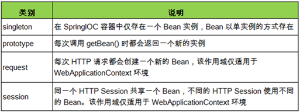
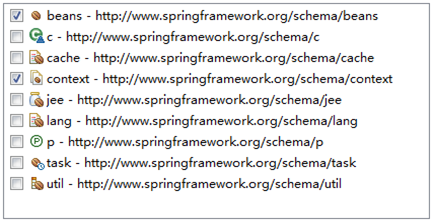
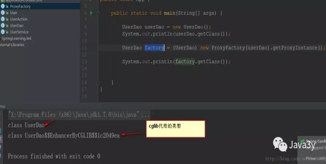

## 一、认识 Spring 框架

### 什么是 Spring

- Spring 是一个**轻量级的 DI / IoC 和 AOP 容器的开源框架**，它的**成功来源于理念，而不是技术本身**
- Spring可以做很多事情，它为企业级开发提供给了丰富的功能，但是这些功能的底层都依赖于它的两个核心特性，也就是依赖注入 （dependency injection，DI）和面向切面编程（aspect-oriented programming，AOP）

- Spring 提倡以**“最少侵入”**的方式来管理应用中的代码，这意味着我们可以随时安装或者卸载 Spring
- 为了降低Java开发的复杂性，Spring采取了以下4种关键策略： 基于POJO的轻量级和最小侵入性编程； 通过依赖注入和面向接口实现松耦合； 基于切面和惯例进行声明式编程； 通过切面和模板减少样板式代码

### Spring 中常用术语

- 框架：是能开发的**半成品**。框架能够帮助我们完成的是：**项目的整体框架、一些基础功能、规定了类和对象如何创建，如何协作等**，当我们开发一个项目时，框架帮助我们完成了一部分功能，我们自己再完成一部分，那这个项目就完成了。
- 非侵入式设计：从框架的角度可以理解为：**无需继承框架提供的任何类**
  这样我们在更换框架时，之前写过的代码几乎可以继续使用。对现有的类结构没有影响，就能够增强JavaBean的功能
- 轻量级和重量级：轻量级是相对于重量级而言的，**轻量级一般就是非入侵性的、所依赖的东西非常少、资源占用非常少、部署简单等等**，其实就是比较容易使用，而重量级正好相反。
- JavaBean：即**符合 JavaBean 规范**的 Java 类； 请注意，**Java bean是实现Serializable接口的POJO**
- POJO：即 **Plain Old Java Objects，简单老式 Java 对象**
  它可以包含业务逻辑或持久化逻辑，但**不担当任何特殊角色**且**不继承或不实现任何其它Java框架的类或接口**

**注意**：bean 的各种名称——虽然 Spring 用 bean 或者 JavaBean 来表示应用组件，但并不意味着 Spring 组件必须遵循 JavaBean 规范，一个 Spring 组件可以是任意形式的 POJO。

- 容器：在日常生活中容器就是一种盛放东西的器具，从程序设计角度看就是**装对象的的对象**，因为存在**放入、拿出等**操作，所以容器还要**管理对象的生命周期**。
- **组件化**：Spring实现了使用简单的组件配置组合成一个复杂的应用。在 Spring 中可以使用XML和Java注解组合这些对象。

### Spring 的框架结构


真正核心的只有三个：**Core、Context和Beans。**

Bean的解析主要是对Spring配置文件的解析；

Context组件的作用是给Spring提供一个运行时的环境，用以保存各个对象的状态； 

**Spring可以分为6大模块：**

- Spring Core  spring的核心功能： **IOC容器, 解决对象创建及依赖关系**

- Spring Web  Spring对web模块的支持。

- 可以与struts整合,让struts的action创建交给spring，spring mvc模式

- Spring DAO  Spring 对jdbc操作的支持  【JdbcTemplate模板工具类】

- Spring ORM  spring对orm的支持：既可以与hibernate整合，【session】，也可以使用spring的对hibernate操作的封装

- Spring AOP 切面编程

- SpringEE  spring 对javaEE其他模块的支持 


**Spring 能帮我们做什么**

①.Spring能帮我们根据配置文件**创建及组装对象之间的依赖关系**。
②.Spring 面向切面编程能帮助我们**无耦合的实现日志记录，性能统计，安全控制。**
③.Spring 能**非常简单的帮我们管理数据库事务**。只需要通过配置就可以完成对事务的管理
④.Spring还**提供了与第三方数据访问框架（如Hibernate、JPA）无缝集成**，而且自己也提供了一套**JDBC访问模板**来方便数据库访问。
⑤.Spring 还提供与**第三方Web（如Struts1/2、JSF）框架无缝集成**，而且自己也提供了一套**Spring MVC**框架，来方便web层搭建。
⑥.Spring 能**方便的与Java EE（如Java Mail、任务调度）整合**，与更多技术整合（比如缓存框架）。

### Spring 设计模式

- 工厂模式：BeanFactory就是简单工厂模式的体现，用来创建对象的实例；
- 单例模式：Bean默认为单例模式。
- 代理模式：Spring的AOP功能用到了JDK的动态代理和CGLIB字节码生成技术；
- 模板方法：用来解决代码重复的问题。比如. RestTemplate, JmsTemplate, JpaTemplate。
- 观察者模式：定义对象键一种一对多的依赖关系，当一个对象的状态发生改变时，所有依赖于它的对象都会得到通知被制动更新，如Spring中listener的实现--ApplicationListener。

### **Spring Portfolio** 

事实上，Spring远不是Spring框架所下载的那些。如果仅仅停留在核心的Spring框架层面。我们将错过了Spring Portfolio所提供的巨大财富。这个Portfolio包括了多个构建核心Spring框架之上的框架和类库。概括来讲，整个Spring Portfolio几乎为每一个领域的Java开发提供了Spring编程模型。
（1）Spring Web Flow:建立于Spring MVC框架之上，她为基于流程的会话式Web应用提供了支持。
（2）Spring Web Service:虽然核心的Spring框架提供了Spring bean以声明的方式发布以Web Service的功能，但这些服务是基于一个具有争议性的架构（拙劣的契约后置模型）之上而构建的。这些服务契约由bean的接口来决定。Spring Web Service提供了契约优先的Web Service模型，服务的实现都是为了满足服务的契约而编写的。
（3）Spring Security:安全对于许多应用都是一个非常关键的切面。利用Spring AOP, Spring Security为Spring应用提供了声明式的安全机制。
（4）Spring Integration:许多企业级应用都需要玉其他应用进行交互。Spring Integration提供了多种通用应用集成模式的Spring声明式风格实现。
（5）Spring Batch:当我们需要对数据进行大量操作时，没有任何技术可以比皮处理更胜任这种场景。如果需要开发一个批处理应用，你可以通过Spring Batch，使用Spring强大的面向POJO编程模型。
（6）Spring Data:Spring Data使得在Spring中使用任何数据库都变得非常容易。尽管关系型数据库统治企业级应用多年，但是现代化的应用在在认识到并不是所有的数据库都合适放在一张表中的行和列中。一种新的数据库种类，通常被称为NoSQL数据库，提供了使用数据的新方法，这些方法比传统的关系型数据库更为合适。
（7）Spring Mobile:移动应用是另一个引人注目的软件开发领域。只能手机和平板设备已成为许多用户首选的客户端。Spring Mobile是Spring MVC的新的扩展模块，用于支持移动Web应用开发。
（8）Spring for Android:与Spring Mobile相关的Spring Android项目。这个新项目，旨在通过Spring框架为开发Android设备的本地应用提供某些简单的支持。
（9）Spring Boot:Spring极大简化了总舵的编程任务，减少甚至消除了很多样板式代码，如果没有Spring的化，在日常工作中你不得不编写这样的样板代码。Spring Boot是一个令人兴奋的项目，它以Spring的视角，致力于简化Spring本身。Spring Boot大量依赖于自动配置技术，它能够消除大部分Spring配置，它提供了多个Starter项目，不管你使用Maven还是Gradle，这都能减少Spring工程构建文件的大小。

## 二、IOC控制反转与DI依赖注入

如果一个对象**只通过接口**（而不是具体实现或初始化过程）来表明依赖关系，那么这种依赖就能够在对象本身毫不知情的情况下，用不同的具体实现进行替换。 

### Spring IoC 容器

Spring 框架的核心是 Spring 容器。

控制反转了什么?对象实例化的解耦，控制反转是通过外部容器完成的。

**功能：**

- 容器创建对象，将它们装配在一起，配置它们并管理它们的完整生命周期。

- Spring 容器使用依赖注入来管理组成应用程序的组件。容器通过读取提供的配置元数据来接收对象进行实例化，配置和组装的指令。该元数据可以通过 XML，Java 注解或 Java 代码提供。
- 我们需要进行控制反转（IoC），及上层控制下层，而不是下层控制着上层。我们用依赖注入（Dependency Injection）这种方式来实现控制反转。所谓依赖注入，就是把底层类作为参数传入上层类，**实现上层类对下层类的“控制”。**

**IoC Container好处：**

因为采用了**依赖注入，在初始化的过程中就不可避免的会写大量的new**。这里IoC容器就解决了这个问题。这个容器可以自动对你的代码进行初始化，你只需要维护一个Configuration（可以是xml可以是一段代码），而不用每次初始化一辆车都要亲手去写那一大段初始化的代码。

我们在创建实例的时候不需要了解其中的细节。我们自己手动创建一个instance时候，是从底层往上层new的。

IoC Container可以直接隐藏具体的创建实例的细节，在我们来看它就像一个工厂：我们就像是工厂的客户。我们只需要向工厂请求一个Car实例，然后它就给我们按照Config创建了一个Car实例。我们完全不用管这个Car实例是怎么一步一步被创建出来。

因为这个架构要求你在写class的时候需要写相应的Config文件，所以你要初始化很久以前的Service类的时候，前人都已经写好了Config文件，你直接在需要用的地方注入这个Service就可以了。这大大增加了项目的可维护性且降低了开发难度。

 

**ioc的思想最核心的地方在于，**资源不由使用资源的双方管理，而由不使用资源的第三方管理，这可以带来很多好处。第一，资源集中管理，实现资源的可配置和易管理。第二，降低了使用资源双方的依赖程度，也就是我们说的耦合度。彼此不知道对方，Spring帮两者粘合在一起。（支付宝的作用） 

> 享受单例的好处，效率高，不浪费空间。
>
> 便于单元测试，方便切换mock组件。
>
> 便于进行AOP操作，对于使用者是透明的。
>
> 统一配置，便于修改。


#### Spring IoC 容器的设计

Spring IoC 容器的设计主要是基于以下两个接口：

- BeanFactory
- ApplicationContext

其中 ApplicationContext 是 BeanFactory 的子接口之一，换句话说：**BeanFactory 是 Spring IoC 容器所定义的最底层接口，**而 ApplicationContext 是其最高级接口之一，并对 BeanFactory 功能做了许多的扩展，所以在绝大部分的工作场景下，都会使用 **ApplicationContext 作为 Spring IoC 容器。**

#### BeanFactory

从上图中我们可以几乎看到， BeanFactory 位于设计的最底层，它提供了 Spring IoC 最底层的设计，为此，我们先来看看该类中提供了哪些方法：

由于这个接口的重要性，所以有必要在这里作一下简短的说明：

- 【getBean】 对应了多个方法来获取配置给 Spring IoC 容器的 Bean。
  ① 按照类型拿 bean：
  bean = (Bean) factory.getBean(Bean.class);
  注意：要求在 Spring 中只配置了一个这种类型的实例，否则报错。（如果有多个那 Spring 就懵了，不知道该获取哪一个）
  ② 按照 bean 的名字拿 bean:
  bean = (Bean) factory.getBean("beanName");
  注意：这种方法不太安全，IDE 不会检查其安全性（关联性）
  ③ 按照名字和类型拿 bean：**（推荐）**
  bean = (Bean) factory.getBean("beanName", Bean.class);

- 【isSingleton】 用于判断是否单例，如果判断为真，其意思是该 Bean 在容器中是作为一个唯一单例存在的。而【isPrototype】则相反，如果判断为真，意思是当你从容器中获取 Bean，容器就为你生成一个新的实例。
  注意：在默认情况下，【isSingleton】为 ture，而【isPrototype】为 false

- 关于 type 的匹配，这是一个按 Java 类型匹配的方式


- 【getAliases】方法是获取别名的方法


这就是 Spring IoC 最底层的设计，所有关于 Spring IoC 的容器将会遵守它所定义的方法。

#### ApplicationContext

根据 ApplicationContext 的类继承关系图，可以看到 ApplicationContext 接口扩展了许许多多的接口，因此它的功能十分强大，所以在实际应用中常常会使用到的是 ApplicationContext 接口，因为 BeanFactory 的方法和功能较少，而 ApplicationContext 的方法和功能较多。

Spring自带了多种类型的应用上下文。下面罗列的几个是你最有可能遇到的。 

- AnnotationConfigWebApplicationContext：从一个或多个基于Java的配置类中加载Spring Web应用上下文。 
- AnnotationConfigApplicationContext：从一个或多个基于Java的配置类中加载Spring应用上下文。 
- ClassPathXmlApplicationContext：从类路径下的一个或多个XML配置文件中加载上下文定义，把应用上下文的定义文件作为类 资源。 
- FileSystemXmlapplicationcontext：从文件系统下的一个或多个XML配置文件中加载上下文定义。 
- XmlWebApplicationContext：从Web应用下的一个或多个XML配置文件中加载上下文定义。 

认识一个重要的 ApplicationContext 的子类--**ClassPathXmlApplicationContext**。

这个类采用**Jdom**对application.xml文档进行解析。

> 先在【src】目录下创建一个 【bean.xml】 文件：这里定义了一个 bean ，这样 Spring IoC 容器在初始化的时候就能找到它们，然后使用 ClassPathXmlApplicationContext 容器就可以将其初始化：ApplicationContext context =new ClassPathXmlApplicationContext("bean.xml");这样就会使用 Application 的实现类 ClassPathXmlApplicationContext 去**初始化 Spring IoC 容器**，然后开发者利用getBean()方法就可以通过 IoC 容器来获取资源了啦！

通过读取配置文件中定义的全路径类名，利用**java反射**技术创建该类的实例。

#### IOC原理

用反射实现

通过**解析xml文件**或java配置，获取到beanid和class属性内容，利用反射，通过class.forName获得class对象再来**实例化对象**。

**通过反射实例化对象，存入到Spring的bean容器中。**
当一个类需要另一个类时，从容器中获取到对应的bean对象，**获取类的setter方法的Method类，setter调用invoke方法执行**，注入之前拿到的bean对象。

#### BEAN属性

##### scope属性 



指定scope属性，IOC容器就知道创建对象的时候是单例还是多例的了。

属性的值就只有两个：单例/多例

 

- 当我们使用singleton【单例】的时候，从IOC容器获取的对象都是同一个。

- 当我们使用prototype【多例】的时候，从IOC容器获取的对象都是不同的


scope属性除了控制对象是单例还是多例的，还控制着对象创建的时间！

**案例**

我们在User的构造函数中打印出一句话，就知道User对象是什么时候创建了。

```java
public User() {
  System.out.println("我是User，我被创建了");  
}
```

当使用singleton的时候，对象在IOC容器之前就已经创建了

当使用prototype的时候，对象在使用的时候才创建


##### lazy-init属性

lazy-init属性只对singleton【单例】的对象有效…..lazy-init默认为false….

有的时候，可能我们想要对象在使用的时候才创建，那么将lazy-init设置为ture就行了

**Bean创建细节总结**

1. 对象创建： 单例/多例
   scope="singleton", 默认值， 即 默认是单例 【service/dao/工具类】
   scope="prototype", 多例；        【Action对象】
2. 什么时候创建?
   scope="prototype"  在用到对象的时候，才创建对象。
   scope="singleton"  在启动(容器初始化之前)， 就已经创建了bean，且整个应用只有一个。
3. 是否延迟创建
   lazy-init="false"  默认为false,  不延迟创建，即在启动时候就创建对象
   lazy-init="true"  延迟初始化， 在用到对象的时候才创建对象（只对单例有效）
4. 创建对象之后，初始化/销毁
   init-method="init_user"    【对应对象的init_user方法，在对象创建之后执行 】
   destroy-method="destroy_user"  【在调用容器对象的destroy方法时候执行，(容器用实现类)】

```java
<bean id="user" class="User" scope="singleton" lazy-init="true" init-method="" destroy-method=""/>  
```

#### bean生命周期

 

 Spring上下文中的Bean也类似，如下

1. Spring 容器根据配置中的 bean 定义中**实例化 bean**;
2. 按照Spring上下文对实例化的Bean进行配置－－也就是**IOC注入；**
3. 如果这个Bean已经实现了**BeanNameAware接口**，会调用它实现的setBeanName(String)方法，此处传递的就是Spring配置文件中**Bean的id值；**
4. 如果这个Bean已经实现了BeanFactoryAware接口，会调用它实现的setBeanFactory(setBeanFactory(BeanFactory)传递的是Spring工厂自身（可以用这个方式来获取其它Bean，只需在Spring配置文件中配置一个普通的Bean就可以）；
5. 如果这个Bean已经实现了ApplicationContextAware接口，会调用setApplicationContext(ApplicationContext)方法，**传入Spring上下文**（同样这个方式也可以实现步骤4的内容，但比4更好，因为ApplicationContext是BeanFactory的子接口，有更多的实现方法）；
6. 如果这个Bean关联了BeanPostProcessor接口，将会调用postProcessBeforeInitialization(Object obj, String s)方法，BeanPostProcessor经常被用作是Bean内容的更改，并且由于这个是在Bean初始化结束时调用那个的方法，也可以被应用于内存或缓存技术；
7. 如果Bean在Spring配置文件中配置了***\*init-method属性\****会自动调用其配置的初始化方法。
8. 如果这个Bean关联了BeanPostProcessor接口，将会调用postProcessAfterInitialization(Object obj, String s)方法；注：以上工作完成以后就可以应用这个Bean了，那这个Bean是一个Singleton的，所以一般情况下我们调用同一个id的Bean会是在内容地址相同的实例，当然在Spring配置文件中也可以配置非Singleton，这里我们不做赘述。
9. 当Bean不再需要时，会经过清理阶段，如果Bean实现了**DisposableBean**这个接口，会调用那个其实现的**destroy()方法；**
10. 最后，如果这个Bean的Spring配置中配置了**destroy-method属性**，会自动调用其配置的销毁方法。

#### Dependency Injection（依赖注入）

Spring 中的 IoC 的实现原理就是工厂模式加反射机制。

指 Spring 创建对象的过程中，**将对象依赖属性（简单值，集合，对象）通过配置设值给该对象**

在 Packge【pojo】下新建一个【JuiceMaker】类：

```java
package pojo;
public class JuiceMaker { 
  // 唯一关联了一个 Source 对象
  private Source source = null;
  /* setter and getter */
  public String makeJuice(){
  String juice = "xxx用户点了一杯" + source.getFruit() + source.getSugar() + source.getSize();
  return juice;
  }
}
```

在 xml 文件中配置 JuiceMaker 对象：

注意：**这里要使用 ref 来**注入另一个对象

```xml
<?xml version="1.0" encoding="UTF-8"?>
<beans xmlns="http://www.springframework.org/schema/beans"
    xmlns:xsi="http://www.w3.org/2001/XMLSchema-instance"    xsi:schemaLocation="http://www.springframework.org/schema/beans http://www.springframework.org/schema/beans/spring-beans.xsd">
  <bean name="source" class="pojo.Source">
    <property name="fruit" value="橙子"/>
    <property name="sugar" value="多糖"/>
    <property name="size" value="超大杯"/>
  </bean>
  <bean name="juickMaker" class="pojo.JuiceMaker">
    <property name="source" ref="source" />
  </bean>
</beans>
```

**总结：**IoC 和 DI 其实是同一个概念的不同角度描述，DI 相对 IoC 而言，明确描述了“被注入对象依赖 IoC 容器配置依赖对象。” 

#### 属性依赖注入

**构造方法注入** 

 	`<constructor-arg>` 用于配置构造方法一个参数argument

- name ：参数的名称

- value：设置普通数据

- ref：引用数据，一般是另一个bean id值

- index ：参数的索引号，从0开始 。如果只有索引，匹配到了多个构造方法时，默认使用第一个。

- type ：确定参数类型


​    例如：使用名称name

​      `<constructor-arg name="username" value="jack"></constructor-arg>`

​    例如2：【类型type 和  索引 index】

```xml
      <constructor-arg index="0" type="java.lang.String" value="1"></constructor-arg>
      <constructor-arg index="1" type="java.lang.Integer" value="2"></constructor-arg>
```

**setter方法注入**

```xml
//普通数据 
<property name="" value="值">
    //等效
    <property name="">
        <value>值
//引用数据
<property name="" ref="另一个bean">
    //等效
   <property name="">
        <ref bean="另一个bean"/>
```


**集合的注入**

都是给`<property>`添加子标签

​      数组：`<array>`

​      List：`<list><value></value><list>`

​      Set：`<set> <set><value></value>`

​      Map：`<map> ，<map> <entry key="" value=""/>`

​      Properties：`<props>  <prop key=""></prop>` 


#### 引用外部属性文件

**直接配置**

```xml
<!-- 直接配置 -->
<bean id="dataSource" class="com.mchange.v2.c3p0.ComboPooledDataSource">
     <property name="user" value="root"/>
     <property name="password" value="root"/>
     <property name="jdbcUrl"value="jdbc:mysql:///test"/>
     <property name="driverClass"value="com.mysql.jdbc.Driver"/>
</bean>
```


**使用外部的属性文件**

1. 创建properties属性文件

2.  引入context名称空间

   

3. 指定properties属性文件的位置

   ```xml
   <context:property-placeholder location="classpath:jdbc.properties"/>
   ```

4. 从properties属性文件中引入属性值

   ```xml
   <!-- 从properties属性文件中引入属性值 -->
   <bean id="dataSource"class="com.mchange.v2.c3p0.ComboPooledDataSource">
        <property name="user" value="${prop.userName}"/>
        <property name="password" value="${prop.password}"/>
        <property name="jdbcUrl" value="${prop.url}"/>
        <property name="driverClass"value="${prop.driverClass}"/>
   </bean>
   ```

## 三、AOP 切面编程

> 如果说 IoC 是 Spring 的核心，那么**面向切面编程就是 Spring 最为重要的功能**之一了，在数据库事务中切面编程被广泛使用。
>
> DI能够让相互协作的软件组件保持松散耦合，而面向切面编程（aspect-oriented programming，AOP）允许你把遍布应用各处的功能分离出来形成可重用的组件。

**AOP实现原理**

- aop底层将采用代理机制进行实现。
- 接口 + 实现类 ：spring采用 jdk 的动态代理Proxy。
- 实现类：spring 采用 cglib字节码增强。

1. 静态AOP：在编译期，切面直接以字节码的形式编译到目标字节码文件中。AspectJ属于静态AOP，是在编译时进行增强，会在编译的时候将AOP逻辑织入到代码中，需要专有的编译器和织入器。
2. 动态AOP(JDK动态代理)：在运行期，目标类加载后，**为接口动态生成代理类**，将切面植入到代理类中。
3. 动态代码字节生成：在运行期，目标类加载后，动态构建字节码文件生成目标类的子类，将切面逻辑加入到子类中。CGLib

### 动态代理

切面编程也就是AOP编程，其实我们在之前也接触过。动态代理就是一种切面编程了

#### 静态代理

```java
/**
 * 目标对象实现的接口
 */

public interface BussinessInterface {
  void execute();}
/**
 * 目标对象实现类
 */
public class Bussiness implements BussinessInterface{
  @Override
  public void execute() {
    System.out.println("执行业务逻辑...");
  }
}

/**
 * 代理类，通过实现与目标对象相同的接口
 * 并维护一个代理对象，通过构造器传入实际目标对象并赋值
 * 执行代理对象实现的接口方法，实现对目标对象实现的干 
 */
public class BussinessProxy implements BussinessInterface{
  private BussinessInterface bussinessImpl;
  public BussinessProxy(BussinessInterface bussinessImpl) {
    this.bussinessImpl = bussinessImpl;
  }
  @Override
  public void execute() {
    System.out.println("前拦截...");
    bussinessImpl.execute();
    System.out.println("后拦截...");
  }
}
```

**由于静态代理需要实现目标对象的相同接口，那么可能会导致代理类会非常非常多….不好维护**

**编译时增强，**他会在编译阶段将AspectJ(切面)织入到Java字节码中，运行的时候就是增强之后的AOP对象。---->因此出现了JDK动态代理。

#### JDK 动态代理

答：JDK 动态代理，只能对实现了接口的类生成代理，而不是针对类，该目标类型实现的接口都将被代理。原理是通过在**运行期间**创建一个接口的实现类来完成对目标对象的代理。

1. 定义一个实现接口 InvocationHandler 的类；

2. 通过构造函数，注入被代理类；

3. 实现 invoke（ Object proxy, Method method, Object[] args）方法；

4. 在主函数中获**得被代理类的类加载器；**

5. 使用 Proxy.newProxyInstance( ) 产生一个代理对象；

6. 通过代理对象调用各种方法。

JDK动态代理也有个约束：**目标对象一定是要有接口的，没有接口就不能实现动态代理**----->因此出现了cglib代理


#### cglib代理

**也叫子类代理**，从内存中构建出一个子类来扩展目标对象的功能！

使用cglib就是为了弥补动态代理的不足【动态代理的目标对象一定要实现接口】

CGLIB是一个强大的高性能的代码生成包，它可以在运行期扩展Java类与实现Java接口。它广泛的被许多AOP的框架使用，例如Spring AOP和dynaop，为他们提供方法的interception（拦截）。


**Spring 会自动在 JDK 动态代理和 cglib 之间转换。**

在Spring的AOP编程中:
如果加入容器的目标对象有实现接口，用JDK代理
如果目标对象没有实现接口，用Cglib代理

**cglib代理**

> 需要引入cglib – jar文件， 但是spring的核心包中已经包括了cglib功能，所以直接引入spring-core-3.2.5.jar即可。
>
> 引入功能包后，就可以在内存中动态构建子类
>
> 代理的类不能为final，否则报错【在内存中构建子类来做扩展，当然不能为final，有final就不能继承了】
>
> 目标对象的方法如果为final/static, 那么就不会被拦截，即不会执行目标对象额外的业务方法。

```java
//需要实现MethodInterceptor接口
public class ProxyFactory implements MethodInterceptor{
   // 维护目标对象
   private Object target;
public ProxyFactory(Object target){
     this.target = target;
   }
   // 给目标对象创建代理对象
   public Object getProxyInstance(){
     //1. 工具类
     Enhancer en = new Enhancer();
     //2. 设置父类
     en.setSuperclass(target.getClass());
     //3. 设置回调函数
     en.setCallback(this);
     //4. 创建子类(代理对象)
     return en.create();
   }
   @Override
   public Object intercept(Object obj, Method method, Object[] args,
       MethodProxy proxy) throws Throwable {
     System.out.println("开始事务.....");
     // 执行目标对象的方法
     Object returnValue = method.invoke(target, args);
     System.out.println("提交事务.....");
     return returnValue;
   }
}
```



### AOP 介绍

**AOP 即 Aspect Oriented Program 面向切面编程**

首先，在面向切面编程的思想里面，把功能分为**核心业务功能，和周边功能。**

所谓的核心业务，比如登陆，增加数据，删除数据都叫核心业务

所谓的周边功能，比如性能统计，日志，事务管理等等。重复代码就叫做周边功能，关注点形成的类，就叫切面(类)！

周边功能在 Spring 的面向切面编程AOP思想里，**即被定义为切面**

在面向切面编程AOP的思想里面，核心业务功能和切面功能**分别独立进行开发**，然后把切面功能和核心业务功能 "编织" 在一起，这就叫AOP。

**AOP 当中的概念：**

（1）切面（Aspect）：被抽取的公共模块，可能会横切多个对象。 在Spring AOP中，切面可以使用通用类（基于模式的风格） 或者在普通类中以 @AspectJ 注解来实现。

（2）连接点（Join point）：指方法，在Spring AOP中，**一个连接点 总是 代表一个方法的执行（增强的方法）**。

（3）通知（Advice）：***\*在切面的某个特定的连接点（Join point）上执行的动作。\****通知有各种类型，其中包括“around”、“before”和“after”等通知。许多AOP框架，包括Spring，都是以拦截器做通知模型， 并维护一个以连接点为中心的拦截器链。

| **注解**        | **说明**                                                     |
| --------------- | ------------------------------------------------------------ |
| @Before         | 前置通知，在连接点方法前调用                                 |
| @Around         | 环绕通知，它将覆盖原有方法，但是允许你通过反射调用原有方法，后面会讲 |
| @After          | 后置通知，在连接点方法后调用                                 |
| @AfterReturning | 返回通知，在连接点方法执行并正常返回后调用，要求连接点方法在执行过程中没有发生异常 |
| @AfterThrowing  | 异常通知，当连接点方法异常时调用                             |

有了上表，我们就知道 before() 方法是连接点方法调用前调用的方法，而 after() 方法则相反，这些注解中间使用了定义切点的正则式，也就是告诉 Spring AOP 需要拦截什么对象的什么方法，下面讲到。

（4）切入点（Pointcut）：切入点是指 我们要对哪些Join point进行拦截的定义。通过切入点表达式，指定拦截的方法，比如指定拦截add*、search*。

（5）引入（Introduction）：（也被称为内部类型声明（inter-type declaration））。声明额外的方法或者某个类型的字段。Spring允许引入新的接口（以及一个对应的实现）到任何被代理的对象。例如，你可以使用一个引入来使bean实现 IsModified 接口，以便简化缓存机制。

（6）目标对象（Target Object）： 被一个或者多个切面（aspect）所通知（advise）的对象。也有人把它叫做 被通知（adviced） 对象。 既然Spring AOP是通过运行时代理实现的，这个对象永远是一个 被代理（proxied） 对象。

（7）织入（Weaving）：**指把增强应用到目标对象来创建新的代理对象的过程。Spring是在运行时完成织入。**

#### 一个例子

**包租婆的核心业务**就是签合同，收房租，那么这就够了，灰色框起来的部分都是重复且边缘的事，交给中介商就好了，这就是 **AOP 的一个思想：**让关注点代码与业务代码分离！**

我们来实际的用代码感受一下

1.在 Package【pojo】下新建一个【Landlord】类：**目标类：接口 + 实现类**

```java
package pojo;

import org.springframework.stereotype.Component;

@Component("landlord")

public class Landlord {

  public void service() {

    // 仅仅只是实现了核心的业务功能

    System.out.println("签合同");

    System.out.println("收房租");

  }

}
```

2.在 Package【aspect】下新建一个中介商【Broker】类：**切面类：用于存通知MyAspect**

```java
package aspect;
@Component
@Aspect
class Broker {
  @Before("execution(* pojo.Landlord.service())")
  public void before(){
    System.out.println("带租客看房");
    System.out.println("谈价格");
  }
  @After("execution(* pojo.Landlord.service())")
  public void after(){
    System.out.println("交钥匙");
  }
}
```

3.在 applicationContext.xml 中配置自动注入，并告诉 Spring IoC 容器去哪里扫描这两个 Bean：

```xml
  <context:component-scan base-package="aspect" />
  <context:component-scan base-package="pojo" />
  <aop:aspectj-autoproxy />
```

4.在 Package【test】下编写测试代码：

```java
package test;
public class TestSpring {
  public static void main(String[] args) {
    ApplicationContext context =
        new ClassPathXmlApplicationContext("applicationContext.xml");
    Landlord landlord = (Landlord) context.getBean("landlord", Landlord.class);
    landlord.service();
  }
}
```

这个例子使用了一些注解，现在看不懂没有关系，但我们可以从上面可以看到，我们在 Landlord 的 service() 方法中仅仅实现了核心的业务代码**，其余的关注点功能是根据我们设置的切面**自动补全的。

### 注解 开发 AOP

**第一步：选择连接点**

Spring 是方法级别的 AOP 框架，我们主要也是以**某个类额某个方法作为连接点**，另一种说法就是：选择哪一个类的哪一方法用以增强功能。

```java
  public void service() {
    // 仅仅只是实现了核心的业务功能
    System.out.println("签合同");
    System.out.println("收房租");
  }
```

我们在这里就选择上述andlord 类中的 service() 方法作为连接点。

**第二步：创建切面**

选择好了连接点就可以创建切面了，我们可以把切面理解为一个拦截器，当程序运行到连接点的时候，***\*被拦截下来，\****在开头加入了初始化的方法，在结尾也加入了销毁的方法而已，在 Spring 中只要使用 @Aspect 注解一个类，那么 Spring IoC 容器就会认为这是一个切面了：

```java
package aspect;
@Component
@Aspect
class Broker {
  @Before("execution(* pojo.Landlord.service())")
  public void before(){
    System.out.println("带租客看房");
    System.out.println("谈价格");
  }
  @After("execution(* pojo.Landlord.service())")
  public void after(){
    System.out.println("交钥匙");
  }
}
```

**注意：** 被定义为切面的类仍然是一个 Bean ，需要 @Component 注解标注

代码部分中在方法上面的注解看名字也能猜出个大概，下面来列举一下 Spring 中的 AspectJ 注解：

**第三步：定义切点**

在上面的注解中定义了 **execution 的正则表达式**，Spring 通过这个正则表达式判断具体要拦截的是哪一个类的哪一个方法：

execution(* pojo.Landlord.service())

依次对这个表达式作出分析：

- execution：代表执行方法的时候会触发
- *：代表任意返回类型的方法
- pojo.Landlord：代表类的全限定名
- service()：被拦截的方法名称

通过上面的表达式，Spring 就会知道应该拦截 pojo.Lnadlord 类下的 service() 方法。上面的演示类还好，如果多出都需要写这样的表达式难免会有些复杂，我们可以通过使用 @Pointcut 注解来定义一个切点来避免这样的麻烦：

```java
package aspect;
@Component
@Aspect
class Broker {
  @Pointcut("execution(* pojo.Landlord.service())")
  public void lService() {
  }
  @Before("lService()")
  public void before() {
    System.out.println("带租客看房");
    System.out.println("谈价格");
  }
  @After("lService()")
  public void after() {
    System.out.println("交钥匙");
  }
}
```

环绕通知

我们来探讨一下环绕通知，这是 Spring AOP 中最强大的通知，因为它集成了前置通知和后置通知，它保留了连接点原有的方法的功能，所以它及强大又灵活，让我们来看看：

```java
package aspect;
@Component
@Aspect
class Broker {
  //  使用 @Around 注解来同时完成前置和后置通知
  @Around("execution(* pojo.Landlord.service())")
  public void around(***\*ProceedingJoinPoint\**** joinPoint) {
    System.out.println("带租客看房");
    System.out.println("谈价格");
    try {
      joinPoint.proceed();
    } catch (Throwable throwable) {
      throwable.printStackTrace();
    }
    System.out.println("交钥匙");
  }
}
```

### XML 配置 AOP

注解是很强大的东西，但基于 XML 的开发我们仍然需要了解，我们先来了解一下 AOP 中可以配置的元素：

| **AOP 配置元素**    | **用途**                         | **备注**                   |
| ------------------- | -------------------------------- | -------------------------- |
| aop:advisor         | 定义 AOP 的通知其                | 一种很古老的方式，很少使用 |
| aop:aspect          | 定义一个切面                     | ——                         |
| aop:before          | 定义前置通知                     | ——                         |
| aop:after           | 定义后置通知                     | ——                         |
| aop:around          | 定义环绕通知                     | ——                         |
| aop:after-returning | 定义返回通知                     | ——                         |
| aop:after-throwing  | 定义异常通知                     | ——                         |
| aop:config          | 顶层的 AOP 配置元素              | AOP 的配置是以它为开始的   |
| aop:declare-parents | 给通知引入新的额外接口，增强功能 | ——                         |
| aop:pointcut        | 定义切点                         | ——                         |

有了之前通过注解来编写的经验，并且有了上面的表，我们将上面的例子改写成 XML 配置很容易（去掉所有的注解）：

```xml
<!-- 装配 Bean-->
<bean name="landlord" class="pojo.Landlord"/>
<bean id="broker" class="aspect.Broker"/>
<!-- 配置AOP -->
<aop:config proxy-target-class="true">//声明时使用cglib代理
  <!-- where：在哪些地方（包.类.方法）做增加 -->
  <aop:pointcut id="landlordPoint"
         expression="execution(pojo.Landlord.service())"/>
  <!-- what:做什么增强 -->
  <aop:aspect id="logAspect" ref="broker">
    <!-- when:在什么时机（方法前/后/前后） -->
      <aop:around method="around" pointcut-ref="landlordPoint"/>
      <!-- 指定为before方法作为前置通知 -->
      <aop:before method="before" pointcut-ref="landlordPoint"/>
      <!-- 后置 -->
      <aop:after method="after" pointcut-ref="landlordPoint"/> 
      <!-- 环绕通知 -->
      <aop:around method="around" pointcut-ref="landlordPoint"/>
      <!-- 异常拦截通知 -->
      <aop:after-throwing method="afterException" pointcut-ref="landlordPoint"/>
      <!-- 后置 -->
      <aop:after-returning method="afterReturning" pointcut-ref="landlordPoint"/>
  </aop:aspect>
</aop:config
```

 

## 四、IOC容器的配置对象方式

三种主要的装配机制： 

- 在XML中进行显式配置。 
- 在Java中进行显式配置。 
- 隐式的bean发现机制和自动装配。

### 自动化装配bean

Spring从两个角度来实现自动化装配： 

> 组件扫描（component scanning）：Spring会自动发现应用上下文中所创建的bean。 
>
> 自动装配（autowiring）：Spring自动满足bean之间的依赖。

**通过注解来配置信息就是为了简化IOC容器的配置**，注解可以把对象添加到IOC容器中、处理对象依赖关系，我们来看看怎么用吧：

**使用注解步骤：**

1）先引入context名称空间

```xml
xmlns:context="http://www.springframework.org/schema/context"
```

2）开启注解扫描器

第一种方法**组件扫描：**

```xml
<context:component-scan base-package=""></context:component-scan>
```

第二种方法**自动装配：**也可以通过自定义扫描类以@CompoentScan修饰来扫描IOC容器的bean对象。如下代码:

```java
//表明该类是配置类
@Configuration
//启动扫描器，扫描bb包下的
//也可以指定多个基础包
//也可以指定类型
@ComponentScan("bb")
public class AnnotationScan {
}
```

**在使用@ComponentScan()这个注解的时候，在测试类上需要@ContextConfiguration这个注解来加载配置类。**

@ContextConfiguration这个注解又在Spring的test包下。

#### XML配置根据名字

```xml
   <bean id="userDao" class="UserDao"/>
   <!--
     1.通过名字来自动装配
     2.发现userService中有个叫userDao的属性
     3.看看IOC容器中没有叫***\*userDao的对象\****
     4.如果有，就装配进去
   -->
   <bean id="userService" class="UserService" autowire="byName"/>
```

#### XML配置根据类型

如果使用了根据类型来自动装配，那么在IOC容器中只能有一个这样的类型，否则就会报错！

```xml
<bean id="userDao" class="UserDao"/>
   <!--
     1.通过名字来自动装配
     2.发现userService中有个叫userDao的属性
     3.看看IOC容器***\*UserDao类型\****的对象
     4.如果有，就装配进去
   -->
   <bean id="userService" class="UserService" autowire="byType"/>
```

|      |                                                              |
| ---- | ------------------------------------------------------------ |
|      |  |

 default：由上级标签`<beans>`的default-autowire属性确定。我们也可以**使用默认自动分配**

#### 其他配置依据

constructor：类似于byType，不过是应用于构造器的参数，如果正好有一个Bean与构造器的参数类型相同则可以自动装配，否则会导致错误。

autodetect：如果有默认的构造器，则通过constructor的方式进行自动装配，否则使用byType的方式进行自动装配。

### XML配置方式

**一个标准的beans.xml文件**

```xml
<?xml version="1.0" encoding="UTF-8"?>
<beans xmlns="http://www.springframework.org/schema/beans"
    xmlns:xsi="http://www.w3.org/2001/XMLSchema-instance"    xsi:schemaLocation="http://www.springframework.org/schema/beans                                http://www.springframework.org/schema/beans/spring-beans.xsd">
</beans>
```

#### p命名空间和c命名空间

> 在通过构造方法或`set`方法给`bean`注入关联项时通常是通过`constructor-arg`元素和`property`元素来定义的。在有了`p`命名空间和`c`命名空间时我们可以简单的把它们当做`bean`的一个属性来进行定义。

**c命名空间**的用法和p命名空间类似，其对应于constructor-arg，即可以将constructor-arg元素替换为bean的一个以c命名空间前缀开始的属性。使用c命名空间之前也需要通过xmlns:c=”http://www.springframework.org/schema/c”进行声明。

```xml
<?xml version="1.0" encoding="UTF-8"?>
<beans xmlns="http://www.springframework.org/schema/beans"
    xmlns:xsi="http://www.w3.org/2001/XMLSchema-instance"
    xmlns:c="http://www.springframework.org/schema/c"  xsi:schemaLocation="http://www.springframework.org/schema/beans      http://www.springframework.org/schema/beans/spring-beans.xsd">
	<bean id="world" class="com.app.World"/>
	<!-- 传统的使用constructor-arg通过构造方法注入的bean定义 -->
	<bean id="hello1" class="com.app.Hello">
		<constructor-arg index="0" value="arg1"/>
		<constructor-arg index="1" value="2"/><!-- arg2为参数名 -->
		<constructor-arg index="2" ref="world"/><!-- arg3 -->
	</bean>
	<!-- 使用c命名空间通过构造方法注入的bean定义 -->
	<bean id="hello2" class="com.app.Hello" c:arg1="arg1" c:arg2="2" c:arg3-ref="world"/>
</beans>
```

**p命名空间**时需要先声明使用对应的命名空间，即在beans元素上加入xmlns:p="http://www.springframework.org/schema/p"。下面先来看一个示例。

```xml
<?xml version="1.0" encoding="UTF-8"?>
<beans xmlns="http://www.springframework.org/schema/beans"
    xmlns:xsi="http://www.w3.org/2001/XMLSchema-instance"
    xmlns:p="http://www.springframework.org/schema/p"
    xsi:schemaLocation="http://www.springframework.org/schema/beans
        http://www.springframework.org/schema/beans/spring-beans.xsd">
	<bean id="world" class="com.app.World"/>
	<!-- 通过set方法注入的传统的bean定义 -->
	<bean id="hello1" class="com.app.Hello">
		<property name="p1" value="v1"/>
		<property name="p2" value="v2"/>
		<property name="world" ref="world"/>
	</bean>
	<!-- 通过set方法注入的使用p命名空间的bean定义 -->
	<bean id="hello2" class="com.app.Hello" p:p1="v1" p:p2="v2" p:world-ref="world"/>
</beans>
```

**util-命名空间**工具类的命名空间，可以简化集合类元素的配置。


上面我们使用的是IOC通过无参构造函数来创建对象，我们来回顾一下一般有几种创建对象的方式：

- 无参构造函数创建对象

- 带参数的构造函数创建对象

- 工厂创建对象

  - 静态方法创建对象
- 非静态方法创建对象

#### 工厂静态方法创建对象

首先，使用一个工厂的静态方法返回一个对象

```java
public class Factory {
   public static User getBean() {
     return new User(); }
}
```

配置文件中使用工厂的静态方法返回对象

```xml
<!--工厂静态方法创建对象，直接使用class指向静态类，指定静态方法就行了-->
   <bean id="user" class="Factory" factory-method="getBean" >
   </bean>
```

#### 工厂非静态方法创建对象 

首先，也是通过工厂的非非静态方法来得到一个对象

```java
public class Factory {
   public User getBean() {
     return new User();
}
```

配置文件中使用工厂的非静态方法返回对象

```xml
<!--首先创建工厂对象-->
<bean id="factory" class="Factory"/>
<!--指定工厂对象和工厂方法-->
<bean id="user" class="User" factory-bean="factory" factory-method="getBean"/>
```

#### 装载集合

**数组和List**

需要指定`<list>`标签，在标签里包含一些元素。这些标签    可以通过`<value>`指定简单的常量值，通过`<ref>`指定对其他Bean的引用。通过`<bean>` 指定内置bean定义。通过`<null/>`指定空元素。甚至可以内嵌其他集合。

数组的定义和List一样，都使用`<list>`元素。

配置java.util.Set需要使用`<set>`标签，定义的方法与List一样。

```java
   <bean id="userService" class="bb.UserService" >
     <constructor-arg >
       <list>
         //普通类型
         <value></value>
      	 <value> </value >
         //引用类型
         <ref bean=" "/>
       	 <ref bean=" "/>
       </list>
     </constructor-arg>
   </bean>
   //<list>元素是<constructor-arg>的子元素，这表明一个包含值的列表将会传递到构造器中。其中，<value>元素用来指定列表中的每个元素。
```


 **Map**

通过`<map>`标签定义，`<map>`标签里可以使用多个`<entry>`作为子标签。每个条目包含一个键和一个值。必须在`<key>`标签里定义键。

因为键和值的类型没有限制，所以可以自由地为它们指定`<value>、<ref>、<bean>或<null/>`元素。

可以将Map的键和值作为`<entry>`的属性定义：简单常量使用key和value来定义；bean引用通过key-ref和value-ref属性定义。

```
<bean id="cup" class="com.atguigu.spring.bean.Cup">
     <property name="bookMap">
         <map>
             <entry>
                  <key>
                      <value>bookKey01</value>
                  </key>
                  <ref bean="book01"/>
             </entry>
             <entry>
                  <key>
                      <value>bookKey02</value>
                  </key>
                  <ref bean="book02"/>
             </entry>
         </map>
     </property>
</bean>
```


### 通过Java方式

> Spring对Java配置的支持是由@Configuration注解和@Bean注解来实现的。**由@Bean注解的方法将会实例化、配置和初始化一个新对象，这个对象将由Spring的IoC容器来管理。**@Bean声明所起到的作用与`<bean/>` 元素类似。被@Configuration所注解的类则表示这个类的主要目的是作为bean定义的资源。被@Configuration声明的类可以通过在同一个类的内部调用@bean方法来设置嵌入bean的依赖关系。

**编写配置类:**

```java
@org.springframework.context.annotation.Configuration
     public class Configuration {
   }
```

**使用配置类创建bean:**

使用@Bean来修饰方法，**该方法返回一个对象。**

不管方法体内的对象是怎么创建的，Spring可以获取得到对象就行了。

Spring内部会将该对象加入到Spring容器中

容器中bean的ID默认为方法名

```java
@org.springframework.context.annotation.Configuration
public class Configuration {
   @Bean
   public UserDao userDao() {
     UserDao userDao = new UserDao();
     System.out.println("我是在configuration中的"+userDao);
     return userDao;
   }
}
```

### 三种方式混合使用

如果JavaConfig的配置类是分散的，我们一般再创建一个更高级的配置类（root），然后使用`@Import`来将配置类进行组合

如果XML的配置文件是分散的，我们也是创建一个更高级的配置文件（root），然后使用来将配置文件组合

## 五、高级装配

### Profile

#### 一般设置

由于在项目中使用Maven打包部署的时候，经常由于配置参数过多(比如Nginx服务器的信息、ZooKeeper的信息、数据库连接、Redis服务器地址等)，导致实际现网的配置参数与测试服务器参数混淆，一旦在部署的时候某个参数忘记修改了，那么就必须重新打包部署，这确实让人感到非常头疼。因此就想到使用Spring中的Profile来解决上面描述的问题，并且在此记录一下其使用的方式。

> 我们以前所定义的Bean，当Spring容器一启动的时候，就会一股脑的全部加载这些信息完成对Bean的创建；而使用了Profile之后，它会将Bean的定义进行更细粒度的划分，将这些定义的Bean划分为几个不同的组，当Spring容器加载配置信息的时候，首先查找激活的Profile，然后只会去加载被激活的组中所定义的Bean信息，而不被激活的Profile中所定义的Bean定义信息是不会加载用于创建Bean的。

首先，我们先看看如何基于Profile来定义一个Bean。

通过@Profile注解可以为一个Bean赋予对应的profile名称，如下：

```java
@Component
@Profile("dev")
public class DevDatasourceConfig
```

上面的DevDatasourceConfig被定义为 profile=dev，于是该Bean只会在dev(开发环境)模式下被启用。

如果需要定义为非dev环境，可以使用这样的形式：

```java
@Component
@Profile("!dev")
public class DevDatasourceConfig
```

#### 设置Profile

**优先级**

1. SpringApplication.setAdditionalProfiles
2. ConfigurableEnvironment、@ActiveProfiles
3. Web.xml的 context-param
4. WebApplicationInitializer
5. JVM 启动参数
6. 环境变量
7. Maven profile、application.properties

##### WebApplicationInitializer接口

在Web应用程序中，通过WebApplicationInitializer可以对当前的ServletContext进行配置。

如下，通过注入**spring.profiles.active**变量可以为Spring上下文指定当前的 profile：

```java
@Configuration
public class MyWebApplicationInitializer 
  implements WebApplicationInitializer {

    @Override
    public void onStartup(ServletContext servletContext) throws ServletException {

        servletContext.setInitParameter(
          "spring.profiles.active", "dev");
    }
}
```

##### 通过 web.xml定义

与上面的方法类似，在web.xml中通过**context-param**元素也可以设置profile。

但前提是当前应用程序使用了xml的配置文件风格，如下：

```xml
<context-param>
    <param-name>contextConfigLocation</param-name>
    <param-value>/WEB-INF/app-config.xml</param-value>
</context-param>
<context-param>
    <param-name>spring.profiles.active</param-name>
    <param-value>dev</param-value>
</context-param>
```

##### JVM启动参数

通过Java程序启动参数同样可以对profile进行设定，如下：

```
java -jar application.jar -Dspring.profiles.active=dev
```

**spring-boot-maven-plugin**插件也支持设定profile，其原理也是通过启动参数实现，可以[参考这里](https://docs.spring.io/spring-boot/docs/current/maven-plugin/examples/run-profiles.html)

https://docs.spring.io/spring-boot/docs/current/maven-plugin/examples/run-profiles.html

##### 环境变量

在Unix/Linux环境中，可以通过环境变量注入profile的值：

```properties
export spring_profiles_active=dev
java -jar application.jar 
```

##### application.properties

可以在application.properties配置文件中指定**spring.profiles.active**属性：

```properties
spring.profiles.active=dev
```

SpringBoot默认会加载并读取该配置，当发现为profile=dev时，会同时关联加载application-dev.properties这个配置。
这种方式非常简单，可以实现对不同环境采用单独的配置文件进行隔离。

Maven本身也提供了Profile的功能，可以通过Maven的Profile配置来指定Spring的Profile。

这种做法稍微有点复杂，需要先在pom.xml中设定不同的 maven profile，如下：

```xml
<profiles>
    <profile>
        <id>dev</id>
        <activation>
            <activeByDefault>true</activeByDefault>
        </activation>
        <properties>
            <spring.profiles.active>dev</spring.profiles.active>
        </properties>
    </profile>
    <profile>
        <id>prod</id>
        <properties>
            <spring.profiles.active>prod</spring.profiles.active>
        </properties>
    </profile>
</profiles>
```

这里，分别声明了dev和prod两个profile，每个profile都包含了一个**spring.profiles.active**属性，这个属性用来注入到 Spring中的profile入参。
在SpringBoot的配置文件application.properties中，需要替换为这个maven传入的property：

```properties
## 使用Maven的属性进行替换
spring.profiles.active=@spring.profiles.active@
```

接下来，需要让Maven在打包时能将application.properties进行过滤处理，同时替换掉变量，需编辑pom.xml如下：

```xml
<build>
    <resources>
        <resource>
            <directory>src/main/resources</directory>
            <filtering>true</filtering>
        </resource>
    </resources>
</build>
```

这里定义了filtering=true，因此Resource打包插件会对配置文件执行过滤。

> 如果你的项目pom定义继承自 spring-boot-starter-parent，那么可以不需要配置这个filter

最后，在maven打包时指定参数如下：

```xml
mvn clean package -Pprod
```

**XML风格配置**
上面的例子也可以使用XML配置文件达到同样的目的，如下：

```xml
<beans profile="dev">
    <bean id="devDatasourceConfig"
      class="org.baeldung.profiles.DevDatasourceConfig" />
</beans>
```

**读取Profile**
通过ConfigurableEnvironment这个Bean 可以获得当前的Profile，如下：

```java
public class ProfileManager {
    @Autowired
    Environment environment;
    public void getActiveProfiles() {
        for (final String profileName : environment.getActiveProfiles()) {
            System.out.println("Currently active profile - " + profileName);
        }   
    }
}
```

##### @ActiveProfiles

@ActiveProfile 是用于单元测试场景的注解，可以为测试代码指定一个隔离的profile，如下：

```java
@ActiveProfiles("test")
public void ApiTest{
  ...
}
```

##### ConfigurableEnvironment

ConfigurableEnvironment 这个Bean封装了当前环境的配置信息，你可以在启动应用前进行设定操作：

```java
SpringApplication application = new SpringApplication(MyApplication.class);
//设置environment中的profiler
ConfigurableEnvironment environment = new StandardEnvironment();
environment.setActiveProfiles("dev","join_dev");
application.setEnvironment(environment);
application.run(args)
```

##### SpringApplication.setAdditionalProfiles

SpringApplication这个类还提供了setAdditionalProfiles方法，用来让我们实现"附加"式的profile。
这些profile会同时被启用，而不是替换原来的active profile，如下：

```java
SpringApplication application = new SpringApplication(MyApplication.class);
application.setAdditionalProfiles("new_dev");
```

这种方式可以实现无条件的启用profile，优先级是最高的。 
当然，还可以通过设定**spring.profiles.include**来达到同样的目的。


## 六、Spring 常用注解

**注解原理**

注解本质是一个继承了Annotation的特殊接口，其具体实现类是Java运行时生成的动态代理类。我们通过反射获取注解时，返回的是Java运行时生成的动态代理对象。通过代理对象调用自定义注解的方法，会最终调用AnnotationInvocationHandler的invoke方法。该方法会从memberValues这个Map中索引出对应的值。而memberValues的来源是Java常量池。

**扫描组件**

组件被上述注解标识后还需要通过Spring进行扫描才能够侦测到。

```xml
<context:component-scan base-package="com.atguigu.component"/>
```

①**base-package**属性指定一个需要扫描的基类包，Spring容器将会扫描这个基类包及其子包中的所有类。

②当需要扫描多个包时可以使用逗号分隔。

③如果仅希望扫描特定的类而非基包下的所有类，可使用

```xml
<context:component-scan
     base-package="com.atguigu.component"
     resource-pattern="autowire/.class"/>
```


**组件注解**

- @Component:用于标注一个普通的类，默认的spring中的Bean id 为类名（首字母小写)；命名：@Component（“  ”）
- @Controller:用于标注一个控制器类
- @Service:用于标注业务逻辑类
- @Repository:用于标注DAO数据访问类

现在这几个注解没有什么区别，尽量根据类的不同功能选择合适的注解。 

**组件扫描注解**

- @ComponentScan:配置一个扫描包：@ComponentScan("bb")；配置多个扫描包：将basePackages属性设置为要扫描包的一个数组；@ComponentScan(value="bb",useDefaultFilters=true,basePackageClasses=xxx.class)


**bean相关注解**

@Scope：用于标记该类的作用域，默认singleton。

- 单例（Singleton）：在整个应用中，只创建bean的一个实例。 
- 原型（Prototype）：每次注入或者通过Spring应用上下文获取的时候，都会创建一个新的bean实例。 
- 会话（Session）：在Web应用中，为每个会话创建一个bean实例。 
- 请求（Rquest）：在Web应用中，为每个请求创建一个bean实例。

@DependsOn

@Lazy

**bean（singleton作用域）的生命周期的行为注解**

@PostConstruct

@PreDestroy

- @Conditional：是Spring4新提供的注解，它的作用是按照一定的条件进行判断，满足条件给容器注册bean；public @interface Conditional { Class<? extends Condition>[] value();}@Conditional的定义看出，需要传入一个Class数组，并且需要继承Condition接口；Condition是个接口，需要实现matches方法，返回true则注入bean，false则不注入。 @Conditional({xxx.class})，xxx.class实现Condition接口，并返回boolean；一个方法只能注入一个bean实例，所以@Conditional标注在方法上只能控制一个bean实例是否注入，一个类中可以注入很多实例，@Conditional标注在类上就决定了一批bean是否注入。
- @Primary：在spring 中使用注解，常使用@Autowired， 默认是根据类型Type来自动注入的。但有些特殊情况，对同一个接口，可能会有几种不同的实现类，而默认只会采取其中一种的情况下 @Primary 的作用就出来了；自动装配时当出现多个Bean候选者时，被注解为@Primary的Bean将作为首选者，否则将抛出异常；@Primary能够与@Component组合用在组件扫描的bean上，也可以与@Bean组合用在Java配置的bean声明中，使用XML配置bean的话，`<bean>`元素有一个primary属性用来指定首选的bean

**自动装配**

- @Resource：@Resource是根据**名称**进行自动装配的，一般会指定一个name属性；@Resource可以作用在变量、setter方法上。

- @Autowired：它可以对类成员变量、方法及构造函数进行标注，完成自动装配的工作;将@autowored写在被注入的成员变量上，就不用再xml文件中配置了，在程序中去掉相应的setter和getter方法;这里必须明确,@Autowired是**根据类型**进行自动装配的，如果需要**按名称进行装配**，则需要配合@Qualifier使用；@Autowired有个属性为required，可以配置为false，如果配置为false之后，当没有找到相应bean的时候，系统不会抛错。
- @Qualifier：@Qualifier("XXX") 中的 XX是 Bean 的名称，所以 @Autowired 和 @Qualifier 结合使用时，自动注入的策略就从 byType 转变成 byName 了；不过需要注意的是@Autowired 可以对成员变量、方法以及构造函数进行注释，而 @Qualifier 的标注对象是成员变量、方法**入参**、构造函数**入参**。@Qualifier注解是使用限定符的主要方式，在注入的时候指定想要注入进去的是哪个bean。
- @Inject：是根据**类型**进行自动装配的，如果需要按名称进行装配，则需要配合@Named；
- @Named:是一个特别的`@Qualifier`注解，借助`@Named`可以用名字标明要注入的对象。将`@Named`和`@Inject`一起使用，符合指定名称并且类型正确的对象会被注入。

**AOP 相关注解**

@Aspect

@Before

@AfterReturning

@AfterThrowing

@After

@Arround

@Pointcut

@Order

**Java配置类相关注解**

@Configuration：修饰一个Java类，被修饰的类相当于一个xml文件。在springboot中大量使用了该注解，该注解提供了一种使用Java类方式配置bean。

@Import：有时没有把某个类注入到IOC容器中，但在运用的时候需要获取该类对应的bean，此时就需要用到@Import注解。

@ImportResource：导入Spring的配置文件，让配置文件里面的内容生效；通过locations属性加载对应的xml配置文件，同时需要配合@Configuration注解一起使用，定义为配置类；

@Bean

@Value：常用于注入属性文件中的值。

@PropertySource：@PropertySource 注解加载指定的配置文件；@ConfigurationProperties”可以从全局配置文件“application.properties”或者“application.yml”中取值，然后为需要的属性赋值。

 

## 七、Spring与事务

spring封装了事务管理的代码：打开事务，提交事务，回滚事务。

真正的数据库层的事务提交和回滚是通过***\*binlog或者redo log\****实现的

 

spring的事务管理分为编程式的事务管理与声明式的事务管理；

所有事务管理都抽象为事务操作管理类（PlatformTransactionManager），事务状态（TransactionStatus）和定义了***\*事务的传播行为和隔离级别\****的类（TransactionDefinition）这三个接口；

 

 

因为在不同平台，操作事务的代码各不相同，spring提供了一个接口***\*PlatformTransactionManager 接口\****，里面有许多实现类。

 

**TransactionManager**

事务的隔离级别，1.读未提交；2.读已提交；3.可重复读；4.串行化

是否只读，true（只读） false

事务传播行为：决定业务方法之间调用，事务该如何处理。有七种，默认为PROPAGION_REQUIRED:支持当前事务，如果不存在，就新建一个（默认，99.9%以上概率）

 

二种方式：

方式一：编程式事务管理：需要手动编写代码，在实际开发中很少使用。我们需要在代码中调用beginTransaction()、commit()、rollback()等事务管理相关的方法，这就是编程式事务管理。

***\*spring推荐使用TransactionTemplate。\****

方式二：声明式事务

***\*管理建立在AOP之上的。其本质是对方法前后进行拦截，然后在目标方法开始之前创建或者加入一个事务，在执行完目标方法之后根据执行情况提交或者回滚事务。\****
基于TransactionProxyFactoryBean的方式，需要为每个进行***\*事务管理的类做相应配置\*******\*
\****基于***\*AspectJ的XML方式\****，tx标签不需要改动类，在XML文件中配置好即可
***\*基于注解的方式，@Transactional，配置简单\****，需要在业务层类中添加注解（使用较多）

 

### 事务的7种传播级别

1） PROPAGATION_REQUIRED ，默认的spring事务传播级别，使用该级别的特点是，如果上下文中已经存在事务，那么就加入到事务中执行，如果当前上下文中不存在事务，则新建事务执行。所以这个级别通常能满足处理大多数的业务场景。

2）PROPAGATION_SUPPORTS ，从字面意思就知道，supports，支持，该传播级别的特点是，如果上下文存在事务，则支持事务加入事务，如果没有事务，则使用非事务的方式执行。所以说，并非所有的包在transactionTemplate.execute中的代码都会有事务支持。这个通常是用来处理那些并非原子性的非核心业务逻辑操作。应用场景较少。

3）PROPAGATION_MANDATORY ， 该级别的事务要求上下文中必须要存在事务，否则就会抛出异常！配置该方式的传播级别是有效的控制上下文调用代码遗漏添加事务控制的保证手段。比如一段代码不能单独被调用执行，但是一旦被调用，就必须有事务包含的情况，就可以使用这个传播级别。

4）PROPAGATION_REQUIRES_NEW ，从字面即可知道，new，每次都要一个新事务，该传播级别的特点是，每次都会新建一个事务，并且同时将上下文中的事务挂起，执行当前新建事务完成以后，上下文事务恢复再执行。

这是一个很有用的传播级别，举一个应用场景：现在有一个发送100个红包的操作，在发送之前，要做一些系统的初始化、验证、数据记录操作，然后发送100封红包，然后再记录发送日志，发送日志要求100%的准确，如果日志不准确，那么整个父事务逻辑需要回滚。
怎么处理整个业务需求呢？就是通过这个PROPAGATION_REQUIRES_NEW 级别的事务传播控制就可以完成。发送红包的子事务不会直接影响到父事务的提交和回滚。

5）PROPAGATION_NOT_SUPPORTED ，这个也可以从字面得知，not supported ，不支持，当前级别的特点就是上下文中存在事务，则挂起事务，执行当前逻辑，结束后恢复上下文的事务。

这个级别有什么好处？可以帮助你将事务极可能的缩小。我们知道一个事务越大，它存在的风险也就越多。所以在处理事务的过程中，要保证尽可能的缩小范围。比如一段代码，是每次逻辑操作都必须调用的，比如循环1000次的某个非核心业务逻辑操作。这样的代码如果包在事务中，势必造成事务太大，导致出现一些难以考虑周全的异常情况。所以这个事务这个级别的传播级别就派上用场了。用当前级别的事务模板抱起来就可以了。

6）PROPAGATION_NEVER ，该事务更严格，上面一个事务传播级别只是不支持而已，有事务就挂起，而PROPAGATION_NEVER传播级别要求上下文中不能存在事务，一旦有事务，就抛出runtime异常，强制停止执行！这个级别上辈子跟事务有仇。

7）PROPAGATION_NESTED ，字面也可知道，nested，嵌套级别事务。该传播级别特征是，如果上下文中存在事务，则嵌套事务执行，如果不存在事务，则新建事务。

### AOP配置事务

首先开启了包扫描路径

 <context:component-scan base-package="com.aaa.spring.xmltest"/>

第一步:配置数据源

properties文件

```xml
<context:property-placeholder location="jdbc.properties"/>
  <bean id="dataSource" class="org.springframework.jdbc.datasource.DriverManagerDataSource">
    <property name="url" value="${jdbc.url}"/>
    <property name="driverClassName" value="${jdbc.driver}"/>
    <property name="username" value="${jdbc.user}"/>
    <property name="password" value="${jdbc.password}"/>
    <property name="connectionProperties">
      <props>
        <prop key="characterEncoding">utf8</prop>
      </props>
    </property>
   </bean>
```

第二步:初始化事务管理器

```xml
<bean id="txManager" class="org.springframework.jdbc.datasource.DataSourceTransactionManager">
    <property name="dataSource" ref="dataSource"/>
  </bean>
```

第三步:配置事务AOP通知

```xml
 <tx:advice id="txAdvice" transaction-manager="txManager">
    <tx:attributes>
      <tx:method name="insert*" rollback-for="ArithmeticException" />
      <tx:method name="query*" isolation="READ_COMMITTED" read-only="true" />
    </tx:attributes>
  </tx:advice
```

第四步:定义AOP配置(将第三步的通知和表达式组装到一起)

```xml
aop:config>
    <aop:pointcut id="all_dao_method" expression="execution(* com.lanou3g.spring.transaction.dao.*.*(..))" />
    <aop:advisor advice-ref="txAdvice" pointcut-ref="all_dao_method" />
  </aop:config
```

因为用了sping中的对数据库操作的JdbcTemplate类所以也配置到xml中跟自己写的Dao类一起


 

