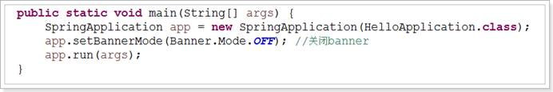
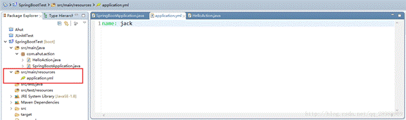
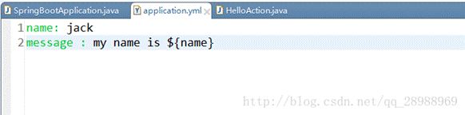
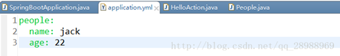
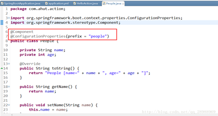
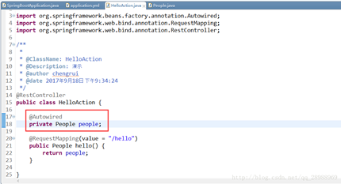
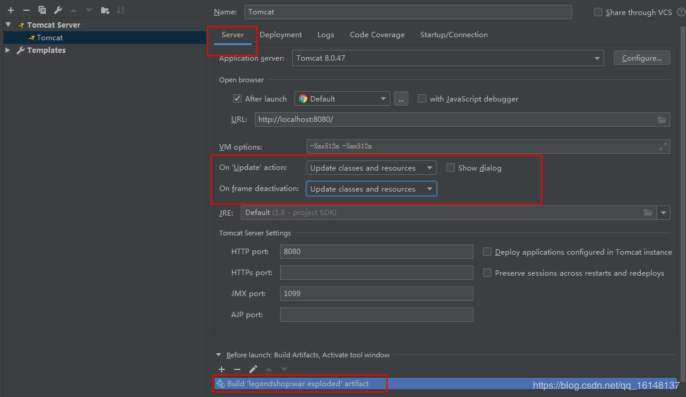
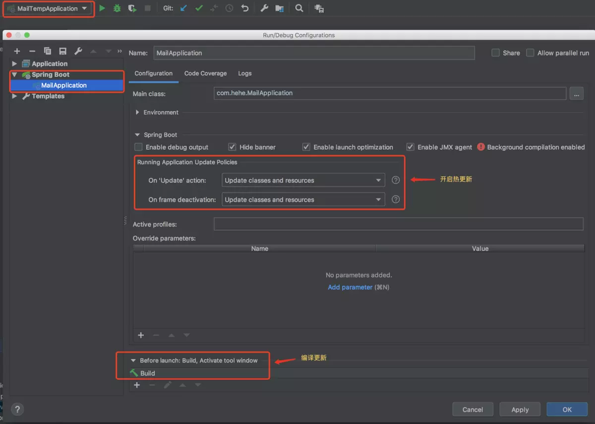
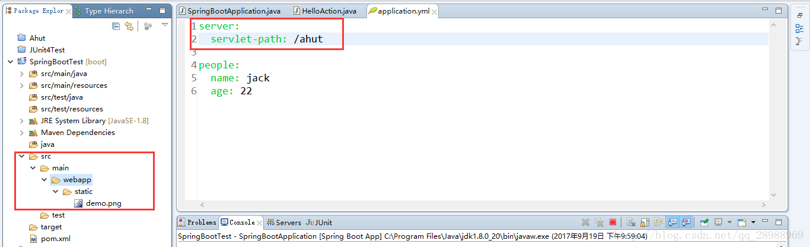
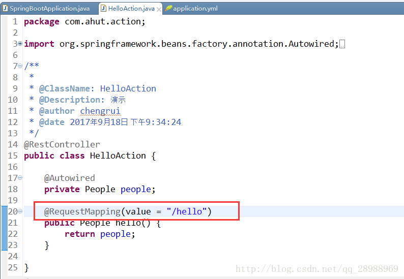

## spring boot

### REST

restful风格，就是一种**面向资源服务的****API****设计方式，**它不是规范，不是标准，它一种设计模式。

**REST规范：**

1.强调HTTP应当以资源为中心，并且规范了资源URI的风格；
2.规范了HTTP请求动作（PUT，POST等）的使用，具有对应的语义；3）REST操作
 一般资源操作只有新增、删除、查询、更新，对应HTTP协议中四类请求：POST、DELETE、GET、PUT。其中，后三个操作是幂等的。（什么是幂等？）

### spring boot基础

> springboot官方文档：https://docs.spring.io/spring-boot/docs/current/reference/html/index.html

其设计目的是用来简化新Spring应用的初始搭建以及开发过程。该框架使用了特定的方式来进行配置，从而使开发人员不再需要定义样板化的配置。用我的话来理解，就是spring boot其实不是什么新的框架，它**默认配置了很多框架的使用方式**，就像maven整合了所有的jar包，**spring boot整合了所有的框架**（不知道这样比喻是否合适）。

**spring boot**你可以看做一个启动、配置、快速开发的辅助框架，本身针对的是微服务。

平时如果我们需要搭建一个spring web项目的时候需要怎么做呢？

· 1）配置web.xml，加载spring和spring mvc

· 2）配置数据库连接、配置spring事务

· 3）配置加载配置文件的读取，开启注解

· 4）配置日志文件

· 5) 配置mapper文件

· …

· 配置完成之后部署tomcat 调试

· …

*划重点：简单、快速、方便地搭建项目；对主流开发框架的无配置集成；极大提高了开发、部署效率。


## SpringBoot注解和配置

### 自动配置原理

JavaConfig就是使用**注释来描述Bean配置的组件。**

@Configuration标注在类上，**相当于把该类作为****spring****的xml****配置文件中的<beans>****，**作用为：配置spring容器(应用上下文)。

工作原理剖析

Spring Boot关于自动配置的源码在spring-boot-autoconfigure-x.x.x.x.jar中：

@SpringBootApplication是一个复合注解或派生注解，在@SpringBootApplication中有一个注解@EnableAutoConfiguration，开启自动配置。

而@EnableAutoConfiguration注解也是借助@Import将所有符合配置条件的bean定义加载到IoC容器，仅此而已！而@EnableAutoConfiguration注解的源码如下：

…......

@Import(EnableAutoConfigurationImportSelector.class)

public @interface EnableAutoConfiguration {

  ...

}

@Import(EnableAutoConfigurationImportSelector.class)了，它借助EnableAutoConfigurationImportSelector.class可以帮助SpringBoot应用将所有符合条件的@Configuration配置类都加载到当前SpringBoot创建并使用的IoC容器，就像一个“八爪鱼”一样。

 

幕后英雄SpringFactoriesLoader详解

而这个注解也是一个派生注解，其中的关键功能由@Import提供，其导入的AutoConfigurationImportSelector(父类)的selectImports()方法通过SpringFactoriesLoader.loadFactoryNames()扫描所有具有META-INF/spring.factories的jar包。spring-boot-autoconfigure-x.x.x.x.jar里就有一个这样的spring.factories文件。

 

它的主要功能就是从指定的配置文件META-INF/spring.factories中加载配置，spring.factories是一个非常经典的java properties文件，内容格式是Key=Value形式，只不过这Key以及Value都非常特殊，为Java类的完整类名(Fully qualified name)

这个spring.factories文件也是一组一组的key=value的形式，其中一个key是EnableAutoConfiguration类的全类名，而它的value是一个xxxxAutoConfiguration的类名的列表，这些类名以逗号分隔。

提供了一种配置查找的功能的支持

而诸多的XxxxAutoConfiguration自动配置类，就是Spring容器的JavaConfig形式，作用就是为Spring 容器导入bean，而所有导入的bean所需要的属性都通过xxxxProperties的bean来获得。

总结：

Spring Boot启动的时候会通过@EnableAutoConfiguration注解SpringFactoriesLoader从classpath找到META-INF/spring.factories配置文件中的所有自动配置类，并对其进行加载，而这些自动配置类都是以*AutoConfiguration**结尾来命名*的，它实际上就是一个JavaConfig形式的Spring容器配置类，它能通过以Properties结尾命名的类中取得在全局配置文件中配置的属性如：server.port，而XxxxProperties类是通过@ConfigurationProperties注解与全局配置文件中对应的属性进行绑定的。

###  SpringBoot中的新注解

#### 注解(annotations)

> **@SpringBootApplication**：包含了@ComponentScan、@Configuration和@EnableAutoConfiguration注解。其中@ComponentScan让spring Boot扫描到Configuration类并把它加入到程序上下文。
>
> **@ResponseBody**：表示该方法的返回结果直接写入HTTP response body中，一般在异步获取数据时使用，用于构建RESTful的api。在使用@RequestMapping后，返回值通常解析为跳转路径，加上@responsebody后返回结果不会被解析为跳转路径，而是直接写入HTTP response body中。比如异步获取json数据，加上@responsebody后，会直接返回json数据。**该注解一般会配合@RequestMapping一起使用。**
>
> **@Configuration** 等同于spring的XML配置文件；使用Java代码可以检查类型安全。
>
> **@EnableAutoConfiguration** 自动配置。
>
> **@ComponentScan** 组件扫描，可自动发现和装配一些Bean。个人理解相当于，如果扫描到有@Component、@Controller、@Service等这些注解的类，并注册为Bean，可以自动收集所有的Spring组件，包括@Configuration类。
> 我们经常使用@ComponentScan注解搜索beans，并结合@Autowired注解导入。如果没有配置的话，Spring Boot会扫描启动类所在包下以及子包下的使用了@Service,@Repository等注解的类。
>
> **@Component**可配合CommandLineRunner使用，在程序启动后执行一些基础任务。
>
> **@Controller**：用于定义控制器类，在spring 项目中由控制器负责将用户发来的URL请求转发到对应的服务接口（service层），一般这个注解在类中，通常方法需要配合注解@RequestMapping。
>
> **@RestController**注解是@Controller和@ResponseBody的合集,表示这是个**控制器bean**,并且是将函数的返回值直 接填入HTTP响应体中,是REST风格的控制器。
>
> **@RequestMapping**：提供路由信息，**负责URL到Controller中的具体函数的映射。**
>
> **@Resource(name=”name”,type=”type”)**：没有括号内内容的话，默认byName。与@Autowired干类似的事。
>
> **@AutoWired**：自动导入依赖的bean。byType方式。把配置好的Bean拿来用，完成属性、方法的组装，它可以对类成员变量、方法及构造函数进行标注，完成自动装配的工作。当加上（required=false）时，就算找不到bean也不报错
>
> **@Qualifier**：当有多个同一类型的Bean时，可以用@Qualifier(“name”)来指定。与@Autowired配合使用。@Qualifier限定描述符除了能根据名字进行注入，但能进行更细粒度的控制如何选择候选者，具体使用方式如下：
>
> ```java
> @Autowired 
> @Qualifier(value = “demoInfoService”)
> private DemoInfoService demoInfoService;
> ```
>
> **@Inject**：等价于默认的@Autowired，只是没有required属性；
>
> **@PathVariable**获取参数。
>
> **@JsonBackReference**解决嵌套外链问题。
>
> **@RepositoryRestResourcepublic**配合spring-boot-starter-data-rest使用。
>
> **@ImportResource**：用来加载xml配置文件。
>
> **@Bean**：用@Bean标注方法等价于XML中配置的bean。
>
> **@Value**：注入Spring boot application.properties配置的属性的值。
>
> **@Component**：泛指组件，当组件不好归类的时候，我们可以使用这个注解进行标注。

#### **JPA注解**

> **@Entity**：@Table(name=”“)：表明这是一个实体类。一般用于jpa这两个注解一般一块使用，但是如果表名和实体类名相同的话，@Table可以省略
>
> **@MappedSuperClass**:用在确定是父类的entity上。父类的属性子类可以继承。
>
> **@NoRepositoryBean**:一般用作父类的repository，有这个注解，spring不会去实例化该repository。
>
> **@Column**：如果字段名与列名相同，则可以省略。
>
> **@Id**：表示该属性为主键。
>
> **@GeneratedValue(strategy = GenerationType.SEQUENCE,generator = “repair_seq”)**：表示主键生成策略是sequence（可以为Auto、IDENTITY、native等，Auto表示可在多个数据库间切换），指定sequence的名字是repair_seq。
>
> **@SequenceGeneretor(name = “repair_seq”, sequenceName = “seq_repair”, allocationSize = 1)**：name为sequence的名称，以便使用，sequenceName为数据库的sequence名称，两个名称可以一致。
>
> **@Transient**：表示该属性并非一个到数据库表的字段的映射,ORM框架将忽略该属性。如果一个属性并非数据库表的字段映射,就务必将其标示为@Transient,否则,ORM框架默认其注解为@Basic。@Basic(fetch=FetchType.LAZY)：标记可以指定实体属性的加载方式
>
> **@JsonIgnore**：作用是json序列化时将Java bean中的一些属性忽略掉,序列化和反序列化都受影响。
>
> **@JoinColumn（name=”loginId”）**:一对一：本表中指向另一个表的外键。一对多：另一个表指向本表的外键。
>
> **@OneToOne、@OneToMany、@ManyToOne**：对应hibernate配置文件中的一对一，一对多，多对一。

#### springMVC相关注解

> **@RequestMapping**：@RequestMapping(“/path”)表示该控制器处理所有“/path”的UR L请求。RequestMapping是一个用来处理请求地址映射的注解，可用于类或方法上。
>
> 用于类上，表示类中的所有响应请求的方法都是以该地址作为父路径。该注解有六个属性：
>
> **params**:指定request中必须包含某些参数值是，才让该方法处理。**headers**:指定request中必须包含某些指定的header值，才能让该方法处理请求。**value**:指定请求的实际地址，指定的地址可以是URI Template 模式**method**:指定请求的method类型， GET、POST、PUT、DELETE等**consumes**:指定处理请求的提交内容类型（Content-Type），如application/json,text/html;**produces**:指定返回的内容类型，仅当request请求头中的(Accept)类型中包含该指定类型才返回
>
> **@RequestParam**：用在方法的参数前面。@RequestParam  String a =request.getParameter(“a”)。
>
> **@PathVariable**:路径变量。如
>
> ```java
> RequestMapping(“user/get/mac/{macAddress}”)
> public String getByMacAddress(@PathVariable String macAddress){
> //do something
> }
> ```
>
> 参数与大括号里的名字一样要相同。

#### 全局异常处理

> **@ControllerAdvice**：包含@Component。可以被扫描到。统一处理异常。
>
> **@ExceptionHandler（Exception.class）**：用在方法上面表示遇到这个异常就执行以下方法。

### 1.SpringBootApplication

一般来说Spring Boot的Web应用都有一个xxxApplication类，并使用@SpringBootApplication注解标记，作为该**web应用的加载入口**。通过查看@SpringBootApplication注解的源码，可以发现它是一个组合注解：

```java
@Target(ElementType.TYPE)
@Retention(RetentionPolicy.RUNTIME)
@Documented
@Inherited
@SpringBootConfiguration
@EnableAutoConfiguration
@ComponentScan(excludeFilters = {
    @Filter(type = FilterType.CUSTOM, classes = TypeExcludeFilter.class),
    @Filter(type = FilterType.CUSTOM, classes = AutoConfigurationExcludeFilter.class) })
public @interface SpringBootApplication {
  ．．．
｝
```

@SpringBootApplication这个Spring Boot核心注解是由其它三个重要的注解组合，分别是： **@SpringBootConfiguration 、 @EnableAutoConfiguration 、@ComponentScan**。 

**1).@SpringBootConfiguration**

@SpringBootConfiguration是Spring Boot项目的**配置注解**，这也是一个组合注解，源码如下：

```java
@java.lang.annotation.Target(value={java.lang.annotation.ElementType.TYPE})
@java.lang.annotation.Retention(value=java.lang.annotation.RetentionPolicy.RUNTIME)
@java.lang.annotation.Documented
@org.springframework.context.annotation.Configuration
public abstract @interface org.springframework.boot.SpringBootConfiguration extends java.lang.annotation.Annotation {
}
```

**2).@EnableAutoConfiguration**

@EnableAutoConfiguration注解**用于启用自动配置**，该注解会使Spring Boot根据项目中**依赖的jar包自动配置项目的配置项**。

在pom.xml中引入了spring-boot-starter-web的依赖，所以项目中就会引入SpringMVC的依赖，就会自动配置tomcat和SpringMVC。 

**3).@ComponentScan**

//**组件扫描和自动装配**
@ComponentScan是**组件扫描注解**，**不配置默认扫描**@SpringBootApplication所在类的**同级目录以及它的子目录(**这很重要,后面很应用到这个特性)。当然你也可以自己指定要扫描的包目录，例如：@ComponentScan(basePackages = "com.dlb.action")

### 2.取消部分自动配置

```java
@SpringBootApplication(exclude={DataSourceAutoConfiguration.class,HibernateJpaAutoConfiguration.class})
@Controller
public class HelloApplication {
  ...
}
```

 当自动配置的东西一多了，就容易出问题，至于**取消自动配置的方式**也相当简单，就是对@SpringBootApplication注解的exclude进行赋值即可。

### 3.自定义Banner

这个知识点其实对开发意义不太，但不妨了解下(可以装个逼~~)。在Spring Boot项目启动时，控制台会输出一个”spring>>>”的banner文字图案，如：

这个banner是可以自定义的，自定义的方法很简单：只需要把想输出的文字保存在banner.txt文件中，然后把这个banner.txt放到resources目录下即可.运行项目，然后控制台就可以输出banner.txt中的文字了。

 这个网站可以得到文字图案：[点这里](http://patorjk.com/software/taag/#p=display&f=Graffiti&t=demo)

如果不想看到任何的banner，也是可以将其关闭的：



### 4.使用Xml配置文件

常规开发中，**java配置方式已经可以完全取代xml配置方式了**，但有时我们并不想使用java配置，而是继续沿用之前的xml配置方式，或者出于其他原因，一定要在xml中进行配置，那该怎么办呢，很简单，使用@ImportResource注解即可：

```java
@ImportResource(value = {"classpath:xxx1.xml","classpath:xxx2.xml"})
```

### 6.全局配置文件

Spring Boot项目使用一个**全局的配置文件application.properties**或者是**application.yml**，在resources目录下。

我们知道Spring Boot会根据在pom.xml中依赖的jar包进行自动配置，当我们要对这些jar包对应的框架进行配置又该怎么办呢，没错，**可以在全局配置文件中进行配置**，如tomcat的端口配置、数据库等。

**1）全局配置文件的基本使用（application.properties）**

这部分使用application.properties中的书写方式来介绍。

**①tomcat**端口配置

server.port=8081

**②修改Spring MVC**拦截路径规则

默认Spring MVC拦截路径规则是/，如果要修改成*.html的话，可以在全局配置文件中进行如下设置：

server.servlet-path=*.html

**③视图解析器配置**

一样的，Spring Boot也可以通过全局配置文件对视图解析器进行配置：

spring.mvc.view.prefix=/WEB-INF/views/

spring.mvc.view.suffix=.jsp

**④日志输出**

Spring Boot对各种日志框架都做了支持，我们可以通过配置来修改默认的日志的配置：

\#设置日志级别

logging.level.org.springframework=DEBUG

**2）全局配置文件的进阶使用（application.yml）**

```yml
server:
 port: 8080
 context-path: /

spring:
  mvc:
   view:
    prefix: /WEB-INF/views/
    suffix: .jsp
 
logging:
 level: debug
```

yml文件在书写时，需要注意一个地方：**冒号与值中间是存在空格的！**

**①自定义属性**

全局配置文件并不只是配置Spring Boot中已经存在的属性，我们也可以自定义属性（别忘了，它本身就是一个properties文件），**代码需要使用@Value(“${xxx}”)注解来获取这些属性**，如：



**②属性引用属性**

属性引用属性也简单，使用${xxx}就可以引用配置文件中的属性了。核心配置文件Properties和Yaml 两者都支持使用属性占位符`${param}`来填值。



**③属性转对象**

这个就比较有看点了，可以使用**@ConfigurationProperties(prefix =** **“属性名前缀”)**这个注解作为配置文件中属性转对象属性的桥梁，具体如图所示：

application.yml



实体类

·     **@Component**：表明当前类是一个 Java Bean



action中应用



Spring Boot的全局配置很强大，同时它可以配置的属性也很多，以上只列出几个常用的属性配置，

如需查看完整的全局属性配置，请到 [spring-boot官方配置文档](https://docs.spring.io/spring-boot/docs/current/reference/html/common-application-properties.html) 查看。


### 7.Spring Boot 热部署

在目前的 Spring Boot 项目中，当发生了任何修改之后我们都需要重新启动才能够正确的得到效果，这样会略显麻烦，Spring Boot 提供了热部署的方式，当发现任何类发生了改变，就会通过 JVM 类加载的方式，两个ClassLoder，加载**最新的类到虚拟机中**，这样就不需要重新启动也能看到修改后的效果了。

当前流行的java程序主要有两种：

- 第一种是传统的Web应用，依赖Tomcat这种web容器运行。
- 第二种是Spring boot程序， 内嵌了运行环境。

**1.Tomcat热部署**

> a). 在顶部找到程序运行操作栏， 点击Edit Configurations
> b). 点击你要配置的tomcat，点击deployment，点击”+“
> c). 然后选择你要部署的war包，热部署必须要选择带有exploded的war包
> d). 再切换回Server
>
> 或应用配置

配置完后点击ok即可启动你的tomcat，然后改一下jsp、java文件实验热部署配置是否成功。

**2.在pom.xml中添加依赖**

```xml
<dependency>
    <groupId>org.springframework.boot</groupId>
    <artifactId>spring-boot-devtools</artifactId>
    <optional>true</optional>
    <scope>true</scope>
</dependency>
```

> （1） devtools可以实现页面热部署（即页面修改后会立即生效， 则在application.yml文件加入spring:thymeleaf:cache:false）
> 实现类文件热部署（类文件修改后不会立即生效），实现对属性文件的热部署。即devtools会监听classpath下的文件变动，并且会立即重启应用（发生在保存时机），注意：因为其采用的虚拟机机制，该项重启是很快的
> （2）配置了true后在修改java文件后也就支持了热启动，不过这种方式是属于项目重启（**速度比较快的项目重启**），会清空session中的值，也就是如果有用户登陆的话，项目重启后需要重新登陆。
> 默认情况下，/META-INF/maven，/META-INF/resources，/resources，/static，/templates，/public这些文件夹下的文件修改不会使应用重启，但是会重新加载（devtools内嵌了一个LiveReload server，当资源发生改变时，浏览器刷新）。

**在application.yml中配置一下devtools**

```yml
spring:
  devtools:
    restart:
      enabled: true  #设置开启热部署
      additional-paths: src/main/java #重启目录
      exclude: WEB-INF/**
  freemarker:
    cache: false    #页面不加载缓存，修改即时生效
```

**当我们修改了类文件后，idea不会自动编译，得修改idea设置。**

> （1）File-Settings-Compiler-Build Project automatically
> （2）ctrl + shift + alt + / ,选择Registry,勾上 Compiler autoMake allow when app running

------------------------------------------------
**测试**

> - 修改类–>保存：应用会重启
> - 修改配置文件–>保存：应用会重启
> - 修改页面–>保存：应用不会重启，但会重新加载，页面会刷新


## Thymeleaf

简单说，Thymeleaf 是一个跟 Velocity、FreeMarker 类似的模板引擎，它可以完全替代 JSP 。相较与其他的模板引擎，它有如下三个极吸引人的特点：

- 1.Thymeleaf 在有网络和无网络的环境下皆可运行，即它可以让美工在浏览器查看页面的静态效果，也可以让程序员在服务器查看带数据的动态页面效果。这是由于它支持 html 原型，然后在 html 标签里增加额外的属性来达到模板+数据的展示方式。浏览器解释 html 时会忽略未定义的标签属性，所以 Thymeleaf 的模板可以静态地运行；当有数据返回到页面时，Thymeleaf 标签会动态地替换掉静态内容，使页面动态显示。
- 2.Thymeleaf 开箱即用的特性。它提供标准和 Spring 标准两种方言，可以直接套用模板实现 JSTL、 OGNL表达式效果，避免每天套模板、改 Jstl、改标签的困扰。同时开发人员也可以扩展和创建自定义的方言。
- 3.Thymeleaf 提供 Spring 标准方言和一个与 SpringMVC 完美集成的可选模块，可以快速的实现表单绑定、属性编辑器、国际化等功能。

> ```
> 温馨提示：Thymeleaf 最为显著的特征是增强属性，任何属性都可以通过th:xx 来完成交互，例如th:value最终会覆盖value属性。
> ```

### 一、基础语法

#### 变量表达式  `${}`

使用方法：直接使用`th:xx = "${}"` 获取对象属性 。例如：

```xml
<form id="userForm">
    <input id="id" name="id" th:value="${user.id}"/>
    <input id="username" name="username" th:value="${user.username}"/>
    <input id="password" name="password" th:value="${user.password}"/>
</form>
<div th:text="hello"></div>
<div th:text="${user.username}"></div>
```

#### 选择变量表达式 `*{}`

使用方法：首先通过`th:object` 获取对象，然后使用`th:xx = "*{}"`获取对象属性。

这种简写风格极为清爽，推荐大家在实际项目中使用。 例如：

```xml
<form id="userForm" th:object="${user}">
    <input id="id" name="id" th:value="*{id}"/>
    <input id="username" name="username" th:value="*{username}"/>
    <input id="password" name="password" th:value="*{password}"/>
</form>
```

#### 链接表达式 `@{}`

使用方法：通过链接表达式`@{}`直接拿到应用路径，然后拼接静态资源路径。例如：

```xml
<script th:src="@{/webjars/jquery/jquery.js}"></script>
<link th:href="@{/webjars/bootstrap/css/bootstrap.css}" rel="stylesheet" type="text/css">
```

#### 片段表达式 `~{}`

片段表达式是Thymeleaf的特色之一，细粒度可以达到标签级别，这是JSP无法做到的。
 片段表达式拥有三种语法：

- `~{ viewName } 表示引入完整页面`
- `~{ viewName ::selector} 表示在指定页面寻找片段 其中selector可为片段名、jquery选择器等`
- `~{ ::selector} 表示在当前页寻找`

使用方法：首先通过`th:fragment`定制片段 ，然后通过`th:replace` 填写片段路径和片段名。例如：

```xml
<!-- /views/common/head.html-->
<head th:fragment="static">
        <script th:src="@{/webjars/jquery/3.3.1/jquery.js}"></script>
</head>

<!-- /views/your.html -->
<div th:replace="~{common/head::static}"></div>
```

在实际使用中，我们往往使用更简洁的表达，去掉表达式外壳直接填写片段名。例如：

```xml
<!-- your.html -->
<div th:replace="common/head::static"></div>
```

值得注意的是，使用替换路径`th:replace` 开头请勿添加斜杠，避免部署运行的时候出现路径报错。（因为默认拼接的路径为`spring.thymeleaf.prefix = classpath:/templates/`）

#### 消息表达式

即通常的国际化属性：`#{msg}`  用于获取国际化语言翻译值。例如：

```xml
 <title th:text="#{user.title}"></title>
```

#### 其它表达式

在基础语法中，默认支持字符串连接、数学运算、布尔逻辑和三目运算等。例如：

```dart
<input name="name" th:value="${'I am '+(user.name!=null?user.name:'NoBody')}"/>
```

#### 常用th标签

| 关键字      | 功能介绍                                     | 案例                                                         |
| :---------- | :------------------------------------------- | :----------------------------------------------------------- |
| th:id       | 替换id                                       | `<input th:id="'xxx' + ${collect.id}"/>`                     |
| th:text     | 文本替换                                     | `<p th:text="${collect.description}">description</p>`        |
| th:utext    | 支持html的文本替换                           | `<p th:utext="${htmlcontent}">conten</p>`                    |
| th:object   | 替换对象                                     | `<div th:object="${session.user}"> `                         |
| th:value    | 属性赋值                                     | `<input th:value="${user.name}" /> `                         |
| th:with     | 变量赋值运算                                 | `<div th:with="isEven=${prodStat.count}%2==0"></div> `       |
| th:style    | 设置样式                                     | `th:style="'display:' + @{(${sitrue} ? 'none' : 'inline-block')} + ''" ` |
| th:onclick  | 点击事件                                     | `th:onclick="'getCollect()'" `                               |
| th:each     | 属性赋值                                     | `tr th:each="user,userStat:${users}"> `                      |
| th:if       | 判断条件                                     | ` <a th:if="${userId == collect.userId}" > `                 |
| th:unless   | 和th:if判断相反                              | `<a th:href="@{/login}" th:unless=${session.user != null}>Login</a> ` |
| th:href     | 链接地址                                     | `<a th:href="@{/login}" th:unless=${session.user != null}>Login</a> /> ` |
| th:switch   | 多路选择 配合th:case 使用                    | `<div th:switch="${user.role}"> `                            |
| th:case     | th:switch的一个分支                          | `<p th:case="'admin'">User is an administrator</p>`          |
| th:fragment | 布局标签，定义一个代码片段，方便其它地方引用 | `<div th:fragment="alert">`                                  |
| th:include  | 布局标签，替换内容到引入的文件               | `<head th:include="layout :: htmlhead" th:with="title='xx'"></head> /> ` |
| th:replace  | 布局标签，替换整个标签到引入的文件           | `<div th:replace="fragments/header :: title"></div> `        |
| th:selected | selected选择框 选中                          | `th:selected="(${xxx.id} == ${configObj.dd})"`               |
| th:src      | 图片类地址引入                               | ` ` |
| th:inline   | 定义js脚本可以使用变量                       | `<script type="text/javascript" th:inline="javascript">`     |
| th:action   | 表单提交的地址                               | `<form action="subscribe.html" th:action="@{/subscribe}">`   |
| th:remove   | 删除某个属性                                 | `<tr th:remove="all"> 1.all:删除包含标签和所有的孩子。2.body:不包含标记删除,但删除其所有的孩子。3.tag:包含标记的删除,但不删除它的孩子。4.all-but-first:删除所有包含标签的孩子,除了第一个。5.none:什么也不做。这个值是有用的动态评估。` |
| th:attr     | 设置标签属性，多个属性可以用逗号分隔         | 比如`th:attr="src=@{/image/aa.jpg},title=#{logo}"`，此标签不太优雅，一般用的比较少。 |

还有非常多的标签，这里只列出最常用的几个,由于一个标签内可以包含多个th:x属性，其生效的优先级顺序为: `include,each,if/unless/switch/case,with,attr/attrprepend/attrappend,value/href,src ,etc,text/utext,fragment,remove。 `

### 二、内置对象

> 官方文档：[ 附录A： Thymeleaf 3.0 基础对象](https://links.jianshu.com/go?to=https%3A%2F%2Fwww.thymeleaf.org%2Fdoc%2Ftutorials%2F3.0%2Fusingthymeleaf.html%23appendix-a-expression-basic-objects)  
>  官方文档：[ 附录B： Thymeleaf 3.0 工具类 ](https://links.jianshu.com/go?to=https%3A%2F%2Fwww.thymeleaf.org%2Fdoc%2Ftutorials%2F3.0%2Fusingthymeleaf.html%23appendix-b-expression-utility-objects)

#### 七大基础对象：

- `${#ctx}` 上下文对象，可用于获取其它内置对象。
- `${#vars}`:    上下文变量。
- `${#locale}`：上下文区域设置。
- `${#request}`: HttpServletRequest对象。
- `${#response}`: HttpServletResponse对象。
- `${#session}`: HttpSession对象。
- `${#servletContext}`:  ServletContext对象。

#### 常用的工具类：

- `#strings`：字符串工具类
- `#lists`：List 工具类
- `#arrays`：数组工具类
- `#sets`：Set 工具类
- `#maps`：常用Map方法。
- `#objects`：一般对象类，通常用来判断非空
- `#bools`：常用的布尔方法。
- `#execInfo`：获取页面模板的处理信息。
- `#messages`：在变量表达式中获取外部消息的方法，与使用＃{...}语法获取的方法相同。
- `#uris`：转义部分URL / URI的方法。
- `#conversions`：用于执行已配置的转换服务的方法。
- `#dates`：时间操作和时间格式化等。
- `#calendars`：用于更复杂时间的格式化。
- `#numbers`：格式化数字对象的方法。
- `#aggregates`：在数组或集合上创建聚合的方法。
- `#ids`：处理可能重复的id属性的方法。

### 三、迭代循环

想要遍历`List`集合很简单，配合`th:each` 即可快速完成迭代。例如遍历用户列表：

```xml
<div th:each="user:${userList}">
    账号：<input th:value="${user.username}"/>
    密码：<input th:value="${user.password}"/>
</div>
```

在集合的迭代过程还可以获取状态变量，只需在变量后面指定状态变量名即可，状态变量可用于获取集合的下标/序号、总数、是否为单数/偶数行、是否为第一个/最后一个。例如：

```bash
<div th:each="user,stat:${userList}" th:class="${stat.even}?'even':'odd'">
    下标：<input th:value="${stat.index}"/>
    序号：<input th:value="${stat.count}"/>
    账号：<input th:value="${user.username}"/>
    密码：<input th:value="${user.password}"/>
</div>
```

如果缺省状态变量名，则迭代器会默认帮我们生成以变量名开头的状态变量 `xxStat`， 例如：

```bash
<div th:each="user:${userList}" th:class="${userStat.even}?'even':'odd'">
    下标：<input th:value="${userStat.index}"/>
    序号：<input th:value="${userStat.count}"/>
    账号：<input th:value="${user.username}"/>
    密码：<input th:value="${user.password}"/>
</div>
```

### 四、条件判断

条件判断通常用于动态页面的初始化，例如：

```xml
<div th:if="${userList}">
    <div>的确存在..</div>
</div>
```

如果想取反则使用unless 例如：

```xml
<div th:unless="${userList}">
    <div>不存在..</div>
</div>
```

### 五、日期格式化

使用默认的日期格式(toString方法) 并不是我们预期的格式：`Mon Dec 03 23:16:50 CST 2018`

```bash
<input type="text" th:value="${user.createTime}"/>
```

此时可以通过时间工具类`#dates`来对日期进行格式化：`2018-12-03 23:16:50`

```bash
<input type="text" th:value="${#dates.format(user.createTime,'yyyy-MM-dd HH:mm:ss')}"/>
```

### 六、内联写法

- （1）为什么要使用内联写法？·答：因为 JS无法获取服务端返回的变量。
- （2）如何使用内联表达式？答：标准格式为：`[[${xx}]]` ，可以读取服务端变量，也可以调用内置对象的方法。例如获取用户变量和应用路径：

```xml
    <script th:inline="javascript">
        var user = [[${user}]];`
        var APP_PATH = [[${#request.getContextPath()}]];
        var LANG_COUNTRY = [[${#locale.getLanguage()+'_'+#locale.getCountry()}]];
    </script>
```

- （3）标签引入的JS里面能使用内联表达式吗？答：不能！内联表达式仅在页面生效，因为`Thymeleaf`只负责解析一级视图，不能识别外部标签JS里面的表达式。

### 七、国际化

> 需要了解更多关于国际化的精彩描述请前往 [SpringBoot 快速实现国际化i18n](https://www.jianshu.com/p/e2eae08f3255) 。

例如在国际化文件中编写了user.title这个键值，然后使用`#{}`读取这个KEY即可获取翻译。

```xml
    <title th:text="#{user.title}">用户登陆</title>
```

### 八、详细教程

首先通过Spring Initializr创建项目，如图所示：


然后在POM文件引入`web 、thymeleaf`等依赖：

```xml
<dependencies>
        <dependency><!--Web相关依赖-->
            <groupId>org.springframework.boot</groupId>
            <artifactId>spring-boot-starter-web</artifactId>
        </dependency>
        <dependency><!--页面模板依赖-->
            <groupId>org.springframework.boot</groupId>
            <artifactId>spring-boot-starter-thymeleaf</artifactId>
        </dependency>
        <dependency><!--热部署依赖-->
            <groupId>org.springframework.boot</groupId>
            <artifactId>spring-boot-devtools</artifactId>
            <scope>runtime</scope>
        </dependency>
    </dependencies>
```

然后在`src/main/resources/application.yml` 配置页面路径：

```bash
spring:
  thymeleaf:
    cache: false #关闭缓存
    prefix: classpath:/views/ #调整页面路径
```

接着在`src/main/java/com/hehe/web/UserController` 获取用户信息:

```tsx
@RestController
public class UserController {
    private List<User> userList = new ArrayList<>();
    {
        userList.add(new User("1", "socks", "123456", new Date()));
        userList.add(new User("2", "admin", "111111", new Date()));
        userList.add(new User("3", "jacks", "222222", null));
    }
    @GetMapping("/")
    public ModelAndView index() {
        return new ModelAndView("user/user", "userList", userList);
    }
}

public class User {
    private String id;
    private String username;
    private String password;
    private Date createTime;
    //请读者自行补充 构造器和 get/set方法..
}
```

开始编写公共页面：`src/main/resources/views/common/head.html` ，其中`static`为页面片段：

```xml
<!DOCTYPE html>
<html xmlns:th="http://www.thymeleaf.org">
<!--声明static为页面片段名称-->
<head th:fragment="static">
    <link th:href="@{/webjars/bootstrap/css/bootstrap.css}" rel="stylesheet" type="text/css"/>
    <script th:src="@{/webjars/jquery/jquery.js}"></script>
</head>
</html>
```

接着编写用户列表页：`src/main/resources/views/user/user.html` 配合`th:each`显示用户列表信息。

使用说明：这里 `th:replace="common/head::static"` 表示将引用`${spring.thymeleaf.prefix}/common/head.html`的`static`页面片段，值得注意的是由于替换路径默认会拼接前缀路径，所以开头切勿在添加斜杠，否则在打包成JAR部署运行时将提示报`Templates not found...` 。

```xml
<!DOCTYPE html>
<html xmlns:th="http://www.thymeleaf.org">
<head>
    <meta charset="UTF-8"/>
    <title th:text="用户信息">User</title>
    <!--默认拼接前缀路径,开头请勿再添加斜杠,防止部署运行报错！-->
    <script th:replace="common/head::static"></script>
</head>
<body>

<div th:each="user,userStat:${userList}" th:class="${userStat.even}?'even':'odd'">
    序号：<input type="text" th:value="${userStat.count}"/>
    账号：<input type="text" th:value="${user.username}"/>
    密码：<input type="password" th:value="${user.password}"/>
    时间：<input type="text" th:value="${user.createTime}"/>
    时间：<input type="text" th:value="${#dates.format(user.createTime,'yyyy-MM-dd HH:mm:ss')}"/>
</div>

<script th:inline="javascript">
    //通过内联表达式获取用户信息
    var userList = [[${userList}]];
    console.log(userList)
</script>
</body>
</html>
```

然后编写单个用户页面：

```undefined

```

至此大功告成，然后快速启动项目，如图所示：


快速启动项目

然后访问用户列表： [http://localhost:8080](https://links.jianshu.com/go?to=http%3A%2F%2Flocalhost%3A8080) ，如图所示：


然后访问单个用户： [http://localhost:8080/user/1](https://links.jianshu.com/go?to=http%3A%2F%2Flocalhost%3A8080%2Fuser%2F1) 。


## SpringBoot开发Web

### 一、定制URL匹配规则的方法

问题由来：编写一个/hello访问路径，但是吧，不管是输入/hello还是/hello.html，还是/hello.xxx都能进行访问。这是Spring Boot路由规则。

构建web应用程序时，并不是所有的URL请求都遵循默认的规则。有时，我们希望**RESTful URL**匹配的时候包含定界符“.”，这种情况在Spring中可以称之为“**定界符定义的格式**”；有时，我们希望识别斜杠的存在。Spring提供了接口供开发人员按照需求定制。

**核心的开发步骤就是两步：**

**（1****）启动类 extends WebMvcConfigurationSupport**

**（2****）重写configurePathMatch****方法；**

启动类代码：

```java
@SpringBootApplication
public class AppletApplication extends WebMvcConfigurationSupport {
    /**
     * 1、 extends WebMvcConfigurationSupport 
     * 2、重写下面方法; 
     *      setUseSuffixPatternMatch: 设置是否是后缀模式匹配，如“/user”是否匹配/user.*，默认真即匹配； 
     *      setUseTrailingSlashMatch: 设置是否自动后缀路径模式匹配，如“/user”是否匹配“/user/”，默认真即匹配；
     */
    @Override
    protected void configurePathMatch(PathMatchConfigurer configurer) {
        configurer
            .setUseSuffixPatternMatch(false)
            .setUseTrailingSlashMatch(true);
    }

    public static void main(String[] args) {
        SpringApplication.run(AppletApplication.class);
    }
}
```

以上代码有两句核心的代码：

setUseSuffixPatternMatch(boolean useSuffixPatternMatch)： 
 设置是否是后缀模式匹配，如“/user”是否匹配/user.，默认匹配即true； 
 当此参数设置为true的时候，那么/user.html，/user.aa，/user.都能是正常访问的。 
 当此参数设置为false的时候，那么只能访问/user或者/user/( 这个前提是setUseTrailingSlashMatch 设置为true了)。

 

setUseTrailingSlashMatch (boolean useSuffixPatternMatch)： 
 设置是否自动后缀路径模式匹配，如“/user”是否匹配“/user/”，默认匹配即true； 
 当此参数设置为true的会后，那么地址/user，/user/或者/user? 都能正常访问。 
 当此参数设置为false的时候，那么就只能访问/user了。

当以上两个参数都设置为true的时候，那么路径/user或者/user.aa，/user.*，/user/都是能正常访问的，但是类似/user.html/ 是无法访问的。 
 当都设置为false的时候，那么就只能访问/user路径了。

 

### 二、web基础配置

#### 1、访问静态资源

1）**进入规则为 /时**

默认规则就为”/”，及访问路径后面不跟任何后缀

如果进入SpringMVC的规则为/时，Spring Boot的默认静态资源的路径为： 
 application.yml

```yml
spring:
 resources:
  static-locations: classpath:/META-INF/resources/,classpath:/resources/,classpath:/static/,classpath:/public/
```

其中的classpath表示src/main/resources

也就是说，在默认的Spring MVC进入规则下，classpath下的META-INF/resources目录、resources目录、static目录和public目录中的静态资料是可以直接通过 ” http://xxx.com/ 静态资源\”的方式访问到的。

注意：访问静态资源时不用带上静态资源所在的目录名称！！！

浏览器访问： 
 直接是项目域名+静态资源名称 即可访问，不用带上静态资源所在的目录名称

2）进入规则为/xxx或者不指定静态文件路径时
 **如果进入SpringMVC****的规则为\*/xxx****时(****如：/ahut)**，则上述目录下的静态资源将无法直接访问，**需要将静态资源放置到****webapp****下的static****目录中即可通**过 ” http://xxx.com/static/ 静态资源” 访问。此外，默认不配置SpringMVC的规则下也可以如此访问，也就是说这种访问静态资源的方式是通用的。

webapp目录 : src > main > webapp > static > 静态资源

如图所示：





访问静态资源：http://localhost:8080/static/demo.png

访问控制层:http://localhost:8080/ahut/hello

 

## SpringBoot配置Druid连接池

**Druid介绍**

- Druid是一个JDBC组件，druid 是阿里开源在 github 上面的数据库连接池,它包括三部分： 
   \* DruidDriver 代理Driver，能够提供基于Filter－Chain模式的插件体系。 
   \* DruidDataSource 高效可管理的数据库连接池。 
   \* SQLParser 专门解析 sql 语句

Druid 有什么优点？(来源网络) 

1.  可以监控数据库访问性能，Druid内置提供了一个功能强大的StatFilter插件，能够详细统计SQL的执行性能，这对于线上分析数据库访问性能有帮助。 
2. 替换DBCP和C3P0。Druid提供了一个高效、功能强大、可扩展性好的数据库连接池。 
3. 数据库密码加密。直接把数据库密码写在配置文件中，这是不好的行为，容易导致安全问题。DruidDruiver和DruidDataSource都支持PasswordCallback。 
4. SQL执行日志，Druid提供了不同的LogFilter，能够支持Common-Logging、Log4j和JdkLog，你可以按需要选择相应的LogFilter，监控你应用的数据库访问情况。 
5. 扩展JDBC，如果你要对JDBC层有编程的需求，可以通过Druid提供的Filter-Chain机制，很方便编写JDBC层的扩展插件。 
   项目地址： https://github.com/alibaba/druid 
   Druid 问题集(中文文档)：[https://github.com/alibaba/druid/wiki/%E5%B8%B8%E8%A7%81%E9%97%AE%E9%A2%98](https://github.com/alibaba/druid/wiki/常见问题)

**1.引入依赖pom.xml**

**2.添加配置文件**

jdbc.properties目录路径：src/main/resources(与application.properties文件同级)

```properties
# 驱动配置信息
spring.datasource.type=com.alibaba.druid.pool.DruidDataSource
spring.datasource.url = jdbc:mysql://127.0.0.1:3306/demo
spring.datasource.username = root
spring.datasource.password = 111111
spring.datasource.driverClassName = com.mysql.cj.jdbc.Driver
```

**3.配置Druid数据源**

下面就是datasource的配置，这样不写进代码有个好处，那就是如果是给客户用的程序，可以很方便的修改数据库配置，而不用重新编译。

```java
@Configuration
**@PropertySource(value = { "classpath:jdbc.properties" })**
public class DruidDBConfig {
  private Logger logger = Logger.getLogger(DruidDBConfig.class);
  @Value("${spring.datasource.url}")
    .....
```

之后就可以通过**@AutoWried**注解得到数据源(druidDataSource)了。

**4.打开Druid的监控统计功能**

 

## SpringBoot与Mybatis整合

- 第一步：修改 pom.xml 增加对 MySql和 MyBatis 的支持


```xml
<!-- spring mvc支持 -->
<dependency> <groupId>org.springframework.boot</groupId>
    <artifactId>spring-boot-starter-web</artifactId>
</dependency>
<!-- springboot整合mybatis（核心就这一个） -->
<dependency>  <groupId>org.mybatis.spring.boot</groupId>
    <artifactId>mybatis-spring-boot-starter</artifactId>
    <version>1.3.1</version>
</dependency>
<!-- 阿里巴巴druid数据库连接池 -->
<dependency>
    <groupId>com.alibaba</groupId>
    <artifactId>druid</artifactId>
    <version>1.1.3</version>
</dependency>
<!-- mysql驱动 -->
<dependency>
    <groupId>mysql</groupId>
    <artifactId>mysql-connector-java</artifactId>
</dependency>
```

- 第二步：新增数据库链接参数
- 第三步：创建 Student 实体类和 StudentMapper 映射类
- 第四步：编写 StudentController
- 第五步：编写 listStudent.jsp 文件
- 第六步：重启服务器运行

因为往 pom.xml 中新增加了依赖的包，所以自动重启服务器没有作用，我们需要手动重启一次，然后在地址输入查看效果。

## 分页插件PageHelper

```xml
# 与mybatis整合
mybatis:
  config-location: classpath:mybatis.xml
  mapper-locations:
  - classpath:mapper/*.xml

# 分页配置
pagehelper:
  helper-dialect: mysql
  reasonable: true
  support-methods-arguments: true
  params: count=countSql
```


##  SpringBoot中的AOP

## SpringBoot过滤器

我们常常在项目中会使用 filters 用于录调用日志、排除有 XSS 威胁的字符、执行权限验证等等。Spring Boot 自动添加了 OrderedCharacterEncodingFilter 和 HiddenHttpMethodFilter，并且我们可以自定义 Filter。

### 一、@WebFilter注解方式

两个步骤：

> 1. 实现 Filter 接口，实现 Filter 方法
> 2. 在springboot启动类上面添加@ServletComponentScan注解（Servlet、Filter、Listener 可以直接通过 @WebServlet、@WebFilter、@WebListener 注解自动注册，无需其他代码）

------------------------------------------------
```JAVA
   // 加入spring ioc容器
   @Component
   / * 
     * @WebFilter将一个实现了javax.servlet.Filter接口的类定义为过滤器 
     * 属性filterName声明过滤器的名称,可选
     * 属性urlPatterns指定要过滤的URL模式,也可使用属性value来声明.(指定要过滤的URL模式是必选属性)
   */
   @WebFilter(filterName = "myFilter", urlPatterns = "/*")
   public class MyFilter implements Filter {
      @Override
      public void doFilter(ServletRequest request, ServletResponse response, FilterChain chain)
          throws IOException, ServletException {
      chain.doFilter(request, response);
      System.out.println("执行过滤操作。。。");
      }
      @Override
      public void init(FilterConfig config) throws ServletException {
      System.out.println("过滤器初始化。。。");
      }
      @Override
      public void destroy() {
      System.out.println("过滤器销毁。。。");
      }
}
//启动类，@ServletComponentScan注解所扫描的包路径必须包含该Filter
@SpringBootApplication
@ServletComponentScan(basePackages = "com.hgd.demo.filter")
public class DemoApplication {

    public static void main(String[] args) {
        SpringApplication.run(DemoApplication.class, args);
    }
}
```

**通过@Order(i)注解可以控制过滤器的执行顺序**
**i的值越小，过滤器越靠后执行**
**i的值越大，过滤器越先执行**

### 二、@Bean注解方式

```java
public class MyFilter2 implements Filter {
    @Override
    public void init(FilterConfig filterConfig) throws ServletException {
        log.info(filterConfig.getFilterName() + " init");
    }

    @Override
    public void doFilter(ServletRequest request, ServletResponse response, FilterChain chain) {
        log.info("myFilter2 begin");
        try {
            log.info("业务方法执行");
            chain.doFilter(request, response);
        } catch (Exception e) {
            log.error("error!", e);
        }
        log.info("myFilter2 end");
    }

    @Override
    public void destroy() {
    }
}
```

新建配置类WebConfig.java，配置bean，代码如下：

```java
@Configuration
public class WebConfig {
    @Bean
    public FilterRegistrationBean testFilterRegistration() {
        FilterRegistrationBean registration = new FilterRegistrationBean(new MyFilter2());
        registration.addUrlPatterns("/test"); //
        registration.setName("myFilter2");
        return registration;
    }
}
```

## SpringBoot日志处理

**默认日志Logback**是log4j框架的作者开发的新一代日志框架，它效率更高、能够适应诸多的运行环境，同时天然支持SLF4J。

默认情况下，Spring Boot会用Logback来记录日志，并用INFO级别输出到控制台。在运行应用程序和其他例子时，你应该已经看到很多INFO级别的日志了。

### 默认配置属性支持

Spring Boot为我们提供了很多默认的日志配置，所以，只要将spring-boot-starter-logging作为依赖加入到当前应用的classpath，则“开箱即用”。

下面介绍几种在application.yml就可以配置的日志相关属性。

控制台输出 
 日志级别从低到高分为TRACE < DEBUG < INFO < WARN < ERROR < FATAL，如果设置为WARN，则低于WARN的信息都不会输出。

 

Spring Boot中默认配置**ERROR****、WARN****和INFO****级别**的日志输出到控制台。

在application.yml中配置debug=true，该属性置为true的时候，核心Logger（包含嵌入式容器、hibernate、spring）会输出更多内容，但是你自己应用的日志并不会输出为DEBUG级别

 

### 文件输出

默认情况下，Spring Boot将日志输出到控制台，不会写到日志文件。如果要编写除控制台输出之外的日志文件，则需在application.yml中设置logging.file或logging.path属性。

- logging.file，设置文件，可以是绝对路径，也可以是相对路径。如：logging.file=AhutOne.log
- logging.path，设置目录，会在该目录下创建spring.log文件，并写入日志内容，如：logging.path=/log/myLog

 

注：二者不能同时使用，如若同时使用，则只有logging.file生效

 

### 级别控制

所有支持的日志记录系统都可以在Spring环境中设置记录级别（例如在application.yml中）

格式为：’logging.level.* = LEVEL’

- logging.level：日志级别控制前缀，*为包名或Logger名
- LEVEL：选项TRACE, DEBUG, INFO, WARN, ERROR, FATAL,     OFF

举例：

\# 日志配置

logging:

 level:

  \# com.ahut包下所有class以DEBUG级别输出

  com.ahut: DEBUG

  \# root日志以WARN级别输出

  root: WARN

 

 

 