# Debug

## 条件断点

如果你不知道如何添加断点，只需点击左边面板（行号前面）断点即被创建。在调试界面中，“断点”视图会把所有被创建的断点列出来。我们可以给它加一个布尔条件，也就是说，该断点会被激活并且如果布尔条件为真，就会执行该断点，否则将会跳过往下执行。如果程序以调试模式运行，碰到断点，程序会暂停执行。  

**异常断点**

在断点视图中，有一个J!标记按钮！我们可以使用该按钮来添加一个Java异常断点。例如，我们想让程序在遇到空指针异常（NullPointerException）时，仍然能继续调试，那么我们可以使用该按钮来添加一个异常断点！

**监视点**

这是一个非常好的功能，当选定的属性访问或修改程序时，程序会停止执行并允许进行调试。在Outline视图中选择一个类变量并从上下文菜单中选择切换监视点，属性监视点将会被创建，在断点（Breakpoints）视图中会把所有监视点用列表的形式显示出来。

**评估/检查**

按Ctrl+Shift+D或者Ctrl+Shift+I来显示选定变量或者表达式的值。我们也可以给一个变量或表达式添加永久观察点，当程序在调试时，这些观察点就会在表达式视图（Expression view）中显示出来。

**Drop to Frame**

这也是我最喜欢的一个功能。调试期间，可以重新跳到调用堆栈框架的开始处执行，并且变量值也会回到最初。根据回档调整堆栈的深度，这个功能的主要用途是所有变量状态可以快速回到方法开始执行时候的样子，然后你可以重新进行一遍一遍执行，这样就可以在你关注的地方进行多次调试，但是在执行过程中也会产生一些副作用，比如插入到数据库里面的数据是无法删除的！

**分布过滤**

Alt+F9——运行光标所在位置

***1.进入debug模式（基础知识列表）***
1、设置断点 
2、启动servers端的debug模式 
3、debug调试
============================= 
## 进入debug模式

1、设置断点 
2、启动servers端的debug模式 
3、运行程序，在后台遇到断点时，进入debug调试状态 

| 快捷键       | 功能                                                         |
| ------------ | ------------------------------------------------------------ |
| F5           | 进入：移动到下一个步骤，如果当前行有一个方法调用，该控件将会跳转到被调用方法的第一行执行。 |
| F6           | 跳出：移动到下一行。如果在当前行有方法调用，那么会直接移动到下一行执行。不会进入被调用方法体里面。 |
| F7           | 返回：从当前方法中跳出，继续往下执行。                       |
| F8：resume   | 继续：移动到下一个断点处执行。重新开始执行debug,一直运行直到遇到breakpoint。当debug调试跑出异常时,运行resume,重新从断点开始调试。X例如 ：A和B两个断点，debug过程中发现A断点已经无用,去除A断点，运行resume就会跳过A直接到达B断点。 |
| Ctrl+R       | 运行至光标所在行                                             |
| Ctrl+Shift+B | 添加/去除断点，双击行前面也行                                |
| Ctrl+F5      | 单步跳入选择                                                 |
| watch按钮    | 实时地监视对象、方法或变量的变化                             |
| Ctrl+Shift+I | inspect检查运算。执行一个表达式显示执行值                    |
| Ctrl+Shift+D | display                                                      |
断点属性： 
  1.hit count 执行多少次数后暂挂，用于循环 
  2.enable condition 遇到符合你输入条件(为ture\改变时)就暂挂 
  3.suspend thread 多线程时暂挂此线程 
  4.suspend VM 暂挂虚拟机 

13.variables 视图里的变量可以改变变量值，在variables 视图选择变量点击右键--change value.一次来进行快速调试。 
14.debug 过程中修改了某些code后--〉save&build-->resume-->重新暂挂于断点 |

### 2.基础知识篇

> Eclipse 调试器本身是 Eclipse 内的一个标准插件集。Eclipse 还有一个特殊的 Debug 视图，用于在工作台中管理程序的调试或运行。它可以显示**每个调试目标中挂起线程的堆栈框架**。程序中的每个线程都显示为树中的一个节点，Debug 视图显示了每个运行目标的进程。如果某个线程处于挂起状态，其堆栈框架显示为子元素。
>

 Eclipse Debug 透视图的一般视图

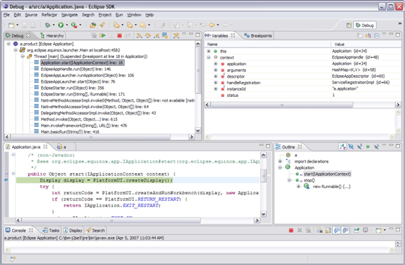

在可以调试项目前，需要干净地编译和运行代码。首先，需要为应用程序创建一个运行配置，确保应用程序可以正确启动。然后，需要通过 **Run > Debug** 菜单以类似的方式设置调试配置。还需要选择一个类，将它作为调试的主 Java 类来使用。您可以按照自己的意愿为单个项目设置多个调试配置。当调试器启动时（从 **Run > Debug**），会在一个新的窗口中打开，这时就可以开始调试了。

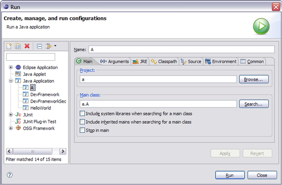

接下来，将讨论 Eclipse 中的一些常用调试实践。

**设置断点**

在启动应用程序进行调试时，Eclipse 会自动切换到 Debug 透视图。毫无疑问，最常见的调试步骤是设置断点，这样可以检查条件语句或循环内的变量和值。要在 Java 透视图的 Package Explorer 视图中设置断点，双击选择的源代码文件，在一个编辑器中打开它。遍历代码，将鼠标放在可疑代码一行的标记栏（在编辑器区域的左侧）上，双击即可设置断点。

现在，从 **Run > Debug** 菜单启动调试会话。最好不要将多条语句放在一行上，因为会无法单步执行，也不能为同一行上的多条语句设置行断点。

视图中左侧空白处的箭头指示当前正在执行的行

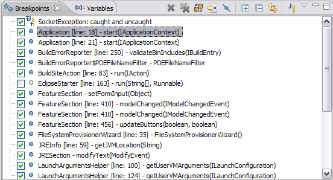

**条件断点**

一 旦了解到错误发生的位置，您可能想要知道在程序崩溃之前，程序在做什么。一种方法就是单步执行程序的每行语句。一次执行一行，直到运行到可疑的那行代码。 有时，最好只运行一段代码，在可疑代码处停止运行，在这个位置检查数据。还可以声明条件断点，它在表达式值发生变化时触发。除此之外，在输入条件表达式时，也可以使用代码帮助。

设置条件断点触发器

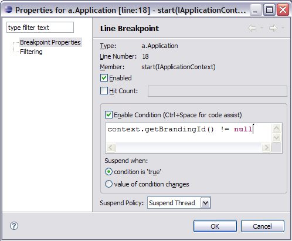

**计算表达式的值**

为了在 Debug 透视图的编辑器中计算表达式的值，选择设置了断点的那行代码，在上下文菜单中，通过 **Ctrl+Shift+I** 或右键单击您感兴趣的变量选择 Inspect 选项。在当前堆栈框架的上下文中会计算表达式的值，在 Display 窗口的 Expressions 视图中会显示结果。

**图 7. 通过 Inspect 选项计算表达式的值**

**剪切活动代码**

Display 视图允许您以剪切类型的方式处理活动代码。要处理一个变量，在 Display 视图中输入变量名即可，视图会提示您一个熟悉的内容助手。

Display 视图
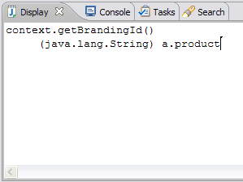

当调试器停止在一个断点处时，您可以从 Debug 视图工具栏（参见图 9）中选择 Step Over 选项，继续调试器会话。该操作会越过高亮显示的那行代码，继续执行同一方法中的下一行代码（或者继续执行调用当前方法的那个方法的下一行代码）。执行上一 步后发生改变的变量会用某种颜色高亮显示（默认是黄色）。颜色可以在调试首选项页面中改变。

**图 9. 改变颜色的变量**
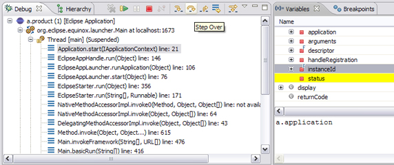

要在 Debug 视图中挂起执行线程，选择一个运行线程，单击 Debug 视图工具栏中的 **Suspend**。 该线程的当前调用堆栈就会显示出来，当前执行的代码行就会在 Debug 透视图中的编辑器中高亮显示。挂起一个线程时，将鼠标放在 Java 编辑器中的变量上，该变量的值就会在一个小的悬停窗口中显示出来。此时，该线程的顶部堆栈框架也会自动选中，其中的可视变量也会在 Variables 视图中显示出来。您可以通过单击 Variables 视图中合适的变量名来检查变量。

热交换错误修正：动态代码修正

如 果运行的是 Java 虚拟机（Java Virtual Machine，JVM）V1.4 或更高的版本，Eclipse 支持一个叫做热交换错误修正（Hotswap Bug Fixing）的功能，JVM V1.3 或更低的版本不支持该功能。该功能允许在调试器会话中改变源代码，这比退出应用程序、更改代码、重新编译、然后启动另一个调试会话更好。要利用该功能，在 编辑器中更改代码后重新调试即可。由于 JVM V1.4 与 Java 平台调试器架构（Java Platform Debugger Architecture，JPDA）兼容，所以才有可能具备该功能。JPDA 实现了在运行的应用程序中替换经过修改的代码的功能。如果应用程序启动时间较长或执行到程序失败的地方时间很长，那么这一点特别有用。

如果在完成调试时，程序还没有全部执行一遍，在 Debug 视图的上下文菜单中选择 Terminate 选项。容易犯的一个错误是在调试器会话中使用 Debug 或 Run，而不是 Resume。这样做会启动另一个调试器会话，而不是继续当前会话。

 

## DEBUG调试方式

1、 条件断点 
断点处点击鼠标右键 - 选择"Breakpoint Properties" 
勾选"Enabled" 启动断点 
勾选"Hit Count" 输入框写运行次数 
勾选"Enable Condition" 输入框写停止条件 

2、 变量断点 
变量也可以接受断点，在变量的值初始化，或是变量值改变时可以停止 
可以加条件，和上面条件断点的设置是一样的 

3、 方法断点 
方法断点的特别之处在于它可以打在 JDK的源码里 
由于 JDK 在编译时去掉了调试信息，所以普通断点是不能打到里面的 
但是方法断点却可以，可以通过这种方法查看方法的调用栈 

4、 改变变量值 
在Debug 视图的 Variables 小窗口中， 
可以在变量上右键，选择"Change Value..." 在弹出的对话框中修改变量的值 
或是在下面的值查看窗口中修改，Ctr+S 保存 

5、 重新调试 
这种调试的回退不是万能的，最多只能退回到当前线程的调用的开始处 
回退时，请在需要回退的线程方法上点右键，选择 "Drop to Frame" 

6、 远程调试 
用于调试不在本机上的程序 
连接时远程服务器时，需要在Eclipse中新建一个远程调试程序 

7、异常断点 
要找到异常发生的地方比较困难，还好可以打一个异常断点 
Breakpoints工具框顶右第四使用"增加Exception异常断点" 
当异常发生时，代码会停在异常发生处，定位问题时应该比较有帮助

 

***4.各种断点设置方法（实践篇）\***

大家肯定都用过Eclipse的调试的功能，在调试的过程中自然也无法避免要使用断点(breakpoint)，但不知是否对Eclipse中各类断点都有所了解。本篇图文并茂地介绍了Eclipse中全部类型的断点，及其设置，希望对大家有所帮助。(2011.11.20)

**1. 示例程序**
BreakpointDemo是一个臆造的应用程序，只是为了便于讲解Eclipse中各类断点的使用罢了。其代码如下图所示，
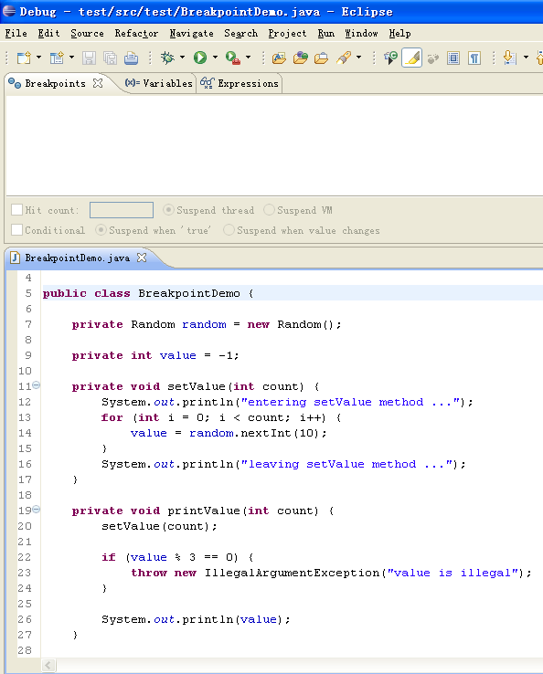
BreakpointDemo主要包含两个方法：
[1]setValue，该方法根据指定的次数(count)，对成员变量value进行赋值，值的范围为0-9的随机整数。
[2]printValue，该方法会调用setValue()对value进行赋值，并打印出value的值；但，如果value能被3整除，那么就会抛出IllegalArgumentException异常。

**2. Line Breakpoint**
Line Breakpoin是最简单的Eclipse断点，只要双击某行代码对应的左侧栏，就对该行设置上断点。此处，对第20行代码设置上Line Breakpoint，如下图所示，
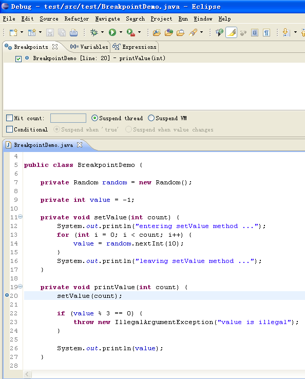 
可以为Line Breakpoint设置一个条件，那么当程序运行到该断点时，只有满足设定的条件，才会被中断。右键点击第20行的断点，选择"Breakpoint Properties..."
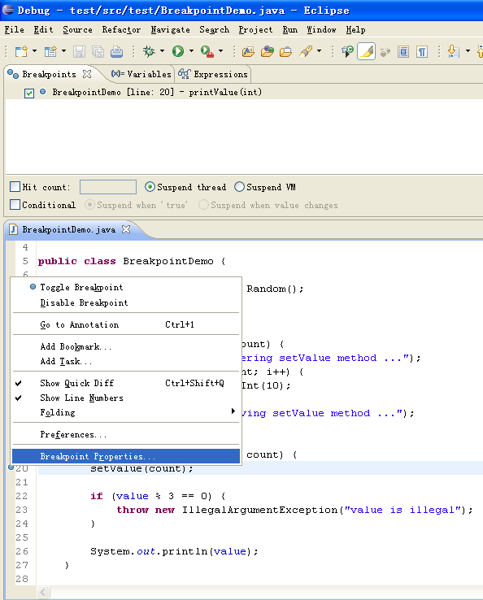 
在弹出的属性对话框中，勾选上"Conditional"，然后在文本框中输入"count % 2 == 0"。
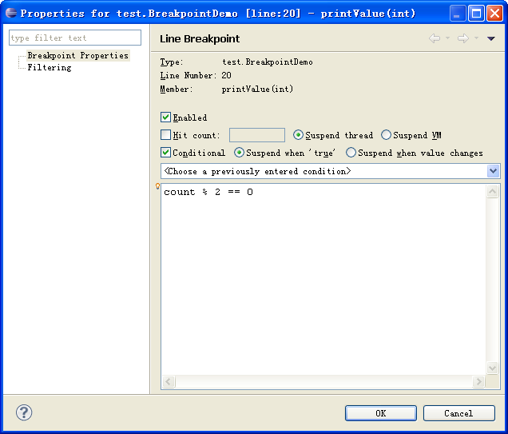 
该条件表示，当程序运行到第20行时，只有当count为偶数时，程序才会被中断。细心地话，你会发现该断点的图标发生了改变，多了一个问号。
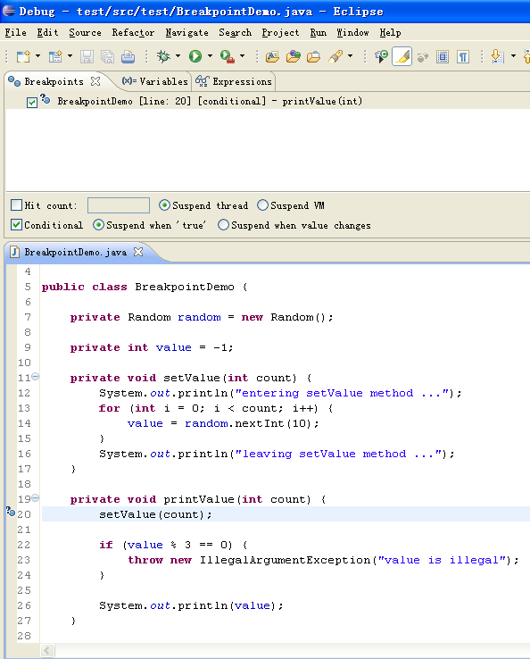 

**3. Watchpoint**
Line Breakpoint关注于程序运行的"过程"，大家也常把使用这种断点的调试称为单步调试。但有时候，我们对程序的运行过程不太了解，可能也不太关心，不能确定在什么地方设置断点比较合适，而可能比较关注某个关键变量的变化或使用。此时，就可以为该变量设置一种特殊的断点--Watchpoint。在此示例，我们最关心的就是成员变量value的值，那么就可以为它设置一个Watchpoint，双击第9行代码对应的左侧栏就可以了。
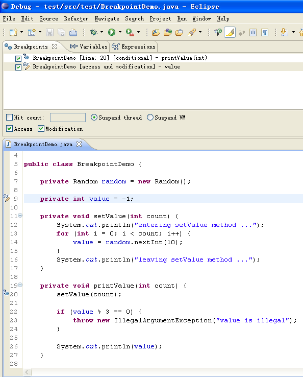 
使用在2中所提及的方法，查看该断点的属性，
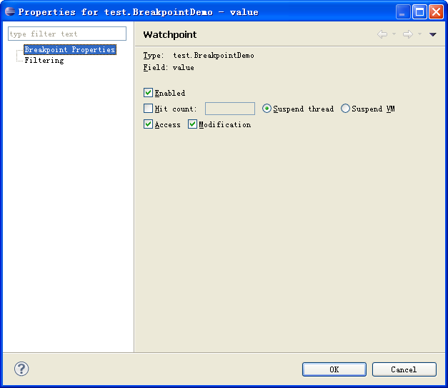 
默认地，当该变量被访问或它的值被修改时，程序都会被中断。但在本示例中，只希望当对value的值进行修改时程序才需要被中断，所以取消对"Access"的勾选。
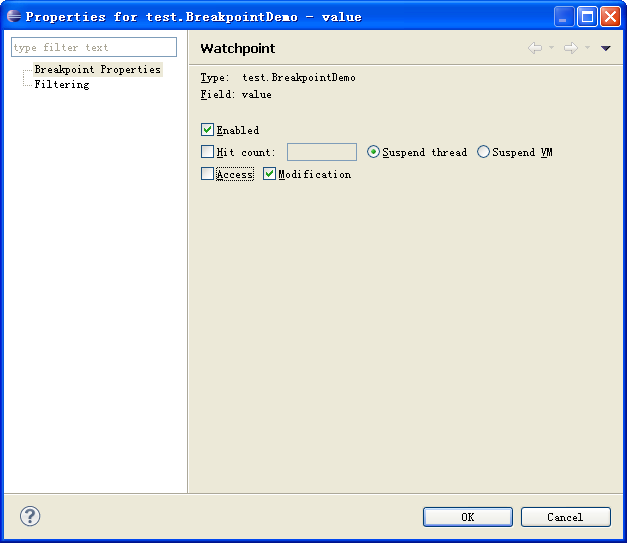 
这时，我们会发现原来的Watchpoin图标也有变化了。
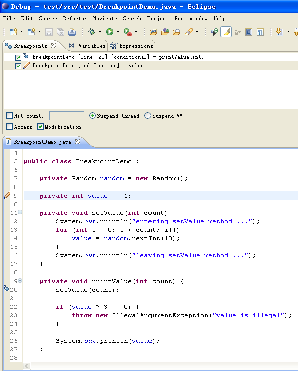 

**4. Method Breakpoint**
与关注对某个变量的访问与修改一样，我们也可以关注程序对某个方法的调用情况，即，可以设置Method Breakpoint。在此处，设置针对方法setValue的Method Breakpoint。同理，双击第11行代码对应的左侧栏即可。
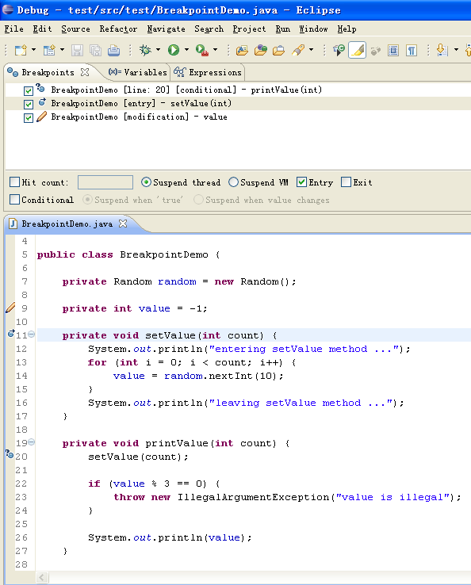 
仍然要查看该断点的属性。默认地，只勾选了"Entry"，而没有勾选"Exit"。
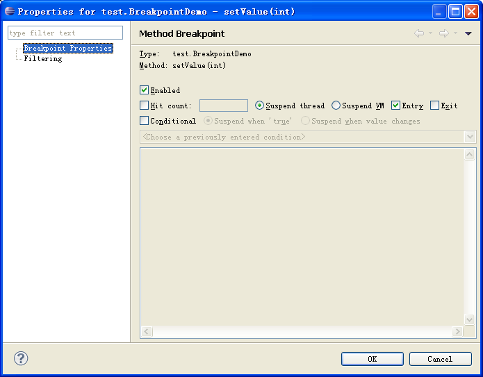
这表示，当刚进入该方法(调用开始)时，程序会被中断；而，离开该方法(调用结束)时，程序并不会被中断。在本示例中，需要同时勾选上"Exit"。
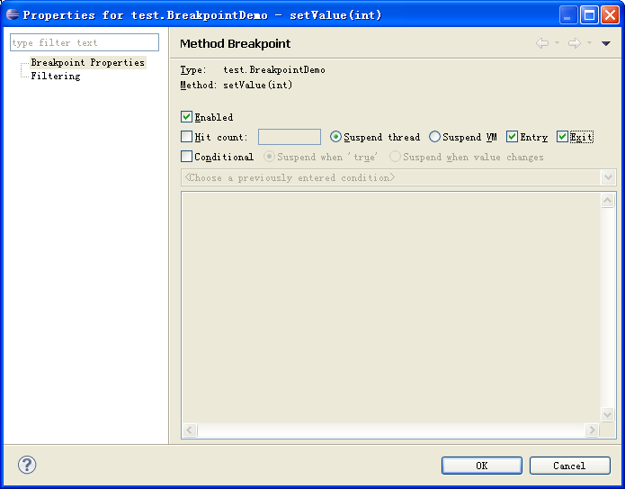
点击OK之后，可以看到该断点的图标也有所改变。
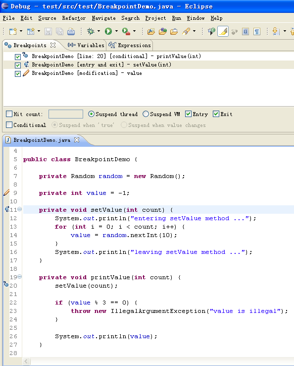 
根据这里的设置，当程序运行到第20行后会在第12行被中断，尽管这里没有显式的断点，但这就是setValue()方法的入口(Entry)。必须注意地是，程序在运行到第16行时不会被中断，尽管它看起来像是setValue()方法的出口(Exit)。实际上，程序会在第17行被中断，这里才是setValue()调用结束的地方。

**5. Exception Breakpoint**
如果，我们期望某个特定异常发生时程序能够被中断，以方便查看当时程序所处的状态。通过设置ExceptionBreakpoint就能达到这一目标。本示例故意在第23行抛出了IllegalArgumentException异常，我们期望程序运行到此处时会被中断。但我们不直接为此行代码设置Line Breakpoint，而是为IllegalArgumentException设置Exception Breakpoint。设置Exception Breakpoint的方法与其它类型断点都不同，它不能通过双击左侧栏的方式在代码编辑器上直接进行设置。点击Breakpoints视图右上角形如Ji的图标，
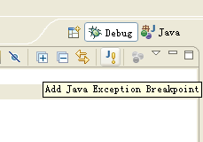 
会弹出如下所示的对话框，
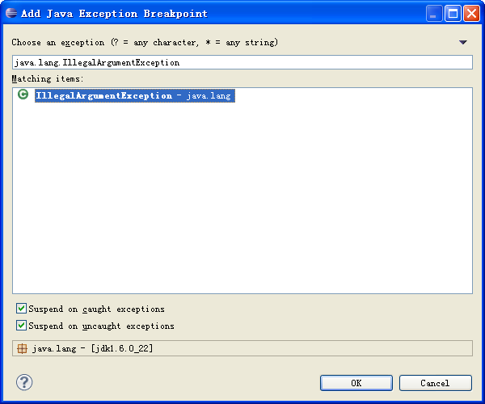 
在其中选中IllegalArgumentException，并点击OK，这时一个Exception Breakpoint就设置好了。
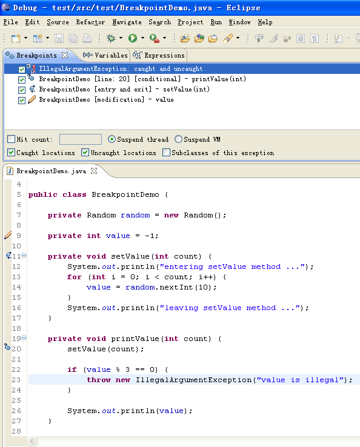

当value为3的倍数时，程序会在第23行被中断，这时我们就能使用调试器来看看value具体是等于0，3或6。

**6. Class Load Breakpoint**
还有一种大家平时可能不太用的断点--Class Load Breakpoint，即当某个类被加载时，通过该断点可以中断程序。
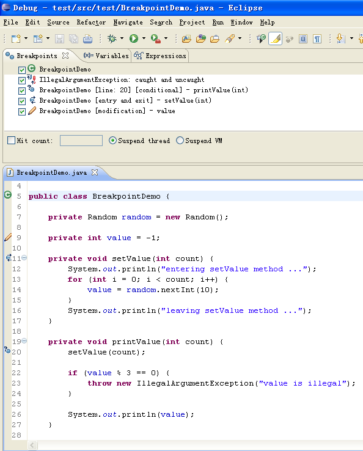