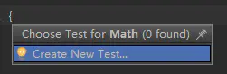

# JUnit4单元测试

> JUnit4主要目标便是利用Java5的Annotation特性简化测试用例的编写。JUnit单元测试框架由Erich Gamma和Kent Beck编写的一个回归测试框架（Regresion Testing Framework），主要用于Java语言程序的单元测试，目前使用的主流版本是JUnit以上版本。此测试框架可用于执行WebDriver的自动化测试框架。提供了一个断言机制，他能够将我们预期的结果和实际的结果进行比对，判断出是否满足我们的期望。
>
> 只要在import关键字后面加上static关键字，就可以把后面的类的static的变量和方法导入到这个类中，调用的时候和调用自己的方法没有什么区别。前面的类名就可以省略了，使用起来更加的方便。

## 构建

### 规范

**构建Maven项目**
直接添加相关的依赖

```xml
<dependency>
	<groupId>junit</groupId>
	<artifactId>junit</artifactId>
	<version>4.12</version>
</depende
```

测试代码和源代码在两个不同的项目路径下。创建一个和src同级别的文件夹叫test(逻辑代码放src里，测试代码放test里是个好习惯)。接着在IntelliJ IDEA里还要把这个test文件夹要设置成测试文件的根目录，右键选中Mark Directory As - Test Sources Root。

创建包名一致，类名在要测试的类名后加上Test也是个好习惯。

**所有测试方法返回类型必须为void且无参数**

一个测试方法之所以是个测试方法是因为@Test这个注解

绿色条说明测试通过，测试不通过显色红色条。

### 自动生成测试方法

IntelliJ IDEA是可以自动生成测试方法的基本结构的。第一种按快捷键`Ctrl+Shift+T`；第二种方法 鼠标右键点击类名 使用 goto-Test

弹出的对话框点击Create New Test...



选择JUnit4，类名和包名还是默认的已经符合规范了，然后勾选要生成测试方法的方法。点击OK。


## 执行顺序

JUnit4利用JDK5的新特性Annotation，使用注解来定义测试规则。
这里讲一下以下几个常用的注解：

- @Test：把一个方法标记为测试方法
- @Before：每一个测试方法执行前自动调用一次
- @After：每一个测试方法执行完自动调用一次
- @BeforeClass：所有测试方法执行前执行一次，在测试类还没有实例化就已经被加载，所以用static修饰
- @AfterClass：所有测试方法执行完执行一次，在测试类还没有实例化就已经被加载，所以用static修饰
- @Ignore：暂不执行该测试方法，同时，你可以为该标签传递一个String的参数，来表明为什么会忽略这个测试方法。比如：@lgnore(“该方法还没有实现”)，在执行的时候，仅会报告该方法没有实现，而不会运行测试方法。
- @RunWith：可以更改测试运行器org.junit.runner.Runner；指定用例的运行Runner，是用来**修饰类**的，而不是用来修饰函数的。只要对一个类指定了 Runner ，那么这个类中的所有函数都被这个 Runner 来调用
- Parameters：参数化注解


**解释一下：**

@BeforeClass和@AfterClass在类被实例化前（构造方法执行前）就被调用了，而且只执行一次，通常用来初始化和关闭资源。@Before和@After和在每个@Test执行前后都会被执行一次。@Test标记一个方法为测试方法没什么好说的，被@Ignore标记的测试方法不会被执行，例如这个模块还没完成或者现在想测试别的不想测试这一块。

构造方法根据@Test的方法被调用被执行了多少次。所以我这里要说明一下，JUnit4为了保证每个测试方法都是单元测试，是独立的互不影响。所以每个测试方法执行前都会重新实例化测试类。

最后关于这些注解还有一个要说明的就是，你可以把多个方法标记为@BeforeClass、@AfterClass、@Before、@After。他们都会在相应阶段被执行。

### @Test的属性

最后来说一下@Test的两个属性

- excepted
- timeout

@Test(expected=*.class)，通过@Test注解中的expected属性来指定异常类型；(expected = Exception.class)和fail("factorial参数为负数没有抛出异常")之间的配合。就是这个测试方法会检查是否抛出Exception异常（当然也可以检测是否抛出其它异常），如果抛出了指定异常那么测试通过（因为你的预期就是传进负数会抛出异常）。没有抛出异常则测试不通过执行fail("factorial参数为负数没有抛出异常")

然后说下timeout属性，这个是用来测试性能的，就是测试一个方法能不能在规定时间内完成。@Test(timeout = 2000)，单位：毫秒。测试不通过，且提示TestTimedOutException。

### @RunWith

执行多个测试用例的意义是将多个测试用例通过suite管理起来。作用是我们把测试类封装起来，也就是把测试类嵌套起来，只需要运行测试套件，就能运行所有的测试类了

- New一个Test Suite，点击Next
- 可以自定义需要执行的测试用例
- 点击Finish，生成代码如下：

 * ```JAVA
 /**
使用@Suite.SuiteClasses可以将多个测试类放到一起进行测试,也可以包含其他被@Suite.SuiteClasses标记的类
    以指定的顺序运行套件中的所有测试类。
   **/
   @RunWith(Suite.class)
    @Suite.SuiteClasses({MyTest001.class,MyTest002.class,MyTest003.class})
    public class AllTests {
    }
   ```
### 参数化设置

**参数化设置的几个步骤如下**

- 第一步：更改测试运行器为RunWith(Parameterized.class)
- 第二步：声明变量来存放预期值和输入值
- 第三步：声明一个返回值为Collection的公共静态方法，并使用@Parameters来进行修饰，这个方法必须是静态static的，并且返回一个集合Collection。
- 第四步：声明一个构造函数，并在其中为之声明变量赋值
- 第五步：声明测试函数

```java
@RunWith(Parameterized.class)   //第一步
public class ParameterTest {
    //第二步
    private int expected;
    private int input1;
    private int input2;
    //第三步
    @Parameters
	public static Collection<Object[]> t(){
        return Arrays.asList(new Object[][]{
                {5,1,4},
                {8,2,6}
        });
    } 
    //第四步
	public ParameterTest(int expected,int input1,int input2){
        this.expected=expected;
        this.input1=input1;
        this.input2=input2;
    }
    //第五步
    @Test
    public void testAdd(){
        assertEquals(expected, new Calcalate().add(input1, input2));
    }
}
```


## JUnit4断言

JUnit通过Assert类提供的静态方法来测试某些条件。这些断言语句通常是以assert开头。可以指定错误信息、预期结果和实际结果。断言方法将测试返回的实际值和预期值进行比较。如果比较失败，将抛出java.lang.AssertionError异常。

常用断言如下，[message]参数可选：

| fail([String message])                                       | 让测试方法失败。                                             |
| ------------------------------------------------------------ | ------------------------------------------------------------ |
| assertTrue([String message,] boolean condition)              | 检查布尔条件是否为true。对应方法名称assertFalse              |
| assertEquals([String message,] 多种类型 unexpected, 多种类型 actual) | 测试两个值是否相同。对应方法名称assertNotEquals。            |
| assertEquals([String message,] double/float expected, double/float actual, double/float delta) | 测试float或double值是否匹配。容差是必须相同的小数位数。对应方法名称assertNotEquals。 |
| assertNull([String message,] Object object)                  | 检查对象是否为空。对应方法名称assertNotNull。                |
| assertSame([String message,]Object expected, Object actual)  | 检查两个变量是否引用同一个对象。对应方法名称assertNotSame    |
| assertArrayEquals([String message,] 各种类型[] expecteds, 各种类型[] actuals) | 检查数组内容是否相同。                                       |
| assertArrayEquals([String message,] double/float[] expecteds, double/float[] actuals, double/float delta) | 检查double/float数组内容是否相同，指定容差范围。             |
| assertThat([String message, ]T actual, Matcher matcher)      | actual为需要测试的变量，matcher为使用Hamcrest的匹配符来表达变量actual期望值的声明。（其实内部调用的是org.hamcrest.MatcherAssert.assertThat） |