# Postman介绍

> 用户在开发或者调试网络程序或者是网页B/S模式的程序的时候是需要一些方法来跟踪网页请求的，用户可以使用一些网络的监视工具比如著名的Firebug等网页调试工具。今天给大家介绍的这款网页调试工具不仅可以调试简单的css、html、脚本等简单的网页基本信息，它还可以发送几乎所有类型的HTTP请求！**Postman**在发送网络HTTP请求方面可以说是Chrome插件类产品中的代表产品之一。
>
> > 主要特点特点：
>> 创建 + 测试：创建和发送任何的HTTP请求，请求可以保存到历史中再次执行
> > Organize：使用Postman Collections为更有效的测试及集成工作流管理和组织APIs
>> document：依据你创建的Collections自动生成API文档,并将其发布成规范的格
> > collarorate：通过同步连接你的team和你的API，以及权限控制，API库
>
> 贴上官网下载地址：[Postman | Download Postman App](https://links.jianshu.com/go?to=https%3A%2F%2Fwww.getpostman.com%2Fdownloads%2F)

------

## postman功能介绍

首先，看一下它的基础功能：

您可以在两种主要模式之间切换Postman：使用应用程序右下角或Web左上角的控件**构建**和**浏览**。在**构建**模式适用于API请求工作的主要接口。

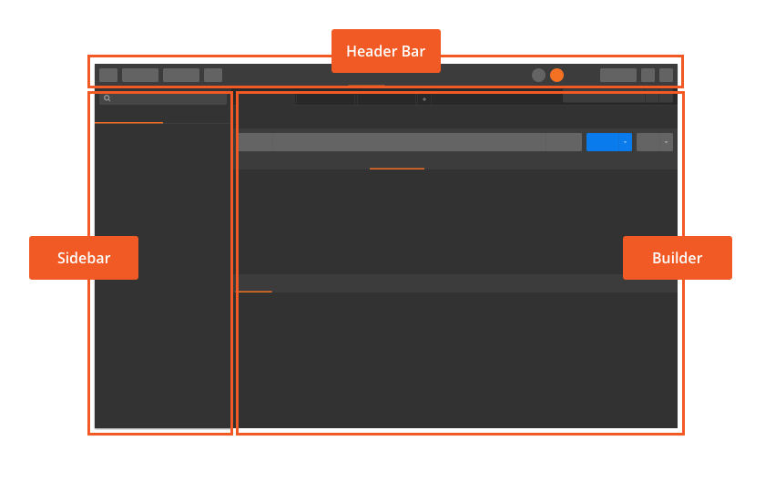

- 左侧边栏提供对请求历史记录，集合和API的访问。
- 标头允许您创建和导入请求和集合，访问集合运行器，将协作者移动和邀请到工作区，访问拦截器，查看同步状态/通知，打开设置，帐户和 Postman 计划。
- 中心区域是您构建和处理请求的地方。
- 底部的状态栏允许您显示/隐藏侧栏，查找和替换，并打开左侧的控制台。在右侧，您可以启动Bootcamp，在“ 构建”和“ 浏览”模式之间切换（在应用程序中-如果您在网络上，请使用左上角），切换窗格视图，打开键盘快捷键，并访问帮助资源。

**改变窗口**

- 可以拖动，以在Postman UI中调整窗格的大小。
- 使用右下角的按钮隐藏侧栏，并在单窗格视图和两窗格视图之间切换。

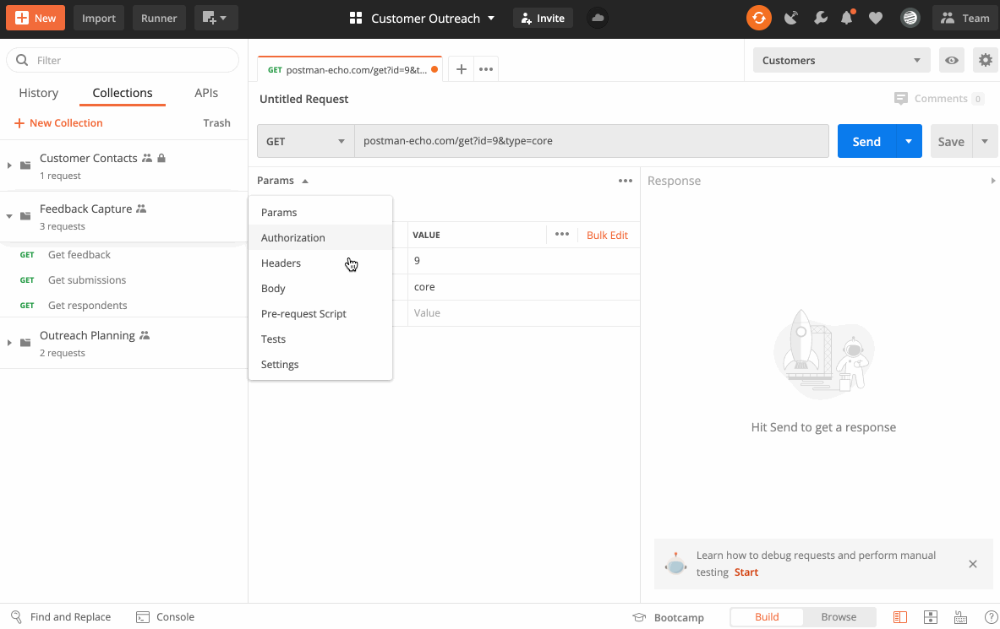

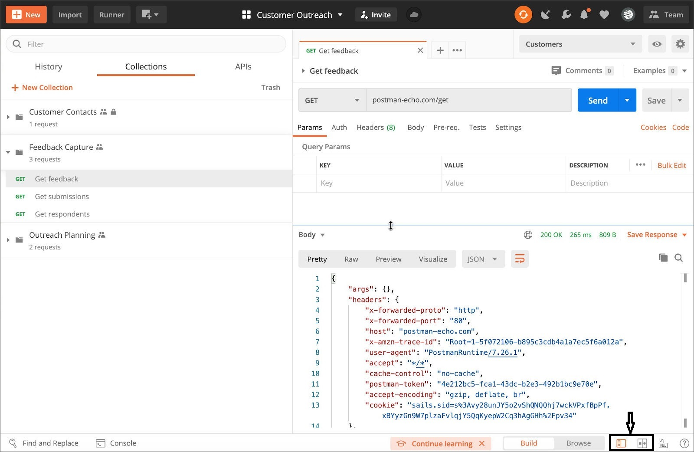

使用浏览器模式访问整个Postman workspace中的实体，并通过桌面应用程序连接到Postman Dashboard（如果在网络上使用Postman，请使用右下角的链接）。

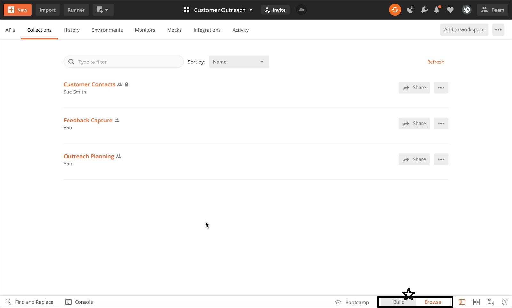

## 查找和替换

您可以通过单击Postman 左下角的**查找并替换(Find and replace)** 或使用键盘快捷键`Command + SHIFT + F`/ `Control + SHIFT + F`来搜索你的Postman workspace。

输入搜索字符串，还可以选择要返回的实体，并在必要时输入替换文本。

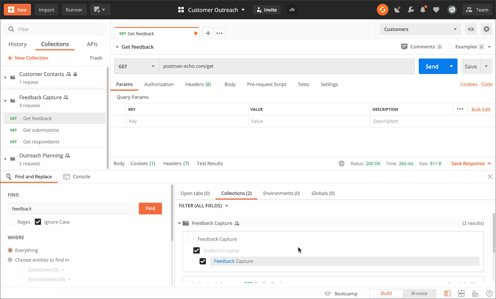

Postman将搜索选项卡(tabs)，集合和变量。您可以直接从搜索结果中单击以打开实体。

## 历史

您可以在“Postman”左侧的“历史记录”中访问您在Postman中提出的请求的**历史记录**。如果您登录了Postman帐户，则您的历史记录将在所有设备上同步。

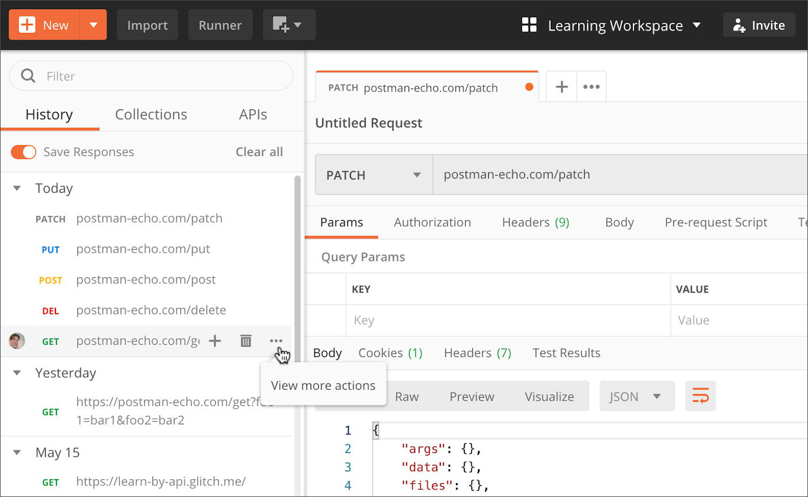

单击一个请求以再次打开它。单击**+**将请求保存到集合。切换“ **保存响应”**以保存请求响应，以便从历史记录中打开请求时可以查看该请求返回的内容。

使用**查看更多操作(View more actions)**菜单，可以保存，监视，记录或模拟请求。使用删除（垃圾桶图标）或清除所有选项从历史记录中删除请求。您可以通过按`Command`或`Control`单击请求来选择多个请求。

## 标签

您可以通过打开选项卡在Postman中发送请求----单击屏幕左上角的**+**，或按`Command/Control + T`。

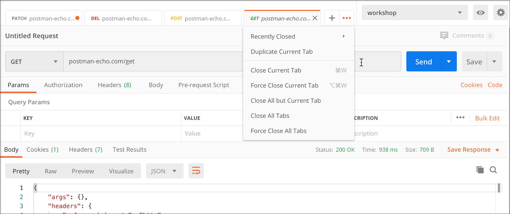

> 如果您打开一个请求并且不进行编辑或发送，而是打开另一个请求，则第一个选项卡将被第二个选项卡代替。该选项卡处于*预览(Preview)* 模式时，它将以斜体显示。

您可以在工作时同时打开多个标签，也可以拖动标签来重新排列它们。使用`...按钮`来管理标签并访问最近的标签。

> 复制标签并不意味着向同一端点创建第二个请求-复制标签时，所做的任何编辑都会影响原始请求。

Postman 将在所有未保存更改的选项卡上显示一个点。

如果您或协作者在另一个选项卡或工作区中更改了一个选项卡，则该选项卡可能表示冲突。Postman将提示您解决发生的任何冲突。

> 您可以在**设置中**切换 Postman 是否在新标签页中打开请求，也可以配置 Postman 在关闭未保存更改的标签页时是否提示您。

## Bootcamp

了解Postman的最佳方法是启动右下角的 **Bootcamp** 并完成课程。

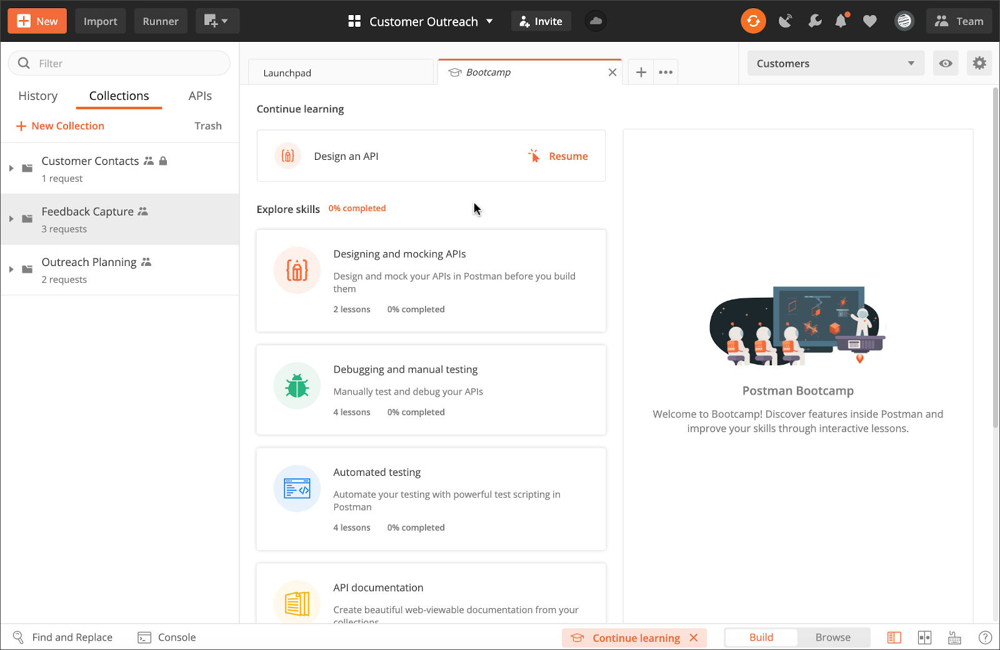

可以通过打开的启动板，来访问 Bootcamp 以及其他资源，入门资料和最新状态。如果没有打开的选项卡，则会看到一个按钮。

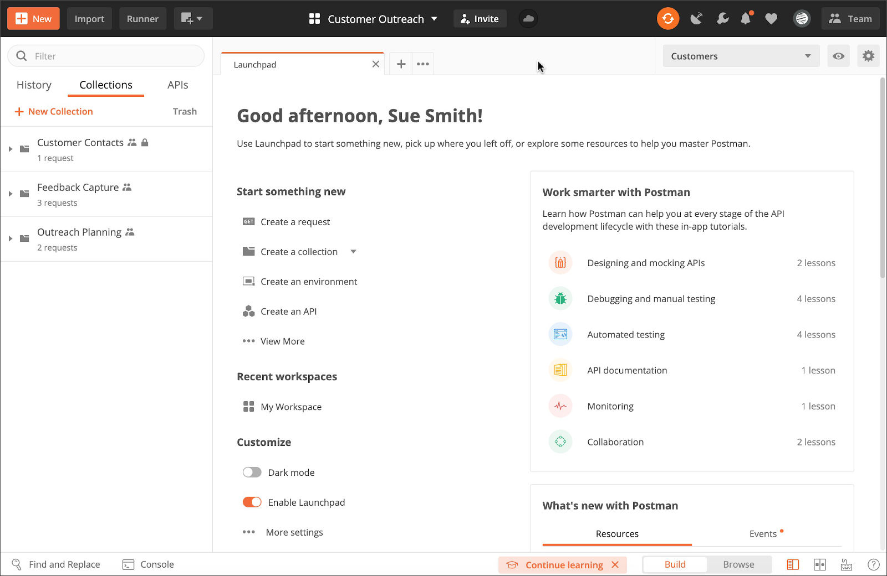

collections 在 postman 里面相当于一个文件夹，可以把同一个项目的请求放在一个Collection里方便管理和分享，Collection 里面也可以再建文件夹。

------

## 请求区域介绍

**1**   **Authorization：**身份验证，主要用来填写用户名密码，以及一些验签字段,postman有一个helpers可以帮助我们简化一些重复和复杂的任务。当前的一套helpers可以帮助你解决一些authentication protocols的问题。；

**2**  **Headers：**请求的头部信息

**3**  **Body：**post请求时必须要带的参数，里面放一些key-value键值对

**4**  **Pre-requerst Script:**可以让你在 请求之前自定义请求数据，这个运行在请求之前，语法使用JavaScript语句。

**5**  **tests：**tests标签功能比较强大，通常用来写测试，它是运行在请求之后。支持JavaScript语法。postman每次执行request的时候，会执行tests。测试结果会在tests的tab上面显示一个通过的数量以及对错情况。这个后面会进行详解，它也可以用来设计用例，比如要测试返回结果是否含有某一字符串

**6**  **form-data**：,它将表单数据处理为一条消息，以标签为单元，用分隔符分开。既可以单独上传键值对，也可以直接上传文件（当上传字段是文件时，会有Content-Type来说明文件类型,但该文件不会作为历史保存，只能在每次需要发送请求的时候，重新添加文件。）；post请求里**较常用的一种**

上传文件

**7**  **x-www-form-urlencoded**：对应信息头-application/x-www-from-urlencoded，会将表单内的数据转换为键值对；

**8**  **raw**：可以上传任意类型的文本，比如text、json、xml等,所有填写的text都会随着请求发送；

**9**  **binary**：对应信息头-Content-Type:application/octet-stream，只能上传二进制文件，且没有键值对，一次只能上传一个文件, 也不能保存历史，每次选择文件，提交；

## 发送第一个请求

让我们发送第一个API请求！

- 在左上角选择了**构建**。单击**+**加号按钮以打开一个新选项卡，命名。
- 在URL区域输入`postman-echo.com/get`。
- 点击**Send**按钮发送您的请求，您将在底部看到带有 JSON 数据的服务器响应。请注意，Postman已添加`postman-echo.com/get`在侧边栏的“ `History`”选项卡下。

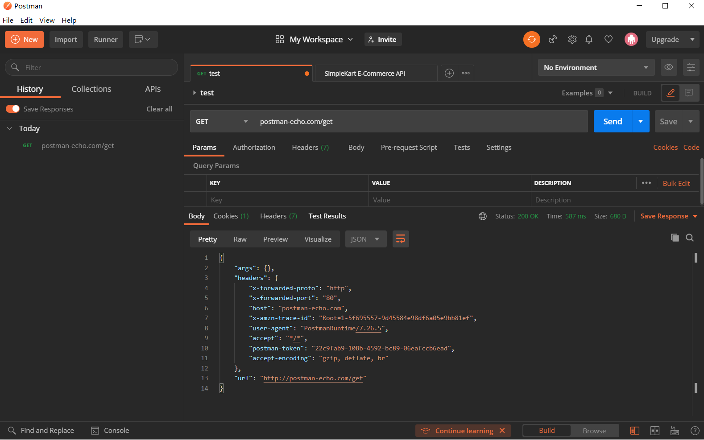

------

### 这个是如何工作的？

在Postman中，您可以发出API请求并检查响应，而无需使用终端或编写任何代码。创建请求并单击“ **发送”时**，API响应将显示在Postman用户界面内。

让我们来看一下下面简单的例子：

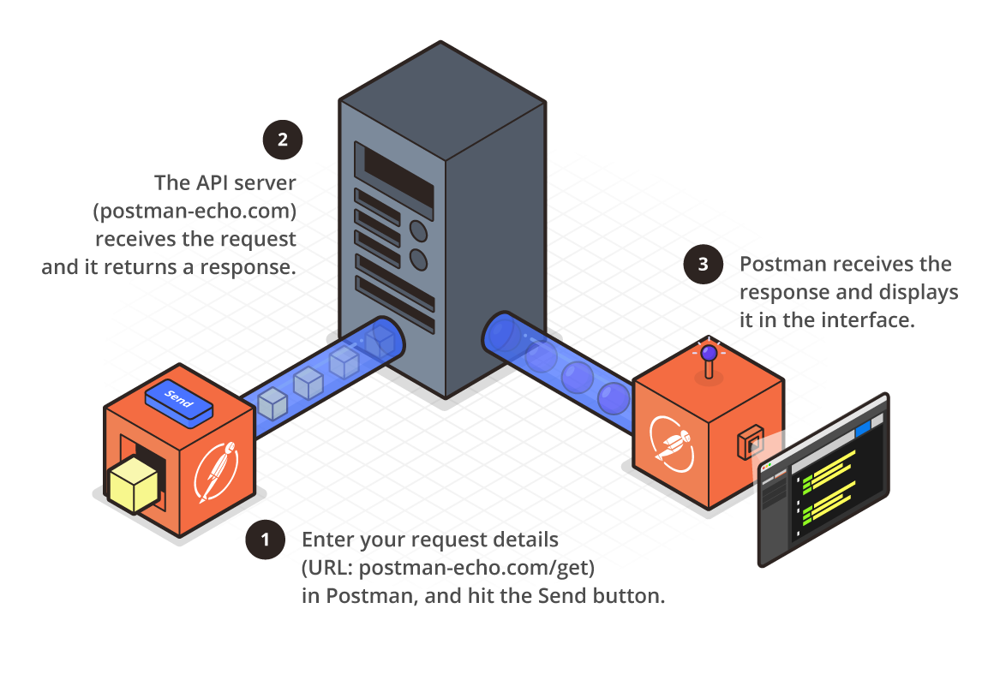

1. 在Postman中输入您的请求详细信息（URL ：`postman-echo.com/get`），然后点击**Send**按钮。
2. 请求由API服务器（`postman-echo.com`）接收，并返回响应。
3. Postman接收到响应，并在界面中显示响应。

------

##### Postman Echo

`postman-echo.com`是Postman主持的一个示例API，用于实验各种类型的请求。它将请求中发送的数据作为响应的一部分返回。

导入此样本集合，并参考[此示例API的文档](https://link.jianshu.com/?t=https://docs.postman-echo.com/)。

## 创建第一个集合（collections）

您在Postman发送的每个请求都显示在侧栏的“ **历史记录(History)**”选项卡下。小范围地，通过“历史（History）”部分重新使用请求很方便。但是，随着Postman的使用量化，您在历史记录中查找特定请求可能会变得很耗时。这就是Postman集合（collections）方便的地方。集合（collections）是保存请求的组合，是Postman最高级特性能建立的基石。

我们先来看看我们发送的第一个请求：

- 根据请求构建器中刚刚创建的请求，单击**保存（Save）**按钮以打开**保存请求(SAVE REQUEST)**模式。

- 作为可选步骤，输入新的请求名称。否则，默认名称将是请求URL。
- 作为可选步骤，以纯文本或使用 Markdown 输入请求描述。
- 现在，将此请求保存到现有集合，或通过输入集合名称创建新集合，然后单击**保存(Save)**。

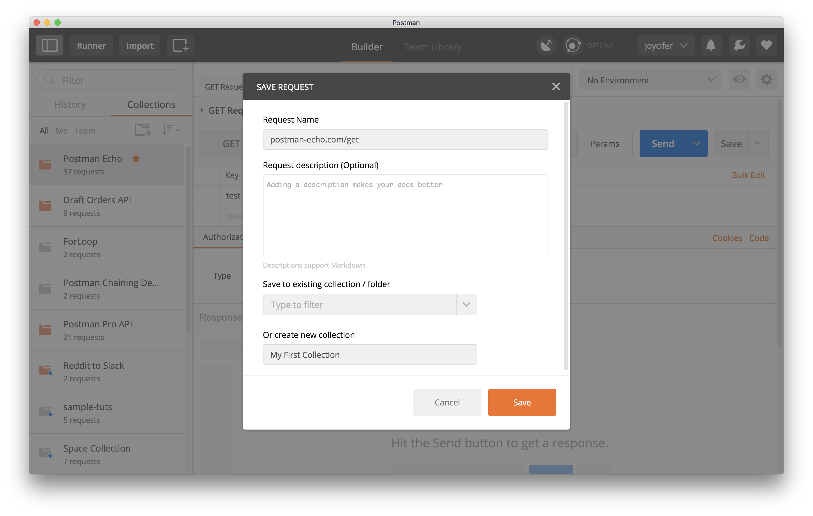

恭喜！您可以在左侧边栏的**集合(collections)**选项卡下查看所有集合。

# 发现模板

模板可帮助您了解Postman内部的API。您可以将模板导入Postman，以尝试各种请求类型和配置。除模板外，Postman API Network还包括可用于向流行的第三方API发出请求的集合。您可以在Web上或Postman内部访问API网络和模板。要浏览的网页，访问模板[explore.postman.com](https://explore.postman.com/)或点击**浏览**，在如果你在浏览器中使用它留下邮差的顶部。单击社区集合的**模板**，然后单击具有已发布API的团队的**API网络**。

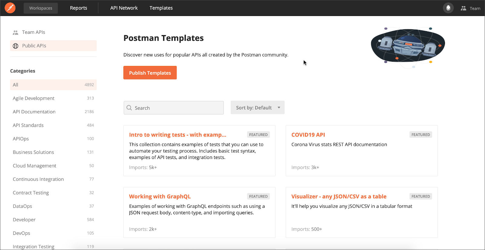您还可以通过选择左侧的**团队API**来访问作为团队专用API网络的一部分添加的所有集合。要在Postman桌面应用程序内查找模板，请点击左上方的**新建** > **模板**或**API网络**。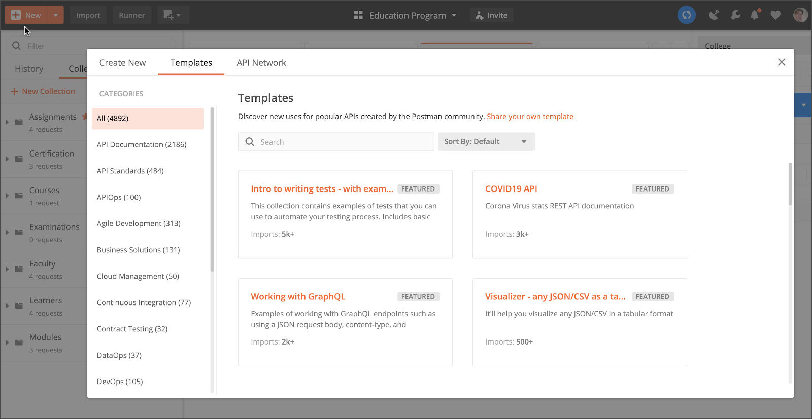您可以使用类别浏览或搜索您感兴趣的主题。选择一个API网络列表将显示团队的API和模板集合，您还可以从中打开文档或将其导入Postman。选择一个模板将显示其列表，其中包含其他详细信息，包括发布者。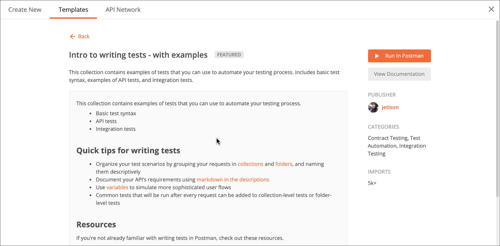如果要在模板中**查看**有关请求的更多详细信息，请单击**查看文档**。这将在浏览器中打开集合的docs页面，其中概述了其中的请求。要查看有关发布者的更多详细信息，请单击其用户名，这还将在浏览器中打开其个人资料，包括他们已发布的其他模板。要导入集合，请单击**“在邮递员中运行”**。这将导入您可以在Postman中使用和编辑的集合的本地副本。邮递员将显示通知以确认导入。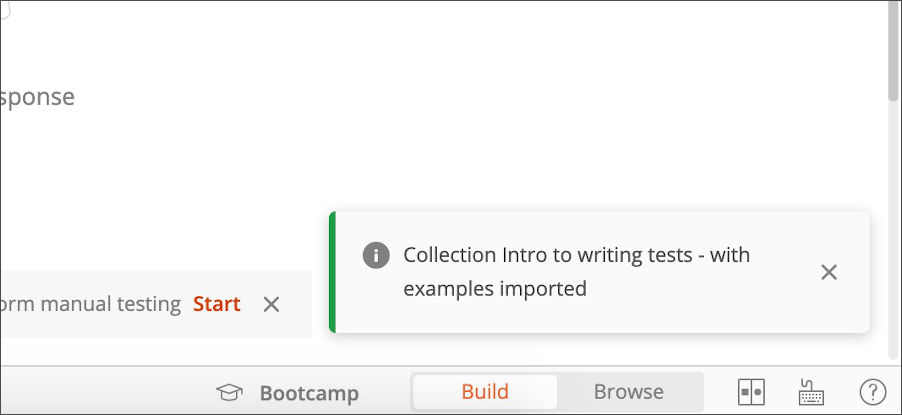该集合将显示在左侧的“ **集合** ”中。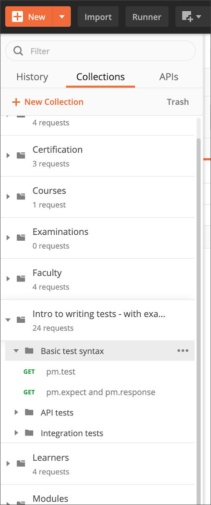打开集合，然后单击一个请求以将其打开。根据模板的不同，您可能可以立即**发送**请求并接收响应。[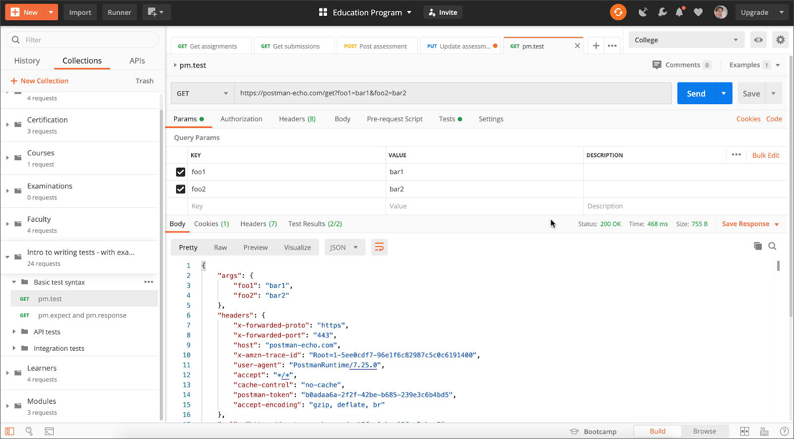](https://assets.postman.com/postman-docs/template-request-sent-response.jpg)您可以在集合的副本中编辑任何请求详细信息，并尽可能地在[自己的集合中](https://learning.postman.com/docs/getting-started/creating-the-first-collection/)**保存**更改以供将来使用。